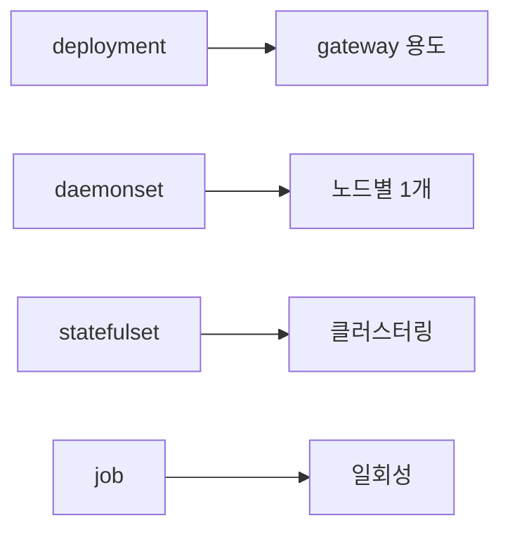

# Grafana Alloy

> **Grafana Agent의 후속**이자 **OpenTelemetry Collector의 distribution**.
> Static·Flow·Operator 세 종류의 Agent가 2025-11-01 EOL로 정리되었고,
> 2026 시점 Grafana Labs의 단일 수집기 표준은 **Alloy**다. River
> 문법 기반 컴포넌트 그래프, Prometheus·OTel·Loki·Pyroscope·Faro 신호를
> 한 바이너리에서, 클러스터링 + Fleet Management까지 통합한다.

- **주제 경계**: Alloy **자체**만 다룬다. OTel Collector spec 일반은
  [OTel Collector](../tracing/otel-collector.md), Prometheus 통합은
  [Prometheus·OpenTelemetry](../cloud-native/prometheus-opentelemetry.md),
  K8s 자동 계측은 [OTel Operator](../cloud-native/otel-operator.md),
  대시보드는 [Grafana 대시보드](grafana-dashboards.md), eBPF 관측은
  [eBPF 관측](../ebpf/ebpf-observability.md), Pyroscope eBPF agent
  통합은 [연속 프로파일링](../profiling/continuous-profiling.md).
- **선행**: [관측성 개념](../concepts/observability-concepts.md),
  [OpenTelemetry 개요](../cloud-native/opentelemetry-overview.md).

---

## 1. 한 줄 정의

> **Grafana Alloy**는 "OTel Collector를 fork·확장한 OSS 텔레메트리
> 수집기 distribution"이다.

- **OTLP 100% 호환** — OTel Collector의 모든 컴포넌트를 그대로 사용 가능
- 라이선스 **Apache 2.0**
- 4신호 (메트릭·로그·트레이스·프로파일) + Faro RUM
- **Alloy 문법** (구 River, HCL-like) — `.alloy` 파일에 컴포넌트를 선언

---

## 2. 왜 Alloy인가 — Agent → Alloy 전환 배경

| 기간 | 정체성 |
|---|---|
| 2020~2023 | **Grafana Agent Static** — Prometheus + Loki + Tempo lite 통합 단일 바이너리 |
| 2023 | **Agent Flow** 등장 — 컴포넌트 기반 그래프 (River 문법) |
| 2024-04 | **Alloy 1.0 GA** — Flow의 후속, OTel Collector fork 기반 |
| **2025-11-01** | **Agent (Static·Flow·Operator) EOL** — 모든 미래 작업은 Alloy |
| 2026 | Alloy가 Grafana Cloud Kubernetes Monitoring·Fleet Management 표준 |

> **즉시 마이그레이션 권장**: 2025-11 이후 Agent는 보안 패치도 안 받는다.
> 신규 도입은 무조건 Alloy.

### 2.1 Alloy vs OTel Collector vs Agent

| 측면 | Alloy | OTel Collector (vanilla) | Grafana Agent (legacy) |
|---|---|---|---|
| 설정 | **Alloy 문법** (`.alloy`) | YAML | YAML |
| 컴포넌트 | OTel + Prometheus + Loki + Pyroscope + Faro | OTel only (contrib에 일부) | Prometheus + OTel 일부 |
| 신호 | metrics·logs·traces·**profiles**·**RUM** | metrics·logs·traces·profiles (Alpha) | metrics·logs·traces |
| 클러스터링 | 빌트인 hash ring | 별도 LB exporter | 정적 sharding |
| 라이브 디버그 UI | yes | no (수동 zPages) | no |
| Fleet Management | Grafana Cloud 통합 | 외부 OpAMP | 외부 |
| 거버넌스 | Grafana Labs | OpenTelemetry SIG | Grafana Labs |
| 라이선스 | Apache 2.0 | Apache 2.0 | Apache 2.0 |

> **선택 기준**:
> - 단순한 OTLP 수집·전송이면 **OTel Collector** (벤더 중립이 1순위면)
> - Grafana Cloud·Mimir·Loki·Tempo 사용 + 다신호 통합 필요면 **Alloy**
> - K8s에서 Operator로 CR 관리하고 싶으면 [OTel Operator](../cloud-native/otel-operator.md) (Collector 사용) 또는 Alloy Helm chart

---

## 3. Alloy 문법 — 컴포넌트 그래프

```alloy
// prometheus.scrape: 메트릭 수집
prometheus.scrape "k8s_pods" {
  targets    = discovery.kubernetes.pods.targets
  forward_to = [prometheus.remote_write.mimir.receiver]
  scrape_interval = "30s"
}

// prometheus.remote_write: Mimir로 전송
prometheus.remote_write "mimir" {
  endpoint {
    url = "https://mimir.example.com/api/v1/push"
    basic_auth {
      username = sys.env("MIMIR_USER")
      password = sys.env("MIMIR_PASS")
    }
  }
}
```

### 3.1 핵심 개념

| 개념 | 의미 |
|---|---|
| **Component** | `<namespace>.<type> "<label>" { ... }` 형식. 단일 인스턴스 |
| **Argument** | 컴포넌트 입력 — 다른 컴포넌트의 export 참조 가능 |
| **Export** | 컴포넌트 출력 — `prometheus.scrape.k8s_pods.targets` 식으로 dot 액세스 |
| **Reference graph** | argument↔export로 자동 의존 그래프, 변경 시 부분만 reconcile |
| **Standard library** | 카테고리별 네임스페이스 — `sys.env`, `file.read`, `coalesce`, `array.concat`, `encoding.from_json` 등 |

### 3.2 OTel 컴포넌트도 자연스럽게

```alloy
otelcol.receiver.otlp "default" {
  grpc { endpoint = "0.0.0.0:4317" }
  http { endpoint = "0.0.0.0:4318" }
  output {
    traces  = [otelcol.processor.batch.default.input]
    metrics = [otelcol.processor.batch.default.input]
    logs    = [otelcol.processor.batch.default.input]
  }
}

otelcol.processor.batch "default" {
  output {
    traces  = [otelcol.exporter.otlp.tempo.input]
    metrics = [otelcol.exporter.otlp.mimir.input]
    logs    = [otelcol.exporter.otlp.loki.input]
  }
}
```

---

## 4. 컴포넌트 카테고리

| 네임스페이스 | 역할 | 예 |
|---|---|---|
| `prometheus.*` | 메트릭 — scrape, relabel, remote_write | `prometheus.scrape`, `prometheus.relabel`, `prometheus.remote_write` |
| `otelcol.*` | OTel Collector 모든 컴포넌트 | `otelcol.receiver.otlp`, `otelcol.processor.tail_sampling` |
| `loki.*` | 로그 | `loki.source.file`, `loki.process`, `loki.write` |
| `pyroscope.*` | 프로파일 | `pyroscope.scrape`, `pyroscope.ebpf`, `pyroscope.write` |
| `faro.*` | RUM | `faro.receiver` |
| `discovery.*` | 동적 타겟 SD | `discovery.kubernetes`, `discovery.consul`, `discovery.ec2` |
| `mimir.*` | Mimir rules sync | `mimir.rules.kubernetes` |
| `local.*` | 로컬 파일 | `local.file` |
| `remote.*` | HTTP·S3·Vault·K8s Secret fetch | `remote.http`, `remote.s3`, `remote.vault`, `remote.kubernetes.secret` |
| `import.*` | 외부 모듈 import (구 `module.*`, 1.0에서 rename) | `import.string`, `import.file`, `import.git`, `import.http` |

> **하나의 바이너리에서**: 위 모든 신호·소스가 같은 프로세스에서 동작.
> 예전 environment처럼 Promtail + Agent + tail-collector를 따로 돌릴
> 필요 없음.

---

## 5. K8s 배포 — Helm 표준

### 5.1 두 가지 chart

| chart | 용도 |
|---|---|
| **`grafana/alloy`** | Alloy 자체 — `.alloy` 설정 직접 작성 |
| **`grafana/k8s-monitoring`** | Alloy + Node Exporter + KSM + 표준 alloy config + Grafana Cloud 연동까지 한 번에 |

> **신규 K8s 모니터링 도입**: `grafana/k8s-monitoring` v4가 표준. cluster
> events·logs·metrics·traces가 단일 chart로. Grafana Cloud 외 Mimir/Loki
> 자체 호스팅도 endpoint만 바꿔 사용 가능.

### 5.2 controller.type — 4가지 모드



| mode | 사용 |
|---|---|
| **deployment** | gateway·중앙 처리 |
| **daemonset** | 노드별 metric·log·trace 로컬 수집 |
| **statefulset** | **클러스터링 활성** — `prometheus.scrape` 분산 등 |
| **job** | one-shot 작업 |

### 5.3 클러스터링

활성화는 두 단계 — **CLI/Helm 플래그로 클러스터 자체 켜기 + 컴포넌트
설정 파일에서 컴포넌트별로 켜기**.

```bash
# CLI
alloy run --cluster.enabled --cluster.join-addresses=alloy-cluster.observability.svc:12345 config.alloy
```

```yaml
# Helm values.yaml
alloy:
  clustering:
    enabled: true
controller:
  type: statefulset
  replicas: 3
```

```alloy
// 컴포넌트 설정 파일 — 분산하고 싶은 컴포넌트마다 활성
prometheus.scrape "k8s_pods" {
  clustering {
    enabled = true
  }
  targets    = discovery.kubernetes.pods.targets
  forward_to = [prometheus.remote_write.mimir.receiver]
}
```

| 측면 | 동작 |
|---|---|
| 활성화 | **CLI/Helm으로 클러스터 자체 ON + 컴포넌트마다 `clustering` 블록** |
| 메커니즘 | **memberlist + hash ring** — peer 자동 발견 |
| 분산 단위 | 컴포넌트별 — `prometheus.scrape`이 target을 hash로 분산 |
| controller.type | **StatefulSet 필수** — DaemonSet/Deployment는 peer identity 불안정해 권장 안 함 |
| 적합한 컴포넌트 | `prometheus.scrape`, `prometheus.exporter.*`, 일부 `pyroscope.scrape` |
| **호환 안 됨** | `otelcol.processor.tail_sampling` — trace ID 단위 LB가 별도 필요 |

> **OTel Operator의 Target Allocator와 비교**: 비슷한 문제(다중 수집기
> 의 target 중복)를 풀지만, Alloy는 **자체 hash ring**을 쓰고 별도 TA
> 컴포넌트가 필요 없다. ServiceMonitor·PodMonitor 직접 지원은 Alloy
> `prometheus.operator.servicemonitors` 컴포넌트로 보강.

> **cluster split brain 방지**: PodAntiAffinity + PodDisruptionBudget,
> memberlist port가 NetworkPolicy로 차단되지 않도록.

### 5.4 WAL persistent volume

`prometheus.remote_write` 컴포넌트는 backend 다운·네트워크 단절 시
**Write-Ahead Log**에 sample을 buffer한다. WAL이 휘발성이면 재시작
시 데이터 손실·중복.

| 항목 | 권장 |
|---|---|
| controller.type | StatefulSet (PVC 안정적으로 attach) |
| volumeClaimTemplates | 10~50Gi (트래픽 따라) |
| WAL 디렉터리 | `/var/lib/alloy/data` (디폴트), Helm `alloy.storagePath` |
| 종료 시 grace | `terminationGracePeriodSeconds: 60` — flush 여유 |

---

## 6. 라이브 디버그 UI

Alloy의 차별화 기능 — `:12345` (디폴트 포트)에 컴포넌트 그래프와
실시간 데이터 흐름을 시각화.

| 기능 | 설명 |
|---|---|
| **Graph view** | 모든 컴포넌트를 노드·엣지로 — 데이터 흐름 시각 |
| **Component detail** | 각 컴포넌트의 health·error·argument 값 |
| **Live debugging** | 실제 sample 데이터를 컴포넌트 통과 직후 확인 |
| **Reload status** | config 다시 읽기 + 이전 적용 결과 |

> **방화벽 안 뒤에서만**: UI는 인증 없음. 외부 노출 금지 — port-forward
> 또는 internal only.

> **`livedebugging` 활성화 필수 (Alloy 1.3+)**: 그래프 view는 디폴트지만
> 컴포넌트 통과 sample 데이터를 보려면 설정 파일에
> `livedebugging { enabled = true }` 명시. 디폴트 비활성 — 비용·메모리
> 보호 차원.

> **memory_limiter 권장 디폴트** (`otelcol.processor.memory_limiter`):
> `check_interval=1s`, `limit_percentage=80`, `spike_limit_percentage=25`.

---

## 7. Fleet Management — 다중 인스턴스 통합 관리

| 측면 | 내용 |
|---|---|
| 정의 | Grafana Cloud의 **Alloy 원격 관리** SaaS 기능 |
| 메커니즘 | OpAMP 표준 + Cloud 콘솔에서 config 편집·rollout |
| 그룹화 | 라벨 기반 (`environment=prod`) |
| 점진 rollout | percent·라벨 기반 |
| 헬스 보고 | 모든 Alloy 인스턴스의 컴포넌트 status·error |

> **OSS 자체 호스팅?**: 자체 OpAMP server를 띄우면 Alloy도 OpAMP 클라이언트로
> 연결 가능. 그러나 GA·UI 완성도는 Grafana Cloud 쪽이 앞서 있음. 다중
> 클러스터·다중 region 운영 + Cloud 약정이면 즉시 가치.

---

## 8. 마이그레이션 — Agent → Alloy

### 8.1 자동 변환기

```bash
# Static config → Alloy
alloy convert --source-format=static --bypass-errors agent.yaml \
  --output=config.alloy

# Flow → Alloy (거의 1:1)
alloy convert --source-format=flow flow-config.river \
  --output=config.alloy

# Promtail → Alloy
alloy convert --source-format=promtail promtail.yaml \
  --output=config.alloy

# Prometheus → Alloy
alloy convert --source-format=prometheus prometheus.yml \
  --output=config.alloy
```

### 8.2 단계적 전환

| 단계 | 활동 |
|---|---|
| 1 | 변환기로 기존 config 변환, 결과 review |
| 2 | dev 환경에 Alloy daemonset 배포 + 라이브 debug UI로 검증 |
| 3 | 메트릭 1주 dual write — Agent와 Alloy가 같은 백엔드로 |
| 4 | 백엔드에서 카운트·라벨·시계열 일치 확인 |
| 5 | Agent shutdown, Alloy로 단일화 |
| 6 | Grafana Cloud k8s-monitoring chart로 통합 (선택) |

> **Helm chart 마이그레이션 함정**: `grafana/agent` chart → `grafana/alloy`
> chart 전환 시 ConfigMap key·values structure가 다르다. Helm은
> in-place upgrade 안 됨 — uninstall + install이 표준.

---

## 9. 보안

| 영역 | 권장 |
|---|---|
| OTLP/HTTP·gRPC 외부 노출 | mTLS 또는 헤더 인증 |
| `:12345` UI | 외부 비노출, K8s NetworkPolicy로 차단 |
| Secrets | `local.file`·`remote.vault`·`remote.kubernetes.secret` — 코드에 secret 금지 |
| Pod Security | non-root, read-only filesystem, restricted profile |
| RBAC | `discovery.kubernetes` 사용 시 pods/nodes/services get·list·watch만 |
| 이미지 | digest pin, signed (cosign) |

---

## 10. 운영 함정

| 함정 | 결과 | 교정 |
|---|---|---|
| 클러스터링을 Deployment에 활성화 | peer identity 불안정, hash ring 깨짐 | StatefulSet |
| `discovery.kubernetes` 광범위 watch | API 부하, RBAC 노출 | namespace selector·label selector 명시 |
| Live UI를 외부 포트로 expose | 메트릭 라벨·secret 일부 가시 | port-forward 또는 internal NLB |
| Agent와 Alloy 동시 실행 (dual write 잊고) | 메트릭 중복 | dual write 한 시점 종료 |
| `prometheus.exporter.*` 컴포넌트를 모든 Alloy에 | 같은 host metric 중복 수집 | DaemonSet 1대만 |
| Fleet Management OSS와 SaaS 혼용 | drift | 한 채널 |
| 모듈(`import.git`)을 인증 없이 public 사용 | supply chain | private repo, signed |
| `clustering`을 root 블록으로 시도 | parse error | CLI/Helm 플래그로 활성화 |
| `prometheus.remote_write` WAL이 emptyDir | 재시작 시 데이터 손실 | StatefulSet + PVC |
| `otelcol.processor.tail_sampling` + Alloy 클러스터링 | trace 분산으로 결정 깨짐 | 별도 LB exporter stage |
| Helm chart in-place upgrade (Service selector immutable) | 업그레이드 실패 | uninstall + install |
| OOM-killed | 메트릭 단절 | resource limit + memory_limiter (otelcol.processor) |
| `clustering.enabled = true`만 켜고 component-level 비활성 | 분산 안 됨 | component마다 `clustering { enabled = true }` |
| 변환기 결과 그대로 적용 | Agent의 deprecated 동작 그대로 | review·튜닝 후 적용 |
| `relabel`로 라벨 폭발 | 카디널리티 폭증 | drop·keep으로 사전 필터 |
| HTTP server endpoint를 0.0.0.0 + 인증 없이 | 누구나 metric inject | bind interface 또는 mTLS |

---

## 11. 운영 체크리스트

- [ ] Agent EOL (2025-11-01) 이후 환경은 Alloy로 전환 완료
- [ ] config는 자동 변환기 결과를 1차로, 수동 review 2차로
- [ ] 클러스터링 필요 시 StatefulSet + component-level 활성
- [ ] Helm: 단일 collector면 `grafana/alloy`, k8s 통합이면 `grafana/k8s-monitoring`
- [ ] Live UI 비노출 (port-forward 또는 internal)
- [ ] memory_limiter / resource limit 설정
- [ ] discovery는 라벨·namespace selector로 좁힘
- [ ] secrets는 `local.file`·`vault` 컴포넌트, 코드에 평문 금지
- [ ] 컴포넌트 그래프를 PR diff에 포함 (Alloy `.alloy` 파일)
- [ ] `prometheus.remote_write` WAL은 PVC로 영속화
- [ ] `livedebugging { enabled = true }` 명시 후 라이브 데이터 디버깅
- [ ] Pyroscope eBPF·Faro RUM 활용 시 추가 RBAC·SecurityContext 점검
- [ ] OTel SemConv stable 속성으로 통일
- [ ] Fleet Management 또는 GitOps + Helm 한 채널로 통일
- [ ] 백업·DR — config repo + Cloud Fleet Management 보존

---

## 참고 자료

- [Grafana Alloy 공식 문서](https://grafana.com/docs/alloy/latest/) (확인 2026-04-25)
- [Agent → Alloy 전환 FAQ](https://grafana.com/blog/grafana-agent-to-grafana-alloy-opentelemetry-collector-faq/) (확인 2026-04-25)
- [Alloy on Kubernetes 설치](https://grafana.com/docs/alloy/latest/set-up/install/kubernetes/) (확인 2026-04-25)
- [Alloy Clustering](https://grafana.com/docs/alloy/latest/configure/clustering/) (확인 2026-04-25)
- [Alloy Configuration Components](https://grafana.com/docs/alloy/latest/reference/components/) (확인 2026-04-25)
- [`alloy convert` 마이그레이션 도구](https://grafana.com/docs/alloy/latest/reference/cli/convert/) (확인 2026-04-25)
- [Kubernetes Monitoring Helm chart v4](https://grafana.com/blog/kubernetes-monitoring-helm-chart-v4-biggest-update-ever-/) (확인 2026-04-25)
- [Grafana Fleet Management](https://grafana.com/docs/grafana-cloud/send-data/fleet-management/) (확인 2026-04-25)
- [Loki — Migrate to Alloy](https://grafana.com/docs/loki/latest/setup/migrate/migrate-to-alloy/) (확인 2026-04-25)
- [Grafana Agent EOL 공지](https://grafana.com/docs/agent/latest/) (확인 2026-04-25)
