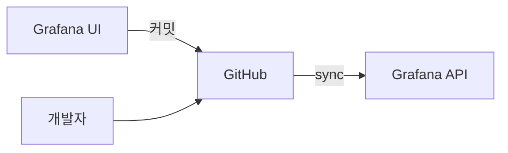
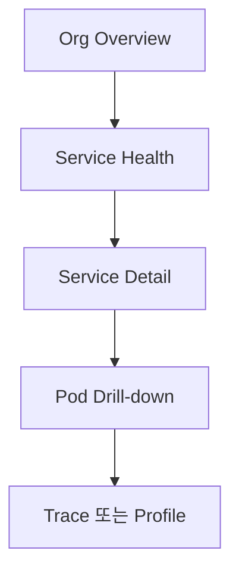

# Grafana 대시보드

> **시각화는 관측성의 손잡이.** 메트릭·로그·트레이스가 아무리 많아도
> 대시보드가 형편없으면 사고 시간이 길어진다. 이 글은 RED·USE 방법론,
> 패널·변수 표준, **Schema v2 + Git Sync (2026-04 GA)** 기반
> dashboards-as-code, 그리고 운영 시 자주 부딪히는 함정을 다룬다.

- **주제 경계**: Grafana **대시보드 자체**만 다룬다. 데이터 수집은
  [Grafana Alloy](grafana-alloy.md), Prometheus 측 쿼리는
  [PromQL 고급](../prometheus/promql-advanced.md), 알림은
  [알림 설계](../alerting/alerting-design.md), SLO 시각화는
  [Sloth·Pyrra](../slo-as-code/slo-rule-generators.md), 컴팩트한
  exemplar 표시는 [Exemplars](../concepts/exemplars.md).
- **선행**: [관측성 개념](../concepts/observability-concepts.md), 기본
  PromQL/LogQL/TraceQL.

---

## 1. 한 줄 정의

> **Grafana**는 "여러 데이터소스의 시계열·로그·트레이스를 통합 시각화하는
> OSS 대시보드 도구"다.

- 라이선스 **AGPLv3** (OSS), Grafana Cloud는 상용 SaaS
- 데이터소스: **80+** native (Prometheus·Loki·Tempo·Pyroscope·Elastic·CloudWatch·BigQuery 등)
- 버전 매핑 (2026-04 시점):
  - **Scenes 라이브러리**: 2023-09 GA, 11.x부터 대시보드 런타임으로 통합
  - **Dynamic Dashboards (Schema v2)**: **2026-04-08 GA**, Grafana 13에서 default ON
  - **Git Sync**: **2026-04-20 GA**, Grafana 13에서 출하 (12.x는 Public Preview)

---

## 2. 메소돌로지 — RED·USE·4 Golden Signals

| 모델 | 대상 | 메트릭 |
|---|---|---|
| **RED** (Tom Wilkie) | 요청 처리하는 서비스 | **R**ate, **E**rrors, **D**uration |
| **USE** (Brendan Gregg) | 자원 (CPU·메모리·디스크·네트워크) | **U**tilization, **S**aturation, **E**rrors |
| **4 Golden Signals** (Google SRE) | 서비스 전반 | Latency, Traffic, Errors, Saturation |

> **선택 기준**: 애플리케이션 서비스 = RED 우선. 인프라·자원 = USE.
> Latency·error만 자르는 단순 팀 = 4 Golden Signals. **셋 다 본질이
> 같다 — Errors는 어디서나 첫 번째**.

### 2.1 RED 패널 표준 레이아웃

서비스 1개 = 1 Row, Row 안에 3 패널:

| 행 | 패널 | 권장 시각화 |
|---|---|---|
| 서비스별 1행 | Rate · Error rate · p50/p95/p99 latency | time series (왼쪽 R/E, 오른쪽 D) |
| Saturation | CPU·Mem·Queue depth | time series (USE) |
| 의존성 | DB·외부 API latency·error | time series (RED 동일 형식) |

> **표준 색**: Errors는 **항상 빨강**. Rate은 파랑·초록 계열. Duration의
> p99는 진하게, p50은 연하게.

---

## 3. 패널 종류 — 언제 어느 것을

| 패널 | 적합 |
|---|---|
| **Time series** | 시계열 — 90% 케이스 |
| **Stat** | KPI 한 숫자 — 현재 SLO 잔여, 활성 세션 수 |
| **Gauge** | 임계값이 의미 있는 단일 값 — disk 사용량 |
| **Bar gauge** | 다수 값 비교 — top 10 namespace |
| **Table** | 라벨이 다양한 시계열 ranking, alert 상태 목록 |
| **Heatmap** | 분포의 시간적 변화 — histogram bucket |
| **Histogram** | 분포 (시간 무관) — latency distribution at point |
| **Logs** | Loki·Elastic 결과 표시 |
| **Traces** | Tempo·Jaeger 결과 |
| **Flame graph** | Pyroscope 등 프로파일 |
| **Geomap** | 지역 분포 |
| **State timeline** | discrete state — 호스트 up/down |
| **Status history** | discrete state의 timeline 격자 |
| **Pie chart** | 거의 안 씀 — 비율 비교는 Bar 우선 |
| **Canvas** | 자유 레이아웃 (ops display) |
| **Alert list** | 활성 alert 표시 |

> **anti-pattern**: **Pie chart로 시계열 보여주기**. 시간 차원을 잃는다.
> 시간 변화는 항상 time series.

---

## 4. 변수(Variable) — 동적 대시보드의 핵심

| 종류 | 용도 |
|---|---|
| **Query** | 데이터소스에서 동적 조회 — `label_values(up, job)` |
| **Custom** | 정적 리스트 — `prod,staging,dev` |
| **Text box** | 자유 입력 |
| **Constant** | 변하지 않는 값 (대시보드 배포 시 외부 매개) |
| **Data source** | 데이터소스 자체를 변수화 — 같은 대시보드 다중 클러스터 |
| **Interval** | 그룹화 시간 단위 — `$__interval` |
| **Ad hoc filters** | UI에서 사용자가 필터 추가 — Prometheus·Loki 등 |

### 4.1 PromQL `label_values` 패턴

```promql
# namespace 드롭다운
label_values(kube_pod_info, namespace)

# 선택된 namespace의 pod 드롭다운 — chained variable
label_values(kube_pod_info{namespace="$namespace"}, pod)

# 메트릭 이름 자체를 변수로
metrics(http_.*)
```

> **`$variable` vs `${variable}`**: 후자는 변수 옆에 추가 문자가 붙을 때
> 필수 (`${ns}_count` 등). 디폴트는 `$ns`.

### 4.2 multi-value·All의 함정

| 옵션 | 동작 |
|---|---|
| `Multi-value` | 다중 선택 가능 — PromQL `=~` 연산자로 OR 매핑 |
| `Include All option` | "All" 선택 시 모든 값. **`.*` regex** |
| Custom all value | "All" 클릭 시 명시 값 사용 — 큰 라벨 셋에서 카디널리티 폭주 방지 |

> **성능 함정**: `All` 디폴트는 `.*` regex라 **수만 series** 매칭.
> 대규모 환경은 Custom all value로 `prod-(web|api|worker)` 같은 좁은
> 범위로 강제.

### 4.3 chained variable

`namespace` → `pod` → `container` 식으로 위에서 아래로 좁혀가는 패턴.
부모 변수 변경 시 자식 변수 자동 재쿼리.

> **부작용**: 부모가 매우 많으면 자식 쿼리 폭증 → Grafana 자체가 느려짐.
> 대형 환경은 부모를 다중 선택 금지·`refresh: On Dashboard Load`로 제한.

---

## 5. Time range·Refresh·Interval

| 설정 | 권장 |
|---|---|
| Time range default | 일반: **1시간**. 서비스 헬스: 6h. Capacity: 7d |
| Refresh | 데이터 변경 빈도와 일치. 1시간에 한 번 바뀌는 데이터에 30s refresh = 낭비 |
| `Auto` interval | 줌 레벨에 맞춰 step 자동 결정 — 디폴트 권장 |
| `Min step` | scrape interval 이상 (Prometheus 15s, OTel push 60s) |
| Time zone | **UTC가 멀티리전 표준**. `Browser`(사용자 로컬), `UTC`, IANA TZ(`Asia/Seoul`) 중 명시 — `Browser`는 스크린샷 시각이 사람마다 달라 incident 분석 혼란 |

> **Auto interval 함정**: 줌 너무 좁히면 step이 1s 등 작아져 카디널리티
> 높은 쿼리 폭발. min step을 scrape interval과 같게 강제.

> **`min_refresh_interval` 가드레일**: 인스턴스 설정으로 사용자가 너무
> 짧은 refresh를 못 잡게 강제(`grafana.ini` `[dashboards]
> min_refresh_interval=10s`). 100명이 5s refresh 잡으면 백엔드가 죽는다.

---

## 6. 시각·룩앤필 표준

### 6.1 색

| 신호 | 색 |
|---|---|
| Errors / Failure | 빨강 |
| Warning | 주황 |
| OK | 초록 |
| Latency p50/p95/p99 | 연파랑·파랑·진파랑 그라데이션 |
| 다중 Service | 카테고리 팔레트 (10색 한도) |

### 6.2 단위

| 단위 | Grafana 지정 |
|---|---|
| 초 | `s` |
| 밀리초 | `ms` |
| 바이트 | `bytes` (IEC) 또는 `decbytes` |
| 퍼센트 (0-100) | `percent` |
| 퍼센트 (0-1) | `percentunit` |
| 요청/초 | `reqps` |

> **`percentunit` vs `percent`**: SLO 계산에서 0.999가 들어갈 때
> `percentunit` 아니면 0.0999%로 표시되어 무의미. 둘의 차이를 모르면
> SLO 패널이 깨진다.

### 6.3 thresholds·data links

| 기능 | 활용 |
|---|---|
| Thresholds | 색 변경, alert와 정합 |
| Data links | 패널 클릭 → 다른 대시보드/Tempo trace로 — drill-down 핵심 |
| Field overrides | 특정 series만 색·단위 다르게 |
| Value mappings | enum (0=down·1=up) → 텍스트 |

> **Data links로 RED → trace exemplar 점프**: latency 패널의
> `${__value.raw}`·`${__field.labels.trace_id}`를 Tempo URL로 — 클릭
> 한 번에 슬로우 요청의 trace 열림. Exemplar([Exemplars](../concepts/exemplars.md))
> 와 결합 필수.

### 6.4 Exemplar 표시 — 패널 단위 설정

| 단계 | 동작 |
|---|---|
| 1. 데이터소스 | Prometheus datasource 설정에서 Exemplars URL을 Tempo로 매핑 |
| 2. 쿼리 옵션 | 패널 query options에서 **Exemplars 토글 ON** |
| 3. 데이터 형식 | Prometheus가 exemplar를 보내려면 **OpenMetrics** exposition + storage `--enable-feature=exemplar-storage` |
| 4. data link | `${__data.fields.traceID}` 또는 `${__value.raw}`로 Tempo URL 구성 |

> **OTel `Exemplar` SDK 옵션**: SDK가 trace context 활성 시 자동으로
> exemplar 부착. `OTEL_METRIC_EXEMPLAR_FILTER=trace_based`(디폴트)로
> 샘플링된 trace의 sample만 부착해 카디널리티 절감.

---

### 6.5 디버깅을 빠르게 하는 옵션

| 옵션 | 활용 |
|---|---|
| **Shared crosshair** | 여러 패널의 시점이 마우스 따라 정렬 |
| **Tooltip mode = All** | 한 시점의 모든 series 값을 한 번에 |
| **Time shift / Time override** | 같은 패널에 "지난 주 동시간"을 겹쳐 회귀 비교 |
| **Library panels** | 표준 RED 패널을 여러 대시보드에서 공유 — 한 곳에서 수정하면 전파 |
| **`-- Dashboard --` datasource** | 한 대시보드 안에서 같은 쿼리 결과를 여러 패널이 재사용 — 백엔드 부하 절감 |
| **Transformations** | Join, Group by, Organize fields, Filter by name — 데이터소스에서 못 만드는 형태 |

> **Library Panel 권장 패턴**: "Service RED" 라이브러리 패널 1개 + 변수
> `$service`. 모든 서비스 대시보드가 이를 import → 패널 표준화 + 한 번
> 수정으로 전파.

---

## 7. Annotations — 사건 표시

| 종류 | 출처 |
|---|---|
| 빌트인 (`Annotations & alerts`) | Grafana alert state 변화 자동 표시 |
| 사용자 정의 (수동) | 운영자가 incident 시각 수동 |
| Query | 데이터소스에서 추출 — `kube_pod_status_phase` 변화 시 |
| Alert | Alertmanager·Grafana Alert 발생/해제 |

> **deploy annotation**: CI/CD가 배포 시 Annotation API로 push →
> "이 latency 회귀가 14:32 deploy 이후"가 시각적으로 명확. Argo·Spinnaker
> 의 표준 통합 패턴.

---

## 8. Dashboard Schema v2 + Git Sync (Grafana 13)

### 8.1 v1 vs v2

| 측면 | v1 (legacy) | **v2 (2026-04-08 GA, default ON in Grafana 13)** |
|---|---|---|
| 구조 | 단일 JSON, panel 안에 layout | **layout과 elements 분리** |
| Diff | 작은 변경도 큰 diff | git diff 친화적 |
| Dynamic dashboard | 제한적 | tab · repeat · conditional · auto-grid · section variables · show/hide rules |
| 호환 | API 그대로 | 13.x로 업그레이드 시 기존 대시보드 자동 마이그레이션 |

> **2026-04 시점 운영 권장**: Schema v2는 GA — Grafana 13으로 업그레이드
> 시 모든 신규/기존 대시보드가 v2로 전환된다. 12.x를 유지하는 환경은
> v1 그대로 사용 가능. **dashboards-as-code 라이브러리(Grafonnet 등)는
> v2 schema 출력 지원이 도구별 lag**가 있으므로 도구 버전을 점검.

### 8.2 Git Sync — Grafana 13에서 GA (2026-04-20)



| 동작 | 설명 |
|---|---|
| Save → Branch | UI에서 Save 시 PR 생성 가능 |
| Folder ↔ Repo path | folder마다 다른 repo 경로 매핑 |
| Pull request 통과 시 동기화 | merge → Grafana 인스턴스에 자동 적용 |
| 다중 인스턴스 | 같은 repo로 dev·staging·prod 동기화 |

> **이전 패턴과의 비교**: Terraform `grafana_dashboard`·grafana-operator
> ConfigMap·`provisioning/dashboards` YAML 등 5가지 방법이 있었다. Git
> Sync는 그중 가장 단순한 GitOps. 그러나 **Terraform·grafana-operator는
> 여전히 유효** — 멀티 환경·RBAC·datasource 함께 관리 시 우월.

### 8.3 dashboards-as-code 라이브러리

| 도구 | 언어 | 특징 |
|---|---|---|
| **Grafonnet** | Jsonnet | 표준. 라이브러리 풍부 |
| **grafana-foundation-sdk** | Go·Python·TypeScript | 타입 안전, 자동 완성 |
| **Terraform `grafana_dashboard`** | HCL | 인프라와 통합 |
| **grafana-operator** | K8s CRD | K8s 네이티브, `GrafanaDashboard` CRD |
| **Pulumi Grafana** | TS·Python | 코드 우선 |

> **선택 기준**: 단일 Grafana + GitOps = **Git Sync**. 멀티 환경 +
> datasource 통합 = **Terraform** 또는 **grafana-operator**. 복잡한
> 라이브러리 화 = **Grafonnet** 또는 **foundation-sdk**.

---

## 9. 대시보드 계층 — methodical drill-down



| 레벨 | 담는 것 |
|---|---|
| L1 — Org Overview | 모든 서비스의 SLO 현황, 배포 빈도, 활성 사고 |
| L2 — Service Health | RED 한 서비스, 의존성 health, 최근 변경 |
| L3 — Service Detail | 라우트별 latency·error, DB·캐시·외부 API 분리 |
| L4 — Pod/Container | 자원 USE, 로그 tail, 트레이스 진입 |

> **drill-down은 data link로**: 각 패널이 **하위 대시보드의 변수
> pre-fill**해서 점프. 사고 시 위→아래 1분 내.

---

## 10. 성능 — 대시보드가 무거워지는 이유

| 원인 | 증상 | 교정 |
|---|---|---|
| 패널이 30+ | 첫 로드 10s+ | row collapse, 5~15개로 분할 |
| `All` 변수 + `.*` | 카디널리티 폭증 | Custom all value |
| min step 미지정 | 줌인 시 step 1s | min step = scrape interval |
| Refresh 5s | 모든 사용자 query polling | 30s~1m, manual refresh 권장 |
| 큰 time range default | 7d 초기 로드 | 1h default + 사용자가 늘림 |
| Repeating panels (variable repeat) | N×panels = N²쿼리 | row repeat 권장, panel repeat 제한 |
| Mixed datasource panel | 직렬 쿼리 | 같은 datasource로 한 panel |
| Heatmap with high cardinality | 백엔드 폭주 | bucket 개수 제한 |

---

## 11. 권한·보안

| 영역 | 권장 |
|---|---|
| Org separation | 멀티 테넌트는 별도 Org 또는 RBAC 폴더 |
| Folder permission | 팀별 folder, edit 권한 분리 |
| Service Account | API 자동화는 SA + 토큰 (User token 금지) |
| Secrets in datasource | secure-json + cert-manager 또는 vault-injection |
| Externally shared dashboard (구 Public Dashboard) | 공유 시 별도 datasource 권한, query allowlist, time range lock 강제. PII 필터링·카운트만 |
| Anonymous viewer | `anonymous_enabled: true`는 내부 NLB·IP 제한 동시 |
| Audit log | Grafana Enterprise / Cloud — 변경 이력 추적 |

---

## 12. 대시보드 관리 — 운영 라이프사이클

| 단계 | 활동 |
|---|---|
| 생성 | 표준 템플릿 (RED/USE)에서 fork |
| 검토 | PR 리뷰, 패널 ≤ 15, variable lint |
| 승인 | 팀 owner의 approve, dashboard tag |
| 배포 | Git Sync 또는 Terraform plan/apply |
| 사용 | drill-down 효율 측정 (data link 사용 분석) |
| 갱신 | 분기마다 unused panel·dead query 제거 |
| 폐기 | 서비스 종료 시 archive (delete 직전) |

> **dead dashboard 90% 룰**: 도입 1년 후 대시보드의 70~90%는 거의 안
> 본다. 사용 분석(`grafana_users_active_per_dashboard` 또는 audit log)
> 으로 정기 청소.

---

## 13. 안티패턴

| 안티패턴 | 결과 | 교정 |
|---|---|---|
| 1 패널 = 50+ series | 차트 읽기 불가 | aggregation, top-K, group by |
| Pie chart로 시계열 | 시간 차원 손실 | time series |
| 같은 데이터를 5개 패널로 | 인지 부하 | 통합 또는 thresholds·overrides |
| `All` 변수 그대로 + `.*` regex | 카디널리티 폭증, 5분 query | Custom all value, multi-value 제한 |
| Refresh 5s + 30개 패널 | Grafana·백엔드 부하 | 30s~1m |
| latency p99만 표시 | tail 우측만 보고 평균 못 읽음 | p50·p95·p99 동시 |
| 단위 누락 (`requests`, `bytes`?) | 의미 모호 | unit 명시 (`reqps`·`bytes`) |
| 시간 zone 혼재 | incident timeline 혼동 | UTC 통일 |
| 손으로 만든 대시보드 100개 | 일관성 없음, 유지보수 폭발 | as-code, 표준 템플릿 |
| Annotations 없이 deploy 시각 추적 | 회귀 원인 불명 | CI/CD가 deploy annotation 자동 push |
| Grafana to PagerDuty 단방향 | 알림 후 dashboard 없음 | runbook URL을 alert label로, dashboard 자동 링크 |
| dashboards-as-code 도구 v2 schema 출력 미확인 채 13.x 업그레이드 | 라이브러리 출력이 v1 형식이라 마이그레이션 갭 | Grafonnet·Foundation SDK 버전 점검 후 업그레이드 |
| Pulumi/Terraform과 Git Sync 동시 사용 | drift 충돌 | 한 도구 선택 |
| Public dashboard에 user_id 라벨 | PII 노출 | aggregation·hashing |

---

## 14. 운영 체크리스트

- [ ] 메소돌로지 — 서비스는 RED, 자원은 USE 표준
- [ ] 1 dashboard ≤ 15 패널, drill-down 계층화
- [ ] 변수 `All`은 Custom all value, multi-value는 신중
- [ ] min step = scrape interval 이상
- [ ] data link로 패널 → 다른 대시보드 / Tempo trace 점프
- [ ] exemplar 활성, latency 패널 클릭 → trace
- [ ] CI/CD가 deploy annotation 자동 push
- [ ] dashboards-as-code (Git Sync · Terraform · Operator 중 하나)
- [ ] folder별 RBAC, 서비스 계정 토큰
- [ ] 분기 cleanup — unused panel 제거
- [ ] color: errors는 빨강, p99 진하게 표준
- [ ] 단위(`s`·`reqps`·`bytes`·`percentunit`) 명시
- [ ] Grafana 13 업그레이드 시 dashboards-as-code 도구의 v2 출력 호환 점검
- [ ] public dashboard는 PII 필터링
- [ ] Grafana 자체 메트릭(`grafana_*`) 모니터링 — slow query 대시보드

---

## 참고 자료

- [Grafana — Dashboard Best Practices](https://grafana.com/docs/grafana/latest/visualizations/dashboards/build-dashboards/best-practices/) (확인 2026-04-25)
- [Grafana — Variables](https://grafana.com/docs/grafana/latest/dashboards/variables/) (확인 2026-04-25)
- [Grafana — Variable Syntax](https://grafana.com/docs/grafana/latest/dashboards/variables/variable-syntax/) (확인 2026-04-25)
- [Grafana — Annotations](https://grafana.com/docs/grafana/latest/dashboards/build-dashboards/annotate-visualizations/) (확인 2026-04-25)
- [Grafana — Dashboard JSON schema v2](https://grafana.com/docs/grafana/latest/as-code/observability-as-code/schema-v2/) (확인 2026-04-25)
- [Grafana — Dynamic dashboards GA](https://grafana.com/whats-new/2026-04-08-dynamic-dashboards-is-now-generally-available/) (확인 2026-04-25)
- [Grafana — Git Sync 발표](https://grafana.com/blog/git-sync-grafana/) (확인 2026-04-25)
- [Grafana — Provisioning dashboards (Git Sync)](https://grafana.com/docs/grafana/latest/as-code/observability-as-code/provision-resources/provisioned-dashboards/) (확인 2026-04-25)
- [Grafana — Foundation SDK](https://grafana.com/docs/grafana/latest/as-code/observability-as-code/foundation-sdk/) (확인 2026-04-25)
- [Tom Wilkie — RED Method](https://www.weave.works/blog/the-red-method-key-metrics-for-microservices-architecture/) (확인 2026-04-25)
- [Brendan Gregg — USE Method](https://www.brendangregg.com/usemethod.html) (확인 2026-04-25)
- [Google SRE Book — Monitoring Distributed Systems](https://sre.google/sre-book/monitoring-distributed-systems/) (확인 2026-04-25)
- [grafana-operator — GrafanaDashboard CRD](https://grafana.github.io/grafana-operator/docs/examples/dashboard/) (확인 2026-04-25)
- [Grafonnet 공식](https://grafana.github.io/grafonnet/) (확인 2026-04-25)
