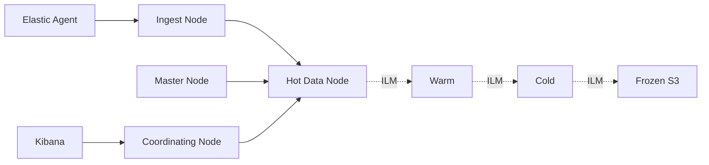
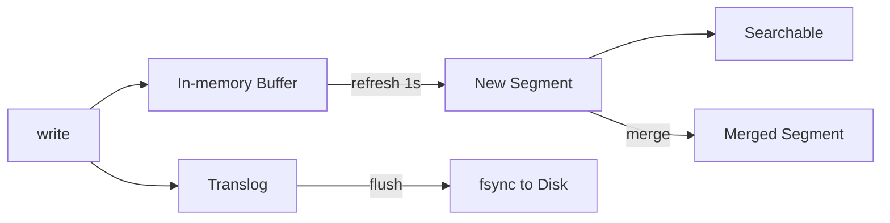
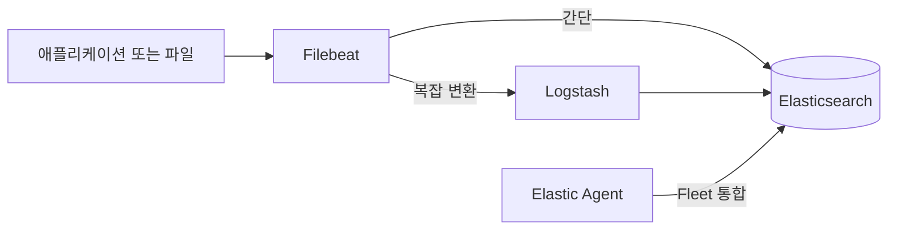

# Elastic Stack

> "검색 엔진을 로그 백엔드로 쓴다." 모든 단어를 역색인하기에 자유 검색은
> 압도적으로 빠르지만, 그 대가로 저장·CPU·운영 복잡도가 따라온다. 9.x의
> **logsdb 모드**와 **frozen tier**가 이 비용 곡선을 다시 그리는 중이다.

- **주제 경계**: 이 글은 **Elasticsearch·Kibana·Logstash·Beats·Elastic
  Agent의 실전 운영**을 다룬다. 라벨 기반 저비용 모델은 [Loki](loki.md),
  파이프라인 비교는 [로그 파이프라인](log-pipeline.md), 구조화·샘플링
  공통 정책은 [로그 운영 정책](log-operations.md) 참조.
- **선행**: [관측성 개념](../concepts/observability-concepts.md).

---

## 1. 한 줄 요약 — 무엇을 풀고 있는가

Elastic Stack은 **Lucene 기반 분산 검색 엔진**(Elasticsearch) 위에
시각화(Kibana), 변환 파이프라인(Logstash), 수집 에이전트(Beats·Elastic
Agent)를 얹은 통합 스택. 로그뿐 아니라 메트릭·트레이스·SIEM·전문 검색을
모두 떠받친다.

| 구성 | 역할 | 2026 위상 |
|---|---|---|
| **Elasticsearch** | 분산 검색·분석 엔진 | 9.x, Lucene 10 |
| **Kibana** | 시각화·관리 UI | 9.x |
| **Logstash** | 무거운 변환 파이프라인 | 운영 중, 신규는 Elastic Agent 권장 |
| **Beats** (Filebeat 등) | 경량 수집기 | 운영 중, 신규는 Elastic Agent 권장 |
| **Elastic Agent** | Fleet 통합 단일 에이전트 | **2026 권장** |

> 데이터 모델은 **document(JSON) + field mapping + inverted index**.
> Loki와 정반대로 **본문 전체를 토큰화해 색인**한다.

---

## 2. 라이선스 — 2024 회귀

Elastic은 2021년 SSPL/ELv2로 OSS 라이선스를 떠났고, AWS는 그 시점
Apache 2.0 버전을 포크해 **OpenSearch**(2021)를 만들었다. 2024-09 Elastic은
**AGPLv3**를 추가해 다시 오픈소스로 돌아왔지만, 두 프로젝트는 분기된 채
공존한다.

| 프로젝트 | 라이선스 | 비고 |
|---|---|---|
| Elasticsearch 9.x | **AGPLv3 / SSPL / ELv2** 3중 선택 | 2024-09 AGPL 추가 |
| OpenSearch 3.x | Apache 2.0 | 2025-04, Lucene 10 동시 채택 |

> **2026 의사결정**: 매니지드(Elastic Cloud / AWS OpenSearch Service) 선택
> 시 라이선스보다 운영 모델·기능 차이가 더 결정적. AWS 환경에서 SaaS형
> 단순화가 우선이면 OpenSearch, ML/Security 풍부한 통합 + ES|QL 조인이
> 필요하면 Elasticsearch.

---

## 3. 아키텍처 — 노드 역할의 분리

Elasticsearch는 단일 바이너리지만 **node role**로 책임을 분리해 운영한다.
프로덕션은 **역할별 dedicated 노드**가 표준.



| 역할 | 책임 | 권장 |
|---|---|---|
| **master** | 클러스터 상태·라우팅·shard 할당 | 3대 dedicated, voting only |
| **data_hot** | 최근 인덱스 active write·query | NVMe SSD, CPU 높음 |
| **data_warm** | 최근 query, write 종료 | SSD, 메모리 중 |
| **data_cold** | 거의 query 없음, full-restore 가능 | HDD·RAM↓ |
| **data_frozen** | searchable snapshot, S3 직접 query | 캐시 SSD만 |
| **ingest** | pipeline processor 실행 | data_hot과 분리 권장 |
| **coordinating** | 쿼리 라우팅·집계 | Kibana 앞단 |
| **ml** | ML 작업 전용 | enterprise tier |
| **transform** | 집계·rollup | 별도 |

> **권장 토폴로지**: master 3 dedicated + ingest 2~3 + hot/warm 데이터
> 노드 + frozen 노드. 작은 클러스터(노드 6대 이하)면 master·data 통합
> 가능하나 운영 안정성↓.

---

## 4. 인덱스 모델 — shard·document·mapping

### 4.1 shard 사이징

| 항목 | 기준 | 근거 |
|---|---|---|
| 1 shard 크기 | **10~50 GB** | 너무 작으면 메타데이터 부담, 너무 크면 recovery·rebalance 느림 |
| 1 shard 문서 수 | < 200M (권장) | Lucene 한계는 ~2.1B(`Integer.MAX_VALUE`)이나 운영 권장은 200M |
| 노드당 heap GB당 shard | < 20 | 노드 heap 보호 |
| 클러스터 총 shard 수 | < 수만 | master 부담 |

> **운영 1순위 함정**: 작은 인덱스를 **shard 5개 기본값**으로 만들면
> 1 KB 인덱스가 5 shard로 흩어진다. 데이터스트림 + ILM rollover로
> shard 크기를 능동 관리해야 한다.

### 4.2 mapping — explosion 방지

`dynamic: true`로 두면 신규 필드가 들어올 때마다 자동 매핑이 추가된다.
필드 폭증(특히 사용자 입력 nested JSON)으로 mapping 수만 개가 되면
master가 죽는다.

| 보호 | 기본 |
|---|---|
| `mapping.total_fields.limit` | 1000 |
| `mapping.depth.limit` | 20 |
| `mapping.nested_objects.limit` | 10000 |

> 운영 권장: **`dynamic: strict` 또는 `runtime`**. 알려진 필드만 인덱스에
> 추가하고 미지정 필드는 거부 또는 runtime field로.

### 4.3 logsdb 모드

logsdb는 **8.17(2025-01) GA**, **9.0(2025-04)부터 신규 `logs-*-*`
데이터스트림에 자동 적용**. 로그 워크로드에 특화된 sort·codec으로 저장
30~50% 절감.

- 자동 sort: `host.name`·`@timestamp` 기준 → 압축률 향상
- field-level 압축 codec
- 9.1에서 sort field 기반 custom routing 추가 → 추가 20% 감소

> **업그레이드 함정**: 8.18 이전에서 9.x로 올린 클러스터는 **기존
> `logs-*-*` 데이터스트림에 logsdb가 자동 활성화되지 않는다**. 인덱스
> 템플릿에서 `mode: logsdb`를 명시하고 rollover해야 적용. 신규 클러스터
> 만 자동.

---

## 5. ILM·데이터스트림 — 시간 기반 운영

로그는 시간이 지나면 가치가 떨어진다. **Index Lifecycle Management**가
이 단순한 사실을 자동화한다.

### 5.1 4단계 phase


| Phase | 쓰기 | 읽기 | 스토리지 |
|---|---|---|---|
| **Hot** | 활성 | 활성 | NVMe |
| **Warm** | 종료 | 자주 | SSD, replica↓ |
| **Cold** | 종료 | 가끔 | HDD·searchable snapshot 옵션 |
| **Frozen** | 종료 | 드물게 | **S3 직접 query** (compute/storage 분리) |
| Delete | — | — | — |

### 5.2 데이터스트림 + rollover

데이터스트림은 시간 기반 인덱스를 **하나의 논리 이름**으로 추상화한다.
rollover trigger:

- `max_primary_shard_size: 50gb` (권장 기본)
- `max_age: 30d`
- `max_docs: 200000000`

```yaml
# index template
data_stream: {}
template:
  settings:
    index.lifecycle.name: logs-policy
    index.number_of_shards: 1
    index.codec: best_compression
```

> **신규는 무조건 데이터스트림**. 옛 일자별 인덱스(`logs-2026.04.25`)는
> rollover로 대체. 단, 시계열 메트릭은 `time_series` data stream(TSDS)
> 모드를 따로 사용.

### 5.3 frozen tier — searchable snapshot

frozen은 **인덱스를 객체 스토리지(S3·GCS·Azure Blob)에 저장**하고 frozen
노드는 작은 로컬 SSD 캐시만 둔다. 결과:

| 항목 | hot | frozen |
|---|---|---|
| 저장 비용 | 핫 SSD | S3 표준 |
| 쿼리 latency | ms~s | 수십초~수분 (캐시 미스), hit도 hot의 10x |
| 스케일 | 노드 수 | 거의 무한 |

> **2026 운영 권장**: 30일 이내 hot, 30~90일 cold(searchable snapshot
> 동시 보관), 90일~ frozen, 365일 후 delete. SIEM은 컴플라이언스에 따라
> frozen 1~3년.
>
> **비용 함정**: frozen은 **S3 GET 요청 비용**이 storage를 추월할 수 있다.
> 대시보드를 frozen에 직결하면 반복 쿼리가 요청 비용으로 돌아온다. frozen
> 은 **ad-hoc 수사 전용**, 대시보드는 warm/cold까지만.

---

## 6. 인덱싱 파이프라인 — refresh·flush·translog·merge

write 측 운영 튜닝의 핵심. 정확한 모델을 모르면 indexing throughput이
왜 막히는지 진단할 수 없다.



### 6.1 refresh — 검색 가시성

- 기본 **1초**. 1초 후에 새 segment가 보이게 됨 (검색 가시화).
- write-heavy 운영(인덱싱 throughput 우선)에서는 `refresh_interval: 30s`
  나 `-1`(수동 refresh)로 늘려 인덱싱 처리량 2~5배 확보 가능.
- 단점: 데이터스트림이 1초 이내 검색 가능해야 하는 use case에 부적합.

### 6.2 translog — 내구성

- 모든 write는 **translog에 동기/비동기 fsync**.
- `index.translog.durability`: `request` (모든 요청 fsync, 안전·느림) /
  `async` (5초 주기, 빠름·5초 손실 가능).
- `index.translog.flush_threshold_size: 512mb` 도달 시 flush(=Lucene
  commit + translog 비우기).
- 운영 권장: **로그 워크로드는 `async`**, 결제·감사 데이터는 `request`.

### 6.3 segment merge

Lucene은 작은 segment를 백그라운드로 병합한다. 큰 인덱스 운영의 숨은
비용:

- merge가 무거우면 indexing latency·search latency 모두 spike.
- `index.merge.scheduler.max_thread_count` 기본값(NVMe면 무난, HDD는 1).
- **force_merge**: cold/warm 인덱스를 **1 segment로 재압축**해 디스크
  10~30% 절감 + search 빠름. ILM의 cold phase에서 자동 실행 권장.
- 활성 hot 인덱스에 force_merge 절대 금지 — 클러스터 멈춘다.

### 6.4 shard recovery·rebalance

노드 재시작·교체 시 shard 복구 throttle:

| 노브 | 의미 |
|---|---|
| `indices.recovery.max_bytes_per_sec` | recovery 대역폭 (기본 40 MB/s) |
| `cluster.routing.allocation.node_concurrent_recoveries` | 동시 recovery 수 |
| `cluster.routing.rebalance.enable` | rebalance on/off |
| `cluster_concurrent_rebalance` | 동시 rebalance shard 수 |

> **운영 함정**: 큰 클러스터에서 노드 1대 교체 시 기본 40 MB/s로는 수 시간
> 걸려 yellow 상태 지속. 임시로 200 MB/s까지 올렸다가 복귀.

---

## 7. Lucene과 검색

### 7.1 inverted index

각 필드의 토큰을 → 문서 ID 리스트로 매핑. Loki와 정반대로 **본문 전체가
인덱싱**된다. 따라서:

- 인덱스 크기가 원본의 **30~80%** 추가됨
- analyzer·token filter 선택이 저장·검색 모두에 즉시 영향
- merge·refresh가 끊임없이 발생 (segment 압축)

### 7.2 Lucene 10 (9.x 동반)

- 벡터 검색 가속 (kNN, BBQ — Better Binary Quantization)
- 압축·정렬 codec 효율 향상
- block-based scoring으로 top-K 쿼리 빠름
- **호환성**: Lucene 10은 9.x segment를 read-only로만 지원, write 불가.
  메이저 업그레이드는 reindex 트리거 가능.

### 7.3 비용 곡선

| 워크로드 | 적합 |
|---|---|
| 자유 텍스트 검색 (사고 헌팅, SIEM) | **Elastic 압도적** |
| 라벨로 좁힐 수 있는 K8s 로그 | Loki가 비용 1/10 |
| 집계·분석 | Elastic / ClickHouse |
| 트레이스 ID 단건 조회 | Elastic·Loki 비슷 |

---

## 8. 수집 — Beats·Logstash·Elastic Agent

### 8.1 셋의 자리



| 도구 | 무게 | 역할 |
|---|---|---|
| **Filebeat** (Beats) | 경량 (Go) | 파일·컨테이너 로그 수집·전송 |
| **Logstash** | 무거움 (JVM) | 풍부한 filter·transform·다중 output |
| **Elastic Agent** | 통합 (Go + Beats 내장) | **Fleet 중앙 관리**, 모든 신호 |

### 8.2 2026 권장

- **신규 도입**: **Elastic Agent + Fleet**. 이전의 Beats별 모듈을 통합
  관리, 정책을 중앙에서 push. Filebeat 모듈은 여전히 지원되지만 신규 작업
  은 Agent integration으로.
- **Logstash 유지 가치**: ① 매우 복잡한 grok·ruby filter, ② 여러
  output(ES + Kafka + S3 동시), ③ DLQ·persistent queue, ④ 기존 자산.
- **Logstash 정식 deprecation은 없음**. 다만 신규 use case에서 Elastic
  Agent + ingest pipeline + ES|QL 조합으로 대체되는 경우가 많다.

### 8.3 ingest pipeline — Elasticsearch 내부 변환

ingest 노드에서 Logstash와 유사한 processor 체인을 **Elasticsearch 내부**
에서 실행한다. grok·dissect·set·remove·script(Painless) 등.

```yaml
processors:
  - grok: { field: message, patterns: ["%{COMMONAPACHELOG}"] }
  - date: { field: timestamp, formats: ["dd/MMM/yyyy:HH:mm:ss Z"] }
  - remove: { field: timestamp }
```

> **간단한 변환은 ingest pipeline**, **복잡·다중 output은 Logstash**.
> 둘이 배타적이지 않고 같이 쓴다.

### 8.4 OTel·ECS 수렴

두 갈래의 통합 경로:

| 경로 | 기술 |
|---|---|
| Collector → ES | OTel Collector contrib `elasticsearch` exporter |
| OTel 직수신 | Elasticsearch가 8.16+에서 **OTLP receiver 내장** |

**ECS (Elastic Common Schema)**는 2023년 OTel에 기여되어 OTel Semantic
Conventions와 **양방향 매핑**된다. 9.x의 `ecs@mappings` 인덱스 템플릿이
OTel 수신 시 자동 ECS 필드로 정규화. 즉 OTel SemConv로 표준화하면 Elastic·
Loki·Tempo 모두에 호환.

자세한 흐름은 [로그 파이프라인](log-pipeline.md), 필드 표준화는
[로그 운영 정책](log-operations.md) 참조.

---

## 9. 쿼리 — Query DSL·KQL·ES|QL

| 언어 | 위치 | 용도 |
|---|---|---|
| **Query DSL** | JSON | API 직접, 풀 표현력 |
| **KQL** | Discover·Lens 검색창 | 사람용 단순 표현 |
| **ES|QL** | 9.x 1급 시민 | SQL 유사, JOIN 가능, 파이프 |

### 9.1 ES|QL — 2026 신무기

```esql
FROM logs-*
| WHERE @timestamp > NOW() - 1h
| WHERE log.level == "ERROR"
| STATS count = COUNT(*) BY service.name
| SORT count DESC
```

- **Lookup Join** (9.x preview): 다른 인덱스로 enrichment.
- 파이프 모델로 가독성↑, Discover에서도 ES|QL이 기본.
- Kibana Lens·Discover의 표준 언어 자리매김.

### 9.2 KQL — 일상

`log.level: ERROR AND service.name: "checkout"`. Discover/대시보드용.
복잡한 집계는 ES|QL.

### 9.3 Query DSL — API·자동화

```json
{
  "query": {
    "bool": {
      "must":   [{ "match": { "log.level": "ERROR" }}],
      "filter": [{ "range": { "@timestamp": { "gte": "now-1h" }}}]
    }
  }
}
```

대시보드·외부 시스템 적재는 여전히 Query DSL.

---

## 10. Kibana — 단일 UI

| 영역 | 기능 |
|---|---|
| **Discover** | ad-hoc 검색·필드 탐색, ES|QL 통합 |
| **Lens** | 드래그앤드롭 시각화 |
| **Dashboard** | 위젯 조합 |
| **Alerting** | 룰·커넥터 (Slack, Webhook, PagerDuty) |
| **Observability** | APM·logs·infra·SLO 통합 뷰 |
| **Security (SIEM)** | rule engine, timelines, ML jobs |
| **Stack Management** | ILM·인덱스 템플릿·룰·역할 관리 |
| **Fleet** | Elastic Agent 정책·integration |
| **Spaces** | 멀티테넌시·RBAC |

> **운영 함정**: Kibana 단일 인스턴스로 시작했다가 동시접속이 늘면 OOM.
> 보통 **Kibana 인스턴스 2~3개 + 로드밸런서**, 검색은 coordinating
> node로 라우팅.

### 10.1 encryption keys — 운영 1순위 함정

Kibana는 saved object·alerting state·reporting을 암호화 저장한다. 다음
3개 키 **반드시 명시 + 안정적 보관**:

```yaml
xpack.encryptedSavedObjects.encryptionKey: "32+ chars random"
xpack.security.encryptionKey:              "32+ chars random"
xpack.reporting.encryptionKey:             "32+ chars random"
```

> **사고 패턴**: 키를 미설정하고 운영하면 매 재시작마다 키가 무작위 생성
> 되어 **alerting rule·encrypted saved object 복호화 실패**. ECK·Helm
> 환경에서 secret으로 고정 관리.

### 10.2 Watcher → Kibana Alerting

| 항목 | Watcher (legacy) | Kibana Alerting (current) |
|---|---|---|
| 정의 위치 | Elasticsearch 내부 | Kibana |
| 표현 | JSON DSL | UI·룰 타입 |
| 연동 | Webhook 위주 | Slack·PagerDuty·OnCall·이메일 등 connector |
| 신규 권장 | X | **표준** |

> **마이그레이션**: Watcher 자산은 동작 유지하되 신규 룰은 Kibana
> Alerting으로. 두 시스템 룰 중복 시 알림 폭증 사고 빈번 → 일원화.

### 10.3 Saved Objects 백업

대시보드·룰·인덱스 패턴은 **saved object export API**로 NDJSON 백업
필수. GitOps로 관리 권장 (saved object → Git → CI에서 import).

---

## 11. 운영 핵심 메트릭과 진단 API

| 메트릭 | 의미 | 임계 | 진단 API |
|---|---|---|---|
| `cluster.health.status` | green/yellow/red | yellow 지속 | `_cluster/health` |
| `unassigned_shards` | 할당 못된 shard | > 0 | `_cluster/allocation/explain` |
| JVM heap used % | 노드 heap | > 75% / > 85% | `_nodes/stats/jvm` + `_nodes/hot_threads` |
| indexing rate | 인입 처리량 | baseline -50% | `_nodes/stats/indices/indexing` |
| query P99 | 쿼리 시간 | 도메인 SLO | `_nodes/stats/indices/search` |
| `circuit_breaker.tripped` | 메모리 보호 | > 0 | `_nodes/stats/breaker` |
| pending_tasks | master 대기 | > 100 | `_cluster/pending_tasks` |
| disk.used_percent | 디스크 | > 85% | `_cat/allocation` |
| thread pool rejected | search/write 거부 | > 0 | `_cat/thread_pool?v` |

### 11.1 circuit breaker 4종

| 종류 | 보호 대상 | 기본 한도 |
|---|---|---|
| **parent** | 전체 사용량 | heap 95% |
| **request** | 단일 쿼리 메모리 | heap 60% |
| **fielddata** | 비-doc-values 필드 캐시 | heap 40% |
| **inflight_requests** | 진행 중 요청 | heap 100% |
| **accounting** | Lucene segment 메모리 | heap 100% |

> 운영 권장: `keyword`·`numeric` 위주로 **doc_values 사용**, fielddata는
> 가능한 한 활성화하지 않음. `_text` 필드 집계는 fielddata를 폭발시킨다.

### 11.2 thread pool

| 풀 | 용도 | 모니터링 |
|---|---|---|
| `write` | indexing | rejected > 0 → bulk 사이즈·shard 분포 점검 |
| `search` | query | rejected > 0 → 쿼리 비용·shard 수 |
| `get` | document GET | doc-id 직조회 부하 |
| `analyze` | analyzer 평가 | tokenize 부하 |

`_cat/thread_pool?v&h=node_name,name,active,queue,rejected`로 즉시 확인.

### 11.3 운영 1순위 함정

`cluster.routing.allocation.disk.watermark` 3단계 (low 85% / high 90% /
flood_stage 95%). **flood_stage 도달 시 인덱스 자동 read-only — 인입이
멈춘다**. 알람은 90% 시점에 page.

---

## 12. HA·재해복구

### 12.1 클러스터 안정성·디스커버리

- **Master 3대 dedicated** (voting_only 1대 가능). split brain 방지.
- **`discovery.seed_hosts`**: 다른 master 후보 노드 목록.
- **`cluster.initial_master_nodes`**: 첫 부트스트랩만 사용, 그 후 절대
  유지하지 말 것 (재부트스트랩 사고 원인).
- **voting configuration exclusion**: master를 영구 제거 시
  `POST _cluster/voting_config_exclusions`로 안전 제외.
- **bootstrap check**: 8.x부터 production-mode 체크 자동 (메모리 lock,
  파일 디스크립터, vm.max_map_count 등).
- **replica ≥ 1**. 단일 hot 인덱스는 노드 1대 잃으면 데이터 손실.
- **shard awareness**: rack/zone 분산으로 zone 장애 격리.

### 12.2 백업 — Snapshot

`snapshot/restore` API로 객체 스토리지에 점진 백업. **SLM**(Snapshot
Lifecycle Management)이 일정·retention·재시도를 자동화.

| 시나리오 | 복구 |
|---|---|
| 인덱스 손상 | snapshot에서 partial restore |
| 클러스터 전체 | snapshot에서 신규 클러스터로 restore |
| Cross-region DR | searchable snapshot + 별도 region에 frozen tier |
| 메이저 업그레이드 실패 | snapshot 롤백 후 단계 업그레이드 |

> snapshot은 **Lucene segment 단위 incremental**. 첫 백업만 비싸고 이후는
> 변경분만 push. retention은 SLM의 `expire_after`·`min_count`·`max_count`
> 조합으로 cap.

### 12.3 cross-cluster

- **CCR (Cross-Cluster Replication)**: 인덱스 단위 복제, 활성-수동 DR.
  **Platinum** 이상.
- **CCS (Cross-Cluster Search)**: 여러 클러스터를 한 번에 query.
  컴플라이언스로 데이터를 region에 묶을 때 유용.

---

## 13. ECK Operator — K8s 위 Elastic 표준

ECK(Elastic Cloud on Kubernetes)는 Elasticsearch·Kibana·Beats·Agent·
Logstash·APM Server를 모두 CRD로 관리. 2026 K8s 운영의 사실상 표준.

| CR | 의미 |
|---|---|
| `Elasticsearch` | 클러스터 정의 (nodeSets, version, http.tls) |
| `Kibana` | Kibana 인스턴스 |
| `Beat` | Filebeat·Metricbeat 등 |
| `Agent` | Elastic Agent + Fleet Server |
| `Logstash` | Logstash 파이프라인 |
| `EnterpriseSearch` | App Search 등 |

```yaml
apiVersion: elasticsearch.k8s.elastic.co/v1
kind: Elasticsearch
spec:
  version: 9.x
  nodeSets:
    - name: master
      count: 3
      config: { node.roles: ["master"] }
    - name: hot
      count: 6
      config: { node.roles: ["data_hot","ingest"] }
```

ECK가 자동 관리: TLS 인증서, 키스토어, 롤링 업그레이드, version compat
체크, PVC, 헬스 게이트.

> **라이선스**: ECK 자체는 Apache 2.0이지만 **autoscaling, takeover,
> stack monitoring** 등 일부 기능은 Enterprise 라이선스 필요. 매니지드
> 회피 + K8s 자율 운영의 가성비가 핵심.

---

## 14. 비용 — 모델·tier·라이선스

가정: 10 TB/day 압축 전, 1년 보관, 모든 raw 보존.

| 구성 | 월 비용 (예시) | 비고 |
|---|---|---|
| 모두 hot SSD | $20k+ | replica + Lucene 인덱스로 원본 ×2~3 |
| hot 14d → warm 30d → cold 60d → frozen 365d | $5~8k | tier 분리, frozen은 S3 |
| frozen + searchable snapshot 압축 | $3~5k | logsdb·best_compression |
| Loki + S3 (참고) | $0.5~1k | 풀텍스트 검색은 비용↑ |

> **logsdb + frozen tier 조합**으로 8.x 대비 1/3까지 줄어드는 사례 보고.
> 그래도 Loki급 비용은 아님 — 이건 **검색 능력의 가격**.

라이선스 tier:
- **OSS** (AGPLv3): 모든 핵심 기능
- **Elastic Cloud / Self-managed Basic** (무료): Kibana·Beats·Agent
- **Platinum / Enterprise**: ML·CCR·SAML·필드 레벨 보안·SIEM ML rule

---

## 15. 보안 — 운영 필수

| 항목 | 설정 |
|---|---|
| TLS | 노드간 + HTTP 모두 활성 (8.x부터 기본) |
| 인증 | native realm·LDAP·SAML·OIDC |
| RBAC | role·role mapping·field/document level (platinum) |
| Audit log | `xpack.security.audit.enabled` |
| Anonymous | 비활성 |
| API key | 자동화는 long-lived password 대신 API key |

> Kibana **Spaces**로 팀별 대시보드·룰 격리. 멀티테넌시는 Spaces +
> document-level security 조합. 완전한 강격리가 필요하면 클러스터 분리.

---

## 16. 안티패턴 모음

| 안티패턴 | 결과 | 교정 |
|---|---|---|
| `dynamic: true` 그대로 | mapping explosion → master 다운 | `strict` 또는 `runtime`, fields.limit cap |
| 일자별 인덱스 + 5 shard 기본 | 작은 shard 수만 개 → 클러스터 부담 | 데이터스트림 + ILM rollover |
| replica = 0 운영 | 노드 1대 손실로 데이터 유실 | 최소 1, hot은 `wait_for_active_shards: 2` |
| master·data 통합 | master 작업이 data heavy I/O와 경합 | dedicated master 3대 |
| 모든 데이터를 hot에 | 비용 폭발 | ILM warm/cold/frozen |
| swap 활성 | GC pause·예측불가 | `bootstrap.memory_lock: true` |
| heap > 32 GB | zero-based compressed oops 손실 (임계 26~30 GB, OS·JVM 의존) | heap ≤ 30 GB, 나머지는 page cache, `-Xms == -Xmx` |
| Kibana encryption key 미설정 | 재시작마다 키 변경, alerting 손상 | 3개 키 명시·secret 관리 |
| 활성 hot 인덱스에 force_merge | 클러스터 멈춤 | cold/warm phase에서만 |
| `_all` 검색·풀텍스트 wildcard | 인덱스·CPU 학살 | 명시 필드, prefix·n-gram 분석기 |

---

## 17. Elasticsearch 또는 OpenSearch — 결정

| 기준 | Elasticsearch (9.x) | OpenSearch (3.x) |
|---|---|---|
| 라이선스 | AGPLv3 / SSPL / ELv2 | Apache 2.0 |
| 매니지드 | Elastic Cloud | AWS OpenSearch Service, 기타 |
| 머신러닝 | 풍부 (anomaly, NLP) | 통합 진행 중 |
| ES|QL | 9.x 1급 | PPL (다른 언어) |
| Lucene 10 | 9.0+ | 3.0+ |
| logsdb | 9.0+ 기본 | 별도 |
| SIEM | 깊음 | OpenSearch Security 분리 |
| AWS 통합 | Cloud 컨택 | 네이티브 |

> **2026 의사결정 가이드**:
> - 풀스택 SIEM·ML·관측성 통합 → **Elasticsearch**
> - AWS 락인·매니지드 단순화·아파치 라이선스 절대 우선 → **OpenSearch**
> - 신규 K8s 로그 백엔드만 필요 → **Loki·VictoriaLogs·ClickHouse 우선
>   고려**

---

## 18. Loki·ClickHouse와 비교 — 한눈에

| 축 | Elastic | Loki | ClickHouse |
|---|---|---|---|
| 인덱싱 | 본문 역색인 | 라벨만 | 컬럼 + skip index |
| 비용 | 높음 | 낮음 | 중간 |
| 풀텍스트 | **압도적** | brute force | LIKE·tokenbf |
| 집계 | 좋음 | 약함 | **압도적** |
| 운영 학습 | 중상 | 낮음 | 중 |
| SIEM·보안 | **표준** | 보조 | 가능 |

자세한 비교는 [Loki](loki.md), [로그 운영 정책](log-operations.md) 참조.

---

## 참고 자료

- [Elasticsearch Release Notes](https://www.elastic.co/docs/release-notes/elasticsearch) (확인 2026-04-25)
- [Elastic 9.0 Release Blog](https://www.elastic.co/blog/whats-new-elastic-platform-9-0-0) (확인 2026-04-25)
- [Data Tiers (Hot/Warm/Cold/Frozen)](https://www.elastic.co/docs/manage-data/lifecycle/data-tiers) (확인 2026-04-25)
- [Size Your Shards](https://www.elastic.co/docs/deploy-manage/production-guidance/optimize-performance/size-shards) (확인 2026-04-25)
- [Index Rollover](https://www.elastic.co/docs/manage-data/lifecycle/index-lifecycle-management/rollover) (확인 2026-04-25)
- [logsdb Index Mode](https://www.elastic.co/search-labs/blog/elastic-logsdb-tsds-enhancements) (확인 2026-04-25)
- [Searchable Snapshots / Frozen Tier](https://www.elastic.co/blog/introducing-elasticsearch-frozen-tier-searchbox-on-s3) (확인 2026-04-25)
- [Elastic Licensing FAQ](https://www.elastic.co/pricing/faq/licensing) (확인 2026-04-25)
- [Elasticsearch is Open Source Again (AGPL)](https://www.elastic.co/blog/elasticsearch-is-open-source-again) (확인 2026-04-25)
- [OpenSearch 3.0 Release Notes](https://opensearch.org/) (확인 2026-04-25)
- [Beats vs Logstash](https://www.elastic.co/docs/reference/beats/filebeat/diff-logstash-beats) (확인 2026-04-25)
