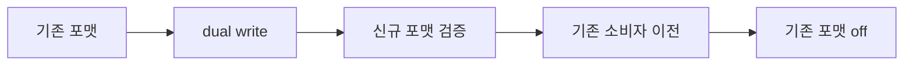
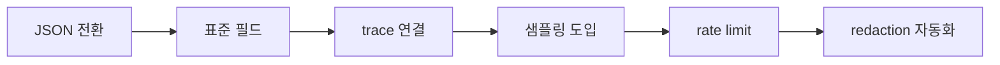

# 로그 운영 정책

> 로그 비용의 80%는 **로그 자체를 쓰는 방식**에서 결정된다. 백엔드
> 교체보다 정책이 먼저다. 구조화(JSON) → 필드 표준(OTel SemConv·ECS)
> → 우선순위 샘플링 → Rate Limiting. 이 4단이 곧 "신호 대 잡음" 게이트.

- **주제 경계**: 이 글은 **애플리케이션·파이프라인·백엔드에 공통으로
  적용하는 정책**을 다룬다. 백엔드 저장 모델은 [Loki](loki.md)·
  [Elastic Stack](elastic-stack.md), 도구 비교는
  [로그 파이프라인](log-pipeline.md), SLO·에러 버짓 개념은
  `sre/` 카테고리 참조.
- **선행**: [Semantic Conventions](../concepts/semantic-conventions.md).

---

## 1. 네 기둥 — 한 줄씩

| 정책 | 질문 | 답 |
|---|---|---|
| **구조화** | 기계가 파싱할 수 있는가 | JSON(또는 logfmt), 자유 텍스트 금지 |
| **필드 표준** | 서비스마다 다른 이름 아닌가 | OTel SemConv + ECS |
| **우선순위 샘플링** | 모든 로그를 100% 받을 필요가 있는가 | 등급별 차등 |
| **Rate Limiting** | 한 서비스가 전체를 오염시키지 않는가 | 테넌트·스트림별 한도 |

이 네 개가 서로 직교. 하나라도 빠지면 로그 비용·품질이 무너진다.

---

## 2. 구조화 로깅 — JSON 또는 logfmt

### 2.1 자유 텍스트 금지

```text
2026-04-25 12:34:56 ERROR Failed to charge user 12345 for order 9999 amount 9.99
```

이 라인은 사람 눈엔 읽히지만:
- **타임스탬프·레벨·메시지 분리** 없음 → grep 아닌 파서 필요
- `user_id=12345`, `order_id=9999`, `amount=9.99` 추출에 regex 필수
- 서비스마다 포맷 다름 → 정규화 비용 누적

### 2.2 JSON — 기계 1급 시민

```json
{
  "timestamp": "2026-04-25T12:34:56.789Z",
  "severity": "ERROR",
  "message": "payment failed",
  "service.name": "checkout",
  "user.id": "12345",
  "order.id": "9999",
  "amount": 9.99,
  "trace_id": "a1b2c3d4e5f6",
  "span_id": "0011223344"
}
```

| 속성 | 이유 |
|---|---|
| 스키마 안정성 | 필드명·타입이 일정 |
| 타입 보존 | number는 number, bool은 bool |
| 파싱 제로 | OTel·Loki·Elastic이 기본 지원 |
| trace 상관관계 | `trace_id`·`span_id` 즉시 연결 |

### 2.3 logfmt — 가벼운 대안

```text
ts=2026-04-25T12:34:56Z level=error msg="payment failed" user.id=12345 amount=9.99
```

- Heroku·HashiCorp에서 발원. Grafana Labs가 애용.
- JSON보다 사람 친화적, 기계 파싱도 저렴.
- 중첩 구조 부족 → 깊은 객체가 필요하면 JSON.

### 2.4 선택 가이드

| 요건 | 선택 |
|---|---|
| OTel·Elastic·Loki 범용 | **JSON** |
| 경량·사람 친화 | logfmt |
| 로그 본문에 긴 stack trace | JSON (`"stack_trace"` 단일 필드) |
| 빠른 개발·인프라 부재 | logfmt로 출발, 성장 시 JSON 전환 |

---

## 3. 필드 표준 — OTel SemConv + ECS

2026 현재 두 표준이 수렴 중:

| 표준 | 출신 | 위상 |
|---|---|---|
| **OTel Semantic Conventions** | OpenTelemetry | 신규 표준, 다중 벤더 |
| **ECS (Elastic Common Schema)** | Elastic | 성숙, Elastic 생태계 |

2023년 **Elastic이 ECS를 OTel에 기여**, 9.x부터 ECS↔OTel SemConv 매핑이
자동. 신규 프로젝트는 **OTel SemConv 우선**, 기존 ECS 자산은 유지하며
점진 수렴.

### 3.1 OTel 필수 속성

| 카테고리 | 속성 |
|---|---|
| Resource | `service.name`, `service.version`, `deployment.environment` |
| K8s | `k8s.namespace.name`, `k8s.pod.name`, `k8s.container.name` |
| Host | `host.name`, `host.arch`, `cloud.provider`, `cloud.region` |
| HTTP | `http.method`, `http.route`, `http.status_code` |
| DB | `db.system`, `db.name`, `db.operation` |
| Exception | `exception.type`, `exception.message`, `exception.stacktrace` |
| Log | `log.severity_text`, `log.severity_number`, `log.body` |
| Trace | `trace_id`, `span_id`, `trace_flags` |

### 3.2 severity 매핑

OTel은 9단계 `SeverityNumber`(1~24)를 정의. 흔한 언어 레벨과의 매핑:

| OTel | Number | syslog | Java/Python | Go zap | Node bunyan |
|---|---|---|---|---|---|
| TRACE | 1-4 | — | TRACE | Debug | trace |
| DEBUG | 5-8 | debug | DEBUG | Debug | debug |
| INFO | 9-12 | info | INFO | Info | info |
| WARN | 13-16 | warning | WARN | Warn | warn |
| ERROR | 17-20 | error | ERROR | Error | error |
| FATAL | 21-24 | crit/alert/emerg | FATAL | Fatal | fatal |

> **원칙**: 언어 네이티브 레벨을 쓰고, 파이프라인에서 OTel SeverityNumber
> 로 정규화. 앱 코드에서 OTel SDK 의존을 피할 수 있다.

### 3.3 필드 명명 규칙

- **점(`.`) 구분 계층**: `service.name`, `http.status_code`. 밑줄(`_`)은
  같은 계층 단어 구분.
- **snake_case 통일**. camelCase 금지(OTel 컨벤션).
- **단위 접미**: `*_ms`·`*_bytes`·`*_ratio` — 파싱 없이 의미 전달.
- **예약어 회피**: `type`·`time` 같은 단어는 백엔드와 충돌. `event.type`.

### 3.4 금지 필드

| 필드 | 이유 |
|---|---|
| PII 그대로 (이메일·전화·이름) | 법·재무 리스크 |
| 비밀(토큰·비밀번호·API key) | 유출 시 사고 |
| 거대 payload (> 수 KB) | 저장·인덱스 부담 |
| 중복 필드 (`msg`·`message`·`Message`) | 정규화 비용 |
| raw 스택 트레이스 배열 | 단일 문자열 `exception.stacktrace`로 |

---

## 4. 우선순위 샘플링

"모든 로그를 100%" 발상은 비용을 통제하지 못한다. **레벨·성격별 차등**이
글로벌 표준.

### 4.1 기본 원칙

| 레벨 | 샘플링 | 이유 |
|---|---|---|
| **FATAL/ERROR** | **100%** | 절대 놓치면 안 됨 |
| **WARN** | 100% 권장 | 저빈도, 조기 경보 |
| **INFO** (이벤트성) | 100% (payment, login 등 비즈니스 이벤트) | 감사·분석용 |
| **INFO** (access log) | **1~10%** | 대량, 패턴만 유지 |
| **DEBUG/TRACE** | **0%** (기본 off) | 트러블슈팅 시 on |

### 4.2 일관성 — trace_id 기반

```
hash(trace_id) mod 100 < threshold  → keep
```

같은 요청의 로그·트레이스·메트릭이 **함께 선택되거나 함께 버려짐**. 부분
관측(로그만 있고 트레이스 없음)을 피한다.

### 4.3 예외: 항상 keep

| 조건 | 이유 |
|---|---|
| `severity >= ERROR` | 사고 재구성 |
| `http.status_code >= 500` | 실패 추적 |
| latency > P99 | 이상치 포착 |
| `sampling.priority == 1` | 명시 지정 (수사·디버깅) |
| 신규 릴리스 초기 N분 | 회귀 조기 발견 |

### 4.4 구현 위치

| 단계 | 장점 | 단점 |
|---|---|---|
| 앱 SDK | 가장 싸다 (네트워크 부담↓) | 언어마다 구현 필요 |
| **파이프라인 aggregator** | 중앙 관리, 언어 불가지 | 네트워크 1홉 낭비 |
| 백엔드 | 쉬움 | 저장 후 버리는 최악의 경제성 |

> **권장**: **SDK에서 명백한 제외(DEBUG off) + aggregator에서 정책 기반
> 샘플링**. 백엔드에서 drop은 최후.

### 4.5 tail sampling (트레이스와 연동)

트레이스가 완료된 뒤 **결과를 보고** 샘플링:

```yaml
processors:
  tail_sampling:
    decision_wait: 10s
    policies:
      - { name: errors,     type: status_code, status_code: { status_codes: [ERROR] } }
      - { name: slow,       type: latency,     latency:     { threshold_ms: 1000 } }
      - { name: prob,       type: probabilistic, probabilistic: { sampling_percentage: 5 } }
      - { name: rate_limit, type: rate_limiting, rate_limiting: { spans_per_second: 100 } }
```

로그는 trace_id로 묶여 동일 decision을 따른다.

> **tail sampling 비용**: `decision_wait` 동안 미결정 span을 메모리에
> 유지한다. high-cardinality trace_id + 긴 `decision_wait` 조합은
> Collector OOM의 단골 원인. 보통 5~15초, burst 대비 메모리 여유 2배.

---

## 5. Rate Limiting

샘플링이 "비율 축소"라면, rate limiting은 "절대 상한". 한 서비스·테넌트가
전체를 오염시키는 걸 막는다.

### 5.1 왜 필요한가

- **무한 루프·에러 폭증**: for 루프 안 ERROR 로그로 초당 10만 건
- **log bomb 공격**: 의도적 로그 범람
- **배포 사고**: DEBUG가 prod에 켜짐
- **테넌트 격리**: 한 고객이 전체 로그 예산 소진

### 5.2 적용 위치

| 위치 | 적용 대상 | 도구 |
|---|---|---|
| 앱 SDK | 동일 메시지 반복 | slog `handler`, zap sampler |
| 수집 에이전트 | 노드·파일당 | Fluent Bit `throttle` filter |
| Aggregator | 테넌트·서비스당 | OTel `ratelimitprocessor` (contrib) |
| 백엔드 | 테넌트당 | Loki `ingestion_rate_mb`, ES ingest backpressure |

### 5.3 SDK 레벨 — 반복 dedup

Go `slog`·Uber zap은 **동일 메시지 N번 이후 drop + 카운터** 기능 제공.
예: zap sampler — 처음 100개 keep, 이후 매 100개당 1개 keep.

### 5.4 Aggregator 레벨

OTel Collector `ratelimitprocessor`:

```yaml
processors:
  ratelimiter:
    rate: 10000   # records/sec per pipeline
    burst: 20000
```

초과 시 drop + `dropped_records_total` 메트릭. 이 메트릭은 알림 대상.

### 5.5 백엔드 레벨

- Loki: distributor `ingestion_rate_mb`·`ingestion_burst_size_mb`
  테넌트별 설정
- Elastic: `cluster.indices.write.queue_size`·`indices.memory.index_buffer_size`,
  429 응답 발생 시 producer 측에서 backoff

> **운영 원칙**: 세 층 모두 rate limit을 설정. 어느 한 층이 뚫려도 다음
> 층이 막아야 한다. 단, **drop 메트릭은 반드시 수집**. 소리 없이 사라지는
> 로그가 최악.

---

## 6. 보존·티어링 전략

로그 가치는 시간에 따라 감소한다. 레벨별·용도별 차등 보존:

| 종류 | 핫 (즉시 검색) | 콜드 (아카이브) | 근거 |
|---|---|---|---|
| ERROR·FATAL | 30일 | 1년 (S3) | 장애 재구성 |
| WARN | 14~30일 | 90일 | 추세 분석 |
| 비즈니스 이벤트 (감사) | 30~90일 | **3~7년** (컴플라이언스) | 법 요건 |
| access log | 7~14일 | 30~90일 | 트래픽 분석 |
| DEBUG | 0~3일 | 없음 | 수명 짧음 |
| 보안 감사 (auth·IAM·SIEM) | 90일 | **1~7년** | PCI·SOC2·HIPAA |

> **컴플라이언스 우선**: GDPR·CCPA의 삭제 요청은 아카이브도 대상. 객체
> 스토리지 tagging + selective delete 설계가 사전에 필요.

---

## 7. PII·비밀 redaction

DLP는 **파이프라인에서 수행**. 앱 코드에 의존하면 한 군데만 누락해도
유출된다.

### 7.1 대표 패턴

| 패턴 | 방식 |
|---|---|
| 이메일 | 정규식 `[A-Za-z0-9._%+-]+@...` → `***@***.***` |
| 전화번호 | 로케일별 정규식 → 마스킹 |
| 신용카드 | Luhn 검증 + 마스킹 (PCI-DSS) |
| IBAN·SSN | 포맷 검증 + 해시 또는 drop |
| JWT·API key | 필드명 기반 drop |
| IP 주소 | 위치 분석 필요 시 prefix 보존(`/24`), 아니면 drop |

### 7.2 OTel `redaction` processor

```yaml
processors:
  redaction:
    allow_all_keys: true
    blocked_values:
      - '4[0-9]{12}(?:[0-9]{3})?'     # Visa
      - '\d{3}-\d{2}-\d{4}'            # SSN
    blocked_key_patterns:
      - '.*password.*'
      - '.*secret.*'
      - '.*token.*'
```

### 7.3 필드 allowlist

반대 방향: 허용 필드만 통과. 신규 필드는 기본 drop. 더 안전하지만 운영
부담↑. 금융·의료 섹터에 권장.

### 7.4 shift-left — secret 자동 감지

배포 전·CI에서 미리 잡는 게 최선.

| 도구 | 용도 |
|---|---|
| `gitleaks` / `trufflehog` | 커밋·로그 샘플에 credential 패턴 스캔 |
| `detect-secrets` | CI에 hook, baseline과 diff |
| entropy 기반 탐지 | 무작위 문자열(토큰) 패턴 |
| 테스트 환경 로그 샘플링 | 스테이징 로그 1%를 스캐너에 통과 |

파이프라인 redaction은 **런타임 방어**, 위 도구는 **사전 탐지**. 둘을
함께 운영.

---

## 8. 타임스탬프 정합성

로그 상관관계의 기본. 다수 서비스가 섞일 때 같은 사고가 시간 정렬이
안 되면 분석이 지연된다.

| 규칙 | 설명 |
|---|---|
| **UTC 고정** | 모든 로그는 UTC. 로컬 타임존 금지 |
| **ISO 8601 + ms/µs** | `2026-04-25T12:34:56.789Z` |
| **NTP 동기화** | 노드 clock drift < 10ms |
| **event time vs ingest time** | 필요 시 `observed_timestamp` 별도 |
| **K8s pod clock** | container 재시작 시 clock jump 주의 |

OTel Log Record는 `Timestamp`(원시 이벤트 시각)와
`ObservedTimestamp`(파이프라인 도달 시각) 둘 다 보존.

---

## 9. 관측성과 상관관계

로그 혼자는 절반의 신호. 메트릭·트레이스와 **같은 context로 묶여야**
가치가 산다.

| 연결 | 필드 |
|---|---|
| 로그 ↔ 트레이스 | `trace_id`, `span_id` (OTel) |
| 로그 ↔ 메트릭 | exemplar (메트릭 버킷에 `trace_id` 표기) |
| 로그 ↔ K8s | `k8s.namespace.name`, `k8s.pod.name`, `k8s.container.name` |
| 로그 ↔ 서비스 메시 | `service.name`, `net.peer.name` |

### 9.1 언어별 log bridge

| 언어 | 도구 | 주의 |
|---|---|---|
| Go | `go.opentelemetry.io/contrib/bridges/otelslog` | goroutine context 전파 — `context.Context` 인자 누락 시 trace 끊김 |
| Java | `OpenTelemetryAppender` (Logback·Log4j2) | MDC 사용 중이면 MDC → OTel attribute 매핑 |
| Python | `OTLPLogHandler` | asyncio `contextvars` 전파 — sync/async 경계 누수 |
| Node.js | `@opentelemetry/instrumentation-winston`/`pino` | async_hooks 기반 context, `clsHooked` 예전 방식은 호환 주의 |
| .NET | `OpenTelemetry.Extensions.Logging` | `ILogger` scope가 span과 자동 결합 |

> **규칙**: 모든 HTTP 핸들러·DB 호출에서 **현재 span의 trace_id를
> 로그 필드에 자동 주입**. OTel log bridge가 자동 처리하지만 **async
> context 누수 한 곳**이면 전체가 끊긴다. log bridge 도입 후 통합 테스트
> 에서 `trace_id` coverage를 측정.

---

## 10. K8s 컨테이너 로그 — 표준과 함정

K8s 환경에서 로그는 **stdout/stderr로 나가면 kubelet이 파일로 저장**한다.
이 표준 경로를 모르면 수집 도구 설정이 깨진다.

### 10.1 CRI 로그 포맷

`/var/log/pods/<ns>_<pod>_<uid>/<container>/N.log` 파일에 라인마다:

```text
2026-04-25T12:34:56.789Z stdout F {"level":"info","msg":"hi"}
2026-04-25T12:34:56.790Z stderr P partial line without newline
```

| 필드 | 의미 |
|---|---|
| 타임스탬프 | kubelet이 붙인 수신 시각 (RFC3339Nano) |
| stream | `stdout` / `stderr` |
| `F` / `P` | **Full**(newline 종결) / **Partial**(이어지는 라인) |
| 페이로드 | 앱이 찍은 원본 라인 |

> **함정**: docker 런타임 로그 포맷(`{"log":"...", "stream":"...", "time":"..."}`
> JSON 라인)과 **CRI 포맷이 다르다**. Fluent Bit·OTel filelog 모두
> `multiline.parser docker, cri`를 함께 지정해야 양쪽을 자동 감지한다.

### 10.2 멀티라인 (stack trace)

CRI `P`/`F` 플래그는 kubelet이 긴 라인을 쪼갰을 때 표시. **앱이 찍은
멀티라인**(Java stack trace 등)은 별도.

- 파이프라인에서 **앱 멀티라인 병합**: 첫 줄이 `\s+at |Exception`로 시작
  하지 않으면 새 로그로 판단, 그렇지 않으면 이전에 붙이기.
- 실패 시 stack trace 각 줄이 **독립 로그**로 색인 → 가독·비용 모두 손해.

### 10.3 kubelet log rotation

- 기본 **노드당 `--container-log-max-size=10Mi`, `--container-log-max-files=5`**
- 파일이 rotate되면 `.log.1`·`.log.2`로 밀리고 원래 파일이 truncate
- 수집 에이전트는 **fingerprint·inode 추적**으로 rotate 감지 필요

### 10.4 `terminationMessagePath`

pod가 비정상 종료 시 마지막 에러 메시지를 여기 기록. 로그 파이프라인과
별개 경로로 kubelet API에서 조회. K8s event와 연계된 진단 자료.

---

## 11. Access log vs 앱 로그 — 분리 권장

| 축 | Access Log | 앱 로그 |
|---|---|---|
| 발생량 | 요청당 1~2건, 대량 | 필요 시점, 중간 |
| 구조 | 고정 (method·status·latency) | 동적 |
| 용도 | 트래픽 분석·SLO | 디버깅·감사 |
| 적합 백엔드 | **ClickHouse·S3** (집계) | Loki·Elastic (검색) |
| 보존 | 짧음 (7~30일) | 중간~김 |

> 초대형 트래픽이면 access log를 **Loki·Elastic에 통째로 넣지 않는다**.
> 대신 Kafka → ClickHouse 컬럼 저장으로 집계·대시보드, 샘플만 Loki.

---

## 12. 디버그 on/off — 요청 단위 force-keep

prod에서 DEBUG 끄되, 특정 요청만 verbose 추적하고 싶을 때:

| 기법 | 구현 |
|---|---|
| Header 기반 force-keep | `X-Debug-Trace: 1` 또는 `sampling.priority: 1` |
| 사용자·테넌트 기반 | feature flag로 특정 user_id에 DEBUG on |
| 오류 backfill | 에러 발생 시 직전 N분 로그를 일시 보존(tail sampling) |
| Dynamic log level | `/-/log_level` 엔드포인트로 short-lived override |

파이프라인 샘플링 룰이 `sampling.priority == 1`이면 **100% keep**을
보장하도록 명시.

---

## 13. 포맷 마이그레이션 — dual-write 패턴

레거시 로그를 JSON·OTel로 점진 이전할 때 단번에 바꾸면 파싱 규칙이
깨진다. 안전한 절차:



| 단계 | 동작 |
|---|---|
| dual-write | 앱이 두 포맷 동시 출력, 파이프라인이 둘 다 수집 |
| shadow | 신규 포맷 대시보드·알림을 병행, 차이 분석 |
| cutover | 기존 소비자(대시보드·SIEM 룰)을 신규로 이전 |
| off | 기존 포맷 삭제 |

> **체크포인트**: 대시보드·알림·SIEM 룰·외부 시스템의 **모든 쿼리가
> 신규 포맷으로 전환** 완료 후에만 off.

---

## 14. 운영 체크리스트

### 14.1 앱 측

- [ ] JSON 또는 logfmt 고정. 자유 텍스트 금지
- [ ] OTel SemConv 필드명 사용
- [ ] `trace_id`·`span_id` 자동 주입 (OTel log bridge)
- [ ] DEBUG off (flag로만 on)
- [ ] 비밀·PII는 절대 log 호출에 넣지 않음 (방어 1층)
- [ ] 한 줄 ≤ 16 KB (백엔드 제한)

### 14.2 파이프라인 측

- [ ] redaction processor 활성화 (방어 2층)
- [ ] 우선순위 샘플링 정책
- [ ] Rate limiter (테넌트·서비스별)
- [ ] 드롭 메트릭 수집·알림
- [ ] 파이프라인 자체 로그는 분리 백엔드

### 14.3 백엔드 측

- [ ] 테넌트별 ingestion rate·stream·retention 한도
- [ ] ILM/retention·아카이브 정책 코드화
- [ ] 삭제 요청(GDPR) 처리 SOP
- [ ] 감사 로그 별도 인덱스·접근 통제
- [ ] 비용 대시보드 (일일 인제스트 GB, 테넌트별)

---

## 15. 안티패턴

| 안티패턴 | 결과 | 교정 |
|---|---|---|
| 자유 텍스트 `"error: something happened: " + err` | 파싱 불가, 정규식 지옥 | JSON + `error.message` 필드 |
| 서비스마다 다른 필드명 | 쿼리 N개로 분할 | OTel SemConv 강제 |
| DEBUG를 prod 기본 on | 비용 폭발 | flag·헤더·short-lived override |
| 모든 레벨 100% 수집 | 비용 폭발 | 등급별 차등 샘플링 |
| drop을 백엔드에 의존 | 가장 비싼 경로 | 앱·파이프라인에서 우선 제외 |
| PII 마스킹 앱에만 | 누락 → 유출 | 파이프라인에서 방어 2층 |
| 타임존 혼재 | 시간 정렬 지옥 | UTC 강제 |
| trace_id 없는 로그 | 관측성 반쪽 | log bridge 필수 |
| rate limit 없음 | 한 서비스가 전체 오염 | 3층 limit |
| 드롭 메트릭 미수집 | 조용한 손실 | `dropped_*` 알림 |

---

## 16. 점진 도입 로드맵

기존 레거시 로그를 한 번에 바꾸기 어렵다. 6단계:



| 단계 | 기간 | 성과 |
|---|---|---|
| 1 | 1~2개월 | 신규 서비스 JSON 강제, 기존은 파이프라인 파싱 |
| 2 | 1~3개월 | 공유 logger 라이브러리로 필드명 통일 |
| 3 | 1개월 | OTel SDK + log bridge 도입 |
| 4 | 1~2개월 | DEBUG off, access log 샘플링 |
| 5 | 1개월 | 3층 rate limit |
| 6 | 지속 | redaction 룰 확장, 감사 |

---

## 17. 비용 효과 — 얼마나 줄어드나

업계 벤치마크: 로그 볼륨의 40~70%가 **정책만으로** 감소 가능.

| 조치 | 감소 기대 |
|---|---|
| DEBUG off | -20~40% |
| access log 5% 샘플링 | -30~50% |
| 중복 메시지 dedup | -5~10% |
| redaction + 중복 필드 제거 | -5~10% |
| 결합 | **-50~70%** |

> **우선순위**: 샘플링 > 구조화 > 필드 표준 > redaction 순으로 **ROI가
> 빠르게 드러난다**. 관측성 비용이 문제라면 샘플링부터.

---

## 참고 자료

- [OpenTelemetry Logs Data Model](https://opentelemetry.io/docs/specs/otel/logs/data-model/) (확인 2026-04-25)
- [OpenTelemetry Semantic Conventions](https://opentelemetry.io/docs/concepts/semantic-conventions/) (확인 2026-04-25)
- [OpenTelemetry Logs Concepts](https://opentelemetry.io/docs/concepts/signals/logs/) (확인 2026-04-25)
- [Elastic Common Schema (ECS)](https://www.elastic.co/guide/en/ecs/current/index.html) (확인 2026-04-25)
- [ECS contributed to OpenTelemetry FAQ](https://www.elastic.co/blog/ecs-elastic-common-schema-otel-opentelemetry-faq) (확인 2026-04-25)
- [OTel Collector — tail_sampling processor](https://github.com/open-telemetry/opentelemetry-collector-contrib/tree/main/processor/tailsamplingprocessor) (확인 2026-04-25)
- [OTel Collector — redaction processor](https://github.com/open-telemetry/opentelemetry-collector-contrib/tree/main/processor/redactionprocessor) (확인 2026-04-25)
- [Log sampling techniques — groundcover](https://www.groundcover.com/learn/logging/log-sampling) (확인 2026-04-25)
- [OpenTelemetry Filtering and Sampling for cost cuts](https://oneuptime.com/blog/post/2026-02-06-cut-observability-costs-opentelemetry-filtering-sampling/view) (확인 2026-04-25)
