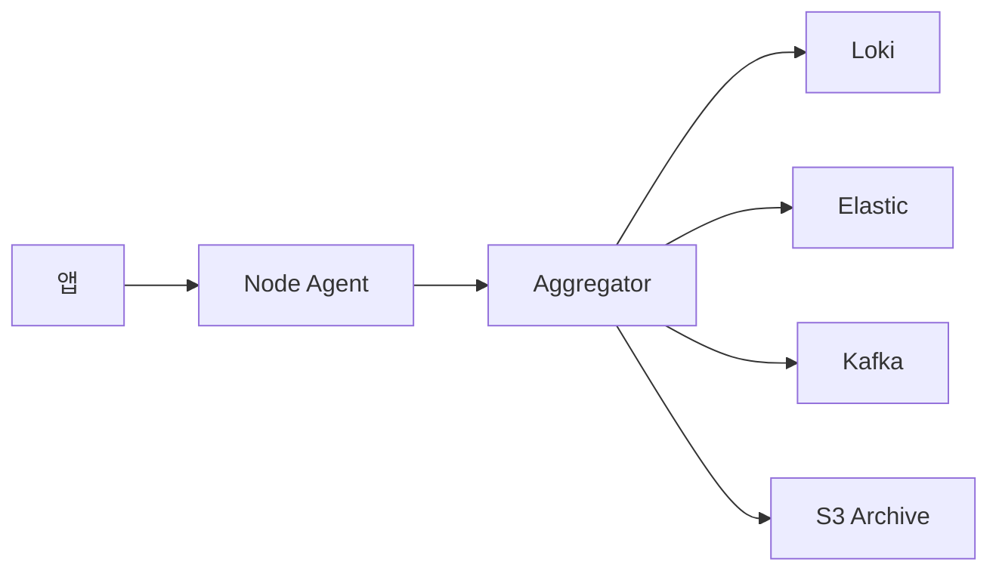
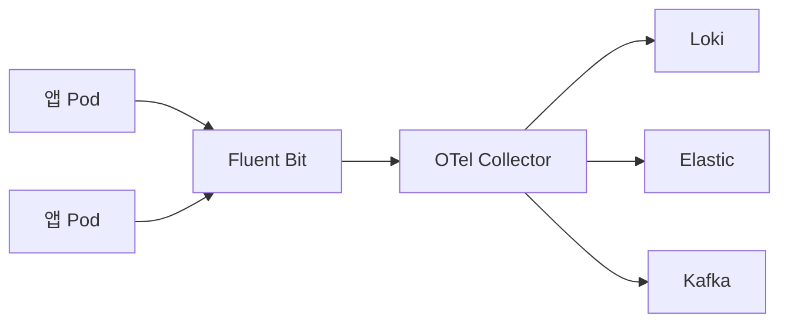
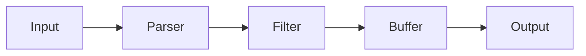
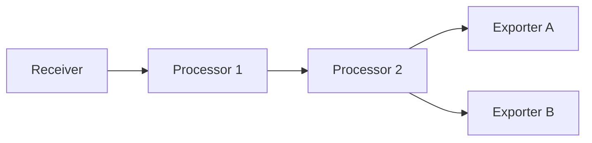
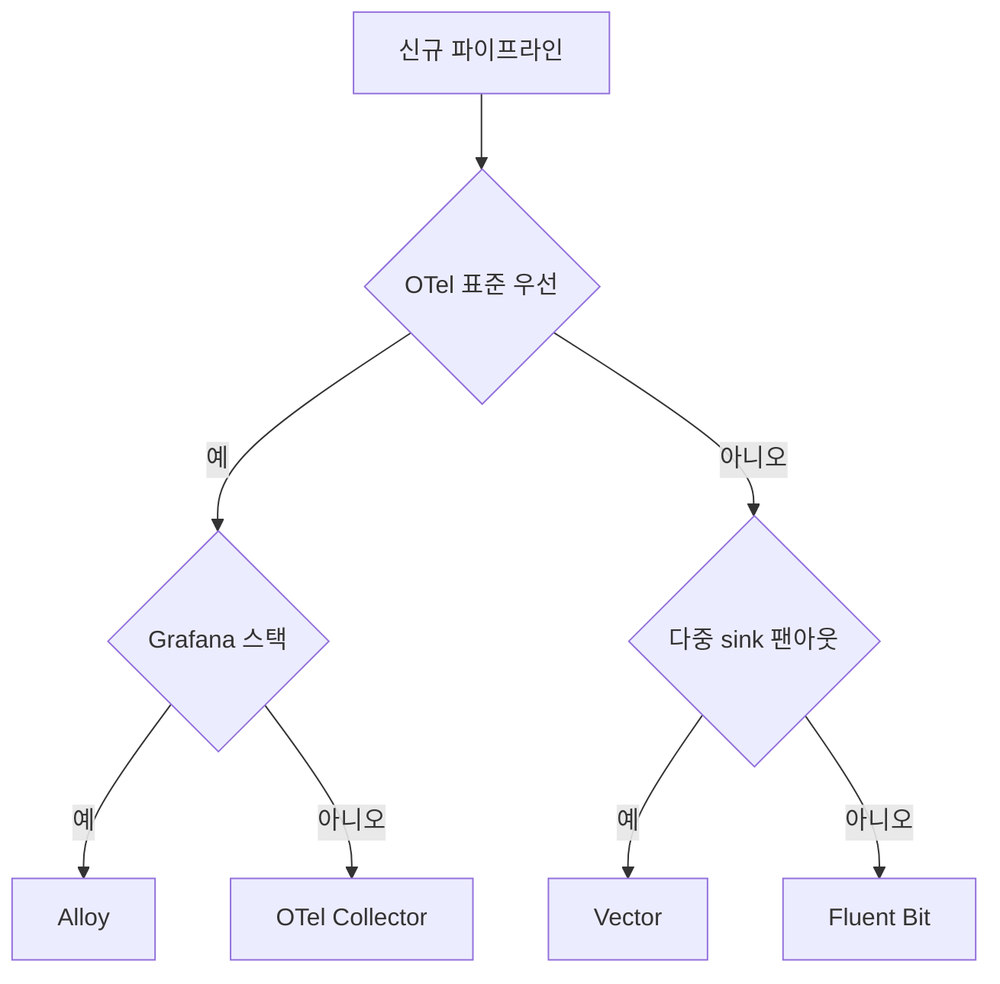
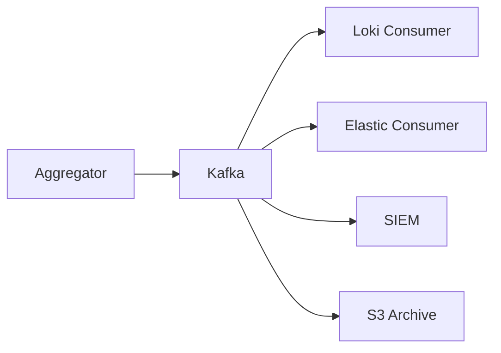
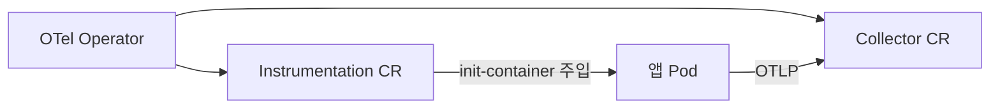
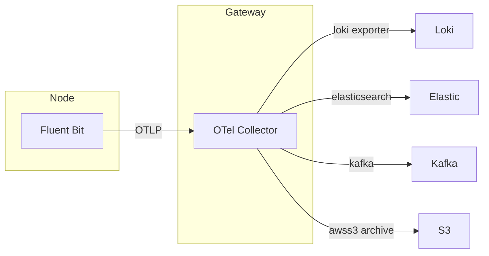

# 로그 파이프라인

> 로그는 **애플리케이션에서 백엔드까지 세 번 이상** 거친다. node 에이전트
> → aggregator → 백엔드. 각 층에서 파싱·정규화·필터·샘플링·출력 fan-out을
> 한다. 2026 현재 이 경로의 주자는 **Fluent Bit, Vector, OTel Collector,
> Grafana Alloy** 네 개.

- **주제 경계**: 이 글은 **수집·변환·전송 파이프라인 구현체 비교**를
  다룬다. 백엔드별 저장 모델은 [Loki](loki.md)·[Elastic
  Stack](elastic-stack.md), 필드 표준·샘플링·Rate Limiting 공통 정책은
  [로그 운영 정책](log-operations.md) 참조.
- **선행**: [관측성 개념](../concepts/observability-concepts.md).

---

## 1. 왜 중간 파이프라인이 필요한가



백엔드에 직접 꽂지 않고 중간을 둬야 하는 이유:

| 이유 | 설명 |
|---|---|
| **버퍼링** | 백엔드 장애 시 큐로 흡수, 앱은 영향 없음 |
| **정규화** | 필드명·타임스탬프·레벨 표준화 (ECS·OTel SemConv) |
| **샘플링·필터** | 노이즈 제거, 비용 통제 |
| **다중 출력** | 같은 이벤트를 Loki + S3 + SIEM에 동시 fan-out |
| **민감정보 redaction** | 백엔드 도달 전 PII mask |
| **라우팅** | 레벨·서비스별 백엔드 분리 |

> **"first-mile observability"**: 이 파이프라인이 곧 관측성 비용·품질의
> 첫 게이트. 백엔드 교체는 쉬워도 파이프라인 교체는 느리다.

---

## 2. 2026 주요 플레이어

| 도구 | 출신 | 언어 | 핵심 |
|---|---|---|---|
| **Fluent Bit** | Fluentd 후속, CNCF Graduated | C | **경량**, node 에이전트 표준 |
| **OpenTelemetry Collector** | OTel 재단, CNCF Incubating | Go | **벤더 중립 표준**, 전 신호 통합 |
| **Grafana Alloy** | Grafana Labs (Agent 후속) | Go (OTel 기반) | **Prom·Loki 네이티브**, OTel 호환 |
| **Vector** | Datadog 소유, 오픈소스 | Rust | **고성능**, VRL 변환 언어 |
| **Fluentd** | Treasure Data → CNCF Graduated | Ruby | 레거시, 신규 도입 비권장 |
| **Logstash** | Elastic | JVM | Elastic 생태계, 복잡 변환 |
| **Promtail** | Grafana | Go | **EOL (2026-03-02)** → Alloy |

> **deprecated 구도**: Promtail·Fluentd·Grafana Agent는 모두 후속이
> 명확히 지정됨. 신규 도입은 **Fluent Bit / OTel Collector / Alloy /
> Vector** 4자 구도.

> **신흥 경로 — eBPF 기반**: Grafana Beyla, Cilium Tetragon,
> OpenTelemetry eBPF Profiler 등이 커널 레벨에서 로그·트레이스·메트릭을
> 추출. 전통 파일 tail 경로와 공존하며, 무계측 애플리케이션의 관측에
> 강점. 현재 보조 경로 단계.

---

## 3. 성능·자원 — 2026 벤치마크

VictoriaMetrics 2026 K8s 벤치마크·Parseable 프로파일링 결과 요약:

| 축 | Fluent Bit | Vector | OTel Collector | Alloy |
|---|---|---|---|---|
| 언어 | C | Rust | Go | Go |
| CPU 효율 | **최상** | 상 (처리량/CPU) | 중 | 중 |
| 메모리 | **~30 MB** | 50~100 MB | 100~200 MB | 100~200 MB |
| 처리량 최대 | 상 | **최상** | 중 | 중 |
| OTel 네트워크 부하 | 낮음 | 낮음 | **5~6×** (gRPC·메타) | 5~6× |
| 플러그인 확장 | 내장 중심 | 내장 중심 | **모듈식, 풍부** | OTel + Alloy |

> **해석**: Fluent Bit은 "전송"에, OTel Collector는 "변환·표준화"에
> 최적. Vector는 둘 사이 + 다중 sink 강점. Alloy는 OTel Collector에
> Prom·Loki 수퍼셋.

---

## 4. 2-tier 아키텍처 — node agent + aggregator



**권장 토폴로지 (2026)**:

| 계층 | 역할 | 권장 |
|---|---|---|
| **Node Agent** (DaemonSet) | 로그 tail·K8s 메타 부착·초기 파싱 | **Fluent Bit** (경량) 또는 Alloy |
| **Aggregator** (StatefulSet) | 정규화·샘플링·라우팅·PII mask | **OTel Collector** 또는 Vector |
| **Backend** | 인덱싱·저장 | Loki / Elastic / Kafka / S3 |

**왜 2-tier**:
- node 에이전트가 무거우면 K8s 노드당 비용이 곧 수천 배 증폭
- aggregator에서 중앙 정책 (DLP, 샘플링, 라우팅) 일원화
- 백엔드 장애 격리 (aggregator에 큐)

### 4.1 1-tier가 나은 경우

- 매우 작은 클러스터 (< 10 노드)
- 백엔드가 이미 이중화된 관리형 서비스 + 변환 불필요
- 이 경우 **OTel Collector DaemonSet 단일 계층**도 허용

---

## 5. Fluent Bit — 경량 node agent의 표준

### 5.1 아키텍처



| 단계 | 예 |
|---|---|
| Input | `tail`, `systemd`, `tcp`, `forward`, `opentelemetry` |
| Parser | JSON, regex, logfmt, multiline, docker, CRI |
| Filter | `kubernetes`(메타 enrich), `modify`, `grep`, `lua` |
| Buffer | 메모리 + **파일 백업** (filesystem storage) |
| Output | `loki`, `es`, `kafka`, `opentelemetry`, `s3`, `forward` 등 |

### 5.2 K8s DaemonSet 표준 설정

```yaml
inputs:
  - tail:
      path: /var/log/containers/*.log
      parser: cri
      tag: kube.*
      multiline.parser: docker, cri
filters:
  - kubernetes:
      merge_log: on
      k8s_logging_parser: on
outputs:
  - opentelemetry:
      host: otel-collector.obs
      port: 4317
```

- `/var/log/containers/*.log` tail
- CRI/Docker multiline parser (표준 K8s 런타임 로그)
- **Kubernetes filter**가 pod·container·label 메타 자동 부착
- aggregator로 **OTLP** 전송 (backend 직결보다 권장)

### 5.3 강점·약점

| 강점 | 약점 |
|---|---|
| 메모리 ~30 MB, CPU 효율 1위 | 복잡 변환은 Lua에 의존 |
| 내장 Kubernetes filter 성숙 | 백프레셔 처리는 Vector보다 단순 |
| filesystem storage로 장애 내성 | 라우팅 표현력 제한 |

> **2026 권장**: K8s node 에이전트는 Fluent Bit 3.x. 필요 시 OTLP로
> aggregator에 넘기면 변환·라우팅은 aggregator 담당.

---

## 6. OpenTelemetry Collector — 벤더 중립 표준

### 6.1 pipeline 모델



**receivers → processors → exporters** 3단, 각각 logs·metrics·traces
세 신호별 파이프라인. 한 Collector 안에 여러 파이프라인을 선언.

### 6.2 핵심 컴포넌트 (로그)

| Receiver | 용도 |
|---|---|
| `otlp` | OTLP/gRPC·HTTP 수신 (표준) |
| `filelog` | 파일 tail (OTel 내에서 Fluent Bit 대체 가능) |
| `syslog` | syslog UDP/TCP |
| `kafka` | Kafka 토픽 consume |

| Processor | 용도 |
|---|---|
| `batch` | **필수**. 전송 효율 |
| `memory_limiter` | **필수**. OOM 방지 |
| `resource` | resource attribute 수정 |
| `attributes` | attribute add/delete/update |
| `filter` / `tail_sampling` | 필터·샘플링 |
| `transform` (OTTL) | 강력한 변환 DSL |
| `redaction` | PII mask |
| `k8sattributes` | K8s 메타 부착 (Fluent Bit kubernetes filter 등가) |

| Exporter | 용도 |
|---|---|
| `otlp` / `otlphttp` | 표준 OTLP |
| `loki` | Loki push |
| `elasticsearch` | ES 직결 |
| `kafka` | Kafka 토픽 produce |
| `file` | 파일 아카이브 |
| `awss3` | S3 아카이브 |

### 6.3 배포 모드

| 모드 | 역할 |
|---|---|
| **Agent** (DaemonSet/sidecar) | node-local 수집 |
| **Gateway** (Deployment/StatefulSet) | 중앙 aggregator |

> **2026 권장 조합**: node = **Fluent Bit** (경량) + gateway = **OTel
> Collector** (변환·라우팅). 또는 일관성 우선이면 node·gateway 모두 OTel
> Collector (단, 노드 자원 여유 필수).

### 6.4 Core vs Contrib · stability level

- **Core**: 표준 컴포넌트만. 안정·보안 우선 환경.
- **Contrib**: 커뮤니티 컴포넌트 포함 (loki·es·kafka·k8sattributes 등).
  **일반 운영은 contrib**.
- **컴포넌트 stability**: `stable` / `beta` / `alpha` / `development`
  / `deprecated` 5단계. 2026-04 현재 **OTLP receiver/exporter·batch·
  memory_limiter는 stable**, `loki`·`elasticsearch` exporter는 beta,
  `transform`(OTTL)은 beta~alpha. prod 채택 시 컴포넌트별 stability 확인.

### 6.5 OTTL — 변환 DSL

OTel Transformation Language. 2024~2025 안정화되어 transform/filter
processor의 표준 표현.

```yaml
processors:
  transform:
    log_statements:
      - context: log
        statements:
          - set(severity_text, "INFO") where IsMatch(body, "^\\[info\\]")
          - delete_key(attributes, "password")
```

---

## 7. Grafana Alloy — OTel + Prom·Loki 네이티브

Alloy는 **OTel Collector의 Grafana 배포판 + Prometheus/Loki 네이티브
컴포넌트**. Grafana Agent 후속이며 Grafana Labs가 향후 에이전트 개발을
모두 Alloy에 집중한다고 선언.

```alloy
// Alloy River 문법
loki.source.file "app" {
  targets = [{"__path__" = "/var/log/app/*.log"}]
  forward_to = [loki.process.default.receiver]
}

loki.process "default" {
  stage.json { expressions = {level = "", msg = ""} }
  forward_to = [loki.write.default.receiver]
}

loki.write "default" {
  endpoint { url = "http://loki/loki/api/v1/push" }
}
```

### 7.1 Alloy vs 순정 OTel Collector

| 축 | OTel Collector | Alloy |
|---|---|---|
| 설정 | YAML pipeline | River (HCL 유사) 컴포넌트 |
| Prometheus scrape | `prometheus` receiver | **네이티브** `prometheus.scrape` |
| Loki push | `loki` exporter (contrib) | **네이티브** `loki.write` |
| OTLP 호환 | 100% | 100% |
| Profiles (Pyroscope) | 별도 | **내장** |
| 벤더 중립성 | 강 | Grafana 생태계 최적화 |

> **Alloy 선택 기준**: ① Loki·Mimir·Tempo·Pyroscope를 모두 쓴다,
> ② Prometheus scrape + OTLP 혼합 워크로드, ③ Promtail·Agent 자산
> 마이그레이션. 그렇지 않다면 순정 OTel Collector가 표준에 더 가깝다.

---

## 8. Vector — Rust·고성능·다중 sink

Datadog 소유지만 Apache 2.0 OSS. VRL(Vector Remap Language)이 핵심 가치.

```toml
[sources.app]
type = "kubernetes_logs"

[transforms.parse]
type = "remap"
inputs = ["app"]
source = '''
  . = parse_json!(.message)
  .service = .kubernetes.labels."app.kubernetes.io/name"
  del(.password)
'''

[sinks.loki]
type = "loki"
inputs = ["parse"]
endpoint = "http://loki"

[sinks.s3]
type = "aws_s3"
inputs = ["parse"]
bucket = "archive"
```

### 8.1 강점

- **VRL**: 타입 안전 변환 언어, Lua보다 빠르고 Logstash grok보다 표현력↑
- 단일 바이너리, Rust로 안정적
- sink 다양 (ES, Loki, Kafka, S3, Datadog, Splunk 등 40+)
- **topology reload** 무중단 설정 갱신

### 8.2 약점

- **OTLP sink 없음**(2026-04 현재). OTel-네이티브 백엔드 직결 불가,
  중간 OTel Collector 경유 필요
- 커뮤니티·모듈 속도가 OTel보다 느림
- Datadog 소유 → 장기 독립성 우려(현재는 OSS 건강)

### 8.3 적합

- **다중 sink** 팬아웃이 본질인 환경 (Loki + SIEM + Kafka + S3)
- 복잡 변환을 정적 검증 가능한 언어로 작성하고 싶을 때
- Rust 친화 팀

---

## 9. 결정 트리



| 상황 | 추천 |
|---|---|
| K8s node 에이전트만 | **Fluent Bit** |
| 중앙 aggregator 표준화 | **OTel Collector** |
| Grafana 스택 풀세트 | **Alloy** |
| 다중 sink·복잡 변환 | **Vector** |
| 기존 Fluentd·Logstash | 신규 성장은 위 네 개 중 하나로 점진 이전 |

---

## 10. Kafka를 로그 버스로

대규모·다중 컨슈머 환경에서 **aggregator → Kafka → 복수 백엔드** 패턴이
사실상 표준. Redpanda는 Kafka API 호환 저지연 대안.



| 이점 | 설명 |
|---|---|
| **decoupling** | 백엔드별 속도 차이가 aggregator로 역류하지 않음 |
| **replay** | 인덱싱 로직 버그 수정 후 과거 offset부터 재처리 |
| **fan-out** | 같은 토픽을 여러 consumer group이 독립 소비 |
| **버퍼링 확장** | 디스크 기반 장기 버퍼, 아카이브 겸용 |

### 10.1 Kafka 토픽 설계

| 축 | 권장 |
|---|---|
| 토픽 분리 | 테넌트·로그 종류별 (`logs.prod.app`, `logs.audit`) |
| 파티션 | 예상 처리량의 3배, 테넌트별 해시 키 |
| 보존 | 24~72h (아카이브는 별도 consumer가 S3로) |
| 압축 | `zstd` (Kafka 2.1+) |

### 10.2 DLQ — 실패 흡수

파싱 실패·스키마 위반·백엔드 거부 메시지는 **DLQ 토픽**으로 별도 라우팅.
무한 재시도로 파이프라인을 막지 않는 게 핵심.

| 추적 메트릭 | 의미 |
|---|---|
| `dlq.messages.total` | 누적 실패 수 |
| `dlq.messages.rate` | 실패율 급증 알림 |
| `dlq.age.seconds` | 미처리 메시지 노화 |

> **운영 원칙**: DLQ는 **알림 대상**. 쌓이는 것을 방치하면 조용히 로그가
> 유실된다. 주기적 재처리 또는 사후 분석 후 drop.

### 10.3 at-least-once vs exactly-once

- 로그 파이프라인은 **at-least-once가 표준**. 네트워크·재시도·Kafka
  rebalance에서 중복 메시지가 발생한다.
- 중복 제거는 **백엔드 또는 trace_id 기반**으로 수행 (파이프라인 안에서
  exactly-once 추구 시 처리량 ↓).
- Elasticsearch는 `_id`로 dedup 가능, Loki는 timestamp+해시.

---

## 11. 멀티테넌트 라우팅

SaaS·플랫폼팀은 테넌트별로 다른 백엔드·보존·한도를 적용한다. 주요 패턴:

| 기법 | 구현 |
|---|---|
| Header 기반 | OTel `X-Scope-OrgID`, Loki 테넌트 헤더 |
| Label 기반 | `routing` connector가 attribute로 분기 |
| 파이프라인 복제 | OTel Collector의 `pipelines: [logs/tenant_a, logs/tenant_b]` |
| Kafka 토픽 분리 | 테넌트별 토픽 |

### 11.1 OTel routing connector

```yaml
connectors:
  routing:
    default_pipelines: [logs/default]
    table:
      - statement: route() where attributes["tenant"] == "a"
        pipelines: [logs/tenant_a]
      - statement: route() where attributes["tenant"] == "b"
        pipelines: [logs/tenant_b]
```

테넌트별 `batch` 크기·`filter`·exporter를 독립 구성. 테넌트 throttle은
aggregator에서 **rate_limiter** processor (contrib)로.

---

## 12. OTel Operator — 자동 계측 자리

OTel Operator는 K8s에서 ① **Collector CRD 관리**, ② **Instrumentation
CRD로 앱 자동 계측** 두 가지를 제공한다.



| 기능 | 의미 |
|---|---|
| Collector CR | Collector Deployment/StatefulSet/DaemonSet 선언적 관리 |
| Instrumentation CR | annotation(`instrumentation.opentelemetry.io/inject-*`)으로 Java·Python·Node.js·.NET·Go 자동 계측 주입 |
| Target Allocator | Prometheus scrape 타겟을 Collector 간 자동 분산 |

> **로그 파이프라인 입장**: 앱 자동 계측 → OTLP 출력이 붙으면 파일 tail
> 경로 없이도 structured log가 자동으로 Collector에 들어온다. filelog
> 경로와 OTLP 경로의 공존 패턴이 2026 표준.

자세한 OTel Operator는 `cloud-native/otel-operator.md` 참조.

---

## 13. log-to-metric 변환

로그의 일부를 **메트릭으로 변환**해 Prometheus/Mimir에 적재하면 대시보드·
알림 비용이 뒤집힌다. 매 초 error count를 grep하는 대신 미리 카운터로.

| 도구 | 컴포넌트 |
|---|---|
| OTel Collector | `count` connector / `spanmetrics` / `transform` |
| Fluent Bit | `log_to_metrics` filter |
| Vector | `log_to_metric` transform |
| Alloy | OTel `count` connector 또는 loki source + Prometheus export |

예: ERROR 레벨 로그 수 → counter
```yaml
connectors:
  count:
    logs:
      error.count:
        description: ERROR 로그 수
        conditions:
          - 'severity_text == "ERROR"'
        attributes:
          - key: service.name
```

> **주의**: 이 카운터가 백엔드 메트릭 저장소(Mimir)에 push되면 메트릭
> 카디널리티 규칙이 적용된다. attribute는 최소한만.

---

## 14. 전송 보안·인증

운영에 반드시 고정.

| 도구 | TLS | 인증 |
|---|---|---|
| Fluent Bit | `tls on`, `tls.ca_file`, mTLS 지원 | basic·bearer·`aws_auth` |
| OTel Collector | `tls` 설정 블록, `client_ca_file`로 mTLS | bearer·OIDC·AWS SigV4·API key |
| Vector | `tls.enabled`, `verify_certificate` | per-sink |
| Alloy | OTel 기반 동일 | 동일 |

- **mTLS**: node agent ↔ aggregator 구간에 권장. 클러스터 내부라도
  네트워크 신뢰 금지.
- **Bearer token 순환**: K8s ServiceAccount projected token (TTL <1h).
- **백엔드**: Loki·Elastic 모두 API key / OIDC 지원. long-lived
  password 사용 금지.

---

## 15. OTLP 버전 호환성

OTLP는 0.x protobuf에서 1.0(2023)으로 안정화. 2026 현재:

| 버전 | 상태 |
|---|---|
| OTLP/gRPC 1.x | 표준, 모든 도구 지원 |
| OTLP/HTTP (protobuf·JSON) | 표준 |
| OTLP 로그 stable | 2023년 안정화 |
| 신규 semantic conventions | 꾸준히 진화, `service.*`·`k8s.*`·`http.*` |

> **호환 원칙**: gRPC 1.x는 Fluent Bit·OTel Collector·Alloy·백엔드
> 모두 호환. **Vector는 OTLP sink가 없음** — Vector에서 OTel 백엔드로
> 보내려면 Vector → OTel Collector → 백엔드 2단 필수.

---

## 16. 공통 운영 패턴

### 16.1 버퍼링과 백프레셔

| 도구 | 디스크 버퍼 | 백프레셔 |
|---|---|---|
| Fluent Bit | `storage.type filesystem` | input pause |
| OTel Collector | `file_storage` extension | processor 거부 |
| Vector | `buffer.type = "disk"` | sink-level |
| Alloy | OTel 기반 동일 | 동일 |

> **공통 원칙**: 백엔드 장애 시 **파일 버퍼로 흡수**. 메모리 버퍼만 쓰면
> 재시작 시 손실. 디스크 크기는 평균 처리량 × 허용 단절 시간(보통 30m~1h).

### 16.1.1 filelog/tail offset 관리

재시작·노드 회전 시 중복·유실의 핵심. 체크포인트 파일이 없으면 다시
처음부터 읽어 중복, 인식 잘못하면 손실.

| 항목 | Fluent Bit | OTel filelog |
|---|---|---|
| 체크포인트 | `storage.type filesystem` + `db` SQLite | `file_storage` extension |
| 처음 읽기 지점 | `Read_from_Head` on/off | `start_at: beginning\|end` |
| 파일 식별 | inode + 첫 바이트 hash | `fingerprint` (첫 N바이트 hash) |
| 회전 감지 | 기본 지원 | 기본 지원 |

> **운영 원칙**: PVC 또는 hostPath로 체크포인트 DB 영속화. 컨테이너 재시작
> 시 hostPath `/var/lib/<agent>/` 사라지면 전체 재읽기 = 중복 폭발.

### 16.2 K8s 메타 부착

| 도구 | 컴포넌트 |
|---|---|
| Fluent Bit | `kubernetes` filter |
| OTel Collector | `k8sattributes` processor |
| Vector | `kubernetes_logs` source 자동 |
| Alloy | `discovery.kubernetes` + `loki.process` |

### 16.3 RBAC

모두 **K8s ServiceAccount + Role**로 pod·node 메타 조회 권한 필요.
PodSecurity 기준 `hostPath: /var/log` mount 허용이 핵심.

### 16.4 메타-모니터링

파이프라인 자신의 메트릭을 **분리된 Prometheus/Mimir**로 전송. 자기
자신이 자기 로그를 처리하면 장애 시 소실. **파이프라인 자기 로그 자기
처리 금지**가 원칙.

| 도구 | 메트릭 엔드포인트 | 디버그 extension |
|---|---|---|
| Fluent Bit | `:2020/api/v1/metrics/prometheus` | `/api/v1/health` |
| OTel Collector | `:8888/metrics` | `zpages`, `pprof`, `health_check` |
| Vector | `internal_metrics` source | `/health` |
| Alloy | OTel 호환 | `/-/ready`·UI |

핵심 알림:

- buffer 사용률 > 80% → 백엔드 또는 aggregator 용량 부족
- exporter 실패율 > 1% → 백엔드 이상 또는 인증 문제
- process CPU·메모리 > 요청량 90% → 스케일아웃 필요

---

## 17. 안티패턴

| 안티패턴 | 결과 | 교정 |
|---|---|---|
| 앱 → 백엔드 직결 | 백엔드 장애가 앱 장애 | 최소 node agent 경유 |
| 디스크 버퍼 미설정 | 재시작 시 로그 손실 | filesystem 버퍼 필수 |
| 변환 100%를 node agent에 | 노드 CPU 부담 × 노드 수 | 무거운 변환은 aggregator |
| 멀티라인 parser 미설정 | Java stack trace가 라인마다 분리 | `multiline.parser docker,cri` |
| Promtail·Fluentd 신규 도입 | EOL·레거시 | Fluent Bit·OTel·Alloy·Vector |
| Vector로 OTel 백엔드 직결 | OTLP sink 없음 | Vector → OTel Collector → 백엔드 |
| K8s 메타 없이 Loki 라벨 고정 | `pod_name` 라벨로 카디널리티 폭증 | label allowlist, 그 외 structured metadata |

---

## 18. 2026 레퍼런스 아키텍처



- **Node**: Fluent Bit DaemonSet (경량, 안정)
- **Gateway**: OTel Collector StatefulSet (정규화·샘플링·라우팅)
- **Backend**: 용도별 분기
  - 조회 대시보드 → Loki
  - 풀텍스트·SIEM → Elastic
  - 스트리밍·재처리 → Kafka
  - 장기 컴플라이언스 → S3

Grafana 스택 풀세트면 gateway를 Alloy로 대체 가능. 다중 sink + Rust 팀이면
gateway에 Vector.

---

## 참고 자료

- [OpenTelemetry Collector — Architecture](https://opentelemetry.io/docs/collector/architecture/) (확인 2026-04-25)
- [OpenTelemetry Collector — Configuration](https://opentelemetry.io/docs/collector/configuration/) (확인 2026-04-25)
- [Filelog Receiver README](https://github.com/open-telemetry/opentelemetry-collector-contrib/blob/main/receiver/filelogreceiver/README.md) (확인 2026-04-25)
- [Fluent Bit — Kubernetes Filter](https://docs.fluentbit.io/manual/data-pipeline/filters/kubernetes) (확인 2026-04-25)
- [Grafana Alloy — GitHub](https://github.com/grafana/alloy) (확인 2026-04-25)
- [Grafana Agent to Alloy FAQ](https://grafana.com/blog/grafana-agent-to-grafana-alloy-opentelemetry-collector-faq/) (확인 2026-04-25)
- [Vector — vector.dev](https://vector.dev/) (확인 2026-04-25)
- [VictoriaMetrics Log Collector Benchmark 2026](https://victoriametrics.com/blog/log-collectors-benchmark-2026/) (확인 2026-04-25)
- [Fluent Bit vs OTel Collector — Parseable](https://www.parseable.com/blog/otel-collector-vs-fluentbit) (확인 2026-04-25)
- [Promtail Deprecation](https://grafana.com/blog/2025/02/13/grafana-loki-3.4-standardized-storage-config-sizing-guidance-and-promtail-merging-into-alloy/) (확인 2026-04-25)
