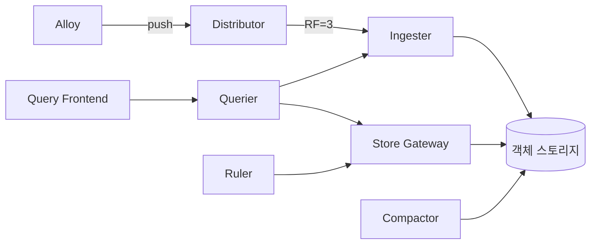
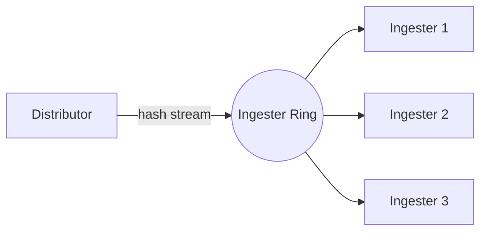
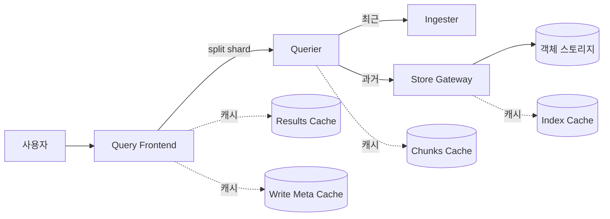
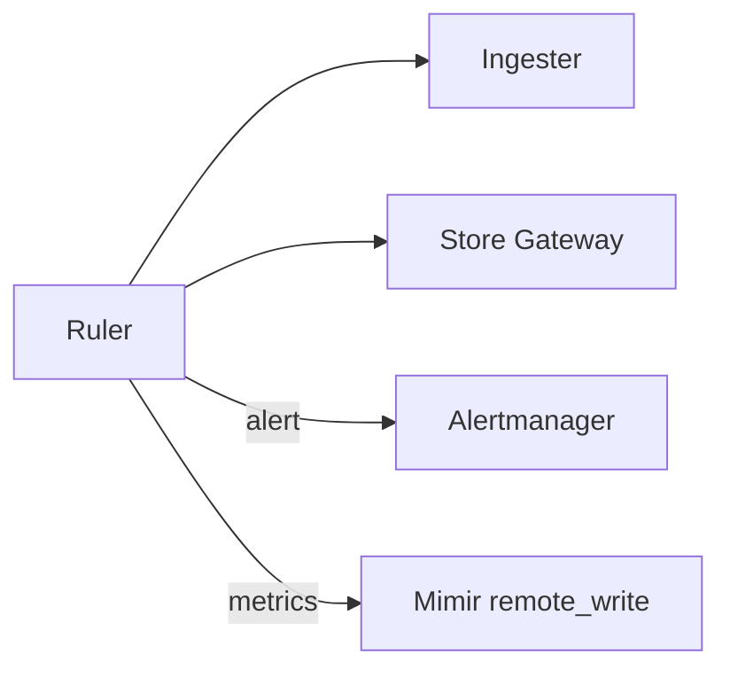
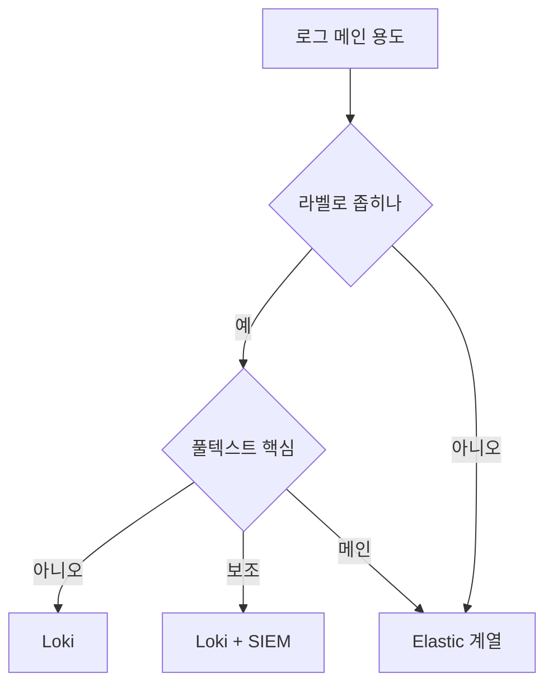

# Loki

> "로그 본문을 인덱싱하지 않는다." Loki의 한 줄 철학이자, Elastic과
> 갈리는 모든 운영 의사결정의 출발점이다. label만 인덱스, 본문은 압축
> chunk로 객체 스토리지에 통째로 적재한다. 그 결과 비용은 1/10 수준,
> 다만 label 설계를 잘못하면 그대로 튕겨 나간다.

- **주제 경계**: 이 글은 **Loki의 인덱싱 모델·label 전략·chunk·비용**을
  다룬다. 수집 파이프라인은
  [로그 파이프라인](log-pipeline.md), 구조화·샘플링은
  [로그 운영 정책](log-operations.md), 풀 텍스트 우선 시나리오는
  [Elastic Stack](elastic-stack.md) 참조.
- **선행**: [관측성 개념](../concepts/observability-concepts.md),
  [Prometheus 아키텍처](../prometheus/prometheus-architecture.md) (label
  모델이 동일).

---

## 1. 한 줄 철학 — "Prometheus for logs"

Loki는 Prometheus의 label 모델을 로그에 그대로 옮긴다. 같은 label 집합을
가진 로그 라인의 시계열을 **stream**이라 부르고, stream 내부는 시간
순서대로 압축된 **chunk**로 잘라 객체 스토리지에 던진다.

| 항목 | Loki | Elasticsearch |
|---|---|---|
| 인덱싱 대상 | label만 | 본문 전체(역색인) |
| 검색 모델 | label 매칭 → chunk grep | 토큰 매칭 |
| 저장소 | 객체 스토리지 (S3·GCS·R2 등) | SSD 로컬 디스크 |
| 비용 구조 | 저장↓ · 쿼리 시 CPU↑ | 저장↑ · 쿼리 빠름 |
| 적합 워크로드 | 라벨 기반 좁힘 후 grep | 비정형 풀텍스트, SIEM |

> Elastic이 "**모든 단어를 미리 색인**"이라면 Loki는 "**라벨로 좁히고
> 본문은 brute-force grep**". 두 비용 곡선이 정반대다.

---

## 2. 아키텍처 — 한 바이너리, 세 모드

Loki는 **monolithic / simple scalable / microservices** 세 가지 배포
모드를 같은 바이너리(`-target=` 플래그)로 지원한다.



| 컴포넌트 | 역할 |
|---|---|
| **Distributor** | 수신 시 stream 해싱, validation, RF만큼 ingester fanout |
| **Ingester** | 메모리에 stream 누적, chunk 컷팅 후 객체 스토리지 flush, WAL 보유 |
| **Querier** | LogQL 평가, ingester(최근) + store-gateway(과거) 결합 |
| **Store Gateway** | TSDB 인덱스·chunk를 객체 스토리지에서 로딩 |
| **Query Frontend** | 쿼리 분할·병렬화·결과 캐시 |
| **Compactor** | 인덱스 압축, retention/삭제 처리, dedup |
| **Ruler** | recording/alerting rule (LogQL → Alertmanager·remote_write) |
| **Bloom Planner/Builder** | (3.3+, 실험) structured metadata 블룸 필터 생성 |

### 2.1 배포 모드 선택

| 모드 | 인입 한계 | 운영 |
|---|---|---|
| **Monolithic** (single binary) | ~수십 GB/day | PoC·소규모 단일 노드. 모든 컴포넌트 한 프로세스 |
| **Simple Scalable** (read·write·backend) | ~수 TB/day | 3개 역할로 수평 확장 |
| **Microservices** | 수십 TB/day~ | SaaS·대규모. 각 컴포넌트 독립 스케일 |

> **2026 helm 차트 사실**: 공식 `grafana/loki` 차트의 기본은
> **SingleBinary**다. SimpleScalable·Distributed로 가려면
> `deploymentMode`를 명시 지정. 구식 `loki-stack`·`loki-simple-scalable`
> 차트는 deprecated이므로 신규 도입은 통합 `loki` 차트 사용.

---

## 3. HA·복제·WAL — 분산 quorum 시스템으로서의 Loki

Loki는 "라벨 인덱싱 안 하는 DB"이기 전에 **distributor가 ingester ring에
quorum write를 하는 분산 시스템**이다. 데이터 무손실 보장의 두 축은
복제(replication)와 WAL이다.

### 3.1 Hash Ring · Replication Factor



| 항목 | 의미 |
|---|---|
| `replication_factor` | stream 사본 수. **권장 3** |
| Quorum write | `floor(RF/2)+1` (RF=3 → 2). 쓰기 ack 조건 |
| Ring backend | `memberlist`(권장) / Consul / etcd |
| 토큰 분포 | 각 ingester가 토큰 N개 보유, stream 해시 기반 라우팅 |

> **운영 함정**: RF=1로 운영하다 ingester 한 대 OOM/롤아웃이 발생하면
> 그 시점의 in-memory chunk가 통째로 사라진다. 객체 스토리지에 flush
> 되기 전 데이터 = `chunk_idle_period` (기본 30m) 분량까지. **프로덕션은
> RF=3 + memberlist 기본값**.

### 3.2 Write-Ahead Log

Ingester 메모리는 RF로 보호되지만, **롤아웃·재시작 시점의 데이터
무손실은 WAL이 담당**한다. RF는 동시 장애를 막고, WAL은 의도된 재시작을
막는다 — 둘은 서로를 대체하지 않는다.

| 설정 | 의미 |
|---|---|
| `wal.enabled` | 기본 true |
| `wal.dir` | 디스크 경로 (StatefulSet PVC) |
| `wal.replay_memory_ceiling` | replay 시 메모리 상한, 초과 시 backpressure |
| `wal.flush_on_shutdown` | 셧다운 시 강제 flush |

> **K8s에서**: ingester는 반드시 StatefulSet + PVC. emptyDir 사용 시 pod
> 재시작에서 WAL 손실 → RF=3이라도 동시 롤아웃에서 데이터 유실 가능.

### 3.3 무중단 롤아웃

- ingester를 재시작할 때 `/ring` 엔드포인트로 `LEAVING` 상태 전환,
  hand-off 또는 flush 후 종료.
- `flushOnShutdown=true` + `terminationGracePeriodSeconds`를 chunk flush
  소요 시간보다 길게 (보통 600s+).
- PodDisruptionBudget으로 동시 unavailable ≤ RF/2-1 보장.

---

## 4. 인덱싱 — TSDB·v13 schema

Loki 2.8부터 **TSDB 인덱스**가 권장 기본값이고, 3.x는 **schema v13**이
기본이다 (Loki 2.9.x 호환). 이전의 BoltDB-shipper는 deprecated.

| Schema | 도입 | 핵심 |
|---|---|---|
| v11 | 2021 | dynamic shard 도입, BoltDB-shipper 시대 |
| v12 | 2022 | shard 효율 개선 (BoltDB·TSDB 공통) |
| **v13** | 2024-10 effective | **Structured Metadata 1급, OTLP 네이티브 엔드포인트** |

> **TSDB 인덱스 GA**: Loki 2.8 (2023-04). 즉 schema와 인덱스 포맷은 별개
> 축이다. 신규 도입은 **TSDB + v13** 조합.

### 4.1 TSDB가 BoltDB-shipper와 다른 점

- **Dynamic Query Sharding**: chunk 메타에 KB/라인수까지 들어가 Query
  Frontend가 쿼리당 처리량을 보고 분할 수를 동적으로 결정.
  `tsdb_max_bytes_per_shard` 기본 600 MB가 1 shard의 처리 목표.
- **Single Store**: 인덱스·chunk 모두 같은 객체 스토리지에 저장. 별도
  Cassandra/DynamoDB 불필요. Loki 2.8+ 권장 구성.
- **압축 효율**: 인덱스 자체가 작아 store-gateway 메모리 압력↓.

### 4.2 Structured Metadata (v13의 핵심)

라벨도 아니고 본문도 아닌 **3번째 차원**. 카디널리티 폭증 위험 없이
인덱싱-불가지론적 키-값을 stream에 붙인다.

```text
# 라벨   : {app="checkout", env="prod"}    ← 인덱스. 폭증 금지
# 메타   : trace_id=abc, request_id=xyz    ← 인덱스 X, 보존·필터 가능
# 본문   : "user 1234 paid 9.99"           ← grep 대상
```

OTLP 수신 시 OTel resource 속성 일부가 자동으로 structured metadata로
들어간다. 3.3+에서 **블룸 필터**가 이 메타를 가속한다.

---

## 5. label 전략 — Loki를 망치는 1순위 원인

### 5.1 절대 라벨로 쓰면 안 되는 것

| 안티패턴 | 이유 | 대안 |
|---|---|---|
| `request_id`, `trace_id` | unbounded 카디널리티 | **structured metadata** (v13) |
| `user_id`, `order_id` | unbounded | structured metadata 또는 본문 grep |
| `pod_name` (random suffix) | replicas만큼 stream 폭증 | `app`·`deployment` 라벨로 정규화 |
| `timestamp`, `epoch` | 무한 | 절대 금지 |
| `latency_ms`, `status_code` 그대로 | 카디널리티↑ | 본문 grep 또는 structured metadata |

### 5.2 좋은 라벨의 조건

1. **고정 집합** — 가능한 값이 미리 셀 수 있다
2. **저-중 카디널리티** — 라벨당 수십~수백 값
3. **자주 필터링** — 거의 모든 쿼리에서 쓴다
4. **stream 분리 의미** — 다른 라벨 조합과 섞일 일이 없다

권장 라벨 골격: `{cluster, namespace, app, env, level}`. 5개로 거의 모든
운영 쿼리를 좁힐 수 있다.

### 5.3 카디널리티 한도와 진단

- **Loki 기본 권장**: stream 라벨 ≤ 15개, 인스턴스당 active stream ~100k
  이하.
- **stream 폭증 증상**: ingester OOM, "max streams per user" 거부, 객체
  스토리지에 1KB 미만 chunk 폭증 (압축 효율 0).

진단 도구:

| 도구 | 용도 |
|---|---|
| `logcli series '{}'` | 실제 stream 카디널리티 점검 |
| `logcli stats '{app="x"}' --since=24h` | 처리 chunk 수·바이트, 쿼리 비용 추정 |
| `loki_ingester_memory_streams` | active stream 수, OOM 조기 경보 |
| `loki_ingester_chunk_size_bytes` | 평균 chunk 크기, 너무 작으면 라벨 폭증 신호 |

> **현장 규칙**: 라벨을 추가하기 전에 "이걸로 쿼리를 좁힐 것인가?"를
> 먼저 묻는다. 아니면 본문에 두고 grep/`json` 파서로 추출한다. 라벨은
> **잘라내는 칼**이지, 본문 검색의 인덱스가 아니다.

---

## 6. chunk — 저장 효율의 본질

Ingester는 stream별로 메모리에 라인을 누적하다가 cutoff 조건에 도달하면
chunk를 잘라 객체 스토리지에 flush한다.

| 파라미터 | 기본 | 의미 |
|---|---|---|
| `chunk_target_size` | 1.5 MB (압축 후) | flush 목표 크기. 압축 전 ~5 MB |
| `max_chunk_age` | 2h | 도달 시 강제 flush |
| `chunk_idle_period` | 30m | 라인 유입 멈춤 시 flush |
| `chunk_block_size` | 256 KB | chunk 내 검색 단위 |

### 6.1 chunk가 너무 작아지는 패턴

stream이 너무 많으면 (라벨 카디널리티↑) 각 stream에 라인이 적게 들어와
`chunk_target_size`에 도달하지 못한 채 `chunk_idle_period`에 걸려
flush된다. 결과:

- 객체 스토리지에 KB 단위 chunk 수백만 개 → **PUT 요금 폭발**
- 쿼리 시 store-gateway가 수십만 개 chunk를 list/fetch → **느림**
- 인덱스 row 수도 chunk 수만큼 늘어 인덱스 비대화

### 6.2 압축

- 기본 **gzip** (level 4 정도). zstd·snappy도 옵션.
- 압축률 5~15배 (라인 반복 정도에 따라).
- `chunk_encoding: snappy`는 CPU↓·크기↑, `gzip`은 CPU↑·크기↓.
  대규모 클러스터는 보통 **snappy**(수집), **gzip 재압축**(compactor)
  조합.

---

## 7. 쿼리 경로와 4-tier 캐시

쿼리는 단일 querier가 아니라 **Query Frontend → Querier → (Ingester +
Store Gateway) + 4중 캐시**를 통과한다. "느리다"는 보통 캐시 미스 영역.



### 7.1 시간 경계 — ingester vs store-gateway

| 설정 | 의미 |
|---|---|
| `query_ingesters_within` | 이 시간 이내 쿼리만 ingester까지 fan-out (보통 3h) |
| `query_store_max_look_back_period` | 이 시간 이전은 store-gateway만 사용 |
| `max_query_lookback` | 글로벌 쿼리 가능 최대 과거 |

### 7.2 4-tier 캐시

| 계층 | 캐시 대상 | 백엔드 권장 |
|---|---|---|
| **Results Cache** | 동일 LogQL 결과 (시간 align) | Memcached |
| **Chunks Cache** | 객체 스토리지 chunk 바이트 | Memcached (큰 항목 효율) |
| **Index Cache** | TSDB 인덱스 page | Memcached |
| **Write Dedup** | 중복 write metadata | Memcached |

> **백엔드 선택**: Loki 운영 가이드는 **Memcached 권장**. Redis도 동작
> 하나 큰 chunk 캐싱 효율이 떨어지고, multi-key 분산 일관성 모델이 다른
> 캐시 패턴과 안 맞는다.

### 7.3 LogQL — stream selector → pipeline

```logql
sum by (level) (
  rate(
    {app="checkout", env="prod"}    # stream selector (인덱스)
      |= "ERROR"                    # line filter (substring)
      | json                        # parser
      | duration > 500ms             # post-parse filter
    [5m]
  )
)
```

### 7.4 line filter 5종

| 연산자 | 의미 | 엔진 |
|---|---|---|
| `\|=` | 포함 | 단순 substring (가장 빠름) |
| `!=` | 미포함 | 단순 substring |
| `\|~` | 정규식 매칭 | regex 엔진 |
| `!~` | 정규식 미매칭 | regex 엔진 |
| `\|>` `!>` | **pattern match** (3.0+) | substring 기반, regex 대비 ~10배 빠름 |

### 7.5 자주 하는 실수

- `{app=~".+"}` 같은 **빈 selector** — 모든 stream을 훑는다.
  `max_query_series`로 거부되게.
- `|~ ".*foo.*"` — `|= "foo"`로 충분. regex 엔진은 substring보다 느리다.
- 30일 범위 + 좁지 않은 selector — 모든 chunk를 fetch. shard 수가 폭증
  하고 querier가 OOM.

---

## 8. Bloom Filter — 2026 현재 위치

3.0~3.3에서 Loki의 블룸 필터 방향이 크게 바뀌었다.

| 시점 | 모델 | 비고 |
|---|---|---|
| 3.0 | 본문 토큰 블룸 (실험) | 효과·비용 트레이드오프 미흡 |
| 3.3+ | **structured metadata 블룸** | 트레이스 ID·요청 ID 검색 가속 |
| 3.4·3.5 | Bloom Planner 안정화 진행 | **여전히 실험적** |

**현재(2026-04) 권장**: 운영 클러스터에 활성화하지 말고, 구조화 메타
검색이 핵심 use case일 때만 카나리 환경에서 평가. 기능 자체가 빈번히
재설계 중이다.

---

## 9. OTLP 네이티브 ingest

Loki 3.0부터 OTLP `/otlp/v1/logs` 엔드포인트를 1급 시민으로 지원.

| OTel 개념 | Loki에서 |
|---|---|
| Resource attributes (K8s pod·container 등) | **라벨**(고정 부분) + structured metadata |
| Log attributes | structured metadata |
| Body | 본문 (line) |
| SeverityNumber/Text | structured metadata로 매핑 |

> **주의**: OTel 자동 계측이 매우 풍부한 attribute를 보내므로 **모든
> resource attribute를 라벨화**하면 카디널리티가 폭발한다. Loki의 OTLP
> 수신 설정에서 `keep_resource_attributes` allowlist를 명시적으로 좁혀야
> 한다 (기본은 안전한 부분집합만 라벨화).

---

## 10. Ruler — recording·alerting rule

Ruler는 LogQL을 주기적으로 평가해 **recording rule**(메트릭화)과
**alerting rule**(Alertmanager로 라우팅)을 만든다. 그러나 Ruler가
querier·query-frontend를 거치지 않고 **자체적으로 ingester·store-gateway에
직접 쿼리**하므로 운영 한도를 별도 설정해야 한다.



| 항목 | 의미 |
|---|---|
| Ruler ring | recording rule을 ruler 인스턴스에 sharding |
| `ruler.alertmanager_url` | alert 라우팅 대상 |
| `ruler.remote_write` | recording rule 결과를 Mimir·Prometheus로 push |
| `ruler.evaluation_interval` | 평가 주기 (기본 1m) |
| 테넌트별 rule | `/loki/api/v1/rules/{tenant}` API로 격리 |

> **운영 함정**: querier 한도(`max_query_parallelism`)와 Ruler 한도는
> 별도다. recording rule이 폭주해 store-gateway를 압박하는 사고가 잦다.
> ruler 전용 한도(`ruler.max_query_*`) 명시적으로 cap.

> **메트릭화 패턴**: 자주 쓰이는 LogQL 집계
> (`rate({app="x"} |= "ERROR" [5m])`)를 recording rule로 사전 계산해
> Mimir로 `remote_write` → 대시보드는 가벼운 메트릭 쿼리로 대체. 비용
> 곡선이 뒤집힌다.

---

## 11. Multi-tenancy

Loki는 **모든 API에 `X-Scope-OrgID` 헤더**로 테넌트를 구분한다.
멀티테넌시는 SaaS·플랫폼팀의 도입 결정 본질.

### 11.1 한도 모델 (per-tenant)

| 한도 | 의미 |
|---|---|
| `ingestion_rate_mb`·`ingestion_burst_size_mb` | distributor 진입 속도 |
| `max_global_streams_per_user` | 클러스터 전체 stream 상한 |
| `max_streams_per_user` | ingester 인스턴스 stream 상한 |
| `max_query_parallelism` | 쿼리 분할 동시성 |
| `max_query_length`·`max_query_lookback` | 쿼리 시간 범위 |
| `max_entries_limit_per_query` | 단건 쿼리 최대 라인 수 |
| `retention_period` | 테넌트별 보존 기간 override |

### 11.2 runtime config

`runtime_config`로 재시작 없이 per-tenant override를 핫리로드. 신규
테넌트 추가·trouble한 테넌트 throttle은 모두 이 파일.

```yaml
overrides:
  team-a:
    ingestion_rate_mb: 50
    retention_period: 168h
  team-b:
    max_global_streams_per_user: 10000
```

### 11.3 테넌트 federation

쿼리 시 `X-Scope-OrgID: team-a|team-b`로 **여러 테넌트 동시 조회** 가능
(`auth.multi_tenant_enabled: true`). 플랫폼팀 SRE가 글로벌 알림 평가에
유용.

---

## 12. Mimir·Tempo 통합 — Grafana 스택의 자리

Loki를 단독으로 쓰는 경우는 드물다. 메트릭은 Prometheus·Mimir, 트레이스는
Tempo와 짝을 이뤄 운영하는 게 표준.

| 통합 | 메커니즘 | 효과 |
|---|---|---|
| Loki Ruler → **Mimir** | recording rule 결과를 `remote_write` | 로그 기반 메트릭(SLI)을 메트릭 백엔드에 보존 |
| Loki ↔ **Tempo** | structured metadata에 `trace_id`, Grafana data link로 점프 | 로그 → 트레이스 1-click 이동 |
| Tempo exemplar → Loki | 트레이스 → 같은 `trace_id`로 로그 검색 | 트레이스 → 로그 역방향 |
| Loki self-monitoring | Loki 자체 메트릭을 Mimir에 적재 | meta-monitoring 분리로 **자기 자신을 모니터링하지 않기** |
| Loki 오류 로그 → Loki | meta-cluster | 운영 클러스터와 monitoring 클러스터 분리 권장 |

> **메타-모니터링 원칙**: 운영 Loki가 죽으면 그 알림도 같이 죽는다. 작은
> 별도 Loki + Mimir 인스턴스(보통 single-binary)로 운영 클러스터 자체를
> 감시. Grafana Cloud Logs 가이드도 같은 권장.

[Mimir·Thanos·Cortex 비교](../metric-storage/mimir-thanos-cortex.md),
Tempo는 추후 [tracing/jaeger-tempo.md](../tracing/jaeger-tempo.md) 참조.

---

## 13. 비용 — 모델 차이를 숫자로

가정: 10 TB/day 압축 전, 365일 보관.

| 항목 | Loki + S3 | Elastic (warm 포함) |
|---|---|---|
| 저장 (인덱스 포함) | 압축 후 ~700 GB/day, S3 표준 | 1.5~3x 원본, 핫 SSD |
| 월 저장 비용 | ~$500 (S3 표준 + 일부 IA) | $5k~$15k (인스턴스 SSD + 노드) |
| 컴퓨트 | querier 스케일 (쿼리 시 burst) | 상시 높은 노드 수 |
| 풀텍스트 검색 | 라벨로 좁히기 전엔 느림 | 빠름 |

> 숫자는 환경에 따라 ±50% 흔들리지만 **자릿수**는 거의 항상 갈린다. 라벨로
> 좁힐 수 있는 워크로드면 Loki, 자유 검색이 본질이면 Elastic.

---

## 14. 운영 체크리스트

### 14.1 ingest 측

- 객체 스토리지 백엔드 선정 (S3 / GCS / R2 / MinIO). **lifecycle policy**로
  오래된 chunk 자동 IA·Glacier 이전.
- S3 prefix 분산 — chunk 객체가 millions 단위로 늘면 단일 prefix throttle
  발생. Loki는 자동으로 시간/테넌트 prefix 분산하지만 **bucket 모니터링**
  (4xx 비율, throttle 메트릭) 필수.
- 라벨 정책 문서화. PR 리뷰에 라벨 신규 추가 게이트.
- Distributor에 `ingestion_rate_mb`·`ingestion_burst_size_mb`·
  `max_streams_per_user` 한도 설정 (테넌트별).
- `max_label_value_length`·`max_label_names_per_series` 보호.

### 14.2 query 측

- Query Frontend로 **반드시** 분할·병렬화·캐시. 직접 querier 호출은 금지.
- `split_queries_by_interval: 30m` 기본. 24h 쿼리 = 48 shard.
- `max_query_length: 720h` (30일) 정도로 cap. 그 이상은 별도 export.
- 결과 캐시는 **Memcached** (Redis보다 큰 chunk 캐싱 효율↑).

### 14.3 compactor

- **Main compactor는 singleton**. 인덱스 압축·retention·dedup 본 작업은
  단일 인스턴스 모델 그대로다.
- 3.x에 **horizontal scaling (실험)** 옵션이 추가됨 — Main 1개 + Worker
  N개. **Worker는 line-filter 기반 대량 삭제 가속만** 담당. 일반
  retention/compaction에는 사용하지 않음.
- retention 룰 활성화 (`compactor.retention_enabled: true`). 테넌트별 보존
  override 가능.
- 삭제 요청 (`/loki/api/v1/delete`) — GDPR/PII 대응. 실제 삭제는
  compaction 시점에 수행. 대량 삭제 시 worker 실험적으로 평가.

### 14.4 재해복구

| 시나리오 | Loki 상태 | 복구 |
|---|---|---|
| ingester 1대 OOM | RF=3이면 무손실 | 재시작 → WAL replay |
| ingester 전체 동시 롤아웃 | 마지막 N분 in-memory 손실 가능 | PDB·rolling으로 예방 |
| 객체 스토리지 한 리전 장애 | 쿼리 불가, ingest는 가능 (WAL 누적) | cross-region replication 사전 구성 |
| 객체 스토리지 데이터 손실 | flush된 chunk 복구 불가 | versioning + cross-region replication |
| 인덱스만 손상 | chunk는 살아있으니 재생성 가능 | compactor가 점진 복구 |

> **객체 스토리지 versioning + lifecycle 함정**: versioning을 켠 채
> lifecycle delete를 걸면 DeleteMarker가 누적되어 list 비용이 폭증한다.
> noncurrent version expire 룰을 함께 걸어야 한다.

### 14.5 모니터링

| 메트릭 | 의미 |
|---|---|
| `loki_ingester_memory_streams` | active stream 수, OOM 조기 경보 |
| `loki_distributor_bytes_received_total` | ingest 처리량 |
| `loki_request_duration_seconds` (querier) | 쿼리 P95/P99 |
| `loki_compactor_oldest_pending_delete_request_age_seconds` | 삭제 지연 |
| chunk 크기 평균 | 너무 작으면 라벨 폭증 신호 |

---

## 15. 안티패턴 모음

| 안티패턴 | 결과 | 교정 |
|---|---|---|
| pod_name·request_id를 라벨로 | stream 수만 개 폭증, 1KB chunk | structured metadata로 이동 |
| `level=info`만 라벨 | level 5개 stream만 만들고 나머지 정보 손실 | `app·env·cluster` 우선 |
| Promtail로 신규 도입 | **EOL 지남 (2026-03-02)** | **Grafana Alloy** 필수 |
| BoltDB-shipper 인덱스 신규 | 더 이상 신규 기능 미지원 | TSDB v13 |
| 풀텍스트 검색 메인 use case | 비싼 brute force | 그 영역은 Elastic·ClickHouse·VictoriaLogs |
| RF=1 운영 | ingester 한 대 사고로 데이터 유실 | RF=3 + WAL + StatefulSet PVC |
| ingester emptyDir | 롤아웃 시 WAL 손실 | StatefulSet + 영구 볼륨 |
| Compactor 다중 인스턴스(일반 작업용) | 인덱스 충돌 | Main 1개, Worker는 line-filter delete 한정 |

---

## 16. 결정 트리 — Loki를 쓸까?



- **Loki 적합**: K8s 컨테이너 로그, 애플리케이션 로그, 마이크로서비스
  trace 보조, 운영 alert 평가용 로그.
- **Loki 부적합**: SIEM·보안 헌팅, 비정형 로그 풀텍스트 검색이 본질,
  로그를 "데이터"로 분석(JOIN·집계)해야 하는 경우 → ClickHouse·OpenSearch
  검토.

### 16.1 vs 다른 로그 백엔드 (한 줄)

| 백엔드 | 강점 | 약점 |
|---|---|---|
| **Loki** | 라벨 기반·객체 스토리지·저비용 | 풀텍스트 brute force |
| **Elastic/OpenSearch** | 풀텍스트·SIEM·집계 | 저장·운영 비용↑ |
| **ClickHouse** | SQL·집계·압축 | 운영 학습곡선 |
| **VictoriaLogs** | 스트리밍 인덱스·저비용 | 생태계 작음 |

자세한 비교는 [Elastic Stack](elastic-stack.md) 참조.

### 16.2 OSS vs Grafana Cloud Logs vs GEL

| 옵션 | 라이선스 | 적합 |
|---|---|---|
| **Loki OSS** | AGPLv3 | 직접 운영, 비용 통제 |
| **Grafana Cloud Logs** | 매니지드 | 운영 부담 회피, 사용량 과금 |
| **Grafana Enterprise Logs (GEL)** | 상용 | per-tenant access policy·audit log·24/7 지원 |

> **AGPLv3 함정**: Loki를 SaaS의 일부로 외부에 노출하면 AGPL 의무가
> 발동한다. 사내 모니터링은 무관하지만 multi-tenant 호스팅을 제공한다면
> 라이선스팀 확인 필수.

---

## 17. Promtail → Alloy 마이그레이션

**Promtail은 2025-02-13부터 LTS 단계, 2026-03-02 EOL**. 이 글의 확인일
(2026-04) 시점 기준 **이미 EOL을 한 달 이상 지난 상태**다 — 보안 패치
없음. Grafana Alloy가 후속이며 OTel Collector 기반 단일 에이전트로
메트릭·로그·트레이스를 모두 수집한다.

| 항목 | Promtail | Alloy |
|---|---|---|
| 설정 | YAML (`scrape_configs`) | River (HCL 유사) `loki.source.*` |
| 컴포넌트 | Loki 한정 | OTel·Prom·Loki·Pyroscope 통합 |
| 보안 업데이트 | **종료** | 활성 |

> **Loki 입장에서 본 토폴로지**: Alloy(또는 OTel Collector)가 어떤 K8s
> attribute를 `loki.process` stage에서 stream label로 만들고 어떤 것을
> structured metadata로 보내는지가 카디널리티 결과를 결정한다. 라벨로
> 승격할 attribute allowlist를 명시적으로 관리.

자세한 비교·전환 패턴은 [로그 파이프라인](log-pipeline.md) 참조.

---

## 참고 자료

- [Loki Architecture (공식)](https://grafana.com/docs/loki/latest/get-started/architecture/) (확인 2026-04-25)
- [Single Store TSDB](https://grafana.com/docs/loki/latest/operations/storage/tsdb/) (확인 2026-04-25)
- [Label Best Practices](https://grafana.com/docs/loki/latest/get-started/labels/bp-labels/) (확인 2026-04-25)
- [Cardinality](https://grafana.com/docs/loki/latest/get-started/labels/cardinality/) (확인 2026-04-25)
- [Loki 3.0 Release — Bloom Filters & OTLP](https://grafana.com/blog/grafana-loki-3-0-release-all-the-new-features/) (확인 2026-04-25)
- [Loki 3.3 Release — Structured Metadata Blooms](https://grafana.com/blog/2024/11/21/grafana-loki-3.3-release-faster-query-results-via-blooms-for-structured-metadata/) (확인 2026-04-25)
- [Loki v3.5 Release Notes](https://grafana.com/docs/loki/latest/release-notes/v3-5/) (확인 2026-04-25)
- [Migrate to TSDB](https://grafana.com/docs/loki/latest/setup/migrate/migrate-to-tsdb/) (확인 2026-04-25)
- [Bloom Filters Operations](https://grafana.com/docs/loki/latest/operations/bloom-filters/) (확인 2026-04-25)
