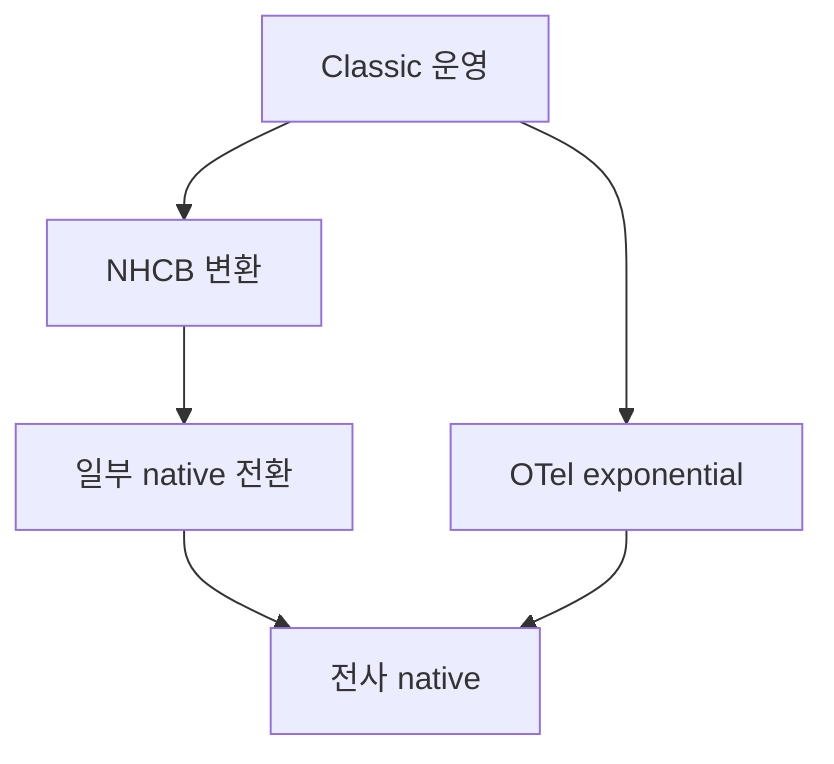

# 히스토그램 — Classic·Native·Exponential

> 분포(latency·payload size)는 평균·max로 표현하지 못한다. 히스토그램이
> 답이지만, **classic histogram은 카디널리티 폭탄**이고 정확도는 버킷
> 설계 운에 달렸다. **Native(Prometheus)·Exponential(OTel) 히스토그램**이
> 그 두 문제를 동시에 푼다.

- **주제 경계**: 이 글은 **저장 모델·정확도·운영 비용**. PromQL에서의
  사용은 [PromQL 고급](../prometheus/promql-advanced.md), 카디널리티 통제
  전반은 [카디널리티 관리](cardinality-management.md), 백엔드 측 처리는
  [Mimir·Thanos·Cortex·VM](mimir-thanos-cortex.md) 참조.
- **선행**: [Prometheus 아키텍처](../prometheus/prometheus-architecture.md),
  [Remote Write](../prometheus/remote-write.md).

---

## 1. 왜 분포를 다뤄야 하는가

| 통계량 | 표현하는 것 | 못 보여주는 것 |
|---|---|---|
| 평균 | 전체 추세 | 꼬리(tail) 사용자 경험 |
| max | 최악 단일 샘플 | 빈도, p99 |
| p50/p90/p99 | tail latency | 어디서 발생? (라벨 보존) |
| 분포 | 모양 자체 | (거의 모든 것을 보여줌) |

> SLO·고객 영향은 **꼬리에서 결정**된다. p50이 멀쩡해도 p99가 무너지면
> 일부 사용자는 서비스가 죽은 것과 같은 경험을 한다. 분포를 안 보면
> 이를 놓친다.

---

## 2. Prometheus의 세 가지 길 — Summary·Classic·Native

| 항목 | Summary | Classic Histogram | Native Histogram |
|---|---|---|---|
| 양자수 | 클라이언트 측 미리 계산 | 서버 측 시계열 집합으로 보존 | 서버 측 1개 시계열로 보존 |
| 집계 가능 (서버 합산) | **불가** | 가능 (버킷 일치 필요) | 가능 (스키마 일치) |
| 시리즈 수 (라벨 1조합당) | 3 (`_count`/`_sum`/quantile) | **N+3** (N=버킷 수) | 1 |
| 정확도 조정 | quantile 추가 시 클라이언트 재배포 | 버킷 추가 시 재배포 + 카디널리티 폭증 | 스키마 인자만 조정 |
| 카디널리티 부담 | 낮음 | **높음** | **매우 낮음** |
| 클라이언트 비용 | 정렬·streaming quantile 계산 | 가산만 | 가산 + 인덱스 계산 |

### 2.1 핵심 결론

- **Summary**: "이 인스턴스 한 곳의" quantile만 정확히 보고 싶을 때.
  여러 인스턴스 합산이 안 돼 글로벌 SLO에는 부적합.
- **Classic Histogram**: 광범위 도입의 표준이지만 **카디널리티 부담이
  큼**. 라벨 조합 × 버킷 수가 곱으로 폭발.
- **Native Histogram**: 2026 시점에서 신규 도입의 기본 선택.

---

## 3. Classic Histogram — 무엇이 문제인가

### 3.1 구조

각 버킷이 **별개의 시계열**. `_bucket` 시계열에 `le` (less than or equal)
라벨로 cumulative count 보존.

```
http_request_duration_seconds_bucket{le="0.005"} 4
http_request_duration_seconds_bucket{le="0.01"} 12
http_request_duration_seconds_bucket{le="0.025"} 38
...
http_request_duration_seconds_bucket{le="+Inf"} 200
http_request_duration_seconds_count 200
http_request_duration_seconds_sum 19.34
```

### 3.2 카디널리티 폭탄

기본 버킷 수는 라이브러리별로 11~12개(`+Inf` 포함) + `_count` + `_sum` =
**하나의 라벨 조합당 13~15개 시계열**(client_golang `DefBuckets` 11 +
`+Inf` + count + sum = 14). 라벨 차원이 곱해지면:

| 라벨 차원 | 조합 수 | classic histogram 시리즈 수 (×14) |
|---|---|---|
| service(5) × endpoint(20) | 100 | **1,400** |
| 위에 method(4) × status(5) 추가 | 2,000 | **28,000** |
| 위에 region(3) × tenant(50) 추가 | 300,000 | **4,200,000** |

> 한 메트릭이 4M 시계열을 차지한다. 백엔드 active series 한도를 단숨에
> 채우는 시나리오. `le` 라벨이 곱셈 폭탄의 본질.

### 3.3 버킷 설계의 함정

- **너무 적으면**: quantile 보간 오차 큼.
- **너무 많으면**: 카디널리티 폭증.
- **잘못 잡으면**: SLO 임계(예: 200ms)가 버킷 경계와 어긋나 quantile이
  부정확. SLO 알람의 신뢰도 무너짐.
- **재배포 필요**: 버킷 변경은 클라이언트 코드 재배포가 필요.

---

## 4. Native Histogram — Prometheus의 답

### 4.1 핵심 아이디어

**한 시계열이 분포 전체를 담는다**. 버킷은 **지수 함수**로 동적 생성,
빈 버킷은 저장하지 않음(sparse). 버킷 경계를 사전에 정의하지 않아도 됨.

| 특성 | 의미 |
|---|---|
| First-class composite sample | 한 timestamp에 `count`+`sum`+sparse buckets를 한 묶음으로 저장 |
| Sparse 표현 | 빈 버킷은 0 비용 |
| 지수 버킷 (`schema`) | 모든 floating point 범위를 동일 상대오차로 커버 |
| 동적 해상도 | 데이터에 따라 schema 조정 가능 |

### 4.2 Schema와 정확도

상대 오차 정의: **(base - 1) / (base + 1)** — 한 버킷 폭의 절반을
중심값으로 나눈 값. base = `2^(2^-schema)`.

| schema | base | 1·2 사이 버킷 | 상대 오차 (±) | 비고 |
|---|---|---|---|---|
| -4 | 65,536 | 0 (한 버킷이 1~65536) | 사실상 무의미 | 매우 거친 분해능 |
| 0 | 2 | 1 | 33% | 1·2·4·8 경계 |
| 3 | ≈1.0905 | 8 | 4.3% | 일반 권장 시작점 |
| 5 | ≈1.0219 | 32 | 1.08% | 고정밀 |
| 8 | ≈1.00271 | 256 | 0.135% | 최고 분해능 |

> **schema n과 n+1은 mergeable**. n+1이 두 버킷을 합치면 n이 된다. 즉
> **다른 해상도로 측정한 데이터를 무손실 다운스케일하여 합산** 가능.
> classic의 "버킷 일치 필요" 제약이 사라진다.

### 4.3 구성요소 — 단순 buckets만이 아니다

| 요소 | 설명 |
|---|---|
| `count`, `sum` | 총 관측 수, 총합 |
| **Positive buckets** | 양수 영역의 sparse 버킷 (index → count) |
| **Negative buckets** | 음수 영역의 sparse 버킷 (부호 있는 값 측정 시) |
| **Zero bucket** | `[-zero_threshold, +zero_threshold]` 사이 관측치 카운트 |
| `schema` | 현재 해상도 (자동 다운스케일 가능) |
| Exemplar 리스트 | 0개 이상, **timestamp 필수** (트레이스 점프) |

> **자동 다운스케일**: 활성 버킷이 `MaxBucketNumber` 초과 시 schema가
> 한 단계 줄어 두 버킷이 하나로 병합. 분포가 넓어지면 정확도를 양보하고
> 메모리를 보존. classic histogram에서는 불가능한 동작.

### 4.4 Status (2026)

- **v3.8.0 (2025-11)**: Native Histograms **stable** 진입.
- **v3.9.0 (2026-01)**: `--enable-feature=native-histograms` 플래그가
  **완전 no-op**으로 전환. `scrape_native_histograms`, `send_native_histograms`는
  **계속 default `false`** — scrape config에 `scrape_native_histograms: true`를
  명시해야 수집된다. Remote Write 송신은 별도로 `send_native_histograms: true`.
- TSDB·remote write 1.0/2.0·federation 모두 지원.
- v4.0의 default 정책은 2026-04 시점에 공식 확정 없음.

### 4.5 PromQL — Classic vs Native 매핑

native에서는 `_bucket`/`_sum`/`_count` 접미어가 사라지고 metric 자체가
composite. alert·dashboard 마이그레이션 시 **`_count`·`_sum` 사용 부분이
가장 많이 깨진다** — 다음 표가 핵심:

| 목적 | Classic | Native |
|---|---|---|
| quantile | `histogram_quantile(0.99, sum by(le)(rate(M_bucket[5m])))` | `histogram_quantile(0.99, sum(rate(M[5m])))` |
| 총 관측 수 | `M_count` | `histogram_count(M)` |
| 총합 | `M_sum` | `histogram_sum(M)` |
| 평균 | `rate(M_sum[5m])/rate(M_count[5m])` | `histogram_avg(rate(M[5m]))` |
| 구간 비율 (SLO 임계 이하 비율) | (수동 보간) | `histogram_fraction(0, 0.2, rate(M[5m]))` |
| 표준편차·분산 | (불가) | `histogram_stddev(M)`, `histogram_stdvar(M)` |

> `histogram_fraction(lower, upper, v)`은 **SLO "200ms 이하 비율" 계산을
> 한 줄**로 만들어준다. classic에서는 두 버킷의 차분으로 수동 보간했던
> 부분이 사라진다.

---

## 5. NHCB — Native Histogram with Custom Buckets

### 5.1 동기

NHCB는 단순한 임시방편이 아니다. 두 가지 의의:
1. **classic 광범위 운영 자산 보호** — 클라이언트 무변경, 저장 효율은
   native 수준.
2. **OTel explicit bucket histogram의 1급 시민화** — OTel SDK 다수가
   explicit bucket을 사용하는 현실에서 Prometheus가 받아들일 수 있는
   유일한 path.

### 5.2 특성

- Schema **`-53`** (특수 값) — 명시 버킷 경계를 메타로 보존.
- Classic histogram → NHCB 변환을 **scrape 시점에** 수행 (Prometheus 측).
- **저장 효율 30%+ 개선** (단일 시계열 + sparse 표현).
- 클라이언트는 그대로 classic histogram 노출, 서버에서 native로 저장.

### 5.3 OTel 호환의 다리

OTel SDK 다수가 explicit bucket histogram을 사용한다. Prometheus는
v3.4(2025-05)부터 **OTel explicit bucket histogram → NHCB 변환** 기능
플래그를 추가, OTLP push 데이터의 카디널리티 부담을 백엔드에서 흡수한다.

### 5.4 NHCB가 exponential보다 나은 경우

- **SLO 임계와 정확히 일치하는 버킷이 필요한 시나리오**. 예: SLO 200ms
  → 200ms를 정확히 경계로 가져가야 percentile 보간 오차 없이 SLO
  ratio를 계산. exponential은 schema에 따라 200ms 근처에 다른 경계가
  생긴다.
- **레거시 alert rule이 특정 `le` 경계에 묶여 있을 때**. 단계적 전환을
  위해 경계 보존이 필요한 경우.

### 5.5 한계

- Schema -53끼리는 **버킷 경계가 같아야 mergeable**. classic의 "버킷
  일치 필요" 제약이 그대로 따라온다.
- 진정한 mergeable·해상도 자유는 exponential native histogram(schema
  -4 ~ 8)에서만 얻는다.

---

## 6. OpenTelemetry Exponential Histogram

### 6.1 모델

OTel는 두 가지 분포 메트릭을 정의한다:

| 타입 | 설명 |
|---|---|
| Explicit Bucket Histogram | classic 스타일. 명시 경계, 호환성 우선 |
| Exponential Histogram | Prometheus native와 등가. 동적 해상도 |

### 6.2 Scale·Base·버킷

핵심 식: **base = 2^(2^-scale)**, 1과 2 사이 버킷 수 = **2^scale**.
상대 오차는 `(base-1)/(base+1)`.

| scale | base | 1·2 사이 버킷 | 상대 오차 (±) |
|---|---|---|---|
| 0 | 2 | 1 | 33% |
| 3 | ≈1.0905 | 8 | 4.3% |
| 5 | ≈1.0219 | 32 | 1.08% |
| 10 | ≈1.000677 | 1,024 | 0.034% |
| 20 (SDK default `MaxScale`) | ≈1.0000007 | 1,048,576 | ~3×10⁻⁵% |

> SDK는 `max_size` (기본 160 버킷)에 맞춰 **scale을 자동 다운스케일**.
> 분포가 넓어지면 scale이 줄어 정확도를 양보하고 메모리를 보존.

### 6.3 OTel ↔ Prometheus 매핑

- OTel `scale` ≡ Prometheus `schema`.
- Prometheus 표준 schema 범위: **-4 ~ +8**. NHCB는 schema **-53** 한 가지.
- OTel는 spec이 고정 범위를 강제하지 않고, **SDK가 합리적 min/max scale을
  유지**하도록 위임. default `MaxScale`은 20.
- OTel exponential → Prometheus native: 같은 모델, scale 변환.
- OTel explicit → Prometheus NHCB: 위 §5.3.

### 6.4 메모리·CPU 비용

- 메모리는 **활성 버킷 수에 비례**. 분포가 좁으면 매우 작음.
- CPU는 `log2`/`floor` 한 번이면 인덱스가 결정됨 — classic과 비슷한 수준.
- 백엔드 측 압축·전송 비용은 classic 대비 5~10배 절감 사례가 일반.

---

## 7. 백엔드 호환성 (2026-04 기준)

| 백엔드 | Prometheus Native | OTel Exponential | NHCB | 비고 |
|---|---|---|---|---|
| Prometheus 자체 | 안정 | 변환 후 native로 저장 | 안정 | v3.8 stable |
| Mimir | 안정 | 안정 | 안정 | 3.0에서 query 최적화 |
| Thanos | 지원 | 변환 경유 | 지원 | block 포맷 호환 |
| VictoriaMetrics | 지원 | 변환 경유 | 지원 | (자체 스토리지 형식으로 저장) |
| Cortex | 지원 (제한) | 제한 | 제한 | maintenance, **신규는 Mimir 권장** |

> **경고**: 백엔드 측에서 native 지원이 stable이라도 **Grafana 대시보드·alert
> 룰이 native PromQL 형태에 맞춰져 있어야** 한다. 대시보드 마이그레이션
> 비용이 도입의 실질 장벽인 경우가 많다.

---

## 8. 마이그레이션 전략

### 8.1 단계적 전환 — 권장 경로



| 단계 | 변경점 | 위험 |
|---|---|---|
| ① NHCB 변환 | 서버 설정 1개. 클라이언트 무변경 | 대시보드 PromQL 변경 필요 |
| ② 라이브러리 점진 native | 서비스 단위 전환 | 두 형태 공존 — 조회 일관성 주의 |
| ③ 전사 native | classic 사용처 제거 | dashboard·alert 일괄 검수 |

### 8.2 OTel SDK에서 시작한다면

- SDK 측 `Aggregation` 정책을 `ExponentialHistogram`으로 명시.
- 기본 max scale 20, max size 160은 대부분 적정. 메모리 압박이 있으면
  max size를 줄여 자동 다운스케일 유도.
- `view`/`view_pattern`으로 메트릭별 다른 정책 적용 가능.

### 8.3 클라이언트 라이브러리 별 활성화 (2026-04 기준)

| 언어 | 옵션·상태 |
|---|---|
| Go (`client_golang` 1.18+) | `NativeHistogramBucketFactor`, `NativeHistogramMaxBucketNumber`, `NativeHistogramMinResetDuration`, `NativeHistogramMaxZeroThreshold`. stable. |
| Java (`client_java` 1.x = `prometheus-metrics-core`) | `Histogram.Builder().nativeInitialSchema(n).nativeMaxNumberOfBuckets(k).nativeOnly()`. **legacy `simpleclient` 0.x는 미지원**. |
| Python (`client_python`) | **2026-04 기준 native histogram 미지원** (issue 추적 중). OTel SDK 사용 권장. |
| OTel SDK (Java·Go·Python·.NET 등) | View 기반: `ExponentialBucketHistogramAggregation(maxSize=160, maxScale=20)` (언어별 클래스명 상이) |

> 라이브러리·버전마다 옵션 이름과 stable 여부가 다르다. **반드시 사용 중
> 버전의 docs를 확인**하고 도입.

---

## 9. 운영 함정

### 9.1 두 형태가 공존할 때

같은 메트릭 이름으로 classic·native 양쪽이 시계열을 만들면 PromQL이
잘못 평가된다. 단일 metric은 **반드시 한 형태로 통일**.

### 9.2 Bucket 수 폭주 (잘못된 schema 설정)

schema가 너무 높으면 활성 버킷이 폭증해 카디널리티 이득이 사라진다.
schema 3~5에서 시작해 분포·메모리를 보고 조정.

### 9.3 정확도 환상

high schema라도 **샘플 수가 적으면 quantile 신뢰도가 낮음**. p99는 통상
1,000+ 샘플이 있어야 안정적. trace·log를 함께 보지 않으면 단일 분포로
단정하지 말 것.

### 9.4 Recording Rule

native histogram에서도 **Recording Rule로 quantile 사전 계산**이 가능.
`histogram_quantile`을 매번 계산하는 비용을 줄인다 — 단, recording은
**rate(metric)**의 결과를 저장해야 시간 정합성이 맞는다.

### 9.5 Cardinality는 아직 살아있다

native가 `le` 차원 폭증을 없애도 **다른 라벨 차원의 곱셈은 그대로**.
"native로 바꾸면 카디널리티가 해결된다"는 오해 — 부분 해결일 뿐.

### 9.6 Exemplar 호환성

Native histogram sample은 각 timestamp당 **0개 이상의 exemplar 리스트**
(timestamp 필수)를 가진다. classic의 `_bucket{le=...}_exemplar`와 wire
포맷이 달라 **트레이스 점프 대시보드는 native 전환 시 재검수 필수**.
OpenMetrics는 v1까지 native histogram exemplar 미지원, v2에서 명세화
진행 중. exemplar 중심 SLO·디버깅 워크플로우가 있다면 마이그레이션
체크리스트 1번 항목.

### 9.7 통계적 표본 수 — n × (1−φ) ≥ 10 룰

quantile 신뢰도는 표본 수의 함수.

| 목표 | 최소 표본 (rule of thumb) |
|---|---|
| p95 | n ≥ 200 |
| p99 | n ≥ 1,000 |
| p99.9 | n ≥ 10,000 |

> 트래픽이 적은 endpoint에 p99 alert를 걸어두면 noise가 끊이지 않는다.
> "low-traffic 서비스는 p95 또는 raw count alert"가 실전 정석.

---

## 10. 의사결정 가이드

새 서비스 신규 도입:
- → **OTel SDK + Exponential Histogram** 또는 **Prometheus client + Native**

기존 classic 광범위 운영, 서버 측 부하 중심 문제:
- → **NHCB 변환** 활성화 (클라이언트 무변경)

클라이언트가 OTel SDK, 백엔드가 Prometheus 호환:
- → SDK는 Exponential, Prometheus 측 OTLP receiver가 native로 변환

대시보드·alert 룰 마이그레이션 인력이 없을 때:
- → 일단 classic 유지. NHCB 변환만 켜두고 점진 전환 계획.

---

## 11. 함께 보기

- [PromQL 고급](../prometheus/promql-advanced.md) — `histogram_quantile`·`rate` 함정
- [카디널리티 관리](cardinality-management.md) — `le` 폭탄 외의 차원
- [Mimir·Thanos·Cortex·VM](mimir-thanos-cortex.md) — 백엔드 호환성
- [Recording Rules](../prometheus/recording-rules.md) — quantile 사전 계산
- [Remote Write](../prometheus/remote-write.md) — native histogram 전송 옵션

---

## 참고 자료

- [Prometheus Native Histograms 스펙](https://prometheus.io/docs/specs/native_histograms/) — 확인 2026-04-25
- [Prometheus v3.8 릴리스](https://github.com/prometheus/prometheus/releases/tag/v3.8.0) (2025-11) — 확인 2026-04-25
- [Prometheus v3.9 릴리스 (feature flag no-op)](https://github.com/prometheus/prometheus/releases/tag/v3.9.0) (2026-01) — 확인 2026-04-25
- [Prometheus v3.7 릴리스 (NHCB·Federation)](https://github.com/prometheus/prometheus/releases/tag/v3.7.0) (2025-10) — 확인 2026-04-25
- [Prometheus v3.4 릴리스 (NHCB·OTel 변환)](https://github.com/prometheus/prometheus/releases/tag/v3.4.0) (2025-05) — 확인 2026-04-25
- [Modernizing Prometheus — Native Storage](https://prometheus.io/blog/2026/02/14/modernizing-prometheus-composite-samples/) (2026-02) — 확인 2026-04-25
- [OpenTelemetry Metrics Data Model](https://opentelemetry.io/docs/specs/otel/metrics/data-model/) — 확인 2026-04-25
- [OpenTelemetry Exponential Histograms (Blog)](https://opentelemetry.io/blog/2023/exponential-histograms/) — 확인 2026-04-25
- [Histograms and summaries (Prometheus 실무 가이드)](https://prometheus.io/docs/practices/histograms/) — 확인 2026-04-25
- [Visualize native histograms (Mimir)](https://grafana.com/docs/mimir/latest/visualize/native-histograms/) — 확인 2026-04-25
- [Native histogram custom buckets proposal (NHCB)](https://github.com/prometheus/proposals/blob/main/proposals/0031-classic-histograms-stored-as-native-histograms.md) — 확인 2026-04-25
