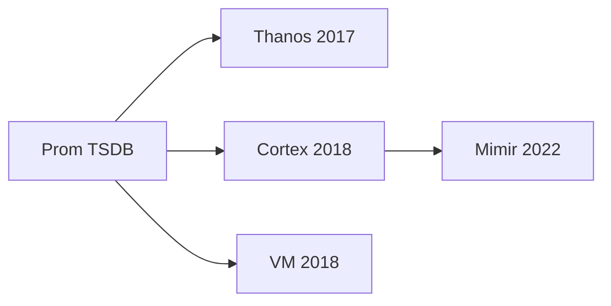
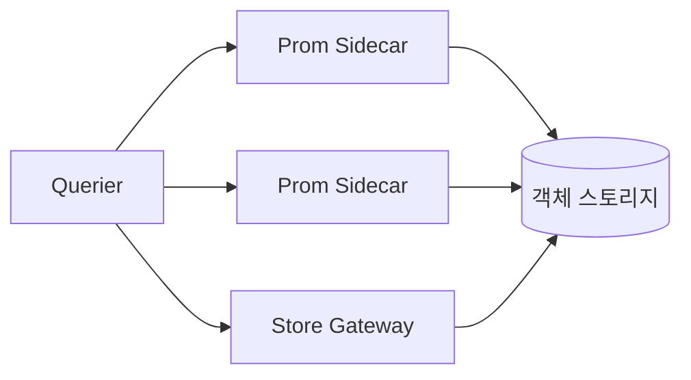
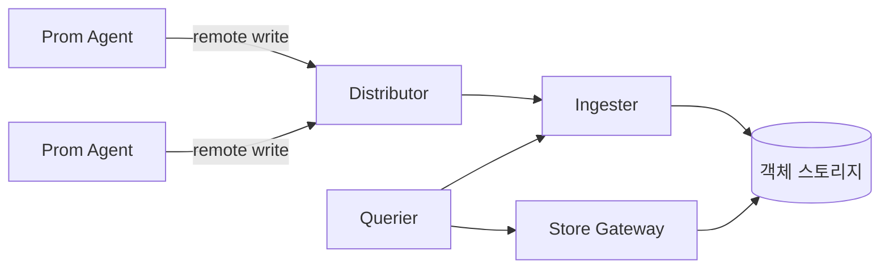
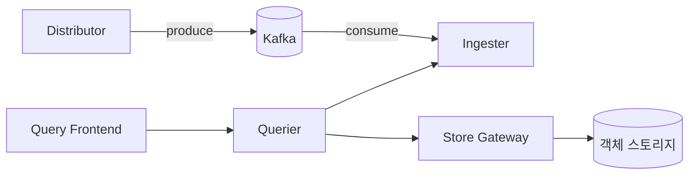
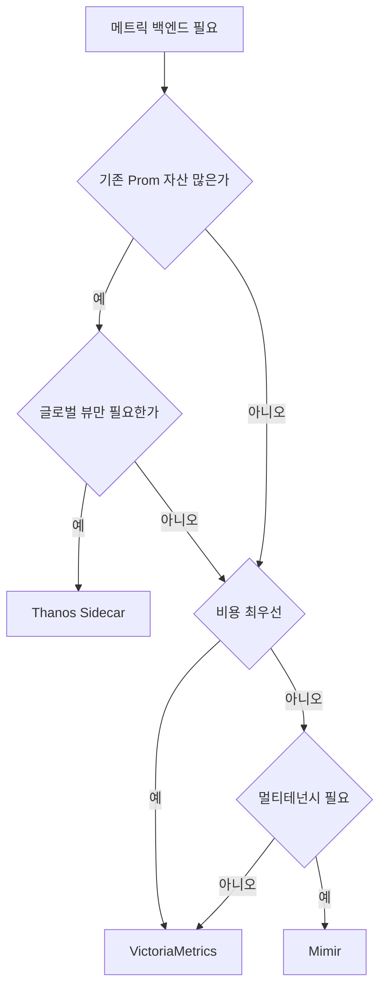

# Mimir·Thanos·Cortex·VictoriaMetrics

> Prometheus는 단일 노드 TSDB다. **글로벌 뷰**, **고가용**, **장기 보관**,
> **멀티 테넌시** 어느 하나라도 필요해지는 순간 외부 백엔드가 필요해진다.
> 4개 프로젝트가 같은 문제를 서로 다른 철학으로 푼다.

- **주제 경계**: 이 글은 **백엔드 비교·아키텍처·운영 특성**을 다룬다.
  Prometheus 측 push 메커니즘은
  [Remote Write](../prometheus/remote-write.md), 카디널리티 통제는
  [카디널리티 관리](cardinality-management.md), Native Histogram 저장은
  [히스토그램](exponential-histograms.md) 참조.
- **선행**: [Prometheus 아키텍처](../prometheus/prometheus-architecture.md),
  [Remote Write](../prometheus/remote-write.md).

---

## 1. 한눈에 — 무엇을 풀고 있는가

| 풀려는 문제 | Prometheus 단독 | 외부 백엔드 |
|---|---|---|
| 보관 기한 | 로컬 디스크에 한정 (보통 15d) | 객체 스토리지 수년 |
| 단일 노드 SPOF | 있음 | 복제·샤딩으로 제거 |
| 멀티 클러스터 글로벌 뷰 | 없음 | Querier가 여러 source 통합 |
| 멀티 테넌시 | 없음 (인스턴스 분리만) | tenant ID로 격리 |
| Active series 수억 | 무리 | 수평 확장으로 가능 |

> 4개 프로젝트는 모두 **이 다섯을 푸는 방식**으로 비교된다. 같은 정답은
> 없고, 운영 모델·비용 구조·생태계 적합도가 갈린다.

---

## 2. 4파전 계보 — 왜 4개인가

| 프로젝트 | 출신 | 핵심 베팅 | 코드 출신 |
|---|---|---|---|
| **Thanos** | Improbable·CoreOS, 2017 | Prometheus 사이드카 + 객체 스토리지 | Prometheus 코드 재사용 |
| **Cortex** | Weaveworks, 2018 | 멀티테넌트 SaaS 메트릭 | Prometheus 코드 재사용 |
| **Mimir** | Grafana, 2022 (Cortex fork, AGPLv3) | Cortex 최적화·운영 단순화 | Cortex 기반 |
| **VictoriaMetrics** | VictoriaMetrics Inc, 2018 | 처음부터 신규 구현, 비용 효율 | scratch (Prometheus 호환) |

**중요한 현재(2026) 상태**:
- **Cortex**는 CNCF Incubating으로 남아 릴리스가 계속되지만, **핵심
  메인테이너 다수가 Mimir로 이동**해 기능·성능 개발 속도는 Mimir·VM·Thanos
  대비 크게 둔화됐다. AGPLv3를 피해야 하거나 기존 Cortex 운영을 유지하는
  경우가 아니라면 **신규 도입은 Mimir 또는 VM 우선 검토**.
- **Mimir 3.0** (2025-11): Kafka 기반 ingest storage, MQE 기본화.
- **Thanos 0.40.x**: 6주 릴리스 케이던스, 안정 운영.
- **VictoriaMetrics 1.136.x LTS** (2026-03): 12개월 LTS 지원.

---

## 3. 아키텍처 패턴 — 두 갈래

### 3.1 Sidecar 모델 (Thanos 전통)

- **Prometheus는 그대로** scrape·local TSDB 보유. Sidecar가 2시간 단위
  block을 객체 스토리지에 업로드.
- **장점**: 기존 Prometheus 자산 재활용, 백엔드 장애 시 데이터 유실 0
  (로컬 TSDB가 source of truth).
- **단점**: 각 Prometheus가 stateful, 로컬 디스크 필요. Querier가
  실시간 쿼리 시 Prometheus까지 fan-out → 한 인스턴스 느리면 전체 느림.

### 3.2 Remote Write 모델 (Mimir·Cortex·VM·Thanos Receive)

- **Prometheus는 stateless** ([Agent 모드](../prometheus/remote-write.md#5-agent-모드))로
  scrape만 하고 push.
- **장점**: Prometheus 무상태 → 재시작·교체 단순. 글로벌 ingest path가
  하나라 멀티테넌시·전역 룰·Alert가 자연스러움.
- **단점**: Ingester가 새로운 SPOF (보통 RF=3 복제), 백엔드 장애 시
  Prometheus 측 WAL 백압이 발생.

> **선택의 분기점**: 이미 Prometheus 운영 자산이 많고 외부 의존을
> 최소화하고 싶다면 **Sidecar(Thanos)**. 새로 짓거나 Prometheus를
> 단순화하고 싶다면 **Remote Write 백엔드(Mimir·VM)**.

### 3.3 2024~2026 변수 — Prometheus 자체 진화

| 항목 | 영향 |
|---|---|
| Prometheus **OOO ingestion** (2.55+) | sidecar dedup 의존도 감소, HA pair 운영 단순화 |
| **Remote Write 2.0** (2024 GA) | Native Histogram·Exemplar 1급, metadata 통합. Mimir·Thanos Receive·VM 모두 호환 작업 진행 |
| **Native Histograms** | 백엔드 측 저장 효율 변수 — [히스토그램](exponential-histograms.md) 참조 |

> 4파전의 운영 모델은 "백엔드 vs 백엔드"만으로 결정되지 않는다.
> Prometheus 측 진화가 sidecar/remote-write 선택 자체를 흔든다.

---

## 4. Thanos 상세

### 4.1 컴포넌트

| 컴포넌트 | 역할 |
|---|---|
| **Sidecar** | Prometheus 옆에서 block을 객체 스토리지에 업로드 |
| **Receive** | Remote Write 수신, 자체 TSDB 운영 (sidecar 대체) |
| **Querier** | PromQL 입구, sidecar·store-gateway·receive에 fan-out |
| **Store Gateway** | 객체 스토리지 block을 쿼리 시점에 로딩 |
| **Compactor** | block 병합, downsample 5m·1h, retention 적용 |
| **Ruler** | recording/alerting rule 평가 (Querier 경유) |

### 4.2 Sidecar vs Receive — 운영자의 분기점

| 항목 | Sidecar | Receive |
|---|---|---|
| Prometheus 모델 | stateful | stateless 가능 |
| 쿼리 일관성 | Prom 인스턴스마다 millisecond drift | 동일 timestamp (dedup 효율) |
| 운영 복잡도 | 낮음 (Prom 옆에 붙기만) | 높음 (Receive hashring·복제 관리) |
| 네트워크 단절 내성 | 강 (로컬에 누적) | 약 (Receive 다운 시 WAL 압박) |
| 적합 | 기존 Prom 클러스터 활용 | k8s에서 Prom을 단순화하고 싶을 때 |

> **2026 권장**: 글로벌 뷰만 필요하면 Sidecar, 멀티테넌시·중앙 ingest가
> 필요하면 Mimir 또는 Receive. Receive는 hashring 관리가 까다로워 운영
> 인력에 따라 선택지가 갈린다.

### 4.3 다운샘플링

Compactor가 5m·1h 해상도로 자동 다운샘플. raw + 5m + 1h block이 공존하며
Querier가 쿼리 시간 범위에 맞춰 자동 선택. 장기 쿼리 비용을 크게 줄이는
Thanos 고유 기능.

---

## 5. Cortex — 짧게

- 2018 Weaveworks 시작, CNCF Incubating.
- **사실상 Mimir에 흡수**. 2026 신규 도입 비추천.
- 기존 운영 중이라면 [Cortex → Mimir 마이그레이션
  가이드](https://grafana.com/docs/helm-charts/mimir-distributed/latest/migration-guides/migrate-from-cortex/)
  이용. block 포맷이 호환되어 점진 전환 가능.
- AWS Managed Prometheus(AMP)는 내부적으로 Cortex 기반이지만, AMP는 AWS가
  유지보수하는 별도 노선이라 OSS Cortex 정체와 무관.

---

## 6. Mimir 상세 — 2026의 사실상 표준

### 6.1 배포 모드 — 3가지

| 모드 | 컴포넌트 배치 | 적합 |
|---|---|---|
| **Monolithic** | 단일 바이너리에 모든 컴포넌트 | 평가·소규모 |
| **Read-Write** | write·read·backend 3-tier | 중규모, 운영 단순화 |
| **Microservices** | Distributor·Ingester 등 개별 배포 | 대규모 production |

> 공식 `mimir-distributed` Helm chart는 **microservices 전용**. monolithic을
> 쓰려면 단일 바이너리 또는 jsonnet으로 배포해야 한다. helm으로
> monolithic을 시도하다가 막히는 사례가 흔하다.

### 6.2 컴포넌트 (microservices)

| 컴포넌트 | 역할 |
|---|---|
| **Distributor** | 수신·검증·해싱·복제 라우팅 (RF=3) |
| **Ingester** | 최근 12~24h를 메모리·WAL에 보관, 2h마다 block flush |
| **Querier** | PromQL 평가, ingester+store-gateway에서 데이터 가져옴 |
| **Query-Frontend** | 큰 쿼리 splitting/sharding, 결과 캐시, queueing |
| **Store-Gateway** | 객체 스토리지 block의 인덱스를 sharding하여 서비스 |
| **Compactor** | block 병합, dedup, retention. **다운샘플링은 없음** |
| **Ruler** | recording/alerting rule 평가, AlertManager로 forward |

> **Thanos와의 차이**: Mimir에는 **다운샘플링이 없다**. 대신 query
> sharding과 sharded compactor로 쿼리 효율을 끌어올린다. 장기 쿼리는
> Recording Rule로 사전 집계하는 패턴 권장.

### 6.3 Query Sharding — Mimir의 핵심 성능 무기

큰 쿼리(`sum`·`avg`·`count`·`topk`)를 query-frontend가 N개의 shard로
쪼개 querier들에 병렬 분배. associative 집계만 shardable이며 **non-shardable
함수**는 영향 없다.

| 분류 | 예시 | shardable |
|---|---|---|
| Associative | `sum`, `avg`, `count`, `min`, `max`, `topk` | 예 |
| Non-associative | `histogram_quantile`, `absent_over_time`, `quantile_over_time` | 아니오 |

> 카디널리티가 높은 메트릭에 wide aggregation을 쓰는 대시보드일수록
> sharding 효과가 크다. 반대로 `histogram_quantile`을 그대로 쓰는
> 대시보드는 sharding 이득이 없어, 사전 recording rule로 quantile을 미리
> 만들어두는 것이 권장 패턴.

### 6.4 Mimir 3.0 — Ingest Storage (Kafka 기반)

2025-11 출시. **Apache Kafka가 distributor와 ingester 사이의 비동기
버퍼**. 읽기·쓰기 path를 분리하는 결정적 변경. Kafka **API 호환** 백엔드
(WarpStream·Redpanda)도 공식 지원되어, BYOK·SaaS 선택지가 넓다.

| 항목 | 전통 (≤2.x) | Ingest Storage (3.0) |
|---|---|---|
| Distributor → Ingester | 동기 push (RF=3 복제) | Kafka 비동기 produce |
| Ingester 장애 영향 | 쓰기 path 직접 영향 | Kafka가 흡수 |
| 읽기·쓰기 격리 | 같은 ingester 공유 | 완전 분리 |
| 리소스 절감 | — | 약 15% (Grafana 자체 측정) |
| 메모리 사용 (쿼리) | — | MQE로 최대 92% 감소 |

**운영 함의**:
- Kafka 클러스터 추가 운영 부담. 단, 대규모 환경에서는 안정성 이득이 큼.
- Ingester 재시작·롤링 업그레이드 시 쓰기 영향 거의 없음.
- 레플리카 팩터 의미가 변함 — Kafka 측 RF가 핵심.

### 6.5 MQE (Mimir Query Engine)

2.17부터 도입, 3.0에서 기본. **streaming evaluation**으로 큰 쿼리도
메모리에 전체 시리즈를 올리지 않음. 100% PromQL 호환.

### 6.6 멀티테넌시

- HTTP 헤더 `X-Scope-OrgID`로 tenant 분리.
- tenant별 limit (ingestion rate, max series, query series 등).
- **shuffle sharding**으로 noisy neighbor 격리. Thanos Receive의 멀티테넌시는
  "soft" 수준(라우팅·기본 limit) — Mimir의 hard tenancy(per-tenant rate
  limit·shuffle sharding·query 스케줄링 우선순위)와 격차가 있다.

### 6.7 GEM (Grafana Enterprise Metrics) 관계

- **Mimir = OSS, GEM = 그 위 enterprise 라이선스 상위판**. 인증·감사
  로그·세분화된 권한·고급 한도 정책 등이 추가된다.
- Grafana Cloud Metrics는 Mimir(+GEM 일부 기능)를 운영하는 SaaS.
- AGPLv3 부담을 회피하려는 조직은 GEM 또는 Cloud로 우회한다.

---

## 7. VictoriaMetrics 상세

### 7.1 두 가지 배포 모델

| 모델 | 컴포넌트 | 추천 ingest |
|---|---|---|
| Single-node | 단일 바이너리 (vmstorage 통합) | < 1M samples/sec |
| Cluster | vminsert + vmstorage + vmselect | 그 이상 |

> Single-node가 vertical scaling 한계까지는 cluster보다 빠름. **불필요하면
> single-node로 시작하라**가 공식 권고.

### 7.2 컴포넌트 (Cluster)

| 컴포넌트 | 역할 |
|---|---|
| **vminsert** | 수신·해싱·복제·tenant 라우팅 (Mimir Distributor 대응) |
| **vmstorage** | TSDB. **로컬 블록 스토리지** (S3 아님) |
| **vmselect** | 쿼리 라우팅·집계 (Querier+Frontend 통합) |
| **vmagent** | scrape·remote-write proxy (Prometheus Agent 대체) |
| **vmalert** | rule 평가 (Mimir Ruler 대응) |
| **vmauth** | 멀티테넌시·인증 게이트웨이 |

### 7.3 핵심 설계 차이

- **TSDB는 로컬 블록**: 핫 데이터는 EBS·NVMe에 보관. 지연·처리량 유리.
  단, **백업·DR은 vmbackup/vmrestore가 S3·GCS·Azure를 사용**한다 — TSDB
  자체와 백업 경로가 분리되어 있다.
- **MetricsQL**: PromQL **호환** + 확장. `rate`/`increase`가 lookbehind
  바깥 마지막 샘플을 사용해 그래프 끝부분 dip 문제 해결, metric name
  보존 등. Grafana 대시보드는 호환되지만 100% 등가는 아님.
- **deduplication**: HA Prometheus pair에서 중복 ingest되면 자동 dedup.
  설정 한 줄로 활성화.
- **다운샘플링은 Enterprise 한정** (`-downsampling.period`). OSS에는 없다.
- **stream aggregation** (`-streamAggr`): vmagent·vmselect·vmstorage 측에서
  ingestion 단계에 사전 집계. **카디널리티 절감용 백엔드 내장 도구**로,
  Mimir·Thanos에는 직접 대응이 없다.
- **resource efficiency**: 동일 워크로드에서 Mimir 대비 메모리 약 5배,
  CPU 약 1.7배 절약 보고 (VM 자체 벤치, 워크로드별 검증 필요).

---

## 8. 4파전 비교 — 결정 매트릭스

### 8.1 코어 특성

| 항목 | Thanos | Cortex | Mimir | VictoriaMetrics |
|---|---|---|---|---|
| 저장소 | 객체 스토리지 (S3·GCS) | 객체 스토리지 | 객체 스토리지 | 로컬 블록 (EBS·NVMe) |
| Ingest | sidecar / receive | remote_write | remote_write | remote_write (vmagent) |
| 다운샘플링 | 5m·1h 자동 | 없음 | 없음 | 없음 (recording rule 권장) |
| 멀티테넌시 | receive에서 지원 | 일급 | 일급 | vmauth |
| 쿼리 언어 | PromQL | PromQL | PromQL (+MQE) | MetricsQL (PromQL 슈퍼셋) |
| 라이선스 | Apache 2.0 | Apache 2.0 | AGPLv3 | Apache 2.0 |
| 라이선스 함의 | SaaS 제공 자유 | SaaS 제공 자유 | **수정 후 네트워크 제공 시 수정본 공개** | SaaS 제공 자유 |

> **AGPLv3 정확한 의미**: §13에 따라 **수정한 버전을 네트워크로 서비스할 때**
> 수정본의 소스를 사용자에게 공개해야 한다. Mimir를 **수정 없이 그대로**
> 호스팅하는 SaaS에는 의무가 발생하지 않는다. 다만 보안·내부 패치 정책상
> AGPLv3 코드의 사내 포크 자체를 금지하는 조직이 많아 실무 도입 장벽으로
> 작동한다.

### 8.2 운영·생태계

| 항목 | Thanos | Cortex | Mimir | VictoriaMetrics |
|---|---|---|---|---|
| 활발도 (2026) | 안정·6주 케이던스 | maintenance | 가장 활발 | 활발·LTS 운영 |
| Helm chart | 공식·성숙 | 공식 | 공식 (mimir-distributed) | 공식 |
| K8s Operator | thanos-operator | cortex-operator (정체) | mimir Operator (early) | vm-operator (성숙) |
| Grafana 통합 | datasource | datasource | datasource (1급) | plugin |
| 상용 지원 | Red Hat·기타 | (실질 없음) | Grafana Labs (GEM) | VictoriaMetrics Inc |

### 8.3 적합도 결정 트리

---

## 9. 운영 함정 — 실전에서 자주 터지는 곳

### 9.1 객체 스토리지 비용 (Thanos·Mimir 공통)

- **API 요청 수가 진짜 비용**. block 수가 많으면 GET·LIST·HEAD가 폭증.
- Compactor를 잘 운영해야 block 수가 폭주하지 않음. compactor가
  뒤처지면 store-gateway 인덱스 캐시 효율이 무너짐.
- S3 lifecycle로 오래된 block은 Infrequent Access·Glacier로 이동
  가능하지만, store-gateway가 cold object를 로딩할 때 latency·비용 모두
  뛴다. 대개 **standard tier 유지가 무난**.

### 9.2 카디널리티 폭발 — 모두의 약점

- 어느 백엔드든 **active series 수가 비용·메모리의 1차 함수**.
- VictoriaMetrics는 "high cardinality"·"churn rate"를 FAQ에서 별도로
  경고. Mimir는 ingester OOM의 주범.
- **백엔드 내장 절감 도구**: VM의 stream aggregation(`-streamAggr`),
  Grafana Cloud의 Adaptive Metrics 같은 **runtime 집계**가 비용 통제의
  실전 무기. Mimir·Thanos OSS에는 동등 기능이 없어 vmagent·OTel
  Collector 측에서 사전 집계해야 한다.
- 통제 전반은
  [카디널리티 관리](cardinality-management.md) 참조.

### 9.3 Ingester / vmstorage 손실 = 최근 데이터 유실

- Remote Write 모델에서 ingester가 객체 스토리지에 flush 전이면 손실
  위험. Mimir는 **WAL + RF=3** 으로 방어. VM은 **vmstorage 복제
  (`-replicationFactor`)** 로 방어.
- Sidecar 모델은 Prometheus 로컬 TSDB가 source of truth라 이 위험이 낮음.

### 9.4 Replication Factor와 가용성

| 백엔드 | 권장 RF | 손실 허용 노드 |
|---|---|---|
| Mimir Ingester (전통, ≤2.x) | 3 | 1 (quorum 2/3) |
| Mimir Ingest Storage (3.0+, Kafka) | Kafka에 위임 | Kafka `min.insync.replicas`에 의존 |
| VM vmstorage | 2 또는 3 | RF-1 |
| Thanos Receive | 3 | 1 |

> Mimir 3.0의 **ingest storage 모드에서는 ingester가 Kafka consumer**로
> 전환되어, 전통적인 ingester RF 개념이 사실상 사라진다. 데이터 내구성은
> Kafka 토픽 RF·`min.insync.replicas`로 결정된다. 전통 모델은 3.0 이후
> deprecation 경로에 들어간다.

### 9.5 쿼리 시간 범위와 store-gateway

- 최근 N시간(보통 12~24h)은 ingester가 메모리에서 응답 → 빠름.
- 이전 데이터는 store-gateway가 객체 스토리지 block을 로딩 → 느림·비쌈.
- **자주 보는 장기 쿼리는 Recording Rule로 사전 집계** 필수. (Mimir는
  다운샘플링이 없어 더더욱 중요)

---

## 10. 마이그레이션 시나리오

### 10.1 Cortex → Mimir

block 포맷 호환. 단계:
1. Mimir 클러스터 신규 구축
2. Prometheus remote_write를 Mimir에도 동시 송신 (dual-write)
3. 기존 Cortex block을 Mimir 버킷으로 복사
4. 쿼리 클라이언트(Grafana)를 Mimir로 전환
5. Cortex 폐기

### 10.2 Thanos → Mimir

block 포맷이 다름 (TSDB 같지만 메타·라벨 인덱스 차이). **dual-write**
기간을 충분히 두고 retention 만료까지 양쪽 운영. Thanos block을 그대로
가져갈 수는 없다고 봐야 안전.

### 10.3 Prometheus → VictoriaMetrics

`vmctl`로 Prometheus snapshot 일괄 import. 가장 매끄러운 마이그레이션
경로 중 하나.

---

## 11. 의사결정 체크리스트

기존 Prometheus 자산이 크고 외부 의존 최소화:
- → **Thanos Sidecar**

수억 active series, 엄격한 멀티테넌시 격리, Grafana 생태계:
- → **Mimir** (Cloud로 시작 후 자체 운영도 옵션)

비용 효율·운영 단순성·자체 호스팅:
- → **VictoriaMetrics** (single-node 시작, 필요 시 cluster)

신규 Cortex 도입:
- → 하지 말 것. **Mimir 또는 VM 우선**.

라이선스 — Mimir 코드를 사내 포크·수정하여 SaaS 형태로 재판매할 가능성:
- → **AGPLv3 §13** 영향. 코드 수정·재판매 가능성이 있으면 **Thanos·VM**.

---

## 12. AWS·GCP Managed 옵션

| 서비스 | 백엔드 | 특징 |
|---|---|---|
| Amazon Managed Prometheus (AMP) | Cortex 기반 | AWS 운영, IRSA 통합 |
| Grafana Cloud Metrics | Mimir (+GEM) | Grafana Labs SaaS, Adaptive Metrics |
| Google Cloud Managed Service for Prometheus | Monarch 기반 자체 구현 | 글로벌 멀티 리전 |

> Managed를 쓰면 운영 부담은 사라지지만 **카디널리티·쿼리 비용은 그대로**.
> 비용 모델(active series·sample·쿼리)을 정확히 확인해야 비싼 청구서를
> 피한다.

---

## 13. 함께 보기

- [Remote Write](../prometheus/remote-write.md) — Prometheus 측 push 설정
- [Recording Rules](../prometheus/recording-rules.md) — 장기 쿼리 비용 절감
- [카디널리티 관리](cardinality-management.md) — 백엔드 비용 1차 함수 통제
- [히스토그램](exponential-histograms.md) — 분포 메트릭 저장 효율
- [Prometheus 아키텍처](../prometheus/prometheus-architecture.md) — 단일 TSDB 한계

---

## 참고 자료

- [Grafana Mimir 3.0 Release](https://grafana.com/blog/2025/11/03/grafana-mimir-3-0-release-all-the-latest-updates/) (2025-11) — 확인 2026-04-25
- [Mimir Architecture](https://grafana.com/docs/mimir/latest/get-started/about-grafana-mimir-architecture/) — 확인 2026-04-25
- [About Ingest Storage Architecture](https://grafana.com/docs/mimir/latest/get-started/about-grafana-mimir-architecture/about-ingest-storage-architecture/) — 확인 2026-04-25
- [Mimir Deployment Modes](https://grafana.com/docs/mimir/latest/references/architecture/deployment-modes/) — 확인 2026-04-25
- [Mimir Query Sharding](https://grafana.com/docs/mimir/latest/references/architecture/query-sharding/) — 확인 2026-04-25
- [Thanos Storage](https://thanos.io/tip/thanos/storage.md/) — 확인 2026-04-25
- [Thanos Sidecar vs Receiver (CNCF)](https://www.cncf.io/blog/2021/09/10/prometheus-ha-with-thanos-sidecar-or-receiver/) — 확인 2026-04-25
- [VictoriaMetrics Cluster Docs](https://docs.victoriametrics.com/victoriametrics/cluster-victoriametrics/) — 확인 2026-04-25
- [VictoriaMetrics vmbackup](https://docs.victoriametrics.com/vmbackup/) — 확인 2026-04-25
- [VictoriaMetrics FAQ](https://docs.victoriametrics.com/faq/) — 확인 2026-04-25
- [MetricsQL](https://docs.victoriametrics.com/victoriametrics/metricsql/) — 확인 2026-04-25
- [Migrate from Cortex to Mimir](https://grafana.com/docs/helm-charts/mimir-distributed/latest/migration-guides/migrate-from-cortex/) — 확인 2026-04-25
- [CNCF Cortex 프로젝트 페이지](https://www.cncf.io/projects/cortex/) — 확인 2026-04-25
- [AGPLv3 SaaS 의무 — opensource.com](https://opensource.com/article/17/1/providing-corresponding-source-agplv3-license) — 확인 2026-04-25
- [InfoQ — Mimir 3.0 Redesigned Architecture](https://www.infoq.com/news/2025/11/grafana-mimir-3/) (2025-11) — 확인 2026-04-25
