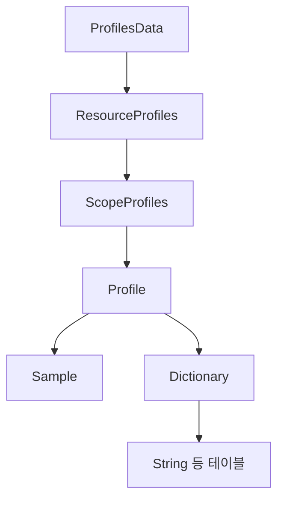
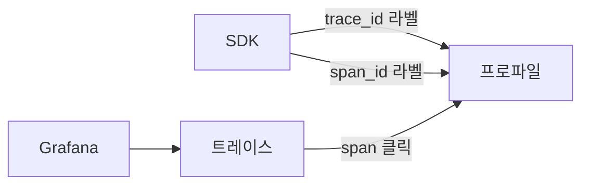
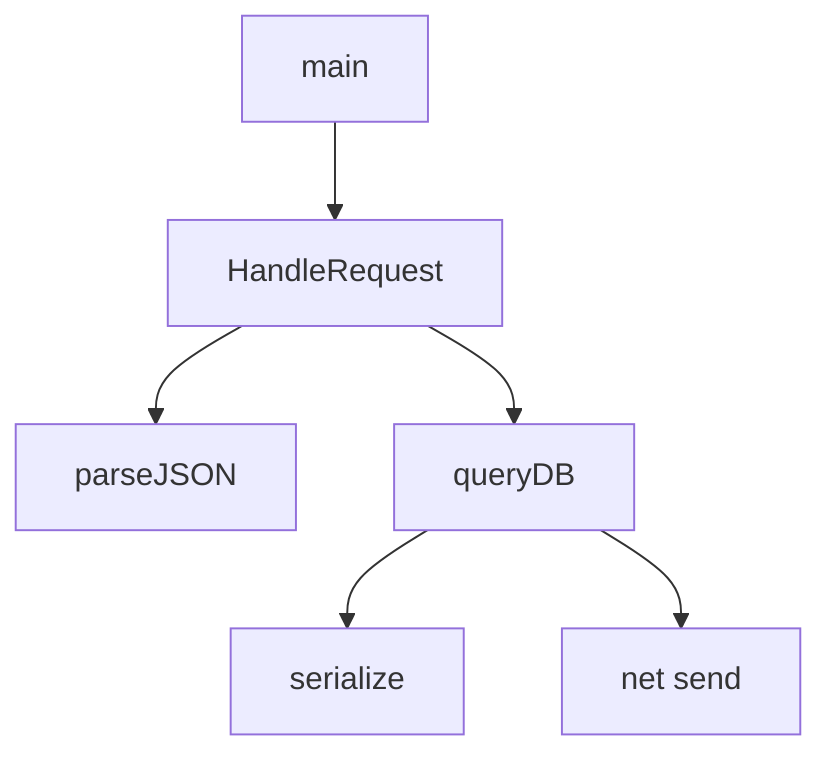

# 연속 프로파일링

> **네 번째 신호.** 메트릭은 "느리다"고 알려주고, 트레이스는 "어느
> 서비스의 어느 RPC가 느린가"를 알려준다. 프로파일은 "그 RPC 안에서
> **어느 함수의 어느 줄이** CPU·메모리를 태우고 있는가"를 알려준다.
> 2026년 시점은 **Grafana Pyroscope** (Grafana Labs OSS)와
> **Parca** (CNCF Sandbox)가 프로덕션 표준, **OpenTelemetry Profiles**가
> Public Alpha로 진입한 전환기다.

- **주제 경계**: 이 글은 **연속 프로파일링 시스템과 OTel Profiles 신호**를
  다룬다. eBPF 일반은 [eBPF 관측](../ebpf/ebpf-observability.md), 트레이스
  연동은 [Trace Context](../tracing/trace-context.md), 비용 통제는
  [관측 비용](../cost/observability-cost.md), 카디널리티는
  [카디널리티 관리](../metric-storage/cardinality-management.md) 참조.
- **선행**: [관측성 개념](../concepts/observability-concepts.md),
  [Semantic Conventions](../concepts/semantic-conventions.md).

---

## 1. 왜 "연속" 프로파일링인가

전통적 프로파일링은 개발자가 **사고가 났을 때** ssh로 들어가
`perf record`·`pprof.StartCPUProfile()`을 켜는 일회성 작업이었다.
한계가 분명하다.

| 한계 | 결과 |
|---|---|
| 사고 시점에 켜야 데이터를 얻음 | 재현 불가능한 회귀는 영원히 미해결 |
| 단일 프로세스만 | 분산 시스템 hot path 추적 불가 |
| 오버헤드 큰 도구 (`gprof`, instrumenting) | 프로덕션 상시 가동 불가 |
| 결과는 그래프 한 장 | 시간축·라벨·diff 비교 없음 |

**연속 프로파일링**은 다음을 충족한다.

- **항상 켜짐**: **per-CPU 19~99Hz 샘플링** (instrumenting 아님).
  per-CPU 오버헤드 **0.5~2%** 이내가 표준 — 64코어면 절대 sample/s는
  64×99 ≈ 6.3K, 합산 부하는 머신당 ~1코어 미만
- **시계열로 저장**: trace·메트릭처럼 **time-range 쿼리** 가능
- **라벨 차원**: `service.name`, `version`, `pod`, `region` 별로 차원 분할
- **diff 가능**: 배포 전후·릴리스 간 flame graph **차분 비교**
- **trace 연결**: span_id·trace_id를 프로파일에 넣어 트레이스→프로파일
  점프

> **언제 쓰면 안 되는가**: ① 함수 진입/종료 자체가 빈번한 마이크로벤치
> 측정 — 샘플링은 통계라 짧은 함수는 놓친다. instrumenting profiler
> (Java JFR `Method profiler`) 권장. ② 메모리 누수 추적 — alloc 프로파일은
> 누수 의심에 유용하지만, **heap dump + reference graph**가 더 정확하다.

---

## 2. 프로파일 종류 — 4대 시그널

| 종류 | 측정 방법 | 핵심 진단 |
|---|---|---|
| **CPU** | `PERF_COUNT_SW_CPU_CLOCK` 타이머 인터럽트 + 스택 캡처 | 핫 함수, 무한 루프, 락 스핀 |
| **Wall-clock (off-CPU)** | `kernel/sched_switch` 추적 | I/O 대기, 락 대기, GC stop-the-world |
| **Allocations (heap)** | `tcmalloc`·`jemalloc` hook, Go runtime, JVM TLAB | 메모리 폭발, GC 압박 |
| **Lock contention** | `pthread_mutex_lock` uprobe, JVM `JFR jdk.JavaMonitorWait` | 멀티코어 확장 실패 |

> **실무 우선순위**: CPU → off-CPU → heap. **CPU만으로 70%의 회귀가
> 잡힌다**. off-CPU·lock은 "왜 CPU가 안 도는데도 느린가"를 푼다.

> **단위 — adjusted count**: 샘플링 프로파일러는 N Hz로 sample을 찍는다.
> 1초간 100 sample 중 10개가 `foo()` 위에 있었다면 `foo()`는 약 **10%
> 시간 점유**. 절대 시간 = (samples in foo) / (samples total) × wall time.
> 라벨 차원으로 분할해도 같은 비례식이 성립.

---

## 3. 캡처 방식 — eBPF vs SDK

### 3.1 eBPF unwinder (시스템 와이드)

| 측면 | 동작 |
|---|---|
| 트리거 | `perf_event_open(PERF_COUNT_SW_CPU_CLOCK)` 19~99Hz |
| 캡처 | 인터럽트 시 현 task의 **커널·유저 스택**을 ring buffer로 |
| unwind | 프레임 포인터 또는 **DWARF `.eh_frame`** 기반 |
| 심볼화 | user-space에서 ELF·PDB·DWARF 파싱, `addr2line` 등가 |
| 대상 | **모든 프로세스** (재컴파일·재시작 불필요) |

> **frame pointer vs DWARF**: frame pointer 방식은 unwinder 구현에 따라
> DWARF 대비 **50~210배 빠르다** (Polar Signals·Red Hat 벤치). 그러나
> 컴파일러가 `-fomit-frame-pointer` 최적화 시 프레임 포인터가 사라진다.
> 최신 배포판 (Ubuntu 24.04+, RHEL 10+, Fedora 38+)은 시스템 라이브러리에
> frame pointer를 다시 켰다 (`-fno-omit-frame-pointer`). 컨테이너 베이스
> 이미지가 구형이면 DWARF로 fallback.

> **언어 런타임 함정**: Python·Ruby·Node·JVM은 **인터프리터 위의 가상
> 스택**을 갖는다. eBPF unwinder는 네이티브 스택만 보면 `python_eval()`
> 같은 인터프리터 함수만 잡힌다. **인터프리터별 unwind helper**가 필요
> (Pyroscope·OTel eBPF profiler가 Python·Ruby·Node·.NET·Java
> 인터프리터 unwinder를 내장).

### 3.2 SDK (in-process)

| 언어 | 표준 라이브러리 | 채집 방식 |
|---|---|---|
| **Go** | `runtime/pprof` (CPU·heap·goroutine·mutex·block) | 빌트인, ~100Hz |
| **Java** | **JFR** (OpenJDK 내장) 또는 **async-profiler** (외부, 권장) | JFR은 GC·alloc 강함, async-profiler는 wall·alloc·lock·CPU + trace label 통합 |
| **Python** | `py-spy`·`austin` (sampling) | OS-level, GIL 무관 |
| **Node.js** | `--prof` V8, `0x` | V8 ticks |
| **.NET** | `dotnet-trace`, `EventPipe` | CLR 내장 |
| **Ruby** | `rbspy`·`stackprof` | sampling |
| **Rust** | `pprof-rs`, `cargo flamegraph` | perf 기반 |

**SDK가 유리할 때**:
- **인터프리터 스택 정확**: SDK는 언어 런타임 내부에서 호출 — Java
  메서드 이름·라인까지 정확
- **alloc 프로파일**: heap·alloc은 런타임 hook이 정확. eBPF로는 어려움
- **자체 라벨**: SDK는 `WithLabelSet`으로 요청 ID·tenant 등 동적 라벨

**eBPF가 유리할 때**:
- **재시작 없이 프로덕션 적용**: SDK는 빌드·배포 필요
- **third-party 바이너리**: vendor lib·외부 프로세스도 함께 프로파일
- **저오버헤드 시스템 와이드**: 클러스터 전체 한 번에

> **하이브리드가 표준**: 핵심 마이크로서비스는 **언어 SDK** + 인프라·OS·
> 경량 컨테이너는 **eBPF**. Pyroscope·Parca 모두 두 모드를 동시 지원.

---

## 4. pprof — 데이터 모델의 사실상 표준

Go가 만든 **pprof 포맷**(protobuf)은 모든 프로파일러의 공용어가 됐다.

| 메시지 | 의미 |
|---|---|
| `Profile` | 한 캡처의 루트. 시간 범위, 샘플 타입, 매핑 목록 |
| `Sample` | 한 스택 샘플 — `[]Location` + `[]value` (CPU ns, alloc B 등) |
| `Location` | 메모리 주소 + `Mapping` 인덱스 + `[]Line` |
| `Mapping` | ELF 영역 (binary, base address, build_id) |
| `Function` | 이름·파일·시작 줄 |
| `Label` | 사용자 라벨 (request_id, tenant 등) |

> **deduplication이 핵심**: 같은 함수는 단 한 번 `Function` 테이블에
> 등록 → `Location`이 인덱스 참조. 1000초 프로파일도 ~수 MB로 압축됨
> (gzip + delta).

> **build_id의 역할**: ELF에 박힌 SHA1 빌드 식별자. 프로파일은 주소만
> 보내고 심볼화는 백엔드에서 build_id로 디버그 심볼을 매칭. 컨테이너
> 이미지에 `.gnu_debuglink` 또는 별도 debuginfod 서버 필요.

---

## 5. OpenTelemetry Profiles — 2026 Public Alpha

OTel **네 번째 신호**가 2026-03-26 공식 Public Alpha.

| 항목 | 상태 |
|---|---|
| 프로토콜 | **OTLP/Profiles** (protobuf, pprof와 1:1 round-trip) |
| 데이터 모델 | dictionary table (functions·strings·mappings 분리)로 deduplication |
| Collector | `pprofreceiver`, OTLP exporter, k8sattributes processor 통합 |
| eBPF 프로파일러 | **Elastic 기증한 universal profiler**가 OTel 본체로 이전 (`opentelemetry-ebpf-profiler`) |
| SemConv | `profiling.*` 속성 표준 진행 중 |
| GA 목표 | 2026 Q3~Q4 (Profiling SIG 로드맵) |
| 운영 권고 | "**Critical 프로덕션 워크로드 비권장**" — Spec·SDK 변경 가능 |

### 5.1 OTLP/Profiles 메시지 구조

Dictionary 항목은 **string·function·mapping·location·attribute** 5종
테이블로 분리되며, Sample/Location은 인덱스만 갖고 본문은 dedup 저장된다.

- 트레이스의 `ResourceSpans → ScopeSpans → Span` 계층과 동일
- **단일 Profile에 여러 sample type 동시 수용** — CPU + alloc 한 번에
- `Sample`에 `trace_id`·`span_id` attribute → **트레이스 클릭 → 그
  span의 프로파일** 전이 가능 (trace ↔ profile 상관)

### 5.2 OTel eBPF Profiler — Elastic 기증

| 특성 | 내용 |
|---|---|
| 출신 | Elastic Universal Profiling, 2024 OTel 기증 |
| 언어 unwinder | Go·JVM·Python·Ruby·Perl·PHP는 안정. **Node.js (V8)·.NET·BEAM/Erlang은 실험** — ARM64 미지원 또는 일부 버전 한정 |
| 커널 요건 | Linux 4.19+, eBPF + BTF |
| 심볼화 | debuginfod, S3·GCS·Azure object store fetch |
| 배포 | DaemonSet (K8s), systemd unit |

### 5.3 마이그레이션 시나리오

| 현재 | 권장 경로 |
|---|---|
| Pyroscope 운영 중 | **그대로 유지**. Pyroscope는 OTLP/Profiles 수신 native 지원. SDK·agent만 OTel으로 점진 교체 |
| Parca 운영 중 | 그대로 유지. Parca-agent → OTel eBPF profiler 교체 검토는 GA 이후 |
| 신규 도입 | **Pyroscope + OTel eBPF profiler** 또는 **Pyroscope + Grafana Alloy** ([Grafana Alloy](../grafana/grafana-alloy.md)). 백엔드는 Pyroscope, 수집은 OTel 표준 — vendor lock-in 회피 |
| 벤더 SaaS | Datadog·Elastic·Splunk Profiling은 OTLP/Profiles 수신 단계적 추가 중 |

> **GA 전 이주 위험**: alpha 단계에서 OTLP/Profiles 메시지 schema가
> 변경될 가능성. Production은 **Pyroscope native 포맷 + OTel SDK**의
> 안정 조합을 권장. OTLP는 신호 수집 파이프라인 통일이 진정한 가치
> 시점에 적용.

---

## 6. Pyroscope vs Parca — 백엔드 비교

| 측면 | Pyroscope (Grafana Labs) | Parca (Polar Signals) |
|---|---|---|
| **거버넌스** | Grafana Labs OSS (AGPLv3) | **CNCF Sandbox** |
| **시작** | 2021 (2023 Phlare 합병) | 2021 |
| **스토리지** | Object store + 로컬 SSD (Mimir 패턴) | Object store (Parquet 기반) |
| **쿼리** | FlameQL, profile-cli, Grafana 패널 | PromQL-스타일 + Parca UI |
| **수집 모드** | push (SDK) + pull (eBPF agent) | pull 위주 + push (예외) |
| **eBPF agent** | Grafana Alloy / Pyroscope eBPF | parca-agent |
| **스케일** | 수평 확장, microservices 모드, **2.0에서 stateless read** | 단일 바이너리 + object store, 비교적 단순 |
| **Grafana 통합** | native 데이터소스 | datasource 플러그인 |
| **Profile 표현** | pprof native + JFR | pprof native |
| **diff·compare UI** | flame diff, 시간/라벨 비교, AI 요약 | flame diff, 시간 비교 |
| **상용 SaaS** | Grafana Cloud Profiles | Polar Signals Cloud |

### 6.1 Pyroscope 2.0 — 2025 후반 주요 변화

| 변화 | 효과 |
|---|---|
| **read path stateless** | querier가 store-gateway 없이 object store 직접. 쿼리 스파이크에 자동 스케일 |
| **write replication 제거** | 1 write × 1 object store 객체. 인제스터 디스크·복제 부담 0 |
| **컬럼 기반 스토리지** | 라벨 필터·지역 분할 쿼리 가속 |
| **결과** | 운영 비용·디스크 풋프린트 대폭 감소 — 팀 규모와 무관하게 운용 가능 |

### 6.2 선택 기준

| 상황 | 권장 |
|---|---|
| Grafana 스택 운영 (Mimir·Loki·Tempo) | **Pyroscope** — 운영·UI 통일 |
| 단순한 단일 바이너리·object store만 | **Parca** — 학습 곡선 낮음 |
| 멀티 테넌트·대규모 | **Pyroscope** (Mimir 패턴 검증) |
| eBPF profiler 단독 (SaaS 백엔드) | OTel eBPF profiler + 벤더 SaaS |

---

## 7. Trace ↔ Profile 상관 — exemplar의 프로파일판

| 흐름 | 동작 |
|---|---|
| **SDK가 함께 라벨링** | CPU 샘플마다 현재 활성 span의 trace_id·span_id를 pprof Label에 태깅 |
| **백엔드 인덱스** | Pyroscope·Parca가 trace_id 기준 sample 슬라이스 가능 |
| **UI 점프** | Tempo/Jaeger에서 span "View Profile" → 그 span 동안의 flame graph |

> **Go·Java SDK 지원**: Go `runtime/pprof.Do(ctx, labels, fn)`,
> Java async-profiler `--with-trace-context`, OTel SDK Profiles
> 통합으로 자동화 진행 중. 트레이스의 [Exemplars](../concepts/exemplars.md)
> 와 짝을 이루는 메커니즘.

### 7.1 eBPF 단독은 자동 상관 안 됨 — 함정

`eBPF only` 프로파일러는 외부에서 PMU 인터럽트만 받는다. 스택은
보이지만 **현재 스레드의 활성 span이 무엇인지 알 길이 없다**. 결과:

| 캡처 모드 | trace ↔ profile 연결 |
|---|---|
| 언어 SDK 프로파일러 | **자동** — 같은 프로세스 안의 OTel context를 SDK가 직접 |
| eBPF + OTel SDK 활성 (in-process) | **부분** — SDK가 현재 span_id를 thread-local·USDT 등으로 노출하고 eBPF가 읽는 패턴 (실험) |
| eBPF 단독 (SDK 없음) | **불가능** — 라벨에 trace_id 못 붙음 |

> **운영 결론**: trace ↔ profile 점프가 필요하면 핵심 서비스에는 **언어
> SDK 프로파일러**를 쓰거나, eBPF + SDK의 `runtime/pprof.SetGoroutineLabels`
> 같은 hybrid 패턴을 채택. eBPF 단독은 시스템 와이드 hot path 발견에는
> 강력하지만 trace 상관은 포기해야 한다.

> **프라이버시 주의**: trace_id를 baggage로 전파하면 외부 boundary로
> 누출될 수 있다. 프로파일 라벨은 **내부에만** 저장 — 백엔드 노출 정책
> 점검 ([Trace Context 11장](../tracing/trace-context.md#11-보안프라이버시)).

---

## 8. 운영 — Day 1·Day 2

### 8.1 적용 단계 (롤아웃)

| 단계 | 활동 |
|---|---|
| 1 | **단일 핵심 서비스**부터. SDK 또는 eBPF agent 1대 |
| 2 | flame graph로 **알려진 hot path** 확인 — 도구가 진실을 보여주는지 검증 |
| 3 | **carrying labels** 설계 — `service.name`, `version`, `pod`, `region` |
| 4 | **diff** 시범 — 마지막 두 릴리스 비교, 회귀 여부 확인 |
| 5 | **trace 연결** 활성 — 한 span 클릭 → 프로파일 |
| 6 | **클러스터 전체** eBPF DaemonSet 배포 |
| 7 | **알림 룰** — CPU 점유율 회귀, alloc rate 급증 |

### 8.2 체크리스트

- [ ] **샘플링 주파수 19~99Hz** — 100Hz 초과는 오버헤드·데이터 폭증
- [ ] **CPU·Wall·Heap** 3종 동시 캡처
- [ ] **trace_id·span_id 라벨** 활성 — trace ↔ profile 점프 검증
- [ ] **diff 비교 대시보드** — 배포 전후 한 화면
- [ ] **debuginfo 서버** (debuginfod) 또는 컨테이너에 `.debug` 포함 — 심볼 미스 방지
- [ ] **frame pointer 활성** — 베이스 이미지에 `-fno-omit-frame-pointer` 또는 신형 distro
- [ ] **인터프리터 unwinder** — Python·Ruby·Node·JVM 별 helper 활성
- [ ] **보존 정책** — raw 7일, 집계 90일이 표준
- [ ] **CPU 오버헤드 < 1%** 측정값 모니터링
- [ ] **민감 라벨 화이트리스트** — request_body·user_id 등 PII 필터
- [ ] **비용 모니터링** — object store 용량, ingester 메모리

### 8.3 비용 가이드

| 차원 | 표준 |
|---|---|
| 샘플링 주파수 | 19Hz (default Parca·OTel eBPF), 99Hz 상한 |
| profile 빈도 | 10초~60초마다 업로드 |
| 보존 | raw 7일 + 집계 90일 |
| 오버헤드 | 1코어의 0.5~2% (well-tuned eBPF) |
| 디스크 | 노드당 일 ~수 GB → 압축·dedup으로 ~수 MB |

> **카디널리티 폭발 주의**: 라벨에 request_id·user_id 등 고cardinality
> 값을 넣으면 프로파일도 메트릭처럼 폭발한다. **라벨은 service-level
> 차원만** ([카디널리티 관리](../metric-storage/cardinality-management.md)).

### 8.4 debuginfod — 심볼화의 사실상 표준

심볼화 실패는 도입 초기 가장 흔한 실패 — flame graph가 `[unknown]`
투성이가 된다.

| 단계 | 동작 |
|---|---|
| 1 | 프로파일러는 주소 + ELF `build_id` (SHA1)만 캡처 |
| 2 | 백엔드/agent가 `build_id` → `.debug` 파일 fetch |
| 3 | DWARF 파싱 → 함수명·파일·줄 매핑 |

**표준 fetch 경로 — debuginfod 프로토콜**:

| 호스트 | URL |
|---|---|
| Fedora/RHEL | `https://debuginfod.fedoraproject.org` |
| Ubuntu/Debian | `https://debuginfod.ubuntu.com` (PPA 포함은 별도) |
| Alpine | `https://debuginfod.elfutils.org` |
| 자체 빌드 | 사내 debuginfod 서버 (`debuginfod -F /var/cache/debuginfo`) |

**컨테이너 빌드 권장 패턴**:

| 패턴 | 설명 |
|---|---|
| **multi-stage + sidecar** | runtime 이미지는 strip, 별도 `*-debug` 이미지를 사내 registry에 보관, 사내 debuginfod가 fetch |
| **`.gnu_debuglink`** | binary 안에 별도 `.debug` 파일 경로를 명시. 같은 파일시스템에서 찾음 |
| **embedded debug** | 단순. binary 크기·이미지 크기 늘어남 |

> **build_id pinning**: CI가 빌드한 binary의 `build_id`(`readelf -n`)를
> SBOM과 함께 보관하고, 동일 ID의 `.debug`만 신뢰. ID 미스매치는 **잘못된
> 심볼**을 출력해 회귀 분석을 흐트러뜨린다.

### 8.5 권장 라벨·금지 라벨

| 권장 (service-level) | 금지 (고cardinality, PII) |
|---|---|
| `service.name` | `request_id` |
| `service.version` | `user_id`·`account_id` (라벨로) |
| `service.namespace` | `trace_id` (인덱스 라벨로) |
| `deployment.environment` | `email`·`session_id` |
| `pod`·`node` | 자유 텍스트 path (`/api/v1/users/123`) |
| `region`·`az` | wall-clock 타임스탬프 |

> **trace_id는 라벨이 아니라 attribute**: pprof `Sample.label`로 부착하면
> sample 단위라 인덱스 부담 적음. 단 `Profile.label_index`(메타 라벨로
> 승격)에 trace_id를 넣으면 카디널리티 폭발 — Pyroscope는 두 자리를
> 분리한다.

---

## 9. flame graph 읽기 — 5분 가이드

| 축 | 의미 |
|---|---|
| **X축 (가로)** | 시간이 **아니라** sample 빈도 (alpha 정렬) |
| **Y축 (세로)** | 콜 스택 깊이. 위로 갈수록 leaf 함수 |
| **너비** | 그 함수가 점유한 sample 비율 |
| **색상** | 의미 없음 (시각 구분용) — 단 differential은 색이 의미 |

**읽는 순서**:

1. **위쪽이 넓은 함수** — leaf에 시간이 몰린 hot spot
2. **위가 좁고 아래가 넓은 함수** — 분기 후 다양한 자식이 시간 소비.
   상위 함수 자체보다 자식 분포 점검
3. **알 수 없는 `[unknown]`** — 심볼이 안 풀린 함수. debuginfod·
   `.debug` 패키지 점검
4. **`[runtime]`·`[kernel]`** 가 넓음 — GC, syscall, 스케줄러 압박

### 9.1 differential flame graph

| 색상 | 의미 |
|---|---|
| 빨강 | **회귀** — 새 버전에서 더 많이 호출 |
| 초록 | **개선** — 새 버전에서 덜 호출 |
| 파랑/보라 | 한쪽에만 존재 — 신규 또는 제거된 함수 |

> **CI 통합**: 핵심 PR에 대해 **벤치 + 프로파일** 자동 캡처, 차분
> flame graph를 PR comment로. CodSpeed·Grafana Cloud Profiles·자체 스크립트.

---

## 10. 안티패턴

| 안티패턴 | 결과 | 교정 |
|---|---|---|
| 사고 나면 그때 ssh로 `pprof` | 회귀 재현 불가 | 상시 켜진 연속 프로파일링 |
| 100Hz 초과 샘플링 | 오버헤드 회귀 자체를 만듦 | 19~99Hz |
| 라벨에 request_id·user_id | 카디널리티 폭발, 비용 급증 | service-level 라벨만 |
| pprof 결과를 git에 커밋 | repo 비대 | object store에 보관, UI로 비교 |
| frame pointer 없는 베이스 이미지 + DWARF unwinder 미설정 | 스택 잘림, hot path 못 잡음 | 신형 distro 또는 unwinder 명시 |
| Python·Ruby·Node를 eBPF만으로 | 인터프리터 함수 한 줄로 모든 게 모임 | 인터프리터 unwinder 활성 |
| OTLP/Profiles alpha를 production critical에 | 스키마 변경 직격 | GA까지 Pyroscope native 또는 dual write |
| diff 없이 단일 시점 flame만 | 회귀 식별 어려움 | diff 비교 UI 표준화 |
| trace_id 라벨 안 붙임 | trace에서 profile로 점프 안 됨 | SDK·agent에 trace context 통합 |
| GC·heap dump 대신 alloc profile에만 의존 | 누수 추적 부정확 | heap dump + reference graph 병행 |
| 외부 boundary에 trace_id baggage 누출 | trace_id로 사용자 식별 가능 | edge에서 strip |
| `latest` debug 이미지로 심볼 매칭 | build_id 미스 | build_id pinning, debuginfod 운용 |

---

## 11. 운영 체크리스트

- [ ] CPU/Wall/Heap 3종 동시 캡처
- [ ] 샘플링 99Hz 이하, 오버헤드 < 1%
- [ ] frame pointer 또는 DWARF unwinder 검증
- [ ] 인터프리터 unwinder (Python·Ruby·Node·JVM) 활성
- [ ] trace_id·span_id 라벨 → profile 점프 작동
- [ ] diff 비교 대시보드 (배포 전·후, 릴리스 간)
- [ ] debuginfod 또는 `.debug` 패키지 운영
- [ ] raw 7일 / 집계 90일 보존
- [ ] PII·고cardinality 라벨 화이트리스트
- [ ] OTLP/Profiles 수집 파이프라인 (Alloy·Collector) 실험 환경 가동
- [ ] 알림 — CPU 점유 회귀, alloc rate 급증
- [ ] 백엔드 (Pyroscope/Parca) 백업·DR 정책

---

## 참고 자료

- [OpenTelemetry Profiles Public Alpha 발표](https://opentelemetry.io/blog/2026/profiles-alpha/) (확인 2026-04-25)
- [OpenTelemetry Profiles Specification](https://opentelemetry.io/docs/specs/otel/profiles/) (확인 2026-04-25)
- [OpenTelemetry Profiles Concept](https://opentelemetry.io/docs/concepts/signals/profiles/) (확인 2026-04-25)
- [opentelemetry-ebpf-profiler GitHub](https://github.com/open-telemetry/opentelemetry-ebpf-profiler) (확인 2026-04-25)
- [Grafana Pyroscope 공식 문서](https://grafana.com/docs/pyroscope/latest/) (확인 2026-04-25)
- [Pyroscope 2.0 발표](https://grafana.com/blog/pyroscope-2-0-release/) (확인 2026-04-25)
- [Parca 공식 사이트](https://www.parca.dev/) (확인 2026-04-25)
- [Parca Agent Design](https://www.parca.dev/docs/parca-agent-design/) (확인 2026-04-25)
- [Polar Signals — OTel Profiling Goes Alpha](https://www.polarsignals.com/blog/posts/2026/03/26/opentelemetry-profiling-goes-alpha) (확인 2026-04-25)
- [Polar Signals — DWARF-based Stack Walking Using eBPF](https://www.polarsignals.com/blog/posts/2022/11/29/dwarf-based-stack-walking-using-ebpf) (확인 2026-04-25)
- [Elastic — Universal Profiling without Frame Pointers and Symbols](https://www.elastic.co/blog/universal-profiling-frame-pointers-symbols-ebpf) (확인 2026-04-25)
- [Brendan Gregg — Flame Graphs](https://www.brendangregg.com/flamegraphs.html) (확인 2026-04-25)
- [Brendan Gregg — Differential Flame Graphs](https://www.brendangregg.com/blog/2014-11-09/differential-flame-graphs.html) (확인 2026-04-25)
- [pprof 포맷 정의 (Google)](https://github.com/google/pprof/blob/main/proto/profile.proto) (확인 2026-04-25)
- [OTel State of Profiling 2024](https://opentelemetry.io/blog/2024/state-profiling/) (확인 2026-04-25)
