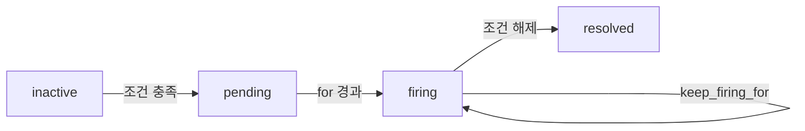

# Alertmanager

> Prometheus가 발화한 알림(alert)을 받아 **그룹화·중복 제거·억제·
> 라우팅**을 수행하는 컴포넌트. 알림 도구가 아니라 **알림 분배기**다.
> 2026.04 시점 안정 버전은 **v0.28.x**.

- **주제 경계**: 이 글은 Alertmanager **자체의 동작·설정**을 다룬다.
  알림 룰의 PromQL은 [PromQL 고급](promql-advanced.md), 알림 설계
  철학은 [알림 설계·피로 감축](../alerting/alerting-design.md), 온콜
  스케줄링은 [Grafana OnCall](../alerting/grafana-oncall.md).
- **선행**: [Prometheus 아키텍처](prometheus-architecture.md) §7
  룰 평가 흐름, [Recording Rules](recording-rules.md).

---

## 1. 무엇을 하는가


Prometheus는 **alert를 발화**하기만 하고, "누구에게 어떻게 보낼지"는
**모두 Alertmanager가 결정**. 양쪽 책임이 분리되어 있다.

| 책임 | 누가 |
|---|---|
| 알림 조건 평가 | Prometheus |
| `for` 지속 시간 → firing | Prometheus |
| 그룹화·중복제거·억제·침묵 | Alertmanager |
| Slack·PagerDuty·이메일 전송 | Alertmanager |
| 온콜 스케줄·에스컬레이션 | 별도 도구(Grafana OnCall, PagerDuty) |

---

## 2. 알림 라이프사이클

Prometheus와 Alertmanager는 **서로 다른 상태 머신**을 가진다. 둘을
혼동하면 디버깅이 안 된다.

### 2.1 Prometheus 측 (룰 엔진)



| 상태 | 의미 |
|---|---|
| `inactive` | 조건 미충족 |
| `pending` | 조건 충족, `for` 경과 대기 |
| `firing` | AM으로 push 중 |
| `resolved` | 조건 해제 |

> Prometheus는 **default 1분마다** firing alert를 AM에 다시 push.
> `keep_firing_for`(2.42+)로 flap 방지.

### 2.2 Alertmanager 측 (분배기)

| 상태 | 의미 |
|---|---|
| `unprocessed` | 수신 직후, 그룹화 전 |
| `active` | 정상 처리 중, 발송 대상 |
| `suppressed` | 침묵·억제·시간 비활성으로 음소거 |

`suppressed`는 다시 세 종류로 갈린다.

| 종류 | 트리거 |
|---|---|
| silenced | 명시적 silence 매칭 |
| inhibited | inhibit_rules 매칭 |
| muted | `mute_time_intervals` 시간대 |

> 두 시스템의 상태는 **별개**. AM API v2의 `state` 필드는 위 셋
> 중 하나를 돌려준다.

---

## 3. 라우팅 트리

```yaml
route:
  receiver: default
  group_by: [alertname, cluster]
  group_wait: 30s
  group_interval: 5m
  repeat_interval: 4h
  routes:
    - matchers:
        - severity = critical
      receiver: pagerduty
      continue: true
    - matchers:
        - team = platform
      receiver: platform-slack
    - matchers:
        - severity =~ "warning|info"
      receiver: warning-slack
```

| 필드 | 의미 |
|---|---|
| `group_by` | 같은 그룹으로 묶을 라벨 셋 |
| `group_wait` | 그룹의 첫 알림 후 추가 알림을 기다리는 시간 |
| `group_interval` | 같은 그룹의 새 알림 발송 간격 |
| `repeat_interval` | 변화 없는 알림 재전송 간격 |
| `matchers` | 라우팅 조건(라벨 매처) |
| `continue` | 매칭 후에도 다음 라우트 평가 |
| `receiver` | 발송 대상 |

### 3.1 라우팅 평가 순서

> 트리는 **DFS**로 평가. 자식 노드와 매칭되면 거기서 멈춘다(`continue:
> true`가 아니면). 가장 구체적인 라우트를 위에 두는 게 원칙.

### 3.2 그룹화의 가치

```yaml
group_by: [alertname, cluster]
```

- 1000개 노드가 동시에 죽어도 **`alertname=NodeDown` 그룹 하나**로
  묶여 한 번의 Slack 메시지
- 새로 발화한 알림이 있으면 `group_interval` 후 **묶음 갱신** 메시지
- 같은 그룹으로 묶이지 않으면 알림 폭주

---

## 4. 침묵(Silence) — 일시 음소거

배포 중·점검 시 특정 알림을 일정 시간 끄기.

```bash
# CLI
amtool silence add alertname=NodeDown cluster=staging \
  --duration=2h \
  --comment="Maintenance window"
```

| 속성 | 동작 |
|---|---|
| matchers | 라벨 매처 |
| `startsAt`/`endsAt` | 유효 기간 |
| `createdBy` | 생성자(감사 로그) |
| `comment` | 사유 |

> 자주 만드는 침묵은 **YAML 형상관리** 또는 Helm/Kustomize ConfigMap,
> Terraform Provider(`grafana_*`, 커뮤니티 `camptocamp/alertmanager`)로.
> 핸드 작업은 휴먼 에러 1순위.

### 4.1 Silence 안티패턴

| 패턴 | 결과 | 처방 |
|---|---|---|
| 무기한 침묵 | 잊혀진 진짜 알림 | 최대 7일 |
| 너무 광범위한 매처(`severity=warning`만) | 다른 사고 가림 | alertname·service 명시 |
| 댓글 없이 생성 | 누가 왜 만들었는지 불명 | comment 필수 |
| API로만 생성 | UI에서 사라짐 | amtool 또는 운영 도구 |

---

## 5. 시간 기반 라우팅 — `time_intervals`

영업 시간·점검 윈도우·온콜 시프트로 알림을 ON/OFF.

```yaml
time_intervals:
  - name: business_hours
    time_intervals:
      - times:
          - start_time: '09:00'
            end_time: '18:00'
        weekdays: ['monday:friday']
        location: 'Asia/Seoul'
  - name: maintenance_window
    time_intervals:
      - times:
          - start_time: '02:00'
            end_time: '04:00'
        weekdays: ['sunday']

route:
  receiver: default
  routes:
    - matchers: [team = platform]
      receiver: oncall
      active_time_intervals: [business_hours]   # 이 시간에만 발송
      mute_time_intervals: [maintenance_window] # 이 시간엔 음소거
```

| 필드 | 의미 |
|---|---|
| `time_intervals` | 시간대 정의(이름·요일·시각·timezone) |
| `active_time_intervals` | 라우트가 **활성**인 시간 |
| `mute_time_intervals` | 라우트가 **음소거**인 시간 |

> v0.24+ 표준. 옛 `mute_time_intervals` 최상위 필드는 deprecated,
> `time_intervals`로 통합. **Silence와 다르다** — silence는 임시,
> time_interval은 영구 정책.

---

## 6. 억제(Inhibition) — 인과 알림 차단

큰 알림이 발화하면 그 인과의 작은 알림을 자동으로 가린다.

```yaml
inhibit_rules:
  - source_matchers:
      - severity = critical
      - alertname = ClusterDown
    target_matchers:
      - severity =~ "warning|info"
    equal: [cluster]
```

| 필드 | 의미 |
|---|---|
| `source_matchers` | 억제하는 알림 |
| `target_matchers` | 억제되는 알림 |
| `equal` | source·target이 모두 가져야 하는 라벨 |

> 사용 예: 데이터센터가 다운됐을 때 그 안의 인스턴스 다운 알림은
> 가린다. 호출의 핵심은 "**증상의 인과 사슬을 운영자가 한 번 안다**"는
> 사실. 데이터 모델은 단순.

---

## 7. HA 클러스터링 — Gossip

Alertmanager는 **gossip 프로토콜**(memberlist)로 멀티 인스턴스가
상태를 공유한다.

```bash
# 인스턴스 A
alertmanager --cluster.peer=B:9094 --cluster.peer=C:9094

# 인스턴스 B
alertmanager --cluster.peer=A:9094 --cluster.peer=C:9094
```

| 공유 상태 | 의미 |
|---|---|
| Silence | 어느 노드든 만들면 전파 |
| 알림 알림 기록(NotificationLog) | 중복 발송 방지 |
| Inhibition 평가 결과 | 일관성 |

### 7.1 발송 모델 — leader가 아니다

Alertmanager는 **leader-less P2P 모델**이다. 각 노드는 자기 인덱스의
`peer_timeout`(기본 15s)만큼 대기한 뒤 발송을 시도하는데, 그 사이에
다른 노드가 발송을 끝내고 **NotificationLog(nflog)**를 gossip으로
전파하면 자기 발송을 생략한다.

| 구성 요소 | 역할 |
|---|---|
| `peer_timeout` | 노드 인덱스만큼 대기 후 발송 시도 |
| nflog | "이 그룹에 누가 발송했다" 기록, gossip 전파 |
| memberlist | gossip 프로토콜 자체 |

> 결과적으로 leader 없이도 **보통 한 번만 발송**되며, 한 노드가 죽어도
> 다른 노드가 자연스럽게 발송한다.

### 7.2 운영 토폴로지

| 토폴로지 | 노드 수 |
|---|---|
| 단일 | 단일 (사고 시 알림 못 받음) |
| HA Pair | 2 — 최소 권장 |
| 3+ 클러스터 | 권장 — gossip 안정성 |

> 모든 Prometheus가 **동일한 AM 클러스터의 모든 노드를 알림 대상**으로
> 등록해야 한다. 일부만 등록하면 그 노드 차례에 발송이 누락될 위험.

### 7.3 함정 — `peer_timeout` vs `group_interval`

**`group_interval < peer_timeout`**이면 nflog 전파 전 양쪽 노드가
모두 발송해 **중복 알림**이 온다. 권장:

| 설정 | 값 |
|---|---|
| `cluster.peer-timeout` | 15s (기본) |
| `group_interval` | ≥ 30s, peer_timeout보다 충분히 큼 |
| `repeat_interval` | 4~12h |

```yaml
# prometheus.yml
alerting:
  alertmanagers:
    - static_configs:
        - targets: ["am-1:9093", "am-2:9093", "am-3:9093"]
```

---

## 8. 수신처(Receivers) — 어디로 보내나

| 수신처 | 비고 |
|---|---|
| Slack | `slack_configs`, webhook URL |
| PagerDuty | `pagerduty_configs`, service key |
| Opsgenie | `opsgenie_configs`, API key |
| Microsoft Teams | **`msteamsv2_configs`(v0.28+)** Power Automate Workflow + Adaptive Cards. 옛 connector 기반 `msteams_configs`는 MS의 connector deprecation으로 마이그레이션 권장 |
| Email/SMTP | 단순하나 노이즈 분리 어려움 |
| Webhook | 임의 시스템(Grafana OnCall, 자체 봇) |
| Pushover, Telegram, Discord, Wechat 등 | 외부 |

### 8.1 `send_resolved` — resolve 알림을 보낼 것인가

| 수신처 | 권장 |
|---|---|
| PagerDuty·Opsgenie | `true` — incident 자동 close |
| Slack 채널(요약) | `true` — 해소 가시성 |
| Email | 보통 `false` — 메일함 노이즈 |
| Webhook(자동화) | 케이스 별 |

> 기본은 receiver별로 다르다. 명시적으로 설정해 의도를 박는 게 안전.

```yaml
receivers:
  - name: pagerduty
    pagerduty_configs:
      - service_key_file: /etc/secrets/pd-key
        description: '{{ template "pd.description" . }}'
  - name: platform-slack
    slack_configs:
      - api_url_file: /etc/secrets/slack-webhook
        channel: '#platform-alerts'
        send_resolved: true
        title: '{{ template "slack.title" . }}'
        text: '{{ template "slack.text" . }}'
```

### 8.2 템플릿 — 메시지 포맷

```
{{ define "slack.title" -}}
[{{ .Status | toUpper }}] {{ .CommonLabels.alertname }} ({{ .CommonLabels.severity }})
{{- end }}

{{ define "slack.text" -}}
{{ range .Alerts }}
*Service:* {{ .Labels.service }}
*Summary:* {{ .Annotations.summary }}
*Description:* {{ .Annotations.description }}
*Runbook:* {{ .Annotations.runbook_url }}
{{ end }}
{{- end }}
```

> **runbook_url을 annotation에 박는 것이 표준**. 새벽 3시 Slack 알림에서
> 즉시 대응 매뉴얼로 점프.

### 8.3 `CommonLabels` 주의

`CommonLabels`에는 **그룹 내 모든 알림이 같은 값**을 가진 라벨만 들어
간다. `group_by`에 포함된 라벨은 항상 안전하지만, 그 외 라벨은 한 그룹
안에 다른 값이 섞이면 비어 버린다. 템플릿에서 NPE의 흔한 원인.

---

## 9. 운영 메트릭

| 메트릭 | 의미 |
|---|---|
| `alertmanager_alerts` | 활성 알림 수 |
| `alertmanager_notifications_total` | 수신처별 발송 수 |
| `alertmanager_notifications_failed_total` | 발송 실패 |
| `alertmanager_silences` | 활성 침묵 수 |
| `alertmanager_cluster_members` | 클러스터 노드 수 |
| `alertmanager_cluster_messages_received_total` | gossip 메시지 |
| `alertmanager_dispatcher_aggregation_groups` | 활성 그룹 수 |

> 자기 자신을 모니터링: Prometheus가 Alertmanager의 메트릭을 scrape +
> "Alertmanager 자체 다운" 알림은 **별도 메커니즘**(딴 모니터링·DeadMan
> Snitch). AM이 죽었는데 자기 자신의 알림은 못 보낸다.

### 9.1 amtool — 운영 CLI

| 명령 | 용도 |
|---|---|
| `amtool check-config alertmanager.yml` | 설정 문법·라우팅 검증 |
| `amtool config routes test --tree --config.file=...` | 알림 라벨이 어느 receiver로 가는지 시뮬레이션 |
| `amtool alert query` | 활성 알림 조회 |
| `amtool silence add ...` | 침묵 생성 |
| `amtool silence query` / `silence expire` | 조회·만료 |

> CI에 `amtool check-config` 박는 게 표준. 라우팅 오설정으로 인한
> 알림 유실은 가장 비싼 운영 사고.

---

## 10. DeadMan Snitch — "조용해서 위험"한 경우

알림이 오지 않으면 정상이지만, 실제로는 모니터링이 죽었을 수도 있다.
**항상 발화하는** Heartbeat 알림 + 외부 서비스가 그걸 안 받으면
역으로 알림.

```yaml
# 항상 firing 상태인 알림 룰
- alert: DeadMansSnitch
  expr: vector(1)
  for: 1m
  labels:
    severity: heartbeat
  annotations:
    summary: "Heartbeat — should always be firing"
```

라우팅 트리:

```yaml
route:
  routes:
    - matchers:
        - severity = heartbeat
      receiver: snitch
      group_interval: 5m
      repeat_interval: 5m
```

`snitch` 수신처는 외부 헬스체크 서비스(Healthchecks.io, BetterStack,
DeadMansSnitch.com)의 ping URL. 이 ping이 안 오면 외부 서비스가 알린다.

> `repeat_interval`은 외부 서비스의 grace period(보통 5~15분)와 정합
> 시켜야 한다. 1분은 너무 공격적이라 비용·노이즈 유발.

---

## 11. 흔한 실수와 처방

| 실수 | 결과 | 처방 |
|---|---|---|
| 모든 알림에 PagerDuty | 알림 피로 | severity 라우팅 |
| group_by 너무 좁음 | 폭주 | 적정 라벨로 묶기 |
| `repeat_interval` 너무 짧음 | 같은 알림 도배 | 4~12h |
| 한 노드에만 AM 운영 | SPOF | HA 클러스터 |
| Prometheus가 일부 AM만 등록 | leader 시점에 누락 | 모든 AM 노드 등록 |
| 무기한 silence | 잊힌 알림 | 7일 한도 + 정기 검토 |
| `runbook_url` 누락 | 새벽 3시 멘붕 | 모든 알림에 runbook 강제 |
| Heartbeat 없음 | 모니터링 죽어도 모름 | DeadMan Snitch |
| 템플릿 없이 raw 라벨 노출 | 노이즈 | 표준 템플릿 |
| AM 자체 알림 부재 | AM이 죽었는데 알림 X | 외부 watchdog |
| 옛 `match`/`match_re` 문법 사용 | deprecated 경고 | 신문법 `matchers:` 리스트로 마이그레이션 |
| `group_interval < peer_timeout` | 중복 알림 | `group_interval ≥ 30s` |

---

## 12. Grafana Alerting과의 관계

Grafana 8+ 통합 알림(Grafana Alerting)이 Alertmanager의 일부 대안.

| 비교 | Alertmanager | Grafana Alerting | Mimir Alertmanager |
|---|---|---|---|
| 룰 평가 | Prometheus가 함 | Grafana가 함(또는 Prometheus 위임) | Mimir Ruler |
| 라우팅 | YAML | UI + API | YAML, 멀티테넌트 |
| 다중 데이터소스 | Prometheus 전용 | Prometheus·Loki·etc | Mimir 위 |
| HA | gossip | Replica + DB | 분산, 테넌트별 |
| 형상관리 | git/PR 친화 | UI 친화, Terraform 가능 | API + GitOps |

> 결정 원칙: **순수 Prometheus 중심 = AM 권장**, **다중 데이터소스 +
> UI 중심 = Grafana Alerting**. 두 시스템 병행은 가능하나 운영 복잡도
> 증가. 자세한 내용은
> [Grafana OnCall](../alerting/grafana-oncall.md).

---

## 13. 다음 단계

- [알림 설계·피로 감축](../alerting/alerting-design.md)
- [Multi-window 알림](../alerting/multi-window-alerting.md)
- [SLO 알림](../alerting/slo-alerting.md)
- [Grafana OnCall](../alerting/grafana-oncall.md)
- [Recording Rules](recording-rules.md)
- [PromQL 고급](promql-advanced.md)

---

## 참고 자료

- [Alertmanager — Prometheus 공식](https://prometheus.io/docs/alerting/latest/alertmanager/) (2026-04 확인)
- [Alertmanager Configuration](https://prometheus.io/docs/alerting/latest/configuration/) (2026-04 확인)
- [Alertmanager 0.28 release notes](https://github.com/prometheus/alertmanager/releases) (2026-04 확인)
- [Notification template reference](https://prometheus.io/docs/alerting/latest/notifications/)
- [amtool — silence CLI](https://github.com/prometheus/alertmanager/tree/main/cmd/amtool)
- [Memberlist — gossip 프로토콜](https://github.com/hashicorp/memberlist)
- [Healthchecks.io — DeadMan Snitch 외부 서비스](https://healthchecks.io/)
- [Grafana Alerting 비교](https://grafana.com/docs/grafana/latest/alerting/)
