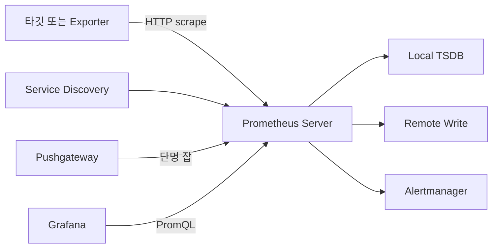
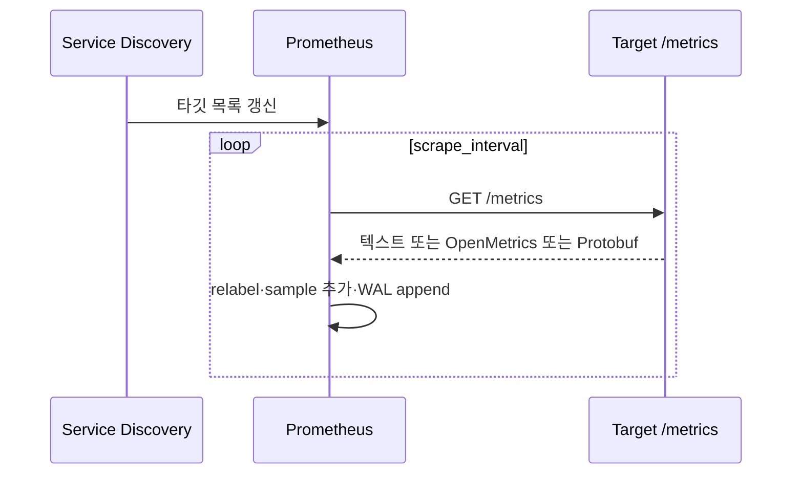
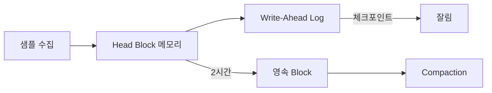
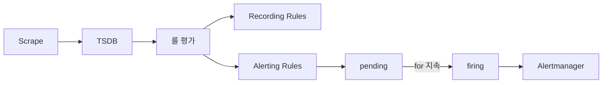
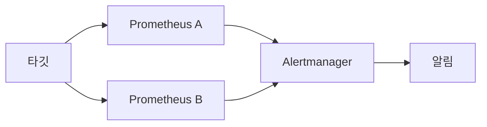

# Prometheus 아키텍처

> Prometheus는 2012년 SoundCloud가 시작한 시계열 모니터링 시스템.
> CNCF Graduated의 두 번째 졸업작(2018), 사실상의 메트릭 표준이다.
> 2024년 11월 **3.0**이 7년 만의 메이저 릴리스로 OTLP 수신·UTF-8 라벨·
> Native Histogram·Remote Write 2.0을 정착시켰고, 2026.04 시점은
> **3.11.0**(2026-04-02 릴리스)이다.

- **주제 경계**: 이 글은 Prometheus의 **아키텍처와 운영 구성**을
  다룬다. PromQL 사용은 [PromQL 고급](promql-advanced.md), 알림은
  [Alertmanager](alertmanager.md), 장기 저장은
  [Mimir·Thanos·Cortex·VictoriaMetrics](../metric-storage/mimir-thanos-cortex.md).
- **선행**: [관측성 개념](../concepts/observability-concepts.md) §3에서
  다룬 OTel Metric 시그널, [Exemplars](../concepts/exemplars.md).

---

## 1. 한눈에 보기



| 컴포넌트 | 역할 |
|---|---|
| **Prometheus Server** | scrape · TSDB · 룰 평가 · API |
| **Exporter** | 타사 시스템 → Prometheus 노출 변환 |
| **Pushgateway** | 단명 배치 잡의 메트릭을 임시 보관 |
| **Service Discovery** | scrape 타깃 동적 발견 |
| **Alertmanager** | 알림 라우팅·중복제거 |
| **Remote Storage** | 장기 저장(Mimir·Thanos 등) |

---

## 2. Pull 모델 — 왜 push 아닌가

Prometheus는 **HTTP GET으로 타깃을 끌어오는** Pull 방식을 택했다.

| 비교 축 | Pull | Push |
|---|---|---|
| 타깃 추적 | Prometheus가 SD로 알아냄 | 타깃이 알아서 보냄 |
| 헬스체크 | scrape 실패 = 자동 헬스 신호 | 별도 메커니즘 필요 |
| 방화벽 | 모니터링 서버에 인바운드 1방향 | 모든 타깃 → 서버 인바운드 |
| 오프 메가시 | scrape 실패만 기록 | 데이터 유실 가능 |
| 단명 잡 | Pushgateway 우회 필요 | 자연스러움 |

> 결정 원칙: **지속 서비스 = Pull, 단명 배치 = Pushgateway**.
> Pushgateway는 만능 push 게이트가 아니다(주의: §6.2).

### 2.1 Scrape 흐름



- 기본 `scrape_interval` 15s, `scrape_timeout` 10s
- **Stale marker**: 타깃 사라지면 5분 안에 stale 표기

`scrape_protocols`로 Accept 협상 순서를 명시 강제할 수 있다. Native
Histogram을 받으려면 **`PrometheusProto`를 1순위**로 두어야 한다.

```yaml
scrape_configs:
  - job_name: app
    scrape_protocols:
      - PrometheusProto         # native histogram 수신
      - OpenMetricsText1.0.0    # exemplar 수신
      - PrometheusText0.0.4     # fallback
```

> 기본 순서는 `scrape_native_histograms` 활성 여부에 따라 다르다.
> 활성 시에만 `PrometheusProto`가 1순위. Native Histogram·Exemplar
> 동시 사용 시 위와 같이 명시한다.

---

## 3. 데이터 모델

### 3.1 시계열의 정의

```
http_requests_total{method="GET", route="/users/:id", code="200"} 12345
```

| 요소 | 설명 |
|---|---|
| Metric name | `http_requests_total` |
| Labels | `{method="GET", route="/users/:id", code="200"}` |
| Sample | (timestamp, float64) 페어 |
| 시계열 ID | metric name + 라벨셋의 해시 |

> **시계열 = 메트릭 이름 × 라벨 조합 하나**. 라벨 값이 하나만 달라도
> 별개 시계열. 카디널리티가 폭발하는 근본 이유는
> [카디널리티 관리](../metric-storage/cardinality-management.md).

### 3.2 메트릭 타입

| 타입 | 의미 | 예 |
|---|---|---|
| Counter | 단조 증가 | `http_requests_total` |
| Gauge | 임의 변동 | `node_load1` |
| Histogram (Classic) | bucket 누적 | `http_duration_bucket` |
| **Native Histogram** | 지수 버킷 자동 | `http_request_duration_seconds` |
| Summary | 분위수 사전 계산 | `gc_duration_seconds` |

> Native Histogram은 3.0+에서 사실상 stable. Classic 대비 **카디널
> 리티 1/10 + 정밀도 ↑**. 자세한 내용은
> [히스토그램 (Exponential·Native)](../metric-storage/exponential-histograms.md).

### 3.3 UTF-8 라벨 (3.0+)

3.0부터 메트릭/라벨 이름에 **UTF-8 문자**(점 포함) 허용. OTLP의 점
표기 키를 그대로 받아낼 수 있다.

```promql
# 옛 형식
http_server_request_duration_seconds{http_route="/v1/orders"}

# 3.0+ UTF-8 형식 (PromQL에서 quoted 표기)
{"http.server.request.duration", "http.route"="/v1/orders"}
```

| 검증 모드 | 의미 |
|---|---|
| `legacy` | 옛 정규식만 허용 (`[a-zA-Z_:][a-zA-Z0-9_:]*`) |
| `utf8` | UTF-8 허용 (3.0+ 기본) |

> `metric_name_validation_scheme: utf8`을 글로벌 또는 job 단위로
> 설정. PromQL에서 점이 들어간 이름은 **반드시 큰따옴표로 quote**
> 해야 한다.

### 3.4 노출 형식과 메타데이터

```
# HELP http_requests_total HTTP requests
# TYPE http_requests_total counter
# UNIT http_requests_total requests
http_requests_total{method="GET",code="200"} 1027 1714030400000
```

| 메타 | 의미 |
|---|---|
| `# HELP` | 사람용 설명 |
| `# TYPE` | counter·gauge·histogram·summary |
| `# UNIT` | UCUM 단위(OpenMetrics 전용) |

> 규약: **Counter는 `_total` suffix**, Histogram은 `_bucket`/`_sum`/
> `_count` 세 시계열을 함께 노출(Classic). Native Histogram은
> **텍스트 노출 불가**, Protobuf scrape 필수.

---

## 4. TSDB — Head · WAL · Block

### 4.1 데이터 흐름



| 단계 | 역할 |
|---|---|
| **Head Block** | 최근 샘플의 메모리 표현. PromQL 쿼리 대상 |
| **WAL** | 디스크 순차 로그. 크래시 복구의 근거 |
| **영속 Block** | 2시간 단위 immutable 디렉토리 |
| **Compaction** | 작은 블록을 큰 블록으로 병합 |

### 4.2 WAL의 역할

> Prometheus가 종료되면 Head Block은 휘발된다. **WAL이 없으면 마지막
> compaction 이후 모든 데이터 유실**. WAL은 디스크에 순차 append
> 되므로 SSD/NVMe에 가장 친화적인 워크로드.

| 속성 | 동작 |
|---|---|
| 형식 | 기본 **128MB** 단위 segment(`--storage.tsdb.wal-segment-size`) |
| 저장 위치 | `<storage>/wal/` |
| 체크포인트 | Head 컴팩션 후 잘림 |
| 복구 | 시작 시 WAL 재생 → Head 재구성 |

### 4.3 영속 Block의 구조

```
<storage>/01HZX5RGPYAB1J/
  meta.json      # 메타
  chunks/        # 샘플 압축 청크
  index          # 라벨 → 시계열 인덱스
  tombstones     # 삭제 마커
```

| 파일 | 의미 |
|---|---|
| `meta.json` | 시간 범위, 통계, 컴팩션 레벨 |
| `chunks/` | 시계열별 압축 청크(1~16KB) |
| `index` | 포스팅 리스트 + 라벨 사전 |
| `tombstones` | 삭제 API의 marker |

### 4.4 Compaction

| 레벨 | 시간 범위 | 비고 |
|---|---|---|
| L0 | 2h | Head → 첫 영속 |
| L1 | 6h | L0 3개 병합(×3) |
| L2 | 18h | L1 3개 병합 |
| L3 | 54h | L2 3개 병합 |
| 상한 | retention 10% 또는 31일 | 더 큰 블록 만들지 않음 |

> 컴팩션은 **×3 배수**로 누적된다. 기본 retention 15일이면 최대 블록은
> 약 36시간(retention의 10%). 더 길게 보관하려면 **Remote Write로
> Mimir/Thanos**로 보내고 로컬은 짧게 유지(§7).

---

## 5. Service Discovery

scrape 타깃을 동적으로 알아내는 메커니즘. 이게 없으면 K8s에서 운영
불가능.

| SD | 용도 |
|---|---|
| `kubernetes_sd_configs` | K8s API에서 Pod·Service·Endpoint 발견 |
| `consul_sd_configs` | HashiCorp Consul |
| `ec2_sd_configs`·`gce_sd_configs`·`azure_sd_configs` | CSP |
| `dns_sd_configs` | DNS SRV 레코드 |
| `file_sd_configs` | JSON/YAML 파일 갱신 |
| `http_sd_configs` | 임의 HTTP 엔드포인트 |

### 5.1 Relabeling

SD가 발견한 타깃의 메타라벨을 scrape 직전에 가공.

```yaml
relabel_configs:
  - source_labels: [__meta_kubernetes_pod_label_app]
    regex: api-.*
    action: keep
  - source_labels: [__meta_kubernetes_pod_name]
    target_label: pod
  - source_labels: [__meta_kubernetes_namespace]
    target_label: namespace
```

| 시점 | 의미 |
|---|---|
| `relabel_configs` | scrape 전 — 타깃 선택·라벨 정리 |
| `metric_relabel_configs` | scrape 후 — 시계열 가공·드롭 |

> **운영의 80%는 relabel**에서 일어난다. 카디널리티 폭발 1순위 원인도
> 잘못된 relabel.

---

## 6. 단명 잡 처리 — Pushgateway

Cron 잡처럼 단명한 프로세스는 scrape할 시간이 없어 **Pushgateway**에
push, Prometheus는 Pushgateway를 scrape.

### 6.1 표준 사용 패턴

| 적합 | 부적합 |
|---|---|
| 일·주 단위 batch 잡 결과 | 실시간 서비스 메트릭 |
| 머신러닝 train 종료 시점 메트릭 | 마이크로서비스의 핫 path |
| 백업 성공/실패 결과 | 헬스체크용 |

### 6.2 Pushgateway 안티패턴

- 마이크로서비스가 push 게이트웨이로 사용 → **타깃 추적 능력 상실**
- 메트릭이 Pushgateway에 영구 잔존 → **stale 데이터 알림 오작동**
- HA 미구성 → 단일 장애점

---

## 7. 룰 평가와 알림 흐름

Prometheus의 룰 평가는 **scrape와 별도 사이클**(`evaluation_interval`,
기본 15s)에서 돈다. 이를 모르면 알림 오작동 디버깅이 어렵다.



| 단계 | 의미 |
|---|---|
| `evaluation_interval` | 룰 그룹 평가 주기 (보통 30s~1m) |
| pending | 조건 만족 시작, `for` 만큼 유지 대기 |
| firing | `for` 경과 후 Alertmanager로 push |
| Recording Rule | 결과를 새 시계열로 저장 |

> 자주 발생하는 함정: `scrape_interval` 60s + `evaluation_interval` 15s →
> 같은 데이터를 4번 평가. 보통 둘을 동일하게 설정.
> 자세한 내용은 [Recording Rules](recording-rules.md),
> [Alertmanager](alertmanager.md).

---

## 8. Federation — 단일 Prometheus 한계 너머

Prometheus 단일 인스턴스로 다 못 받을 때 **계층적 또는 교차 수집**.

| 패턴 | 동작 | 용도 |
|---|---|---|
| **Hierarchical Federation** | 상위 Prometheus가 하위들의 `/federate`로 집계된 시계열만 가져옴 | 글로벌 뷰 |
| **Cross-service Federation** | 같은 레벨 인스턴스가 일부 메트릭만 교차 수집 | 팀 간 공유 메트릭 |

```yaml
# 상위 Prometheus
scrape_configs:
  - job_name: federate
    honor_labels: true
    metrics_path: /federate
    params:
      'match[]':
        - '{job="api"}'
        - '{__name__=~"job:.*"}'
    static_configs:
      - targets: ['shard-a:9090', 'shard-b:9090']
```

| 핵심 옵션 | 의미 |
|---|---|
| `honor_labels: true` | 하위 라벨을 보존(상위가 덮어쓰지 않음) |
| `match[]` | 가져올 시계열 선택자 |
| 시점 정렬 | 하위 scrape와 상위 scrape의 race로 약간의 지연 |

> 안티패턴: **모든 시계열을 federate**. 이 경우 비용·지연 폭발.
> 글로벌 뷰가 목적이면 **Recording Rule로 사전 집계된 시계열만**
> 가져온다(`job:.*`). 대규모는 [Mimir/Thanos](../metric-storage/mimir-thanos-cortex.md)
> 가 정답.

---

## 9. Out-of-Order 수집

기본은 **timestamp가 마지막 sample보다 과거**면 거부(`out of order
sample` 에러). OTLP 수신·Replica Pair·다중 Remote Write 클라이언트에서
거의 필수로 활성화한다.

```yaml
# prometheus.yml
storage:
  tsdb:
    out_of_order_time_window: 30m
```

| 시나리오 | OOO 활성화 효과 |
|---|---|
| OTLP push에서 약간 늦게 도착 | 삼킨다 |
| Replica A·B의 타임스탬프 약간 차이 | 둘 다 보존 |
| Native Histogram + OOO | `--enable-feature=ooo-native-histograms` 추가 필요 |

> 활성화 시 메모리·디스크 추가 비용이 있다. 30분~1h 윈도우가 보통.

---

## 10. HA 전략

Prometheus는 **로컬 스토리지가 클러스터링되지 않는다**. 공식 HA
패턴은 두 가지 축의 조합.

### 10.1 Replica Pair (수집 이중화)

같은 SD·룰을 가진 Prometheus를 **2개 동시 운영**.



- Alertmanager가 알림 중복 제거
- 쿼리는 둘 중 하나에 부하 분산(LB 또는 Thanos Querier)
- WAL·블록은 **각자 독립**(replication 아님)
- 각 인스턴스는 `external_labels: {replica: A, cluster: prod}` 식으로
  구분 라벨을 부여 → Mimir·Thanos receiver가 dedupe

### 10.2 Remote Write (장기·다중 리전)

로컬 retention은 짧게(2~7일), **장기 데이터는 Remote Write**로
별도 백엔드에 영속화.

| 백엔드 | 특징 |
|---|---|
| Mimir(Grafana) | Cortex fork, 장기 저장 1순위 |
| Thanos | 객체 스토리지 + Sidecar |
| Cortex | Mimir로 fork됐지만 별도 존속 |
| VictoriaMetrics | 대안 OSS, 단순 운영 |

자세한 내용은 [Remote Write](remote-write.md),
[Mimir·Thanos·Cortex](../metric-storage/mimir-thanos-cortex.md).

### 10.3 Agent Mode

3.x에서 정착한 모드. **로컬 TSDB 없이** Remote Write만 수행.

| 상황 | 적합도 |
|---|---|
| 엣지·세컨더리 클러스터 | ★★★ |
| 로컬 쿼리·룰 평가 필요 | ✗(불가) |
| 디스크 자원이 매우 부족 | ★★★ |

---

## 11. 3.0+에서 새로 도입된 것

| 기능 | 의미 |
|---|---|
| **OTLP 수신** | `/api/v1/otlp/v1/metrics` 엔드포인트 — OTel Collector 직접 push |
| **UTF-8 라벨** | OTel SemConv 키(점 표기)를 그대로 사용 |
| **Native Histogram** stable | 지수 버킷 자동, Classic 대비 1/10 카디널리티 |
| **Remote Write 2.0** (EXPERIMENTAL) | 메타데이터·exemplar·CT·Native Histogram을 single proto로, string interning |
| **Range Vector 셀렉터 변경** | `[5m]`이 left-open · right-closed로 변경 → step 정렬 시 sample 더블카운트 제거 |
| **PromQL Experimental Functions** | `info()`(target_info join), `sort_by_label()`, type/info join |

### 11.1 OTLP 수신 활성화

```yaml
# prometheus.yml
otlp:
  promote_resource_attributes:
    - service.name
    - service.namespace
    - service.instance.id
```

CLI: `--web.enable-otlp-receiver`. 이후 OTel Collector의
`prometheusremotewrite` exporter 대신 **`otlphttp` exporter로 직접
push** 가능.

### 11.2 fast-startup (3.11 experimental)

`series_state.json`을 WAL 디렉토리에 기록해 재시작 시 active series
복구 시간을 단축. 큰 인스턴스(수백만 시계열)에서 분 단위 → 초 단위로.

---

## 12. 용량 산정 가이드

전제: 평균 sample 크기 1.5B(압축 후), scrape_interval 15s.

| 항목 | 산정 |
|---|---|
| 시계열당 메모리 | ~3.5KB(Head) |
| 시계열당 디스크 | ~1~2 byte/sample 압축 후 |
| WAL 크기 | 마지막 2~3시간 sample × 시계열 |
| CPU | 보통 시계열 100만개당 1코어 |
| 디스크 IOPS | sequential 위주, NVMe 권장 |

> 거친 추산: **1M 시계열 + 15s scrape + 15일 retention ≈ 50GB 디스크
> + 3.5GB Head 메모리**. 수십 M로 가면 **샤딩**(Federation 또는
> Mimir 분산 수집기)이 필수.

운영에서 모니터링할 자체 메트릭:

| 메트릭 | 의미 |
|---|---|
| `prometheus_tsdb_head_series` | 활성 시계열 수 |
| `prometheus_tsdb_head_chunks` | 활성 chunk 수 |
| `prometheus_tsdb_wal_segment_current` | 현재 WAL segment |
| `prometheus_remote_storage_samples_failed_total` | RW 실패 |
| `process_resident_memory_bytes` | 프로세스 메모리 |

---

## 13. 흔한 실수와 처방

| 실수 | 결과 | 처방 |
|---|---|---|
| 단일 인스턴스 + retention 90일 | 디스크·메모리 한계 | Remote Write로 분리 |
| Pushgateway에 서비스 메트릭 | stale 데이터 알림 | Pull로 전환 |
| Federation으로 모든 데이터 복제 | 비용 폭발 | Mimir/Thanos |
| 라벨에 user_id·request_id | 카디널리티 폭발 | label drop relabel |
| 동일 룰셋·SD를 단일 인스턴스 | SPOF | Replica Pair |
| Native Histogram을 OpenMetrics 텍스트로 노출 시도 | 데이터 누락 | Protobuf scrape |
| WAL 디렉토리 SSD 아님 | scrape 지연·OOM | NVMe 권장 |
| `--storage.tsdb.path`가 로그·data 같이 | 디스크 경합 | 분리 |
| 외부 라벨(`external_labels`) 누락 | Remote Write 충돌 | replica·cluster 라벨 |

---

## 14. 다음 단계

- [PromQL 고급](promql-advanced.md) — rate vs increase, subquery
- [Recording Rules](recording-rules.md)
- [Remote Write](remote-write.md)
- [Alertmanager](alertmanager.md)
- [Mimir·Thanos·Cortex·VictoriaMetrics](../metric-storage/mimir-thanos-cortex.md)
- [카디널리티 관리](../metric-storage/cardinality-management.md)
- [Prometheus·OpenTelemetry](../cloud-native/prometheus-opentelemetry.md)

---

## 참고 자료

- [Prometheus 3.0 announcement (2024-11)](https://prometheus.io/blog/2024/11/14/prometheus-3-0/)
- [Prometheus 3.11.0 release notes (2026-04-02)](https://github.com/prometheus/prometheus/releases/tag/v3.11.0)
- [Prometheus Storage 문서](https://prometheus.io/docs/prometheus/latest/storage/) (2026-04 확인)
- [Configuration — scrape_configs · relabel_configs](https://prometheus.io/docs/prometheus/latest/configuration/configuration/) (2026-04 확인)
- [Feature flags — Prometheus](https://prometheus.io/docs/prometheus/latest/feature_flags/) (2026-04 확인)
- [Native Histograms 스펙](https://prometheus.io/docs/specs/native_histograms/)
- [Prometheus Remote-Write 2.0 spec (EXPERIMENTAL)](https://prometheus.io/docs/specs/prw/remote_write_spec_2_0/)
- [TSDB WAL — Ganesh Vernekar](https://ganeshvernekar.com/blog/prometheus-tsdb-wal-and-checkpoint/)
- [tsdb/docs/format/wal.md](https://github.com/prometheus/prometheus/blob/main/tsdb/docs/format/wal.md)
- [Beyond Remote Write — Native OTLP in Prometheus 3.0](https://medium.com/@dushyant.kumar/beyond-remote-write-native-otlp-integration-in-prometheus-3-0-6f41cd7b9511)
