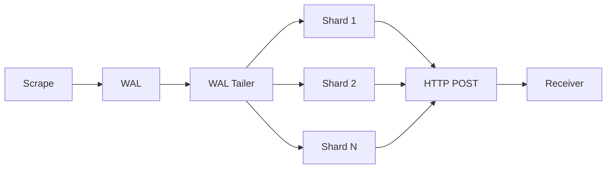
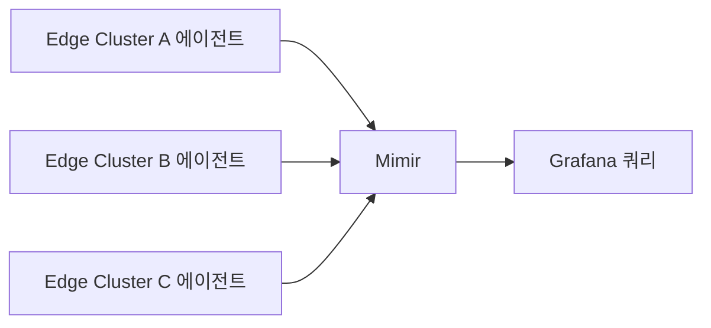

# Remote Write

> Prometheus는 로컬 TSDB로는 클러스터링·복제가 안 된다. **Remote
> Write**가 그 한계를 넘는 표준 메커니즘. WAL을 따라가며 수집한
> 샘플을 외부 백엔드(Mimir·Thanos·VictoriaMetrics·SaaS)로 push 한다.

- **주제 경계**: 이 글은 **프로토콜·튜닝·운영**을 다룬다. 백엔드 비교는
  [Mimir·Thanos·Cortex·VictoriaMetrics](../metric-storage/mimir-thanos-cortex.md).
- **선행**: [Prometheus 아키텍처](prometheus-architecture.md) §10
  HA 전략, [Recording Rules](recording-rules.md).

---

## 1. 무엇을 풀고 무엇은 못 푸는가

| 풀어주는 것 | 풀지 못하는 것 |
|---|---|
| 로컬 retention 한계 → 장기 보관 | 단일 Prometheus의 scrape 부하 |
| 단일 노드 디스크 한계 | 단일 인스턴스의 룰 평가 |
| 단일 인스턴스 SPOF | 쿼리 실시간성(원격 stream 아님) |
| 멀티 클러스터 글로벌 뷰 | 백엔드 자체 운영 부담 |

> Remote Write는 **푸시 방식의 이중화·장기화**다. 샤딩·고가용 룰은
> Mimir/Thanos 같은 백엔드 책임.

---

## 2. 프로토콜 — v1 vs v2

| 항목 | v1 (Stable) | v2 (EXPERIMENTAL, 2026.04) |
|---|---|---|
| 와이어 포맷 | Snappy + Protobuf | Snappy + Protobuf, **string interning** |
| 메타데이터 | 별도 메시지 | sample과 함께 한 묶음 |
| Exemplar | 추가 필드 | 1차 시민 |
| Native Histogram | 별도 필드 | 1차 시민 |
| Created Timestamp(CT) | 미지원 | 지원 |
| 페이로드 크기 | 기준 | 약 30~50% 작음 |

### 2.1 v2가 해결한 운영 문제

- **샘플 + 메타데이터 동기화 누락** — 메타가 늦게 도착해 단위 표시
  깨짐
- **string interning** — 라벨 값 반복으로 인한 페이로드 비대
- **Native Histogram·Exemplar의 single proto 통합** — 부분 누락 방지
- **`X-Prometheus-Remote-Write-Samples-Written`** 등 응답 헤더 — 수신측이
  실제로 받은 sample/histogram/exemplar 수를 회신하므로 송신측이
  **부분 쓰기**(Partial Write)를 정확히 감지·재시도할 수 있다. v1은
  이게 불가능해 침묵 누락이 많았다.

### 2.2 v2 활성화

```yaml
remote_write:
  - url: https://mimir.example.com/api/v1/push
    protobuf_message: io.prometheus.write.v2.Request
```

> 수신 측이 v2를 받지 못하면 v1로 자동 fallback.
> 안정화 전까지 **수신·송신 양쪽이 v2 지원 확인 후 활성화**.

---

## 3. 송신 측 아키텍처 — Shard·Queue·WAL



| 단계 | 동작 |
|---|---|
| WAL Tailer | WAL에서 새 sample 읽기 |
| Shard | 라벨 해시로 분배. **같은 시계열은 같은 샤드** |
| Queue | 샤드별 in-memory 큐 |
| HTTP POST | 큐가 차거나 타임아웃 시 묶어서 전송 |

> 같은 시계열의 sample은 **순서 보장**, 다른 시계열은 병렬·순서 비보장.
> 수신 측은 **시계열 단위 ordering**만 가정해야 한다.

---

## 4. 큐 튜닝 — 흔한 함정의 90%

```yaml
remote_write:
  - url: https://receiver.example.com/api/v1/push
    send_exemplars: true               # v1에서 exemplar 보내려면 명시
    send_native_histograms: true       # v1에서 native histogram 보내려면 명시
    queue_config:
      capacity: 10000                  # 샤드당 큐 깊이
      max_samples_per_send: 2000       # 한 POST의 sample 수
      max_shards: 200                  # 동적 상한
      min_shards: 1
      batch_send_deadline: 5s
      min_backoff: 30ms
      max_backoff: 5s
      retry_on_http_429: true
      sample_age_limit: 30m            # 이보다 오래된 sample은 drop
```

> v1에서 **`send_exemplars`·`send_native_histograms`는 기본 false**.
> Mimir 받는데 exemplar·히스토그램이 안 보인다는 흔한 사고의 원인.
> v2는 1차 시민이라 별도 옵션 없이 자동.

### 4.1 핵심 가이드

| 파라미터 | 의미 | 권장 |
|---|---|---|
| `capacity` | 샤드당 큐 | `max_samples_per_send × 3~10` |
| `max_samples_per_send` | 한 번 보낼 sample 수 | 보통 1k~5k |
| `max_shards` | 동적 상한 | **기본 200**. 백엔드가 받아주면 상향, 다만 샤드는 메모리·고루틴 비용 |
| `batch_send_deadline` | 묶음이 안 차도 보낼 타임아웃 | 5s |
| `min_backoff`/`max_backoff` | 재시도 백오프 | 기본값 OK |
| `retry_on_http_429` | rate limit 시 재시도 | true |
| `sample_age_limit` | 이보다 오래된 sample drop | 30m~2h. **알려진 이슈**(#13979·#15257) 확인 후 활성화 |

### 4.2 진단 메트릭

| 메트릭 | 의미 |
|---|---|
| `prometheus_remote_storage_samples_in_total` | 큐 입력 sample |
| `prometheus_remote_storage_samples_failed_total` | 영구 실패 |
| `prometheus_remote_storage_samples_dropped_total` | 큐 초과로 drop |
| `prometheus_remote_storage_samples_pending` | 대기 sample |
| `prometheus_remote_storage_shards` | 현재 샤드 수 |
| `prometheus_remote_storage_shards_max` | 상한 |
| `prometheus_remote_storage_highest_timestamp_in_seconds`
  − `prometheus_remote_storage_queue_highest_sent_timestamp_seconds` | **lag(초)** |
| `prometheus_wal_watcher_current_segment` | WAL Watcher가 따라잡은 segment |
| `prometheus_tsdb_wal_segments_current` | 현재 TSDB WAL segment |

### 4.3 가장 흔한 증상과 처방

| 증상 | 원인 | 처방 |
|---|---|---|
| `samples_dropped` 증가 | 큐 초과, 수신측 느림 | `capacity`·`max_shards` ↑ |
| 샤드가 max에 붙어 있음 | 수신측 throughput 한계 | 수신측 스케일아웃 |
| lag 점점 증가 | 평균 send 시간 > scrape | 수신측 또는 네트워크 |
| 429 Too Many Requests 반복 | 수신 rate-limit | `max_samples_per_send` ↓, 분산 |
| 503/500 반복 | 수신 장애 | retry_on_5xx, alert |

> Remote Write 디버깅의 95%는 위 6개 메트릭으로 끝난다.

---

## 5. 라벨·HA·dedup

### 5.1 `external_labels`

```yaml
global:
  external_labels:
    cluster: prod-apnortheast2
    replica: A
```

- 모든 Remote Write에 자동으로 부착
- HA Pair는 `replica: A`/`replica: B`로 구분
- Mimir/Thanos receiver가 같은 시계열 + 다른 replica → dedupe

### 5.2 송신 측 라벨 가공

```yaml
remote_write:
  - url: https://receiver/...
    write_relabel_configs:
      - source_labels: [__name__]
        regex: 'go_.*|process_.*'
        action: drop
      - regex: 'instance|pod'
        action: labeldrop
```

| 사용 | 효과 |
|---|---|
| 무거운 메트릭 송신 차단 | 비용 절약 |
| 라벨 정규화 | 백엔드 카디널리티 통제 |
| 민감 라벨 제거 | PII 가드 |

### 5.3 HA dedup 전략

| 전략 | 동작 |
|---|---|
| Mimir HA Tracker | `cluster`+`replica` 라벨로 한 replica만 유효 |
| Thanos Querier `--query.replica-label` | 쿼리 시점에 dedupe |
| 단일 인스턴스만 룰 평가 + RW | 룰 결과 중복 방지 |

> 송신 라벨과 receiver 정책의 **이름이 정확히 일치**해야 dedup이
> 동작. `replica`냐 `prometheus_replica`냐 같은 사소한 차이로 침묵
> 실패한다.

---

## 6. Agent Mode — 송신 전용 Prometheus

3.x에서 정착한 운영 모드. **로컬 TSDB가 없고** WAL → Remote Write만
수행.

```bash
prometheus --agent --config.file=prometheus.yml
```

| 장점 | 한계 |
|---|---|
| 디스크·메모리 적음 | 로컬 쿼리 불가 |
| 엣지·세컨더리 클러스터에 적합 | 로컬 룰 평가 불가 |
| WAL truncation이 sent 직후 | 백엔드 장애 시 buffer 한계 |

### 6.1 WAL truncation 동작

| 모드 | truncation 시점 |
|---|---|
| 일반 Prometheus | Head compaction 후 |
| Agent Mode | **Sent 확인 후 즉시** |

> Agent의 디스크는 짧은 시간만 보관. 백엔드가 오래 다운되면
> WAL이 부풀어 OOM 위험. **Watchdog 알림 필수**.

### 6.2 적합한 토폴로지



엣지·하이브리드 환경에서 비용·운영 단순화.

---

## 7. 수신 측 — 무엇을 받을 수 있나

| 백엔드 | RW v1 | RW v2 | OTLP | Native Histogram |
|---|---|---|---|---|
| Mimir | ★ | 점진 | ★ | ★ |
| Thanos Receive | ★ | 점진 | 점진 | ★ |
| Cortex | ★ | 추적 중(#6324) | ★ | 부분 |
| VictoriaMetrics | ★ | 부분 | ★ | 우회 |
| Prometheus 자체(receiver) | ★ | EXP | ★ | ★ |
| Datadog·NR·Grafana Cloud | ★ | 벤더별 | ★ | 벤더별 |

> v2 자체가 EXPERIMENTAL이라 모든 수신 측이 점진 도입 중. 송신 ↔ 수신
> 양쪽 호환을 **버전 핀과 함께** 확인 후 활성화.

> 자세한 비교는
> [Mimir·Thanos·Cortex·VictoriaMetrics](../metric-storage/mimir-thanos-cortex.md).

---

## 8. OOO(Out-of-Order) 수신

Agent → 중앙 Prometheus 또는 다중 송신 측이 있는 토폴로지에서는
**timestamp가 약간 어긋나** 수신 측이 거부할 수 있다.

```yaml
# 수신 측 prometheus.yml
storage:
  tsdb:
    out_of_order_time_window: 1h
```

| 환경 | 권장 윈도우 |
|---|---|
| HA Replica Pair | 5~10m |
| Agent 다수 → 중앙 | 30m~1h |
| 다중 Cluster Federation | 1h+ |

> Mimir의 `-ingester.out-of-order-time-window`도 동일 개념. v2 RW는
> Native Histogram OOO 지원에 별도 feature flag 필요(2026.04 시점).

---

## 9. OTLP 수신과의 관계 (Prometheus 3.0+)

Prometheus 3.0은 **`/api/v1/otlp/v1/metrics`로 OTLP 수신** 가능.
즉, Prometheus가 Remote Write 발신뿐 아니라 **OTLP 수신 백엔드**가
될 수 있다.

| 시나리오 | 권장 경로 |
|---|---|
| 앱 → Prometheus | scrape (Pull) |
| 앱 → OTel Collector → Prometheus | OTLP push |
| Prometheus → Mimir | Remote Write |
| OTel Collector → Mimir | OTLP 또는 RW |

자세한 내용은
[Prometheus·OpenTelemetry](../cloud-native/prometheus-opentelemetry.md).

---

## 10. 보안

| 영역 | 권장 |
|---|---|
| 전송 | TLS 강제, mTLS 권장 |
| 인증 | `basic_auth`, `authorization`(bearer), `oauth2`, `sigv4`(AWS), `azuread`(Azure Entra Workload ID), `google_iam`(GCP) |
| 인가 | 테넌트 헤더(`X-Scope-OrgID`) |
| 시크릿 | 파일 또는 K8s Secret, 평문 금지 |
| Egress | 수신 도메인 allowlist |
| 압축 | **Snappy block format이 PRW 사양상 강제**. zstd·gzip은 비표준 |

```yaml
remote_write:
  - url: https://mimir.example.com/api/v1/push
    bearer_token_file: /etc/secrets/mimir-token
    tls_config:
      ca_file: /etc/ssl/ca.pem
    headers:
      X-Scope-OrgID: team-platform
```

---

## 11. 흔한 실수와 처방

| 실수 | 결과 | 처방 |
|---|---|---|
| `external_labels` 미설정 | 같은 시계열 충돌 | `cluster`·`replica` 부여 |
| HA Pair 둘 다 룰 평가·송신 | 중복 시계열 | 한쪽만 또는 dedup |
| `max_shards`가 너무 낮음 | 영구 lag | 모니터링 후 상향 |
| `max_samples_per_send` 너무 큼 | 429 폭주 | 줄이거나 분산 |
| 송신 측 메트릭 모니터링 X | 침묵 실패 | 위 6개 메트릭 알림 |
| Agent + 백엔드 장기 다운 | WAL OOM | Watchdog 알림 |
| RW v2 일방적 활성화 | receiver fallback | 수신측 호환 확인 |
| 모든 메트릭을 RW | 비용 폭발 | `write_relabel_configs` |
| Bearer token을 envvar 평문 | 노출 | secret 파일 |

---

## 12. 다음 단계

- [Prometheus 아키텍처](prometheus-architecture.md)
- [Recording Rules](recording-rules.md) — RW 입력은 사전 집계
- [Mimir·Thanos·Cortex·VictoriaMetrics](../metric-storage/mimir-thanos-cortex.md)
- [Prometheus·OpenTelemetry](../cloud-native/prometheus-opentelemetry.md)
- [관측 비용](../cost/observability-cost.md)

---

## 참고 자료

- [Remote Write 2.0 spec — Prometheus (EXPERIMENTAL)](https://prometheus.io/docs/specs/prw/remote_write_spec_2_0/) (2026-04 확인)
- [Remote Write 1.0 spec — Prometheus](https://prometheus.io/docs/specs/prw/remote_write_spec/)
- [Remote Write tuning — Prometheus 공식 가이드](https://prometheus.io/docs/practices/remote_write/) (2026-04 확인)
- [Remote write 2.0 meta issue — #13105](https://github.com/prometheus/prometheus/issues/13105)
- [How to troubleshoot remote write issues — Grafana Labs](https://grafana.com/blog/2021/04/12/how-to-troubleshoot-remote-write-issues-in-prometheus/)
- [Mimir HA tracker — Grafana docs](https://grafana.com/docs/mimir/latest/configure/configure-high-availability-deduplication/)
- [Thanos Receive](https://thanos.io/tip/components/receive.md/)
- [Prometheus 3.0 announcement](https://prometheus.io/blog/2024/11/14/prometheus-3-0/)
