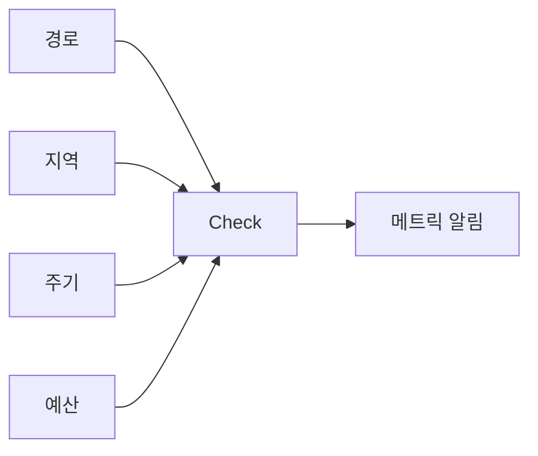

# Synthetic 모니터링

> **사용자처럼 행동하는 봇이 24/7 시스템을 두드린다.** 실 사용자 트래픽
> 이 적은 야간·신규 endpoint·외부 의존도 회귀를 잡는다. 핵심 결정은
> **경로(검사할 user journey)**, **지역(probe 위치)**, **주기(test
> frequency)**, **예산(test 횟수 × 위치 = 비용)** 4축. 단순 ping 시대는
> 끝났고, 2026 표준은 **k6/Playwright 기반 multi-step browser·API**
> 테스트.

- **주제 경계**: 이 글은 **Synthetic(능동) 모니터링**을 다룬다. RUM(실
  사용자 측정)은 별도 글, SLO 기반 알림은
  [SLO 알림](../alerting/slo-alerting.md), Multi-window는
  [Multi-window 알림](../alerting/multi-window-alerting.md), low-traffic
  서비스의 burn rate 함정은 [SLO 알림 §10](../alerting/slo-alerting.md#10-low-traffic-함정--burn-rate의-약점),
  Grafana 시각화는 [Grafana 대시보드](../grafana/grafana-dashboards.md).
- **선행**: [관측성 개념](../concepts/observability-concepts.md), [SLO 알림](../alerting/slo-alerting.md).

---

## 1. 한 줄 정의

> **Synthetic 모니터링**은 "사용자처럼 행동하는 자동 봇으로 시스템을
> 외부에서 능동 검사하는 모니터링"이다.

- 별명: **active monitoring**, **blackbox monitoring**, **probing**
- 측정 대상: 가용성, latency, end-to-end 시나리오 (login → checkout 등),
  외부 의존성 (CDN·DNS·인증서·CSP)
- 결과: 메트릭(`probe_success`, `probe_duration`) + 상세 trace·screenshot

---

## 2. 왜 RUM·서버 메트릭만으로 부족한가

| 지표 | RUM | 서버 메트릭 | Synthetic |
|---|---|---|---|
| 실 사용자 경험 | ✓ 정확 | ✗ | △ (시뮬레이션) |
| 새벽 4시 가용성 | ✗ (사용자 없음) | ✓ | ✓ |
| 신규 endpoint 검증 | ✗ (트래픽 0) | ✗ | ✓ |
| 외부 의존성(CDN·DNS) | △ | ✗ | ✓ |
| 인증서 만료 | ✗ | ✗ | ✓ (자동) |
| 지역별 latency | △ (지역 데이터 부족) | ✗ | ✓ |
| 깊은 비즈니스 흐름 | ✓ (실 사용자만) | ✗ | ✓ (스크립트) |

> **3종 결합이 표준**: synthetic + RUM + 서버 metric. 서로의 사각지대를
> 메운다.

---

## 3. 4축 결정 — 경로·지역·주기·예산



### 3.1 경로 — 무엇을 검사

| 종류 | 사용 |
|---|---|
| **Ping/HTTP** | 서버 alive — 가장 단순 |
| **HTTP API** | endpoint 응답·상태·body 검증 |
| **TCP/DNS/TLS** | 연결성·인증서·DNS 응답 |
| **Browser (e2e)** | 페이지 로드 + click 시나리오 — Playwright/Puppeteer 기반 |
| **Multi-step API** | 로그인 → 토큰 → 다음 endpoint 시나리오 |
| **Mobile (app)** | iOS/Android 자동화 |

> **검사할 경로 우선순위**: 비즈니스 critical journey **3~5개**로 시작.
> "결제 완료", "회원가입", "검색 → 첫 결과", "API key 인증", "지불 webhook
> 수신". **모든 endpoint를 synthetic으로 덮으려 들면 비용 폭주**.

### 3.2 지역 — 어디서 검사

| 패턴 | 적합 |
|---|---|
| **단일 지역** | 내부 서비스, B2B 한 지역 |
| **3 지역 (US·EU·APAC)** | 글로벌 서비스 표준 |
| **멀티 지역 (5~10)** | 일부 사용자 영역 강조 |
| **모든 가용 지역 (29~70)** | over-engineering — 비용·노이즈 |

> **사용자 위치 매칭이 답**: 모든 지역에서 검사하지 마라. **실 사용자
> 분포의 80%를 커버하는 지역만**. CDN·edge POP 검사는 별개 ([CDN](../../network/cdn.md)).

### 3.3 주기 — 얼마나 자주

| 주기 | 사용 |
|---|---|
| **30s** | critical SLO target — 가용성 99.95%+ |
| **1m** | 표준 |
| **5m** | 일반 service check |
| **15m+** | 인증서 만료·DNS·SEO 검사 |

> **주기 = 감지 해상도**: 5분 주기는 **5분 outage가 바로 catch 안 될
> 수도** 있다 (확률적). 1분 outage는 1분 주기로도 못 잡을 수 있다.
> SLO target 99.9%면 1m 주기, 99.95%+면 30s.

### 3.4 예산 — 곱셈으로 폭증

```
checks × locations × (60 / interval_min) × 60 × 24 × 30 = monthly run count
```

| 시나리오 | 월 run 수 |
|---|---|
| 5 check × 3 region × 1m | ~648,000 |
| 10 check × 5 region × 1m | ~2,160,000 |
| 30 check × 10 region × 30s | **~38,880,000** |

> **단가 (list price 기준, volume discount 별도)**: Datadog API test
> ~$5/10K runs, browser test ~$12/10K runs. **곱셈이라 모든 axis가
> 동시에 늘면 폭주**.

---

## 4. 도구 매트릭스 (2026)

| 도구 | 모델 | 강점 | OSS |
|---|---|---|---|
| **Grafana Synthetic Monitoring** | SaaS (Grafana Cloud) | k6 통합, 자체 host 가능한 agent, 30+ region | agent OSS |
| **k6** | OSS + Cloud | JavaScript 스크립트, load/synthetic 통합 | ✓ (**AGPLv3** — SaaS 사용 시 라이선스 검토) |
| **Checkly** | SaaS | Playwright native, monitoring-as-code, Hobby 무료(API 10K + Browser 1.5K/월) | ✗ |
| **Datadog Synthetics** | SaaS | 70+ region, integration 풍부 | ✗ |
| **Pingdom** | SaaS (SolarWinds) | 100+ POP — uptime·SSL 강함, browser 약함 | ✗ |
| **Blackbox Exporter** | OSS (Prometheus) | HTTP·TCP·DNS·ICMP probe → Prometheus | ✓ |
| **k8s-event-exporter + 자체** | OSS | DIY | ✓ |
| **UptimeRobot** | SaaS | 무료 tier, 작은 환경 | ✗ |
| **Catchpoint** | SaaS | 통신사·금융 등 글로벌 | ✗ |

> **선택 기준**:
> - K8s + Prometheus 자체 호스팅 = **Blackbox Exporter**
> - 글로벌 + browser test = **Checkly** 또는 **Grafana SM**
> - 코드 우선 + load test 같이 = **k6**
> - 거대 엔터프라이즈 = **Datadog Synthetics**·**Catchpoint**

---

## 5. Blackbox Exporter — Prometheus OSS 표준

### 5.1 모듈 (probe 종류)

```yaml
# blackbox.yml
modules:
  http_2xx:
    prober: http
    timeout: 5s
    http:
      method: GET
      valid_status_codes: [200]
      fail_if_ssl: false
      fail_if_not_ssl: true
      preferred_ip_protocol: ip4
  http_post:
    prober: http
    http:
      method: POST
      headers:
        Content-Type: application/json
      body: '{"healthcheck":true}'
  tcp_connect:
    prober: tcp
  dns_check:
    prober: dns
    dns:
      query_name: example.com
      query_type: A
  icmp:
    prober: icmp
```

### 5.2 Prometheus scrape

```yaml
- job_name: 'blackbox-http'
  metrics_path: /probe
  params:
    module: [http_2xx]
  static_configs:
    - targets:
        - https://api.example.com/health
        - https://www.example.com/
  relabel_configs:
    - source_labels: [__address__]
      target_label: __param_target
    - source_labels: [__param_target]
      target_label: instance
    - target_label: __address__
      replacement: blackbox-exporter:9115
```

### 5.3 핵심 메트릭

| 메트릭 | 의미 |
|---|---|
| `probe_success` | 0·1 — 성공/실패 |
| `probe_duration_seconds` | 응답 시간 |
| `probe_http_status_code` | HTTP status |
| `probe_ssl_earliest_cert_expiry` | TLS 만료 timestamp |
| `probe_dns_lookup_time_seconds` | DNS 응답 시간 |
| `probe_http_redirects` | redirect 횟수 |
| `probe_http_version` | HTTP 버전 |

### 5.4 알림

```yaml
- alert: ProbeDown
  expr: probe_success == 0
  for: 5m
  labels: { severity: page }
  annotations:
    summary: "{{ $labels.instance }} probe failure"

- alert: SlowProbe
  expr: probe_duration_seconds > 2
  for: 10m
  labels: { severity: warning }

- alert: SSLCertExpiringSoon
  expr: probe_ssl_earliest_cert_expiry - time() < 86400 * 30
  labels: { severity: warning }
  annotations:
    summary: "{{ $labels.instance }} cert expires in 30d"

- alert: SSLCertExpiringCritical
  expr: probe_ssl_earliest_cert_expiry - time() < 86400 * 7
  labels: { severity: page }
```

---

## 6. k6 / Playwright — multi-step browser

### 6.1 k6 browser script 예

```javascript
import { browser } from 'k6/browser';

export const options = {
  scenarios: {
    ui: {
      executor: 'shared-iterations',
      options: { browser: { type: 'chromium' } },
    },
  },
};

export default async function () {
  const page = await browser.newPage();
  try {
    await page.goto('https://example.com/login');
    await page.locator('input[name="user"]').type('synth@example.com');
    await page.locator('input[name="pass"]').type('xxx');
    await page.locator('button[type="submit"]').click();
    await page.waitForSelector('text=Welcome');
    await page.screenshot({ path: 'after-login.png' });
  } finally {
    await page.close();
  }
}
```

### 6.2 monitoring-as-code

| 측면 | 가치 |
|---|---|
| **git에 script** | PR 리뷰, 롤백 가능 |
| **CI 통합** | release 전 동일 script로 acceptance test |
| **재사용** | load test의 user journey를 그대로 synthetic으로 |
| **language**: JavaScript / TypeScript | 개발자 친화 |

> **load test ↔ synthetic 공유**: k6 script 하나로 두 용도. 신규 회귀가
> load test에서 잡히면 synthetic에도 자동 반영.

---

## 7. 인증·시크릿 — synthetic의 보안 함정

| 영역 | 권장 |
|---|---|
| 테스트 사용자 | **전용 계정** — 생산 사용자 금지. read-only 권한 |
| 토큰 | secret manager (Vault·AWS Secrets Manager·external-secrets) |
| MFA | synthetic 전용 계정은 **TOTP secret을 secret manager에 저장 + 자동 입력** 또는 service account·token 흐름 사용. MFA를 disable하지 말 것 |
| 결제 흐름 | **테스트 카드 토큰**, 실 결제 금지 |
| script에 hardcoded | git에 절대 금지 — secret rotation 곤란 |
| API 헤더 | `User-Agent: SyntheticMonitor/1.0` — log·rate-limit 분리 |
| WAF·rate-limit | synthetic IP allowlist 또는 헤더 기반 우회 |

> **synthetic 사용자가 실 사용자에 영향 안 주게**: tag된 데이터 (e.g.
> `synthetic=true`) 또는 별도 테넌트로 분리. 결제·이메일 발송은 dry-run.
> 누적 데이터는 TTL·cleanup job으로 정리.

> **Blackbox Exporter SSRF 위험**: Blackbox Exporter는 `?target=URL` 형태
> 로 임의 URL 요청을 받는다. **외부 노출 시 누구나 사내망 endpoint
> (169.254.169.254 metadata, 사내 DB) 스캔 가능** — 강력한 SSRF 벡터.
> internal only + NetworkPolicy로 격리, 인증 reverse proxy.

---

## 8. SLO 통합 — synthetic을 SLI로

low-traffic 서비스의 burn rate 약점([SLO 알림 §10](../alerting/slo-alerting.md#10-low-traffic-함정--burn-rate의-약점))을
synthetic이 해결.

```yaml
# OpenSLO 예 — probe_success는 0/1, count_over_time이 분모
indicator:
  spec:
    ratioMetric:
      good:
        metricSource:
          type: prometheus
          spec:
            query: |
              sum(count_over_time(probe_success{job="synthetic-checkout"}[5m] == 1))
      total:
        metricSource:
          type: prometheus
          spec:
            query: |
              sum(count_over_time(probe_success{job="synthetic-checkout"}[5m]))
```

> **probe_success 자체가 0/1이라 단순 `rate()`만으로는 분모를 못 만든다**.
> `count_over_time`으로 검사 횟수를 분모, 그 중 `== 1`인 것만 분자.

| 가치 | 설명 |
|---|---|
| **traffic 일정** | 1m·30s 주기로 일정한 분모 → burn rate 통계 안정 |
| **외부 의존 포함** | DNS·CDN·인증서까지 SLO에 포함 |
| **24/7** | 야간·휴일에도 SLO 측정 |

> **synthetic SLI vs RUM SLI**: synthetic은 **신뢰성·일관성**이 강점,
> 실 사용자 경험은 RUM. SLO는 **둘 다** 가지는 것이 글로벌 스탠다드.

### 8.1 probe-of-probe — synthetic 자체 모니터링

synthetic agent가 죽으면 `probe_success == 0`으로 보여 false 알림.
또는 agent가 silent fail하면 데이터 자체가 안 들어와 알림 누락.

| 패턴 | 설명 |
|---|---|
| **alive heartbeat** | agent가 1분마다 알려진 endpoint를 hit, 그 메트릭이 안 들어오면 agent 다운 |
| **`up{job="blackbox"}`** | Prometheus가 Blackbox Exporter 자체를 scrape. exporter 다운 별도 알림 |
| **`absent_over_time(probe_success[10m])`** | probe 메트릭 자체가 사라지면 |
| **외부 Heartbeat 서비스** | PagerDuty/Opsgenie Heartbeat — synthetic이 5분마다 ping, 멈추면 incident |

### 8.2 Private Location — VPN 너머의 사내 검사

| 도구 | private agent |
|---|---|
| Datadog | Private Location agent (사내에 컨테이너 1대) |
| Checkly | Private Location |
| Grafana SM | Private Probe (synthetic-monitoring-agent self-host) |
| Blackbox Exporter | 자체 호스트 — natively private |

> **B2B·내부 서비스 검사에 필수**: 외부 SaaS POP은 사내망 도달 불가.
> private agent를 사내에 배치하고 SaaS UI에서 결과 시각화.

---

## 9. 대시보드 — 표준 패널

| 패널 | 표시 |
|---|---|
| 가용성 (지역별) | `probe_success` heatmap 또는 line by region |
| latency (지역별 p95·p99) | `probe_duration_seconds` |
| TLS 만료까지 일수 | gauge per cert |
| HTTP status 분포 | `probe_http_status_code` 분포 |
| 최근 실패 incident | annotation overlay |
| 지역 지도 | Geomap with success rate |

> **실패 detail**: 단순 메트릭 외에도 **screenshot·HAR·trace**가 필요한
> 순간이 있다. Grafana SM·Checkly·Datadog는 자동 저장. blackbox exporter
> 자체는 메트릭만 — 별도 trace·log 수집 필요.

---

## 10. 안티패턴

| 안티패턴 | 결과 | 교정 |
|---|---|---|
| 모든 endpoint × 모든 region × 30s | 비용 폭주 | 비즈니스 critical 5개 + 주요 region |
| ping만 (HTTP 200) | 깊은 회귀 못 잡음 | multi-step + body 검증 |
| 실 사용자 계정으로 로그인 | 데이터 오염, 잠금 | 전용 synthetic 계정 |
| token·password git 커밋 | secret 노출 | secret manager |
| WAF 우회 안 함 | rate-limit으로 false positive | allowlist 또는 헤더 |
| browser test가 60s 넘게 | timeout 잦음 | 시나리오 분할 |
| TLS 만료 알림 7일 전만 | 휴가 시즌 사고 | 30일 + 7일 2단 |
| browser test에 화면 크기 미명시 | viewport 다름으로 selector 실패 | 표준 viewport 명시 |
| synthetic 메트릭에 `country=*` 라벨 | 카디널리티 폭증 | region 정도만 |
| WAF·CDN을 우회한 직접 origin 검사만 | edge 문제 못 잡음 | 양쪽 동시 |
| 실 결제 흐름 매시간 | $$ | sandbox/test card |
| synthetic 결과로 RUM 대체 | 실 사용자 경험 부정확 | RUM과 병행 |
| script git history 없이 vendor UI에서 작성 | 변경 이력 X | code-first |
| browser test에 video record 항상 ON | 비용 + privacy | 실패 시만 |
| Blackbox Exporter 외부 노출 | SSRF — 사내망 스캔 가능 | internal only + NetworkPolicy |
| synthetic agent 자체 모니터링 없음 | agent 다운을 silent로 | absent·Heartbeat |
| MFA를 disable한 synthetic 계정 | 보안 감사 fail | TOTP secret + 자동 입력 |
| multi-step API 후 cleanup 없음 | 데이터 누적 | TTL job, tag로 격리 |
| k6 AGPL 라이선스 미검토 | SaaS 사용 시 라이선스 위반 가능 | 법무 검토 |

---

## 11. 운영 체크리스트

- [ ] 비즈니스 critical journey 3~5개로 시작, 점진 확장
- [ ] 사용자 분포 80% 커버하는 region만
- [ ] SLO target에 맞는 주기 (99.9%=1m, 99.95%+=30s)
- [ ] monitoring-as-code (k6·Checkly·Playwright script)
- [ ] secret은 외부 vault, script git에 평문 금지
- [ ] 전용 synthetic 계정·tag로 데이터 오염 방지
- [ ] WAF·rate-limit allowlist 또는 헤더 기반 우회
- [ ] TLS 만료 30일 + 7일 2단 알림
- [ ] 실패 시 screenshot·HAR·trace 저장
- [ ] synthetic을 SLO SLI에 포함 (low-traffic 서비스 특히)
- [ ] 비용 모니터링 — 매월 run 수 추적
- [ ] dashboard에 지역별 가용성·latency
- [ ] CDN·edge POP과 origin 양쪽 동시 검사
- [ ] script viewport·timeout·retry 표준화
- [ ] synthetic agent 자체 health monitoring (probe-of-probe)
- [ ] private location agent — 사내 endpoint 검사 시
- [ ] Blackbox Exporter는 internal only, NetworkPolicy 격리
- [ ] OSS 도구 라이선스 검토 (k6 AGPLv3 등)

---

## 참고 자료

- [Grafana — Synthetic Monitoring 공식](https://grafana.com/docs/grafana-cloud/testing/synthetic-monitoring/) (확인 2026-04-25)
- [Grafana — Probe Locations 가이드](https://grafana.com/docs/learning-paths/detect-outages-synthetic-monitoring/select-probe-locations/) (확인 2026-04-25)
- [Grafana Synthetic Monitoring agent OSS](https://github.com/grafana/synthetic-monitoring-agent) (확인 2026-04-25)
- [Prometheus Blackbox Exporter](https://github.com/prometheus/blackbox_exporter) (확인 2026-04-25)
- [k6 공식](https://k6.io/) (확인 2026-04-25)
- [k6 browser docs](https://grafana.com/docs/k6/latest/using-k6-browser/) (확인 2026-04-25)
- [Checkly 공식](https://www.checklyhq.com/) (확인 2026-04-25)
- [Datadog Synthetic Monitoring Best Practices](https://www.nobs.tech/blog/datadog-synthetic-monitoring-best-practices) (확인 2026-04-25)
- [Synthetic Monitoring Tools Compared (OnlineOrNot)](https://onlineornot.com/synthetic-monitoring-tools) (확인 2026-04-25)
