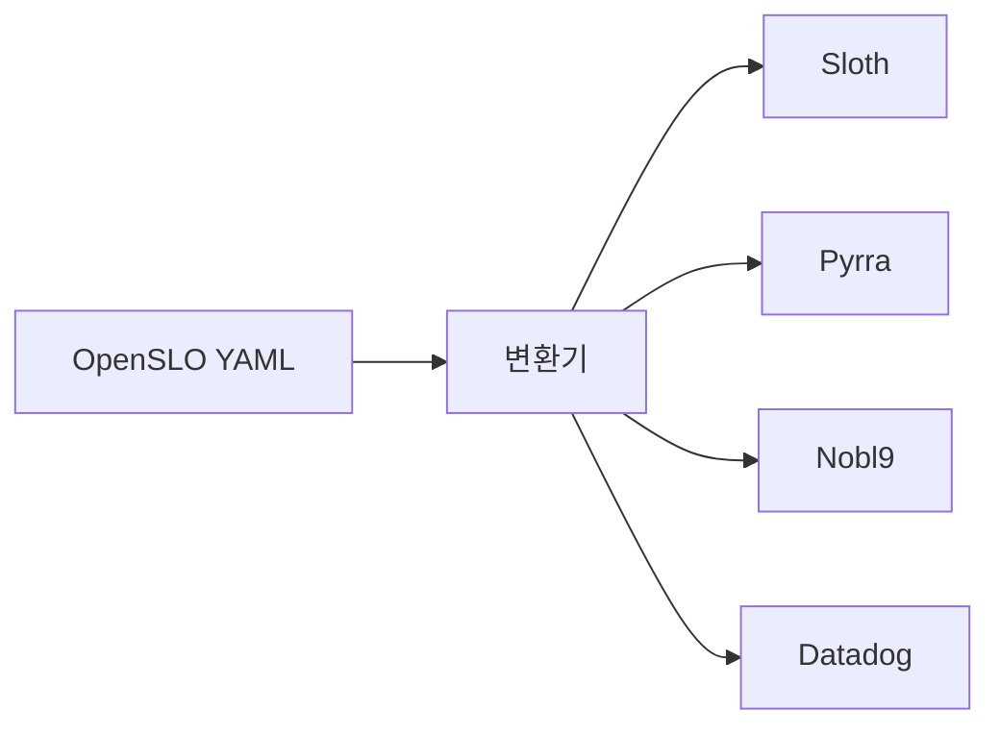
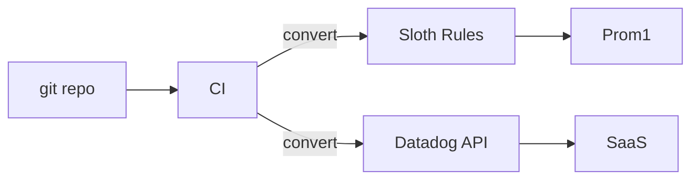

# OpenSLO

> **벤더 중립의 SLO 명세 표준.** Sloth·Pyrra·Nobl9·Datadog 등 도구마다
> SLO YAML 포맷이 다르고 마이그레이션이 어려웠던 문제를 푸는 시도다.
> Kubernetes 스타일 YAML 7개 kind(SLO·SLI·Service·AlertPolicy·...)으로
> SLO를 선언적으로 표현하고, 각 도구는 OpenSLO를 자기 형식으로 변환·
> 검증한다. 1.0 stable, v2alpha 제안 중.

- **주제 경계**: SLO **수학·개념**은 [sre/SLO](../../sre/slo.md), 룰
  생성기 자체 비교는 [Sloth·Pyrra](slo-rule-generators.md), 알림은
  [SLO 알림](../alerting/slo-alerting.md). 이 글은 **표준 명세**만.
- **선행**: [Sloth·Pyrra](slo-rule-generators.md) — 운영 도구에 익숙해
  진 다음에 표준의 가치가 보임.

---

## 1. 한 줄 정의

> **OpenSLO**는 "벤더 중립의 SLO 선언적 명세 표준"이다.

- 라이선스 Apache 2.0
- 거버넌스 OpenSLO 커뮤니티 (Nobl9·Sumo Logic·Cisco·Datadog 등 참여),
  **CNCF 미입회**
- 현재 stable: **v1** (`apiVersion: openslo/v1`)
- 차기: **v2alpha** (enhancements 디렉터리, 미릴리스)

---

## 2. 왜 표준이 필요했나

| 도구 | YAML 포맷 |
|---|---|
| Sloth | `sloth.dev/v1` `PrometheusServiceLevel` |
| Pyrra | `pyrra.dev/v1alpha1` `ServiceLevelObjective` |
| Nobl9 | 자체 SaaS YAML |
| Datadog SLO | API JSON |
| 자체 작성 | 자유 |

같은 SLO 개념을 매번 다른 형식으로. 마이그레이션·이식·중앙 관리 모두
어렵다. **OpenSLO**는 공통 명세를 만들고, 도구는 변환을 담당한다.



---

## 3. 7개 kind

| kind | 역할 |
|---|---|
| **`Service`** | 도메인 서비스 메타 — name·description·display name |
| **`SLI`** | Service Level Indicator — 측정 대상 메트릭/쿼리 |
| **`SLO`** | Service Level Objective — target·window·SLI 참조 |
| **`AlertPolicy`** | 어떤 조건을 어디로 알릴지 — AlertCondition·NotificationTarget 묶음 |
| **`AlertCondition`** | 알림 조건 — burn rate threshold |
| **`AlertNotificationTarget`** | 알림 채널 — webhook·PagerDuty·Slack |
| **`DataSource`** | 메트릭 출처 — Prometheus·Datadog·CloudWatch 등 |

> **K8s YAML 컨벤션 그대로**: `apiVersion`·`kind`·`metadata`·`spec` 4단
> 구조. K8s에 익숙한 운영자 친숙.

---

## 4. SLO 예제

```yaml
apiVersion: openslo/v1
kind: SLO
metadata:
  name: checkout-availability
  displayName: "Checkout 가용성"
spec:
  service: checkout
  description: "Checkout API 요청 5xx 비율 < 0.1%"
  indicator:
    metadata:
      name: checkout-error-rate
    spec:
      ratioMetric:
        counter: true
        good:
          metricSource:
            type: prometheus
            spec:
              query: |
                sum(rate(http_requests_total{job="checkout",code!~"5.."}[5m]))
        total:
          metricSource:
            type: prometheus
            spec:
              query: |
                sum(rate(http_requests_total{job="checkout"}[5m]))
  timeWindow:
    - duration: 28d
      isRolling: true
  budgetingMethod: Occurrences
  objectives:
    - displayName: "p99 availability"
      target: 0.999
    - displayName: "p95 availability"
      target: 0.9995
```

> **다중 objective**: `objectives` 배열로 한 SLO에 여러 target 지정 가능.
> latency p95·p99를 한 SLO에 묶거나 보고용 다단 target에 활용.

### 4.0 SLI 재사용 패턴 (`indicatorRef`)

```yaml
---
apiVersion: openslo/v1
kind: SLI
metadata:
  name: http-error-ratio
spec:
  ratioMetric:
    counter: true
    bad:
      metricSource:
        type: prometheus
        spec:
          query: sum(rate(http_errors_total[5m]))
    total:
      metricSource:
        type: prometheus
        spec:
          query: sum(rate(http_requests_total[5m]))
---
apiVersion: openslo/v1
kind: SLO
metadata:
  name: api-availability
spec:
  service: api
  indicatorRef: http-error-ratio   # 재사용
  timeWindow: [{ duration: 28d, isRolling: true }]
  budgetingMethod: Occurrences
  objectives: [{ target: 0.999 }]
```

> **재사용의 가치**: 같은 SLI를 여러 SLO에 — 99.5%·99.9%·99.99% target
> 다단 측정. 변경 시 한 곳만.

### 4.1 indicator 종류

| 종류 | 의미 |
|---|---|
| **`ratioMetric`** | 비율 — `good/total`, `bad/total`(에러 카운터), `raw`(이미 비율) 세 패턴 |
| **`thresholdMetric`** | raw 값을 임계값과 직접 비교 (latency < 200ms 등) |

> **`bad/total` 패턴**: 에러 카운터만 있는 경우(`http_errors_total`)
> 자연스럽다. spec에서 `bad`로 정의하면 SLO는 자동으로 `1 - bad/total`.

### 4.2 time window

| 종류 | 예 |
|---|---|
| **rolling** | `duration: 28d`, `isRolling: true` — 항상 직전 28일 |
| **calendar-aligned** | `calendar: { startTime, timeZone }`, `duration: 30d` — 매월 1일 시작 |

> **calendar-aligned는 분기·연 단위 SLO 보고서에 적합** — "Q1 가용성
> 99.95%" 같은 비즈니스 측면 보고. 운영 burn rate는 rolling이 자연.

### 4.3 budgeting method

| 방식 | 의미 |
|---|---|
| **Occurrences** | 이벤트(요청) 단위 — 가장 흔함 |
| **Timeslices** | 시간 슬라이스 binary — 1분 단위로 SLO 충족 여부. **`timeSliceWindow` 필수** (예: `1m`) |
| **RatioTimeslices** | 슬라이스의 평균 비율. **`timeSliceWindow` 필수** |

> **`timeSliceWindow` 누락**: Timeslices/RatioTimeslices에서 이 필드가
> 빠지면 `oslo validate`가 거절. CI에서 lint로 차단.

---

## 5. AlertPolicy 예제

```yaml
apiVersion: openslo/v1
kind: AlertPolicy
metadata:
  name: checkout-burn-page
spec:
  description: "fast burn → 즉각 호출"
  alertWhenNoData: false
  alertWhenResolved: true
  alertWhenBreaching: true
  conditions:
    - kind: AlertCondition
      metadata:
        name: fast-burn
      spec:
        severity: page
        condition:
          kind: burnrate
          op: gte
          threshold: 14.4
          lookbackWindow: 1h
          alertAfter: 5m
  notificationTargets:
    - targetRef: pagerduty-payments
```

> **표준 4단 알림은 명세에 강제 안 함**: OpenSLO는 burn rate 수치를 포함
> 하지만 14.4·6·3·1 4단 구조 자체는 도구가 결정. 명세는 "이렇게 표현
> 가능"만 정의.

---

## 6. DataSource 예제

```yaml
apiVersion: openslo/v1
kind: DataSource
metadata:
  name: prom-prod
spec:
  type: prometheus
  connectionDetails:
    url: https://prometheus.prod.example.com
```

| 지원 type | 비고 |
|---|---|
| `prometheus` | URL |
| `datadog` | API key reference |
| `cloudwatch` | region·credentials |
| `dynatrace` | tenant URL |
| `newrelic` | account ID |
| `splunk-observability-cloud` | realm |

> **vendor 통합은 명세가 정의, 구현은 도구**: OpenSLO는 type만 표준화.
> 실제 fetch는 변환 도구나 SaaS가.

---

## 7. `oslo` CLI와 변환 도구들

`oslo`는 OpenSLO 공식 CLI — **검증·포매팅 전용**. 변환은 도구별 자체
기능 또는 별도 변환기가 담당한다.

### 7.1 `oslo` 자체 명령

```bash
# YAML 검증 (스키마·필드 검증)
oslo validate -f slo.yaml

# 포매팅 (alphabetical sort, indent 통일)
oslo fmt -f slo.yaml
```

### 7.2 도구별 변환 경로 (2026-04 기준)

| 대상 | 명령 |
|---|---|
| **Sloth** | `sloth generate -i openslo.yml` — Sloth 자체가 OpenSLO 입력 수신. **v1alpha만 지원**, 30d window·ratioMetric·Prometheus 한정 |
| **Pyrra** | 공식 변환 도구 없음. 비공식 변환기 또는 수동 매핑 |
| **Nobl9** | `sloctl convert openslo` (Nobl9 sloctl) 또는 `nobl9-openslo` Go 라이브러리 |
| **Datadog** | 공식 1차 변환 없음. 커뮤니티 도구 (예: `openslo-bridge`) |
| **Sumo Logic·Splunk** | 자체 변환기 또는 Go SDK로 자체 구현 |

> **현재의 현실**: **OpenSLO → 도구의 1:1 변환은 도구마다 성숙도 차이**가
> 크다. Nobl9·Sloth는 native 입력 가능, Pyrra·Datadog는 자체 구현 필요.

### 7.3 CI 통합

```yaml
# GitHub Actions 예
- name: Validate OpenSLO
  run: oslo validate -f slos/

- name: Generate Sloth rules from OpenSLO
  run: |
    for f in slos/*.yaml; do
      sloth generate -i "$f" -o "build/sloth/$(basename $f)"
    done

- name: Lint Prometheus rules
  run: promtool check rules build/sloth/*.yaml
```

> **GitOps 파이프라인 표준**: PR에 OpenSLO YAML 변경 → CI에서 validate
> + 도구별 generate + Prometheus rule lint → main merge 시 ArgoCD가
> 변환 결과 적용.

---

## 8. v1 vs v2alpha — 진행 중인 변화

| 측면 | v1 (stable) | v2alpha (제안) |
|---|---|---|
| Indicator 분리 | `SLI` 별도 kind | `SLO`에 inline 가능 |
| burn rate 알림 | AlertPolicy에 burnrate 표현 | 명세 정교화 |
| metadata standard | `displayName` 등 | label·annotation 컨벤션 강화 |
| 다국어 description | 미지원 | 검토 |

> **v2alpha는 미릴리스**: enhancement 디렉터리에 RFC. v1 SLO를 그대로 두고
> v2 도입 시 마이그레이션 도구가 자동 변환할 수 있도록 설계 중. 신규
> 채택은 v1.

---

## 9. 도구 호환성 매트릭스 (2026-04)

| 도구 | OpenSLO 입력 | 변환 |
|---|---|---|
| 도구 | 입력 방식 | 지원 OpenSLO 버전 | 한계 |
|---|---|---|---|
| **Sloth** | `sloth generate -i openslo.yml` | **v1alpha only** | 30d window, ratioMetric, Prometheus 한정 |
| **Nobl9** | `sloctl convert openslo` 또는 `nobl9-openslo` lib | v1 | 1차 시민 |
| **Pyrra** | 공식 변환 없음 | — | 수동·비공식 변환기 |
| **Datadog SLO** | 공식 변환 없음 | — | 커뮤니티 변환기 (예: openslo-bridge) |
| **Sumo Logic** | 자체 변환기 일부 | — | 사례별 |
| **자체 도구** | Go SDK (`github.com/OpenSLO/oslo`) | v1 | 직접 파싱 |

> **선택 기준**:
> - 이미 Sloth/Pyrra 운영 + 표준화 시작 = **OpenSLO를 source of truth, 변환은 CI에서**
> - 다중 백엔드 (Sloth + Datadog) = OpenSLO 1차 가치
> - 단일 도구 단일 환경 = 표준 도입 ROI 낮음 — 도구의 native YAML 그대로

---

## 10. 도입 시나리오 — 3가지 패턴

### 10.1 Source of Truth as OpenSLO



- 모든 SLO는 OpenSLO YAML로 작성
- CI가 도구별 변환·검증
- 도구 교체 시 변환 단계만 수정

> **Sloth 사용 시 제약**: Sloth는 OpenSLO **v1alpha만** 입력 받는다 →
> v1로 작성한 OpenSLO를 Sloth로 보내려면 **v1→v1alpha downconvert가
> 필요**. 단일 source-of-truth 전략은 도구별 호환 매트릭스를 먼저 점검.

### 10.2 도구 native + OpenSLO export

- 운영은 Sloth/Pyrra spec 그대로
- 외부 보고·표준화 위해 OpenSLO로 export
- 변환은 backward (Sloth → OpenSLO 도구 부분 지원)

### 10.3 다중 SaaS 통합

- Datadog·Nobl9·Splunk 동시 운영
- OpenSLO를 중간 표준으로 두고 각 SaaS API로 push
- 가장 표준의 핵심 가치가 발휘

---

## 11. 한계·트레이드오프

| 한계 | 영향 |
|---|---|
| **도구별 native 기능 손실** | Sloth의 SLI plugin·Pyrra의 latencyNative 등 도구 고유 기능은 OpenSLO 명세 외 |
| **OpenSLO ↔ 도구 변환의 lossy** | 일부 필드는 round-trip 안 됨 |
| **AlertPolicy 표현력 한계** | 특정 도구의 알림 조건이 OpenSLO에 없으면 변환 후 손실 |
| **stable v1만 표준** | v2alpha는 미릴리스 — 신기능 기다리는 사용자엔 부담 |
| **거버넌스 활동성** | **CNCF 미입회**. 2024~2025 릴리스 빈도 정체기 — v2alpha 미릴리스 |
| **도구별 OpenSLO 버전 호환 차이** | Sloth는 v1alpha, Nobl9는 v1. source-of-truth 시 변환 필요 |

> **현실 권장**: SLO가 매우 적거나 (10개 미만) 단일 도구·단일 백엔드는
> OpenSLO 도입 ROI가 낮다. **다중 백엔드·다중 팀·이식성이 핵심 가치
> 일 때만**.

---

## 12. 안티패턴

| 안티패턴 | 결과 | 교정 |
|---|---|---|
| OpenSLO를 SaaS 종속 회피용으로만 도입 | 도구 native 기능 손실, 가치 < 비용 | 명확한 다중 백엔드 사용 사례 |
| 변환 결과를 git에 커밋 | drift, source of truth 모호 | 변환은 CI 빌드 결과, OpenSLO만 git |
| `oslo validate` 없이 머지 | 잘못된 spec이 production | PR 전 validate 강제 |
| OpenSLO + 도구 native YAML 동시 작성 | 두 형식 동기화 부담 | 한 source만 |
| v2alpha 기능을 production 의존 | 미릴리스 — breaking 가능 | v1만 |
| AlertPolicy를 모든 도구에 1:1 매핑 | 도구마다 burn rate 알고리즘 다름 | 도구별 알림은 도구의 표준에 맡김 |
| OpenSLO 변환 후 Sloth/Pyrra YAML을 수동 편집 | drift | 모든 변경은 OpenSLO에서 |
| SLI를 매 SLO에 inline | 재사용 안 됨 | SLI를 별도 kind로 추출 (v1 권장) |
| Service kind 누락 | metadata 빈약, 다중 SLO 묶음 어려움 | Service kind를 우선 정의 |

---

## 13. 운영 체크리스트

- [ ] OpenSLO 채택 ROI 검토 — 단일 백엔드면 보류
- [ ] `oslo validate` CI step (PR 차단)
- [ ] 변환 결과는 빌드 산출물 (git에 안 함)
- [ ] `Service` kind를 우선 정의, SLI는 재사용
- [ ] DataSource는 environment(`prod`·`staging`)별로 분리
- [ ] AlertPolicy는 도구의 표준 알림에 맡김 (burn rate 4단은 도구가)
- [ ] v1 stable만 사용, v2alpha는 follow-up
- [ ] 변환 후 도구 YAML도 lint (`promtool check rules` 등)
- [ ] 도구 고유 기능 사용 시 OpenSLO 외부에서 보강 (annotation)
- [ ] OpenSLO 거버넌스 변화 모니터링 (CNCF 입회 진행 등)
- [ ] SLO 변경은 PM·SRE 코드오너 강제 (`CODEOWNERS`)
- [ ] Timeslices/RatioTimeslices 사용 시 `timeSliceWindow` 명시
- [ ] SLI는 `kind: SLI` + `indicatorRef`로 재사용
- [ ] 도구별 OpenSLO 버전 호환 매트릭스 사전 점검 (Sloth v1alpha 등)

---

## 참고 자료

- [OpenSLO 공식 사이트](https://openslo.com/) (확인 2026-04-25)
- [OpenSLO Specification GitHub](https://github.com/OpenSLO/OpenSLO) (확인 2026-04-25)
- [oslo CLI](https://github.com/OpenSLO/oslo) (확인 2026-04-25)
- [OpenSLO Go SDK](https://pkg.go.dev/github.com/OpenSLO/oslo) (확인 2026-04-25)
- [Nobl9 — OpenSLO 통합](https://docs.nobl9.com/slos-as-code/openSLO) (확인 2026-04-25)
- [Google SRE Workbook — Defining SLOs](https://sre.google/workbook/implementing-slos/) (확인 2026-04-25)
- [SLODLC (SLO Development Life Cycle)](https://slodlc.com/) (확인 2026-04-25)
