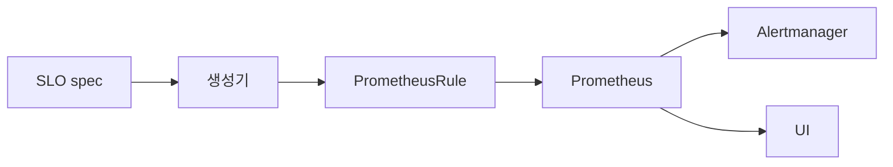

# Sloth·Pyrra

> **SLO를 PromQL recording rule + alert rule로 자동 생성.** 사람이 burn
> rate 수식, multi-window 룰, 4단 알림을 손으로 짜는 시대는 끝났다. SLO
> spec(YAML/CRD) 한 장으로 Google SRE 표준 multi-window-multi-burn
> 알림과 error budget 메트릭이 자동 생성된다. 두 도구는 같은 문제를 다른
> 방식으로 푼다.

- **주제 경계**: SLO **수학·개념** 자체는 [sre/SLO](../../sre/slo.md)
  ·[sre/Error Budget](../../sre/error-budget.md), 알림 룰 자체는
  [SLO 알림](../alerting/slo-alerting.md)·[Multi-window 알림](../alerting/multi-window-alerting.md),
  표준 명세는 [OpenSLO](openslo.md), 알림 라우팅은
  [Alertmanager](../prometheus/alertmanager.md)·[Grafana OnCall](../alerting/grafana-oncall.md).
- **선행**: SLO 기본, PromQL.

---

## 1. 한 줄 정의

> **SLO 룰 생성기**는 "SLO 명세(YAML)에서 Prometheus recording·alert
> rule을 자동으로 만드는 도구"다.

- 입력: SLO 정의 (target·window·SLI 쿼리)
- 출력: **PrometheusRule** 또는 raw YAML, **error budget 메트릭**, dashboard
- 표준: Google SRE Workbook의 **multi-window-multi-burn** 알림

---

## 2. 왜 자동 생성인가

손으로 SLO PromQL을 짤 때 다음을 매번 작성:

| 항목 | 이유 |
|---|---|
| 5개 시간 창 burn rate | 5m·30m·1h·6h·24h 각각의 rate |
| 4단 알림 (page short, page long, ticket short, ticket long) | 빠른 감지 + 누적 burn |
| error budget remaining | `1 - (errors / requests / (1 - target))` |
| `slo_objective`·`slo_target` 메타 메트릭 | dashboard·report용 |
| availability over rolling window | `sum_over_time` + alignment |

**이걸 100개 SLO에 손으로?** 두 도구가 푸는 핵심.

---

## 3. Sloth — 단순함의 미학

### 3.1 정체성

| 측면 | 내용 |
|---|---|
| 거버넌스 | OSS, slok 1인 메인테이너 |
| 라이선스 | Apache 2.0 |
| 최신 안정 | v0.16.0 (2026-04-04) |
| 모드 | **CLI** (generate) + **K8s Operator** + **`sloth server` 빌트인 UI (v0.16+, experimental)** |
| 출력 | PrometheusRule manifest, Grafana 대시보드 JSON |
| UI | **v0.16+ 빌트인 UI 추가**(experimental) — 이전엔 Grafana 대시보드만 |
| Plugin | `alert_rules_v1` 등 SLI plugin 시스템(v0.14+), VictoriaMetrics 지원, contrib plugins |

### 3.2 SLO spec 예

```yaml
version: "prometheus/v1"
service: "checkout"
labels:
  team: payments
slos:
  - name: requests-availability
    objective: 99.9
    sli:
      events:
        error_query: sum(rate(http_requests_total{job="checkout",code=~"5.."}[{{.window}}]))
        total_query: sum(rate(http_requests_total{job="checkout"}[{{.window}}]))
    alerting:
      page_alert:
        labels: { severity: page }
      ticket_alert:
        labels: { severity: ticket }
```

`{{.window}}` 템플릿 변수에 Sloth가 자동으로 **5m·30m·1h·2h·6h·1d·3d** (7창) + 30d period를 채워넣어 ~30개 룰을 생성.

### 3.3 K8s 모드 — `PrometheusServiceLevel` CRD

```yaml
apiVersion: sloth.slok.dev/v1
kind: PrometheusServiceLevel
metadata:
  name: checkout-slo
  namespace: monitoring
spec:
  service: checkout
  slos:
    - name: requests-availability
      objective: 99.9
      sli:
        events:
          error_query: ...
          total_query: ...
```

> **메인테인 모드 vs plugin 활성**: 메인테이너는 코어를 final form으로
> 본다고 공지했으나, **plugin 생태계(SLI 플러그인·alert_rules_v1)와
> 빌트인 UI는 v0.14~v0.16에서 활발히 진화** 중. 즉 "기능은 plugin으로,
> 코어는 안정"이 정확한 표현.

### 3.4 multi-window-multi-burn 알림 — Sloth/Pyrra의 4단 구현

| 알림 | 시간 창 (short + long) | burn rate | budget 소진 시간 |
|---|---|---|---|
| **Page (fast)** | 5m + 1h | 14.4× | 약 2일 |
| **Page (slow)** | 30m + 6h | 6× | 약 5일 |
| **Ticket (fast)** | 2h + 1d | 3× | 약 10일 |
| **Ticket (slow)** | 6h + 3d | 1× | window 전체 (28~30d) |

> **표준 vs 구현체**: Google SRE Workbook 표 5.6의 정전(canonical)은
> 14.4·6·1 (3단). Sloth/Pyrra는 ticket을 더 세분화한 **4단(14.4·6·3·1)**
> 으로 구현. 둘 다 SRE Workbook 정신은 동일하지만 "표준 = 4단"이라
> 오해하면 안 됨.

> 각 알림은 **두 창의 동시 조건**으로 false positive 감소 — short는 빠른
> 감지, long은 노이즈 제거 ([Multi-window 알림](../alerting/multi-window-alerting.md)).

---

## 4. Pyrra — UI와 활성 개발

### 4.1 정체성

| 측면 | 내용 |
|---|---|
| 거버넌스 | OSS, Polar Signals·커뮤니티 |
| 라이선스 | Apache 2.0 |
| 최신 안정 | v0.9.5 (2026-03) — 0.x이지만 활성 개발 |
| 모드 | **K8s Operator** + 내장 **Web UI** |
| 출력 | PrometheusRule + UI에서 실시간 SLO 상태·burn rate 그래프 |
| 백엔드 | Prometheus·Thanos·Mimir multi-tenant |

### 4.2 SLO spec 예

```yaml
apiVersion: pyrra.dev/v1alpha1
kind: ServiceLevelObjective
metadata:
  name: checkout-availability
  namespace: monitoring
spec:
  target: "99.9"           # CRD 한계상 string
  window: 4w
  description: "Checkout API 가용성"
  indicator:
    ratio:
      errors:
        metric: http_requests_total{job="checkout",code=~"5.."}
      total:
        metric: http_requests_total{job="checkout"}
```

> **target이 string**: CRD validation의 OpenAPI schema가 `float`을 잘
> 처리 못해 `string` — 99.95처럼 소수점 자유.

### 4.3 SLO indicator 종류

| 종류 | 의미 |
|---|---|
| `ratio` | error/total 비율 — 가장 흔한 형식 |
| `latency` | classic histogram bucket — `histogram_quantile`로 latency SLO |
| `latencyNative` | Native Histogram 기반 latency SLO ([Native·Exponential](../metric-storage/exponential-histograms.md)) |
| `bool_gauge` | gauge가 1·0 형태 (synthetic 체크 결과) |

### 4.4 burn rate recording rule

Pyrra는 다음 7개 시간 창 burn rate를 자동 생성:

| Recording rule | 이름 |
|---|---|
| 3m burn rate | `apiserver_request_duration:burnrate3m` |
| 15m burn rate | `apiserver_request_duration:burnrate15m` |
| 30m burn rate | `apiserver_request_duration:burnrate30m` |
| 1h burn rate | `apiserver_request_duration:burnrate1h` |
| 3h burn rate | `apiserver_request_duration:burnrate3h` |
| 12h burn rate | `apiserver_request_duration:burnrate12h` |
| 2d burn rate | `apiserver_request_duration:burnrate2d` |

알림은 4단:

| 시간 창 | severity |
|---|---|
| 5m & 1h | critical (page) |
| 30m & 6h | critical (page) |
| 2h & 1d | warning (ticket) |
| 6h & 3d | warning (ticket) |

### 4.5 Web UI 기능

| 화면 | 보여주는 것 |
|---|---|
| SLO 목록 | 잔여 error budget 정렬, 라벨 필터 |
| Detail page | 가용성·error budget·burn rate 그래프, RED 메트릭 |
| Multi-burn alert 표 | 어느 알림 활성, 어느 창에서 burn |
| 시간 picker | 절대·상대 |

> **UI의 가치**: SLO가 50개+면 잔여 budget 정렬과 시각화가 운영 효율에
> 직결. Sloth는 Grafana 대시보드를 별도 import해야 함 — Pyrra는 빌트인.

---

## 5. 비교 — 결정 매트릭스

| 측면 | Sloth | Pyrra |
|---|---|---|
| **모드** | CLI + Operator | Operator + UI |
| **UI 성숙도** | v0.16+ experimental | stable |
| **CRD** | `PrometheusServiceLevel` | `ServiceLevelObjective` |
| **SLO 종류** | events(error/total) + raw queries | ratio·latency·bool_gauge |
| **window** | spec 안에 명시 | spec에 window 필수 (1d~30d 등) |
| **Burn rate 창** | 5m·30m·1h·2h·6h·1d·3d (+30d) | 3m·15m·30m·1h·3h·12h·2d |
| **UI** | v0.16+ 빌트인 (experimental) | 빌트인 (stable, RED 그래프) |
| **활성 개발** | maintenance 모드 | active |
| **Operator** | yes | yes |
| **GitOps** | CLI generate가 자연스러움 | CRD apply 자연스러움 |
| **Thanos·Mimir** | 룰만 생성 — 백엔드 무관 | UI에 직접 연결 (`--prometheus-url`) |
| **Multi-tenant** | 룰 라벨로 tenant 분리 | `--mimir-tenant-ids` |
| **OpenSLO 호환** | 부분 (변환 가능) | 부분 |

### 5.1 선택 기준

| 상황 | 권장 |
|---|---|
| 단순함·CLI·GitOps + Grafana 대시보드 자동화 | **Sloth** |
| UI에서 SLO 목록·burn rate 확인 + 활성 개발 | **Pyrra** |
| 100+ SLO + 운영 팀 자체 화면 필요 | **Pyrra** |
| 도구 추가 의존 최소화 | **Sloth** (CLI) |
| Mimir multi-tenant + UI | **Pyrra** |

---

## 6. 운영 — 두 도구 모두 공통

### 6.1 SLO 정의 패턴



| 단계 | 책임 |
|---|---|
| 1. SLO spec 작성 | 서비스 owner가 GitOps repo에 |
| 2. CR apply 또는 CLI generate | CD가 자동 |
| 3. Prometheus reload | rule 적용 |
| 4. Alertmanager 라우팅 | severity·team 라벨 기반 |
| 5. dashboard·UI | 잔여 budget 추적 |

### 6.2 SLI 선택

| 신호 | 권장 SLI |
|---|---|
| HTTP 요청 처리 | error/total ratio |
| latency | `histogram_quantile(0.99) < threshold` 비율 |
| async job | success/total ratio + 처리 시간 |
| 데이터 freshness | `time() - last_seen < threshold` 비율 |
| 외부 의존성 | synthetic 체크 + bool_gauge |

### 6.3 raw query 우선

```yaml
# 금지 패턴: 카디널리티 높은 라벨
sum(rate(http_requests_total[5m])) by (user_id)

# 권장: 미리 aggregated된 recording rule
sum(rate(http:requests:rate5m))
```

> **recording rule을 먼저 만들고 SLO**: SLO 룰은 더 무거운 rolling
> window 합. base recording rule이 없으면 Prometheus가 매번 raw 시계열
> 합산 → 부하 폭발.

---

## 7. error budget 메트릭

두 도구 모두 다음을 emit:

| 메트릭 | 의미 |
|---|---|
| `slo:availability` | rolling window 가용성 |
| `slo:objective` | target (예: 0.999) |
| `slo:error_budget` | 잔여 error budget (0~1) |
| `slo:burn_rate` | 현재 burn rate |

> **dashboard 표준 패널**:
> - 잔여 error budget % (gauge)
> - 가용성 추이 (time series, target 라인 overlay)
> - burn rate by window (multi-line: 1h·6h·1d·3d)
> - 활성 alert 표

---

## 8. 마이그레이션 — 손작성에서 자동 생성으로

| 단계 | 활동 |
|---|---|
| 1 | 기존 손작성 SLO 룰을 service·SLI별로 정리 |
| 2 | 한 서비스를 Sloth/Pyrra spec으로 옮김. 두 룰 동시 운영(dual write) 1주 |
| 3 | 자동 생성 rule이 동일 결과를 내는지 PromQL 비교 |
| 4 | dashboard·alertmanager route를 자동 라벨(`severity: page`·`ticket`) 기반으로 변경 |
| 5 | 손작성 룰 제거, repo에서 spec만 유지 |
| 6 | 신규 SLO는 모두 spec 통해서만 |

---

## 9. 안티패턴

| 안티패턴 | 결과 | 교정 |
|---|---|---|
| target 99.99+ 같은 작은 budget에 burn rate 14.4× | budget이 ~14분 만에 소진, 알림 폭주 | target 재산정 또는 window 늘림 |
| SLO에 user_id·request_id 라벨 | 카디널리티 폭증 | aggregated metric만 |
| recording rule 없이 raw 메트릭으로 SLO | Prometheus 부하 | base rule 먼저 |
| 두 도구 동시 운영 + 같은 서비스 | 룰 중복 | 한 도구로 |
| Pyrra UI 외부 노출 + 인증 없이 | SLO·메트릭 누구나 조회 | OAuth proxy |
| Sloth CLI 결과를 git diff 없이 자동 푸시 | 의도치 않은 룰 변경 | PR 리뷰 |
| latency SLO에 `histogram_quantile`만 | upstream histogram 부정확 | `histogram_quantile(le)` 정합 + bucket 충분 |
| target을 SLA처럼 100% | error budget 0 — burn rate 의미 없음 | 99.9·99.95 등 현실적 |
| SLO 변경 시 알림 라우팅 미동기 | 새 severity 라벨 누락 | spec과 alertmanager route 같은 PR |
| SLO 룰을 rule_files: 아닌 namespace 다른 곳에 | Prometheus가 발견 못함 | namespaceSelector 점검 |
| spec 없이 dashboard만 만듦 | 알림과 dashboard 불일치 | spec → dashboard 자동 생성 |
| SLO를 한 서비스 = 한 SLO로 | latency·availability 분리 안됨 | 서비스당 다중 SLO |

---

## 10. 운영 체크리스트

- [ ] SLO target은 현실적 (99.5~99.99) — 100% 금지
- [ ] base recording rule을 먼저, SLO rule은 그 위에
- [ ] 5분 burn rate (page) + 6시간 burn rate (ticket) 4단 표준
- [ ] alertmanager route가 `severity: page`·`ticket` 라벨 기반
- [ ] dashboard에 잔여 error budget·burn rate·활성 alert 표시
- [ ] SLO spec 변경은 PR + 코드리뷰
- [ ] 100+ SLO면 Pyrra UI(stable) 또는 Sloth UI(v0.16 experimental) 또는 Grafana 통합 대시보드
- [ ] CI에서 `sloth generate --validate` 또는 `pyrra generate` dry-run으로 PR 검증
- [ ] Sloth: maintenance 모드 인지하고 도구 의존 최소
- [ ] Pyrra: 0.x 버전, breaking change 가능 — minor 업그레이드 신중
- [ ] OpenSLO 표준 호환 진행 시 변환 도구 검토 ([OpenSLO](openslo.md))
- [ ] 두 도구 동시 운영 금지
- [ ] alert routing test (`amtool alert`)으로 룰 적용 검증

---

## 참고 자료

- [Sloth GitHub](https://github.com/slok/sloth) (확인 2026-04-25)
- [Sloth 공식 docs](https://sloth.dev/) (확인 2026-04-25)
- [Pyrra GitHub](https://github.com/pyrra-dev/pyrra) (확인 2026-04-25)
- [Pyrra 공식 docs](https://pyrra.dev/) (확인 2026-04-25)
- [Google SRE Workbook — Alerting on SLOs](https://sre.google/workbook/alerting-on-slos/) (확인 2026-04-25)
- [Google SRE Book — Service Level Objectives](https://sre.google/sre-book/service-level-objectives/) (확인 2026-04-25)
- [Multi-window multi-burn-rate alerts (Sloth blog)](https://sloth.dev/usage/sli-plugins/) (확인 2026-04-25)
- [Pyrra vs Sloth comparison](https://medium.com/@dotdc/service-level-objectives-made-easy-with-sloth-and-pyrra-4adefe2572cf) (확인 2026-04-25)
- [Mastering Prometheus — SLOs with Sloth and Pyrra](https://www.packtpub.com/en-us/product/mastering-prometheus-9781805125662/chapter/chapter-13-defining-and-alerting-on-slos-16/section/using-sloth-and-pyrra-for-slos-ch16lvl1sec05) (확인 2026-04-25)
