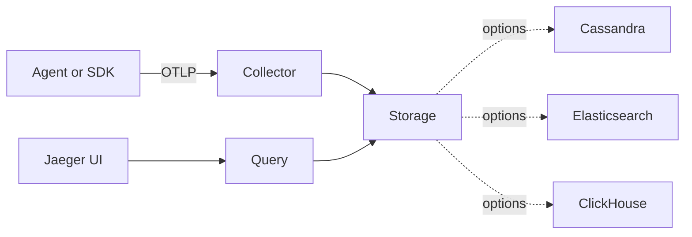
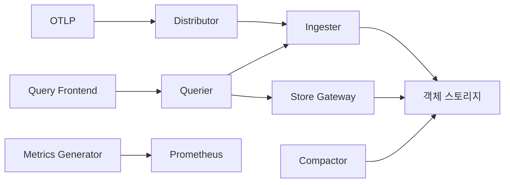
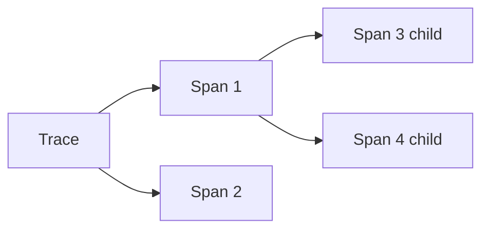
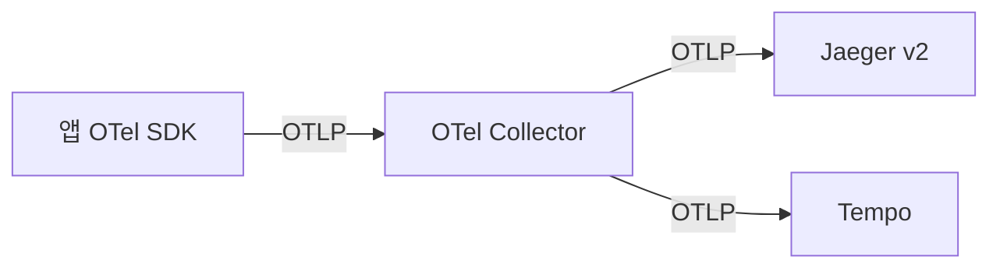
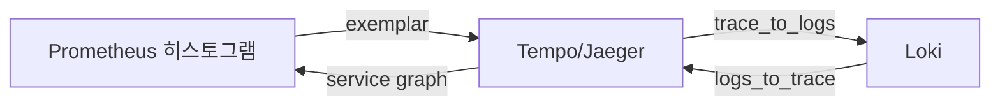
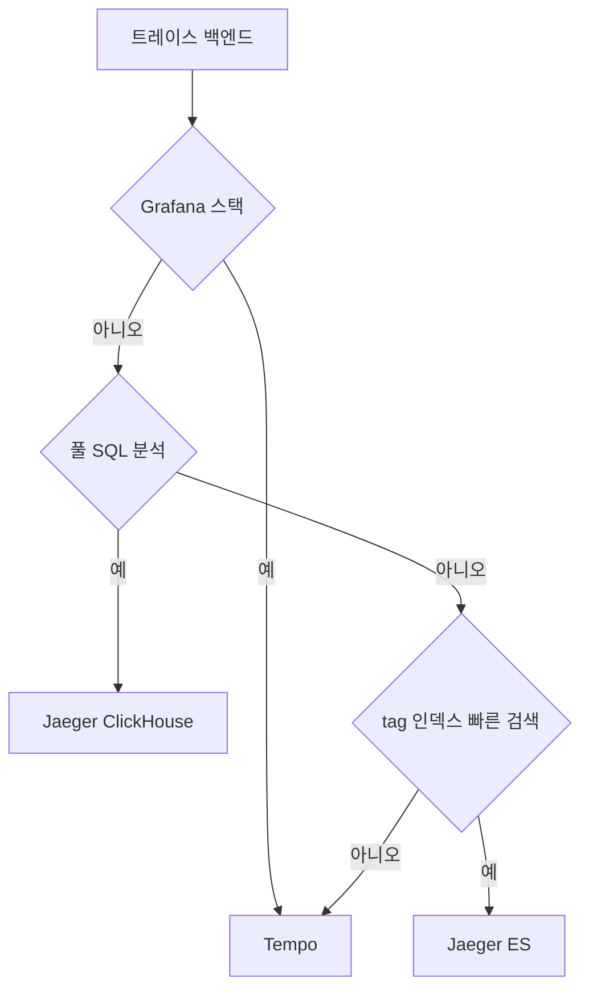

# Jaeger·Tempo

> 트레이스 백엔드 양대 산맥. 둘 다 OTLP를 받지만 **저장 모델·조회
> 모델·운영 부담**이 정반대다. Jaeger는 인덱스 기반 검색, Tempo는
> 객체 스토리지 + Parquet 컬럼 검색. 2024-11 Jaeger v2가 OTel을 코어로
> 흡수하며 두 프로젝트가 다시 가까워졌다.

- **주제 경계**: 이 글은 **백엔드 비교·아키텍처·스토리지·조회 패턴**을
  다룬다. 샘플링은 [샘플링 전략](sampling-strategies.md), Collector
  파이프라인은 [OTel Collector](otel-collector.md), 컨텍스트 전파는
  [Trace Context](trace-context.md) 참조.
- **선행**: [관측성 개념](../concepts/observability-concepts.md),
  [Loki](../logging/loki.md) (라벨 모델 비교).

---

## 1. 한 줄 비교

| 축 | Jaeger v2 | Tempo |
|---|---|---|
| 인덱스 | trace_id + service·operation 인덱스 | **trace_id 만** |
| 검색 | service·operation·tag 인덱스 검색 | **TraceQL** (Parquet 컬럼 스캔) |
| 저장소 | Cassandra·ES·**ClickHouse**·Memory | **객체 스토리지** (S3·GCS·Azure) |
| 조회 비용 | 메타 인덱스 빠름 | 스캔 기반, query frontend가 분산 |
| 운영 부담 | 인덱스 클러스터 운영 | 객체 스토리지만 |
| OTel | **v2 코어가 OTel Collector** | 처음부터 OTel 네이티브 |
| 메트릭 생성 | 별도 (`spanmetrics` connector) | **메트릭 생성기 내장** |
| 시각화 | Jaeger UI / Grafana | Grafana 1급 |

> **한 줄 결론**: 인덱스 기반 빠른 ad-hoc 검색이 본질이면 **Jaeger
> (특히 ClickHouse)**, 객체 스토리지로 대규모·저비용 보관 + Grafana
> 통합이면 **Tempo**.

---

## 2. Jaeger v2 — 2024-11 OTel 흡수

| 시기 | 사건 |
|---|---|
| 2017 | Uber에서 시작, CNCF 합류 |
| 2019 | CNCF Graduated |
| **2024-11** | **v2 릴리스** — OTel Collector를 코어로 |
| **2025-12** | v1 마지막 릴리스 |
| **2026-01** | **v1 deprecated** |

### 2.1 v2가 v1과 다른 점

- **OTel Collector 위에 빌드**. Jaeger v2 = OTel Collector + Jaeger 전용
  receiver/exporter/processor.
- **OTLP 네이티브**. Jaeger 자체 protobuf로의 변환 단계 제거.
- 설정·배포 모델이 OTel Collector와 동일.
- **Storage v2 인터페이스** — OTel 데이터 모델을 그대로 저장.
- **ClickHouse 공식 백엔드** 진행 중 (2026 안정화).

### 2.2 컴포넌트



| 컴포넌트 | 역할 |
|---|---|
| **Collector** | OTLP 수신, 처리, 저장 |
| **Query** | UI·API 백엔드, 조회 평가 |
| **Storage** | trace 영속화 |
| **Ingester** (Kafka 옵션) | Kafka에서 trace를 소비해 Storage로 |
| **Agent** (v1) | **deprecated**, OTel Collector 또는 sidecar로 |

### 2.3 스토리지 옵션

| 백엔드 | 위치 | 적합 |
|---|---|---|
| **Memory** | 단일 인스턴스 | dev·테스트 |
| **Cassandra** | 분산 KV | 전통적 prod, 운영 부담↑ |
| **Elasticsearch / OpenSearch** | 풀텍스트 인덱스 | tag 검색 강함 |
| **ClickHouse** | 컬럼 OLAP | **2026 권장 prod**, 분석 강력 |
| **Kafka** | 버스 (ingester) | 폭증 흡수, 다중 백엔드 fan-out |
| Badger | 임베디드 | 단일 노드 |

> **2026 권장**: 신규 prod는 **Jaeger v2 + ClickHouse**. Cassandra는
> 운영 학습 비용이 높고, ES는 풀텍스트가 본질이 아니면 과도. ClickHouse는
> 트레이스 분석(JOIN·집계)까지 가능하다는 차별 가치.

---

## 3. Grafana Tempo — 객체 스토리지 1급

### 3.1 핵심 베팅

- **인덱스 없음** (trace_id만). 모든 조회는 객체 스토리지 + Parquet 스캔.
- **저비용·고확장**. S3·GCS·Azure Blob에 직접.
- **TraceQL** — 컬럼 스캔 기반 풀 표현력 쿼리.
- **메트릭 생성기 내장** — RED·service graph 자동.

### 3.2 컴포넌트



| 컴포넌트 | 역할 |
|---|---|
| **Distributor** | OTLP 수신, ingester ring 라우팅 |
| **Ingester** | 메모리에 trace 누적, Parquet 블록 flush |
| **Querier** | TraceQL 평가, ingester + store-gateway 결합 |
| **Store Gateway** | 객체 스토리지 블록 로딩 |
| **Query Frontend** | 쿼리 분할·병렬·캐시 |
| **Compactor** | 블록 병합·dedup·retention |
| **Metrics Generator** | trace에서 RED·service graph 메트릭 생성 |

> Loki·Mimir와 **컴포넌트 모양이 같다**. Grafana Labs는 세 백엔드의
> 운영 모델을 의도적으로 일치시켜 같은 노하우가 전이된다.

### 3.3 vParquet 블록 포맷

| 버전 | 시점 | 핵심 |
|---|---|---|
| v2 | 2022 | 자체 포맷, 검색 ~40~50 GB/s |
| **vParquet4** | 2024+, **2026 기본** | 컬럼 스캔, **300 GB/s**, array·event·link 컬럼 |

블록 디렉터리:
```
<bucket>/<tenant>/<blockID>/
  meta.json
  index
  data.parquet   ← 컬럼 저장
  bloom_0..N
```

> **운영 의미**: Parquet 채택으로 검색이 한 자릿수 빨라졌고 분석성도
> 얻었다. 단 v2 → vParquet 마이그레이션은 일회성 재인덱싱 비용 발생.

### 3.4 메트릭 생성기 (built-in)

trace 흐름에서 **RED + service graph**를 자동 생성해 Prometheus·Mimir에
remote_write. 별도 OTel `spanmetrics` connector 없이 트레이스만 보내면
대시보드용 메트릭이 즉시 생성된다.

| 프로세서 | 결과 |
|---|---|
| `service_graphs` | service A → B 호출 그래프, RED |
| `span_metrics` | span별 count·duration histogram |
| `local_blocks` | TraceQL metrics queries (Prometheus 미경유) |

> **카디널리티 함정**: `span.http.url`·`peer.service`·`db.statement`
> 같은 고카디널리티 attribute를 그대로 `dimensions`에 넣으면 Mimir로
> 들어가는 시계열이 폭발한다. 반드시 필요한 경우:
> - `dimensions`는 **service·operation·status_code·http.method**
>   수준에서 cap
> - `metrics_ingestion_time_range_slack`으로 지연 이벤트 제한
> - Mimir 측 `max_series_per_user` per-tenant 한도로 2차 방어

---

## 4. 데이터 모델 — span의 구조

OTel 표준이 둘에 공통 적용된다.



| 요소 | 의미 |
|---|---|
| TraceId | 16바이트, 트레이스 식별 |
| SpanId | 8바이트, 작업 단위 |
| ParentSpanId | 부모 span |
| Name | 작업 이름 |
| StartTime·EndTime | 시간 범위 |
| Status | OK/ERROR/UNSET |
| Kind | SERVER/CLIENT/INTERNAL/PRODUCER/CONSUMER |
| Attributes | key-value 메타 (OTel SemConv) |
| Events | span 내 시점 이벤트 (로그 임베딩) |
| Links | 다른 trace로의 연결 |

자세한 trace context 전파는 [Trace Context](trace-context.md) 참조.

---

## 5. 조회 모델 — 핵심 차이

### 5.1 Jaeger — 인덱스 기반

```text
Service: checkout
Operation: POST /pay
Tag: error=true
Min Duration: 500ms
Lookback: 1h
```

UI 폼 또는 API로 service·operation·tag 인덱스를 hit한 후 trace_id 목록
반환. ClickHouse 백엔드면 SQL로 풀 분석 가능 — 하지만 표준 UI는 인덱스
검색 모델이다.

### 5.2 Tempo — TraceQL

스팬 컬럼 위에서 평가하는 표현 언어. SQL과 PromQL의 중간.

```traceql
# 1) 단순 매칭
{ resource.service.name = "checkout" && status = error }

# 2) 시간·조건 결합
{ resource.service.name = "checkout" && duration > 500ms }

# 3) trace 단위 집계
{ status = error } | count() > 5

# 4) 메트릭 (TraceQL Metrics)
{ resource.service.name = "checkout" } | rate() by (span.http.method)
```

| 특징 | 설명 |
|---|---|
| span 매칭 → trace 그룹 | `{...}`로 span 필터, `\|`로 trace 단위 집계 |
| 컬럼 스캔 기반 | 인덱스 없이 Parquet에서 즉시 평가 |
| TraceQL Metrics | trace를 메트릭으로 (RED 사후 분석) |

### 5.3 어느 쪽이 빠른가

- **trace_id 단건 조회**: 둘 다 빠름.
  - Jaeger: service·operation 인덱스를 거치지 않고 trace_id 직조회 path
  - Tempo: **bloom filter로 블록 프루닝** → 후보 블록만 fetch. 인덱스가
    없어도 단건은 ms~sub-sec.
- **service·operation 메타 검색**: Jaeger 인덱스 압도적.
- **임의 attribute 검색**: Tempo TraceQL이 자연스러움 (Jaeger는 인덱싱된
  tag만). 단 Tempo search-by-tag에는 `max_duration`·`search.max_result_limit`
  ·스캔 블록 수 한도가 있어 **지나치게 넓은 lookback은 거부**된다.
- **trace 단위 집계 (TraceQL Metrics, Tempo 2.4+)**: Tempo만 가능.
- **수십억 span 분석**: ClickHouse 백엔드 Jaeger가 SQL로 강력. 단 2026-04
  시점 Jaeger v2의 ClickHouse 백엔드는 **alpha→beta 진행 중**, prod 채택
  전 릴리스 노트 확인.

---

## 6. 비용 — 모델 차이

가정: 100k span/s 평균, 1주 보관, 기본 샘플링 1%.

| 항목 | Jaeger + Cassandra | Jaeger + ClickHouse | Tempo + S3 |
|---|---|---|---|
| 저장 비용 | SSD × 노드 | SSD × 노드 (압축↑) | **S3 표준** |
| 컴퓨트 | DB 노드 상시 | DB 노드 상시 | querier 쿼리 시 burst |
| 운영 부담 | DB 운영 | DB 운영 | 객체 스토리지만 |
| 분석 능력 | tag 인덱스 한정 | **SQL 풀** | TraceQL |

> **자릿수**: Tempo + S3가 보통 5~10× 저렴. 단 풀 인덱스 검색이
> 본질이거나 SQL 분석이 필요하면 ClickHouse 백엔드 Jaeger가 답.

---

## 7. 운영 — HA·확장

### 7.1 Tempo HA·WAL

- ingester `replication_factor: 3` (RF=3 권장)
- **WAL**: ingester가 메모리 누적 전 `wal_path` 디스크에 쓴다. 재시작
  시 WAL replay로 미flush 데이터 복구. StatefulSet + PVC 필수.
- distributor stateless, hash ring으로 ingester 라우팅
- store-gateway는 캐시·shard, 인덱스 캐시(Memcached) 권장
- compactor는 **Loki·Mimir와 동일하게 단일 인스턴스 모델**
- 객체 스토리지 versioning + lifecycle로 retention

### 7.2 Multi-region DR

| 시나리오 | 대책 |
|---|---|
| 단일 리전 내 AZ 장애 | RF=3 (AZ 분산) + WAL |
| 리전 전체 장애 | 객체 스토리지 **cross-region replication** 사전 구성 |
| Ingester 전체 동시 롤아웃 | PDB + `flush_on_shutdown`, WAL 보존 |
| 쿼리 측 리전 이중화 | active-passive: replica 리전에 querier·store-gateway 상시 |
| RPO/RTO 목표 | RPO ≤ 15m (cross-region replication lag), RTO ≤ 1h (querier 부팅) |

> **dual-write 토폴로지**: 두 리전에 OTel Collector exporter를 동시
> fan-out하면 RPO≈0. 단 인입 비용 2배. 대부분은 객체 스토리지 replication
> 으로 충분.

### 7.3 Jaeger HA

| 백엔드 | HA |
|---|---|
| Cassandra | RF=3 권장, 다중 DC 가능 |
| Elasticsearch | replica ≥ 1, ILM tier |
| ClickHouse | 분산 테이블 + ZooKeeper/Keeper 합의 |
| Kafka 버스 | 인입 폭증 흡수, ingester 별도 |

### 7.4 멀티 테넌시

| 도구 | 메커니즘 |
|---|---|
| **Tempo** | `X-Scope-OrgID` 헤더 (Loki·Mimir와 동일) |
| **Jaeger v2** | tenant header 옵션 (백엔드별 구현) |
| **Grafana Enterprise Traces** | 정책 기반, audit log |

---

## 8. OTel Collector·SDK 통합

### 8.1 수신 경로 (둘 다 OTLP)



- 앱은 OTel SDK로 계측 → OTLP 출력
- Collector에서 변환·샘플링·라우팅
- 백엔드는 OTLP 수신만 신경

### 8.2 Jaeger SDK는 수명 종료

- Jaeger 자체 SDK·Agent는 **deprecated**
- 신규 계측은 **OTel SDK + auto-instrumentation** 표준
- Jaeger UI만 유지 (트레이스 백엔드의 시각화)

### 8.3 OTel Collector → Tempo 표준 설정

```yaml
exporters:
  otlp/tempo:
    endpoint: tempo-distributor:4317
    tls: { insecure: false }

processors:
  batch:
  tail_sampling:
    policies:
      - { name: errors, type: status_code, status_code: { status_codes: [ERROR] } }

service:
  pipelines:
    traces:
      receivers: [otlp]
      processors: [batch, tail_sampling]
      exporters: [otlp/tempo]
```

샘플링 정책은 [샘플링 전략](sampling-strategies.md) 참조.

---

## 9. Exemplar — 메트릭·로그·트레이스 양방향

트레이스 백엔드는 단독으론 가치 절반. **exemplar**가 메트릭 히스토그램
버킷에 `trace_id`를 붙이면 세 신호가 하나로 묶인다.



| 방향 | 구현 |
|---|---|
| 메트릭 → 트레이스 | OTel histogram이 `Exemplars` 필드에 `trace_id` 포함. Prometheus 2.46+ 저장, Grafana 패널에서 점으로 표시 |
| 트레이스 → 로그 | Grafana data source `tracesToLogs`: `resource.service.name`·`trace_id`로 Loki 쿼리 생성 |
| 로그 → 트레이스 | Loki structured metadata의 `trace_id`를 Grafana data link로 Tempo 쿼리 |
| 트레이스 → 메트릭 | 메트릭 생성기가 RED를 Mimir에 push, span 클릭 시 해당 service의 RED 대시보드 이동 |

> **trace-to-logs 트레이드오프**: `filterByTraceID: true`(기본)는 Loki에
> `|= "<trace_id>"` grep을 수행 — 라벨이 좁지 않으면 scan 비용↑. 대신
> structured metadata `trace_id` 매핑을 해두면 블룸 필터로 가속된다.

---

## 10. UI — Jaeger UI vs Grafana Explore

| 기능 | Jaeger UI | Grafana Explore (Tempo) |
|---|---|---|
| trace 시각화 | timeline·flame graph | timeline·node graph |
| service 의존성 | service map | **service graph** (메트릭 생성기) |
| 비교 | trace diff | TraceQL `compare` |
| 메트릭 연결 | 없음 | **exemplar → trace 1-click** |
| 로그 연결 | 별도 | **Loki link 1-click** |
| 다중 신호 통합 | 약함 | **풀스택** (logs/metrics/traces/profiles) |

> **2026 통합 트렌드**: Jaeger v2도 Grafana 데이터소스로 잘 동작한다.
> Jaeger UI 자체보다 **Grafana 통합**이 운영 가치를 만든다.

---

## 11. 결정 트리



| 상황 | 추천 |
|---|---|
| Grafana + Loki·Mimir 사용 | **Tempo** |
| K8s + 매니지드 객체 스토리지 | **Tempo** |
| 풀 SQL 분석·trace 데이터로 BI | **Jaeger + ClickHouse** |
| tag 기반 ad-hoc 검색이 본질 | **Jaeger + ES** |
| Cassandra 자산 유지 | Jaeger + Cassandra (단, 신규 비추천) |

---

## 12. 운영 체크리스트

### 11.1 Tempo

- [ ] RF=3 ingester, StatefulSet + PVC
- [ ] Query Frontend 필수 (split·캐시)
- [ ] Memcached 캐시 (Loki·Mimir와 동일 가이드)
- [ ] Compactor 1 인스턴스, retention 룰
- [ ] 객체 스토리지 versioning + lifecycle
- [ ] TraceQL Metrics·Span Metrics 활성화 검토
- [ ] 메트릭 생성기 → Mimir remote_write

### 11.2 Jaeger v2

- [ ] OTLP 수신만 사용 (Jaeger Agent·legacy thrift 제거)
- [ ] ClickHouse 신규 권장, 기존 Cassandra/ES는 마이그레이션 계획
- [ ] Kafka 버스 옵션 (인입 폭증·다중 백엔드)
- [ ] v1 EOL(2026-01) 이후 자산은 v2로 이전
- [ ] OTel Collector와 동일한 운영 모델 채택

### 11.3 공통

- [ ] OTel SDK 자동 계측 + 수동 보강
- [ ] tail sampling을 **OTel Collector에서** 수행 ([샘플링 전략](sampling-strategies.md))
- [ ] trace_id를 로그에 주입 ([로그 운영 정책](../logging/log-operations.md#9-관측성과-상관관계))
- [ ] exemplar로 메트릭 → 트레이스 연결
- [ ] 메타-모니터링 (자체 클러스터 별도)

---

## 13. 안티패턴

| 안티패턴 | 결과 | 교정 |
|---|---|---|
| Jaeger v1 신규 도입 | 2026-01 EOL | **v2** 또는 Tempo |
| Jaeger Agent 신규 도입 | deprecated | OTel Collector |
| Tempo에 100% 샘플링 | 객체 스토리지 비용 폭발 | tail sampling, ERROR 100% + 5% probabilistic |
| Tempo 인덱스로 검색 시도 | 인덱스 없음 → 풀 스캔 | TraceQL로 적절히 좁히기, lookback 짧게 |
| trace_id를 로그·메트릭에 안 넣음 | 단편화된 관측 | log bridge + exemplar 필수 |
| Jaeger UI를 메인 시각화 | 다중 신호 통합 약함 | Grafana 통합 |
| 메트릭 생성기 미사용 (Tempo) | RED 메트릭 부재 | 메트릭 생성기 활성 |

---

## 14. 마이그레이션 — Jaeger → Tempo (그 반대)

### 13.1 Jaeger → Tempo

- 둘 다 **OTLP 수신** → OTel Collector exporter만 교체
- dual-write로 검증 기간 운영, 대시보드를 Grafana로 전환
- TraceQL로 기존 Jaeger 검색 use case 재작성
- 과거 trace 마이그레이션은 보통 **포기** (보존 기간 짧음)

### 13.2 Tempo → Jaeger

- TraceQL → Jaeger 인덱스 검색 모델 차이
- Grafana 통합 효과 손실
- 보통은 **반대 방향이 일반적**

---

## 참고 자료

- [Jaeger v2 Released — OpenTelemetry in Core](https://www.cncf.io/blog/2024/11/12/jaeger-v2-released-opentelemetry-in-the-core/) (확인 2026-04-25)
- [Jaeger Roadmap](https://www.jaegertracing.io/roadmap/) (확인 2026-04-25)
- [Jaeger Storage Backends](https://www.jaegertracing.io/docs/2.dev/storage/) (확인 2026-04-25)
- [Tempo Architecture](https://grafana.com/docs/tempo/latest/introduction/architecture/) (확인 2026-04-25)
- [Tempo Apache Parquet block format](https://grafana.com/docs/tempo/latest/configuration/parquet/) (확인 2026-04-25)
- [Tempo Metrics Generator](https://grafana.com/docs/tempo/latest/metrics-from-traces/metrics-generator/) (확인 2026-04-25)
- [TraceQL Language](https://grafana.com/docs/tempo/latest/traceql/) (확인 2026-04-25)
- [Tempo 2.0 Release — TraceQL & Parquet](https://grafana.com/blog/2023/02/01/new-in-grafana-tempo-2.0-apache-parquet-as-the-default-storage-format-support-for-traceql/) (확인 2026-04-25)
- [Best Practices Migration Jaeger to Tempo](https://developers.redhat.com/articles/2025/04/09/best-practices-migration-jaeger-tempo) (확인 2026-04-25)
- [Jaeger ClickHouse Design Decisions](https://medium.com/jaegertracing/making-design-decisions-for-clickhouse-as-a-core-storage-backend-in-jaeger-62bf90a979d) (확인 2026-04-25)
