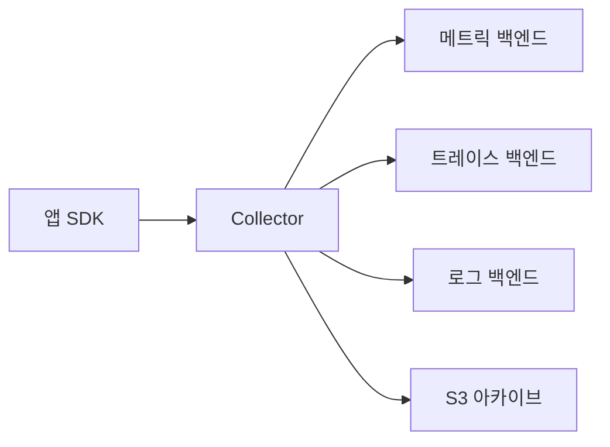
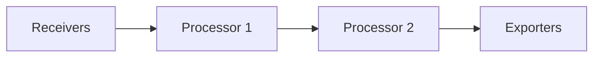
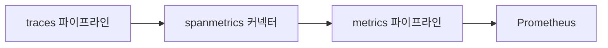
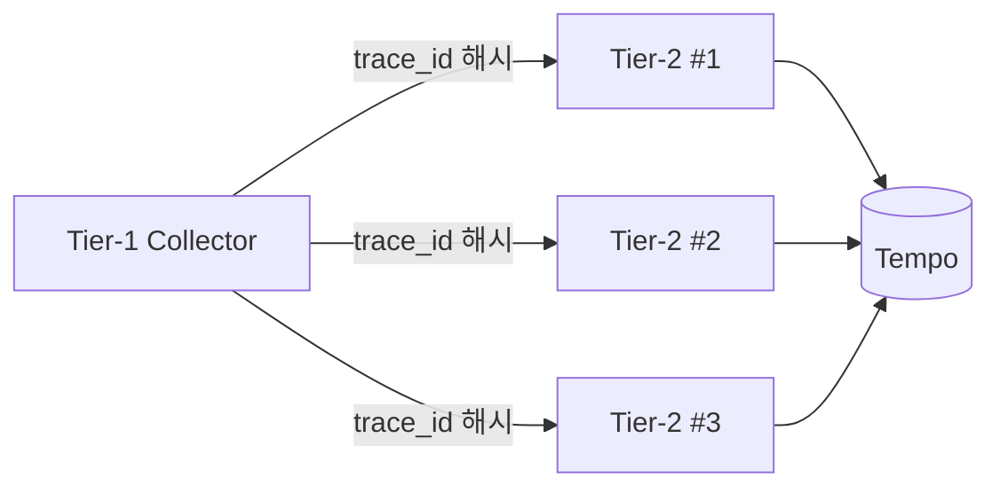
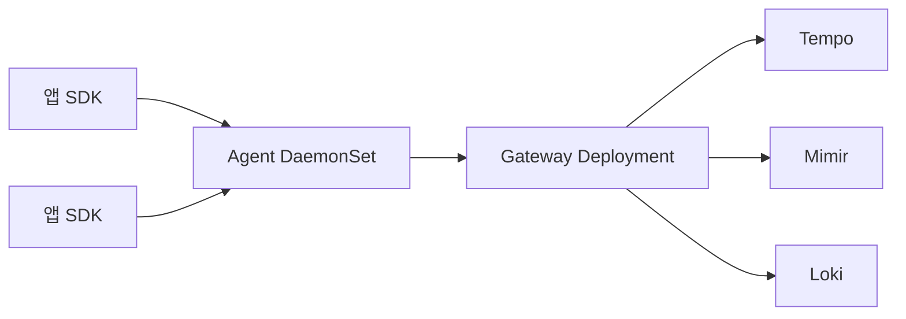

# OTel Collector

> 텔레메트리 파이프라인의 **벤더 중립 표준**. SDK가 만든 신호를
> Collector가 받아 가공·라우팅·내보낸다. 핵심은 네 가지: **receiver →
> processor → exporter** 직선 + **connector**로 파이프라인을 잇는다.
> 운영의 90%는 `memory_limiter` · `batch` · `tail_sampling` · OTTL 네
> 처리기에 달려 있다.

- **주제 경계**: 이 글은 **Collector의 파이프라인 모델·핵심 처리기·배포
  토폴로지**를 다룬다. 백엔드 비교는 [Jaeger·Tempo](jaeger-tempo.md),
  샘플링 알고리즘은 [샘플링 전략](sampling-strategies.md), 컨텍스트
  전파 규격은 [Trace Context](trace-context.md), 로그 파이프라인 비교는
  [로그 파이프라인](../logging/log-pipeline.md), Prometheus 상호 운용은
  [Prometheus·OpenTelemetry](../cloud-native/prometheus-opentelemetry.md)
  참조.
- **선행**: [관측성 개념](../concepts/observability-concepts.md),
  [Semantic Conventions](../concepts/semantic-conventions.md).

---

## 1. 왜 Collector를 둬야 하나



| 이유 | 설명 |
|---|---|
| 벤더 분리 | SDK는 OTLP만, 백엔드 교체는 Collector 설정만 변경 |
| 오프로딩 | 샘플링·필터·Redaction을 앱이 아닌 Collector가 |
| 버퍼링 | 백엔드 장애를 흡수, 앱은 영향 없음 |
| Fan-out | 같은 신호를 여러 백엔드에 동시 전송 |
| 인증·전송 | mTLS·압축·재시도를 한곳에서 통제 |
| 메타데이터 보강 | k8s·cloud 리소스 attribute 자동 부여 |

> **앱에 직접 백엔드 SDK를 꽂지 말 것.** 대규모에서 가장 흔히 후회하는
> 결정. Collector는 "텔레메트리의 nginx" 라고 보면 된다.

---

## 2. 두 배포 — `core` vs `contrib`

| 배포 | 포함 | 용도 |
|---|---|---|
| **opentelemetry-collector** (core) | OTLP·batch·memory_limiter 등 핵심만 | 안정성 우선, 사이드카 |
| **opentelemetry-collector-contrib** | core + 200+ 컴포넌트 (tail sampling, k8sattributes, prometheus, kafka 등) | **사실상 기본**, 게이트웨이 |
| **OpenTelemetry Collector Builder** (`ocb`) | 커스텀 빌드 도구 | 필요한 컴포넌트만 골라 슬림 빌드 |

> 2026-04 기준 Collector 코어는 **`v1.x`+contrib `v0.150.x`** 동행 릴리스.
> 코어 모듈(pdata·featuregate·OTLP receiver/exporter)은 `v1` 안정,
> contrib 컴포넌트는 컴포넌트별 stability 등급(stable/beta/alpha/development)
> 으로 관리된다. 신규 도입 시 컴포넌트 README의 stability 표 확인 필수.

> **신호별 OTLP 안정성 (2026-04)**: traces·metrics·logs는 **stable**,
> profiles는 **development** 단계. profiles 파이프라인은 prod 도입 전
> 컴포넌트 등급을 다시 확인할 것 ([연속 프로파일링](../profiling/continuous-profiling.md)).

---

## 3. 파이프라인 모델 — 한 줄 정의



> 한 줄: **Receiver는 받는다, Processor는 다듬는다, Exporter는 보낸다,
> Connector는 잇는다, Extension은 곁가지로 돕는다.**

### 3.1 다섯 컴포넌트

| 컴포넌트 | 역할 | 예 |
|---|---|---|
| **Receiver** | 텔레메트리 수신·스크레이프 | `otlp`, `prometheus`, `filelog`, `kafka`, `jaeger` |
| **Processor** | 파이프라인 내 변환·필터·샘플링 | `batch`, `memory_limiter`, `tail_sampling`, `transform`, `filter`, `attributes`, `k8sattributes` |
| **Exporter** | 백엔드 전송 | `otlp`, `otlphttp`, `prometheusremotewrite`, `loadbalancing`, `kafka`, `clickhouse` |
| **Connector** | 한 파이프라인의 출력 → 다른 파이프라인의 입력 | `spanmetrics`, `forward`, `routing`, `count`, `exceptions` |
| **Extension** | 신호와 무관한 부속 (헬스체크·인증·스토리지) | `health_check`, `pprof`, `zpages`, `oauth2client`, `file_storage` |

### 3.2 파이프라인 = 신호 × (R, [P], E)

`service.pipelines`에서 **신호별로** 파이프라인을 선언한다.

```yaml
service:
  pipelines:
    traces:
      receivers: [otlp]
      processors: [memory_limiter, k8sattributes, tail_sampling, batch]
      exporters: [otlp/tempo]
    metrics:
      receivers: [otlp, prometheus]
      processors: [memory_limiter, batch]
      exporters: [prometheusremotewrite/mimir]
    logs:
      receivers: [otlp, filelog]
      processors: [memory_limiter, transform/redact, batch]
      exporters: [otlp/loki]
```

규칙:

- 같은 신호 안에서 **여러 파이프라인** 선언 가능 (`traces/main`, `traces/audit`)
- **하나의 receiver를 여러 파이프라인이 공유** 가능 (fan-out)
- 데이터는 **모든 exporter에 복제** (각 exporter는 독립 사본 수신)
- processor 순서는 **선언 순서 그대로 적용**

---

## 4. Receiver — 입구

| Receiver | 신호 | 메모 |
|---|---|---|
| `otlp` | 모두 | 단일 receiver가 gRPC(4317)·HTTP(4318) 두 protocol 동시 지원. **권장 기본** |
| `prometheus` | 메트릭 | scrape 모델, Prometheus relabel 호환 |
| `filelog` | 로그 | 파일 tail. multiline, k8s 컨테이너 로그 파싱 |
| `kafka` | 모두 | 큐 입구, 백프레셔·재처리 |
| `jaeger` | 트레이스 | legacy thrift·gRPC, 마이그레이션용 |
| `zipkin` | 트레이스 | 마이그레이션용 |
| `hostmetrics` | 메트릭 | CPU·메모리·디스크·네트워크 호스트 메트릭 |
| `k8s_cluster` | 메트릭 | k8s API 기반 클러스터 메트릭 |
| `k8s_events` | 로그 | k8s 이벤트를 로그로 |
| `kubeletstats` | 메트릭 | Kubelet `/stats/summary` |

> **OTLP 수신 표준 포트**: gRPC `4317`, HTTP `4318`. 사이드카·DaemonSet
> 어디서든 동일.

> **이름 변경 주의**: contrib `v0.150.x`에서 `filelog`이 `file_log`로
> 리네임 진행 중(별칭 호환). 신규 설정은 새 이름 권장, 자동화 도구가
> deprecated alias 경고를 띄움.

---

## 5. Processor — 핵심 4종

운영의 90%는 이 4종에 달려 있다.

### 5.1 `memory_limiter` — 첫 번째 처리기

**파이프라인 첫 자리**(receiver 직후)에 둔다. 이유는 단순하다 —
`batch`가 내부에 누적한 데이터는 **memory_limiter의 시야 밖**이라
`batch` 뒤에 두면 거대한 배치가 GC 압력을 주고도 reject되지 않는다.
첫 자리에 두지 않으면 OOM Kill.

```yaml
processors:
  memory_limiter:
    check_interval: 1s
    limit_mib: 1500     # 컨테이너 limit의 ~75%
    spike_limit_mib: 400  # limit의 ~20~25%
```

| 동작 | 설명 |
|---|---|
| Soft limit (`limit - spike`) 초과 | 새 요청에 `RefusedError` 반환, GC 강제 트리거 |
| Hard limit (`limit`) 초과 | 모든 데이터 거부, force GC 반복 |
| 회복 | 메모리 안정 시 자동으로 통과 재개 |

> **올바른 짝**: 컨테이너 `memory.limits` ↔ Go 런타임 `GOMEMLIMIT`(80%)
> ↔ `memory_limiter.limit_mib`(75%) **3중 방어**. Go 런타임은 GOMEMLIMIT
> 으로 GC pacing을 조정하고, memory_limiter는 입구에서 reject한다.

> **모니터링 메트릭**: `otelcol_processor_refused_spans` /
> `otelcol_processor_refused_metric_points` / `otelcol_processor_refused_log_records`.
> 거부가 자주 발생하면 → 스케일 아웃 또는 batch·tail_sampling 튜닝.

### 5.2 `batch` — 마지막에서 두 번째

**파이프라인 끝부분, exporter 직전**에 둔다.

```yaml
processors:
  batch:
    timeout: 200ms
    send_batch_size: 8192
    send_batch_max_size: 10000
```

| 파라미터 | 의미 | 디폴트·권장 |
|---|---|---|
| `timeout` | 강제 flush 주기 | 200ms (지연 vs 처리량) |
| `send_batch_size` | 트리거 임계 | 8192 (item 수) |
| `send_batch_max_size` | 단일 배치 상한 | 10000 (백엔드 보호) |

> **신호별 분리 권장**: 트레이스는 짧은 timeout, 로그·메트릭은 큰 배치가
> 유리. `batch/traces`·`batch/logs`처럼 named instance로 분리.

> **튜닝 신호**: `otelcol_processor_batch_batch_send_size`로 분포를 본다.
> 대다수 배치가 `send_batch_size`가 아닌 `timeout`으로 flush되면 →
> timeout 늘리거나 batch_size 줄이기.

> **메모리 안전망 함정**: `memory_limiter`는 batch가 누적한 메모리를
> 보지 못한다. `send_batch_max_size`를 너무 크게 잡으면 단일 배치 자체가
> 메모리 한도를 넘는다. 실전 가이드: `send_batch_max_size`는 한 항목당
> ~1KB(span) 가정 시 **메모리 limit의 1~2% 수준**으로. 그리고 exporter
> `sending_queue.queue_size × 평균 배치 크기`가 메모리 예산 안에 들어와야
> 한다.

### 5.3 `tail_sampling` — 트레이스 완성 후 결정

**Stateful 처리기**. 같은 trace의 모든 span이 같은 인스턴스에 모여야
한다. **단일 Collector**(샤딩 없음)에서는 그대로 동작하지만,
**tail_sampling 계층이 수평 확장(2개+ 인스턴스)** 되는 순간 앞단에
`loadbalancing` exporter로 trace 친화 라우팅이 필수.

```yaml
processors:
  tail_sampling:
    decision_wait: 10s
    num_traces: 100000
    expected_new_traces_per_sec: 10000
    decision_cache:
      sampled_cache_size: 100000
      non_sampled_cache_size: 100000
    policies:
      - { name: errors, type: status_code,
          status_code: { status_codes: [ERROR] } }
      - { name: slow, type: latency,
          latency: { threshold_ms: 1000 } }
      - { name: rate, type: probabilistic,
          probabilistic: { sampling_percentage: 5 } }
```

| 키 | 의미 |
|---|---|
| `decision_wait` | trace의 마지막 span을 기다리는 시간 (보통 5~30s) |
| `num_traces` | 메모리에 동시 보관할 trace 수 |
| `expected_new_traces_per_sec` | 초기 메모리 할당 힌트 |
| `decision_cache` | 결정된 trace_id를 캐시해 **late-arriving span**에 동일 결정 적용. 미설정 시 늦게 도착한 span은 새 trace로 오인되어 메모리 폭주 |
| `policies` | 순서 무관, 하나라도 keep이면 keep |

세부 정책 종류·트레이드오프는 [샘플링 전략](sampling-strategies.md#5-tail-sampling-collector가-결정) 참조.

### 5.4 `transform` / `filter` (OTTL) — 데이터 가공의 메인 도구

OTTL = **OpenTelemetry Transformation Language**. 파이프라인 안에서
attribute 추가·수정·삭제·조건부 drop을 표현하는 미니 DSL.

```yaml
processors:
  transform/redact:
    log_statements:
      - context: log
        statements:
          - replace_pattern(body, "\\d{16}", "****-****-****-****")
          - delete_key(attributes, "auth.token")

  filter/healthcheck:
    traces:
      span:
        - 'attributes["http.target"] == "/healthz"'
        - 'attributes["http.target"] == "/livez"'
```

| 처리기 | 행동 | OTTL 컨텍스트 |
|---|---|---|
| `transform` | match → mutate (attribute·body·status·name) | resource, scope, span/metric/log |
| `filter` | match → **drop** | 동일 |

> **2026 변경**: `filter` 처리기에 OTTL **context inference**가 추가
> (2026-03 릴리스). `attributes["..."]`·`body`만 적어도 컨텍스트 추론.
> `transform`은 이미 적용 완료. 결과적으로 `context: span` 생략 가능 →
> 설정 가독성 개선.

> **OTTL이 다음 표준**. legacy `attributes` processor·`span` processor는
> 점진 deprecation. 신규 설정은 OTTL 우선.

### 5.5 자주 쓰는 보조 처리기

| 처리기 | 용도 |
|---|---|
| `k8sattributes` | k8s metadata (`pod.name`·`namespace`·`node.name`·labels) 자동 부여. DaemonSet 노드 모드는 `passthrough: true`로 두면 sidecar가 미리 부여한 attribute를 보존 |
| `resourcedetection` | cloud(AWS·GCP·Azure)·host·process resource 자동 감지 |
| `attributes` | (legacy) attribute 단순 조작 — 신규는 transform |
| `groupbyattrs` | 같은 attribute로 묶어 batch 효율↑ |
| `probabilistic_sampler` | trace·log·metric 모두 적용. Collector 단계에서 적용 시 **trace_id 기반 consistent sampling**으로 부모-자식 결정 일관성 유지 |
| `redaction` | 정해진 정규식·키로 PII mask |
| `cumulativetodelta` / `deltatocumulative` | 메트릭 temporality 변환 |

---

## 6. Connector — 파이프라인 잇기

Connector는 **한 파이프라인의 exporter 자리에 들어가고, 다른 파이프라인
의 receiver 자리에 들어가는** 동일 인스턴스. 두 파이프라인을 잇는다.



| Connector | 효과 |
|---|---|
| `spanmetrics` | trace → RED 메트릭 (count·duration histogram·error rate) |
| `forward` | 동일 신호 파이프라인 분기·재합류 |
| `routing` | 조건(`resource.attributes["env"]`)으로 서로 다른 파이프라인 라우팅 |
| `count` | 신호 발생 횟수를 메트릭으로 |
| `exceptions` | span event `exception`을 별도 파이프라인으로 |
| `servicegraph` | Tempo와 동일한 service graph 생성 |
| `failover` | 1차 exporter 실패 시 2차로 |

> **`spanmetrics` connector는 `spanmetrics` processor의 후속**. Processor
> 버전은 deprecated. 신규는 connector 사용.

### 6.1 샘플링 + 메트릭 — 흔한 함정

**RED 메트릭은 원칙적으로 100% 트래픽에서 도출**한다. 샘플링 후
spanmetrics를 돌리면 시계열이 샘플링 비율만큼 축소돼 트래픽을 과소
보고한다.

```yaml
service:
  pipelines:
    # 1) 100% 트래픽 → spanmetrics (RED 메트릭)
    traces/in:
      receivers: [otlp]
      processors: [memory_limiter, batch]
      exporters: [spanmetrics, forward/tosample]

    # 2) forward로 받아 tail sampling 적용
    traces/sampled:
      receivers: [forward/tosample]
      processors: [tail_sampling, batch]
      exporters: [otlp/tempo]

    # 3) spanmetrics가 만든 메트릭 출구
    metrics/red:
      receivers: [spanmetrics]
      exporters: [prometheusremotewrite/mimir]
```

> **순서가 곧 정확성**. spanmetrics → tail_sampling 순으로 두지 않으면
> 정확한 RED는 영영 얻지 못한다.

> **예외 — adjusted count**: head probabilistic sampling만 쓰는 경우
> `tracestate`의 `th:` 필드(threshold)로 보존된 sampling probability를
> spanmetrics가 역산해 시계열을 정확히 보정할 수 있다(consistent
> probability sampling). 단 tail sampling은 이 보정이 불가능 → 위 패턴이
> 여전히 안전.

### 6.2 spanmetrics 운영 함정

| 함정 | 결과 | 교정 |
|---|---|---|
| `dimensions`에 `http.url`·`http.target`·`db.statement`·`peer.service` | 시계열 폭발 | **화이트리스트** — `service.name`·`span.kind`·`status.code`·`http.method`·`http.status_code`·`http.route` 정도까지 |
| `histogram.unit` 미지정 | Tempo `service_graphs`·Grafana 대시보드 단위 충돌 | `unit: ms` 또는 `s`로 명시, 백엔드와 일치 |
| `metrics_flush_interval` 너무 짧음 | PRW 호출 폭증 | 15s~60s 권장 |
| `aggregation_temporality` cumulative만 가정 | Prometheus PRW는 cumulative, OTLP는 delta 옵션 | 백엔드가 cumulative 요구 시 명시 |
| dimensions에 cardinality cap 없음 | 한 attribute 폭주가 전체 메트릭 시계열 죽임 | Mimir `max_series_per_user` per-tenant 한도 2차 방어 |

---

## 7. Exporter — 출구

| Exporter | 대상 |
|---|---|
| `otlp` / `otlphttp` | 어떤 OTLP 호환 백엔드라도 (Tempo·Jaeger v2·Mimir·Loki·SaaS) |
| `prometheusremotewrite` | Prometheus·Mimir·VictoriaMetrics |
| `prometheus` | scrape 엔드포인트 (Pull 방식) |
| `loki` | Loki HTTP push |
| `kafka` | Kafka 토픽 (버스 토폴로지) |
| `clickhouse` | ClickHouse (트레이스·로그 분석) |
| `loadbalancing` | 다른 Collector 인스턴스로 (tail sampling 전제) |
| `file` | 디버깅·아카이브 |
| `awss3` / `googlecloudstorage` | 객체 스토리지 long-term |

### 7.1 `loadbalancing` — tail sampling의 전제



```yaml
exporters:
  loadbalancing:
    routing_key: traceID  # 같은 trace의 span은 동일 백엔드로
    resolver:
      k8s:
        service: otelcol-tier2.observability
        ports: [4317]
```

| `routing_key` | 효과 |
|---|---|
| `traceID` (기본) | tail sampling용. 같은 trace의 모든 span 동일 인스턴스 |
| `service` | spanmetrics·서비스 단위 어그리게이션. 같은 `service.name` 동일 인스턴스 |
| `metric` | 메트릭 분산. 같은 메트릭 이름 동일 인스턴스 |
| `streamID` | 메트릭 stream(이름+속성+resource) 단위 분산 — 메트릭 LB의 권장 디폴트 |
| `resource` | 같은 resource(같은 Pod·노드) 동일 인스턴스 |
| `attributes` | `routing_attributes`로 지정한 attribute로 라우팅 |

> **k8s에서는 `k8s` 리졸버가 디폴트**. DNS 리졸버는 Pod 변경 시 캐시
> 폴링 지연(수십 초) 동안 잘못된 토폴로지로 라우팅되며, k8s
> `Service`(ClusterIP)는 단일 IP라 분산이 안 된다. `k8s` 리졸버는
> EndpointSlice를 직접 watch해 즉시 반영. **RBAC 요구**: ServiceAccount에
> `endpointslices` 리소스의 `get/list/watch` 권한 부여 필수.

> **DNS 리졸버를 쓸 때**: 반드시 **headless Service**(`clusterIP: None`)
> 와 결합. ClusterIP Service에 DNS 리졸버를 붙이면 단일 IP만 풀에
> 들어와 분산이 0이다.

### 7.2 재시도·큐·백프레셔 — `sending_queue`·`retry_on_failure`

```yaml
exporters:
  otlp/tempo:
    endpoint: tempo-distributor:4317
    sending_queue:
      enabled: true
      num_consumers: 10
      queue_size: 5000
      storage: file_storage/queue   # 디스크 큐 (extension)
    retry_on_failure:
      enabled: true
      initial_interval: 5s
      max_interval: 30s
      max_elapsed_time: 5m
```

- 백엔드 장애 시 큐에 적재 → 디스크 큐(extension) 활성 시 재시작 후도 보존.
- `max_elapsed_time` 초과 시 영구 실패로 drop.
- `num_consumers`로 동시 송신 worker 수 조절.

### 7.3 그레이스풀 셧다운 — 큐 drain

롤링 업데이트·HPA 스케일다운 시 진행 중인 큐가 drain되지 않으면 데이터
손실. 다음 4가지를 묶어야 안전하다.

| 항목 | 설정 |
|---|---|
| Pod `terminationGracePeriodSeconds` | 30~60s (큐 drain 시간 + 안전 마진) |
| `preStop` lifecycle hook | `sleep 5s` 후 SIGTERM — Service에서 endpoint 제거 후 신규 트래픽 차단 |
| `sending_queue.storage` | `file_storage` extension + PVC, StatefulSet으로 노드 이동 후도 큐 보존 |
| `retry_on_failure.max_elapsed_time` | gracePeriod 보다 짧게 — drain 시간 안에 결판 |

---

## 8. Extension — 부속

| Extension | 용도 |
|---|---|
| `health_check` | k8s liveness·readiness 엔드포인트 |
| `pprof` | Go pprof 프로파일 |
| `zpages` | 내장 디버깅 UI (`/debug/tracez`, `/debug/servicez`) |
| `oauth2client` / `bearertokenauth` | exporter 인증 |
| `headers_setter` | 동적 헤더 (multi-tenant `X-Scope-OrgID`) |
| `file_storage` | sending_queue 디스크 백킹 |
| `k8s_observer` / `docker_observer` | 동적 receiver discovery |

---

## 9. 배포 토폴로지 — 두 계층 패턴



### 9.1 Agent (DaemonSet·Sidecar)

| 모드 | 적합 |
|---|---|
| **DaemonSet** | 노드당 1개. 호스트 메트릭·k8s 컨테이너 로그 수집의 표준 |
| **Sidecar** | Pod당 1개. 앱이 `localhost:4317`로 보냄, 멀티테넌트 격리 |
| **Standalone (host install)** | VM·베어메탈 |

Agent의 책임:

- 앱·노드에서 가까운 위치에서 받기
- 가벼운 가공 (resource detection, k8s attributes 추가)
- Gateway로 OTLP 전송

### 9.2 Gateway (Deployment·StatefulSet)

| 책임 | 설명 |
|---|---|
| 무거운 가공 | tail sampling, OTTL transform, redaction |
| 라우팅 | 백엔드별·테넌트별 fan-out |
| 인증·압축 | mTLS·헤더 주입 |
| 백엔드 단일화 | SaaS 인입 키·트래픽 단일점 통제 |

> **Gateway HPA**: CPU 기반은 부정확. 가장 직접적인 포화도 신호는
> `otelcol_exporter_queue_size / otelcol_exporter_queue_capacity` 비율.
> KEDA `prometheus` scaler로 0.7 임계값 권장. 보조 신호로
> `otelcol_processor_refused_*`, `otelcol_exporter_send_failed_*` 활용.

> **tail sampling은 Gateway만**. Agent에 두면 trace span이 분산돼
> 결정이 깨진다. Tier-2 (tail sampling 전용 계층)로 분리하면 더 깔끔.

### 9.3 Operator — k8s 자동 운영

OTel Operator가 다음을 자동화:

- **OpenTelemetryCollector CR**: Collector를 Deployment·DaemonSet·Sidecar
  ·StatefulSet으로 배포
- **Instrumentation CR**: Pod annotation으로 Java·Python·Node·.NET·Go
  자동 계측 주입 ([OTel Operator](../cloud-native/otel-operator.md))
- **Target Allocator**: Prometheus 타겟을 Collector 인스턴스 간 분산

---

## 10. 표준 게이트웨이 설정 — 실전 템플릿

```yaml
extensions:
  health_check: {}
  pprof: {}
  zpages: {}

receivers:
  otlp:
    protocols:
      grpc: { endpoint: 0.0.0.0:4317 }
      http: { endpoint: 0.0.0.0:4318 }

processors:
  memory_limiter:
    check_interval: 1s
    limit_mib: 1500
    spike_limit_mib: 400

  k8sattributes:
    auth_type: serviceAccount
    extract:
      metadata: [k8s.pod.name, k8s.namespace.name, k8s.node.name]

  transform/redact:
    log_statements:
      - context: log
        statements:
          - replace_pattern(body, "\\d{16}", "****")

  tail_sampling:
    decision_wait: 10s
    num_traces: 100000
    policies:
      - { name: errors, type: status_code,
          status_code: { status_codes: [ERROR] } }
      - { name: slow, type: latency,
          latency: { threshold_ms: 1000 } }
      - { name: rest, type: probabilistic,
          probabilistic: { sampling_percentage: 5 } }

  batch:
    timeout: 200ms
    send_batch_size: 8192
    send_batch_max_size: 10000

connectors:
  spanmetrics:
    histogram:
      explicit:
        buckets: [10ms, 50ms, 100ms, 500ms, 1s, 5s]
    dimensions:
      - name: http.method
      - name: http.status_code

exporters:
  otlp/tempo:
    endpoint: tempo-distributor:4317
    tls: { insecure: false }
    sending_queue: { enabled: true, queue_size: 5000 }
    retry_on_failure: { enabled: true, max_elapsed_time: 5m }
  prometheusremotewrite/mimir:
    endpoint: http://mimir-distributor/api/v1/push
    headers: { X-Scope-OrgID: prod }
  otlphttp/loki:
    endpoint: http://loki-gateway/otlp
    headers: { X-Scope-OrgID: prod }

service:
  extensions: [health_check, pprof, zpages]
  pipelines:
    traces:
      receivers: [otlp]
      processors: [memory_limiter, k8sattributes, tail_sampling, batch]
      exporters: [otlp/tempo, spanmetrics]
    metrics/red:
      receivers: [spanmetrics]
      processors: [memory_limiter, batch]
      exporters: [prometheusremotewrite/mimir]
    logs:
      receivers: [otlp]
      processors: [memory_limiter, k8sattributes, transform/redact, batch]
      exporters: [otlphttp/loki]
  telemetry:
    metrics:
      level: detailed
    logs:
      level: info
```

---

## 11. 메타-모니터링 — Collector 자체 지표

`service.telemetry.metrics`에 의해 Collector는 자체 메트릭을 노출한다.

| 메트릭 | 의미 |
|---|---|
| `otelcol_receiver_accepted_*` / `_refused_*` | 입구 통과·거부량 |
| `otelcol_processor_refused_*` | 처리기 거부 (memory_limiter 신호) |
| `otelcol_exporter_sent_*` / `_send_failed_*` | 전송 성공·실패 |
| `otelcol_exporter_queue_size` / `_capacity` | 큐 사용률 (포화도 SLI) |
| `otelcol_processor_batch_batch_send_size` | 실제 배치 크기 분포 |
| `otelcol_process_runtime_total_*` | Go runtime (heap·GC·goroutine) |

> **반드시 알람할 4개**:
> 1. `otelcol_exporter_queue_size / capacity > 0.9` (5m) — 곧 막힘
> 2. `rate(otelcol_processor_refused_spans[5m]) > 0` — memory_limiter 발동
> 3. `rate(otelcol_exporter_send_failed_spans[5m]) > 0` — 백엔드 단절
> 4. `histogram_quantile(0.99, rate(otelcol_processor_batch_batch_send_size_bucket[5m]))` 이 `send_batch_size`보다 한참 작음 — 튜닝 필요

> **메트릭 이름 컨벤션 전환**: Collector는 OTel 컨벤션(`otelcol.*`,
> dot notation)을 내부 표준으로 두고 Prometheus 노출 시 underscore로
> 변환된다(`otelcol_processor_batch_batch_send_size`). 마이너 업그레이드
> 사이에 일부 메트릭이 리네임될 수 있어 알람 룰은 이름을 변수화하거나
> 릴리즈 노트의 deprecation 섹션을 정기 점검할 것.

> **자기 자신의 trace는 자기 자신에게 보내지 않는다.** Collector의
> 메타-모니터링은 **별도 Collector**로 보내야 자기 장애 시에도 가시성
> 유지. 보통 작은 별도 Deployment를 둔다.

---

## 12. 보안 모범 사례

| 영역 | 권장 |
|---|---|
| 노출 면 | OTLP는 internal Service만, 외부는 Ingress·LB로 mTLS·인증 강제 |
| 인증 | `oauth2client`·`bearertokenauth` extension, SaaS는 API key를 헤더 주입 |
| 멀티 테넌트 | `headers_setter` extension으로 `X-Scope-OrgID` 자동 부여 |
| 권한 | `k8sattributes`·`k8s_cluster` receiver는 RBAC 최소 권한, ServiceAccount 분리 |
| Redaction | OTTL `replace_pattern`·`delete_key`로 PII·Secret을 백엔드 도달 전 제거 |
| 컨테이너 | non-root, read-only FS, `pprof`·`zpages`는 `127.0.0.1` bind |
| 인입 검증 | `auth` extension으로 mTLS·JWT 검증 |
| 자체 SBOM | `ocb`로 빌드한 커스텀 빌드도 SBOM·서명·취약점 스캔 ([공급망](../../security/index.md)) |

---

## 13. 안티패턴

| 안티패턴 | 결과 | 교정 |
|---|---|---|
| `memory_limiter` 미사용 또는 마지막 위치 | OOM·재시작 루프 | **첫 처리기**로, 컨테이너 limit의 75% |
| `batch` 처리기 미사용 | exporter 호출 폭증·CPU·네트워크 비용↑ | 항상 사용, exporter 직전 |
| Agent에 `tail_sampling` | 분산된 span으로 결정 깨짐 | Gateway/Tier-2에만 |
| 수평 확장된 tail_sampling 앞단에 `loadbalancing` 없음 | 같은 trace의 span이 다른 인스턴스로 → 결정 불가 | tail_sampling 계층 인스턴스 ≥ 2이면 앞단에 `loadbalancing` 필수 |
| spanmetrics 후 tail_sampling | RED 메트릭이 샘플링 비율만큼 과소 | spanmetrics 먼저, sampling 나중 |
| 앱 SDK가 백엔드 직송 | 벤더 결합·재시도·redaction 어려움 | 무조건 Collector 경유 |
| Headless Service 없이 LB exporter DNS resolver | 단일 IP만 풀 → 분산 안 됨 | headless + `dns:` resolver |
| `attributes` legacy processor 신규 적용 | 점진 deprecation | OTTL `transform`·`filter` |
| Collector 자체 trace를 같은 Collector에 | 자기 장애 시 사각지대 | 별도 메타-모니터링 인스턴스 |
| `prometheus` receiver + PRW exporter 조합을 분산 없이 운영 | (1) `up`·`scrape_*` 메타 메트릭 손실 (2) `instance`·`job` 라벨 이중 변환 (3) 단일 Collector가 전체 스크레이프 → 부하 폭주 | Prometheus 자체 또는 **Target Allocator**로 타겟 분산, OTel 네이티브 메트릭은 OTLP로 직송 |

---

## 14. 운영 체크리스트

- [ ] `memory_limiter` 첫 위치, GOMEMLIMIT·container limit과 3중 정렬
- [ ] `batch` exporter 직전, 신호별 named instance 분리, `send_batch_max_size`는 메모리 limit의 1~2%
- [ ] Tail sampling은 Gateway/Tier-2, **수평 확장 시** 앞단에 `loadbalancing` exporter
- [ ] `tail_sampling.decision_cache`로 late-arriving span 메모리 폭주 방지
- [ ] spanmetrics는 100% 트래픽 위치, `dimensions` 화이트리스트, `histogram.unit` 명시
- [ ] OTTL `transform`·`filter`로 attribute 가공 표준화 (legacy `attributes` 회피)
- [ ] `health_check`·`pprof`·`zpages` extension 활성 (`pprof`·`zpages`는 localhost bind)
- [ ] `sending_queue` + `file_storage` extension + PVC로 백엔드 장애 흡수
- [ ] `terminationGracePeriodSeconds` + `preStop` + `max_elapsed_time` 4종 정렬한 graceful shutdown
- [ ] k8s LB exporter는 `k8s` 리졸버 + EndpointSlice RBAC
- [ ] 메타-모니터링 별도 Collector
- [ ] `prometheusremotewrite`·`otlp` 등 exporter는 mTLS·재시도·max_elapsed_time
- [ ] k8s에서는 OTel Operator + Target Allocator
- [ ] 컴포넌트별 stability 등급 확인 (alpha·development는 prod 비권장)

---

## 참고 자료

- [Collector Architecture](https://opentelemetry.io/docs/collector/architecture/) (확인 2026-04-25)
- [Collector Configuration](https://opentelemetry.io/docs/collector/configuration/) (확인 2026-04-25)
- [Memory Limiter Processor README](https://github.com/open-telemetry/opentelemetry-collector/blob/main/processor/memorylimiterprocessor/README.md) (확인 2026-04-25)
- [Batch Processor README](https://github.com/open-telemetry/opentelemetry-collector/blob/main/processor/batchprocessor/README.md) (확인 2026-04-25)
- [Tail Sampling Processor README](https://github.com/open-telemetry/opentelemetry-collector-contrib/blob/main/processor/tailsamplingprocessor/README.md) (확인 2026-04-25)
- [Loadbalancing Exporter README](https://github.com/open-telemetry/opentelemetry-collector-contrib/blob/main/exporter/loadbalancingexporter/README.md) (확인 2026-04-25)
- [Transforming Telemetry (OTTL)](https://opentelemetry.io/docs/collector/transforming-telemetry/) (확인 2026-04-25)
- [OTTL Context Inference Comes to Filter Processor](https://opentelemetry.io/blog/2026/ottl-context-inference-come-to-filterprocessor/) (확인 2026-04-25)
- [Scaling the Collector](https://opentelemetry.io/docs/collector/scaling/) (확인 2026-04-25)
- [Deployment Patterns — Agent / Gateway](https://opentelemetry.io/docs/collector/deployment/) (확인 2026-04-25)
- [Collector Security Best Practices](https://opentelemetry.io/docs/security/config-best-practices/) (확인 2026-04-25)
- [Collector Releases (v0.150)](https://github.com/open-telemetry/opentelemetry-collector-releases/releases) (확인 2026-04-25)
- [Important Components for Kubernetes](https://opentelemetry.io/docs/platforms/kubernetes/collector/components/) (확인 2026-04-25)
- [Internal Telemetry — Metric Names·Stability](https://opentelemetry.io/docs/collector/internal-telemetry/) (확인 2026-04-25)
- [Spanmetrics Connector README](https://github.com/open-telemetry/opentelemetry-collector-contrib/blob/main/connector/spanmetricsconnector/README.md) (확인 2026-04-25)
- [Build a Custom Collector — `ocb`](https://opentelemetry.io/docs/collector/extend/ocb/) (확인 2026-04-25)
- [Loadbalancing k8s-resolver Example](https://github.com/open-telemetry/opentelemetry-collector-contrib/blob/main/exporter/loadbalancingexporter/example/k8s-resolver/README.md) (확인 2026-04-25)
