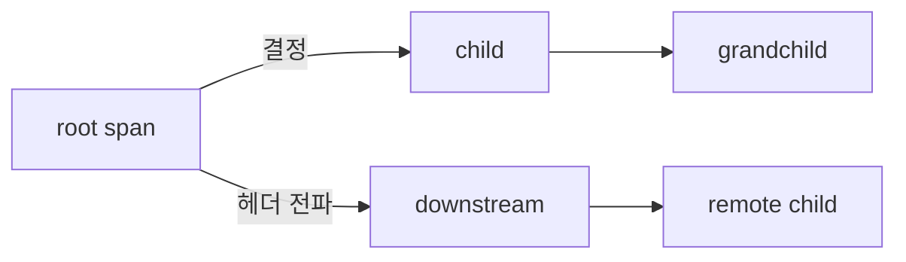
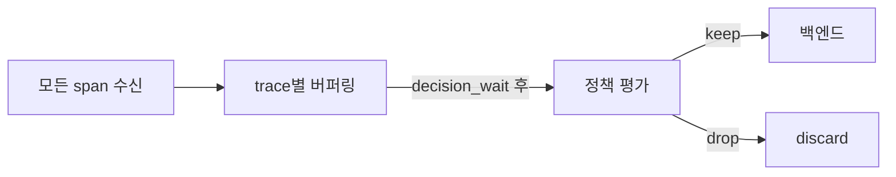
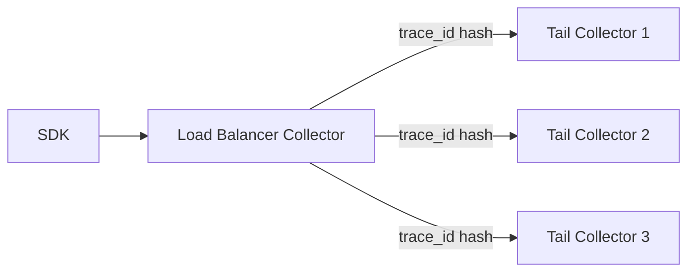
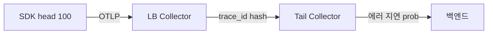
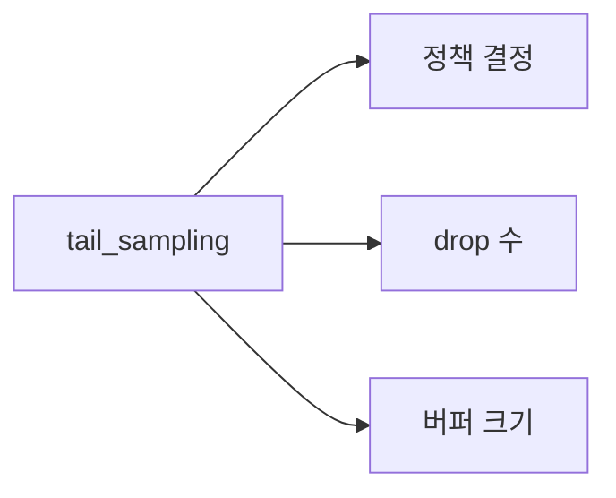
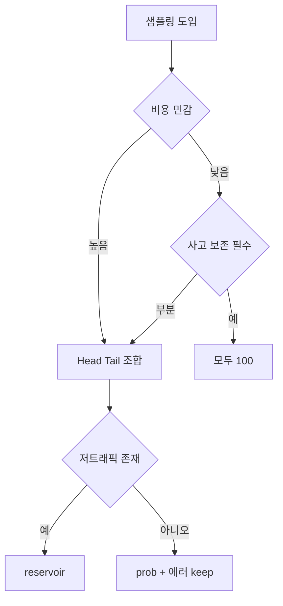

# 샘플링 전략

> 트레이스 100% 보존은 거의 항상 경제적이지 않다. 그러나 "1% 확률"만으로는
> 정작 장애 시 필요한 트레이스가 사라진다. **언제·어디서·어떤 근거로**
> 샘플링 결정을 내리느냐가 이 글의 전부다. Head·Tail·Probabilistic·
> Adaptive 네 축을 운영 상황에 맞춰 조합한다.

- **주제 경계**: 이 글은 **트레이스 샘플링의 결정 시점·알고리즘·운영
  토폴로지**를 다룬다. 백엔드 비교는
  [Jaeger·Tempo](jaeger-tempo.md), Collector 파이프라인은
  [OTel Collector](otel-collector.md), 컨텍스트 전파는
  [Trace Context](trace-context.md), 로그 우선순위 샘플링은
  [로그 운영 정책](../logging/log-operations.md#4-우선순위-샘플링)
  참조.
- **선행**: [관측성 개념](../concepts/observability-concepts.md).

---

## 1. 왜 샘플링인가

| 이유 | 설명 |
|---|---|
| 비용 | trace 저장·전송 비용이 span 수에 비례 |
| 노이즈 | 헬스체크·내부 폴링은 전부 보존해도 가치 없음 |
| 네트워크 | SDK→Collector→백엔드 모든 홉에 대역폭 부담 |
| 백엔드 | 인덱싱·컴퓨트 한계 |
| 개인정보 | payload 저장량 최소화로 DLP 위험↓ |

> **핵심 원칙**: "전체 관측 대상을 통계적으로 대표하되, 사고·이상
> 케이스는 100% 보존". 모든 샘플링 전략의 공통 목표.

---

## 2. 네 축 — 한눈에

| 축 | 결정 시점 | 결정 근거 | 구현 위치 |
|---|---|---|---|
| **Head** | span 시작 시 | trace_id·부모 결정 | **SDK** |
| **Tail** | 트레이스 완료 후 | 전체 span 정보 | **Collector** |
| **Probabilistic** | 확률적 | trace_id 해시 | SDK 또는 Collector |
| **Adaptive** | 동적 | 처리량·예산·에러율 | Collector·SaaS |

이 네 축은 배타적이지 않고 **조합**된다. 흔한 2026 표준:
`ParentBased(Head) + probabilistic 100%` → Collector에서 `tail_sampling`으로
에러·지연 100% + 나머지 5%.

---

## 3. Head Sampling — SDK가 결정

### 3.1 동작



- root span 시작 시점에 **keep/drop 결정**
- 결정을 `tracestate` 또는 `traceflags`로 전파
- 모든 자식 span은 root 결정을 따름 (ParentBased)

### 3.2 장점

| 장점 | 설명 |
|---|---|
| 비용 낮음 | drop된 trace는 SDK가 span을 만들지 않음 — CPU·메모리·네트워크 절감 |
| 단순 | 각 프로세스가 독립 결정 (단, 부모 결정 상속) |
| 구현 쉬움 | OTel SDK의 기본 샘플러 |

### 3.3 단점

- **결정 시점에 trace 결과를 모름**. 이 trace에 ERROR가 생길지, latency
  가 튈지 알 수 없다.
- 따라서 **사고 시 필요한 trace가 drop될 확률**이 샘플링 비율만큼 있다.
- 결정 후 변경 불가.

### 3.4 주요 샘플러

| 샘플러 | 동작 |
|---|---|
| `AlwaysOn` / `AlwaysOff` | 100% keep / drop |
| `TraceIdRatioBased(p)` | trace_id 해시 기반 p 비율 keep |
| `ParentBased(delegate)` | 부모 결정 우선, 없으면 delegate |

**`ParentBased`는 4분기 분리**:

| 분기 | 의미 |
|---|---|
| `remote_parent_sampled` | 원격 부모가 sampled=true → 상속 |
| `remote_parent_not_sampled` | 원격 부모가 sampled=false → drop |
| `local_parent_sampled` | 같은 프로세스 내 부모 sampled | 상속 |
| `local_parent_not_sampled` | 같은 프로세스 내 부모 drop | drop |
| root (부모 없음) | `delegate` 샘플러 평가 |

각 분기를 override 가능 — 예: remote parent가 drop이어도 로컬에서 에러
trace는 keep하도록 `remote_parent_not_sampled = AlwaysOn` 조합.

### 3.5 SamplingResult — 3가지

| 결과 | 의미 |
|---|---|
| `DROP` | span 생성 안 함 |
| `RECORD_ONLY` | span 기록은 하되 export 안 함 (로컬 디버깅용) |
| `RECORD_AND_SAMPLE` | 기록 + export, `sampled` flag=1 |

### 3.6 SpanKind 기반 차등

SERVER·CLIENT·INTERNAL·PRODUCER·CONSUMER 별로 샘플링을 달리 할 수 있다.
흔한 패턴:

- 외부 진입 SERVER span은 100% keep
- INTERNAL span은 probabilistic 10%
- CLIENT span(외부 API 호출)은 latency 기반 tail 결정

### 3.7 OTel 2025 사건 — Consistent Probability Sampling

이전의 `TraceIdRatioBased`는 **서비스마다 다른 p 값**을 설정하면 trace가
**조각날 수 있었다**. A가 10% 선택하고 B가 5% 선택하면 A keep·B drop이
발생.

2025년 **Consistent Probability Sampling 사양**이 안정화되어 `tracestate`에
56-bit randomness + threshold를 기록 → **어느 서비스에서든 동일 trace는
동일 결정**을 내린다. 2026 신규 도입은 이 스펙 준수 구현 사용.

> **SDK 구현 현황(2026-04)**: 사양은 stable이지만 **모든 SDK가 동일
> 수준으로 구현된 것은 아니다**. Collector `probabilisticsampler`는
> `mode: proportional`로 지원, Java·Go·Python SDK는 점진 반영. 신규
> 도입 시 각 언어 SDK 릴리스 노트 확인.

### 3.8 `sampled` flag와 attribute의 관계

- `traceflags`의 **sampled bit (0/1)**: downstream이 따라야 할 결정
- `tracestate`의 **threshold + randomness**: consistent sampling 정보
- span **attribute**는 샘플링 결정에 영향 없음 (단, tail 정책에서 참조)

downstream SDK는 sampled=0이면 **span을 만들지 않는 것이 표준**. 즉 head
drop은 강제. 이를 깨면 trace가 조각난다.

---

## 4. Tail Sampling — Collector가 결정

### 4.1 동작



- Collector가 **모든 span을 일단 받아서 trace별 버퍼**
- `decision_wait` 타임아웃 후 전체 span 정보를 보고 정책 평가
- keep 결정된 trace만 백엔드에 전달

### 4.2 장점

| 장점 | 설명 |
|---|---|
| **결과 기반 결정** | ERROR·slow trace 100% keep 보장 |
| 정밀한 정책 | latency·status·attribute·rate 조합 |
| 중앙 관리 | SDK 변경 없이 정책 튜닝 |

### 4.3 단점

- **메모리 폭발**. 1k trace/s × 60s = 60k trace를 메모리에 유지. 운영
  클러스터에서 GB 단위.
- **완결성**: span이 N초 안에 도착해야 함 (비동기 긴 trace는 잘림).
- **trace-aware load balancing 필수** (아래 참조).
- drop된 trace도 SDK·Collector 앞단까지는 **이미 비용 발생**.

### 4.4 OTel Collector 정책

```yaml
processors:
  tail_sampling:
    decision_wait: 10s
    num_traces: 100000
    expected_new_traces_per_sec: 1000
    policies:
      - name: errors
        type: status_code
        status_code: { status_codes: [ERROR] }
      - name: slow
        type: latency
        latency: { threshold_ms: 1000 }
      - name: important-tenant
        type: string_attribute
        string_attribute:
          key: tenant.tier
          values: [gold, platinum]
      - name: probabilistic
        type: probabilistic
        probabilistic: { sampling_percentage: 5 }
      - name: rate-limit
        type: rate_limiting
        rate_limiting: { spans_per_second: 1000 }
```

정책은 **OR 결합** — 하나라도 match하면 keep. 마지막 rate_limit은 글로벌
cap.

### 4.5 trace-aware load balancing



**2-layer 아키텍처 필수**:
- 1층: `loadbalancing` exporter가 **trace_id 해시로 2층 라우팅**
- 2층: 같은 trace의 모든 span이 **동일 Collector에 도달** → tail_sampling
  가능

단일 Collector나 랜덤 라우팅은 trace가 쪼개져서 tail_sampling 불가.

### 4.6 메모리 사이징 공식

```
메모리 ≈ expected_traces_per_sec × decision_wait × avg_trace_size × 1.3
```

- 1k trace/s, 10s wait, 10KB/trace → ~130 MB
- 10k trace/s, 30s wait, 20KB/trace → ~7.8 GB
- 여유 2배 권장, `num_traces`로 상한 cap

> **운영 사고**: `num_traces` 초과 시 **오래된 trace부터 강제 drop**.
> 여기 ERROR trace가 섞이면 keep하려 했던 trace가 사라진다. 사이징 여유
> 는 안전장치.

### 4.7 `memory_limiter`와의 순서

Collector 파이프라인에서 순서가 중요하다:

```yaml
service:
  pipelines:
    traces:
      receivers: [otlp]
      processors: [memory_limiter, tail_sampling, batch]
      exporters: [otlp]
```

- **memory_limiter가 tail_sampling 앞**에 와야 한다. 메모리 압박 시
  memory_limiter가 먼저 refuse하면 tail 버퍼가 상한 trace 일부만 들고
  불완전 평가하는 상황을 피한다.
- batch는 맨 뒤. tail 결정 후 export 효율을 위해.
- **주의**: memory_limiter가 refuse하면 SDK 측 OTLP client가 429를
  받고 재시도 → 네트워크 부담. SDK의 exponential backoff 확인.

---

## 5. Probabilistic — 두 곳에서 쓸 수 있는 확률 샘플링

### 5.1 Head 위치 (SDK)

```python
from opentelemetry.sdk.trace import TracerProvider
from opentelemetry.sdk.trace.sampling import ParentBased, TraceIdRatioBased

sampler = ParentBased(root=TraceIdRatioBased(0.05))  # 5%
```

- 장점: drop된 trace는 SDK가 만들지 않음 → 가장 쌈
- 단점: 에러·지연 trace도 확률만큼 사라짐

### 5.2 Collector 위치

```yaml
processors:
  probabilistic_sampler:
    sampling_percentage: 5
    hash_seed: 22
    mode: proportional
```

- Collector `probabilistic_sampler`는 trace_id 기반 consistent 결정
- `mode: proportional`은 2025 consistent sampling 스펙 준수
- 장점: SDK 변경 없이 중앙에서 조정
- 단점: SDK→Collector 네트워크 비용은 이미 지불

### 5.3 언제 어디에 두나

| 상황 | 위치 |
|---|---|
| 네트워크 비용 극소화 | **SDK (Head)** |
| 정책 중앙 관리 | **Collector** |
| 샘플링 조합 (head 100% + tail 5%) | SDK 100% + Collector 5% |

---

## 6. Adaptive — 동적 조정

### 6.1 목표

고정 비율은 트래픽 변화에 취약. 새벽 1% → 피크 10× 트래픽 때 백엔드 폭주,
또는 피크 기준으로 1%면 새벽엔 샘플이 너무 적어 대표성 손실.

**Adaptive**: **목표 throughput·예산·SLO**를 만족하도록 샘플링 비율을
**자동 조정**한다.

### 6.2 대표 구현

| 플랫폼 | 메커니즘 | 조정 주기 |
|---|---|---|
| **DataDog** | 월 예산 기반, 저트래픽 서비스에 최소 1 trace/5m 보장 | 10m |
| **Dynatrace** | 라이선스 full-stack trace 예산 기반 | 15m |
| **Elastic APM** | probabilistic + 서비스별 rate cap | 설정 |
| **OTel** | 표준 SDK 샘플러는 아직 정식 adaptive 없음, Collector `tail_sampling` + `rate_limiting` 조합으로 근사 | N/A |
| **AWS X-Ray** | reservoir + percentage 룰, 서비스·URL별 | 사용자 정의 |

### 6.3 X-Ray 스타일 reservoir + percent

```yaml
# 개념적
rules:
  - service: checkout
    reservoir: 1
    percent: 5
  - default
    reservoir: 1
    percent: 1
```

- 저트래픽 서비스도 보장 → "완전 무관측" 방지
- 고트래픽 서비스는 비율로 cap

### 6.4 OTel에서의 adaptive 근사

OTel 표준은 adaptive를 직접 제공하지 않지만 조합 가능:

```yaml
processors:
  tail_sampling:
    policies:
      - name: always-errors
        type: status_code
        status_code: { status_codes: [ERROR] }
      - name: min-per-service
        type: and
        and:
          and_sub_policy:
            - type: string_attribute
              string_attribute: { key: service.name, values: [critical-svc] }
            - type: rate_limiting
              rate_limiting: { spans_per_second: 10 }
      - name: prob
        type: probabilistic
        probabilistic: { sampling_percentage: 5 }
      - name: global-cap
        type: rate_limiting
        rate_limiting: { spans_per_second: 1000 }
```

- 서비스별 floor + 글로벌 ceiling 조합
- 예산 기반 진짜 adaptive는 OTel 외부 제어(remote config)로 수행

---

## 7. 조합 전략 — 2026 표준

단일 축만 쓰는 경우는 드물다. **Head + Tail + Probabilistic** 조합:



| 위치 | 정책 | 효과 |
|---|---|---|
| SDK (Head) | `ParentBased + AlwaysOn` | 100% SDK 방출, Consistent Sampling 전파 |
| Collector 1층 | `loadbalancing` (trace_id hash) | tail 샤딩 |
| Collector 2층 | `tail_sampling` (ERROR·slow·prob 5%) | 최종 결정 |
| 백엔드 | 추가 제약 없음 | 비용·저장 일정 |

### 7.1 극대 비용 절감 변형

SDK head에서 **이미 1차 probabilistic 10%**, tail에서 에러·지연만 100%
keep, 나머지 5% keep. → SDK 출력량 10%, 최종 보존 ~1.5%.

| 단계 | 트래픽 |
|---|---|
| SDK 생성 | 100% |
| SDK 전송 | 10% (head 10%) |
| Tail 입력 | 10% |
| Tail 출력 | ~1.5% (ERROR 보정) |

> **함정**: SDK head가 10%일 때 ERROR는 10% 확률로만 잡히고, 나머지 90%
> 에러는 트레이스가 시작조차 안 된다. Tail이 발견할 수 없다. ERROR
> 보존이 중요하면 **SDK head는 100%, tail에서 줄이기**.

---

## 8. 관측 가능 vs 관측 불가능한 것

| 신호 | 샘플링 영향 |
|---|---|
| **메트릭** | 영향 없음 (메트릭은 aggregated, 샘플 독립) |
| **로그** | trace 샘플링과 **별도** 정책, 단 trace_id 상관 시 연계 가능 |
| **트레이스** | 직접 영향 |
| **메트릭 생성기 기반 RED** | 트레이스 통계이므로 head 샘플링 시 **왜곡됨**. Tempo 메트릭 생성기는 `sampled` 이전 스팬도 보는 옵션 |

> **주의**: Prometheus exemplar로 메트릭 → trace 점프할 때 **샘플링
> 후 남은 trace만 exemplar로** 기록된다. 드물게 탐색 실패 가능.

---

## 9. 샘플링이 망가뜨리는 것

### 9.1 RED 왜곡

SDK head 1%면 request 수가 1/100로 보인다. OTel Collector가 수집한
메트릭과 backend에서 재집계한 메트릭 중 **어느 것을 믿을 것인가**.

| 해결 |
|---|
| 메트릭은 메트릭 파이프라인에서 (샘플링 독립) |
| Tempo 메트릭 생성기는 수집 단계 집계 (샘플링 이전) |
| Span 기반 분석은 샘플링 비율로 역산 |

### 9.2 fragmented trace (조각 trace)

서비스마다 독립 확률 샘플링 → 부분 span만 남음. 2025 consistent
probability sampling 스펙으로 해결.

### 9.3 저트래픽 서비스 관측 실패

1% probability로는 1 req/min 서비스가 100분에 1건만 수집. **floor
(reservoir)** 룰 필수.

### 9.4 tail decision_wait 누락

10초 내 완료되지 않은 trace는 **decision_wait 타임아웃 후 부분만** 평가.
비동기 작업·장기 job은 다른 경로(직접 보존 또는 별도 처리).

### 9.5 로그-trace 상관 끊김

로그에는 `trace_id`가 남는데 trace 자체는 head drop으로 사라진 경우,
Grafana 링크 클릭 → **404 trace not found**. 사용자 혼란.

| 대처 |
|---|
| trace 보관 기한과 로그 보관 기한 일치 |
| head 샘플링 비율을 너무 낮추지 않기(5% 미만 신중) |
| log UI에 "trace not sampled" 힌트 배너 (Grafana 11+ 지원) |
| 에러 trace는 무조건 100% keep (정책 1순위) |

---

## 10. 비-OTLP 프로토콜 — 전파 차이

모든 프로토콜이 Consistent Sampling을 지원하지 않는다.

| 프로토콜 | tracestate | Consistent Sampling |
|---|---|---|
| **W3C Trace Context (OTLP)** | 지원 | **정상 작동** |
| **B3** (Zipkin) | 미지원 (`X-B3-*` 헤더만) | 불가, sampled flag만 |
| **Jaeger Thrift/UDP** | 미지원 | 불가 (uber-trace-id) |
| **AWS X-Ray** | 자체 헤더 (`X-Amzn-Trace-Id`) | 자체 샘플링 룰 |

> **혼합 환경 함정**: 서비스 A가 B3만 이해하고 서비스 B가 W3C면
> tracestate가 삭제·변환되어 **consistent sampling 정보가 유실**된다.
> 경계에서 OTel Collector로 정규화하거나 모든 서비스를 W3C Trace
> Context로 통일하는 게 장기적으로 유일한 해결.

자세한 규격은 [Trace Context](trace-context.md) 참조.

---

## 11. eBPF·무계측 trace의 샘플링

Grafana Beyla, Cilium Tetragon, OpenTelemetry eBPF 같은 **무계측 trace**
는 커널에서 직접 이벤트를 뽑아내므로 **SDK 샘플러가 적용되지 않는다**.
샘플링 결정을 어떻게 하나?

| 패턴 | 구현 |
|---|---|
| 소스 필터 | Beyla의 `discovery`에서 수집 대상 서비스 선별 |
| Collector tail | eBPF agent → OTLP → Collector에서 tail_sampling |
| head rate limit | Beyla 자체 rate limit 설정 |
| SDK trace와 병합 시 | W3C Trace Context 헤더를 eBPF가 읽어 기존 trace에 붙이기 |

> **현실**: 2026 eBPF trace는 생성량이 많아 **Collector tail sampling이
> 사실상 유일한 제어 레버**. SDK head처럼 "아예 안 만들기"는 구현 성숙도
> 미흡.

---

## 12. 샘플링 정책 설계 — 체크리스트

- [ ] **ERROR 100% keep** — status_code·http 4xx/5xx·span event "exception"
- [ ] **slow trace 100% keep** — P99 이상 또는 고정 임계
- [ ] **중요 테넌트·사용자 100%** — 계약·VIP
- [ ] **배포 직후 N분 100%** — 회귀 감지 윈도우
- [ ] **저트래픽 서비스 reservoir** — 분당 최소 1건
- [ ] **나머지 probabilistic** — 1~10%
- [ ] **글로벌 rate cap** — 백엔드 폭주 방지
- [ ] **샘플링 제외 경로** — healthz, metrics endpoint 기본 drop
- [ ] **샘플링 비율·drop 수 메트릭** — 자체 관측

---

## 13. 운영 — 샘플링 자체의 관측



| 메트릭 | 의미 |
|---|---|
| `otelcol_processor_tail_sampling_count_traces_sampled` | 정책별 keep 수 |
| `otelcol_processor_tail_sampling_count_spans_dropped` | drop 수 |
| `otelcol_processor_tail_sampling_new_traces_received` | 수신 속도 |
| `otelcol_processor_tail_sampling_sampling_policy_evaluation_error` | 정책 오류 |
| `num_traces_on_memory` | 현재 버퍼 |

**알림**:
- buffer > 80% of `num_traces` → 메모리 부족, drop 위험
- error 정책 keep 비율 급감 → SDK·파이프라인 이상
- 전체 drop rate 급증 → 백엔드 백압 또는 정책 오작동

---

## 14. 안티패턴

| 안티패턴 | 결과 | 교정 |
|---|---|---|
| 1% probabilistic 단독 | ERROR trace 99% 손실 | tail로 에러 100% keep |
| SDK head 5% + tail 100% | tail이 5% 트레이스만 봄 | SDK head 100% + tail 판단 |
| 서비스마다 다른 p | 조각 trace | Consistent Sampling (2025+) |
| tail decision_wait 1s | 긴 trace 잘림 | 10s 이상, 비동기는 별도 경로 |
| Load balancer 없는 tail | trace 분할되어 평가 실패 | 2-layer LB 필수 |
| num_traces 기본값 | 트래픽↑에서 silent drop | 사이징 공식 + 여유 2배 |
| 헬스체크 샘플링 | 노이즈가 예산 소진 | 경로 기반 필터로 drop |
| DEBUG·trace 모두 100% keep | 비용 폭발 | 환경별 다른 정책 |

---

## 15. 결정 트리



| 상황 | 추천 |
|---|---|
| 스타트업·단순 | SDK `TraceIdRatioBased(0.1)` + 단일 Collector |
| 중규모 | SDK 100% + Collector tail (ERROR + 5% prob) |
| 대규모·다중 테넌트 | 2-layer Collector + tail + reservoir + adaptive |
| 예산 제약 엄격 | SDK head + Consistent Sampling + tail |
| SaaS 매니지드 | 플랫폼 adaptive 위임 (DataDog·Dynatrace) |

---

## 16. 마이그레이션 경로

1. **모두 100% keep으로 시작** (실제 볼륨·비용 측정)
2. **헬스체크·metrics endpoint drop** (즉각 20~40% 감소)
3. **SDK Consistent TraceIdRatio 도입** (모든 서비스 동일 p)
4. **Collector tail_sampling 2-layer 구축**
5. **정책 단계별 도입**: ERROR 100% → slow 100% → probabilistic 5%
6. **관측·튜닝**: 메트릭 기반 비율 조정, adaptive 검토

---

## 참고 자료

- [OpenTelemetry — Sampling](https://opentelemetry.io/docs/concepts/sampling/) (확인 2026-04-25)
- [OTel Sampling Milestones 2025](https://opentelemetry.io/blog/2025/sampling-milestones/) (확인 2026-04-25)
- [TraceState Probability Sampling Spec](https://opentelemetry.io/docs/specs/otel/trace/tracestate-probability-sampling/) (확인 2026-04-25)
- [Tail Sampling with OTel (2022 blog, 여전히 기준)](https://opentelemetry.io/blog/2022/tail-sampling/) (확인 2026-04-25)
- [Tail Sampling Processor README](https://github.com/open-telemetry/opentelemetry-collector-contrib/blob/main/processor/tailsamplingprocessor/README.md) (확인 2026-04-25)
- [Probabilistic Sampler Processor README](https://github.com/open-telemetry/opentelemetry-collector-contrib/blob/main/processor/probabilisticsamplerprocessor/README.md) (확인 2026-04-25)
- [DataDog Adaptive Sampling](https://docs.datadoghq.com/tracing/trace_pipeline/adaptive_sampling/) (확인 2026-04-25)
- [Dynatrace Adaptive Traffic Management](https://docs.dynatrace.com/docs/ingest-from/dynatrace-oneagent/adaptive-traffic-management) (확인 2026-04-25)
- [Consistent Probability Sampling Fixes Fragmented Traces](https://last9.io/blog/consistent-probability-sampling-fixes-fragmented-traces/) (확인 2026-04-25)
