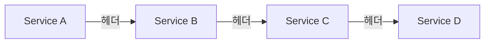
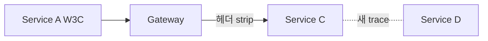
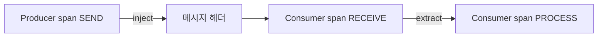
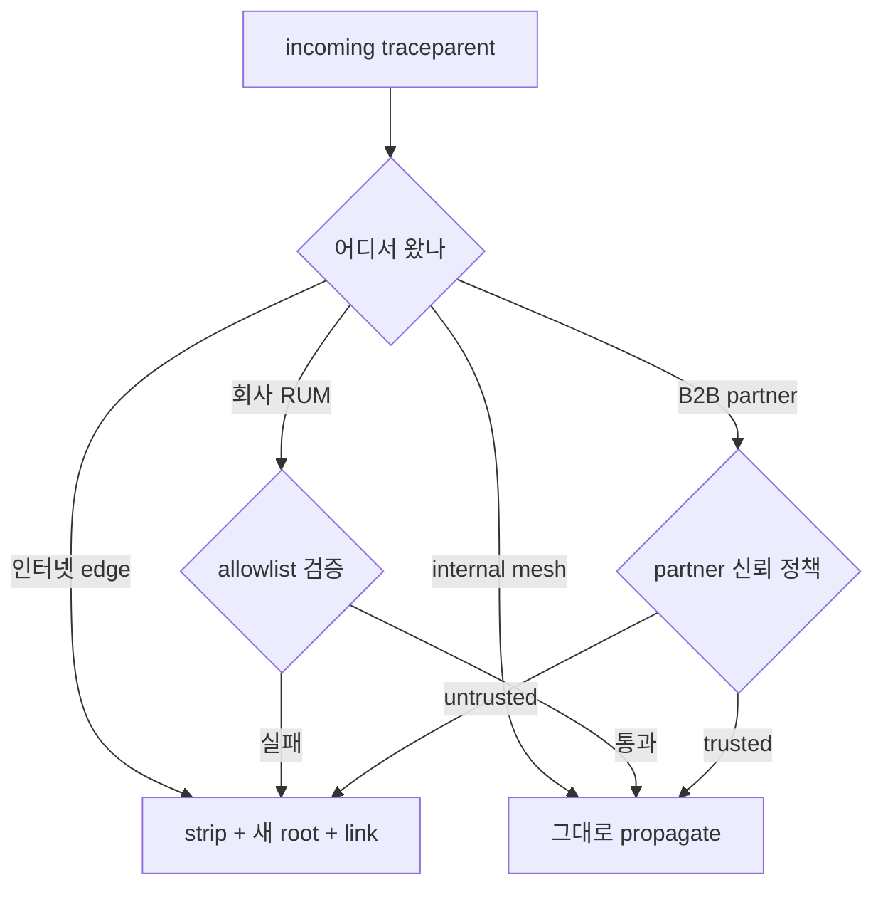

# Trace Context

> 분산 트레이싱의 **공통어**. 한 요청이 서비스 경계를 건널 때 trace_id·
> span_id·flags가 **HTTP 헤더**로 전달돼 다음 hop이 같은 trace에
> 합류한다. 2026 표준은 **W3C Trace Context (Level 2)** + **W3C Baggage**.
> 이 글은 두 헤더의 정확한 비트 단위 의미, OTel propagator API,
> B3·Jaeger와의 상호운용, 메시지 큐·async 경계까지 다룬다.

- **주제 경계**: 이 글은 **컨텍스트 전파 규격**을 다룬다. 샘플링 알고리즘
  자체는 [샘플링 전략](sampling-strategies.md), Collector 파이프라인은
  [OTel Collector](otel-collector.md), 백엔드 비교는
  [Jaeger·Tempo](jaeger-tempo.md), 메트릭과의 상관(exemplar)은
  [Exemplars](../concepts/exemplars.md), 시맨틱 컨벤션은
  [Semantic Conventions](../concepts/semantic-conventions.md) 참조.
- **선행**: [관측성 개념](../concepts/observability-concepts.md).

---

## 1. 왜 표준이 필요했나



- 2010년대 각 벤더가 자체 헤더(`X-B3-*`, `X-Datadog-*`, `uber-trace-id`,
  `X-Cloud-Trace-Context`)를 사용 → 게이트웨이·메시·서드파티 통과 시
  trace 단절.
- 2018년부터 W3C Distributed Tracing WG에서 표준화. **Level 1
  Recommendation (2020)**, **Level 2는 2026-04 시점 Candidate
  Recommendation Draft** (2개 이상 독립 구현 충족 시 Recommendation 승격).
- 결과: **`traceparent`·`tracestate`** 두 헤더가 사실상 모든 SDK·메시·
  CDN·게이트웨이의 디폴트 (OTel 디폴트 propagator도 이 둘). Level 2
  신규 항목(`random` flag, `traceresponse`)은 SDK 적용 진행 중.

---

## 2. `traceparent` — 위치 식별

```text
traceparent: 00-4bf92f3577b34da6a3ce929d0e0e4736-00f067aa0ba902b7-01
```

왼쪽부터 hyphen 구분: **version (2 hex) — trace-id (32 hex) — span-id
(16 hex) — trace-flags (2 hex)**.

| 필드 | 길이 | 의미 |
|---|---|---|
| **version** | 1바이트 (2 hex) | `00` 현재. `ff` 금지 |
| **trace-id** | 16바이트 (32 hex) | 트레이스 식별자, **all-zero 무효** |
| **span-id** | 8바이트 (16 hex) | **송신자가 방금 만든 자기 span id**, all-zero 무효. Level 1 spec은 `parent-id`로 명명, Level 2부터 `span-id`로 통일 |
| **trace-flags** | 1바이트 (2 hex) | sampled·random 비트 |

> **이름 변경 (Level 1→2)**: `parent-id` → `span-id`. traceresponse
> 헤더의 `child-id`와 페어를 이루도록 통일. 의미는 동일 — "송신자
> 입장에서 자기 span_id, 수신자가 새 span을 만들면 그 span의 부모".

> **헤더 이름 case-insensitive (Level 2)**: `Traceparent`·`TRACEPARENT`
> 모두 동일 헤더. HTTP/2의 lowercase 강제와도 호환.

### 2.1 Trace-Flags — 8비트의 의미

| 비트 | 이름 | Level | 의미 |
|---|---|---|---|
| 0 | `sampled` | 1 | 상위 hop이 **캡처(record)했음을 시사**. 강제는 아님 — 다음 hop의 결정 입력일 뿐 |
| 1 | `random` | **2 (신규)** | trace-id의 우측 56비트가 균등 랜덤임을 보장 → 다운스트림 sampling·sharding이 trace_id 해시만으로 일관 결정 가능 |
| 2~7 | 예약 | — | 모두 `0`. 이해 못하는 비트는 **무시·전파 유지** |

예시: `01` = sampled만, `03` = sampled + random.

> **`sampled`는 결정이 아니라 힌트**. ParentBased 샘플러는 이걸 보고
> 자식 결정을 동기화한다. **OTel Consistent Probability Sampling
> (2025+)** 에서는 sampled bit이 1이라면 `tracestate.ot=th`도 그
> 결정과 정합해야 한다 ([샘플링 전략](sampling-strategies.md#3-head-sampling-sdk가-결정)).

> **`random` 비트가 켜진 trace-id**는 다운스트림이 **추가 해시 없이**
> trace_id 자체를 해시 키로 쓸 수 있게 해 준다. OTel SDK는 v1.43+
> (Go 기준)에서 자동으로 1을 켠다. 단 zero-padded 변환 trace-id는
> 우측 56비트가 균등 랜덤이 아니므로 `random=0`으로 두고 `tracestate
> .ot=rv`로 별도 randomness를 명시해야 한다 (4장 참조).

### 2.2 무효 traceparent 처리

받은 `traceparent`가 다음 중 하나면 **버리고 새로 시작**:

| 상황 | 처리 |
|---|---|
| version `ff` | reject |
| 헤더 길이·형식 위배 | reject |
| trace-id 또는 parent-id가 all-zero | reject |
| 알 수 없는 version (`00` 외) | **앞 4 필드만** 파싱 시도, trailing 데이터는 무시 |

> **`traceparent` 파싱 실패 시 `tracestate`는 처리 금지.** 단,
> tracestate 파싱 실패는 traceparent에 영향을 주지 않는다.

---

## 3. `tracestate` — 벤더 데이터·OTel 운영 데이터

```text
tracestate: rojo=00f067aa0ba902b7,congo=t61rcWkgMzE,ot=th:8;rv:1234abc
```

- comma 구분 list, 각 항목 `key=value`
- **최대 32개** 항목 (hard limit, 초과 시 우측 항목 제거)
- 항목당 키+값 합계 ~256자
- 전파 의무: vendor·proxy는 **최소 512자까지 잘리지 않게 전파해야 함
  (SHOULD)** — 즉 받은 헤더가 1KB여도 가능한 한 보존
- 키: lowercase로 시작 (`a-z`), 후속 `[a-z0-9_\-*/]`. 벤더 공유는
  `tenant@vendor` 형식 (tenant 부분은 숫자 시작 허용)

### 3.1 mutation 규칙 (W3C MUST)

| 행동 | 규칙 |
|---|---|
| **추가** | 새 항목은 **맨 왼쪽**에 |
| **갱신** | 자기 키 값 변경 → 왼쪽으로 이동 |
| **삭제** | 자기 키만 (MUST). **남의 키는 변경·삭제 금지** — 위반 시 다운스트림의 sampling·billing 데이터 손실 |
| **순서** | 미수정 항목은 원래 순서 유지 |

> **왼쪽이 가장 최근 hop**. 가장 왼쪽 항목의 vendor가 현 hop의 trace
> 작성자다.

### 3.2 OTel `ot=` 섹션 — Consistent Probability Sampling

OTel은 자기 섹션을 `ot=` prefix로 점유한다. 2026 핵심 두 키:

| 키 | 인코딩 | 의미 |
|---|---|---|
| `th` (threshold) | base16, **1~14 hex digit**, lower-case | sampling **rejection threshold**. 우측 7B를 56비트로 비교, R ≥ T면 keep |
| `rv` (random value) | base16, **정확히 14 hex digit**, lower-case | 명시적 randomness. trace-id의 randomness가 신뢰 불가일 때 **MUST 주입** |

```text
tracestate: ot=th:8;rv:1234abcdef0123
```

자세한 인코딩 규칙·시나리오·adjusted count 역산은
[샘플링 전략 8장](sampling-strategies.md#8-consistent-probability-sampling-2026) 참조.

> **왜 중요한가**: `th`만 보면 다운스트림이 **adjusted count**를 정확히
> 역산해 spanmetrics·RED 메트릭을 정확히 산출할 수 있다 — head
> probabilistic sampling을 쓰면서도 100% 트래픽 메트릭을 얻는다.

> **vendor와의 분리**: `dd=`(Datadog), `lz=`(LightStep) 등 벤더는
> 자기 prefix를 쓰며, OTel은 `ot=` 섹션만 건드린다. 충돌 없음.

---

## 4. trace-id · span-id 생성 규칙

| 항목 | 규칙 |
|---|---|
| **trace-id** | 16바이트 (128bit), all-zero 무효 |
| **span-id** | 8바이트 (64bit), all-zero 무효 |
| **랜덤성** (Level 2) | trace-id 우측 7바이트(56bit) 균등 랜덤 권장. 만족 시 `random` 플래그 1 |
| 변환 호환 | 8바이트 legacy ID는 **앞을 0으로 패딩**해 16바이트로. 단 우측이 균등 랜덤이라 가정할 수 있을 때만 |

> **왜 우측 7바이트인가**: 다운스트림이 `trace_id_lo & mask` 한 줄로
> 일관 샘플링 결정을 하려면 트레일링 비트가 균등 랜덤이어야 한다.
> 좌측은 cluster·datacenter 코딩 등에 쓸 수 있도록 자유로 둔다.

> **zero-padded trace-id 처리**: B3·Jaeger 64bit ID를 16바이트로 패딩한
> 경우 — 우측 8바이트만 데이터고 우측 7바이트가 충분히 랜덤이면 OK.
> 그렇지 않거나 의심스러우면 **`random` 플래그를 0으로 두고**
> `tracestate.ot=rv:`로 **별도 randomness를 주입**해야 한다 (OTel
> Probability Sampling 사양 MUST). 패딩만으로 random=1을 켜면 안 됨.

> **legacy 8바이트 trace-id**: B3·Jaeger 일부 SDK가 사용. W3C로 들어올
> 때 패딩하지 않고 자르면 충돌·재할당 발생.

---

## 5. W3C Baggage — 사용자 데이터 전파

`traceparent`/`tracestate`는 **트레이스 식별·샘플링용**. 사용자 정의
key-value는 별도 헤더 `baggage`.

```text
baggage: userId=alice,tier=premium;ttl=3600,region=apac
                                   ↑ 메타데이터 (속성)
```

| 항목 | 규칙 |
|---|---|
| 형식 | `key=value;metadata,key=value` (RFC 7230 list) |
| 전체 크기 (W3C MUST) | ≤ **8192바이트** |
| list-member 수 (W3C MUST) | ≤ **64개** |
| 인코딩 | percent-encoding (Unicode 가능) |
| 개별 값 길이 | W3C 사양엔 **명시 한도 없음**. SDK 구현체별로 4096B 등 디폴트가 있을 수 있어 운영 시 확인 |

| 용도 | 예 |
|---|---|
| 인증·테넌트 | `tenant=acme,plan=enterprise` |
| 실험·플래그 | `experiment=checkout_v2` |
| 비즈니스 라벨 | `userId=alice,country=KR` |
| 디버깅 | `dbg=trace-this-request` |

> **남용 주의 1 — PII**: baggage는 **모든 다운스트림으로 흘러간다**.
> userId·이메일을 그대로 넣으면 SaaS 백엔드·서드파티 서비스에까지
> 노출된다. 회사 boundary를 넘기 전 **strip propagator**로 제거.

> **남용 주의 2 — 카디널리티**: baggage 값이 그대로 span attribute로
> 자동 복사되면 (OTel `baggageSpanProcessor` 활성 시) 백엔드 카디널리티
> 폭발. 자동 복사는 **화이트리스트 키만**.

> **남용 주의 3 — 크기**: 8KB 한도지만 매 hop마다 누적. 게이트웨이가
> 4KB 한도면 잘림 → **항상 보수적으로**(<1KB).

---

## 6. OTel Propagator API

OTel SDK의 `TextMapPropagator`는 **inject·extract** 두 메서드만:


| 메서드 | 시점 | 동작 |
|---|---|---|
| **inject** | outgoing 직전 | 현재 SpanContext + Baggage → HTTP/gRPC 헤더 |
| **extract** | incoming 시 | 헤더 → 새 Context (root 또는 parent) |

### 6.1 표준 propagator 종류

| 이름 | 헤더 | 용도 |
|---|---|---|
| `tracecontext` | `traceparent`·`tracestate` | **W3C 표준, OTel 디폴트** |
| `baggage` | `baggage` | W3C Baggage |
| `b3multi` | `X-B3-TraceId`·`X-B3-SpanId`·`X-B3-ParentSpanId`·`X-B3-Sampled`·`X-B3-Flags` | Zipkin 호환 (구) |
| `b3` | `b3` (single header) | Zipkin 신형, Istio·Envoy 디폴트 |
| `jaeger` | `uber-trace-id`·`uberctx-*` | Jaeger v1 SDK 호환 (deprecated) |
| `xray` | `X-Amzn-Trace-Id` | AWS X-Ray |
| `ottrace` | `ot-tracer-*` | OpenTracing 호환 (legacy) |

### 6.2 Composite Propagator — 다중 형식 동시 운용

```bash
export OTEL_PROPAGATORS=tracecontext,baggage,b3
```

| 동작 | 효과 |
|---|---|
| **extract** | 나열 순서대로 시도, **첫 번째 성공이 우선** |
| **inject** | **모두** 출력 — 다운스트림이 어떤 형식이든 수용 |

> **현실 디폴트**: `tracecontext,baggage`로 충분. legacy SDK·Envoy·메시
> 가 섞여 있으면 `tracecontext,baggage,b3multi`. **항상 `tracecontext`를
> 첫 번째**에 둬야 새 환경이 표준에 정렬된다.

> **inject 비용 트레이드오프**: 4종 propagator를 다 켜면 outbound마다
> 헤더 ~600B가 추가된다. gRPC metadata 한도(기본 8KB) + HTTP/2 HPACK
> 압축률에 영향. **원칙은 "디폴트 2종 + 마이그레이션 기간 한정 1종"**.

### 6.3 `traceresponse` (Level 2 신규)

서버가 클라이언트 응답 헤더로 child-id를 회신하는 메커니즘.

```text
traceresponse: 00-4bf92f3577b34da6a3ce929d0e0e4736-00f067aa0ba902b7-01
```

- 클라이언트가 자기 trace 트리에 서버 span을 명시적으로 link 가능
- RUM·합성 모니터링·외부 API 호출 디버깅에 유용
- OTel SDK 적용은 **2026-04 시점 alpha** — 일부 언어만 지원

---

## 7. 상호운용 — B3·Jaeger·X-Ray 다리

### 7.1 B3 — 형식 비교

| 측면 | B3 multi | B3 single | W3C |
|---|---|---|---|
| 헤더 수 | 5개 | 1개 | 1개(+tracestate) |
| 길이 | 가변 | 가변 | 고정 (positional) |
| trace-id | 64 또는 128bit | 64 또는 128bit | **128bit 고정** |
| sampled | `X-B3-Sampled: 1` | `b3: trace-id-span-id-1` | flags 비트 |
| 디버그 플래그 | `X-B3-Flags` | 5번째 필드 | 없음 |

```text
B3 single: b3=4bf92f3577b34da6a3ce929d0e0e4736-00f067aa0ba902b7-1
W3C:       traceparent: 00-4bf92f3577b34da6a3ce929d0e0e4736-00f067aa0ba902b7-01
```

> **64bit B3 함정**: 일부 구형 Zipkin SDK는 trace-id 64bit. W3C로
> 마이그레이션할 때 **앞 8바이트를 0으로 패딩** 해야 단편화 방지.

### 7.2 Jaeger — `uber-trace-id`

```text
uber-trace-id: 4bf92f3577b34da6a3ce929d0e0e4736:00f067aa0ba902b7:0:1
```

콜론 구분: trace-id : span-id : parent-span-id : flags.

- Jaeger 자체 SDK는 **deprecated** (v1 last release 2025-12, deprecated 2026-01,
  자세한 일정은 [Jaeger·Tempo](jaeger-tempo.md#22-v2가-v1과-다른-점) 참조)
- 신규는 OTel SDK + W3C 표준
- 마이그레이션 기간엔 `OTEL_PROPAGATORS=tracecontext,baggage,jaeger`로 양립

### 7.3 X-Ray — AWS

```text
X-Amzn-Trace-Id: Root=1-67891233-abcdef012345678912345678;Parent=53995c3f42cd8ad8;Sampled=1
```

- `Root=` 의 `1-{8 hex epoch}-{24 hex random}` = 32 hex → 그대로 W3C
  128bit trace-id에 1:1 매핑된다 (`xray` propagator 동작)
- 단 좌측 32비트가 epoch라 **균등 랜덤이 아님** → `random=1` 플래그를
  켤 수 없다 (4장 zero-padded와 동일 처리)
- AWS API Gateway·ALB·Lambda는 X-Ray 헤더 자동 주입. ALB·NLB는 incoming
  `traceparent`를 forward하면서도 자체 `X-Amzn-Trace-Id`를 추가 — 일부
  SDK는 X-Ray를 우선 채택해 trace 분리 가능 → composite propagator의
  순서 결정 필요
- AWS와 OTel을 같이 쓰려면 `xray` propagator 추가
- 또는 **AWS Distro for OpenTelemetry (ADOT)**가 매핑 자동화

---

## 8. 단편화의 원인 — "왜 trace가 끊기는가"



| 원인 | 증상 | 교정 |
|---|---|---|
| 게이트웨이·LB가 `traceparent` strip | 다운스트림에 root span만 보임 | allowlist에 추가 |
| 인증 미들웨어가 헤더 forward 안 함 | 인증 후 hop부터 새 trace | 표준 헤더 전달 강제 |
| 64bit ↔ 128bit trace-id 불일치 | 두 trace로 분리 | 양쪽 SDK 128bit 통일, 64bit는 패딩 |
| 양쪽 propagator 미스매치 (B3 vs W3C) | extract 실패, 새 root | composite propagator로 양립 |
| 메시지 큐가 헤더 비전달 | producer↔consumer 트레이스 단절 | 메시지 헤더에 명시 주입 (9장) |
| async 작업이 context 미전파 | 비동기 작업 후 새 root | runtime별 context 전파 (10장) |
| HTTP/2 lowercase에서 case-sensitive 비교 | extract 실패 | header 이름 비교는 case-insensitive |
| `tracestate` 항목 누군가 삭제 | sampling threshold 손실 → adjusted count 깨짐 | 알 수 없는 키 보존 룰 강제 |

> **단편화 진단**: 백엔드(Tempo·Jaeger)에서 trace를 열어 **service
> graph**를 확인. 끊긴 hop의 양 쪽 서비스의 propagator·헤더 strip 정책을
> 점검.

---

## 9. 메시지 큐·async 경계

HTTP는 헤더라는 명확한 자리가 있지만, 큐는 **메시지 메타데이터·헤더에
명시적으로 주입**해야 한다.

### 9.1 OTel Messaging SemConv

| 시스템 | 컨텍스트 자리 |
|---|---|
| **Kafka** | record `headers` (Kafka 0.11+) |
| **RabbitMQ** | message `properties.headers` |
| **AWS SQS** | `MessageAttributes` |
| **Google Pub/Sub** | message `attributes` |
| **NATS / JetStream** | message `headers` (NATS 2.2+) |
| **Azure Service Bus** | `application_properties` |
| **AMQP 1.0** | `application-properties` (W3C trace-context-amqp 초안) |

### 9.2 producer·consumer 모델



| 단계 | span kind | 비고 |
|---|---|---|
| Producer publish | `PRODUCER` | 메시지 헤더에 `traceparent` inject |
| Consumer receive | `CONSUMER` (kind=receive) | 폴링·배치 수신 |
| Consumer process | `CONSUMER` (kind=process) 또는 `INTERNAL` | 메시지 1건 처리 단위 |

> **link vs parent — 분기 (OTel Messaging SemConv)**:
> - **단일 메시지 처리**(synchronous worker): PROCESS span은 producer
>   span을 **parent**로 가질 수 있다 — 자연스러운 인과
> - **배치 처리**(여러 메시지를 한 핸들러에서): PROCESS span을 한
>   producer의 자식으로 두면 거짓 인과 → 각 메시지 producer는 **link**로
>   N:1·N:M 관계를 표현
>
> 데이터 모델은 [Jaeger·Tempo 4장](jaeger-tempo.md#4-데이터-모델--span의-구조) 참조.

### 9.3 자동계측 라이브러리 분담

| 작업 | 권장 |
|---|---|
| Kafka 클라이언트 자동계측 | `opentelemetry-instrumentation-kafka` (모든 언어) |
| RabbitMQ 자동계측 | `opentelemetry-instrumentation-{pika·amqplib·...}` |
| 직접 주입이 필요한 경우 (custom serializer) | `propagator.inject(headers, setter)` |

---

## 10. async runtime — 같은 프로세스 안에서도 끊긴다

ThreadLocal·async/await·goroutine·EventLoop 별로 **context 전파 경로가
다르다**. 잘못 다루면 같은 프로세스 안에서도 trace가 끊긴다.

| 언어·런타임 | 전파 메커니즘 | 함정 |
|---|---|---|
| **Java** | ThreadLocal `Context.current()` | ExecutorService·CompletableFuture는 **수동 wrap** 필요 |
| **Go** | `context.Context` 인자 명시 | goroutine `go fn(ctx)` 빠뜨리면 끊김 |
| **Node.js** | `AsyncLocalStorage` (built-in) | callback API·구형 라이브러리는 zone 잃음 |
| **Python** | `contextvars` | thread pool은 OK, 일부 async 라이브러리는 수동 |
| **.NET** | `Activity.Current` (AsyncLocal) | `ConfigureAwait(false)`·custom thread pool 주의 |
| **Rust** | `tracing` crate `Span::in_scope`, OTel `Context::with_value` | tokio task spawn 시 명시적 attach |

> **공통 룰**: "비동기 경계를 넘을 때 context를 들고 가게 만들었는가"를
> 항상 확인. 자동계측이 다 잡아 주지 않는다.

---

## 11. 보안·프라이버시

| 항목 | 권장 |
|---|---|
| **PII baggage 금지** | userId·이메일·토큰을 baggage에 넣지 말 것. 회사 경계 전 strip |
| **회사 경계에서 strip** | 외부 webhook·서드파티 API 호출 전 baggage 제거 (또는 화이트리스트만 통과) |
| **`traceparent`는 안전** | trace-id·span-id는 식별자 (랜덤 16바이트) — PII 아님. 그대로 통과 OK |
| **벤더 tracestate** | 자기 키만 mutate, 알 수 없는 키 그대로 보존 — 조작은 contract 위반 |
| **HTTP/2·HTTP/3** | 헤더는 lowercase 강제 — `Traceparent` 보내도 수신은 `traceparent` |
| **gRPC metadata** | gRPC는 **HTTP/2 헤더로 매핑**, 이름은 lowercase. **`-bin` suffix 금지** — `traceparent`는 ASCII metadata로. server interceptor 위치는 자동계측 라이브러리 디폴트(`grpc-otel`) 따르기 |
| **프록시 헤더 allowlist** | nginx·Envoy·CDN의 default deny 정책에 `traceparent`·`tracestate`·`baggage` 명시 추가 |
| **header injection 공격** | 외부에서 들어온 traceparent를 무비판 수용하면 trace-id를 spoof |

### 11.1 Trust boundary 결정 트리



| 경계 | 정책 |
|---|---|
| **인터넷 facing edge (WAF·Ingress·CDN)** | `traceparent` strip + 새 root span 시작. 외부 trace는 **link**로 보존 |
| **회사 RUM·합성 모니터링** | RUM SDK가 인증 토큰과 함께 보낸 traceparent는 allowlist 기반 신뢰 |
| **internal service mesh** | 그대로 propagate (zero trust도 mTLS로 보증되므로 헤더 신뢰 가능) |
| **B2B API gateway** | partner별 trust 결정 — trusted면 propagate, 그 외엔 strip |

---

## 12. 게이트웨이·메시·CDN — 표준 헤더 통과 보장

| 컴포넌트 | 권장 설정 |
|---|---|
| **nginx** | `proxy_pass_request_headers on;` (default) — header drop 룰에 traceparent 빠지지 않게 |
| **Envoy / Istio** | `traceparent` 자동 forward + `tracing.provider: opentelemetry` 활성 시 자체 span 추가. **함정**: Envoy는 incoming traceparent를 받아도 자체 sampler(`client_sampling`·`random_sampling`·`overall_sampling` 3단)로 **sampling 결정을 재실행**한다 → 업스트림 `sampled=1`이 Envoy에서 0으로 뒤집히는 사례 빈번. `random_sampling=100`으로 두거나, sampler 정책을 명시적으로 ParentBased로 일치시킬 것 |
| **HAProxy** | `option forwardfor` 외에 `http-request set-header` 룰 점검 |
| **AWS ALB / NLB** | ALB는 헤더 통과, 단 X-Ray 활성 시 X-Amzn-Trace-Id 추가 — composite propagator로 양립 |
| **Cloudflare / Fastly** | edge worker가 헤더 strip 가능 — allowlist 추가 |
| **API Gateway (AWS)** | mapping template에 traceparent 명시 |
| **GraphQL gateway** | 클라이언트→GW의 traceparent를 backend 호출에 명시 forward |

> **체크 방법**: 양 끝에 curl로 `-H 'traceparent: 00-...-00-01'` 을
> 보내고 백엔드에서 받은 헤더를 로깅 — 누락되는 hop이 단편화 지점.

### 12.1 forward / strip / rewrite 결정

| 패턴 | 적용 위치 | 설명 |
|---|---|---|
| **forward** | internal mesh, trusted partner | 그대로 통과. 디폴트 |
| **strip + 새 root** | 인터넷 facing edge | 외부 traceparent 무시, 새 root 생성. 외부 trace 손실 |
| **strip + 새 root + link** | edge (관측 가치 보존하고 싶을 때) | 외부 traceparent를 자기 root span의 **Span Link**로 추가 → 외부 trace와 인과 관계 보존하면서 trust 분리 |
| **rewrite (변환)** | X-Ray ↔ W3C 다리, 64bit ↔ 128bit 변환 | propagator·gateway가 형식 변환. 정확성·성능 트레이드오프 |

---

## 13. 디버깅 레시피

### 13.1 trace 단편화 보이는데 어디서?

1. trace를 열어 **마지막 정상 span**의 service·operation 확인
2. 그 다음 hop이 호출하는 outbound HTTP·메시지 발신 로깅 활성
3. outbound 요청 헤더에 `traceparent`가 있는지 확인
4. **있으면** 다음 hop이 받지 못하는 것 (게이트웨이·strip 문제)
5. **없으면** SDK가 inject 못 한 것 (instrumentation 누락·async context 단절)

### 13.2 "내 trace-id가 두 trace로 보임"

- 64bit 자리 절단 → 양쪽 SDK 128bit 통일
- composite propagator 순서가 다른 두 hop에서 다른 형식 우선 채택
- B3 multi의 `X-B3-Sampled=0`과 W3C의 `traceflags=01`이 충돌 — 한쪽
  버려지며 새 trace 생성

### 13.3 "샘플링이 일관성 없게 보임"

원인 후보:

- ParentBased 샘플러 누락 — 자식이 부모 결정을 무시
- `tracestate.ot=th:` 키가 중간 hop에서 삭제 → adjusted count 깨짐
- Envoy/Istio가 자체 sampler로 결정 재실행 (12장 함정 참조)
- 일부 hop이 head sampling 결정을 보지 않고 자체 결정 (전파 미스)

진단 방법:

1. `curl -v -H 'traceparent: 00-{trace}-{span}-01'` 으로 hop 직접 호출,
   다음 hop의 inbound 헤더 로그에서 `tracestate` `ot=th` 보존 확인
2. Collector에 `transform/debug` processor를 임시로 끼워 incoming
   `tracestate` 로깅 → 어느 hop에서 손실되는지 특정
3. 백엔드(Tempo)에서 TraceQL `{ span.tracestate =~ ".*ot=th.*" }` 로
   th 보존 비율 확인

---

## 14. 안티패턴

| 안티패턴 | 결과 | 교정 |
|---|---|---|
| baggage에 PII | 외부 노출·GDPR 위반 | strip propagator·화이트리스트 |
| baggage 자동 → span attribute (제한 없이) | 카디널리티 폭발 | 화이트리스트 키만 |
| 알 수 없는 `tracestate` 키 삭제 | 다른 벤더 데이터 손실 | mutation 룰 준수 |
| 64bit trace-id 그대로 W3C 헤더에 | 단편화 | 좌측 zero-pad |
| `traceparent` 받자마자 새로 생성 | 외부 root만 살고 인입 trace 끊김 | 신뢰 가능한 hop은 그대로 propagate |
| async에서 ctx 안 넘김 | 같은 프로세스 안에서도 끊김 | runtime별 context 명시 |
| 프록시 default deny에 traceparent 누락 | 단편화 | allowlist 추가 |
| 자체 헤더로 대체 (`X-My-Trace-Id`) | 표준 도구·SaaS와 호환 안 됨 | W3C 표준 사용 |
| trust boundary에서 외부 traceparent 무비판 신뢰 | trace-id spoof 공격 | trust boundary에서 새 root + link |
| `OTEL_PROPAGATORS=b3` 단독 (W3C 빠짐) | 신규 표준 도구 incompatibility | `tracecontext`를 항상 첫 번째 |
| `OTEL_PROPAGATORS=`(빈 문자열, 환경변수 prefix 누락) | SDK가 "no propagator"로 해석, 모든 trace가 root | 빈 값 검증 — 미설정이면 SDK 디폴트 사용 |
| ALB·CloudFront 통과 후 X-Amzn-Trace-Id 우선 | trace-id 분리 | composite propagator 순서를 `tracecontext` 우선으로 |
| zero-padded 64bit trace-id에 `random=1` | adjusted count 무효 | `random=0` + `tracestate.ot=rv` 별도 주입 |
| HTTP 3xx redirect follow 시 traceparent 손실 (일부 client) | redirect 후 새 root | client 재시도·redirect 핸들러가 헤더 보존하는지 확인 |
| Envoy `random_sampling`으로 sampled=1을 0으로 뒤집힘 | 트레이스 끊김 | random_sampling 100 또는 ParentBased로 통일 |

---

## 15. 운영 체크리스트

- [ ] **`OTEL_PROPAGATORS=tracecontext,baggage`** 가 모든 서비스 디폴트
- [ ] legacy 환경은 `tracecontext,baggage,b3` 또는 `,jaeger` 추가
- [ ] OTel SDK 버전이 **Level 2 random 플래그** 자동 설정 지원
- [ ] 모든 게이트웨이·LB·CDN의 헤더 allowlist에 `traceparent`·`tracestate`·`baggage`
- [ ] baggage strip 정책 (외부 boundary 전)
- [ ] 메시지 큐 producer가 헤더 inject, consumer가 단일/배치에 따라 parent/link 선택
- [ ] async runtime별 context 전파 검증 (단편화 e2e 테스트)
- [ ] trust boundary 정책 — 외부 `traceparent` 신뢰 여부 결정 (11.1 결정 트리)
- [ ] 64bit legacy trace-id 환경은 zero-pad + `rv` 주입으로 마이그레이션
- [ ] 프록시·LB 로그에서 `traceparent` 통과 모니터링
- [ ] Envoy/Istio sampler 정책이 ParentBased와 정합 (random_sampling 100 권장)
- [ ] OTel Operator auto-instrumentation 사용 시 SDK별 디폴트 propagator 명시 ([OTel Operator](../cloud-native/otel-operator.md))

---

## 참고 자료

- [W3C Trace Context (Level 1 Recommendation)](https://www.w3.org/TR/trace-context/) (확인 2026-04-25)
- [W3C Trace Context Level 2](https://www.w3.org/TR/trace-context-2/) (확인 2026-04-25)
- [W3C Baggage Specification](https://www.w3.org/TR/baggage/) (확인 2026-04-25)
- [OTel Propagators API Spec](https://opentelemetry.io/docs/specs/otel/context/api-propagators/) (확인 2026-04-25)
- [OTel Context Propagation Concept](https://opentelemetry.io/docs/concepts/context-propagation/) (확인 2026-04-25)
- [OTel TraceState — Probability Sampling](https://opentelemetry.io/docs/specs/otel/trace/tracestate-probability-sampling/) (확인 2026-04-25)
- [OTel TraceState Handling](https://opentelemetry.io/docs/specs/otel/trace/tracestate-handling/) (확인 2026-04-25)
- [OTel Sampling Update — Consistent Probability](https://opentelemetry.io/blog/2025/sampling-milestones/) (확인 2026-04-25)
- [B3 Propagation Repository](https://github.com/openzipkin/b3-propagation) (확인 2026-04-25)
- [Trace Context AMQP (Draft)](https://w3c.github.io/trace-context-amqp/) (확인 2026-04-25)
- [Jaeger Clients & W3C Trace-Context (Migration)](https://medium.com/jaegertracing/jaeger-clients-and-w3c-trace-context-c2ce1b9dc390) (확인 2026-04-25)
- [Embracing Context Propagation — Yuri Shkuro](https://medium.com/jaegertracing/embracing-context-propagation-7100b9b6029a) (확인 2026-04-25)
- [OpenTelemetry Baggage Concept](https://opentelemetry.io/docs/concepts/signals/baggage/) (확인 2026-04-25)
- [OTel Messaging Semantic Conventions](https://opentelemetry.io/docs/specs/semconv/messaging/messaging-spans/) (확인 2026-04-25)
- [W3C trace-context Issue #447 — parent-id rename](https://github.com/w3c/trace-context/issues/447) (확인 2026-04-25)
- [W3C Baggage HTTP Header Format](https://github.com/w3c/baggage/blob/main/baggage/HTTP_HEADER_FORMAT.md) (확인 2026-04-25)
