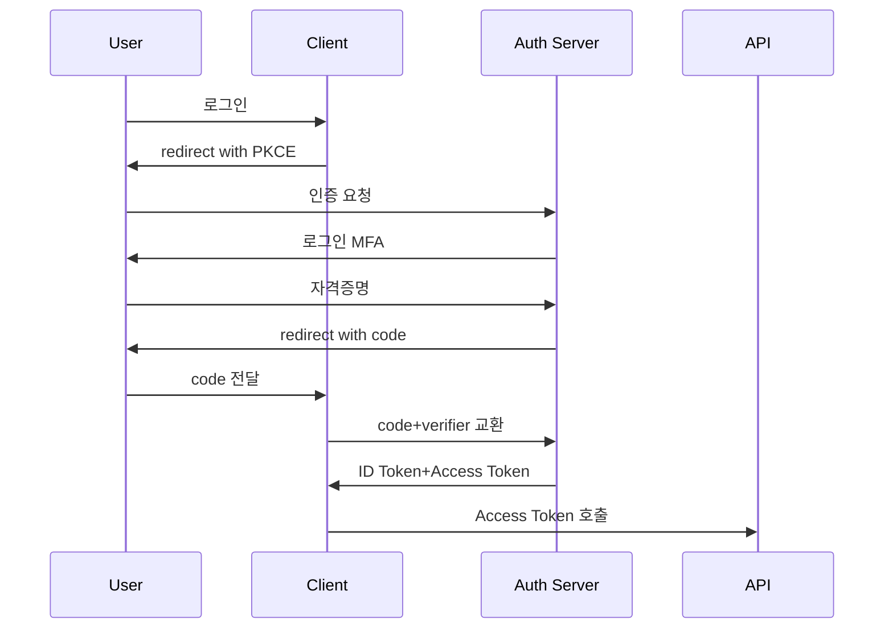
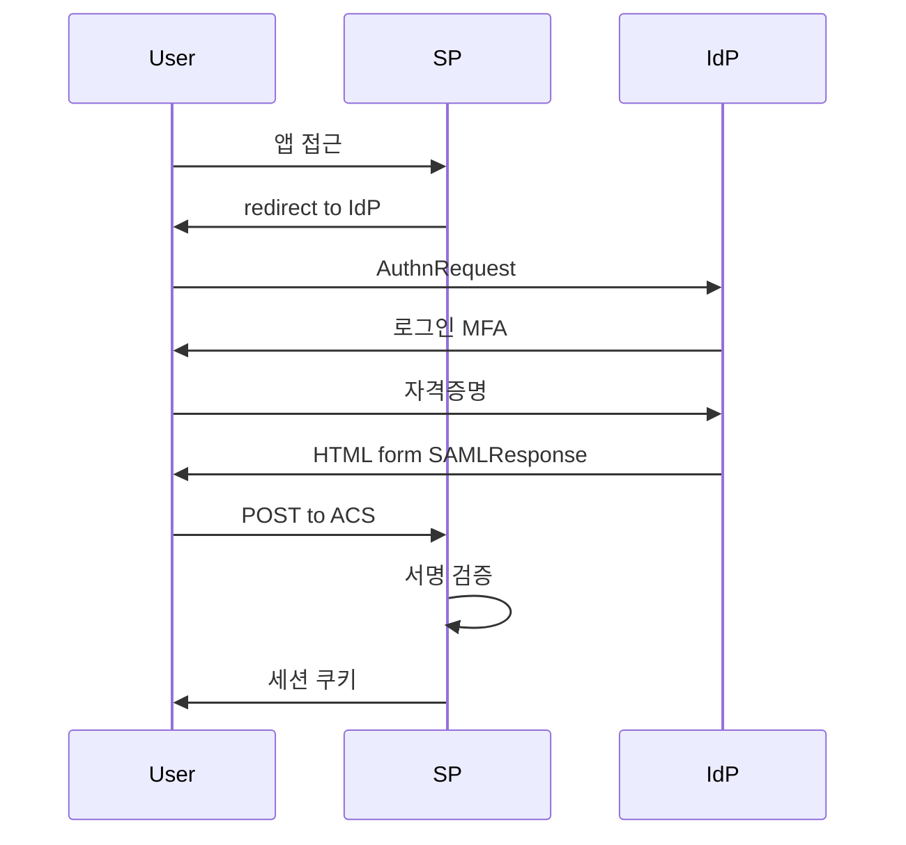
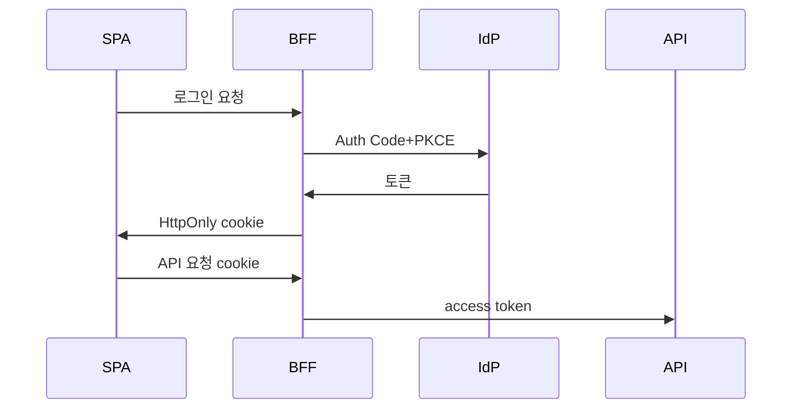
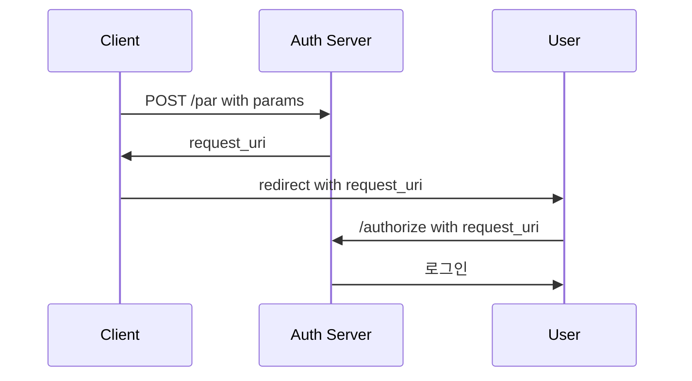
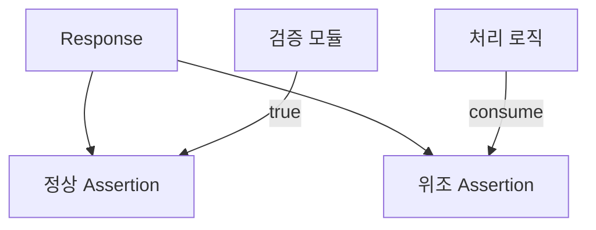

# OIDC·SAML

> **2026년 SSO의 진실**: 새 시스템은 **OIDC + OAuth 2.1 + PKCE**가 표준,
> 그러나 SAML 2.0은 ADFS·은행·정부·FedRAMP에서 향후 10년은 더 살아남는다.
> B2B SaaS는 둘 다 지원이 사실상 의무. 이 글은 두 프로토콜의 핵심·핸드셰이크·
> 보안 함정(XSW·token 검증)·실무 구현 패턴까지 글로벌 스탠다드 깊이로 다룬다.

- **이 글의 자리**: 보안 카테고리의 *Identity*. 워크로드 신원은
  [Workload Identity](workload-identity.md), Zero Trust 전체 모델은
  [Zero Trust](../principles/zero-trust.md). 이 글은 **사용자 SSO 프로토콜**.
- **선행 지식**: HTTP·TLS, JWT, 공개키 암호 기초.

---

## 1. 한 줄 정의

| 프로토콜 | 한 줄 |
|---|---|
| **OAuth 2.0/2.1** | 위임된 *인가* 프레임워크 — 토큰을 발급해 자원 접근 권한 부여 |
| **OIDC (OpenID Connect)** | OAuth 2.0 위 *인증* 레이어 — ID Token(JWT)으로 "누구인가" 추가 |
| **SAML 2.0** | XML 기반 *인증·인가* 통합 프로토콜 — Assertion으로 둘 다 표현 |

> **요점**: OAuth ≠ SSO 프로토콜. *위임 인가*. SSO는 인증이 핵심이라
> **OIDC** 또는 **SAML**이 답. 두 프로토콜의 가장 큰 차이는 **포맷**과
> **전송 방식** — JSON+REST(OIDC) vs XML+browser POST(SAML).

---

## 2. 표준 계보

| 연도 | 표준 | 비고 |
|---|---|---|
| 2002 | **SAML 1.0** | OASIS, web SSO 시작 |
| 2005 | **SAML 2.0** | 현재 사실상의 SAML 표준 |
| 2012 | **OAuth 2.0** (RFC 6749) | 위임 인가 |
| 2014 | **OpenID Connect 1.0** | OAuth 위 인증 레이어 |
| 2015 | **PKCE** (RFC 7636) | OAuth public client 보호 |
| 2020 | **RFC 8705** | mTLS client auth, certificate-bound tokens |
| 2021 | **RFC 9101 (JAR)** | JWT-Secured Authorization Request |
| 2021 | **RFC 9126 (PAR)** | Pushed Authorization Request |
| 2023 | **RFC 9449 (DPoP)** | sender-constrained token (proof-of-possession) |
| 2025-01 | **OAuth 2.0 Security BCP** (RFC 9700) | implicit·ROPC 지양, DPoP·PAR 권고 |
| 2025-02 | **FAPI 2.0 Security Profile (Final)** | 금융권용 강화 프로파일 (OpenID FAPI WG) |
| 2026-03 | **OAuth 2.1** (draft 15) | implicit·ROPC 제거, PKCE 의무 |

---

## 3. OIDC 핵심 흐름 — Authorization Code + PKCE

### 3.1 시퀀스



### 3.2 PKCE — public client 보호

| 단계 | 동작 |
|---|---|
| 1 | Client가 `code_verifier` 랜덤 생성 (43~128자) |
| 2 | `code_challenge = SHA256(verifier)` (base64url) |
| 3 | 인증 요청에 `code_challenge` 포함 |
| 4 | Auth Server가 code 발급 시 challenge 저장 |
| 5 | Client가 code 교환 시 `verifier` 제시 |
| 6 | Auth Server가 SHA256 검증 |

> **PKCE 의무화**: OAuth 2.1 draft-15는 **모든** Client(public·confidential
> 모두)에 PKCE 의무. confidential client도 client_secret만으로는 부족 —
> PKCE는 *authorization code 탈취* 방어 (서버 간 인증과 별개의 표면).
> 동등 보호를 제공하는 메커니즘(JAR + nonce 등)이면 예외 허용.

### 3.3 ID Token — JWT 구조

```json
{
  "iss": "https://idp.example.com",
  "sub": "user-1234",
  "aud": "client-id",
  "exp": 1745568000,
  "iat": 1745564400,
  "nonce": "n-0S6_WzA2Mj",
  "auth_time": 1745564400,
  "acr": "urn:mace:incommon:iap:silver",
  "amr": ["pwd", "mfa"],
  "email": "alice@example.com",
  "email_verified": true
}
```

### 3.4 ID Token 검증 8단계

| # | 검증 | 누락 시 위험 |
|:-:|---|---|
| 1 | 서명 검증 (JWKS의 키로 alg 일치) | 위조 토큰 통과 |
| 2 | `alg ≠ none` 거부 | unsigned 토큰 통과 |
| 3 | `iss` = 신뢰 IdP URL | 다른 IdP 토큰 통과 |
| 4 | `aud` = 자기 client_id 포함 | 다른 앱 토큰 재사용 |
| 5 | `exp` 미경과 | 만료 토큰 통과 |
| 6 | `iat`이 현재 ± clock skew(2~5분) | 미래·과거 토큰 |
| 7 | `nonce` = 요청 시 보낸 값 | replay |
| 8 | (있을 시) `acr`·`amr` 정책 충족 | MFA 우회 |

> **JWKS 캐시 주기**: 5~15분이 일반적. IdP 키 회전 시 즉시 검증 실패
> 막으려면 retry-on-fail로 한 번 더 fetch. **`kid`로 키 매칭** 필수.

---

## 4. SAML 2.0 핵심 흐름

### 4.1 SP-initiated Web Browser SSO



### 4.2 핵심 용어

| 용어 | 의미 |
|---|---|
| **IdP (Identity Provider)** | 인증 책임 — Okta·Entra ID·ADFS·Keycloak |
| **SP (Service Provider)** | 자원 제공·인가 — 앱 |
| **AuthnRequest** | SP→IdP 인증 요청 XML |
| **SAMLResponse** | IdP→SP 응답 XML, 서명·암호화 가능 |
| **Assertion** | "사용자 alice의 인증 사실"을 담은 XML 단위 |
| **ACS (Assertion Consumer Service)** | SP의 SAMLResponse 수신 endpoint |
| **Metadata** | IdP·SP의 entityID·인증서·endpoint XML |
| **NameID** | 사용자 식별자 (email·persistent·transient) |
| **Bindings** | 전송 방식 — HTTP-POST·Redirect·Artifact |

### 4.3 Assertion 구조 (요약)

```xml
<Assertion ID="..." IssueInstant="2026-04-25T10:00:00Z">
  <Issuer>https://idp.example.com</Issuer>
  <Signature>...</Signature>
  <Subject>
    <NameID Format="...emailAddress">alice@ex.com</NameID>
    <SubjectConfirmation>
      <SubjectConfirmationData
         Recipient="https://sp.example.com/acs"
         NotOnOrAfter="..."
         InResponseTo="_request-id"/>
    </SubjectConfirmation>
  </Subject>
  <Conditions NotBefore="..." NotOnOrAfter="...">
    <AudienceRestriction>
      <Audience>https://sp.example.com</Audience>
    </AudienceRestriction>
  </Conditions>
  <AuthnStatement AuthnInstant="..." SessionIndex="..."/>
  <AttributeStatement>...</AttributeStatement>
</Assertion>
```

### 4.4 SAML 검증 체크리스트

| # | 검증 | 누락 시 위험 |
|:-:|---|---|
| 1 | 서명 검증 — `Response`와 `Assertion` 중 어디 서명되었는지 확인 | 위조 |
| 2 | XML schema 검증 (로컬 trusted XSD) | XSW 공격 일부 |
| 3 | `Issuer` = 신뢰 IdP entityID | 다른 IdP |
| 4 | `Audience` = 자기 entityID | 다른 SP 토큰 재사용 |
| 5 | `NotBefore` ≤ now ≤ `NotOnOrAfter` (clock skew 고려) | replay |
| 6 | `InResponseTo` = SP가 보낸 RequestID | response forging |
| 7 | `SessionIndex`로 SLO 연계 | logout 누락 |
| 8 | Assertion ID 캐시로 재사용 차단 | replay |
| 9 | `Destination` = 자기 ACS URL | misrouted |
| 10 | XPath 사용 시 **절대 경로**, `getElementsByTagName` 회피 | XSW |

---

## 5. OIDC vs SAML 정면 비교

| 차원 | OIDC | SAML 2.0 |
|---|---|---|
| **포맷** | JSON (JWT) | XML (Assertion) |
| **전송** | REST + browser redirect | HTTP-POST + browser redirect |
| **암호화** | JWT 서명(JWS), 선택적 JWE | XML Signature, XML Encryption |
| **메타데이터** | `/.well-known/openid-configuration`, JWKS | XML metadata, X.509 인증서 |
| **키 회전** | JWKS 자동, kid 매칭 | 인증서 수동 교체 협조 필요 |
| **모바일·SPA** | 표준 (PKCE) | 부적합 (브라우저 리다이렉트 의존) |
| **M2M (서비스 간)** | OAuth Client Credentials | 미지원 (별도 구현) |
| **로그아웃** | RP-Initiated Logout, Back-Channel Logout, Session Mgmt | SLO (단방향·양방향) |
| **세션·attribute** | scope·claims | AttributeStatement |
| **취약점 자주** | redirect_uri 미검증, JWT alg confusion | XSW, XXE, replay |
| **구현 난이도** | 라이브러리 풍부, 테스트 쉬움 | XML·canonicalization 까다로움 |
| **엔터프라이즈** | 신규 시스템 표준 | 기존 ADFS·정부·금융권 잔존 |

> **B2B SaaS의 현실**: 신규 앱은 OIDC 우선, 그러나 엔터프라이즈 고객 중
> 큰 비중이 SAML 요구. *둘 다 지원* 또는 SSO 게이트웨이(Auth0·WorkOS·
> SSOJet)로 변환층을 두는 패턴 표준.

---

## 6. OAuth 2.1의 변경 — 무엇이 사라졌나

| 제거·금지 | 이유 |
|---|---|
| **Implicit flow** | access token이 URL fragment 노출, 리퍼러·로그·history 누출 |
| **Resource Owner Password Credentials (ROPC)** | 앱이 사용자 비밀번호 직접 받음 — phishing 표면 |
| **Bearer token in URL query** | 로그·proxy 누출 |
| 평문 PKCE | code_challenge_method=plain 금지, S256만 |

| 의무화 | 이유 |
|---|---|
| **PKCE (S256)** 모든 클라이언트 | code 탈취 방어 |
| **redirect_uri 정확 매칭** | open redirect 방어 |
| **refresh token rotation** (public client) | 탈취 시 손실 한정 |
| **TLS 전 구간** | 토큰 평문 노출 차단 |

> **마이그레이션**: 새 시스템은 OAuth 2.1 기반으로 시작. 레거시는 Implicit·
> ROPC 단계적 제거 — Auth Server가 두 플로우 비활성 가능 여부 우선 확인.

---

## 7. 토큰의 종류와 자리

### 7.1 OIDC가 발급하는 3종

| 토큰 | 대상 | 내용 | 검증 |
|---|---|---|---|
| **ID Token** | Client (앱) | 사용자 신원 (sub, email, MFA factor) | JWT 서명 + claims |
| **Access Token** | Resource Server (API) | 자원 접근 권한 (scope) | 서명 또는 introspection |
| **Refresh Token** | Auth Server (그 자체) | Access Token 재발급 | rotation, IdP 검증 |

### 7.2 흔한 실수

| 실수 | 결과 | 교정 |
|---|---|---|
| ID Token을 API 인증에 사용 | 의도 불일치, audience 검증 실패 | API는 Access Token |
| Access Token을 디코드해 사용자 정보 사용 | opaque token 가정 위반 | userinfo endpoint 또는 ID Token |
| Refresh Token을 SPA 브라우저에 저장 | XSS 시 영구 탈취 | BFF 패턴, HttpOnly cookie |
| nonce 검증 생략 | replay | 모든 OIDC 인증 흐름에서 nonce 의무 |

### 7.3 BFF (Backend For Frontend) 패턴

SPA·모바일에서 토큰을 브라우저에 저장하지 않고 백엔드 세션에 보관:



> **이유**: 브라우저 JS는 XSS 표면. BFF에서 token 보관 + 짧은 세션 쿠키만
> SPA에. 2026 OAuth 2.1 BCP 권고.

---

## 8. Sender-Constrained Tokens — DPoP·mTLS

Bearer token의 약점: **들고만 있으면 누구나 사용**. 탈취 시 만료까지 무방비.
해법은 토큰을 **클라이언트 신원에 묶는 것** (sender-constraining).

### 8.1 DPoP (RFC 9449)

| 단계 | 동작 |
|---|---|
| 1 | Client가 키 쌍 생성 (보통 EC P-256) |
| 2 | 인증·토큰 요청 시 `DPoP` 헤더에 JWT 포함 (이 키로 서명) |
| 3 | Auth Server가 access token에 `cnf.jkt` (key thumbprint) 바인딩 |
| 4 | API 호출 시 매번 `DPoP` 헤더 재서명 (htm·htu·iat 포함) |
| 5 | API가 token의 `jkt`와 DPoP 서명 키가 같은지 검증 |

> **효과**: 토큰 + DPoP 키 둘 다 탈취 안 되면 사용 불가. SPA·모바일도
> 적용 가능 (브라우저 `crypto.subtle`로 키를 non-extractable 생성).

### 8.2 mTLS Bound Token (RFC 8705)

| 단계 | 동작 |
|---|---|
| 1 | Client가 X.509 인증서로 Auth Server에 mTLS 연결 |
| 2 | Auth Server가 token에 `cnf.x5t#S256` (인증서 thumbprint) 바인딩 |
| 3 | API 호출 시 같은 인증서로 mTLS 연결 |
| 4 | API가 mTLS peer cert와 token thumbprint 일치 확인 |

> **선택 기준**:
> - **DPoP** — 모바일·SPA·서버 클라이언트, 인프라 변경 적음
> - **mTLS** — 서버↔서버, 금융권·B2B, PKI 운영 가능 환경
> - 둘 다 FAPI 2.0이 인정. 한 클라이언트에 둘 중 하나 의무.

---

## 9. 고급 요청 보호 — PAR·JAR·JARM

Front-channel(URL)에 인증 파라미터를 노출하는 OAuth 표준 자체의 약점:
- 브라우저 history·로그·proxy에 파라미터 누출
- redirect_uri tampering, scope upgrade attack

### 9.1 PAR (Pushed Authorization Request, RFC 9126)



- 인증 파라미터를 **back-channel**로 먼저 push, front-channel은 짧은
  request_uri만
- redirect_uri tampering·스코프 변조 차단

### 9.2 JAR (JWT-Secured Authorization Request, RFC 9101)

- 인증 파라미터를 **서명된 JWT**로 묶음 (`request` 또는 `request_uri`)
- 파라미터 위변조 방어 (서명) + 옵션 암호화

### 9.3 JARM (JWT-Secured Authorization Response Mode)

- 응답(code, state)도 서명된 JWT로 — **응답 측 위변조 방어**

> **FAPI 2.0 의무**: PAR + DPoP(or mTLS) + JAR(or PAR-with-signed-request).
> 일반 OAuth 2.1도 *권고*. 신규 구축 시 PAR은 채택 비용 낮음 — 한 endpoint
> 추가.

---

## 10. Client Authentication 방식

confidential client가 토큰 endpoint에 자신을 증명하는 방법:

| 방식 | 메커니즘 | 적합 |
|---|---|---|
| `client_secret_basic` | HTTP Basic, plaintext secret | 단순, 그러나 secret 평문 |
| `client_secret_post` | POST body의 secret | 비권장 (logging 위험) |
| `client_secret_jwt` | HMAC signed JWT (HS256), shared secret | 중간 — secret 노출 줄임 |
| `private_key_jwt` | RS256/ES256 signed JWT, **공개키만 IdP에 등록** | 권고 — secret 평문 X |
| `tls_client_auth` (RFC 8705) | mTLS 인증서 | M2M·금융권 표준 |
| `self_signed_tls_client_auth` | 자체 서명 인증서 + IdP 등록 | mTLS의 가벼운 형태 |
| `none` | 인증 없음 (public client) | PKCE로 대체 |

> **권고**: 신규 구축 = `private_key_jwt` 또는 `tls_client_auth`. 레거시
> `client_secret_*`는 secret 회전·관리 부담만 크고 보안은 약함.

---

## 11. FAPI 2.0 — 금융권 강화 프로파일

| 요건 | 내용 |
|---|---|
| **Sender-Constrained** | DPoP 또는 mTLS bound token 의무 |
| **PAR** | 인증 요청 back-channel push 의무 |
| **PKCE S256** | 의무 |
| **Client Auth** | private_key_jwt 또는 mTLS |
| **Authorization Response** | JARM 또는 PAR + 응답 서명 |
| **Algorithms** | PS256, ES256만 (RS256 비권고) |
| **Refresh Token** | sender-constrained, rotation 권고 |
| **CIBA** | 결제 승인 등 비대면 OTP 대체 채널 |

> **CIBA (Client-Initiated Backchannel Authentication)**: 콜센터·지점에서
> 사용자 폰으로 push 인증. FAPI 2.0과 함께 한국·EU 오픈뱅킹·결제 표준.

---

## 12. CAEP·SSF — 지속 검증 표준

OIDC 토큰은 발급 후 만료 전까지 *static*. 그 사이 사용자가 해고되거나
디바이스가 분실돼도 토큰은 유효 — 한 번 인증 = 평생 통과의 함정.

| 표준 | 역할 |
|---|---|
| **SSF** (Shared Signals Framework) | IdP·SaaS·EDR 간 보안 이벤트 표준 (subject·event·iss) |
| **CAEP** (Continuous Access Evaluation Protocol) | SSF의 한 프로파일 — 세션 무효화·토큰 폐기·MFA 변화 |
| **RISC** (Risk Incident Sharing & Coordination) | 계정 침해 신호 공유 |

**전형 흐름**: IdP가 위험 이벤트 감지 → SSF로 모든 SaaS에 push → 각
SaaS가 세션·토큰 즉시 무효. SAML SLO의 brittle 한계 우회.

> Google Workspace·Okta·Microsoft Entra가 SSF/CAEP 발신·수신 지원
> (2025~). Zero Trust의 "지속 검증" 실체.

---

## 13. SAML 보안 함정 — XSW와 친구들

### 13.1 XML Signature Wrapping (XSW)

공격자가 정상 서명된 Assertion 옆에 위조 Assertion을 끼워넣음.
SP의 **서명 검증 모듈**과 **assertion 처리 로직**이 다른 노드를 보면 통과.



### 13.2 방어

| 방어 | 설명 |
|---|---|
| **schema 사전 검증** (로컬 XSD) | 비표준 element 거부 |
| **절대 XPath**로 서명 대상 직접 참조 | `getElementsByTagName` 회피 |
| **canonical form**으로 서명 대상 명시 | C14N 일관 |
| **서명 위치 강제** (Response 또는 Assertion 둘 중 하나만) | 양쪽 허용 시 우회 |
| **트러스트 인증서 화이트리스트** | 임의 인증서 통과 차단 |

### 13.3 다른 SAML 위험

| 공격 | 방어 |
|---|---|
| **XXE (XML External Entity)** | DTD·external entity 비활성 (libxml `LIBXML_NONET` 등) |
| **replay** | Assertion ID 캐시, NotOnOrAfter 엄격 |
| **Open Redirect via RelayState** | RelayState whitelist 또는 서명 |
| **NameID 충돌** | persistent·targeted ID 사용 권고 |
| **서명되지 않은 Response 수용** | 서명 의무화, IdP 메타데이터 신뢰 |

> **OWASP SAML Cheat Sheet**가 가장 좋은 단일 참조. 자체 SAML 구현 금지
> (검증된 라이브러리 — Spring Security SAML, python-saml, ruby-saml,
> OneLogin, simpleSAMLphp 사용).

---

## 14. OIDC 보안 함정

| 공격 | 설명 | 방어 |
|---|---|---|
| **JWT `alg=none`** | unsigned 토큰 수용 | `alg` 화이트리스트, `none` 거부 |
| **alg confusion (HS256↔RS256)** | RSA 공개키를 HMAC 비밀키로 사용해 토큰 위조 | 알고리즘 사전 확정, 검증 키와 alg 매칭 |
| **kid 조작** | 외부 URL·SQL injection 통한 키 fetch | `kid`는 JWKS 키 식별자만, 외부 URL 불허 |
| **redirect_uri injection** | 토큰 탈취 | exact match + PAR로 front-channel 노출 차단 |
| **mix-up (multi-IdP)** | 다른 IdP의 응답을 받아들임 | `iss` 검증 + per-IdP state |
| **CSRF on callback** | 사용자 세션에 공격자 토큰 주입 | `state` parameter 의무 |
| **Refresh Token 탈취** | 평생 access | rotation + family revoke + DPoP/mTLS 바인딩 |
| **잘못된 audience** | API가 다른 클라이언트의 토큰 수용 | `aud` 엄격 검증, `resource` 파라미터(RFC 8707) |
| **front-channel 파라미터 변조** | scope upgrade | PAR(RFC 9126), JAR(RFC 9101) |
| **Token confused-deputy** | 한 API 토큰을 다른 API에 재사용 | Resource Indicators(RFC 8707), Token Exchange(RFC 8693) |

---

## 15. 부속 표준·운영 endpoint

| 표준 | 역할 |
|---|---|
| **RFC 7662 Token Introspection** | opaque access token의 활성·scope·sub 조회 |
| **RFC 7009 Token Revocation** | 사용자 로그아웃·로그아웃 정리 시 토큰 강제 폐기 |
| **RFC 8693 Token Exchange** | 마이크로서비스 chain에서 토큰 down-scope·서비스 위임 |
| **RFC 8707 Resource Indicators** | 발급 시 `resource` 파라미터로 audience 명시 |
| **OIDC Federation 1.0 (2024 Final)** | 다중 IdP federation, 학술망·정부망 |
| **SCIM (RFC 7644)** | 사용자 provisioning — JIT 외 표준 lifecycle (생성·삭제·그룹) |

> **B2B SaaS 규준**: SAML SSO + SCIM provisioning 짝이 사실상 표준.
> JIT는 신규 사용자 onboarding만 다루고 *deactivation·그룹 동기화*가 안 됨 —
> 사용자 해고 시 SaaS 측 계정 정리 누락이 주요 위협.

---

## 16. 실무 구현 — IdP·라이브러리·도구

### 16.1 IdP 선택

| IdP | 강점 | 약점 |
|---|---|---|
| **Okta / Auth0** | 완성도, 대형 enterprise | 가격, vendor lock-in |
| **Microsoft Entra ID** | Office 365 통합, Conditional Access | 학습 곡선, ADFS 잔재 |
| **Google Workspace** | 단순, BeyondCorp 통합 | 정책 표현력 제한 |
| **Keycloak** | OSS, on-prem, 풍부한 기능 | 운영 부담, scale 시 튜닝 |
| **Authentik / Zitadel** | 모던 OSS, 가벼움 | 생태계 작음 |
| **Dex** | k8s OIDC 게이트웨이로 가벼움 | UI 없음, 다른 IdP에 의존 |
| **AWS IAM Identity Center / GCP Cloud Identity** | 클라우드 통합 | 멀티 클라우드 단점 |

### 16.2 라이브러리

| 언어 | OIDC | SAML |
|---|---|---|
| **Go** | `coreos/go-oidc`, `golang.org/x/oauth2` | `crewjam/saml`, `russellhaering/gosaml2` |
| **Python** | `authlib`, `python-jose`, `oic` | `python3-saml`, `python-saml` |
| **Java** | Spring Security OAuth, Nimbus OIDC SDK | Spring Security SAML, OpenSAML |
| **Node.js** | `openid-client`, `passport-openidconnect` | `passport-saml`, `node-saml` |
| **Ruby** | `omniauth-openid-connect` | `ruby-saml`, `omniauth-saml` |

> **자체 구현 금지**. 서명·canonicalization·XPath의 미묘한 차이가 모두
> 취약점이 된다. 검증된 라이브러리를 최신 패치로.

### 16.3 K8s에서 OIDC

**레거시 (단일 issuer)** — `--oidc-*` flag:

```yaml
--oidc-issuer-url=https://idp.example.com
--oidc-client-id=kubernetes
--oidc-username-claim=email
--oidc-groups-claim=groups
```

**Structured Authentication Configuration (1.30+ Beta)** — 다중 issuer·CEL:

```yaml
apiVersion: apiserver.config.k8s.io/v1beta1
kind: AuthenticationConfiguration
jwt:
  - issuer:
      url: https://idp.example.com
      audiences: [kubernetes]
    claimMappings:
      username:
        expression: 'claims.email'
      groups:
        expression: 'claims.groups'
    claimValidationRules:
      - expression: 'claims.hd == "example.com"'
```

| 패턴 | 설명 |
|---|---|
| **kubelogin** | `kubectl` 플러그인, 브라우저로 OIDC 인증 후 token 캐시 |
| **Dex** | k8s 앞단 OIDC 게이트웨이, GitHub·LDAP 등 broker |
| **Pinniped** | k8s 멀티 클러스터 OIDC, federation |
| **OIDC + RBAC** | groups claim → ClusterRoleBinding |

### 16.4 ArgoCD·Grafana·Vault 등 SSO

| 앱 | OIDC | SAML |
|---|---|---|
| ArgoCD | Dex 또는 직접 OIDC | OIDC 권장, SAML 가능 |
| Grafana | OIDC native | SAML enterprise 라이선스 필요 |
| Vault | OIDC auth method | 미지원 |
| Jenkins | OIDC plugin | SAML plugin |

---

## 17. SLO·세션 관리

### 17.1 OIDC 로그아웃

| 메커니즘 | 설명 |
|---|---|
| **RP-Initiated Logout** | Client → Auth Server `end_session_endpoint`, `id_token_hint` 전달 |
| **Back-Channel Logout** | Auth Server → Client에 logout token 직접 푸시 (서버↔서버) |
| **Front-Channel Logout** | iframe으로 다중 Client에 로그아웃 알림 |
| **Session Management** | iframe + postMessage로 세션 상태 polling (deprecated 추세) |

### 17.2 SAML SLO

| 종류 | 흐름 |
|---|---|
| 단방향 (`HTTP-Redirect`) | 한 SP만 알림, 사실상 부분 로그아웃 |
| 양방향 (`SOAP·HTTP-POST`) | IdP가 모든 SP에 LogoutRequest, 모두 응답 |

> **현실**: SAML SLO는 구현·디버깅이 어렵고 brittle. 대안은 **세션 짧게**·
> **IdP 세션과 SP 세션 분리**·**CAEP 도입**으로 IdP 신호 push.

---

## 18. 안티패턴

| 안티패턴 | 결과 | 교정 |
|---|---|---|
| OAuth Implicit flow를 새 SPA에 사용 | URL fragment 토큰 노출 | Auth Code + PKCE |
| ROPC로 모바일 로그인 직접 구현 | phishing·credential 누출 | 시스템 브라우저 + Auth Code + PKCE |
| Refresh Token을 localStorage에 | XSS로 영구 탈취 | BFF + HttpOnly cookie 또는 mobile secure storage, DPoP 바인딩 |
| Bearer token만 사용, sender-constraining 없음 | 토큰 탈취 = 영구 사용 | DPoP(RFC 9449) 또는 mTLS bound(RFC 8705) |
| client_secret_basic만 사용 | secret 평문, 회전 부담 | private_key_jwt 또는 tls_client_auth |
| 인증 파라미터 front-channel 그대로 | redirect tampering, scope upgrade | PAR(RFC 9126) 또는 JAR(RFC 9101) |
| SAML JIT만으로 사용자 동기화 | deactivation 누락 | SCIM 병행, 정기 reconcile |
| `email` claim을 권한 식별자로, 다중 IdP에서 같은 email 가능 | tenant 우회 | `iss + sub` 합성 키 |
| nonce·state 검증 생략 | replay·CSRF | 모두 의무 |
| `aud` 검증 안 함 | 다른 클라이언트 토큰 재사용 | 엄격 일치 |
| `alg`을 토큰 헤더 그대로 신뢰 | alg confusion (`none`·HS256↔RS256) | 알고리즘 사전 화이트리스트 |
| JWKS 캐시 영원 | 키 회전 시 사고 | TTL + retry-on-fail re-fetch |
| ID Token을 API 인증에 사용 | audience 불일치, 정책 회피 | API는 Access Token |
| SAML Response 서명만 검증·Assertion 서명 미검증 | XSW로 위조 assertion 통과 | 서명 위치 강제 |
| `getElementsByTagName`로 SAML element 선택 | XSW 표면 | 절대 XPath |
| RelayState 검증 없이 redirect | open redirect | whitelist 또는 서명 |
| 자체 SAML 구현 | canonicalization 함정 | 검증된 라이브러리 |
| IdP 메타데이터 manual 복붙 | 인증서 회전 시 사고 | metadata URL 자동 fetch |
| SLO 미구현으로 1주 세션 유지 | 단말 분실 시 영구 접근 | 짧은 세션 + CAEP 또는 IdP→SP push |
| MFA를 SMS·OTP로만 | phishing | FIDO2/WebAuthn (passkey) 지원 |
| OIDC `email` claim을 권한 식별자로 | 사용자가 메일 변경 시 escalation | `sub`(고정) 사용 |

---

## 19. 운영 체크리스트

- [ ] 신규 시스템: OIDC + OAuth 2.1 + PKCE + state + nonce
- [ ] Sender-constrained token 도입 — DPoP 또는 mTLS bound
- [ ] 인증 요청은 PAR + JAR — front-channel 파라미터 차단
- [ ] Implicit·ROPC flow 사용처 인벤토리·제거
- [ ] SAML 라이브러리 latest, XSW·XXE 패치 확인
- [ ] ID Token 검증 8단계 모두 — 서명·iss·aud·exp·nonce
- [ ] SAML 검증 — 서명 위치, schema, XPath, Assertion ID 캐시
- [ ] Refresh Token rotation, reuse 감지 시 family revoke
- [ ] BFF 또는 mobile secure storage — 브라우저 storage X
- [ ] redirect_uri exact match, RelayState whitelist
- [ ] JWKS 캐시 TTL + retry, kid 매칭
- [ ] IdP metadata URL 자동 fetch, 인증서 회전 자동
- [ ] phishing-resistant MFA (FIDO2/WebAuthn) 강제
- [ ] SLO·세션 짧게, CAEP/SSF 도입 검토
- [ ] 자체 OIDC·SAML 구현 금지 — 검증된 라이브러리만
- [ ] 인증·인가 이벤트 audit log → SIEM
- [ ] `sub` 기반 권한 매핑 (email·name 변경 안전)
- [ ] enterprise 고객용 SAML + 신규 OIDC 양립 — SSO 게이트웨이 검토
- [ ] Client auth는 private_key_jwt·tls_client_auth — secret 평문 회피
- [ ] SCIM provisioning 병행 — JIT만으론 deactivation 누락
- [ ] 금융권 등 강한 요건은 FAPI 2.0 프로파일 채택
- [ ] CAEP/SSF로 IdP→SP 세션 무효화 (지속 검증)
- [ ] Token Exchange + Resource Indicators로 confused-deputy 방어
- [ ] passkey-first 정책으로 단계 전환

---

## 참고 자료

- [OpenID Connect Core 1.0](https://openid.net/specs/openid-connect-core-1_0.html) (확인 2026-04-25)
- [OAuth 2.1 Draft 15 (2026-03)](https://datatracker.ietf.org/doc/draft-ietf-oauth-v2-1/) (확인 2026-04-25)
- [RFC 7636 — PKCE](https://datatracker.ietf.org/doc/html/rfc7636) (확인 2026-04-25)
- [RFC 9700 — OAuth 2.0 Security BCP](https://datatracker.ietf.org/doc/html/rfc9700) (확인 2026-04-25)
- [RFC 9449 — DPoP](https://datatracker.ietf.org/doc/html/rfc9449) (확인 2026-04-25)
- [RFC 8705 — mTLS Client Auth & Cert-Bound Tokens](https://datatracker.ietf.org/doc/html/rfc8705) (확인 2026-04-25)
- [RFC 9126 — Pushed Authorization Requests (PAR)](https://datatracker.ietf.org/doc/html/rfc9126) (확인 2026-04-25)
- [RFC 9101 — JWT-Secured Authorization Request (JAR)](https://datatracker.ietf.org/doc/rfc9101/) (확인 2026-04-25)
- [RFC 8693 — Token Exchange](https://datatracker.ietf.org/doc/html/rfc8693) (확인 2026-04-25)
- [RFC 8707 — Resource Indicators](https://datatracker.ietf.org/doc/html/rfc8707) (확인 2026-04-25)
- [FAPI 2.0 Security Profile (Final, 2025-02)](https://openid.net/specs/fapi-security-profile-2_0-final.html) (확인 2026-04-25)
- [OpenID Shared Signals / CAEP](https://openid.net/wg/sharedsignals/) (확인 2026-04-25)
- [SAML 2.0 — OASIS](https://docs.oasis-open.org/security/saml/v2.0/saml-core-2.0-os.pdf) (확인 2026-04-25)
- [OWASP SAML Security Cheat Sheet](https://cheatsheetseries.owasp.org/cheatsheets/SAML_Security_Cheat_Sheet.html) (확인 2026-04-25)
- [OWASP — On Breaking SAML (USENIX 2012)](https://www.usenix.org/system/files/conference/usenixsecurity12/sec12-final91.pdf) (확인 2026-04-25)
- [PortSwigger — Novel SAML Bypasses](https://portswigger.net/research/the-fragile-lock) (확인 2026-04-25)
- [WorkOS — SAML SSO Vulnerabilities and Footguns](https://workos.com/blog/fun-with-saml-sso-vulnerabilities-and-footguns) (확인 2026-04-25)
- [Connect2id — How to validate an OIDC ID token](https://connect2id.com/blog/how-to-validate-an-openid-connect-id-token) (확인 2026-04-25)
- [Microsoft — ID token claims reference](https://learn.microsoft.com/en-us/entra/identity-platform/id-token-claims-reference) (확인 2026-04-25)
- [Auth0 — Authorization Code with PKCE](https://auth0.com/docs/get-started/authentication-and-authorization-flow/authorization-code-flow-with-pkce) (확인 2026-04-25)
