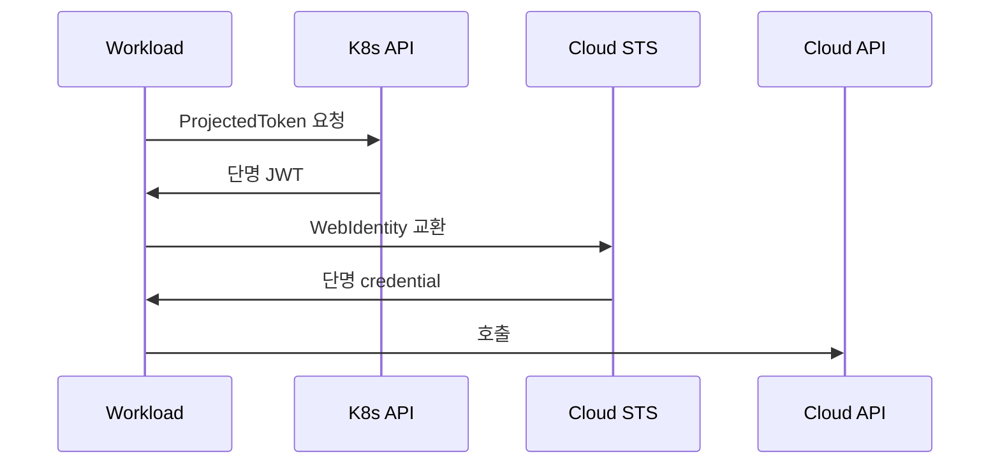
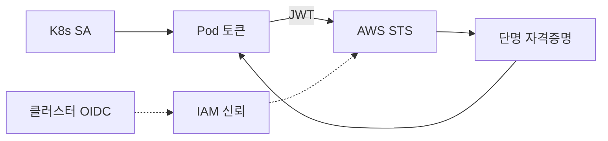
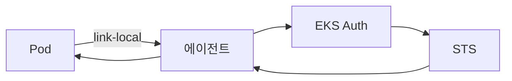
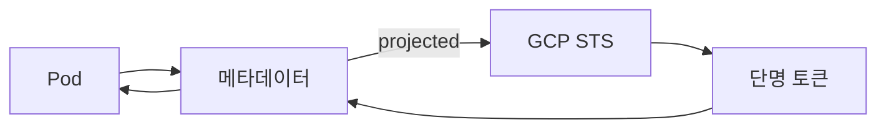
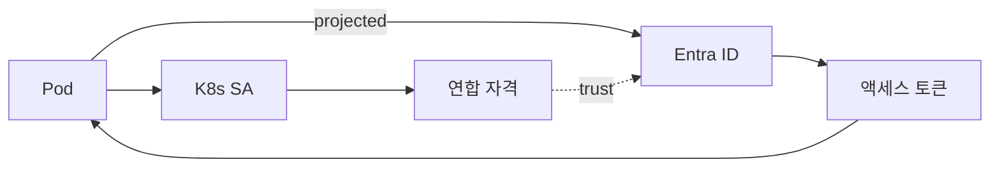
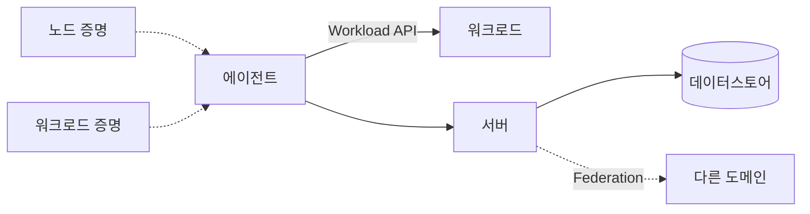
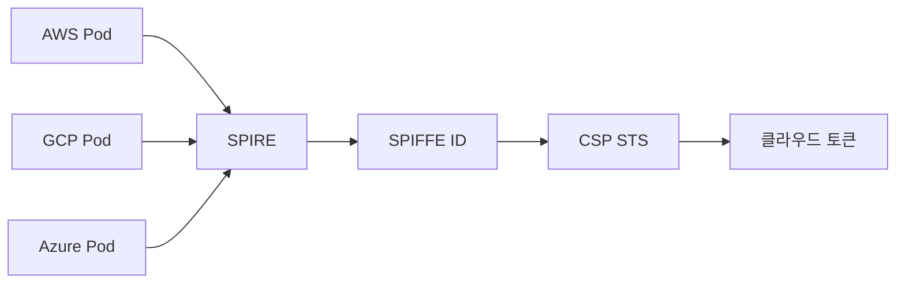

# Workload Identity

> **2026년 워크로드 신원의 진실**: 더 이상 정적 액세스 키를 컨테이너에
> 마운트하지 않는다. 표준은 **단명·동적·연합 신원**. CSP별로 IRSA(EKS),
> EKS Pod Identity, GKE Workload Identity Federation, Azure Workload Identity,
> 멀티/온프레는 **SPIFFE/SPIRE**가 사실상의 표준. 이 글은 4가지 구현의
> 내부 동작·선택 기준·마이그레이션·안티패턴까지 글로벌 스탠다드 깊이로 다룬다.

- **이 글의 자리**: 보안 카테고리의 *Identity (machine)*. 사용자 SSO는
  [OIDC·SAML](oidc-saml.md), 시크릿 저장은 [Vault 기본](../secrets/vault-basics.md),
  Zero Trust 모델은 [Zero Trust](../principles/zero-trust.md). 이 글은
  **워크로드(서비스·Pod·CI 잡)의 신원**.
- **선행 지식**: K8s ServiceAccount, OIDC, JWT, mTLS.

---

## 1. 한 줄 정의

> **Workload Identity**는 "사람이 아닌 워크로드(Pod·VM·Function·CI Job)가
> *자신의 신원*으로 자원에 접근하도록, 정적 자격증명 없이 **단명 토큰·
> 인증서**를 발급받는 패턴"이다.

- 반대 패턴: AWS access key를 Secret으로 마운트, 서비스 계정 JSON 키
- 핵심 가치: **유출 시 탈취 표면 최소화**, 자동 회전, 권한 추적 가능

---

## 2. 왜 정적 키가 죽었나

| 문제 | 정적 키 | 워크로드 ID |
|---|---|---|
| 회전 | 수동, 실패 시 사고 | 자동, 분 단위 |
| 유출 표면 | 평생 유효 | 단명 (보통 1시간) |
| 권한 분리 | 키마다 별도 사용자 가장 | Pod/SA 단위 자동 분리 |
| 추적 | 누가 썼는지 불명확 | CloudTrail·audit에 SA 컨텍스트 |
| 운영 | 100개 서비스 = 100개 회전 | zero touch |

> **현실 사고**: GitHub 공개 리포에 access key 누출 → 봇이 1분 내 스캔
> → 분 단위 마이닝 머신 띄움 → 청구서. AWS 보안 사고 1위. 워크로드 ID는
> 이 표면을 본질적으로 제거.

---

## 3. 공통 원리 — OIDC Token Exchange



| 단계 | 핵심 |
|---|---|
| 1 | K8s가 Pod에 **Projected ServiceAccount Token** 마운트 (audience 지정) |
| 2 | 토큰의 `iss`는 클러스터 OIDC issuer URL |
| 3 | Cloud STS가 issuer 신뢰·trust 정책으로 Web Identity Federation |
| 4 | STS가 단명 cloud credential 발급 |
| 5 | Pod이 cloud SDK로 호출 — credential 자동 주입 |

> **세 가지 핵심**: (1) 클러스터를 OIDC IdP로 **신뢰 등록**, (2) Service
> Account → Cloud IAM role/identity **매핑**, (3) **단명 토큰 자동 회전**.

---

## 4. AWS — IRSA vs EKS Pod Identity

### 4.1 IRSA (IAM Roles for Service Accounts)



| 단계 | 동작 |
|---|---|
| 1 | EKS 클러스터의 OIDC issuer를 IAM에 IdP로 등록 |
| 2 | IAM Role의 trust policy: `system:serviceaccount:NS:SA` 조건 |
| 3 | K8s SA에 `eks.amazonaws.com/role-arn` 어노테이션 |
| 4 | mutating webhook이 Pod에 Projected Token + 환경변수 주입 |
| 5 | AWS SDK가 `AssumeRoleWithWebIdentity` 호출 |

| 설정 | 값 |
|---|---|
| 토큰 만료 | 기본 1시간, 최대 12시간 (실무 권고는 1시간 유지 — 늘리지 말 것) |
| 토큰 마운트 경로 | `/var/run/secrets/eks.amazonaws.com/serviceaccount/token` |
| 환경변수 | `AWS_ROLE_ARN`, `AWS_WEB_IDENTITY_TOKEN_FILE` |

### 4.2 EKS Pod Identity (2023~)



> Agent는 host network로 동작, 노드별 link-local `169.254.170.23` 노출
> (IMDS의 `169.254.169.254`와 다른 IP). Pod이 IMDS를 직접 호출하지 못해도
> 이 IP는 닿게 함.

| 단계 | 동작 |
|---|---|
| 1 | EKS API에 `PodIdentityAssociation` 생성 (cluster·namespace·SA·role) |
| 2 | DaemonSet `eks-pod-identity-agent`가 노드에 IMDS-like 엔드포인트 제공 |
| 3 | Pod이 `169.254.170.23/v1/credentials`로 호출 |
| 4 | Agent가 EKS Auth API 거쳐 STS credential 반환 |

### 4.3 IRSA vs Pod Identity — 정면 비교

| 차원 | IRSA | EKS Pod Identity |
|---|---|---|
| **OIDC 설정** | 클러스터마다 IAM IdP 등록 | 불필요 (EKS API 사용) |
| **Trust policy** | role마다 cluster OIDC 조건 | 불필요 — EKS Auth가 매개 |
| **Role 재사용** | trust policy 수정 필요 | 같은 role을 여러 cluster에 |
| **세션 태그** | 없음 (수동) | 자동 (`eks-cluster-name`, `kubernetes-pod-name`) |
| **OS 지원** | Linux + Windows | **Linux only** (2026-04 기준) |
| **Fargate** | 지원 | **미지원** — IRSA 필요 |
| **마이그** | 기존 - | non-disruptive 병행 가능 |
| **Cross-account** | trust policy로 가능 | 가능 (target role의 trust 필요) |
| **AWS 권고** | 잔존 OK | **신규 cluster 기본** |

> **선택 기준**: 신규·동일 OS = Pod Identity. Windows·Fargate·이미 잘
> 동작 = IRSA. 마이그 시 *둘 다 활성*하고 단계적 전환 (Pod 어노테이션
> 또는 association 양쪽 모두 인식).

### 4.4 GitHub Actions·CI에서 AWS

CI 잡도 워크로드 — `aws-actions/configure-aws-credentials`로 OIDC 페더레이션:

```yaml
permissions:
  id-token: write
  contents: read
steps:
  - uses: aws-actions/configure-aws-credentials@v4
    with:
      role-to-assume: arn:aws:iam::123:role/ci-role
      aws-region: us-east-1
```

GitHub의 OIDC issuer를 IAM에 IdP 등록 + role의 trust에 `repo:org/repo:*`
조건 — 정적 키 0.

---

## 5. GCP — Workload Identity Federation

### 5.1 GKE 내부 (Workload Identity Federation for GKE)



| 단계 | 동작 |
|---|---|
| 1 | 클러스터 활성화: `--workload-pool=PROJECT.svc.id.goog` |
| 2 | K8s SA에 `iam.gke.io/gcp-service-account` 어노테이션 (또는 직접 IAM role) |
| 3 | 노드의 GKE metadata server가 169.254.169.254 IMDS 흉내 |
| 4 | Pod의 google-cloud SDK가 default credential로 자동 호출 |

> Autopilot은 항상 활성. Standard는 `gcloud container clusters update`로 enable.
> *낡은 metadata 직접 노출 차단* — Pod이 노드 SA를 도용 못함.

### 5.2 외부 워크로드 (Workload Identity Federation)

GitHub Actions, GitLab, AWS EC2, Azure VM, 임의 OIDC IdP에서 GCP 호출:

| 객체 | 역할 |
|---|---|
| **Workload Identity Pool** | 외부 신원 모음 |
| **Workload Identity Provider** | 외부 IdP 신뢰 등록 (OIDC·SAML·AWS) |
| **Attribute Mapping** | 외부 token claim → GCP 속성 |
| **Attribute Condition** | 추가 검증 (예: repo·branch) |
| **Service Account Impersonation** | 외부 신원이 GCP SA 가장 |

```bash
gcloud iam workload-identity-pools providers create-oidc github \
  --workload-identity-pool=ci-pool \
  --issuer-uri=https://token.actions.githubusercontent.com \
  --attribute-mapping=google.subject=assertion.sub
```

> **GKE WI vs GCP WIF**: 2024년 Google이 둘을 *Workload Identity Federation*
> 우산 아래 통합·리브랜딩했지만 동작은 별개. 전자는 *GKE 안* 워크로드 전용
> (GKE metadata server 매개), 후자는 *외부 임의* OIDC/SAML/AWS 신원의 GCP
> 페더레이션. 한 클러스터가 둘 다 활용 가능.

---

## 6. Azure — Microsoft Entra Workload ID

### 6.1 AKS Workload Identity



| 단계 | 동작 |
|---|---|
| 1 | AKS에 OIDC issuer + Workload Identity 활성 |
| 2 | User-Assigned Managed Identity 또는 App Registration 생성 |
| 3 | 그 위에 **Federated Identity Credential** 추가 — issuer·subject(`system:serviceaccount:NS:SA`)·audience |
| 4 | K8s SA에 `azure.workload.identity/client-id` 어노테이션 |
| 5 | Pod 라벨 `azure.workload.identity/use=true`로 mutating webhook이 토큰 주입 |
| 6 | Azure SDK가 `AZURE_FEDERATED_TOKEN_FILE`로 페더레이션 |

| 제약 | 값 |
|---|---|
| 한 Managed Identity당 FIC 수 | **20개** |
| Subject 매칭 | 정확 일치 (`system:serviceaccount:NS:SA`) |
| 전파 시간 | 수 초 |

### 6.2 (구) Pod Identity의 deprecation

Azure AD Pod Identity(open source `aad-pod-identity`)는 **2022-10 deprecate**,
**AKS 관리형 add-on은 2025-09 EOS** — 2026년 4월 시점은 이미 패치·지원
없음. 즉시 Workload Identity로 마이그 의무. 차이는 NMI DaemonSet 없이
OIDC token exchange로 단순화.

---

## 7. SPIFFE / SPIRE — 표준·구현

### 7.1 SPIFFE 핵심

| 개념 | 설명 |
|---|---|
| **SPIFFE ID** | URI 형식 신원 — `spiffe://example.org/ns/prod/sa/payments` |
| **Trust Domain** | SPIFFE ID의 호스트 — 한 신뢰 영역 |
| **SVID (SPIFFE Verifiable Identity Document)** | 신원을 담은 단명 자격증명 |
| **X509-SVID** | X.509 인증서, SAN URI에 SPIFFE ID — mTLS 직결 |
| **JWT-SVID** | JWT, sub에 SPIFFE ID — HTTP/REST에 |
| **Workload API** | Unix domain socket으로 SVID·Trust Bundle 노출 |
| **Trust Bundle** | trust domain의 root CA·JWK 공개키 묶음 |

### 7.2 SPIRE 컴포넌트



| 컴포넌트 | 역할 |
|---|---|
| **SPIRE Server** | trust domain의 CA·SVID 발급, 등록 정보 관리 |
| **SPIRE Agent** | 노드 위에서 동작, Workload API 노출, 노드·워크로드 attestation |
| **Node Attestor** | 노드 신원 증명 — AWS IID·GCP IIT·Azure MSI·k8s SAT·k8s PSAT·x509·**TPM(2)** |
| **Workload Attestor** | 프로세스 속성 증명 (Linux uid·gid, k8s namespace·SA·image hash, docker, systemd) |

> **k8s SAT vs PSAT**: SAT(Service Account Token)는 legacy long-lived
> token에 의존, PSAT(Projected SAT)는 단명 projected token + audience
> 검증 — **PSAT가 보안 권고**. 새 클러스터는 PSAT만 사용.

> **TPM Attestation**: 베어메탈·엣지에서 노드의 하드웨어 키로 신원 증명
> (Bloomberg `spire-tpm-plugin`, Red Hat Keylime 통합). VM·k8s 신원이
> 없는 환경에서 표준.
| **Registration Entry** | "이 SPIFFE ID는 이 selector 만족 시 발급" 룰 |

### 7.3 Attestation 흐름 — 진짜 보안

| 단계 | 동작 |
|---|---|
| 1 | Agent 부팅 시 Node Attestor로 노드 신원 증명 (AWS IID·Azure MSI·k8s PSAT 등) |
| 2 | Server가 Agent에게 노드 SVID 발급 |
| 3 | Workload가 Workload API socket 호출 |
| 4 | Agent가 Workload Attestor로 호출 프로세스 속성 수집 (k8s pod label·namespace·SA, container image hash) |
| 5 | Server의 Registration Entry와 selector 매칭 |
| 6 | 매칭되는 SPIFFE ID에 SVID 발급 |
| 7 | TTL 만료 전 자동 rotation |

> **핵심**: SPIRE는 *검증된 사실*에 신원을 발급. 워크로드가 자신의 ID를
> 주장하는 게 아니라 OS·k8s가 본 사실(uid·namespace·label) 기반.
> *위조 불가*.

### 7.4 SPIFFE Federation

| 패턴 | 설명 |
|---|---|
| **Bundle Endpoint** | 다른 trust domain의 root를 HTTPS로 동기화 |
| **Cross-domain SVID** | A 도메인 워크로드가 B 도메인 자원에 mTLS |
| **SPIRE Federation** | server-to-server bundle 교환 자동화 |
| **`https_web` profile** | 일반 웹 PKI(브라우저 trust)로 endpoint 인증 |
| **`https_spiffe` profile** | SPIFFE-internal 인증서로 상호 인증 (권고) |

> 양방향(mutual) federation은 양쪽이 서로의 bundle endpoint 등록.
> 단방향은 한쪽만. 키 교체는 bundle refresh 주기에 따라 전파(보통 5~10분).
> 멀티 클러스터·멀티 클라우드·M&A·B2B에서 표준.

### 7.5 Trust Domain 설계

| 패턴 | 적합 |
|---|---|
| **단일 trust domain** (`acme.com`) | 작은 조직, 모든 환경 한 도메인 |
| **환경별 분리** (`prod.acme.com`, `dev.acme.com`) | 프로덕션 격리 우선 |
| **사업부별 분리** | 권한 분리·M&A 흡수 |
| **클러스터별 분리** | 멀티 클러스터, federation으로 연결 |

> SPIFFE 운영의 첫 번째 결정. 단일은 단순하나 권한 폭이 크고, 분리는
> federation 부담. 보통 *환경별*이 default.

### 7.6 어디에 통합

| 시스템 | 통합 |
|---|---|
| **Istio** | mTLS의 신원으로 SPIFFE ID native (`spiffe://cluster.local/ns/...`) |
| **Linkerd** | identity controller가 SPIFFE-like 발급 |
| **Envoy** | SDS API로 SPIRE에서 SVID fetch |
| **Cilium** | Cilium ID에 SPIFFE 매핑 |
| **HashiCorp Consul** | service mesh identity로 SPIFFE |
| **Vault** | JWT-SVID로 auth method |
| **Tetragon** | SPIFFE ID 기반 정책 |

---

## 8. 4가지 구현 — 정면 비교

| 차원 | IRSA / Pod Identity | GKE WI | Azure WI | SPIFFE/SPIRE |
|---|---|---|---|---|
| **범위** | EKS | GKE | AKS | 모든 환경 (k8s·VM·온프레) |
| **신원 표현** | IAM Role | GCP SA | Managed Identity | SPIFFE ID (URI) |
| **토큰** | STS credential | GCP access token | Entra access token | X509-SVID·JWT-SVID |
| **만료** | 1h~12h | ~1h | ~1h | 분 단위 가능 |
| **회전** | SDK 자동 | 자동 | 자동 | Agent 자동 |
| **mTLS 통합** | 별도 (mTLS는 Mesh) | 별도 | 별도 | **native** (X509-SVID) |
| **멀티 클라우드** | 어려움 | 외부는 WIF | 어려움 | **표준** |
| **온프레** | X | X | X | **지원** |
| **CSP 종속** | 강 | 강 | 강 | **무** |
| **운영 부담** | 낮음 (관리형) | 낮음 | 낮음 | 중 (자체 운영) |

> **선택 가이드**:
> - 단일 CSP·k8s만 = CSP-native (Pod Identity·GKE WI·Azure WI)
> - 멀티 클러스터·멀티 CSP·VM 혼합 = SPIFFE/SPIRE
> - Service Mesh 도입 중 = 자동 SPIFFE (Istio·Linkerd·Cilium)

---

## 9. 멀티 클라우드 패턴

### 9.1 SPIFFE 한 layer로 통일



- 워크로드는 한 SPIFFE ID만 인지
- SPIFFE → 각 CSP로 페더레이션 — AWS WebIdentity, GCP WIF, Azure FIC
- 모든 CSP의 OIDC IdP로 SPIRE 자체 또는 SPIRE → 외부 IdP

### 9.2 GitHub Actions 단일 진입

GitHub OIDC를 모든 CSP에 IdP 등록 + 잡당 단명 자격증명. 빌드 머신에 정적 키 0.

### 9.3 GitHub Actions OIDC `sub` claim

| sub 형식 | 의미 |
|---|---|
| `repo:org/repo:ref:refs/heads/main` | main 브랜치 push |
| `repo:org/repo:pull_request` | PR (fork에서 트리거 시 위험) |
| `repo:org/repo:environment:prod` | 보호된 environment |
| `repo:org/repo:ref:refs/tags/v*` | 태그 |

> trust policy를 `repo:org/repo:*`로만 두면 fork PR에서도 발급. **권고**:
> `repo:org/repo:environment:prod` 등 보호된 environment + branch
> 보호 룰 조합. 결제·인프라 변경은 environment approval 강제.

### 9.4 Cross-CSP 페더레이션

CSP-native에서도 멀티 CSP 가능: 한 CSP의 SA 토큰이 다른 CSP의 IdP로
신뢰될 수 있음. 예: GCP WIF가 EKS의 OIDC issuer를 신뢰 등록 → EKS Pod이
GCP 자원 접근. SPIRE 도입 부담이 큰 조직의 경량 옵션.

---

## 10. 서버리스·VM 워크로드 ID

| 환경 | 신원 주입 |
|---|---|
| **AWS Lambda** | Execution Role의 STS credential 자동 주입 (`AWS_EXECUTION_ENV`) |
| **AWS ECS/Fargate Task** | Task Role, container metadata endpoint |
| **GCP Cloud Run** | 자동 SA, metadata server `169.254.169.254` |
| **GCP Cloud Functions** | 함수의 SA 자동 |
| **Azure Functions** | Managed Identity (System·User assigned) |
| **Azure Container Apps** | Managed Identity, AKS WI와 동일 모델 |
| **EC2/GCE/Azure VM** | Instance Identity (IMDS), AWS IMDSv2 / GCP IIT / Azure IMDS |

> **공통 원리**: 컴퓨트가 metadata endpoint로 단명 토큰 주입. 직접 키
> 마운트 X. 서버리스에서 정적 secret 사용은 거의 항상 안티패턴.

---

## 11. K8s 기본 ServiceAccount Token의 자리

ServiceAccount는 자동으로 토큰을 받지만 두 종류:

| 종류 | 특징 |
|---|---|
| **Legacy SA token** (1.24-) | secret으로 자동 생성, **만료 X**, K8s API 전용 |
| **Projected token** (BoundServiceAccountTokenVolume, 1.22+ 기본) | 단명, audience·만료 시간 지정 |

### 11.1 K8s 1.24+ 변경

- 기본 SA token secret 자동 생성 중단 (KEP-1205 BoundServiceAccountTokenVolume)
- Pod에 마운트되는 토큰은 **projected** — 1시간 만료, kubelet이 자동 rotation
- 장기 토큰이 필요하면 명시적으로 `kubernetes.io/service-account-token` 타입
  secret 생성 (annotation `kubernetes.io/service-account.name`) — **권장 X**
- 레거시 앱이 secret 마운트를 가정하면 마이그 시 깨질 수 있음 — 코드 재검토

### 11.2 audience 지정의 중요성

```yaml
spec:
  serviceAccountName: payments
  containers:
  - name: app
    volumeMounts:
    - mountPath: /var/run/secrets/sts
      name: aws-token
  volumes:
  - name: aws-token
    projected:
      sources:
      - serviceAccountToken:
          audience: sts.amazonaws.com
          expirationSeconds: 3600
          path: token
```

> **audience**가 없으면 토큰은 K8s API 전용. cloud STS는 audience 검증으로
> 토큰 오용 방지. confused deputy 표준 방어.

### 11.3 Confused Deputy — 구체 시나리오

워크로드 A가 K8s 기본 SA token(audience 미지정)을 받음. 누군가 그 토큰을
탈취해 AWS STS에 그대로 제출. STS가 audience를 검증하지 않으면 토큰을
유효한 cluster 토큰으로 보고 AssumeRoleWithWebIdentity 통과 — A가 의도하지
않은 cloud 자원 접근. **방어**: token에 audience(`sts.amazonaws.com` 등)
명시 + STS의 trust policy가 audience도 검증.

---

## 12. Vault Workload ID 통합

Vault는 워크로드 ID 발급의 게이트웨이로 자주 사용:

| Auth Method | 동작 | 보안 특성 |
|---|---|---|
| **`kubernetes`** | Vault가 K8s `TokenReview` API로 SA 토큰 검증 | **즉시 폐기 인지** (SA 삭제·토큰 회수 즉시 반영) |
| **`jwt/oidc`** | Vault가 K8s OIDC discovery URL로 JWKS fetch, 서명만 검증 | 만료 전까지 유효 (폐기 즉시 반영 X) |
| **`aws`** | IAM 또는 EC2 instance 신원 검증 | IRSA·노드 IAM 활용 |
| **`gcp`** | GCE instance 또는 SA JWT 검증 | GKE WI 토큰 활용 |
| **`azure`** | Azure AD 토큰·MSI 검증 | AKS WI 토큰 활용 |
| **`cert`** | mTLS 클라이언트 인증서 (SPIFFE X509-SVID) | SPIFFE/SPIRE 통합 |
| **JWT-SVID auth** | SPIFFE JWT-SVID 직접 | SPIFFE-only 환경 |

> **k8s vs jwt/oidc 차이**: k8s auth는 매 인증마다 K8s API 호출(폐기 즉시
> 반영, 그러나 부하). jwt/oidc는 JWKS 캐시로 빠르나 **폐기 즉시 반영 X**.
> 보안 민감하면 k8s, 부하 우려는 jwt/oidc + 짧은 토큰 TTL.

> 워크로드 ID로 Vault에 인증 → Vault가 동적 시크릿 발급 → 워크로드가
> DB·SaaS 호출. [Vault 기본](../secrets/vault-basics.md)·[ESO](../secrets/external-secrets-operator.md) 참조.

---

## 13. IMDSv2 — 노드 metadata 보호

| 항목 | IMDSv1 | IMDSv2 |
|---|---|---|
| **흐름** | GET 직접 | PUT으로 토큰 발급(`X-aws-ec2-metadata-token-ttl-seconds`) → GET with `X-aws-ec2-metadata-token` |
| **TTL** | 무관 | 1초~6시간 (토큰) |
| **SSRF 방어** | 약함 (GET 단발로 노출) | 강함 (PUT 필요, X-Forwarded 헤더 거부) |
| **hop limit** | 기본 1 | 기본 1, 컨테이너에서 64로 풀리면 위험 |

### 13.1 EKS 노드 보호

```hcl
metadata_options {
  http_tokens                 = "required"   # IMDSv2만
  http_put_response_hop_limit = 1            # Pod에서 도달 차단
  http_endpoint               = "enabled"
}
```

> EKS 신규 클러스터·관리형 노드 그룹은 2024년부터 default가 IMDSv2. 그러나
> **자체 launch template은 명시 필요**. hop=1이 핵심 — Pod의 user namespace는
> 1 hop이라 IMDS에 도달 안 함.

### 13.2 GCP Metadata Concealment

GKE는 자동으로 *metadata concealment proxy* 설정 — Pod이 노드의 SA·
인증 정보 직접 조회 불가. Workload Identity 활성 시 자동.

### 13.3 Azure IMDS

Pod 내부에서 IMDS 호출 가능하나 Workload Identity 활성 시 노드 MSI가
자동 노출되지 않게 구성 — IMDS 차단은 NetworkPolicy로 별도.

---

## 14. Audit·추적성

| CSP | 추적 단서 |
|---|---|
| **AWS CloudTrail** | `userIdentity.sessionContext.sessionIssuer` = IAM Role ARN, `principalId` = `AROAxxx:botocore-session-...` (IRSA) 또는 EKS Pod Identity 자동 세션 태그(`eks-cluster-name`, `kubernetes-namespace`, `kubernetes-pod-name`) |
| **GCP Cloud Audit Logs** | `authenticationInfo.principalSubject` = `serviceAccount:NAME@PROJECT.iam`, `principalEmail` |
| **Azure Activity Log** | Managed Identity의 `principalId`, `oid` claim |
| **K8s Audit** | SA 토큰 사용은 `user.username = system:serviceaccount:NS:SA` |

> **Pod Identity의 결정적 가치**: 자동 세션 태그로 *어느 Pod의 어느 SA가*
> 무슨 호출을 했는지 CloudTrail만으로 추적 가능. IRSA는 추가 태그 수동 부여.

---

## 15. 안티패턴

| 안티패턴 | 결과 | 교정 |
|---|---|---|
| AWS access key를 K8s Secret으로 마운트 | 유출 시 영구 접근 | IRSA 또는 Pod Identity |
| GCP SA JSON 키를 Secret에 | git·image에 누출 | Workload Identity Federation |
| 노드 IAM role의 광범위 권한을 모든 Pod이 공유 | 한 Pod 침해 = 전체 권한 | 노드 IMDS 차단 + Pod ID |
| IMDSv1 활성, hop limit 높음 | SSRF로 노드 credential 탈취 | IMDSv2 강제, hop=1 |
| IRSA의 trust policy를 와일드카드 SA | 다른 namespace에서 임의 가장 | NS:SA 정확 매칭 |
| Pod Identity association을 Linux+Windows 혼합 cluster에 | Windows Pod 실패 | OS 분리 또는 IRSA 병행 |
| SPIRE Workload Attestor selector를 약하게 | 다른 Pod이 ID 가장 | namespace·SA·container image 결합 |
| Federated Identity Credential subject 와일드카드 | 다른 SA가 가장 | 정확 subject 매칭 |
| audience 미지정 SA token을 STS에 | 토큰 confused deputy | audience 의무 |
| IdP token TTL 12시간 | 탈취 시 장시간 사용 | 1시간 이하, refresh로 회전 |
| 워크로드 ID를 사람 IAM과 혼용 | 권한 추적 어려움 | 사람·워크로드 IAM 분리 namespace |
| GitHub Actions OIDC trust에 repo만 | fork·branch로 가장 | `sub` 조건에 repo + ref |
| Pod이 노드 metadata 직접 호출 가능 | 노드 SA 도용 | GKE Metadata Concealment, EKS hop limit |
| SPIRE Server 분실 시 backup 없음 | trust domain 전체 재발급 | 정기 backup, HA |
| Workload Identity로 모든 권한을 한 SA에 몰빵 | least privilege 위반 | 서비스마다 SA + IAM 분리 |
| credential을 환경변수로 자식 프로세스에 전달 | exec·log 누출 | Workload API 직접 호출 |
| 외부 IdP token 검증 없이 cloud STS 신뢰 | trust 우회 | iss·aud·signature 다 |

---

## 16. 마이그레이션 전략

| From | To | 방법 |
|---|---|---|
| AWS access key Secret | IRSA | Secret 마운트 제거 + SA 어노테이션, 검증 후 정적 키 폐기 |
| IRSA | EKS Pod Identity | association 추가 후 SDK 재시작 시 자동 인식 (Pod Identity 우선) |
| GCP SA JSON 키 | GKE WI | 클러스터 wi 활성, SA 어노테이션, JSON 키 회수 |
| Azure Pod Identity | Azure WI | aad-pod-identity 제거, FIC 추가, label 갱신 |
| 단일 CSP CSP-native | SPIFFE/SPIRE | SPIRE 도입 + Mesh 통합, CSP-native는 외곽에 유지 |

> 모든 마이그는 **병행 운영 → 검증 → 폐기** 3단계. 검증 단계에서 확인할 것:
> - CloudTrail의 `userIdentity` 변화 (정적 키 사용 → IRSA·Pod Identity)
> - IAM access key의 `LastUsedDate` 0 또는 30일+
> - IAM Access Analyzer의 미사용 권한 보고
> - 정적 키 회수는 audit 로그 기반 사용처 0 확인 후.

---

## 17. 운영 체크리스트

- [ ] 모든 cloud 자격증명: 정적 키 → 워크로드 ID 마이그
- [ ] EKS 신규: Pod Identity 우선, 레거시·Windows·Fargate는 IRSA
- [ ] GKE: Workload Identity Federation 활성, 노드 metadata concealment
- [ ] AKS: Workload Identity, aad-pod-identity 제거
- [ ] CI 잡: GitHub/GitLab OIDC + 클라우드 페더레이션, 정적 키 0
- [ ] SA token audience 지정 — confused deputy 방어
- [ ] IAM role trust policy: SA 정확 매칭, 와일드카드 X
- [ ] 멀티 클러스터·멀티 CSP·온프레 = SPIFFE/SPIRE 검토
- [ ] Service Mesh의 신원 = SPIFFE ID로 통일
- [ ] IMDSv2 강제, hop limit=1, Pod의 노드 metadata 차단
- [ ] 워크로드 토큰 TTL 짧게 (1시간 이하)
- [ ] 사람 IAM·워크로드 IAM 분리 (namespace·prefix)
- [ ] CloudTrail·audit에 SA·Pod 컨텍스트 캡처 — 추적성
- [ ] SPIRE Server·Datastore HA·backup
- [ ] Federation은 bundle endpoint 자동 동기화
- [ ] credential 환경변수 노출 금지 — Workload API 직접
- [ ] IMDSv2 강제 + hop limit=1, EKS 신규 cluster default 확인
- [ ] AKS aad-pod-identity 잔존 시 Workload Identity 마이그 즉시 (2025-09 EOS)
- [ ] Vault 통합은 k8s auth(즉시 폐기) vs jwt/oidc auth(빠르나 폐기 지연) 선택 명확
- [ ] 서버리스(Lambda·Cloud Run·Functions)는 Execution Role·SA만, secret 0
- [ ] Trust Domain 설계 (단일 vs 환경별 vs 사업부별) 결정·문서화
- [ ] OIDC discovery URL 등록 시 JWKS·issuer·audience 검증 정책

---

## 참고 자료

- [SPIFFE Concepts](https://spiffe.io/docs/latest/spiffe-about/spiffe-concepts/) (확인 2026-04-25)
- [SPIRE Concepts](https://spiffe.io/docs/latest/spire-about/spire-concepts/) (확인 2026-04-25)
- [SPIFFE — Working with SVIDs](https://spiffe.io/docs/latest/deploying/svids/) (확인 2026-04-25)
- [AWS — IRSA](https://docs.aws.amazon.com/eks/latest/userguide/iam-roles-for-service-accounts.html) (확인 2026-04-25)
- [AWS Blog — EKS Pod Identity (2023)](https://aws.amazon.com/blogs/containers/amazon-eks-pod-identity-a-new-way-for-applications-on-eks-to-obtain-iam-credentials/) (확인 2026-04-25)
- [Datadog Security Labs — EKS Pod Identity Deep Dive](https://securitylabs.datadoghq.com/articles/eks-pod-identity-deep-dive/) (확인 2026-04-25)
- [GKE — Workload Identity Federation for GKE](https://cloud.google.com/kubernetes-engine/docs/concepts/workload-identity) (확인 2026-04-25)
- [GCP — Workload Identity Federation](https://cloud.google.com/iam/docs/workload-identity-federation) (확인 2026-04-25)
- [Microsoft — Workload Identity Federation](https://learn.microsoft.com/en-us/entra/workload-id/workload-identity-federation) (확인 2026-04-25)
- [AKS — Workload Identity Overview](https://learn.microsoft.com/en-us/azure/aks/workload-identity-overview) (확인 2026-04-25)
- [Azure WI — Federated Identity Credential](https://azure.github.io/azure-workload-identity/docs/topics/federated-identity-credential.html) (확인 2026-04-25)
- [GitHub Actions — Configure AWS Credentials](https://github.com/aws-actions/configure-aws-credentials) (확인 2026-04-25)
