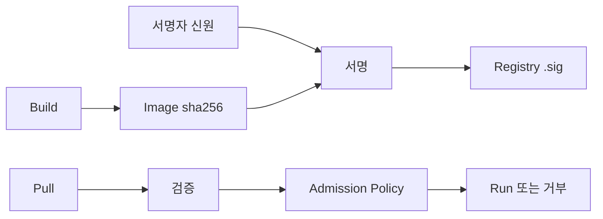
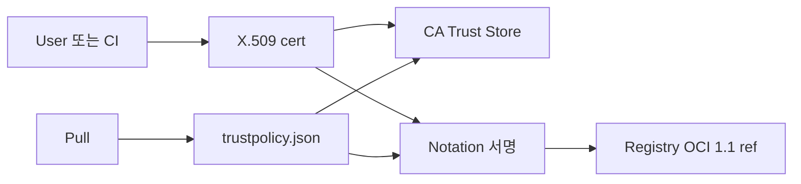
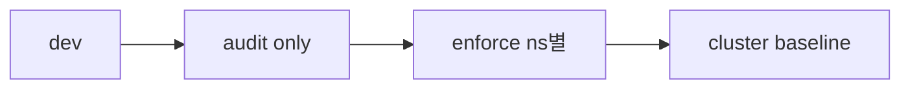
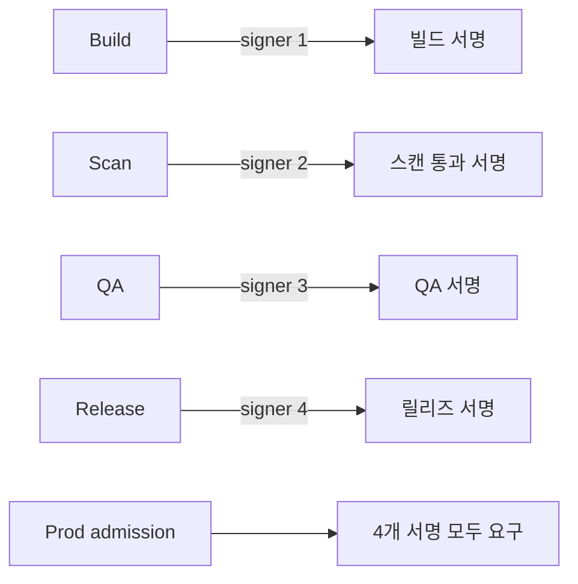

# 이미지 서명

> **2026년의 자리**: 컨테이너 이미지 서명은 *공급망 보안의 첫 단추*. 빌드된
> 아티팩트의 출처와 무결성을 *암호학적*으로 보장. 2026년 표준은 두 갈래 —
> **Sigstore Cosign 3.x** (CNCF, keyless 중심, 2025-10 GA)과 **Notary Project
> Notation v1.3** (CNCF, X.509 PKI 중심, 2025-02 GA). 둘 다 OCI 1.1 ref
> 스펙을 사용해 서명을 *registry*에 저장.

- **이 글의 자리**: [Sigstore 공급망](../supply-chain/sigstore.md)·[SLSA](../supply-chain/slsa.md)와
  짝. 정책 enforcement는 [OPA·Gatekeeper](../policy/opa-gatekeeper.md),
  [Kyverno](../policy/kyverno.md). SBOM은 [SBOM](sbom.md).
- **선행 지식**: OCI 이미지 매니페스트, 컨테이너 레지스트리, X.509·PKI,
  OIDC 기본.

---

## 1. 한 줄 정의

> **이미지 서명**: "OCI 이미지 디지스트(`sha256:...`)에 대한 암호학적 서명을
> 발급·검증해, **누가 빌드했고 변조되지 않았음**을 보장."



---

## 2. 왜 이미지 서명인가

| 위협 | 서명으로 방어 |
|---|---|
| **악성 이미지 push** (레지스트리 침해) | 서명 없는 이미지 거부 → 정상 빌드 외 배포 불가 |
| **digest 변조** | `sha256` 매칭 + 서명 검증 — 위변조 즉시 탐지 |
| **타이포스쿼팅** (`alpine` vs `alpaine`) | trust policy로 *발행자 신원* 강제 |
| **CI 침해 후 임의 배포** | OIDC 기반 keyless = CI 신원 자체에 묶임 |
| **SLSA Level 2~3** | 서명·provenance 의무 — 서명이 진입 조건 |

> **실 사고 사례**: SolarWinds(2020), Codecov bash uploader(2021), 3CX 공급망
> 침해(2023) — 모두 *공급망 단계의 변조*가 원인. 이미지 서명은 *최종 산출물*에
> 대한 마지막 방어선.

---

## 3. 두 표준 — Cosign vs Notation

| 차원 | **Sigstore Cosign** | **Notary Project Notation** |
|---|---|---|
| **거버넌스** | CNCF Incubating (2022-09) | CNCF Incubating (2022-12) |
| **서명 모델** | **keyless** (OIDC + 단명 cert) 또는 키 기반 | **X.509 PKI** 기반 (CA + 사용자 키) |
| **CA** | Fulcio (Sigstore 공용) 또는 자체 | 조직 PKI 또는 클라우드 CA (AWS Signer 등) |
| **투명성 로그** | Rekor (Sigstore) — 모든 서명 공개 | 옵션 (timestamping authority) |
| **서명 알고리즘** | ECDSA-P256 (RFC 6979) | RSA·ECDSA·Ed25519 |
| **신뢰 모델** | "OIDC 신원 + 짧은 cert + 투명성 로그" | "신뢰 CA + 사용자 cert" |
| **Trust Policy** | 검증 시 `--certificate-identity`·`--certificate-oidc-issuer` | `trustpolicy.json` 파일 (verification level·trusted identities) |
| **레지스트리 저장** | OCI 1.1 referrers / `.sig` 태그 | OCI 1.1 referrers (표준) |
| **태깅 호환** | 옛 fallback `.sig` tag, 새로 referrers | referrers만 |
| **K8s admission** | `policy-controller` (Sigstore), Kyverno, Gatekeeper | `ratify`, `connaisseur`, custom admission |
| **OSS 채택** | Kubernetes·Distroless·Tekton·CNCF 다수 | AWS·MS·Verizon 등 |

> **선택**: 클라우드 native·OSS 통합·OIDC 단명 신원이 자연스러우면 **Cosign**.
> 엔터프라이즈 PKI·기존 X.509 인프라·HSM 의무면 **Notation**. 둘 다 *서로
> 동일 이미지에 공존* 가능 (서명 두 종 push).

---

## 4. Sigstore Cosign — 깊이 있게

### 4.1 두 가지 서명 모드

| 모드 | 동작 |
|---|---|
| **Keyless** (권장) | OIDC 토큰 → Fulcio가 단명(10min) cert 발급 → 서명 → Rekor에 기록 |
| **Key-based** | 사용자 ECDSA 키 (`cosign generate-key-pair`) — 키 관리 책임 |
| **KMS-backed** | AWS KMS·GCP KMS·Azure KV·HashiCorp Vault Transit 통합 — HSM 가능 |

### 4.2 Keyless 흐름 (요약)

OIDC 토큰 → Fulcio 단명 cert → 서명 → Rekor 투명성 로그 기록 → 레지스트리에
서명 push. 자세한 내부 동작·Fulcio·Rekor·TUF 모델은
[supply-chain/sigstore](../supply-chain/sigstore.md) 참조. 본 글은 *서명·검증
운영*에 집중.

**검증 시**:

```bash
cosign verify ghcr.io/example/app:v1.0 \
  --certificate-identity=https://github.com/acme/app/.github/workflows/build.yml@refs/heads/main \
  --certificate-oidc-issuer=https://token.actions.githubusercontent.com
```

| 검증 항목 | 의미 |
|---|---|
| 서명 자체 | ECDSA-P256으로 검증 |
| cert 만료 | Rekor의 entry 시점이 cert 유효 기간 내 (단명 cert는 *제출 시점*만 유효) |
| OIDC 발행자 | `--certificate-oidc-issuer` 매칭 |
| 발행자 신원 | `--certificate-identity` 매칭 (예: GH Actions workflow path) |
| Rekor entry | 투명성 로그에 존재 (offline 검증도 가능) |

### 4.3 Cosign 핵심 명령

```bash
# 1. 빌드 후 서명 (keyless, GH Actions에서)
cosign sign ghcr.io/example/app@sha256:abc...

# 2. 검증
cosign verify ghcr.io/example/app:v1.0 \
  --certificate-identity-regexp="https://github.com/acme/.+" \
  --certificate-oidc-issuer=https://token.actions.githubusercontent.com

# 3. 첨부 — SBOM·attestation
cosign attest --predicate sbom.spdx.json \
  --type spdxjson ghcr.io/example/app@sha256:abc...

# 4. 정책 검증
cosign verify-attestation ghcr.io/example/app:v1.0 \
  --type slsaprovenance \
  --policy policy.cue

# 5. 키 기반 (KMS)
cosign sign --key awskms:///alias/release-key ghcr.io/example/app@sha256:abc...
```

### 4.4 OCI 1.1 referrers vs 옛 `.sig` 태그

| 방식 | 동작 |
|---|---|
| **`.sig` 태그** (옛) | `<digest>.sig` 별도 태그로 저장 — 태그 충돌·gc 어려움 |
| **OCI 1.1 referrers** (표준) | 같은 매니페스트의 *referrer*로 저장 — registry가 자동 연결 |
| **referrers tag schema 폴백** | referrers API 미지원 레지스트리에서 `<digest>.sha256-...` 자동 사용 |

> **Cosign 3.x (2025-10) 기본 = referrers + standardized bundle format**.
> 2.x는 `.sig` 옵션. 2026년 주요 레지스트리(GCR·ECR·Docker Hub·Harbor·GHCR·ACR)
> 가 referrers API 지원. 일부 환경(JFrog Artifactory 구버전·Quay 옛 release·
> Nexus)은 *referrers tag schema 폴백*으로 동작 — mirror 운영 시 *두 형식 공존*
> 주의.

### 4.4.1 Sigstore Bundle 포맷 (Cosign 3.x)

Cosign 3.0부터 standardized bundle format(`*.sigstore.json`) 사용 — 서명·cert·
inclusion proof 한 파일에. *offline 검증* 및 attestation 휴대성 향상.

### 4.5 Cosign 핵심 함정

| 함정 | 설명 |
|---|---|
| `--insecure-ignore-tlog` | Rekor 검증 끄면 *공개 투명성 보호 손실* — prod 금지 |
| `cosign verify` 없이 `cosign verify-attestation` | 둘은 *다름* — 서명 검증과 attestation 검증 |
| `--certificate-identity` regex 광범위 | 한 organization 전체 trust = 침해 표면 큼 |
| 옛 `cosign verify` 명령 (1.x) | API 변경 — 2.x로 마이그 |
| OIDC issuer가 변경 (예: GH Actions URL 변경) | 검증 실패 → policy 갱신 |
| Public Sigstore vs Private (자체 Fulcio/Rekor) | trust root 다름 — `--rekor-url`, TUF 설정 |

---

## 5. Notation — 깊이 있게

### 5.1 모델



| 컴포넌트 | 역할 |
|---|---|
| **Notation CLI** | 서명·검증 도구 (`notation sign`, `notation verify`) |
| **Trust Store** | 신뢰하는 CA 인증서 모음 (`~/.config/notation/truststore/x509/ca/<store>`) |
| **Trust Policy** | `trustpolicy.json` — 어떤 이미지에 어떤 CA·신원 적용 |
| **Plugin** | AWS Signer, AKV, GCP KMS 등 |
| **TSA** (옵션) | RFC 3161 timestamping — cert 만료 후에도 서명 유효 |

### 5.2 Trust Policy 예

```json
{
  "version": "1.0",
  "trustPolicies": [
    {
      "name": "prod",
      "registryScopes": ["registry.acme.com/prod/*"],
      "signatureVerification": { "level": "strict" },
      "trustStores": ["ca:acme-prod-ca"],
      "trustedIdentities": [
        "x509.subject:CN=Build Bot,O=Acme,C=US"
      ]
    },
    {
      "name": "dev-permissive",
      "registryScopes": ["registry.acme.com/dev/*"],
      "signatureVerification": { "level": "permissive" },
      "trustStores": ["ca:acme-dev-ca"],
      "trustedIdentities": ["*"]
    }
  ]
}
```

| Verification Level | 동작 |
|---|---|
| **strict** | integrity·authenticity·expiry·revocation·timestamp 모두 강제 |
| **permissive** | integrity·authenticity 강제, expiry·revocation은 *log only* |
| **audit** | integrity 강제, 그 외는 log only |
| **skip** | 모든 검증 비활성 |

> v1.1 spec은 항목별 `override` 맵 지원 — 예: `"revocation": "log"`,
> `"expiry": "skip"`로 *세밀 조정*. 실무에서 자주 쓰임.

> **GHSA-57wx-m636-g3g8** (Notation): permissive trust policy는 *침해된
> registry로부터 rollback 공격*에 취약. **prod는 strict 의무**. permissive는
> 임시·테스트 외 사용 금지.

> **Notation v1.3 (2025-02)**: revocation check가 *기본 활성*. OCSP 1순위 +
> CRL fallback, CRL cache 지원. 옛 v1.0~1.2의 "기본 비활성" 가정으로 운영하면
> *오래된 매뉴얼대로 설정 후 검증 실패 폭주* 위험.

### 5.3 Notation 핵심 명령

```bash
# 1. CA 추가
notation cert add --type ca --store acme-prod-ca acme-root.pem

# 2. trust policy 적용
notation policy import trustpolicy.json

# 3. 서명 (AWS Signer plugin)
notation sign \
  --plugin com.amazonaws.signer.notation.plugin \
  --id "arn:aws:signer:us-east-1:111:/signing-profiles/acme-prod" \
  registry.acme.com/prod/app@sha256:abc...

# 4. 검증
notation verify registry.acme.com/prod/app:v1.0
```

### 5.4 Notation 함정

| 함정 | 설명 |
|---|---|
| trust policy의 `*` identity | CA 안 *모든 발행자* 신뢰 — 사고 표면 |
| permissive·audit를 prod에 | revocation·expiry 우회 |
| TSA 미사용 + 짧은 cert | cert 만료 = 옛 서명도 검증 실패 |
| revocation list (CRL/OCSP) 미설정 | 침해 cert 회수 불가 |
| plugin 신뢰 — 자체 plugin 무결성 | 서명 단계에서 plugin이 키 빼돌릴 수 있음 |

---

## 6. K8s Admission — 정책 강제

서명만 했다고 보호되지 않는다. **Pod 생성 시 검증**이 핵심.

| 도구 | 처리 |
|---|---|
| **Sigstore policy-controller** | Cosign keyless 검증 — `ClusterImagePolicy` CRD |
| **Kyverno** | `verifyImages` 룰 — Cosign(`type: cosign`)·Notation(`type: notary`) 모두 |
| **Gatekeeper + Cosign Gatekeeper** | OPA Rego로 검증 |
| **Connaisseur** | Cosign·Notation 지원 (Notary v1/DCT는 deprecated 흐름) |
| **Ratify** (CNCF Sandbox) | OCI artifact 검증 — Notation·Cosign 모두 |
| **AWS Signer + Kyverno/Ratify** | EKS에서 AWS Signer 발급 cert를 Notation으로 검증 |

### 6.1 Kyverno verifyImages 예

```yaml
apiVersion: kyverno.io/v2beta1
kind: ClusterPolicy
metadata:
  name: verify-prod-images
spec:
  validationFailureAction: Enforce
  rules:
  - name: cosign-keyless
    match:
      any:
      - resources:
          kinds: [Pod]
    verifyImages:
    - imageReferences: ["registry.acme.com/prod/*"]
      attestors:
      - entries:
        - keyless:
            issuer: https://token.actions.githubusercontent.com
            subject: "https://github.com/acme/app/.github/workflows/build.yml@refs/heads/main"
            rekor:
              url: https://rekor.sigstore.dev
```

> **mutating webhook의 함정**: verifyImages는 *imageDigest로 mutate* 가능 —
> 매니페스트의 tag(`:v1.0`)를 검증된 digest로 immutably 치환. 안티패턴(태그 변
> 경 race) 방지.

### 6.2 정책 적용 단계



1. **Audit**: `validationFailureAction: Audit` — 거부 안 하고 메트릭만
2. **점진 enforce**: 한 namespace씩 — alarm·on-call 정상화 후 다음
3. **Cluster baseline**: 모든 namespace에 default + 예외 명시

---

## 7. 멀티 stage 서명 — 단계별 신뢰



같은 이미지에 *여러 서명* 부여. Admission policy가 *N개 모두* 요구.

| 패턴 | 의미 |
|---|---|
| **단일 서명** | 빌드 한 번만 |
| **다중 서명** | 빌드·스캔·QA·릴리즈 각각 서명 → prod는 모두 필요 |
| **M-of-N threshold** | admission policy(Kyverno `count`/OPA Rego)로 N개 attestor 중 M개 매치 강제 — Cosign·Notation 자체는 "any/all"만 |

> Cosign·Notation 모두 *같은 이미지에 여러 서명* 가능. attestation은 별도
> predicate로 SBOM·SLSA·VEX 첨부. **VEX(OpenVEX/CSAF VEX)** attestation은
> 2025년부터 표준화 — "이 이미지는 CVE-X에 영향 없음" 같은 *exploitability
> 정보*를 서명된 attestation으로 첨부, 정책 엔진에서 활용.

---

## 8. Air-gap·프라이빗 환경

### 8.1 프라이빗 Sigstore

공용 Fulcio·Rekor에 의존 못 하는 환경:

| 컴포넌트 | 자체 운영 |
|---|---|
| **Fulcio** | 자체 deploy, 사내 CA·OIDC IdP |
| **Rekor** | 자체 transparency log |
| **TUF root** | 자체 root.json 관리·서명 |
| **Cosign** | `--rekor-url`, `--fulcio-url`, `SIGSTORE_ROOT_FILE`로 위탁 |

### 8.2 Notation air-gap

- *키 기반 서명*이라 자체 PKI로 부드럽게 운영
- TSA를 사내 RFC 3161 서버로
- registry mirror에 서명도 동기화 (referrers 포함)
- *root CA backup·HSM 의무*

---

## 9. 운영·관측

| 메트릭 | 의미 |
|---|---|
| `kyverno_admission_requests_total{rule="verify-prod-images"}` | 검증 횟수 |
| `policy_controller_verifications_total` | Sigstore 검증 |
| `image_signature_failures` | 검증 실패 — alert |
| Rekor entry 추가율 | 서명 활동 |
| 검증 latency | admission webhook 레이턴시 (timeout 위험) |

| 알람 | 임계 |
|---|---|
| 검증 실패 > 0 | 즉시 알림 — 위변조 의심 |
| webhook latency p99 > 5s | timeout으로 fail-open 위험 |
| Fulcio·Rekor 가용성 < 99.9% | 빌드 차단 |

> **함정**: Sigstore 공용 인스턴스가 다운되면 *빌드 자체*가 막힘. 멀티 region
> 운영 + Cosign offline verification 백업 + private mirror 검토.

### 9.1 fail-open vs fail-closed — 검증 webhook 결정 분기

| `failurePolicy` | 동작 | 트레이드오프 |
|---|---|---|
| **`Fail`** (fail-closed) | webhook 응답 X = Pod 거부 | 안전, 그러나 webhook 장애·Rekor 다운 시 *prod 배포 차단* |
| **`Ignore`** (fail-open) | webhook 응답 X = 그냥 통과 | 가용성, 그러나 *우회 가능* — 공격자가 webhook 장애 유도 |

**권고**:

- 평시 `Fail` + Rekor inclusion proof *오프라인 캐시*로 webhook의 외부 의존
  최소화
- *system namespace*는 별도 정책 (kube-system은 `Ignore` 가능 — 정책은 자체 검증)
- Cosign 3.x bundle format으로 외부 호출 없이도 검증 가능 — 권장

> **GH Actions OIDC 함정**: GitHub은 OIDC token claim에 *non-breaking 새 claim*
> 을 추가해 왔다 (예: `runner_environment`). `--certificate-identity-regexp`
> 광범위 매칭은 권한 인플레이션, 좁은 매칭은 claim 추가 시 회귀.
> Cosign 전용 플래그 `--certificate-github-workflow-repository`,
> `--certificate-github-workflow-ref` 등 사용이 안전.

---

## 10. 안티패턴

| 안티패턴 | 결과 | 교정 |
|---|---|---|
| 서명 없는 이미지 prod 배포 | 위변조 무방비 | 모든 prod 이미지 서명 + admission 강제 |
| 서명만, 검증 admission 없음 | "서명만 하고 끝" — 보호 0 | Kyverno/policy-controller로 enforce |
| `cosign verify --insecure-ignore-tlog` | 투명성 우회 | 절대 prod 금지 |
| Notation `permissive`·`audit`을 prod | revocation·expiry 우회, **GHSA-57wx-m636-g3g8 rollback 공격 취약** | strict만 |
| trust policy `*` identity | CA 내 모든 발행자 신뢰 | 명시 identity 또는 좁은 regex |
| OIDC issuer/identity regex 광범위 (`.*`) | organization 전체 trust | 정확한 workflow path 매칭 |
| 옛 `.sig` tag 모드 강제 | gc·태그 충돌 | OCI 1.1 referrers |
| Sigstore 공용 인스턴스 단일 의존 | 다운 시 빌드 차단 | private mirror + offline 검증 |
| 다중 서명 도입 안 함 | 빌드 단계만 신뢰 | 빌드·스캔·QA 각 서명 |
| admission webhook timeout 길게 (>10s) | API server 영향 | webhook latency 최적화 |
| keyless cert 만료 후 서명 무효 가정 | Cosign은 *Rekor inclusion proof로 cert 유효 시점에 서명*임을 증명 — cert 만료 후에도 *서명 자체*는 검증 가능 | 검증 의미 정확히 이해 |
| TSA 미사용 (Notation) | cert 만료 = 옛 서명 검증 실패 | RFC 3161 TSA |
| 키 회전 시 옛 서명 재서명 안 함 | 검증 실패 | 옛 cert를 trust store에 한시적 유지 |
| KMS 키 권한 광범위 | 사람이 임의 서명 | IAM 좁게, 빌드 SA만 |
| Air-gap에서 root.json 관리 부재 | TUF root 위변조 | offline 서명·HSM 보호 |
| attestation·서명 혼동 | 검증 명령 잘못 | `cosign verify` (signature) vs `cosign verify-attestation` (predicate) |
| 빌드 SA에 OIDC 발행 권한 광범위 | impersonation | workflow별 audience·subject 제한 |
| Rekor inclusion proof offline 검증 안 함 | 네트워크 장애 시 검증 X | Rekor public key + entry 캐시 |
| 서명 메트릭·실패 대시보드 없음 | 사고 후 추적 어려움 | 표준 SIEM/Prometheus dashboard |
| 멀티 레지스트리 mirror에 서명 미동기 | mirror에서만 pull 시 검증 실패 | referrers 포함 mirror 의무 |

---

## 11. 운영 체크리스트

**서명**
- [ ] CI에서 모든 빌드 이미지 서명 (Cosign keyless 또는 Notation)
- [ ] keyless 시 OIDC 발행자·subject 정확히 명시
- [ ] KMS-backed 키 사용 — 정적 키 X
- [ ] OCI 1.1 referrers 모드 (Cosign 2.x 기본)
- [ ] TSA 사용 (Notation, cert 만료 대비)

**검증**
- [ ] K8s admission policy로 prod ns 강제 (Kyverno/policy-controller)
- [ ] dev → audit, staging → enforce, prod → cluster baseline 단계
- [ ] mutating webhook으로 tag → digest 치환
- [ ] 정책에 정확한 OIDC issuer·subject (regex 광범위 X)
- [ ] strict verification level만 (Notation prod)
- [ ] revocation (CRL/OCSP) 또는 짧은 cert TTL

**다중 서명**
- [ ] 빌드·스캔·QA·릴리즈 각 서명 부여
- [ ] admission이 *N개 모두* 요구
- [ ] 서명별 OIDC subject 다름 — 한 SA 침해로 다 통과 X

**Air-gap·Private**
- [ ] 자체 Fulcio·Rekor 또는 Notation PKI
- [ ] TUF root.json offline 서명·HSM
- [ ] mirror에 referrers 포함 동기화

**관측**
- [ ] 서명·검증 메트릭 대시보드
- [ ] 검증 실패 즉시 alert
- [ ] webhook latency SLO
- [ ] Rekor inclusion proof 캐시 — offline 검증 가능

---

## 참고 자료

- [Sigstore — Documentation](https://docs.sigstore.dev/) (확인 2026-04-25)
- [Cosign — Signing & Verification](https://docs.sigstore.dev/cosign/signing/overview/) (확인 2026-04-25)
- [Cosign 3.0 GA Announcement](https://blog.sigstore.dev/cosign-3-0-available/) (확인 2026-04-25)
- [Notation v1.3.0 GA — CNCF](https://www.cncf.io/blog/2025/02/10/notary-project-announces-notation-v1-3-0-and-tspclient-go-v1-0-0/) (확인 2026-04-25)
- [GHSA-57wx-m636-g3g8 — Notation permissive rollback](https://github.com/notaryproject/specifications/security/advisories/GHSA-57wx-m636-g3g8) (확인 2026-04-25)
- [Kyverno — Notary Attestor](https://kyverno.io/docs/policy-types/cluster-policy/verify-images/notary/) (확인 2026-04-25)
- [Cosign — GitHub](https://github.com/sigstore/cosign) (확인 2026-04-25)
- [Notary Project — Notation](https://notaryproject.dev/) (확인 2026-04-25)
- [Notation — Releases](https://github.com/notaryproject/notation/releases) (확인 2026-04-25)
- [Notary Project — Trust Store & Policy v1.1](https://github.com/notaryproject/specifications/blob/v1.1.0/specs/trust-store-trust-policy.md) (확인 2026-04-25)
- [Sigstore policy-controller](https://docs.sigstore.dev/policy-controller/overview/) (확인 2026-04-25)
- [Kyverno verifyImages](https://kyverno.io/docs/writing-policies/verify-images/) (확인 2026-04-25)
- [Connaisseur](https://github.com/sse-secure-systems/connaisseur) (확인 2026-04-25)
- [Ratify (CNCF Sandbox)](https://github.com/deislabs/ratify) (확인 2026-04-25)
- [OCI Image Spec — Referrers API](https://github.com/opencontainers/distribution-spec/blob/main/spec.md#listing-referrers) (확인 2026-04-25)
- [OpenSSF — Scaling Up Supply Chain Security with Sigstore](https://openssf.org/blog/2024/02/16/scaling-up-supply-chain-security-implementing-sigstore-for-seamless-container-image-signing/) (확인 2026-04-25)
