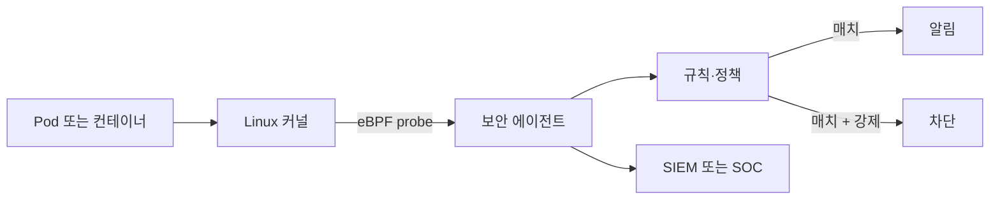
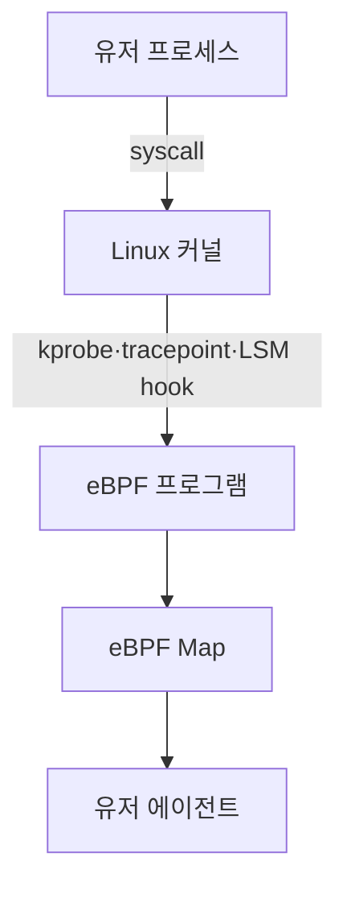
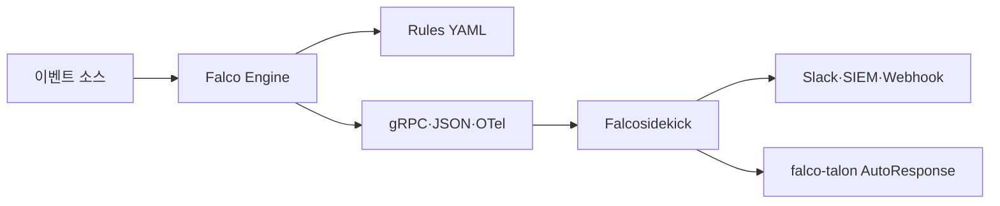

# 런타임 보안

> **2026년의 자리**: 빌드·배포 시점 보안(서명·SBOM·정책)이 *예방*이라면,
> 런타임 보안은 *감지·대응*. 이미지가 통과돼도 *실행 중* 비정상 행위를 잡는다.
> eBPF가 표준 데이터플레인이 되며 **Falco**(CNCF Graduated, 감지 중심), **Tracee**
> (Aqua, 감지 중심), **Tetragon**(Cilium, *감지 + 강제*) 3대 도구가 자리잡았다.

- **이 글의 자리**: [컨테이너 보안 인덱스](../index.md), 빌드 시점은
  [이미지 서명](image-signing.md)·[SBOM](sbom.md), 정책 강제는
  [OPA·Gatekeeper](../policy/opa-gatekeeper.md)·[Kyverno](../policy/kyverno.md).
- **선행 지식**: Linux 커널·syscall, eBPF 기본, K8s Pod·컨테이너 런타임,
  MITRE ATT&CK 컨테이너·K8s 매트릭스.

---

## 1. 한 줄 정의

> **런타임 보안**: "*실행 중* 워크로드의 syscall·네트워크·파일·프로세스
> 동작을 *커널 단에서* 관측해 *비정상 행위*를 감지·차단."



---

## 2. 왜 런타임 보안인가

| 시점 | 한계 | 런타임으로 보완 |
|---|---|---|
| **빌드 시점** | 알려진 CVE·정적 정책만 | zero-day exploit 감지 |
| **admission** | 정책 통과 후 사후 감시 X | 실행 중 행동 변화 감지 |
| **로그 기반** | 응답 후 사후 분석 | 실시간 차단 가능 |
| **EDR (호스트)** | 컨테이너·K8s 이벤트 모름 | Pod·SA·label 컨텍스트 |

> **MITRE ATT&CK Containers·Kubernetes**: 런타임 행동 기반 감지 표준. 모든
> 도구가 ATT&CK 매트릭스에 매핑.

| Tactic | Technique 예 | 런타임 신호 |
|---|---|---|
| **TA0001 Initial Access** | T1190 Exploit Public-Facing App | 비정상 입력·패턴 |
| **TA0002 Execution** | T1059 Command Interpreter | shell exec in container |
| **TA0003 Persistence** | T1136 Create Account | useradd, /etc/passwd 변경 |
| **TA0004 Privilege Escalation** | T1611 Escape to Host | unshare/setns, /proc 접근 |
| **TA0005 Defense Evasion** | T1610 Deploy Container | privileged Pod 생성 |
| **TA0006 Credential Access** | T1552 Unsecured Credentials | `/var/run/secrets`, env 탐색 |
| **TA0007 Discovery** | T1613 Container & Resource Discovery | K8s API list/get |
| **TA0008 Lateral Movement** | cluster 내 cross-Pod | 비정상 네트워크 패턴 |
| **TA0040 Impact** | T1496 Resource Hijacking | 크립토 마이너 |

### 2.1 대표 위협 시나리오

| 시나리오 | 감지 신호 |
|---|---|
| **컨테이너 escape** | unshare/setns syscall, /proc 접근, capability 변경 |
| **크립토 마이너 실행** | xmrig·minerd 프로세스, GPU 접근, 외부 채굴 풀 연결 |
| **shell drop** | `/bin/sh` exec in DB Pod, reverse shell |
| **패키지 매니저 실행** | prod에서 `apt install`, `pip install` |
| **민감 파일 읽기** | `/etc/shadow`, `/var/run/secrets/` |
| **Privileged Pod 생성** | API server 호출 |
| **외부 IP 비정상 통신** | C2 server, DNS tunneling |

---

## 3. 3대 도구 — 정면 비교

| 차원 | **Falco** | **Tracee** | **Tetragon** |
|---|---|---|---|
| **벤더** | CNCF Graduated (2024-02), 원작 Sysdig | Aqua Security | Isovalent/Cisco (Cilium 패밀리) |
| **현재 버전 (2026-04)** | v0.43.0 (2026-01) | v0.23+ | v1.5+ |
| **데이터플레인** | Modern eBPF (default), kmod 옵션 | eBPF (CO-RE) | eBPF (Cilium 공유) |
| **모드** | **감지 only** | **감지 only** | **감지 + 강제** |
| **K8s 통합** | DaemonSet, Falco-sidekick·falcoctl | DaemonSet | DaemonSet — *Cilium 없이도 단독 배포 가능* |
| **규칙 언어** | YAML + 조건식 (Sysdig 스타일) | Go signatures(주류) + Rego(legacy) + Go-CEL(tech preview) | TracingPolicy CRD (YAML) |
| **K8s identity** | label·namespace 기반 | label·namespace | **SA·Pod label·namespace native** |
| **enforcement** | in-kernel 차단 X — falco-talon 등 외부 reactor | X | `bpf_send_signal` (Sigkill), `bpf_override_return` (Override) |
| **출력 형식** | JSON·gRPC·OTel | JSON·webhook | JSON·OTel·Cilium Hubble |
| **CPU/메모리** | 낮음~중간 | 균형 | **<1% CPU** (가장 효율) |
| **default rule set** | 풍부 | 시그니처 풍부 | **거의 없음 — 사용자 작성** |
| **alert 품질** | False positive 자주 | 균형 | 명시적·정확 |
| **CWPP/CSPM 통합** | Sysdig Secure | Aqua Platform | Cisco Security Cloud |

### 3.1 한 줄 요약

| 도구 | 한 줄 |
|---|---|
| **Falco** | "default 규칙이 풍부해 *바로 시작*. 감지 폭은 1등, 그러나 노이즈" |
| **Tracee** | "Rego·Go 시그니처로 *유연*. ATT&CK 매핑 강함" |
| **Tetragon** | "eBPF로 *감지+차단* 동시. K8s native, 효율 최고. 그러나 default rule 없음" |

> **혼용 표준**: Falco(감지 폭) + Tetragon(차단·정확성). 둘 다 같은 노드에
> 설치 가능 — eBPF probe 충돌 없음.

---

## 4. eBPF 데이터플레인



| Probe | 의미 |
|---|---|
| **kprobe/kretprobe** | 커널 함수 진입·복귀 |
| **tracepoint** | 안정적 trace point (syscall 등) |
| **uprobe** | 유저 함수 hook |
| **LSM (Linux Security Module) hook** | KRSI — 보안 결정 hook (block 가능) |
| **TC (Traffic Control)** | 패킷 단위 |
| **XDP** | 패킷 진입 직후 (성능 최적) |

### 4.1 CO-RE (Compile Once, Run Everywhere)

| 용어 | 의미 |
|---|---|
| **BCC** (옛) | 노드별 커널 헤더로 컴파일 — 무거움, 호환성 |
| **libbpf + CO-RE** (현대) | BTF로 한 번 컴파일, 모든 커널에서 동작 |
| **BTF (BPF Type Format)** | 커널 자료구조 메타데이터 |

> **2026 표준**: 모든 도구가 *Modern eBPF (libbpf + CO-RE)*. Falco도 0.34+
> default. 옛 BCC·kmod는 fallback.

### 4.2 차단의 메커니즘 — 다층

| Helper | 동작 | 요건 |
|---|---|---|
| `bpf_send_signal` | 매치 시 SIGKILL 전송 → 프로세스 종료 | 커널 5.3+ |
| `bpf_override_return` | syscall 반환값을 EPERM 등으로 변경 | `CONFIG_BPF_KPROBE_OVERRIDE` |
| `bpf_lsm` (KRSI) | LSM hook에서 deny — 호출 자체 차단 | 커널 5.7+ |
| AppArmor·SELinux 합성 | KubeArmor가 자동 합성 | 노드 LSM 가용성 |

> Tetragon은 **send_signal·override_return helper**로 차단을 구현하며 LSM은
> *옵션*. KubeArmor는 LSM(AppArmor·SELinux·BPF-LSM) 자동 합성. Linux 5.7+
> BPF-LSM은 *호출 자체 차단*까지 가능.

> **카테고리 경계**: eBPF 자체는 [linux/](../../linux/index.md) 글이
> 주인공. 본 절은 *보안 응용 관점*만.

---

## 5. Falco — 깊이 있게

### 5.1 아키텍처



| 컴포넌트 | 역할 |
|---|---|
| **Falco** (DaemonSet) | eBPF probe + 규칙 평가 |
| **Falco Rules** | YAML 규칙 — 시작 권고: `falco_rules.yaml` (default), `falco_rules.local.yaml` (커스텀) |
| **Falcosidekick** | 알림 라우팅 — Slack·PagerDuty·SIEM·Loki |
| **falco-talon** | AutoResponse — labelled 자동 대응 (Pod kill 등) |
| **falcoctl** | rule·plugin 패키지 매니저 |
| **Plugins** | 추가 이벤트 소스 (CloudTrail·K8s audit·GitHub) |

### 5.2 규칙 예

```yaml
- rule: Terminal shell in container
  desc: A shell was used as the entrypoint/exec in a container with terminal
  condition: >
    spawned_process and container
    and shell_procs
    and proc.tty != 0
    and container_entrypoint
    and not user_expected_terminal_shell_in_container_conditions
  output: >
    Shell spawned in container (user=%user.name shell=%proc.name parent=%proc.pname
    cmdline=%proc.cmdline pod=%k8s.pod.name ns=%k8s.ns.name image=%container.image.repository)
  priority: NOTICE
  tags: [container, shell, mitre_execution, T1059]
```

| 핵심 매크로 | 의미 |
|---|---|
| `spawned_process` | 새 프로세스 fork/exec |
| `container` | 컨테이너 내부 |
| `shell_procs` | bash·sh·zsh 등 |
| `k8s.*` | Kubernetes 메타 (pod·ns·label) |
| MITRE 태그 (`mitre_execution`, `T1059`) | ATT&CK 매핑 |

### 5.3 핵심 함정

| 함정 | 결과 | 교정 |
|---|---|---|
| default rule만 운영 | False positive 폭주 | 환경별 macro override + exception |
| 알림 SIEM 통합 안 함 | 알림 무시 | Falcosidekick → SIEM |
| 자동 대응 없음 | 감지 후 사람 개입 지연 | falco-talon, custom webhook |
| 노드 커널 다양 | CO-RE는 호환, kmod는 미스매치 | Modern eBPF 의무 |
| 옛 0.x 운영 | CVE·deprecated rule | 0.43+ 의무 |
| 모든 syscall 추적 | 오버헤드 | `base_syscalls.repair: true` — 활성 규칙에 필요한 최소 셋만 |

### 5.4 Falco Plugins — 클라우드 native 확장

K8s syscall 외에도 **CloudTrail / K8s Audit / GitHub Audit / Okta / GitLab**
이벤트를 같은 Falco engine으로 평가. 한 도구로 *호스트 + 컨트롤플레인 +
SaaS* 보안.

---

## 6. Tracee — 깊이 있게

### 6.1 특징

- **시그니처 기반** — Rego(OPA) 또는 Go로 작성
- **이벤트 풍부** — syscall + LSM + 네트워크 + 파일
- **ATT&CK 매핑** — 시그니처에 ATT&CK ID
- **Forensics** — 이벤트 캡처 후 *fork-bomb·process 트리* 재구성

### 6.2 시그니처 예 (Rego)

```rego
package tracee.TRC_2

import data.tracee

__rego_metadoc__ := {
  "id": "TRC-2",
  "version": "0.1.0",
  "name": "Anti-Debugging",
  "description": "Process attempted to detect debugging",
  "tags": ["linux", "container"],
  "properties": {
    "Severity": 3,
    "MITRE ATT&CK": "Defense Evasion: Execution Guardrails"
  }
}
```

### 6.3 함정

| 함정 | 결과 |
|---|---|
| Rego 학습 곡선 | 운영 부담 |
| Aqua 외 통합 약함 | SIEM 통합은 직접 |
| 차단 미지원 | 감지만 — 외부 reaction |

---

## 7. Tetragon — 깊이 있게

### 7.1 특징 (TracingPolicy CRD)

```yaml
apiVersion: cilium.io/v1alpha1
kind: TracingPolicy
metadata:
  name: deny-shell-in-prod
spec:
  kprobes:
  - call: sys_execve
    syscall: true
    args:
    - index: 0
      type: string
    selectors:
    - matchArgs:
      - index: 0
        operator: Equal
        values: ["/bin/sh", "/bin/bash", "/usr/bin/zsh"]
      matchNamespaces:
      - namespace: Pid
        operator: In
        values: ["host_ns"]
      matchActions:
      - action: Sigkill   # 감지 + 차단
```

| 강점 | 설명 |
|---|---|
| **K8s identity** | Pod label·SA·namespace native — selector로 정밀 |
| **enforcement** | `Sigkill`, `Override` (write 차단) — LSM hook |
| **Cilium 공유 eBPF** | CNI와 데이터플레인 공유 → 추가 비용 적음 |
| **OTel·Hubble 통합** | 이벤트가 Hubble flow와 연동 |

### 7.2 enforcement 모드

| 모드 | 동작 |
|---|---|
| **Audit (default)** | 매치 시 이벤트만 |
| **Sigkill** | 프로세스 즉시 종료 |
| **Override** | syscall 반환값 변경 — write·open 등 차단 |
| **NotifyEnforcer** | 외부 enforcer에 위임 |

### 7.3 함정

| 함정 | 결과 |
|---|---|
| Default rule 없음 | 처음부터 직접 작성 — 학습 곡선 |
| Cilium 의존 | Cilium 미사용 환경에서 부담 |
| Sigkill의 부수효과 | 잘못된 정책 = 정상 워크로드 죽음 → 점진 enforce 필수 |

---

## 8. KubeArmor — 보너스 (LSM 합성)

| 특징 | 설명 |
|---|---|
| **AppArmor·SELinux·BPF-LSM** 자동 합성 | 노드 LSM 가용성에 맞춰 사용 |
| **enforcement 강** | 파일·프로세스·네트워크 차단 |
| **K8s native** | KubeArmorPolicy CRD |
| **Falco 보완** | 감지 Falco + 차단 KubeArmor 패턴 |

> CNCF Sandbox. **차별점**: 기존 AppArmor 정책 자산이 있는 환경, BPF-LSM
> 미지원 커널, AppArmor·SELinux 기반 운영체제(특히 RHEL 계열)에서 강점.
> Tetragon과 영역은 겹치지만 enforcement 메커니즘이 다름 — 환경에 따라 선택.

---

## 9. 운영 패턴 — 단계별 도입

### 9.1 1단계 — 감지·관측

| 작업 | 도구 |
|---|---|
| Falco 설치 (DaemonSet) | helm |
| default rule + Falcosidekick | Slack·SIEM 송출 |
| 알림 noise 분석 | 환경별 exception 작성 |
| MITRE ATT&CK 매핑 | 우선순위 |

### 9.2 2단계 — 자동 대응 (반자동)

| 작업 | 도구 |
|---|---|
| falco-talon AutoResponse | labelled Pod kill, NetworkPolicy 자동 적용 |
| Webhook → 자체 SOAR | Tines·Torq·StackStorm |
| 카오스 게임데이 | 시뮬레이션·런북 |

### 9.3 3단계 — 차단

| 작업 | 도구 |
|---|---|
| Tetragon TracingPolicy 도입 | 명확한 패턴부터 (예: `/etc/shadow` 읽기) |
| Audit → Sigkill 점진 | 정상 워크로드 영향 모니터링 |
| KubeArmor (옵션) | Cilium 미사용 환경 |

### 9.4 알림 SOC 통합

| 통합 | 흐름 |
|---|---|
| **Falco → Falcosidekick → SIEM** | 표준 |
| **Tetragon → OTel collector → SIEM** | OTel 표준 |
| **K8s audit log → Falco plugin** | 컨트롤플레인 + 데이터플레인 통합 |

---

## 10. 메트릭·SLO

| 메트릭 | 의미 |
|---|---|
| `falco_events_total{priority}` | 이벤트 수 |
| `falco_rules_matches_total` | 규칙 매치 |
| `falco_rules_count` | 활성 규칙 수 |
| `tetragon_events_total{action}` | 차단·관찰 |
| `cilium_tetragon_policy_drop_count` | 정책 드롭 |
| 에이전트 CPU·메모리 | 노드 영향 |

| SLO | 목표 |
|---|---|
| 에이전트 CPU 노드당 | < 5% (Falco), < 1% (Tetragon) — **참고 벤치, 워크로드·정책 수에 따라 가변, 실측 권고** |
| 알림 → SIEM latency p99 | < 30s |
| critical 알림 false positive | < 5% |
| MITRE 커버리지 | 점진 증가 |

---

## 11. 안티패턴

| 안티패턴 | 결과 | 교정 |
|---|---|---|
| 빌드 시점 보안만, 런타임 무시 | zero-day·내부 위협 무방비 | Falco 또는 Tetragon 의무 |
| 도구 1개로 *모든 것* | 감지 폭 또는 차단 깎임 | Falco(감지) + Tetragon(차단) 혼용 |
| default rule 그대로 | False positive 폭주 → 무시 | 환경 exception, 정기 튜닝 |
| 알림 SIEM 통합 X | 발견·대응 지연 | Falcosidekick·OTel 의무 |
| Tetragon Sigkill 직행 | 정상 워크로드 죽음 | Audit → 검증 → Sigkill |
| Tetragon이 Cilium에 의존한다고 가정 | 사실은 단독 배포 가능 — 다른 CNI와 충돌 없음 | 단독 배포 권장 시 OK, AppArmor 자산 활용 환경은 KubeArmor 검토 |
| 옛 BCC·kmod 드라이버 | 호환성·성능 | Modern eBPF (CO-RE) |
| K8s audit log 미연동 | 컨트롤플레인 사고 안 보임 | Falco plugin K8s audit |
| 자동 대응 없음 | 사람 개입 지연 | falco-talon, SOAR |
| 노드 커널 < 5.7 | LSM hook 미사용 | 커널 업그레이드 또는 BPF without LSM |
| 알림 우선순위 없음 | 무수한 알림 | priority·MITRE 기반 분류 |
| privileged Pod 자체 허용 | 런타임 감지 후 사후 | admission policy로 사전 차단 |
| 에이전트 자체 감시 안 함 | 에이전트 죽으면 무방비 | DaemonSet liveness + 알림 |
| 이벤트 보관 정책 없음 | 사후 분석 불가 | SIEM에 N개월 보관 |
| MITRE 매핑 없음 | 위협 분류·우선순위 어려움 | 모든 rule에 ATT&CK ID |
| EDR(호스트)와 중복·충돌 | 노드 부하·이벤트 중복 | 역할 분리 (호스트는 EDR, 컨테이너는 K8s native) |
| 운영자 RBAC 광범위 | 에이전트 우회 가능 | 보안팀만 정책 변경 |

---

## 12. 운영 체크리스트

**도입**
- [ ] 노드 커널 ≥ 5.10 권고 (LSM·CO-RE)
- [ ] Falco 설치 + Modern eBPF 드라이버
- [ ] default rule 활성화 + 환경 exception 분리
- [ ] Falcosidekick → SIEM·Slack
- [ ] 알림 noise → 정기 튜닝

**차단**
- [ ] Tetragon (또는 KubeArmor) 점진 도입
- [ ] Audit 모드로 시작 → Sigkill 단계
- [ ] 정책 GitOps 관리 (TracingPolicy) — 보안 정책은 짧은 reconcile 주기·별도 RBAC
- [ ] 차단 정책 변경 시 carefulness — 한 번에 한 정책
- [ ] 응급 hot-fix 채널 분리 — `tracingpolicy disable`·CRD 삭제 절차 문서화

**에이전트 자체 보안**
- [ ] 에이전트는 hostPID·hostNetwork·CAP_BPF — *공격자 1순위 타깃*
- [ ] DaemonSet RBAC 좁게, Pod 격리 (PSA restricted)
- [ ] 에이전트 컨테이너 이미지 서명 검증
- [ ] 에이전트 자체 공격 감지 (다른 에이전트로 cross-monitor)

**운영**
- [ ] MITRE ATT&CK 매핑 — 모든 rule
- [ ] 우선순위·태그 표준
- [ ] 카오스 게임데이 — 시뮬레이션
- [ ] 자동 대응(falco-talon·SOAR) 점진 도입
- [ ] EDR과 역할 분담 명확화

**관측**
- [ ] 에이전트 자체 메트릭 (CPU·메모리·이벤트율)
- [ ] DaemonSet liveness·readiness
- [ ] 이벤트 SIEM 보관 (규제 요구 준수)
- [ ] 정기 false positive 리뷰

**컴플라이언스**
- [ ] CIS K8s Benchmark 매핑
- [ ] PCI DSS Req 10.6 (log review)·11.5 (file integrity)
- [ ] HIPAA §164.312(b) (audit controls)
- [ ] SOC 2 CC7.2 (모니터링)

---

## 참고 자료

- [Falco — Documentation](https://falco.org/docs/) (확인 2026-04-25)
- [Falco — GitHub](https://github.com/falcosecurity/falco) (확인 2026-04-25)
- [Falco CNCF Graduation (2024-02)](https://www.cncf.io/announcements/2024/02/29/cloud-native-computing-foundation-announces-falco-graduation/) (확인 2026-04-25)
- [Tracee — Aqua Security](https://aquasecurity.github.io/tracee/) (확인 2026-04-25)
- [Tracee — GitHub](https://github.com/aquasecurity/tracee) (확인 2026-04-25)
- [Tetragon — Cilium](https://tetragon.io/) (확인 2026-04-25)
- [Tetragon — GitHub](https://github.com/cilium/tetragon) (확인 2026-04-25)
- [KubeArmor](https://kubearmor.io/) (확인 2026-04-25)
- [eBPF for Linux Security](https://ebpf.io/applications/#security) (확인 2026-04-25)
- [MITRE ATT&CK for Containers](https://attack.mitre.org/matrices/enterprise/containers/) (확인 2026-04-25)
- [MITRE ATT&CK for Kubernetes](https://attack.mitre.org/matrices/enterprise/cloud/iaas/) (확인 2026-04-25)
- [Comparative Analysis of eBPF-Based Runtime Security](https://www.scitepress.org/Papers/2025/142727/142727.pdf) (확인 2026-04-25)
- [Falcosidekick](https://github.com/falcosecurity/falcosidekick) (확인 2026-04-25)
- [falco-talon](https://github.com/falcosecurity/falco-talon) (확인 2026-04-25)
