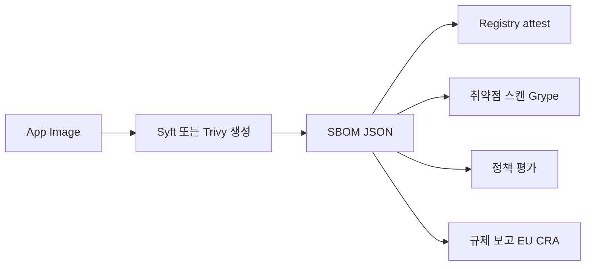
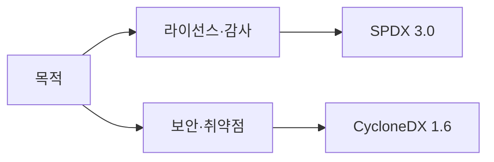
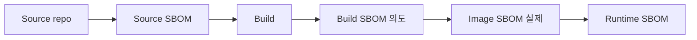
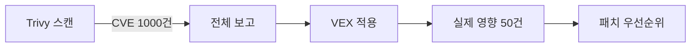

# SBOM (Software Bill of Materials)

> **2026년의 자리**: SBOM은 *소프트웨어 재료명세서*. 2021년 EO 14028 이후
> 5년 만에 **규제 의무**가 됐다. **EU Cyber Resilience Act (CRA)**는
> **2026-09-11 vulnerability·incident 보고 의무 발효**(actively exploited는
> ENISA·national CSIRT에 24시간 내), **2027-12-11 SBOM 작성·유지 의무 전면
> 적용**. 더 이상 *옵션*이 아니다. 본 글은 형식(CycloneDX·SPDX), 생성 도구
> (Syft·Trivy), 저장·배포, VEX 통합으로 "운영 가능한 SBOM"을 다룬다.

- **이 글의 자리**: [이미지 서명](image-signing.md)·[SLSA](../supply-chain/slsa.md)와
  짝. SBOM은 *재료*, 서명은 *출처*, SLSA는 *프로세스*. 셋이 합쳐 공급망 보안.
- **선행 지식**: 컨테이너 이미지·OCI, 패키지 매니저(npm·pip·maven·apt 등),
  CVE·NVD.

---

## 1. 한 줄 정의

> **SBOM**: "한 소프트웨어가 *어떤 컴포넌트(라이브러리·OS 패키지·파일)*로
> 구성됐는지의 *기계 판독 가능* 목록 — 이름·버전·라이선스·해시·관계."



---

## 2. 왜 의무인가 — 규제 매트릭스

| 규제 | 요구 | 시한 |
|---|---|---|
| **US EO 14028 (2021)** | 연방기관에 SBOM 제출 (SPDX·CycloneDX) | 발효 중 |
| **EU CRA (2024)** | machine-readable SBOM 작성·유지, 취약점·incident 보고 | **2026-09-11 보고 의무**(actively exploited는 24h 내 ENISA·CSIRT), **2027-12-11 SBOM·전면 적용** |
| **FDA Premarket Cybersecurity (2023)** | 의료기기 SBOM | 발효 중 |
| **PCI DSS 4.0 (2024)** | 결제 환경 소프트웨어 SBOM | 발효 중 |
| **NTIA Minimum Elements** + **CISA 2024 보완** | SBOM 최소 필드 정의 (NTIA 7) + SBOM Type taxonomy | 미국 표준 |
| **OpenSSF SBOM Everywhere** | 오픈소스 권고 | 진행 중 |

> **공급망 침해 사례**: SolarWinds(2020) — 빌드 침해, 18,000+ 조직 영향.
> Log4Shell(2021) — *어디에 Log4j 쓰는지* 빠른 파악 불가가 가장 큰 문제. SBOM은
> 이런 *재료 추적*을 가능하게 함.

---

## 3. SPDX vs CycloneDX — 두 표준

| 차원 | **SPDX** | **CycloneDX** |
|---|---|---|
| **거버넌스** | Linux Foundation | OWASP |
| **현재 버전** | 3.0.1 — 프로파일 기반 (Core/Software/Security/Licensing/Build/AI/Dataset) — 다수 도구는 여전히 2.3 | **1.7 (2025-10)** — CBOM/Citations/AI 확장. ECMA-424는 1.6 기반 |
| **표준화** | ISO/IEC 5962:2021 | ECMA-424 (1.6 기반, 2024) |
| **포맷** | JSON·tag-value·RDF·YAML | JSON·XML·protobuf |
| **주된 용도** | 라이선스 컴플라이언스·감사 | 보안·취약점 관리·VEX |
| **의존 그래프** | 지원 (SPDX 3에서 강화) | 풍부 (BOM-Link, dependency tree) |
| **VEX 통합** | 외부(OpenVEX·CSAF VEX) | 내장(`vulnerabilities`) + OpenVEX |
| **취약점 표현** | 외부 첨부 | 내장 가능 |
| **사용 추세** | 라이선스·OSS 컴플라이언스 | 보안 도구 표준 (Trivy·Snyk·Mend) |

> **권고**: *둘 다 발행*. 라이선스/감사용 SPDX, 보안 운영용 CycloneDX. Syft/Trivy
> 모두 한 명령으로 두 형식 출력.

### 3.1 어느 걸 쓰나



| 시나리오 | 권고 |
|---|---|
| 정부 납품 (US EO·EU CRA) | 둘 다 — 보고 시점에 수용되는 형식으로 |
| 보안 스캐너 (Grype·Snyk) | CycloneDX |
| OSS 컴플라이언스 (Apache·MIT 라이선스 보고) | SPDX |
| 의료기기 (FDA) | SPDX 권고 |
| VEX 통합 | CycloneDX 1.4+ 내장 또는 OpenVEX 별도 |

---

## 4. SBOM 최소 요소 — NTIA 7가지

| 요소 | 의미 |
|---|---|
| **Supplier Name** | 컴포넌트 공급자 |
| **Component Name** | 라이브러리·패키지명 |
| **Version** | 정확한 버전 |
| **Other Identifiers** | PURL, CPE, SWID, 해시 |
| **Dependency Relationships** | A → B 의존 |
| **Author of SBOM Data** | 누가 만들었는가 |
| **Timestamp** | 언제 만들었는가 |

> NTIA "minimum elements" — 모든 SBOM의 *최소 기준*. 이걸 만족하지 않으면 SBOM
> 이라 부를 수 없음. 도구 출력이 이를 만족하는지 확인.

---

## 5. Package URL (PURL) — 컴포넌트 식별의 표준

```
pkg:<type>/<namespace>/<name>@<version>?<qualifiers>#<subpath>
```

```
pkg:npm/lodash@4.17.21
pkg:maven/org.apache.commons/commons-lang3@3.12.0
pkg:pypi/django@4.2.0
pkg:apk/alpine/openssl@3.0.8-r0?arch=x86_64
pkg:deb/debian/openssl@3.0.11-1?arch=amd64
pkg:oci/nginx@sha256:abc...?repository_url=docker.io/library&tag=1.27&arch=amd64
```

| 의미 | 설명 |
|---|---|
| `type` | 패키지 매니저 (npm·maven·pypi·apk·deb·oci 등) |
| `namespace` | 조직·그룹 |
| `name` | 패키지명 |
| `version` | 정확한 버전 |
| `qualifiers` | arch·distro·classifier |

> PURL이 SBOM 도구 간 *상호운용성의 핵심*. CPE는 NVD 매칭에 쓰지만 표기 모호함이
> 많아 PURL이 권장. 두 식별자 *동시* 포함 권고.

---

## 6. 생성 도구 — Syft·Trivy 중심

### 6.1 도구 매트릭스

| 도구 | 강점 | 약점 |
|---|---|---|
| **Syft** (Anchore) | 가장 넓은 ecosystem, 형식 풍부, OS·언어 패키지 모두 | 취약점 스캔은 Grype 별도 |
| **Trivy** (Aqua) | SBOM + 취약점 + IaC + Secret 스캔 — 통합 | SBOM만 보면 Syft가 더 정밀 |
| **CycloneDX CLI** | CycloneDX native, 변환·검증 | 단독 SBOM 생성은 약함 |
| **SPDX 도구체인** | SPDX 표준 준수 | 활성도·CI 통합 |
| **Snyk** | 통합 보안 플랫폼 | 상용 |
| **FOSSA** | 라이선스·SBOM 관리 | 상용 |
| **Anchore Enterprise** | 정책·관리 | 상용 |
| **GitHub Dependency Submission API** | GitHub repo native | 일부 ecosystem만 |

### 6.2 빌드 단계별 SBOM



| 단계 | 도구 | 가치 |
|---|---|---|
| **Source** | GitHub Dependency Graph, `syft <git-repo>` | 의도된 의존 |
| **Build (planned)** | `syft <build-context>` | 빌드 계획 |
| **Image (as-built)** | `syft <image>`, `trivy image --format cyclonedx` | 실제 들어간 것 |
| **Runtime** | `syft <running container>`, eBPF 기반 도구 | *실제 로드된* 것 |

> **함정**: 셋이 다를 수 있다. Source SBOM은 `package.json`이지만 빌드 결과
> *실제 사용된* 라이브러리는 다름. **Image SBOM이 가장 신뢰**.

### 6.3 Syft·Trivy 핵심 명령

```bash
# Syft — 이미지 → CycloneDX·SPDX
syft ghcr.io/example/app:v1.0 -o cyclonedx-json > sbom.cdx.json
syft ghcr.io/example/app:v1.0 -o spdx-json > sbom.spdx.json

# Cosign attest — 두 형식 모두 (in-toto predicateType)
# CycloneDX: https://cyclonedx.org/bom
# SPDX:      https://spdx.dev/Document
cosign attest --predicate sbom.cdx.json --type cyclonedx <image>@<digest>
cosign attest --predicate sbom.spdx.json --type spdxjson  <image>@<digest>

# Trivy — 이미지 → SBOM + 취약점
trivy image --format cyclonedx --output sbom.cdx.json ghcr.io/example/app:v1.0
trivy image --format spdx-json --output sbom.spdx.json ghcr.io/example/app:v1.0

# Trivy — SBOM 입력 → 취약점 매핑
trivy sbom sbom.cdx.json

# Grype — Syft + 취약점
grype sbom:./sbom.cdx.json
```

### 6.4 Distroless·scratch 이미지

| 이미지 | 패키지 매니저 정보 | SBOM 정확도 |
|---|---|---|
| **Debian/Ubuntu/Alpine** | apt/apk DB 존재 | 높음 |
| **Distroless (Google)** | apt DB 부분 보존 | 중간 |
| **scratch** | 없음 | 매우 낮음 |
| **Static Go binary** | 매니페스트 없음 | 매우 낮음 |

> **권고**: scratch·static binary는 *빌드 시 SBOM 생성*이 의무. 빌드 후
> 이미지에서 추출 불가. Buildkit `--sbom-generator` 또는 `ko build --sbom`
> 같은 *빌드타임* 도구 필수.

> **BuildKit SBOM 함정**: `BUILDKIT_SBOM_SCAN_CONTEXT=true`,
> `BUILDKIT_SBOM_SCAN_STAGE=true` build-arg 명시 안 하면 *빌드 컨텍스트·중간
> 스테이지 의존성*이 SBOM에서 누락. 멀티스테이지 빌드(builder 스테이지의 dev
> 도구·SDK)가 보고에서 빠진 *부정확한 SBOM*이 산출됨. 규제 보고에 그대로 사용
> 시 위반 위험. **두 build-arg 의무**.

---

## 7. SBOM 저장·배포

### 7.1 OCI registry — Cosign attest

```bash
# 이미지에 SBOM을 attestation으로 첨부
cosign attest --predicate sbom.cdx.json \
  --type cyclonedx ghcr.io/example/app@sha256:abc...

# 검증·추출
cosign verify-attestation \
  --type cyclonedx \
  --certificate-identity=https://github.com/acme/app/.github/workflows/build.yml@refs/heads/main \
  --certificate-oidc-issuer=https://token.actions.githubusercontent.com \
  ghcr.io/example/app:v1.0
```

| 방식 | 설명 |
|---|---|
| **Cosign attestation** | OCI referrer로 저장, 서명 포함 — 표준 |
| **OCI artifact (별도)** | manifest 자체로 push (`oras push`) |
| **`sbom` 미디어 타입** | 이미지에 `vnd.cyclonedx+json` 미디어 타입으로 첨부 |
| **별도 storage** | S3·GCS·DB — 작은 환경 |
| **GUAC graph** | 멀티 SBOM·취약점 그래프 DB (CNCF) |

> **권고**: *Cosign attestation*이 표준. 서명 + SBOM이 한 묶음, registry에서
> referrers API로 자동 연결, 검증 admission policy에서 사용.

### 7.2 SBOM 관리 플랫폼

| 도구 | 용도 |
|---|---|
| **GUAC** (CNCF Sandbox) | SBOM·attestation 그래프 DB, 종속성 추적 |
| **Dependency Track** (OWASP) | SBOM 업로드 → 취약점·라이선스 모니터링, 프로젝트 단위 정책, BOM-Link 분리/합성 |
| **Snyk·FOSSA·Anchore** | 상용 SBOM 관리 |
| **sbomqs** (OpenSSF) | SBOM 품질 평가 — NTIA·OWASP·OCT 점수, CI 게이트(예: 점수 ≥ 8.0) |
| **OSV-Scanner** (Google) | SBOM → OSV.dev 매칭 |

> **차세대**: CycloneDX TC54의 **Transparency Exchange API (TEA)** — SBOM·VEX를
> 원본 공급사로부터 *동적 fetch*하는 표준. 현재는 OCI referrer 중심, TEA가
> 차세대.

---

## 8. VEX (Vulnerability Exploitability eXchange) — *진짜 영향*

### 8.1 왜 VEX인가

SBOM이 "이 이미지에 Log4j 2.14가 있다"라고 알려준다 → 자동 스캐너가 CVE-2021-44228
경고 → 그러나 *실제로 호출 경로에 없으면 영향 없음*. **SBOM = 무엇이 있는가, VEX
= 그게 실제로 위험한가**.

| 상태 (VEX) | 의미 |
|---|---|
| **not_affected** | 컴포넌트 존재하나 코드 경로상 영향 없음 |
| **affected** | 영향 있음 — 패치 필요 |
| **fixed** | 이 버전에서 수정됨 |
| **under_investigation** | 분석 중 |

### 8.2 VEX 표준 4종

| 표준 | 특징 |
|---|---|
| **OpenVEX** (OpenSSF) | 최소·휴대성·embeddable. 신생 표준, 빠르게 채택 |
| **CSAF VEX** (OASIS) | CSAF 2.0 기반, 정부·벤더 표준 |
| **CycloneDX VEX** (1.4+) | CycloneDX BOM에 내장 가능 |
| **SPDX 외부 첨부** | SPDX 자체는 VEX 미내장, 외부 OpenVEX |

> **2026년 권고**: **OpenVEX** — 최소·embeddable, Trivy/Sigstore 표준 통합.
> CSAF VEX는 정부·통신·벤더 보고용. CycloneDX 내장은 SBOM과 한 파일에 두고
> 싶을 때.

### 8.3 OpenVEX 예

```json
{
  "@context": "https://openvex.dev/ns/v0.2.0",
  "@id": "https://acme.com/vex/2026-04-CVE-2021-44228",
  "author": "Acme Security Team",
  "timestamp": "2026-04-25T10:00:00Z",
  "version": 1,
  "statements": [{
    "vulnerability": { "name": "CVE-2021-44228" },
    "products": [{
      "@id": "pkg:oci/acme/app@sha256:abc..."
    }],
    "status": "not_affected",
    "justification": "vulnerable_code_not_in_execute_path"
  }]
}
```

### 8.4 VEX justification — 표준 사유

**CISA Minimum 5개 (OpenVEX·CSAF 표준)**:

| Justification | 의미 |
|---|---|
| `component_not_present` | 빌드에서 제외 |
| `vulnerable_code_not_present` | 컴포넌트 있으나 취약 함수 미포함 |
| `vulnerable_code_not_in_execute_path` | 실제 호출되지 않음 |
| `vulnerable_code_cannot_be_controlled_by_adversary` | 공격자 입력 도달 X |
| `inline_mitigations_already_exist` | WAF·NetworkPolicy 등 inline 통제 |

**CycloneDX 9개 (CISA 5개 확장 + 4개 추가)**:

| Justification | 의미 |
|---|---|
| `code_not_reachable` | 호출 그래프상 도달 불가 |
| `code_not_present` | 컴포넌트 함수 자체 없음 |
| `requires_configuration` | 특정 설정에서만 영향 |
| `requires_dependency` | 다른 의존이 있어야 영향 |
| `requires_environment` | 특정 환경(OS·arch)에서만 |
| `protected_by_compiler` | 컴파일러 mitigation으로 차단 |
| `protected_at_runtime` | 런타임 보호 (sandbox 등) |
| `protected_at_perimeter` | 경계(WAF·NetPol)에서 차단 |
| `protected_by_mitigating_control` | 보상 통제 |

> **함정**: 표준별 명칭 다름. **사용 표준 기준 일관 명칭** 의무 — 도구 간 변환
> 시 누락 위험. 통합 보고에서는 한 표준 선택, OpenVEX→CycloneDX 변환은 도구로.

> 과학적 분석(`reachability analysis`) 도구 — Endor Labs, Snyk Reachability,
> Backslash, Apiiro 등 상용; 오픈소스는 OpenSSF Capslock(Go), OSS Review
> Toolkit, Java SootCG. 사람의 *판단*만으로는 false negative 위험.

### 8.5 VEX 운영 흐름



```bash
# Trivy + VEX
trivy image --vex vex.openvex.json ghcr.io/example/app:v1.0
# → VEX의 not_affected는 결과에서 제외
```

---

## 9. SBOM as Code — CI 통합

```yaml
# GitHub Actions 예
- name: Generate SBOM
  uses: anchore/sbom-action@v0
  with:
    image: ghcr.io/${{ github.repository }}:${{ github.sha }}
    format: cyclonedx-json
    output-file: sbom.cdx.json

- name: Sign and attach
  run: |
    cosign attest --yes \
      --predicate sbom.cdx.json \
      --type cyclonedx \
      ghcr.io/${{ github.repository }}@${{ steps.build.outputs.digest }}

- name: Vulnerability scan with VEX
  run: |
    trivy sbom --vex vex/openvex.json sbom.cdx.json \
      --severity HIGH,CRITICAL --exit-code 1
```

| 단계 | 출력 |
|---|---|
| 빌드 | 이미지 |
| SBOM 생성 | `sbom.cdx.json` (+ `sbom.spdx.json`) |
| 서명·attestation | Cosign attest로 OCI referrer |
| 취약점 스캔 | SBOM 입력 + VEX 적용 |
| 정책 평가 | OPA/Kyverno로 admission |
| 보관 | Dependency Track, GUAC, S3 |

---

## 10. 정책 — admission에서 SBOM 검증

```yaml
# Kyverno: SBOM attestation 의무
apiVersion: kyverno.io/v2beta1
kind: ClusterPolicy
metadata:
  name: require-sbom
spec:
  validationFailureAction: Enforce
  rules:
  - name: cyclonedx-sbom-required
    match:
      any:
      - resources: { kinds: [Pod] }
    verifyImages:
    - imageReferences: ["ghcr.io/acme/*"]
      attestations:
      - type: https://cyclonedx.org/bom
        attestors:
        - entries:
          - keyless:
              issuer: https://token.actions.githubusercontent.com
              subject: "https://github.com/acme/*"
        conditions:
        - all:
          - key: "{{ components[?type=='library'].length(@) }}"
            operator: GreaterThan
            value: 0
```

| 검증 | 의미 |
|---|---|
| SBOM 존재 | attestation 첨부 확인 |
| SBOM 서명 | 빌드 SA가 발행 |
| 컴포넌트 정책 | 금지 라이브러리·라이선스 차단 |
| CVE 점수 | high/critical 0 (또는 VEX 적용 후 0) |

---

## 11. 안티패턴

| 안티패턴 | 결과 | 교정 |
|---|---|---|
| 하나의 SBOM 형식만 (SPDX 또는 CycloneDX 중 하나) | 라이선스 또는 보안 도구 호환 X | 둘 다 발행 |
| Source SBOM만 신뢰 (build·image SBOM 없음) | 실제 빌드 결과 차이 | image SBOM이 진실 |
| scratch·static binary 빌드 후 SBOM 시도 | 추출 불가 | 빌드 시 BuildKit `--sbom-generator` |
| SBOM을 Git에만 보관 (이미지 attest X) | 검증 어려움, 불일치 | Cosign attest로 OCI referrer |
| VEX 없이 모든 CVE 패치 | 노력 80%가 영향 없는 CVE | VEX·reachability로 우선순위 |
| 사람이 VEX 수동 작성 | false positive·누락 | reachability 분석 도구 자동 |
| OpenVEX·CSAF·CycloneDX VEX 혼용 | 통합 어려움 | 한 표준 선택, 변환 도구 |
| SBOM 품질 평가 안 함 | 컴포넌트 누락·잘못된 PURL | sbomqs·NTIA 최소요소 검증 |
| 의존 그래프 깊이 1만 추적 | transitive 취약점 누락 | full graph (Syft 기본) |
| SBOM 보관소 없이 발행 후 잊음 | 회수·추적 불가 | Dependency Track·GUAC |
| EU CRA·EO 14028 무시 | 규제 위반 | 보고 형식·시한 준수 |
| CPE만 사용 (PURL 없음) | NVD 매칭 모호 | PURL + CPE 둘 다 |
| Image의 *모든* 컴포넌트 동일 위험 | Log4j와 dev tool 동급 취급 | 호출 경로·노출 분석 |
| Runtime SBOM 무시 | dynamic load·인터프리터 구성 누락 | eBPF·container introspection |
| SBOM 서명 안 함 | 위변조 가능 | Cosign attest 의무 |
| 의존 명시 안 한 base image (FROM scratch) | 라이선스·보안 검토 X | 명시적 base, SBOM 자동 |
| SBOM에 secret·내부 경로 노출 | 정보 유출 | sbom redaction 도구 |
| 멀티 아키 이미지 SBOM 미분리 | arch별 패키지 차이 | manifest list 각각 SBOM |
| `latest` 태그로 SBOM 발행 | 추적 어려움 | digest 고정 |
| 옛 SBOM 보관 안 함 | 사후 회수 불가 | 최소 N개월 보관 (규제별) |

---

## 12. 운영 체크리스트

**생성**
- [ ] 모든 prod 빌드에 SBOM 자동 생성 (Syft·Trivy)
- [ ] CycloneDX·SPDX 둘 다 발행 — 라이선스 + 보안
- [ ] scratch·static binary는 빌드 시 SBOM (`buildkit --sbom-generator`)
- [ ] PURL + CPE 둘 다 포함
- [ ] NTIA 7가지 최소 요소 만족 (sbomqs로 검증)

**저장·배포**
- [ ] Cosign attest로 OCI registry attestation
- [ ] Dependency Track·GUAC에 자동 업로드
- [ ] 멀티 아키는 manifest list 각각
- [ ] 옛 SBOM 보관 (규제 시한 + α)

**VEX**
- [ ] OpenVEX 표준 채택 (또는 CSAF VEX는 정부 보고용)
- [ ] reachability 분석 도구로 자동 생성
- [ ] CI에 VEX 적용해 false positive 제거
- [ ] 정기 갱신 — 새 CVE 발표 시 VEX 재평가

**검증·정책**
- [ ] Kyverno/policy-controller로 SBOM 첨부 의무
- [ ] 라이선스 정책 (GPL 등 금지 정책)
- [ ] CVE 임계 (high/critical은 VEX 적용 후 0)
- [ ] SBOM 서명 검증 (빌드 SA만)

**규제 대응**
- [ ] EU CRA — 2026-09 보고, 2027-12 SBOM 의무
- [ ] EO 14028 — 연방 납품
- [ ] FDA Premarket — 의료기기
- [ ] PCI DSS 4.0 — 결제 환경
- [ ] 규제별 형식·시한·보관 절차 문서화

---

## 참고 자료

- [SPDX Specification](https://spdx.dev/specifications/) (확인 2026-04-25)
- [CycloneDX Specification](https://cyclonedx.org/specification/overview/) (확인 2026-04-25)
- [NTIA — Minimum Elements for an SBOM](https://www.ntia.gov/sbom) (확인 2026-04-25)
- [Package URL (PURL) Specification](https://github.com/package-url/purl-spec) (확인 2026-04-25)
- [OpenVEX Specification](https://github.com/openvex/spec) (확인 2026-04-25)
- [CSAF VEX (OASIS)](https://docs.oasis-open.org/csaf/csaf/v2.0/csaf-v2.0.html) (확인 2026-04-25)
- [Syft (Anchore)](https://github.com/anchore/syft) (확인 2026-04-25)
- [Trivy (Aqua)](https://github.com/aquasecurity/trivy) (확인 2026-04-25)
- [Grype](https://github.com/anchore/grype) (확인 2026-04-25)
- [GUAC (CNCF)](https://github.com/guacsec/guac) (확인 2026-04-25)
- [Dependency Track (OWASP)](https://dependencytrack.org/) (확인 2026-04-25)
- [sbomqs (OpenSSF)](https://github.com/interlynk-io/sbomqs) (확인 2026-04-25)
- [EU Cyber Resilience Act](https://digital-strategy.ec.europa.eu/en/policies/cyber-resilience-act) (확인 2026-04-25)
- [US Executive Order 14028](https://www.whitehouse.gov/briefing-room/presidential-actions/2021/05/12/executive-order-on-improving-the-nations-cybersecurity/) (확인 2026-04-25)
- [OpenSSF — SBOMs in the era of CRA](https://openssf.org/blog/2025/10/22/sboms-in-the-era-of-the-cra-toward-a-unified-and-actionable-framework/) (확인 2026-04-25)
