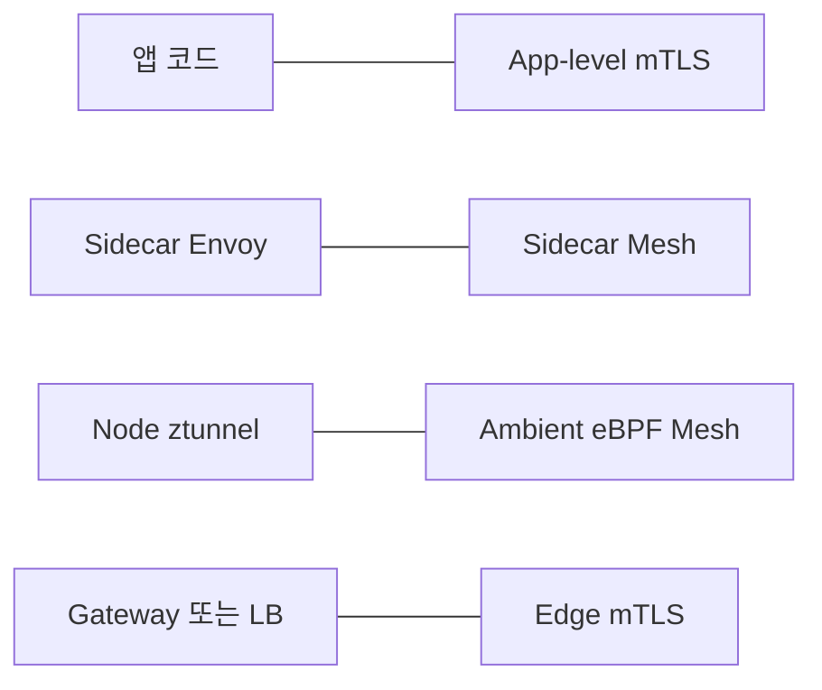
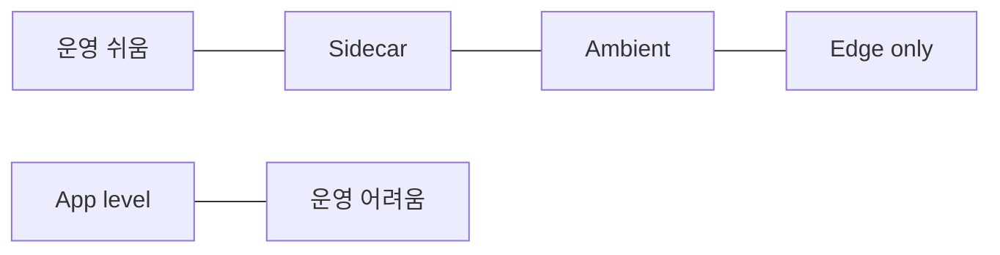
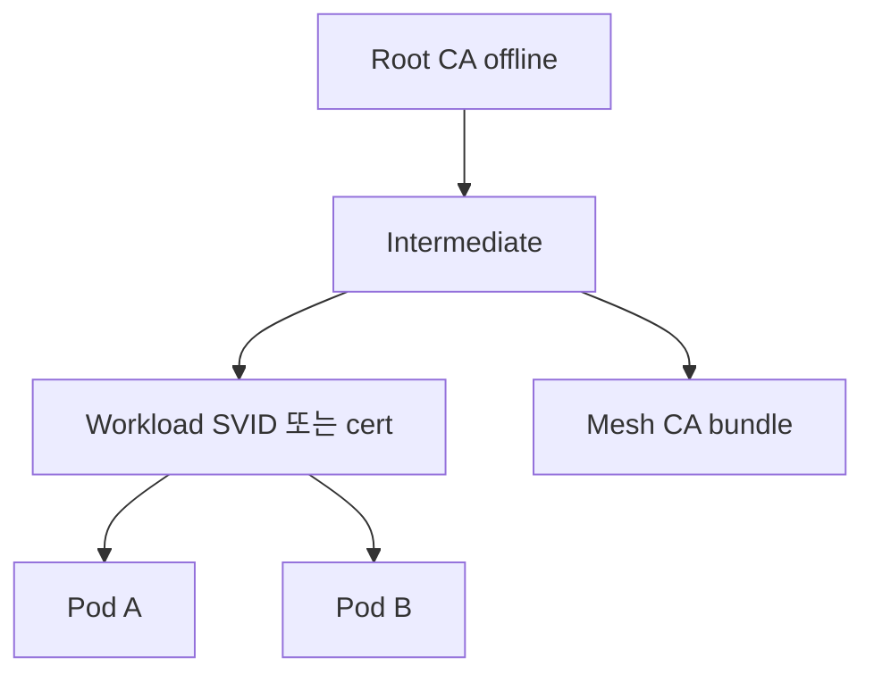

# mTLS 전략

> **2026년의 자리**: mTLS는 Zero Trust의 *암호학적 신원 증명*이다. 그러나
> "어디서 mTLS를 끝낼지(termination)" — 앱 안, sidecar, ztunnel, gateway —
> 가 운영 비용·관측성·실패 모드를 *완전히* 다르게 만든다. 본 글은
> mTLS *프로토콜*이 아니라 **전략·트레이드오프**를 다룬다.

> **핵심 명제**: **mTLS = 인증 (authentication)이지 인가 (authorization)가
> 아니다**. STRICT mTLS만으로는 "양쪽이 서로의 신원을 안다"만 보장되며,
> *누가 무엇을 할 수 있는가*는 별도의 정책(AuthorizationPolicy, OPA/Kyverno,
> 앱 레벨 RBAC)이 필요. mTLS만 켜고 인가 정책 없으면 *내부자 가로 이동*에
> 무력하다.

- **이 글의 자리**: mTLS *프로토콜·핸드셰이크*는
  [network/mtls-basics](../../network/tls-pki/mtls-basics.md), 메시 *구현*은
  [network/service-mesh](../../network/container-k8s-network/service-mesh.md),
  *워크로드 신원*은 [Workload Identity](../authn-authz/workload-identity.md).
  여기는 **언제·어떻게·어디서 mTLS를 적용할지의 전략**.
- **선행 지식**: TLS·X.509·CA chain, K8s Service·Pod, SPIFFE/SPIRE 기본,
  Service Mesh 개념.

---

## 1. mTLS 전략의 4가지 종착지



| 종착지 | 누가 mTLS 처리 | 대표 |
|---|---|---|
| **App-level** | 앱 라이브러리·SDK | mTLS 라이브러리 직접, gRPC TLS, golang `tls.Config` |
| **Sidecar Mesh** | Pod별 Envoy/Linkerd-proxy | Istio sidecar, Linkerd |
| **Ambient/eBPF** | 노드 단위 ztunnel·tetragon | Istio Ambient, Cilium Mesh |
| **Edge/Gateway** | Ingress·API GW만 | Envoy Gateway, Cloudflare, ALB |

> **선택은 *모든 트래픽*에 대해 한 번이 아니다.** edge는 Gateway, mesh 안은
> ambient, 외부 시스템과는 app-level — 같은 클러스터에 *공존*이 표준.

---

## 2. 7가지 의사결정 축

| 축 | 질문 | 의미 |
|---|---|---|
| **신뢰 모델** | "누구를 믿는가" | namespace? SPIFFE ID? 클러스터? 다중 클러스터? |
| **종착지** | "어디서 평문이 보이는가" | 앱 안만? sidecar까지? node tmpfs까지? edge까지? |
| **CA 책임** | "인증서 누가 발급" | mesh CA? Vault PKI? cert-manager? 사람? |
| **성능** | "오버헤드 얼마" | sidecar 100ms 추가? ambient 8%? app-level 가변? |
| **관측성** | "L7 메트릭·트레이싱 가능?" | mesh가 자동? 앱이 직접 emit? |
| **장애 격리** | "데이터플레인 죽으면" | sidecar 죽으면 Pod 재시작? ztunnel 죽으면 노드 영향? |
| **운영 비용** | "누가 운영" | 플랫폼팀 mesh 운영? 앱팀 라이브러리 업그레이드? |

---

## 3. 4가지 패턴 — 정면 비교

### 3.1 비교표

| 차원 | App-level | Sidecar | Ambient | Edge-only |
|---|---|---|---|---|
| **암호화 범위** | end-to-end (앱→앱) | sidecar→sidecar (Pod 안 평문) | ztunnel→ztunnel (노드 안 평문) | 외부→edge만 (내부 평문) |
| **CA 책임** | 앱·플랫폼 직접 | mesh control plane 자동 | mesh control plane 자동 | LB 인증서 수동/ACM |
| **레이턴시 추가** | 가변(라이브러리·옵션) | **+30~166%** (sidecar 2 hop) | +8~15% (ztunnel 1 hop, eBPF) | 0(내부) |
| **CPU 오버헤드** | 가변 | sidecar당 1~3% CPU | 노드당 단일 ztunnel | 0(내부) |
| **메모리 오버헤드** | 작음 | Pod당 +30~150MB | 노드당 +50~200MB | 0(내부) |
| **L7 관측성** | 앱이 직접 | mesh 자동 (Envoy) | waypoint 통과 시만 | LB 로그 |
| **앱 수정** | 큼 — 라이브러리 통합 | 0 | 0 | 0 |
| **언어 다중** | 라이브러리 N개 유지 | 무관 | 무관 | 무관 |
| **장애 모드** | 앱 패닉·CPU 폭주 | sidecar restart = Pod 영향 | ztunnel restart = 노드 영향 | LB 장애만 |
| **레거시 통합** | 거의 불가능 | sidecar 주입만 | 자동 | 자동 |
| **외부 시스템** | 가능 | egress GW 필요 | egress 필요 | 자연스러움 |

> **2024-11 Deepness Lab 벤치마크 (arxiv 2411.02267)**: mTLS 켜기 전후
> *p50 레이턴시 증가율* — Istio sidecar **+166%**, Linkerd +33%, Cilium +99%,
> Istio Ambient **+8%**. **단, 부하 패턴(QPS·payload·connection reuse)에 따라
> 절대 수치는 크게 다르다**. connection reuse 비율이 높으면 핸드셰이크 비용
> 분산되어 격차 축소. *상대 비교의 방향성*만 신뢰, 자체 환경 측정 의무.

### 3.2 트레이드오프 요약



---

## 4. 신뢰 모델 — SPIFFE를 중심으로

### 4.1 신원의 단위

| 단위 | 표기 | 사용 |
|---|---|---|
| **K8s SA + namespace** | `spiffe://cluster.local/ns/payments/sa/api` | mesh 자동 |
| **클러스터별 trust domain** | `spiffe://prod.acme/...` | 멀티 클러스터 |
| **워크로드 attestation** | `spiffe://acme/region/us/cluster/prod/sa/api` | SPIRE selectors |

### 4.1.1 X509-SVID vs JWT-SVID

| 종류 | 사용 | 함정 |
|---|---|---|
| **X509-SVID** | mTLS 핸드셰이크 — connection-bound | 재생 공격 면역 (TLS 채널에 묶임) |
| **JWT-SVID** | L7 프록시·LB 통과 시, 비-mTLS 경로(OAuth client-credentials 강화) | 재생 가능 — 짧은 TTL + audience 제약 의무 |

> **혼용**: 메시 안 mTLS = X509-SVID, mesh 외부(Vault·OAuth IdP·LB 통과) =
> JWT-SVID. 둘 다 같은 SPIFFE ID 표기. JWT-SVID는 *audience 강제 + TTL ≤ 5min*
> 으로 재생 위험 감소.

### 4.2 SPIFFE/SPIRE를 *직접* 쓰는 경우

| 시나리오 | 이유 |
|---|---|
| K8s + VM + 베어메탈 혼합 | mesh 외부에 통일된 신원 필요 |
| 멀티 클러스터·멀티 클라우드 | trust domain federation |
| 앱이 *자기 인증서*를 직접 다뤄야 함 | DB·메시지 큐와 mTLS |
| 정책 엔진이 SPIFFE ID 기반 | SPIRE selector → policy |
| Vault·KMS와 워크로드 ID 통합 | SPIFFE JWT-SVID로 Vault 인증 |

> Istio는 *내부적으로* SPIFFE 형식을 쓰지만, SPIRE 없이 자체 CA로 발급. SPIRE는
> *자체 attestation*과 *SVID 발급*을 더 엄격히 통제. 보통 mesh CA로 시작 →
> 멀티 환경·VM 통합 필요 시 SPIRE 도입.

### 4.3 인증서 수명

| 수명 | 적용 |
|---|---|
| **시간 단위 (1~24h)** | mesh sidecar/ambient — 자동 회전 |
| **일~주 단위 (1~7d)** | 부트스트랩, kubelet, 일부 인프라 |
| **년 단위** | CA 자체, 외부 endpoint(Let's Encrypt 90d 권고 제외) |

> **권고**: 워크로드 인증서는 *시간 단위*. 1주 이상이면 침해 영향 시간이 너무
> 길다. 회전이 자동이지 않으면 *짧게 발급* 자체가 운영 위험.

---

## 5. 패턴별 깊이

### 5.1 App-level mTLS

**언제**: 외부 시스템(파트너 API, 결제), mesh 외부 워크로드, end-to-end 의무
(보안 감사·E2EE).

```go
// Go 예
config := &tls.Config{
    Certificates: []tls.Certificate{cert},
    RootCAs:      caPool,
    ClientAuth:   tls.RequireAndVerifyClientCert,
    ClientCAs:    caPool,
    MinVersion:   tls.VersionTLS13,
}
```

**함정**:
- 라이브러리 업그레이드 부담 (CVE 발생 시 N개 언어/프레임워크 동시)
- 인증서 fetch·watch·reload — 앱이 직접
- *시간 단위 회전*을 앱이 못 따라가면 사고
- 관측성을 앱이 직접 emit (latency·error rate 라벨링)

**완화**:
- cert-manager·Vault Agent로 **파일 마운트 + SIGHUP reload** — 앱은 파일만 read
- 공통 mTLS 라이브러리 모노레포 (보안팀 유지)
- SPIFFE Helper로 SVID 자동 발급/회전

### 5.2 Sidecar Mesh — Istio·Linkerd

**언제**: 다양한 언어 워크로드, 풍부한 L7 정책·관측성, Istio Ambient 전 단계.

| 사이드카별 | 특징 |
|---|---|
| **Istio (Envoy)** | 가장 풍부한 L7, EnvoyFilter로 확장, 사이드카 비용 |
| **Linkerd (linkerd2-proxy, Rust)** | 가벼움, mTLS 자동, 단순 정책 |

**함정**:
- 사이드카 1개당 +30~150MB, +1~3% CPU. **수천 Pod에 곱하면 수백 코어**
- Pod 1개의 graceful shutdown 시 sidecar가 먼저 죽으면 outbound 실패
- Job/CronJob — 앱 종료 후 sidecar 영구 대기
- Pod 안 *평문 segment* (Pod 안의 localhost) — 컨테이너 침해 시 평문 노출

> **K8s Native Sidecar (1.28 베타·1.29 GA)**: `restartPolicy: Always` init
> container로 sidecar를 "1급 시민"화. **shutdown order 문제 근본 해결** —
> 앱이 먼저 종료, 이후 sidecar 종료. Istio는 `ENABLE_NATIVE_SIDECARS=true`로
> 사용. 옛 패턴(`holdApplicationUntilProxyStarts`,
> `EXIT_ON_ZERO_ACTIVE_CONNECTIONS`, Job의 `quitquitquit` 호출)은 **레거시**.
> K8s 1.29+ 환경은 Native Sidecar로 표준화 — 옛 패턴은 *전이 단계*에만.

### 5.3 Ambient Mode — Istio Ambient (GA 2024-11), Cilium Mesh

**언제**: 사이드카 비용·복잡성 회피, L7 정책은 일부 워크로드만 필요, 멀티
테넌트 노드.

| 컴포넌트 | 역할 |
|---|---|
| **ztunnel** (Rust, DaemonSet) | 노드별 L4 mTLS — 모든 Pod 트래픽을 ztunnel-ztunnel mTLS로 |
| **waypoint** (Envoy, 옵션) | L7 필요 시만 trip — namespace/service 단위 배포 |

**장점**:
- 사이드카 0 → 메모리·CPU 대폭 절감 (실제 사례: AWS App Mesh→Istio Ambient로
  컨테이너 45% 감축)
- 노드 안 평문 *없음* — Pod→Pod도 ztunnel mTLS
- L4만 필요한 워크로드는 waypoint 미사용 → 단일 hop

**HBONE — Ambient의 캐리어 프로토콜**:

`HBONE = HTTP CONNECT over mTLS (HTTP/2)`. ztunnel↔ztunnel·ztunnel↔waypoint
구간이 모두 HBONE으로 흐르며, 외부 패킷 캡처 시 **포트 15008**의 HTTP/2 + mTLS로
보임. 멀티 클러스터 east-west 트래픽도 HBONE. 디버깅 시 일반 TCP/HTTP 분석으로
보면 안 풀림 — `istioctl pc all <pod>`, ztunnel access log 의무.

**함정**:
- L7 기능(`AuthorizationPolicy`, EnvoyFilter, request transformation)은 waypoint
  필수 → 그 워크로드는 sidecar 시절과 비슷한 비용
- ztunnel 1개가 *노드 전체 트래픽* 처리 → 단일 장애점 (DaemonSet readiness 의무)
- Linux iptables/ipsets 의존 — 일부 환경(GKE Dataplane v2)과 충돌

### 5.4 Cilium Service Mesh (eBPF) — 모델이 다름

**언제**: CNI를 Cilium으로 통일, eBPF 기반 관측·정책, *Pod 안 평문 0* 목표.

> **중요**: Cilium의 mTLS는 Istio/Linkerd와 **다른 모델**이다. 전통적
> *connection별 mTLS 핸드셰이크*가 아니라 **(1) SPIFFE 기반 신원 인증
> (SPIRE 통합) + (2) IPsec/WireGuard로 노드 간 transport encryption**
> 두 계층의 분리. 즉 *connection-bound 신원 증명*이 mesh CA가 아니라
> *SPIRE-issued SVID*로, 암호화는 *노드-노드 트랜스포트*가 담당.

| 차원 | Istio Ambient (HBONE) | Cilium mTLS |
|---|---|---|
| 암호화 단위 | connection 단위 mTLS (HBONE = HTTP/2 over mTLS) | 노드-노드 transport (IPsec/WireGuard) |
| 신원 단위 | SPIFFE ID (mesh CA) | SPIFFE ID (SPIRE) |
| 감사 요구 | "connection별 신원 증명" 직접 충족 | transport 암호화로 *대체* — 감사 모델에 따라 부족할 수 있음 |
| L4 정책 | ztunnel·waypoint | eBPF kernel-level |
| L7 정책 | waypoint Envoy | 옵션의 Envoy |
| 사이드카 | 0 | 0 |

> **함정**: PCI-DSS·금융 감사가 "각 연결마다 양쪽 신원이 X.509로 증명"을
> 요구하면, Cilium의 transport 암호화 모델은 *별도 mTLS auth 모듈*과 결합해야
> 충족. 아키텍처 결정 전 *감사 요건 단어*를 먼저 검토.

자세한 비교는 [network/service-mesh](../../network/container-k8s-network/service-mesh.md).

### 5.5 Edge mTLS — Gateway·LB만

**언제**: 외부 클라이언트(B2B API, IoT 디바이스, 은행 간 연동)에서 *진입점*
인증.

- 내부는 평문 또는 단방향 TLS — 보안 감사 통과 어려움
- *공개 API*에 mTLS 의무 (PSD2, Open Banking)
- AWS ALB / NLB / API GW, Cloudflare API Shield

**함정**:
- 내부 평문이 *Zero Trust 위반* — 노드 침해 시 전파
- 클라이언트 인증서 발급·회전·폐기 (CRL/OCSP) 워크플로 부재
- *Edge에서만* 검증 → backend는 신뢰 가정 → BFLA·BOLA 위험

---

## 6. CA·발급 전략

| 전략 | 사용 | 함정 |
|---|---|---|
| **Mesh 내장 CA** (Istio istiod, Linkerd identity) | mesh-only | mesh CA 침해 = 모든 워크로드 신원 가짜 |
| **외부 CA (Vault PKI)** | 일관된 PKI, audit | mesh-Vault 통합 운영, 짧은 TTL 자동화 |
| **cert-manager + Issuer** | K8s native, 다양한 backend | issuer 다양성 → 운영 표준화 필요 |
| **SPIRE** | K8s+VM+ML 혼합 | attestor 정확성·운영 부담 |
| **AWS Private CA / GCP CA Service** | 매니지드, 멀티 region | 비용, vendor lock |



> **Root CA는 절대 mesh에 두지 않는다**. Vault PKI 글의 권고 그대로 — root는
> offline·HSM, intermediate만 mesh/cert-manager. mesh CA 침해 시 *intermediate
> 회수만으로 trust chain 정리* 가능.

### 6.0 mesh CA 침해·root rotation

**Intermediate 침해**: intermediate 회수 + 재발급 → 워크로드 자동 갱신.

**Root 침해**: 모든 워크로드 인증서 신뢰 무효 → **mesh root rotation**:

1. 새 root + intermediate 발급, *trust bundle에 추가* (옛 root와 병행)
2. 모든 워크로드에 새 trust bundle 전파 — 옛/새 root 모두 신뢰
3. 기존 워크로드 인증서를 새 intermediate로 재발급 — rolling
4. 모든 워크로드가 새 root 인증서로 운영됨을 확인
5. trust bundle에서 옛 root 제거 — propagation 대기
6. 옛 root·intermediate 폐기

> **함정**: 단계 2~5가 *수 시간~수 일* — 그 사이 workload 추가는 새 root만,
> 폐기 워크로드도 새 root만. 잘못 순서 = mesh 전체 중단. Istio는 `istiod` root
> rotation 절차 문서화. **최소 분기 1회 훈련** — 침해 발생 시 학습 시간 없음.

### 6.1 멀티 클러스터·trust domain

| 모델 | 설계 |
|---|---|
| **Shared CA** | 모든 클러스터가 같은 root, 인증서 trust 자동 |
| **Federated trust bundles** | 클러스터별 root, SPIFFE federation/Istio multi-primary |
| **Hub-and-spoke** | 중앙 hub에 SPIRE/Vault, spoke가 SVID/cert fetch |

> Federated가 *블래스트 방어* 우수 — 한 클러스터 root 침해가 다른 클러스터로
> 전파되지 않음. 그러나 운영 복잡.

---

## 7. PERMISSIVE vs STRICT — 운영 마이그레이션

Istio·Linkerd 등 mesh의 표준 마이그 단계.

| 모드 | 동작 |
|---|---|
| **DISABLE** | mTLS 미적용 |
| **PERMISSIVE** | 서버는 mTLS·평문 둘 다 수용, 클라는 mTLS 시도 후 fallback |
| **STRICT** | mTLS만 — 평문은 거부 |

```yaml
# Istio PeerAuthentication
apiVersion: security.istio.io/v1
kind: PeerAuthentication
metadata:
  name: payments-strict
  namespace: payments
spec:
  mtls:
    mode: STRICT
```

**마이그레이션 단계**:

1. mesh 설치 + sidecar 주입 (트래픽 동작 확인)
2. 모든 워크로드 namespace `PERMISSIVE` 적용 — 점진적
3. 메트릭으로 *모든 트래픽이 mTLS인지* 확인 (`istio_tcp_connections_opened_total`
   라벨 `security.istio.io/tlsMode`)
4. STRICT 전환 — namespace별
5. 잔존 평문 트래픽 추적·제거 (DB·외부·legacy)

### 7.1 STRICT 마이그 함정

| 함정 | 메커니즘 |
|---|---|
| **PERMISSIVE 비대칭** | 서버 PERMISSIVE = 클라가 평문 fallback 가능 → "mTLS인 줄 알았는데 사실 평문" 발생. 메트릭으로 *클라이언트 측 tlsMode* 직접 확인 의무 |
| **`PeerAuthentication` 우선순위** | Pod-level > namespace-level > mesh-level. workload selector 누락 시 *namespace 전체* 영향 |
| **DestinationRule.tls.mode 짝 안 맞음** | 클라이언트 측 `DestinationRule.trafficPolicy.tls.mode` 미설정 = 클라가 평문 송신 → STRICT 서버가 거부. **가장 흔한 STRICT 마이그 사고** |
| **mesh 외부 시스템 차단** | kube-system·observability·기타 mesh 미주입 namespace로의 호출이 STRICT로 차단 |
| **`hostNetwork: true` Pod** | sidecar 주입 X → STRICT 적용 시 in/out 모두 끊김 |

> **함정**: STRICT 직행 = 트래픽 끊김. PERMISSIVE에서 *최소 1주 이상*
> 메트릭으로 평문 트래픽 0 확인 필수. **클라이언트 측 `DestinationRule`도 함께
> 점검** — 양쪽 짝이 맞아야 mTLS.

### 7.2 mesh 외부 시스템 — STRICT 후 회귀 방지

```yaml
# observability·DB 등 mesh 외부 호출에는 명시적 PeerAuthentication 예외
apiVersion: security.istio.io/v1
kind: PeerAuthentication
metadata:
  name: prometheus-allow-plaintext
  namespace: payments
spec:
  selector:
    matchLabels:
      app: payments-api
  portLevelMtls:
    9090:               # /metrics scrape 포트
      mode: PERMISSIVE
```

---

## 8. 관측성·디버깅

| 지표 | 의미 |
|---|---|
| `istio_tcp_connections_opened_total{security.istio.io/tlsMode}` | mTLS·평문 연결 비율 |
| `linkerd_request_total{tls="true|false"}` | Linkerd mTLS 여부 |
| 인증서 만료까지 시간 | sidecar 메트릭 / cert-manager `certmanager_certificate_expiration_timestamp_seconds` |
| TLS 핸드셰이크 실패 | mesh access log, Envoy `4xx` 응답 |
| ztunnel hbone 트래픽 | Istio Ambient 전용 |

**디버깅 도구**:

- `istioctl x authz check` — AuthorizationPolicy 디버그
- `istioctl proxy-config secret <pod>` — sidecar의 SVID 확인
- `kubectl debug` + ephemeral container로 sidecar tcpdump
- `linkerd viz tap` — 실시간 요청 stream

---

## 9. 외부 시스템과 mTLS

| 외부 | 패턴 |
|---|---|
| **DB (Postgres·MySQL)** | DB 자체 TLS + 클라이언트 인증서, mesh egress GW로 클라 인증서 주입 |
| **메시지 큐 (Kafka·RabbitMQ)** | mTLS 의무, ACL은 SPIFFE ID·SAN으로 |
| **파트너 API** | edge GW에서 *클라이언트 인증서*로 외부에 |
| **레거시 (mTLS 미지원)** | egress GW 또는 sidecar termination — 평문 segment 격리 |
| **VM·베어메탈 워크로드** | Istio `WorkloadEntry`+`WorkloadGroup`, Linkerd mesh expansion, Consul mesh — VM에 sidecar/agent 설치, mesh의 *일등 시민* |

> **mesh egress 통제**: 외부 호출은 *모두 egress GW 통과*. 외부 인증서/IP allowlist를
> egress에 집중 → 워크로드별 인증서 직접 보유 회피.

---

## 10. 성능·비용 — 실측 패턴

### 10.1 사이드카 비용 모델

대략의 추정:

```
Pod 1개당 sidecar 메모리 = 50MB (Linkerd) ~ 150MB (Istio default)
                CPU      = 0.5~3% (idle) + p99 3~10% (burst)

1000 Pod = 50~150GB 메모리, 5~30 CPU 코어 추가
```

### 10.2 비교 (벤치마크 vs 운영 실측)

| 시나리오 | Istio sidecar | Istio Ambient | Linkerd | Cilium |
|---|---|---|---|---|
| p50 추가 latency | +1~3ms | +0.3~0.8ms | +0.5~1ms | +0.5~2ms |
| p99 추가 latency | +5~30ms | +1~3ms | +2~5ms | +2~10ms |
| 메모리/Pod | 100~150MB | 0 (노드 단일 ztunnel) | 30~50MB | 0 (eBPF) |
| L7 정책 비용 | sidecar 처리 | waypoint 도입 | 단순 정책 | sidecar/Envoy 추가 |

> **비용 절감 사례**: AWS App Mesh → Istio Ambient 마이그레이션으로 컨테이너
> 45%, sidecar 0, SPIRE agent DaemonSet 제거.

### 10.3 mesh 운영 SLO 예시

| SLO | 목표 |
|---|---|
| `istiod` xDS push p99 latency | < 5s |
| ztunnel SVID rotation lag | < 10min |
| data plane sync error rate | < 0.1% |
| sidecar/ztunnel 메모리 p99 | < 200MB |
| 인증서 만료 30일 내 워크로드 비율 | 0 |
| mTLS 미적용 트래픽 비율 (STRICT 환경) | 0 |
| AuthorizationPolicy 거부율 | 알람 임계 (정상 baseline ± σ) |

### 10.4 미래 — Post-Quantum mTLS

NIST 표준화된 ML-KEM(Kyber)·ML-DSA가 TLS 1.3에 도입 중. BoringSSL·Envoy·
Linkerd 모두 *hybrid* 모드(X25519+ML-KEM)를 실험 단계 지원. 2027~2028년
프로덕션 마이그가 시작될 전망. 자세한 내용은
[network/post-quantum-tls](../../network/tls-pki/post-quantum-tls.md).

### 10.5 멀티 클러스터 대안

Istio multi-primary·SPIFFE federation 외에 **Cilium ClusterMesh**, **Submariner**,
**Skupper** 등 비-Istio 솔루션도 mTLS 종착지를 다르게 잡는다. ClusterMesh는 *L3
identity-aware mesh*로 mTLS 모델 자체를 재정의 — 자세한 비교는
[network/service-mesh](../../network/container-k8s-network/service-mesh.md).

---

## 11. 안티패턴

| 안티패턴 | 결과 | 교정 |
|---|---|---|
| edge에서만 mTLS, 내부 평문 | Zero Trust 위반, 노드 침해 시 전파 | mesh 또는 ambient로 내부도 |
| 모든 워크로드 sidecar 의무 | 비용 폭증 (수백 코어) | Ambient 또는 ns별 선택 |
| STRICT 직행 | 트래픽 끊김 | PERMISSIVE → 메트릭 확인 → STRICT |
| 인증서 1년 | 침해 시 장기 영향 | 시간~일 단위 자동 회전 |
| Mesh CA root을 K8s Secret에 | 침해 시 전체 trust chain 회수 | offline root + intermediate만 mesh |
| App-level mTLS 라이브러리 N개 동시 운영 | CVE 시 N개 동시 패치 | 공통 라이브러리 또는 mesh로 |
| Pod 안 sidecar 평문 segment 무시 | 컨테이너 침해 = 평문 노출 | Ambient 또는 앱-sidecar 같은 컨테이너 |
| L7 정책 없이 STRICT만 | 인증은 되나 *권한 통제 없음* | AuthorizationPolicy/MeshAuthorization |
| egress GW 없이 외부 호출 | 외부 인증서·IP allowlist 분산 | egress GW 단일화 |
| sidecar shutdown order 무시 | Pod 종료 시 outbound 실패 | K8s 1.29+ Native Sidecar (옛 패턴은 전이용) |
| Job sidecar 영구 대기 | 자원 누수 | Native Sidecar 또는 `quitquitquit` |
| K8s 1.29+에서 옛 워크어라운드 그대로 | 운영 복잡, race | `ENABLE_NATIVE_SIDECARS=true` 전환 |
| `DestinationRule.tls.mode` 누락된 채 STRICT | 클라이언트 평문 송신 → 서버 거부 | 양쪽 짝(서버 PA·클라 DR) 점검 |
| Cilium mTLS를 connection별 mTLS로 가정 | 감사 요건 미충족 | transport encryption 모델 인지, 필요 시 별도 mTLS auth |
| JWT-SVID TTL 1h+ | 재생 공격 윈도우 | TTL ≤ 5min + audience |
| ztunnel readiness 무시 | 노드 mTLS 전체 영향 | DaemonSet readiness·HostNetwork·우선순위 |
| SPIFFE ID 정책에 namespace만 | 한 ns 내 cross-service 격리 X | SA 단위 ID + AuthorizationPolicy |
| 외부 시스템 mTLS = 같은 mesh CA | 외부에 mesh 신뢰 강요 | 외부는 별도 PKI/Public CA |
| 인증서 회전 후 client connection 강제 종료 안 함 | 옛 인증서로 장시간 운영 | rolling restart 또는 connection drain |
| 메트릭 모니터링 없이 STRICT 운영 | 평문 트래픽 발견 못 함 | tlsMode 라벨 대시보드 + alert |
| Mesh 운영 SLO 없음 | mesh 장애 시 책임 모호 | mesh 자체 SLO + 런북 |
| TLS 1.2 강제 (TLS 1.3 미사용) | 0-RTT 미사용·핸드셰이크 비용 | TLS 1.3 + ambient 권고 |
| 인증서 폐기(CRL/OCSP) 미처리 | 침해 후 회수 불가 | 짧은 TTL로 *자연 만료*, mesh CA 회전 |

---

## 12. 운영 체크리스트

**전략 결정**
- [ ] 워크로드별 종착지(app/sidecar/ambient/edge) 결정 — 한 클러스터 *공존* 인정
- [ ] 신뢰 단위 정의 — namespace·SA·SPIFFE ID
- [ ] CA 위치 — Vault PKI / cert-manager / SPIRE / mesh 내장
- [ ] root CA offline·HSM, intermediate만 mesh

**도입**
- [ ] mesh/PKI 도입 → PERMISSIVE → 메트릭 확인 → STRICT 단계
- [ ] 인증서 TTL 시간~일 단위, 자동 회전 검증
- [ ] sidecar shutdown order (`holdApplicationUntilProxyStarts` 등)
- [ ] Job/CronJob의 sidecar `quitquitquit` 자동화

**관측·운영**
- [ ] mTLS 메트릭 대시보드 (tlsMode 라벨 비율)
- [ ] 인증서 만료 알람 (24h 전)
- [ ] 핸드셰이크 실패율 SLO
- [ ] mesh control plane SLO + 런북

**보안 강화**
- [ ] AuthorizationPolicy로 *권한* 통제 (인증≠인가)
- [ ] egress GW로 외부 호출 통제
- [ ] mesh CA 침해 대응 절차 (intermediate 회수·재발급)
- [ ] 외부 시스템(DB/큐)은 별도 PKI

**성능**
- [ ] 사이드카 메모리·CPU 예산 산정 (Pod 수 × 평균)
- [ ] Ambient 검토 — 사이드카 비용 회피 가능성
- [ ] L7 필요 워크로드만 waypoint — 비용 분리

---

## 참고 자료

- [Istio — Mutual TLS](https://istio.io/latest/docs/reference/config/security/peer_authentication/) (확인 2026-04-25)
- [Istio Ambient — Overview](https://istio.io/latest/docs/ambient/overview/) (확인 2026-04-25)
- [Istio Ambient — Architecture](https://istio.io/latest/docs/ambient/architecture/data-plane/) (확인 2026-04-25)
- [Linkerd — Automatic mTLS](https://linkerd.io/2/features/automatic-mtls/) (확인 2026-04-25)
- [SPIFFE — Specification](https://spiffe.io/docs/latest/spiffe-about/spiffe-concepts/) (확인 2026-04-25)
- [SPIRE — Production Deployment](https://spiffe.io/docs/latest/spire/using/) (확인 2026-04-25)
- [Cilium — Service Mesh](https://docs.cilium.io/en/latest/network/servicemesh/) (확인 2026-04-25)
- [Performance Comparison of Service Mesh Frameworks: mTLS Test Case](https://arxiv.org/abs/2411.02267) (확인 2026-04-25)
- [Cloudflare — API Shield mTLS](https://developers.cloudflare.com/api-shield/security/mtls/) (확인 2026-04-25)
- [NIST SP 800-207 — Zero Trust Architecture](https://csrc.nist.gov/publications/detail/sp/800-207/final) (확인 2026-04-25)
