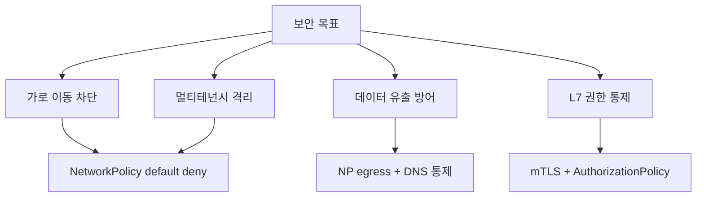
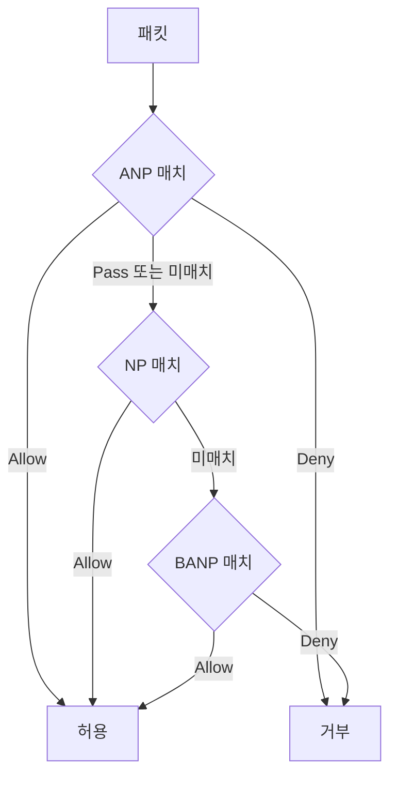
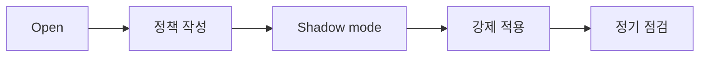
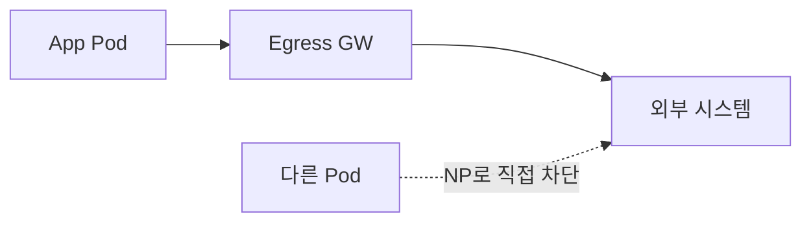
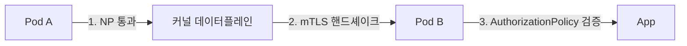

# Network Policy 전략

> **2026년의 자리**: K8s NetworkPolicy(NP)는 *L3/L4 마이크로세그멘테이션*의
> 표준. **mTLS가 신원**이라면 NP는 **연결성**. 둘은 *직교적·보완적*이며, NP
> 없는 mTLS는 가로 이동 방어가 약하고, mTLS 없는 NP는 신원 위변조에 약하다.
> 본 글은 NetworkPolicy *리소스 사용법*이 아니라 **전략·계층화·default deny
> 마이그레이션**을 다룬다.

- **이 글의 자리**: NetworkPolicy *리소스·CNI 동작*은
  [kubernetes/network-policy](../../kubernetes/service-networking/network-policy.md),
  *mTLS 인증·인가*는 [mTLS 전략](mtls-strategy.md), *CNI 비교*는
  [network/cni-comparison](../../network/container-k8s-network/cni-comparison.md).
  여기는 **언제·어떻게·어디서 정책을 적용할지의 전략**.
- **선행 지식**: Pod·namespace·label, K8s NetworkPolicy 기본 문법,
  CNI(Calico·Cilium·Antrea·OVN-K), CoreDNS.

---

## 1. 두 가지 명제

> **명제 1**: NetworkPolicy 없는 클러스터 = *flat network*. 한 Pod 침해 시
> 전 클러스터 가로 이동 가능. CIS Benchmark·NSA Hardening Guide 모두
> "default deny" 의무.
>
> **명제 2**: NP는 *L3/L4*. L7(HTTP method, gRPC service) 통제는 NP만으로
> 불가 — Service Mesh 또는 Cilium L7 NetworkPolicy 필요.



---

## 2. NP의 4가지 자연스러운 계층

| 계층 | 적용 단위 | 누가 작성 |
|---|---|---|
| **Cluster baseline** (BANP) | 전 클러스터 — 기본값 | 보안팀 (한 번) |
| **Cluster admin override** (ANP) | 전 클러스터 — *우선* 강제 | 보안팀 |
| **Namespace policy** | namespace 내·간 | 플랫폼팀·보안팀 |
| **Workload policy** | 앱별 ingress·egress | 앱팀 |



### 2.1 우선순위 (sig-network-policy-api)

| 평가 순서 | 정책 | 가능 동작 | 스코프 | 핵심 |
|:-:|---|---|---|---|
| 1 (최상위) | **AdminNetworkPolicy (ANP)** | Allow / Deny / **Pass** | 클러스터 | Pass = "다음 정책에 위임" — NP/BANP가 결정 |
| 2 | **NetworkPolicy (NP)** | Allow only | namespace | 표준 K8s — namespace 사용자가 작성 |
| 3 (기본값) | **BaselineAdminNetworkPolicy (BANP)** | Allow / Deny | 클러스터 (singleton) | 명시적 매치 없을 때 마지막 결정 |

> **ANP `Pass` 의미**: ANP가 명시적 Allow/Deny가 아닌 *Pass*를 반환하면 평가가
> NP로 *위임*. 즉 보안팀이 "이 영역은 namespace 사용자가 알아서"라고 표현.
> Allow/Deny는 *확정*, Pass는 *위임*.

> **2026-04 구현 매트릭스** — 상위 API는 여전히 `policy.networking.k8s.io/v1alpha1`
> (v1beta1 졸업 진행 중):
>
> | CNI | ANP | BANP |
> |---|---|---|
> | OVN-Kubernetes (upstream) | v1alpha1 production-ready | v1alpha1 production-ready |
> | OpenShift OVN-K | OCP 4.16+ GA | OCP 4.16+ GA |
> | Calico | 진행 중 (issue #5891) | 진행 중 |
> | Cilium | 진행 중 (CFP #23380) | 진행 중 |
> | Antrea | 자체 ClusterNetworkPolicy/Tier 우선, ANP는 부분 |
>
> **현실**: API가 v1alpha1이므로 *표준화 지속 변경* 가능성. 다수 환경은 여전히
> NP 단독 + CNI 확장(CiliumNetworkPolicy·Calico GlobalNetworkPolicy/Tier)으로
> 클러스터 정책. ANP/BANP는 *멀티-CNI 표준*으로 점진 채택. v1beta1·v1
> 안정화 시 마이그 검토.

---

## 3. Default Deny — 가장 중요한 결정

### 3.1 왜 default deny인가

| 패턴 | 의미 |
|---|---|
| **Default Allow + 명시적 Deny** | 알려진 위협만 차단 — *알려지지 않은* 가로 이동 무력 |
| **Default Deny + 명시적 Allow** | "허용 안 한 건 다 막힘" — Zero Trust 표준 |

> **CIS Kubernetes Benchmark 5.3.2**: "All workload namespaces should have
> default network policies in place." NSA/CISA Hardening Guide도 동일.

### 3.2 default deny 4가지 단계

```yaml
# 1. ingress·egress 모두 막는 namespace 기본
apiVersion: networking.k8s.io/v1
kind: NetworkPolicy
metadata:
  name: default-deny-all
  namespace: payments
spec:
  podSelector: {}
  policyTypes: ["Ingress", "Egress"]
```

| 단계 | 동작 |
|---|---|
| **(1) 모든 namespace에 default deny** | shadow mode — log only로 시작 |
| **(2) 시스템 통신 allowlist** | DNS, kube-apiserver, observability scrape |
| **(3) 워크로드별 allowlist** | 앱 → DB, 앱 → 외부 API |
| **(4) cluster baseline 선언** | BANP 또는 동등한 CNI 정책으로 강제 |

### 3.3 마이그레이션 패턴



| 단계 | 도구 |
|---|---|
| **(1) 트래픽 발견** | Cilium Hubble, Calico Flow Logs, Inspektor Gadget, kube-flowctl |
| **(2) 정책 자동 생성** | `cilium policy generate`, Tigera 정책 추천 |
| **(3) Shadow mode** | Cilium `enforcement-mode=audit`, Calico **staged policy** |
| **(4) Enforcement** | strict mode 전환 — 시스템 트래픽·dev부터 |
| **(5) Drift 감시** | Hubble alert, audit log |

**Calico staged policy**: 정책에 `staged:` prefix → enforce 안 하고 *deny
카운터·flow log만 집계*. shadow → enforce 전환 *판단 기준*:

| 기준 | 임계 |
|---|---|
| staged deny 카운트 | 7일 연속 0 (예외 시 정책 보강) |
| 시스템 트래픽 정상 | DNS·apiserver·metrics 100% |
| 알람·SLO 회귀 없음 | 베이스라인 ± σ |
| 앱팀 sign-off | 영향 워크로드 owner 확인 |

> **점진 확장 패턴**: dev → staging → 카나리 namespace 1~2개 prod →
> 메트릭·SLO 정상 1주 → 점진 prod 확장. 한 번에 모든 namespace에 자동 enforce
> 금지 — *blast radius 제한*.

> **함정**: 정책 작성 없이 default deny → 클러스터 마비. *반드시* 트래픽
> 발견 → shadow → enforce 단계.

---

## 4. 시스템 트래픽 — 항상 필요한 것

NP를 켜면 끊기는 *교과서적 4종*:

| 트래픽 | 영향 |
|---|---|
| **DNS (CoreDNS)** | 서비스 검색 불가 — 모든 호출 실패 |
| **kube-apiserver** | leader election·CRD watch·webhook |
| **metrics scrape** | Prometheus·OTel collector → 워크로드 |
| **헬스체크** | kubelet → liveness/readiness |

### 4.1 DNS 허용

```yaml
apiVersion: networking.k8s.io/v1
kind: NetworkPolicy
metadata:
  name: allow-egress-dns
  namespace: payments
spec:
  podSelector: {}
  policyTypes: ["Egress"]
  egress:
  - to:
    - namespaceSelector:
        matchLabels:
          kubernetes.io/metadata.name: kube-system
      podSelector:
        matchLabels:
          k8s-app: kube-dns
    ports:
    - protocol: UDP
      port: 53
    - protocol: TCP
      port: 53
```

### 4.2 kube-apiserver — IP 직접 사용

```yaml
# 표준 NP (CNI 추상 없음)
egress:
- to:
  - ipBlock:
      cidr: <kubernetes service ClusterIP>/32
  ports:
  - protocol: TCP
    port: 443
```

```bash
# 환경별로 ClusterIP 다름 — 직접 조회
kubectl get svc kubernetes -n default -o jsonpath='{.spec.clusterIP}'
```

> **함정**: NP는 *Pod selector*가 기본. kube-apiserver는 Pod이 아니라 *호스트
> 프로세스* → Pod selector로 안 잡힘. **`ipBlock`으로 ClusterIP 직접 명시**.
> kubeadm·EKS·GKE·HA 환경마다 ClusterIP 다름 — 매니페스트에 하드코딩 금지.
> Cilium은 `toEntities: kube-apiserver`, Calico는 동등한 추상으로 *환경 독립*
> 작성 가능 — 멀티 클러스터에 권장.

### 4.2.5 hostNetwork Pod — NP 우회

`hostNetwork: true`인 Pod은 노드 네트워크 스택을 직접 사용 → **NP 평가 대상이
아님**. 다음 컴포넌트가 보통 hostNetwork:

| 컴포넌트 | 이유 |
|---|---|
| **kubelet (호스트 자체)** | 노드 프로세스 |
| **kube-proxy** | iptables 조작 |
| **CNI agent** (Calico-node·cilium-agent) | 데이터플레인 자체 |
| **node-exporter·node-problem-detector** | 호스트 메트릭 |
| **일부 ingress controller (host port)** | 외부 노출 |

> **함정**: NP를 hostNetwork Pod에 부여해도 **무력**. host-level 방화벽
> (firewalld·nftables·node SecurityGroup) 또는 노드 ISO·전용 노드풀로 격리.
> 침해 시 *노드 전체 네트워크 신원*으로 행동 가능 → blast radius 큼.

### 4.3 NSA/CISA Hardening Guide의 표준 번들

```yaml
# 모든 namespace 기본
- DNS allowed (CoreDNS)
- kube-apiserver allowed
- metrics scrape from observability namespace allowed
- ingress controller로부터의 ingress는 ingress namespace에서만
```

→ 보안팀이 *cluster baseline*으로 모든 namespace에 자동 적용 (BANP·CNI 글로벌
정책).

---

## 5. 멀티 테넌시 — namespace 격리

### 5.1 Hard vs Soft 멀티테넌시

| 모델 | NP 패턴 |
|---|---|
| **Soft** (같은 회사 팀들) | namespace 간 명시적 allow 가능, 기본 deny |
| **Hard** (외부 고객 같은 클러스터) | namespace 간 *완전 격리* + cluster baseline ANP |

### 5.2 Default deny + 명시적 cross-ns 허용

```yaml
# payments → orders 만 허용
apiVersion: networking.k8s.io/v1
kind: NetworkPolicy
metadata:
  name: allow-orders-from-payments
  namespace: orders
spec:
  podSelector:
    matchLabels:
      app: orders-api
  ingress:
  - from:
    - namespaceSelector:
        matchLabels:
          kubernetes.io/metadata.name: payments
      podSelector:
        matchLabels:
          app: payments-api
    ports:
    - protocol: TCP
      port: 8080
```

### 5.3 Hard 멀티테넌시 — cluster-scoped 강제

```yaml
# AdminNetworkPolicy: cross-tenant 차단을 *클러스터 레벨*에서
# (sig-network-policy-api v1alpha1 — 향후 변경 가능)
apiVersion: policy.networking.k8s.io/v1alpha1
kind: AdminNetworkPolicy
metadata:
  name: tenant-isolation
spec:
  priority: 10
  subject:
    namespaces:
      matchLabels:
        tenant.io/managed: "true"
  ingress:
  - action: Deny
    from:
    - namespaces:
        notMatchLabels:
          tenant.io/id: ""    # 같은 tenant.io/id가 아니면 거부
  # 또는 v1alpha2 SameLabels semantic 사용 (구현체별 지원 확인)
```

> **API 안정성**: ANP의 *cross-tenant matching* 문법은 v1alpha1→v1alpha2→
> v1beta1로 진화 중. 위 예시는 *개념 시연*이며, 실제 운영 시 자기 CNI
> 구현체의 [v1alpha1 spec](https://network-policy-api.sigs.k8s.io/reference/spec/)
> 매뉴얼 검증 필수. 대안: namespace label 기반 *matchLabels 명시 enumeration*.

> **NP의 한계**: namespace 사용자가 NP를 *우회 가능* (자기 ns에서 안 만들면
> 끝). hard 멀티테넌시는 **ANP/BANP** 또는 CNI 글로벌 정책으로 *우회 불가*하게.

### 5.4 namespace label 표준

```yaml
metadata:
  labels:
    kubernetes.io/metadata.name: payments    # 1.21+ 자동 부여
    tenant.io/id: company-a
    env: prod
    pci-scope: "true"
```

> 1.21+에서 `kubernetes.io/metadata.name` 자동. 그 외 *조직 표준 라벨* (tenant,
> env, scope)을 의무화 — admission policy로 강제.

---

## 6. Egress 통제 — 데이터 유출 방어

### 6.1 왜 egress가 어려운가

- 외부 IP는 *변동* (CDN·SaaS API)
- DNS 이름 → IP 매핑이 NP 평가 시점에 동적
- *namespace selector*로는 외부 호출 통제 불가

### 6.2 패턴별

| 패턴 | 도구 |
|---|---|
| **고정 IP의 외부 시스템** | NP `ipBlock` |
| **DNS 이름 기반** | CiliumNetworkPolicy `toFQDNs`, Calico `domains` |
| **모든 외부 차단 + egress GW만 허용** | Service Mesh egress gateway 또는 squid proxy |
| **광범위 차단** | NP `egress: []` (= 모든 egress 차단) + 명시적 allow |

### 6.3 FQDN 정책 (CNI 확장)

```yaml
# CiliumNetworkPolicy
apiVersion: cilium.io/v2
kind: CiliumNetworkPolicy
metadata:
  name: egress-allowed-saas
  namespace: payments
spec:
  endpointSelector:
    matchLabels:
      app: payments-api
  egress:
  - toFQDNs:
    - matchName: api.stripe.com
    - matchPattern: "*.amazonaws.com"
```

> **함정**: FQDN 정책은 CNI별 차이. Calico는 `domains` 필드, Cilium은
> `toFQDNs`. 표준 NP에는 없음. *cluster baseline ANP*는 FQDN 미지원
> (sig-network-policy-api 진행 중).

**FQDN 정책의 보안 한계**:

| 한계 | 의미 |
|---|---|
| DNS 가로채기 의존 | CNI가 DNS 응답을 sniff해 IP 학습 → DNS 차단·DoH/DoT 사용 시 정책 동작 X |
| TTL 만료 race | TTL 직후 FQDN→IP 매핑 갱신 중 짧은 차단·허용 race |
| 같은 IP 공유 SaaS | CDN behind 동일 IP에 여러 도메인 공존 → 정책으로 *도메인 단위 분리* 불가 |
| DNS spoofing | 악성 DNS 응답으로 신뢰 IP 학습 강요 |

> **권고**: FQDN 정책은 *허용리스트의 1차 필터*로 — 진짜 보안 경계는
> egress GW의 *TLS SNI 검증* 또는 *aware proxy*(Squid SSL bump 등). FQDN만
> 신뢰하지 말 것.

### 6.4 Egress Gateway 패턴



- NP는 Pod → 외부 *직접 호출* 차단
- *모든 외부 호출은 egress GW를 거치게 강제*
- egress GW는 인증·로깅·rate limit 집중
- Istio Egress Gateway, Cilium Egress Gateway, Squid+SSL bump

---

## 6.5 NP × mTLS — 직교적 보완

NP와 mTLS는 *서로 다른 평면*에서 동작:

| 관점 | NP | mTLS |
|---|---|---|
| 평가 위치 | 커널 datapath (eBPF/iptables) | 사이드카·ztunnel·앱 (userspace) |
| 평가 단위 | 패킷 (L3/L4) | connection·request (L4/L7) |
| 차단 대상 | "연결 자체" | "신원·인증" |
| 실패 모드 | 패킷 드롭 | TLS 핸드셰이크 실패 |
| 위변조 방어 | Pod IP 위변조에 약함 | X.509 신원 |

**결합 시너지**:



| 단계 | 보호 |
|---|---|
| (1) NP | "이 namespace·label에서 오는가" — 연결성 |
| (2) mTLS | "암호학적으로 신원 증명되는가" — 인증 |
| (3) AuthorizationPolicy | "이 신원이 이 동작을 할 수 있는가" — 인가 |

> **NP만**: Pod IP·label 위변조에 약함 — 같은 namespace의 다른 Pod 침해
> 시 가로 이동 가능.
>
> **mTLS만**: 연결 자체가 처음부터 차단되지 않아 *DDoS 표면*.
>
> **둘 다 필요**: NP가 연결을 막고, 통과한 트래픽은 mTLS로 신원 증명.
> Defense-in-depth.

## 7. L7 정책 — Service Mesh 또는 Cilium

표준 NP는 **L3/L4만**. HTTP method/path, gRPC service 단위는 별도 도구.

| 도구 | L7 정책 |
|---|---|
| **Cilium NetworkPolicy** | `rules.http`로 method·path·header — eBPF 데이터플레인 |
| **Istio AuthorizationPolicy** | mesh의 mTLS와 결합, RBAC by SPIFFE ID |
| **Linkerd Server/HTTPRoute** | 단순 HTTP 정책 |
| **Network Policy (표준)** | L7 미지원 |

```yaml
# CiliumNetworkPolicy — L7
spec:
  endpointSelector:
    matchLabels:
      app: payments-api
  ingress:
  - fromEndpoints:
    - matchLabels:
        app: orders-ui
    toPorts:
    - ports:
      - port: "8080"
      rules:
        http:
        - method: "GET"
          path: "/v1/orders"
        - method: "POST"
          path: "/v1/orders"
```

> **선택**: NP만 = L3/L4 충분. mTLS + AuthorizationPolicy 또는 Cilium L7 =
> L7 권한. 둘 다 가능.
>
> **L7 통제 비교**:
>
> | 차원 | Cilium L7NP | Mesh AuthorizationPolicy |
> |---|---|---|
> | 정책 표현력 | HTTP method/path/header — 단순 | SPIFFE ID + JWT claim + path/method — 풍부 |
> | TLS 종료 | Envoy proxy 우회 (mTLS 환경 = 별도 종료) | sidecar/ztunnel 내부 (mTLS와 통합) |
> | 관측성 | Hubble | mesh 표준 (Envoy access log·OTel) |
> | 신원 모델 | label/IP | SPIFFE ID |
> | 추가 비용 | eBPF L7 처리 (proxy 트립) | mesh 기반 비용 |
>
> **결론**: 신원 기반(SPIFFE ID)·복잡 정책·mTLS 통합 필요 = mesh
> AuthorizationPolicy. 단순 HTTP 통제·메시 회피 = Cilium L7NP. mTLS 환경에서
> Cilium L7은 *별도 종료*가 필요해 비용 큼.

---

## 8. 운영 — 발견·디버깅·관측

### 8.1 트래픽 발견

| 도구 | 용도 |
|---|---|
| **Cilium Hubble** | Pod 간·외부 트래픽 시각화·flow log |
| **Calico Flow Logs** | flow 단위 로그 (ES·Kafka로 송출) |
| **Inspektor Gadget** | eBPF 기반 netpol 추적 |
| **kube-flowctl** | NP 적용 전 트래픽 캡처 |
| **Istio access log** | mesh 트래픽 |

### 8.2 정책 자동 생성

| 도구 | 동작 |
|---|---|
| **Cilium `policy generate`** | flow log → NP YAML |
| **Calico Policy Recommendation** | Tigera Enterprise |
| **Network Policy Editor** (editor.networkpolicy.io) | 시각적 작성 |
| **kubectl-trace + bpftrace** | low-level 검증 |

### 8.3 디버깅 — *왜 차단됐나*

| 도구 | 출력 |
|---|---|
| **Hubble `cilium hubble observe`** | 거부된 flow + 어떤 정책 |
| **Calico `calicoctl convert`** | NP → 실제 iptables/eBPF |
| **`kubectl describe networkpolicy`** | 적용된 selector |
| **`kubectl exec` + `nc`/`curl`** | 연결 테스트 |
| **`networkpolicy.io` editor** | 정책 시각화 |

> **함정**: NP는 *명시적 거부 로그가 표준화 안 됨*. CNI별 다름 — Cilium Hubble,
> Calico Flow Logs, OVN-K audit log. SIEM에 전송 의무.

### 8.4 관측 메트릭

| 메트릭 | 의미 |
|---|---|
| `cilium_policy_l7_total` | L7 정책 평가 횟수 |
| `cilium_drop_count_total` | 드롭 카운트 |
| `calico_denied_packets` | Calico 거부 |
| `hubble_drop_total` | Hubble 드롭 |

---

## 9. CIS·NSA·NIST 매핑

| 표준 | 요구 | 충족 |
|---|---|---|
| **CIS K8s 5.3.2** | 모든 namespace에 default policy | NP `default-deny-all` 또는 ANP/BANP |
| **NSA/CISA Hardening 3.4** | "default deny + namespace 분리" | ANP + BANP |
| **NIST SP 800-204** | 마이크로서비스 보안 — 마이크로세그멘테이션 | NP + L7 (mesh 또는 Cilium) |
| **PCI DSS 4.0 1.2.5** | 인바운드/아웃바운드 트래픽 통제 | NP egress + egress GW |
| **HIPAA §164.312(e)(1)** | transmission security | NP + mTLS + 외부 차단 |

---

## 10. 안티패턴

| 안티패턴 | 결과 | 교정 |
|---|---|---|
| NetworkPolicy 미설치 | flat network, 가로 이동 자유 | 모든 ns default deny |
| NP 켜고 DNS 미허용 | 모든 호출 실패, 클러스터 마비 | DNS allowlist 의무 |
| kube-apiserver 차단 | leader election 실패, watcher 끊김 | `ipBlock` 또는 `toEntities` |
| `egress: []`만으로 외부 차단 | DNS·외부 호출 끊김 → 응답 시 webhook·OAuth 등 외부 의존 동작 X (ingress 자체는 흐름) | DNS·apiserver allowlist 후 적용 |
| L7 통제를 NP로 시도 | NP는 L3/L4 — 실패 | Cilium L7NP 또는 mTLS+AuthorizationPolicy |
| FQDN 정책 표준 NP로 | 미지원 | CNI 확장 (Cilium·Calico) |
| ns 사용자가 자기 NP만 작성 (cross-ns 신뢰) | tenant 우회 | ANP/BANP로 cluster 강제 |
| 정책 작성 없이 default deny 직행 | 트래픽 끊김 | shadow mode → 점진 enforce |
| 하나의 namespace에 모든 워크로드 | NP 작성 어려움 | namespace 분리 |
| `ipBlock` CIDR만으로 외부 SaaS 통제 | IP 변동 | FQDN 정책 또는 egress GW |
| egress GW 미사용 | 외부 호출 분산, audit 어려움 | egress GW 단일화 |
| NP audit log SIEM 미연동 | 사고 후 추적 불가 | Hubble/Flow Logs → SIEM |
| NP가 mTLS와 결합 안 됨 | 신원 위변조 위험 | mTLS + NP 동시 |
| Cilium L7NP를 NP로 착각 | 표준 NP가 L7 적용된다고 오해 | CiliumNetworkPolicy CRD 사용 명시 |
| 정책 변경을 GitOps 외부에서 수동 | drift, 감사 부적합 | ArgoCD/Flux로 관리 |
| 클러스터 표준 라벨 없음 | namespaceSelector 작동 X | `tenant`·`env`·`pci-scope` admission 강제 |
| NP only — egress 미정책 | 데이터 유출 방어 X | egress 명시 + 외부 차단 |
| ANP/BANP 미고려, CNI 확장만 의존 | 멀티-CNI 환경에서 정책 표준 부족 | sig-net-policy-api 추적 |
| `hostNetwork` Pod에 NP 적용 시도 | 적용 안 됨 (host stack 우회) | hostNetwork Pod 별도 설계, kubelet 호스트 방화벽 |
| ingress controller로부터의 ingress 미고려 | LB/Ingress 끊김 | ingress namespace allowlist |
| 모든 정책을 cluster admin이 작성 | 앱팀 자율성·확장성 | 계층 분리 — admin/팀/앱 |

---

## 11. 운영 체크리스트

**전략·도입**
- [ ] 모든 namespace에 default deny (CIS 5.3.2)
- [ ] cluster baseline 정책 — DNS/apiserver/observability/ingress 허용
- [ ] Hard 멀티테넌시는 ANP/BANP 또는 CNI 글로벌 정책
- [ ] namespace 표준 라벨 (`tenant`·`env`·`pci-scope`) admission 강제
- [ ] mTLS와 *동시* 적용 — NP는 연결성, mTLS는 신원

**마이그레이션**
- [ ] 트래픽 발견(Hubble/Flow Logs) → 정책 추천 → shadow → enforce
- [ ] 시스템 트래픽 먼저 안정화 (DNS·apiserver·metrics)
- [ ] 워크로드별 allowlist는 앱팀이 작성 (ownership)
- [ ] enforcement 후 *최소 1주 모니터링*, alert 정상화 후 다음 ns

**egress·외부**
- [ ] 외부 호출은 egress GW 단일화
- [ ] FQDN 정책은 CNI 확장 (Cilium toFQDNs, Calico domains)
- [ ] *명시적 allowlist* — IP·도메인 화이트리스트
- [ ] egress GW에 audit·rate limit·인증

**관측·운영**
- [ ] Hubble/Flow Logs → SIEM 송출
- [ ] 거부 메트릭·flow log 대시보드
- [ ] NP 변경은 GitOps로 — drift 알림
- [ ] 정기 정책 점검 (분기) — 미사용·중복 정리

**L7**
- [ ] L7 통제 필요 시 Cilium L7NP 또는 mesh AuthorizationPolicy
- [ ] HTTP method/path 단위 정책으로 BFLA·BOLA 방어

---

## 참고 자료

- [Kubernetes — Network Policies](https://kubernetes.io/docs/concepts/services-networking/network-policies/) (확인 2026-04-25)
- [sig-network-policy-api — AdminNetworkPolicy](https://network-policy-api.sigs.k8s.io/) (확인 2026-04-25)
- [Cilium — Network Policy](https://docs.cilium.io/en/stable/security/policy/) (확인 2026-04-25)
- [Calico — Default Deny Quickstart](https://docs.tigera.io/calico/latest/network-policy/get-started/kubernetes-default-deny) (확인 2026-04-25)
- [OVN-Kubernetes — AdminNetworkPolicy](https://ovn-kubernetes.io/features/network-security-controls/admin-network-policy/) (확인 2026-04-25)
- [NSA/CISA — Kubernetes Hardening Guide](https://media.defense.gov/2022/Aug/29/2003066362/-1/-1/0/CTR_KUBERNETES_HARDENING_GUIDANCE_1.2_20220829.PDF) (확인 2026-04-25)
- [CIS Kubernetes Benchmark](https://www.cisecurity.org/benchmark/kubernetes) (확인 2026-04-25)
- [Network Policy Editor](https://editor.networkpolicy.io/) (확인 2026-04-25)
- [Hubble — Cilium Observability](https://github.com/cilium/hubble) (확인 2026-04-25)
