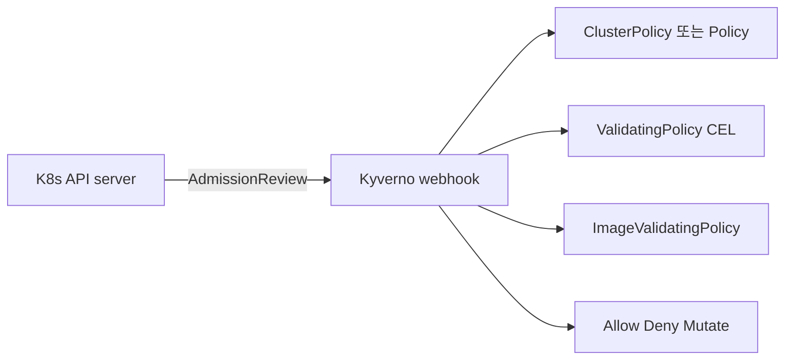
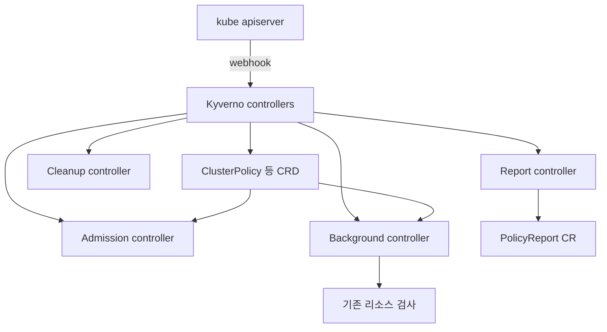
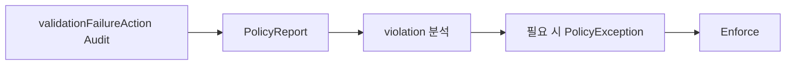

# Kyverno

> **2026년의 자리**: Kyverno는 *K8s 네이티브* 정책 엔진. **YAML로 정책 작성**
> — 별도 DSL 학습 X. 2024-11 **CNCF Incubating**. 2025-04 **v1.14**에서
> CEL 기반 `ValidatingPolicy`·`ImageValidatingPolicy` 도입으로 K8s 표준
> ValidatingAdmissionPolicy와 정렬. validation·mutation·generation·image
> 검증·cleanup·exception을 한 도구로.

- **이 글의 자리**: [OPA·Gatekeeper](opa-gatekeeper.md)와 K8s 정책 2대 도구.
- **선행 지식**: K8s admission controller·webhook, JSON·YAML, label/selector,
  CEL 기본.

---

## 1. 한 줄 정의

> **Kyverno**: "Kubernetes admission controller 자체를 *K8s native CRD + YAML*
> 로 정의하는 정책 엔진. validate·mutate·generate·verifyImages·cleanup·
> policyException을 한 도구로."



---

## 2. 왜 Kyverno인가

| 가치 | 의미 |
|---|---|
| **YAML 정책** | Rego 학습 X — K8s 운영자에게 친숙 |
| **K8s native** | K8s 추상(Pod·Service·Label)이 1급 시민 |
| **6가지 룰 종류** | validate·mutate·generate·verifyImages·cleanup·exception |
| **이미지 검증 1급** | Cosign·Notation 직접 통합 |
| **PolicyException** | 정책 우회를 별도 CRD로 통제 — RBAC으로 분리 |
| **AdmissionPolicy 자동 생성** (1.13+) | K8s ValidatingAdmissionPolicy 발행 — webhook 우회 가능 |
| **CEL 기반 신규 정책** (1.14+) | ValidatingPolicy·ImageValidatingPolicy |
| **kyverno-json** | K8s 외 JSON 검증 (Terraform·CI 매니페스트 등) — Kyverno 정책 표현을 일반 JSON에 |

---

## 3. 아키텍처



| 컴포넌트 | 역할 |
|---|---|
| **Admission controller** | webhook으로 새 리소스 검증·변환 |
| **Background controller** | 기존 리소스 정기 검사 (audit) |
| **Reports controller** | `PolicyReport` CR 발행 |
| **Cleanup controller** | 정책 기반 자동 cleanup |
| **PolicyException** | 특정 리소스 우회 — RBAC 분리 |

### 3.1 버전·동향 (2026-04 기준)

| 버전 | 출시 | 주요 |
|---|---|---|
| **1.16** | 2026-Q1 | 안정화·CEL 표현 확장 |
| **1.15** | 2025-07-31 | Reports server 안정화, ValidatingPolicy GA 진행 |
| **1.14** | 2025-04-25 | **`ValidatingPolicy` + `ImageValidatingPolicy`** (CEL 기반 신규 CRD), K8s VAP 정렬 |
| **1.13** | 2024-10 | `assert` JSON tree, ValidatingAdmissionPolicy 자동 생성 |
| **1.12** | 2024-04 | `verifyImages` 강화, CNCF Incubating |
| **1.11** | 2024-01 | autogen 강화, namespace selector |

> **Reports server (1.13+)**: PolicyReport를 etcd 대신 별도 DB에 저장 — 대규모
> 클러스터에서 etcd 폭주 방지. 수만 워크로드 환경 의무.

---

## 4. ClusterPolicy — 6가지 룰 종류

```yaml
apiVersion: kyverno.io/v1
kind: ClusterPolicy
metadata:
  name: pod-standards
spec:
  validationFailureAction: Enforce    # Enforce | Audit
  background: true                     # 기존 리소스도 audit
  rules:
    # 1. validate
    - name: require-team-label
      match:
        any:
        - resources: { kinds: [Pod] }
      validate:
        message: "team label is required"
        pattern:
          metadata:
            labels:
              team: "?*"
    # 2. mutate
    - name: add-imagepullsecret
      match:
        any:
        - resources: { kinds: [Pod] }
      mutate:
        patchStrategicMerge:
          spec:
            imagePullSecrets:
              - name: regcred
    # 3. generate
    - name: default-networkpolicy
      match:
        any:
        - resources: { kinds: [Namespace] }
      generate:
        kind: NetworkPolicy
        name: default-deny
        namespace: "{{request.object.metadata.name}}"
        synchronize: true
        data:
          spec:
            podSelector: {}
            policyTypes: [Ingress, Egress]
```

**ClusterPolicy `rules[]` 4종**:

| 룰 종류 | 용도 |
|---|---|
| **validate** | 차단·경고 (pattern·deny·foreach·cel·assert) |
| **mutate** | 자동 변환 (patchStrategicMerge·patchesJson6902·foreach) |
| **generate** | 새 namespace에 default 리소스 자동 생성 |
| **verifyImages** | Cosign·Notation 이미지 서명·attestation 검증 |

**별도 CRD 2종** — Kyverno가 다루는 영역 확장:

| CRD | 용도 |
|---|---|
| **`ClusterCleanupPolicy` / `CleanupPolicy`** | TTL 기반 자동 삭제 (Helm chart 임시 리소스 등) |
| **`PolicyException`** | 정책 우회를 통제하는 별도 CRD — RBAC 분리 |

---

## 5. validate — 4가지 표현 방식

### 5.1 Pattern (가장 단순)

```yaml
validate:
  message: "memory limit required"
  pattern:
    spec:
      containers:
        - resources:
            limits:
              memory: "?*"     # 임의 값, 빈 값 X
```

| 와일드카드 | 의미 |
|---|---|
| `?*` | 1자 이상 |
| `*` | 0자 이상 |
| `?` | 1자 |
| `!*` | 정의되지 않음 |
| `>5` / `<10` | 숫자 비교 |

### 5.2 Deny (조건식)

```yaml
validate:
  message: "privileged forbidden"
  deny:
    conditions:
      any:
      - key: "{{ request.object.spec.containers[].securityContext.privileged | [] }}"
        operator: AnyIn
        value: [true]
```

### 5.3 CEL (1.11+)

```yaml
validate:
  cel:
    expressions:
    - expression: "object.spec.containers.all(c, has(c.resources.limits.memory))"
      message: "memory limit required"
```

> CEL은 K8s 1.30+ ValidatingAdmissionPolicy native 표현. Kyverno는 같은 CEL을
> 사용해 *VAP 자동 생성* (1.13+).

### 5.4 Assert (JSON tree)

```yaml
validate:
  assert:
    all:
    - check:
        spec:
          containers:
            (length(@) > `0`): true
```

---

## 6. mutate — 자동 변환

### 6.1 patchStrategicMerge

```yaml
mutate:
  patchStrategicMerge:
    spec:
      securityContext:
        runAsNonRoot: true
      containers:
        - (name): "*"
          securityContext:
            allowPrivilegeEscalation: false
```

`(name): "*"`은 *모든 컨테이너에 적용*하는 anchor.

### 6.2 foreach

```yaml
mutate:
  foreach:
    - list: "request.object.spec.containers"
      patchesJson6902: |-
        - op: add
          path: "/spec/containers/{{elementIndex}}/imagePullPolicy"
          value: "Always"
```

### 6.3 mutateExisting (background)

```yaml
mutate:
  targets:
    - apiVersion: v1
      kind: ConfigMap
      namespace: payments
  patchStrategicMerge:
    metadata:
      labels:
        managed-by: kyverno
```

> Background controller가 기존 리소스도 변환. *deletion 시점*에도 trigger 가능.

---

## 7. generate — 자동 리소스 생성

### 7.1 namespace 생성 시 default 정책 자동

```yaml
- name: default-networkpolicy
  match:
    any:
    - resources: { kinds: [Namespace] }
  generate:
    apiVersion: networking.k8s.io/v1
    kind: NetworkPolicy
    name: default-deny
    namespace: "{{request.object.metadata.name}}"
    synchronize: true        # 자동 sync
    data:
      spec:
        podSelector: {}
        policyTypes: [Ingress, Egress]
```

| 사용처 | 예 |
|---|---|
| 새 namespace에 default deny NetworkPolicy | 위 예 |
| 새 namespace에 ResourceQuota·LimitRange | 멀티테넌시 |
| 새 namespace에 RBAC default | 자동 권한 |
| 새 namespace에 PSA 라벨 | `pod-security.kubernetes.io/enforce: restricted` |

> `synchronize: true`: 원본 데이터 변경 시 generated 리소스도 자동 갱신.

---

## 8. verifyImages — 이미지 서명 검증

### 8.1 Cosign keyless

```yaml
- name: verify-images
  match:
    any:
    - resources: { kinds: [Pod] }
  verifyImages:
    - imageReferences: ["ghcr.io/acme/*"]
      attestors:
        - entries:
          - keyless:
              issuer: https://token.actions.githubusercontent.com
              subject: "https://github.com/acme/.+/.github/workflows/build.yml@refs/heads/main"
              rekor:
                url: https://rekor.sigstore.dev
      mutateDigest: true        # tag → digest 자동 치환
      verifyDigest: true        # digest 자체 검증
      required: true            # 서명 의무
```

### 8.2 Notation (Notary Project)

```yaml
verifyImages:
  - imageReferences: ["registry.acme.com/prod/*"]
    type: Notary
    attestors:
      - entries:
        - certificates:
            cert: |
              -----BEGIN CERTIFICATE-----
              ...
```

### 8.3 Attestation 검증 (SBOM·SLSA)

```yaml
verifyImages:
  - imageReferences: ["ghcr.io/acme/*"]
    attestations:
      - type: https://slsa.dev/provenance/v1
        attestors:
          - entries:
            - keyless: { ... }
        conditions:
          - all:
            - key: "{{ buildDefinition.buildType }}"
              operator: Equals
              value: "https://slsa-framework.github.io/github-actions-buildtypes/workflow/v1"
```

| 검증 대상 | 의미 |
|---|---|
| 서명 (signatures) | Cosign·Notation 검증 |
| SBOM attestation | CycloneDX·SPDX |
| SLSA provenance | Build L3 검증 |
| VEX | 영향 없음 분류 |

---

## 9. ValidatingPolicy + ImageValidatingPolicy (1.14+)

### 9.1 왜 새 CRD인가

ClusterPolicy의 `verifyImages`/`validate.cel`이 한 CRD에 혼재 → 복잡. **1.14**에서
*전용 CRD* 분리:

| 새 CRD | 용도 |
|---|---|
| **`ValidatingPolicy`** | CEL 기반 validation 전용 — VAP와 정렬 |
| **`ImageValidatingPolicy`** | 이미지 서명·attestation 검증 전용 |

### 9.2 ValidatingPolicy 예

```yaml
apiVersion: policies.kyverno.io/v1alpha1
kind: ValidatingPolicy
metadata:
  name: require-resource-limits
spec:
  validationActions: [Deny]
  matchConstraints:
    resourceRules:
      - apiGroups: [""]
        apiVersions: ["v1"]
        operations: ["CREATE", "UPDATE"]
        resources: ["pods"]
  validations:
    - expression: "object.spec.containers.all(c, has(c.resources.limits.memory))"
      message: "memory limit required"
```

> K8s 1.30+ `ValidatingAdmissionPolicy`와 **동일 CEL 표현**. Kyverno는 추가로
> *Kyverno 컨텍스트 변수*(label·external API 호출 등) 제공.

### 9.3 ImageValidatingPolicy 예

```yaml
apiVersion: policies.kyverno.io/v1alpha1
kind: ImageValidatingPolicy
metadata:
  name: verify-images
spec:
  validationActions: [Deny]
  matchConstraints:
    resourceRules:
      - apiGroups: [""]
        apiVersions: ["v1"]
        operations: ["CREATE"]
        resources: ["pods"]
  attestors:
    - name: gh-keyless
      cosign:
        keyless:
          identities:
            - issuer: https://token.actions.githubusercontent.com
              subject: "https://github.com/acme/.+/.github/workflows/build.yml@refs/heads/main"
  validations:
    - expression: "images.all(i, verifyImageSignatures(i, [attestors.gh-keyless]) > 0)"
      message: "all images must be signed"
```

---

## 10. PolicyException — 우회를 통제

```yaml
apiVersion: kyverno.io/v2
kind: PolicyException
metadata:
  name: legacy-app-exemption
  namespace: legacy
spec:
  exceptions:
    - policyName: pod-standards
      ruleNames: ["require-resource-limits"]
  match:
    any:
      - resources:
          kinds: [Pod]
          namespaces: [legacy]
          names: ["legacy-app-*"]
```

> **함정 회피의 핵심**: 일반 정책 우회를 *별도 CRD*로 → RBAC으로 분리 — 보안팀만
> exception 생성 가능. 정책 자체에 예외를 박아 넣지 않음.

---

## 11. ValidatingAdmissionPolicy 자동 생성 (1.13+)

조건이 충족되면 *자동* 활성 — 별도 hint annotation 불필요:

| 조건 | 의미 |
|---|---|
| `spec.validationFailureAction: Enforce` | enforce 모드 |
| `validate.cel` 사용 (CEL 표현) | VAP는 CEL only |
| 단순 validate (mutate·generate 없음) | VAP 표현 가능 범위 |
| `subjects`/`clusterRoles` match 사용 안 함 | VAP 미지원 |

→ Kyverno가 자동으로 K8s `ValidatingAdmissionPolicy` 생성 → **webhook 우회**,
API server 자체 admission으로 평가. 성능·가용성 강.

| 차원 | Kyverno webhook | 자동 생성 VAP |
|---|---|---|
| 평가 위치 | webhook Pod | API server 내부 |
| latency | webhook 호출 | 즉시 |
| 가용성 | Kyverno Pod 의존 | API server 자체 |
| 표현력 | 풍부 (mutate·generate·verifyImages 등) | CEL only — validate만 |

> **권고**: validate-only 정책은 VAP 자동 생성 — Kyverno 가용성 의존 제거.
> mutate·generate·verifyImages는 webhook 유지.

---

## 12. cleanup — 자동 삭제

```yaml
apiVersion: kyverno.io/v2alpha1
kind: ClusterCleanupPolicy
metadata:
  name: cleanup-old-jobs
spec:
  match:
    any:
    - resources:
        kinds: [Job]
        namespaces: [ci]
        selector:
          matchLabels:
            cleanup: "true"
  conditions:
    all:
      - key: "{{ target.metadata.creationTimestamp | time_to_seconds(@) }}"
        operator: LessThan
        value: "{{ time_now_utc() | time_to_seconds(@) - `86400` }}"
  schedule: "0 */6 * * *"     # 6시간마다
```

| 사용처 | 예 |
|---|---|
| 오래된 Job | TTL 후 삭제 |
| 임시 PVC | 사용 끝난 PVC |
| dev namespace 자동 정리 | 라벨 기반 |

---

## 13. 운영 — 도입 단계

### 13.1 Audit → Enforce



### 13.2 GitOps 통합

| 단계 | 설명 |
|---|---|
| ClusterPolicy/ValidatingPolicy = GitOps | 보안팀 owner |
| PolicyException = 별도 RBAC | 팀별 신청 PR |
| dev: Audit, prod: Enforce | 환경별 단계 |
| Kyverno Policies 라이브러리 | community + 자체 |

### 13.3 관측 메트릭

| 메트릭 | 의미 |
|---|---|
| `kyverno_admission_requests_total` | webhook 처리 수 |
| `kyverno_policy_results_total{rule, result}` | 결과 분류 |
| `kyverno_policy_execution_duration_seconds` | 평가 latency |
| `kyverno_policy_changes_total` | 정책 변경 |
| `kyverno_admission_review_duration_seconds` | webhook latency |

---

## 14. K8s ValidatingAdmissionPolicy (VAP) — 표준과의 관계

K8s 1.30 GA. *kube-apiserver 자체* 정책 (CEL 기반).

| 차원 | K8s VAP | Kyverno |
|---|---|---|
| 표현력 | CEL only, validate만 | CEL + YAML pattern + mutate·generate·verifyImages |
| 학습 | CEL | YAML + 조건 |
| 정책 라이브러리 | 부족 | Kyverno Policies |
| audit·report | 별도 도구 | PolicyReport native |
| K8s 외 통합 | X | X (K8s 전용) |

> **트렌드**: 단순 validate는 VAP, 복잡 정책은 Kyverno. Kyverno도 VAP 자동
> 생성으로 *둘 다 활용*.

---

## 15. Kyverno vs Gatekeeper — 정면 비교

| 차원 | **Kyverno** | **Gatekeeper** |
|---|---|---|
| **언어** | YAML + CEL | Rego |
| **K8s 통합** | 1급 | 일반 OPA |
| **mutation** | 강함·자유로움 | 가능 (3.10+) |
| **이미지 검증** | `verifyImages` 1급 | external data |
| **K8s 외** | X | OPA로 가능 |
| **VAP 자동 생성** | 1.13+ | X |
| **CNCF** | Incubating (2024-11) | Graduated (2021) |
| **운영자 친숙성** | 높음 | Rego 곡선 |
| **정책 표현 한계** | 매우 복잡한 set 연산은 약함 | Rego의 표현력 |

> **선택**: K8s만 + 빠른 도입 = **Kyverno**. K8s 외·복잡 정책 = **Gatekeeper**.
> 둘 *공존* — Kyverno는 단순·1급 K8s, Gatekeeper는 복잡·외부.

---

## 16. 안티패턴

| 안티패턴 | 결과 | 교정 |
|---|---|---|
| `Audit` 없이 `Enforce` 직행 | 갑작스런 차단 | Audit → 분석 → Exception → Enforce |
| 정책에 직접 예외 박음 | 추적·통제 불가 | PolicyException CRD + RBAC |
| `failurePolicy: Ignore` prod | 우회 가능 | `Fail` + replica HA |
| Kyverno 1.x 옛 버전 | 누락된 보안 패치 | 1.14+ |
| validate-only 정책에 webhook 강제 | API server 부하·SPOF | VAP 자동 생성 활용 |
| mutation·validation 같은 룰 | 충돌·예측 불가 | 분리 |
| `verifyImages`에 OIDC subject regex `.*` | organization 전체 trust | 정확한 workflow path |
| generate·synchronize false | 원본 변경 반영 X | `synchronize: true` |
| PolicyReport SIEM 미송출 | 컴플라이언스 증빙 어려움 | export controller |
| webhook timeout 너무 짧음 | external API 호출 시 fail | 충분한 timeout + 캐시 |
| ClusterPolicy 모두 한 파일 | 디버깅·재사용 어려움 | 정책별 분리 |
| PolicyException 권한 광범위 | 정책 우회 남발 | 보안팀만 + audit |
| K8s 1.30+ VAP 무시 | webhook 의존 과다 | 단순 정책은 VAP |
| 정책 단위 테스트 없음 | 회귀 | `kyverno test` CI 통합 |
| Kyverno Policies 라이브러리 무시 | 매번 재작성 | community 정책 채택 |
| 1 replica 운영 | webhook 다운 = `failurePolicy: Fail`이면 *클러스터 admission 전체 차단* | replica ≥ 3, PDB, kyverno namespace는 webhook objectSelector로 **자기 제외**, kube-system 제외 |
| 라벨·annotation 명세 없음 | mutation race | admission policy로 강제 |
| mutate가 Pod 외 리소스를 수정 | drift, GitOps 충돌 | mutate 범위 명확 |
| ImageValidatingPolicy + ClusterPolicy verifyImages 중복 | 평가 중복·충돌 | 새 CRD로 마이그 |
| CEL·Rego·YAML pattern 혼용 | 코드 일관성 X | 룰 종류별 일관 |

---

## 17. 운영 체크리스트

**도입**
- [ ] Kyverno 1.14+, ValidatingPolicy/ImageValidatingPolicy 채택
- [ ] Kyverno Policies 라이브러리에서 표준 정책 채택
- [ ] cluster baseline (PSA·이미지 출처·resource limits)
- [ ] Audit → Exception 분류 → Enforce 단계
- [ ] 시스템 namespace 제외 (kube-system 등)

**운영**
- [ ] webhook replica ≥ 3 + PDB + `failurePolicy: Fail`
- [ ] PolicyReport SIEM 송출
- [ ] 메트릭 dashboard·alert
- [ ] external API 호출 타임아웃·캐시
- [ ] `kyverno test` CI 통합

**거버넌스**
- [ ] ClusterPolicy = 보안팀 GitOps owner
- [ ] PolicyException = 별도 RBAC, 보안팀 승인
- [ ] mutation·validation 분리
- [ ] dev=Audit, prod=Enforce 환경별 단계

**최신화**
- [ ] 단순 validate → ValidatingAdmissionPolicy 자동 생성 활용
- [ ] verifyImages → ImageValidatingPolicy 마이그
- [ ] CEL 표현 학습·표준화

---

## 참고 자료

- [Kyverno — Documentation](https://kyverno.io/docs/) (확인 2026-04-25)
- [Kyverno — GitHub](https://github.com/kyverno/kyverno) (확인 2026-04-25)
- [Kyverno 1.14 Announcement](https://kyverno.io/blog/2025/04/25/announcing-kyverno-release-1.14/) (확인 2026-04-25)
- [Kyverno — ValidatingPolicy](https://kyverno.io/docs/policy-types/validating-policy/) (확인 2026-04-25)
- [Kyverno — verifyImages](https://kyverno.io/docs/writing-policies/verify-images/) (확인 2026-04-25)
- [Kyverno — Notary Attestor](https://kyverno.io/docs/policy-types/cluster-policy/verify-images/notary/) (확인 2026-04-25)
- [Kyverno — Generate](https://kyverno.io/docs/writing-policies/generate/) (확인 2026-04-25)
- [Kyverno — Policy Exception](https://kyverno.io/docs/writing-policies/exceptions/) (확인 2026-04-25)
- [Kyverno — Cleanup](https://kyverno.io/docs/writing-policies/cleanup/) (확인 2026-04-25)
- [Kyverno Policies Library](https://kyverno.io/policies/) (확인 2026-04-25)
- [Kubernetes — ValidatingAdmissionPolicy](https://kubernetes.io/docs/reference/access-authn-authz/validating-admission-policy/) (확인 2026-04-25)
- [CEL Specification](https://github.com/google/cel-spec) (확인 2026-04-25)
