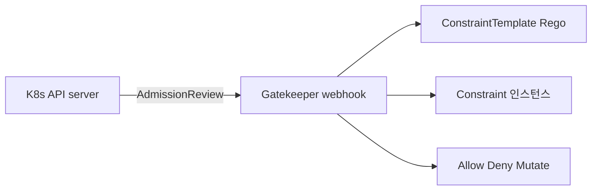
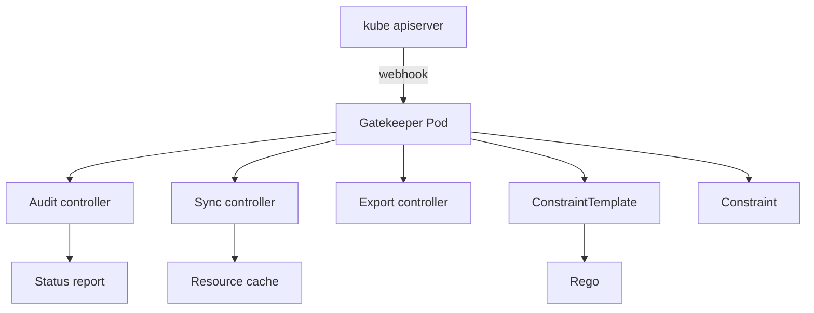
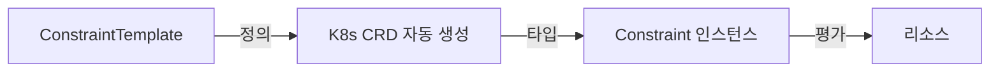
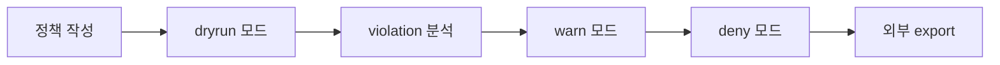

# OPA·Gatekeeper

> **2026년의 자리**: Open Policy Agent(OPA)는 *범용 정책 엔진*. **Gatekeeper**
> 는 OPA를 K8s admission controller로 통합한 *공식 K8s 정책 도구*. **2024년
> Rego v1** 도입으로 문법이 안정화. CNCF Graduated. 한 도구로 *K8s 외*
> (CI·API gateway·터미널 명령어 등)도 같은 정책 언어로 통합.

- **이 글의 자리**: [Kyverno](kyverno.md)와 함께 K8s 정책 2대 도구. 다른
  영역 정책 enforcement는 [이미지 서명](../container-security/image-signing.md),
  [Network Policy 전략](../network-security/network-policy-strategy.md).
- **선행 지식**: K8s admission controller·Webhook, JSON·YAML, 일반 정책 개념,
  Rego는 본 글에서 다룸.

---

## 1. 한 줄 정의

| 도구 | 정의 |
|---|---|
| **OPA** | "범용 정책 엔진 — JSON 입력에 *Rego* 정책으로 *허용/거부/변환* 결정. K8s·CI·API GW·DB 등 어떤 시스템에도" |
| **Gatekeeper** | "OPA를 K8s admission controller로 통합 — `ConstraintTemplate`(정책 정의) + `Constraint`(인스턴스) CRD" |



---

## 2. 왜 OPA·Gatekeeper

| 가치 | 의미 |
|---|---|
| **선언형 정책** | YAML·CRD로 정책 — GitOps 친화 |
| **Rego의 표현력** | 복잡 조건·set·external data 가능 |
| **K8s 외 통합** | 같은 OPA 엔진을 CI·gateway·DB 통합 |
| **CNCF Graduated (2021)** | 안정·생태계 |
| **audit 모드** | enforce 전 트래픽 분석 |
| **Mutating webhook** (3.10+) | 변환 정책 — 라벨·annotation 자동 |

---

## 3. 아키텍처



| 컴포넌트 | 역할 |
|---|---|
| **Webhook** | API server에서 admission 요청 받음 |
| **ConstraintTemplate** | 정책 *정의* (CRD + Rego) |
| **Constraint** | 정책 *인스턴스* (CRD 사용) |
| **Audit controller** | 기존 리소스 정기 검사 |
| **Sync controller** | Rego가 다른 리소스 참조해야 할 때 캐시 |
| **Export controller** | violation을 외부(GCS·Pub/Sub)로 |
| **Mutation** | mutating webhook으로 라벨·필드 자동 수정 |

### 3.1 버전·동향 (2026-04 기준)

| 버전 | 주요 |
|---|---|
| **3.19** | **OPA Rego v1 지원** (opt-in) — 문법 모호성 제거 |
| **3.18** | external data provider 안정화 |
| **3.17** | mutation 안정화 |

---

## 4. ConstraintTemplate vs Constraint



### 4.1 ConstraintTemplate 예 — `K8sRequiredLabels`

```yaml
apiVersion: templates.gatekeeper.sh/v1
kind: ConstraintTemplate
metadata:
  name: k8srequiredlabels
spec:
  crd:
    spec:
      names:
        kind: K8sRequiredLabels
      validation:
        openAPIV3Schema:
          type: object
          properties:
            labels:
              type: array
              items:
                type: string
  targets:
    - target: admission.k8s.gatekeeper.sh
      rego: |
        package k8srequiredlabels

        violation[{"msg": msg, "details": {"missing_labels": missing}}] {
          provided := {label | input.review.object.metadata.labels[label]}
          required := {label | label := input.parameters.labels[_]}
          missing := required - provided
          count(missing) > 0
          msg := sprintf("you must provide labels: %v", [missing])
        }
```

### 4.2 Constraint 인스턴스

```yaml
apiVersion: constraints.gatekeeper.sh/v1beta1
kind: K8sRequiredLabels
metadata:
  name: ns-must-have-team-and-env
spec:
  enforcementAction: deny       # deny | dryrun | warn
  match:
    kinds:
      - apiGroups: [""]
        kinds: ["Namespace"]
    namespaces: []              # 빈 = 모두
    excludedNamespaces: ["kube-system"]
  parameters:
    labels: ["team", "env"]
```

| 필드 | 의미 |
|---|---|
| `enforcementAction` | `deny`(차단), `dryrun`(audit만), `warn`(경고) |
| `match.kinds` | 어느 리소스 |
| `match.namespaces` / `excludedNamespaces` | 범위 |
| `parameters` | template의 schema 따름 |

---

## 5. Rego — 정책 언어 깊이

### 5.1 핵심 개념

| 개념 | 의미 |
|---|---|
| `package` | 모듈 분리 |
| `input` | 평가 입력 (Gatekeeper는 AdmissionReview) |
| `data` | 외부·캐시된 데이터 |
| **rule** | `head { body }` — body 모두 만족하면 head 추론 |
| **violation** | Gatekeeper 표준 rule — 위반 사항 보고 |
| `default` | 기본값 |
| `some`, `every` | 양화사 (1.0+) |

### 5.2 Rego v1 (Gatekeeper 3.19+)

| v0 → v1 | 변경 |
|---|---|
| `if`/`contains` 키워드 | 명시적 |
| `import rego.v1` | 의무 |
| 문법 모호성 제거 | 더 안전 |

```rego
# v1 문법
package example
import rego.v1

deny contains msg if {
  input.review.object.spec.privileged == true
  msg := "privileged container forbidden"
}
```

### 5.3 자주 쓰는 패턴

```rego
# 라벨 검증
violation[{"msg": msg}] {
  required := {"team", "env"}
  provided := {l | input.review.object.metadata.labels[l]}
  missing := required - provided
  count(missing) > 0
  msg := sprintf("missing labels: %v", [missing])
}

# 컨테이너 이미지 정책
violation[{"msg": msg}] {
  container := input.review.object.spec.containers[_]
  not startswith(container.image, "registry.acme.com/")
  msg := sprintf("image %v not from approved registry", [container.image])
}

# 자원 limits 의무
violation[{"msg": msg}] {
  container := input.review.object.spec.containers[_]
  not container.resources.limits.memory
  msg := sprintf("container %v missing memory limit", [container.name])
}

# RBAC 권한 폭 검사 (cluster-admin 차단)
violation[{"msg": msg}] {
  input.review.kind.kind == "ClusterRoleBinding"
  input.review.object.roleRef.name == "cluster-admin"
  not input.review.object.metadata.annotations["security.acme/cluster-admin-approved"]
  msg := "cluster-admin binding requires explicit approval"
}
```

---

## 6. Mutation — 자동 변환 (3.10+)

### 6.1 Mutation 종류

```yaml
apiVersion: mutations.gatekeeper.sh/v1
kind: Assign
metadata:
  name: enforce-imagepullsecret
spec:
  applyTo:
    - groups: [""]
      kinds: ["Pod"]
      versions: ["v1"]
  match:
    scope: Namespaced
  location: "spec.imagePullSecrets[0]"
  parameters:
    assign:
      value:
        name: regcred
```

| 종류 | 용도 |
|---|---|
| **Assign** | 특정 경로에 값 강제 — `imagePullSecrets`, `securityContext.runAsNonRoot: true` |
| **AssignMetadata** | 라벨·annotation 자동 부여 |
| **ModifySet** | set 항목 추가·제거 — `imagePullPolicy` 등 |
| **AssignImage** | 이미지 tag → digest 또는 mirror 변환 |

### 6.2 Mutation 함정

| 함정 | 결과 |
|---|---|
| validating + mutating 순서 | mutation이 먼저 → 변환된 객체로 validate |
| ArgoCD drift | 사용자 매니페스트와 actual state 다름 → ignoreDifferences |
| graceful 도입 안 함 | 갑자기 모든 Pod 변환 → 회귀 |

---

## 7. External Data — Rego가 외부 시스템 조회

### 7.1 Provider 패턴

```yaml
apiVersion: externaldata.gatekeeper.sh/v1beta1
kind: Provider
metadata:
  name: image-signature-validator
spec:
  url: https://provider.acme.com/validate
  timeout: 3
  caBundle: <base64>
```

```rego
violation[{"msg": msg}] {
  image := input.review.object.spec.containers[_].image
  resp := external_data({"provider": "image-signature-validator", "keys": [image]})
  not resp.errors == []
  msg := sprintf("image %v validation failed", [image])
}
```

| 사용처 | 예 |
|---|---|
| **이미지 서명 검증** | Cosign verify를 외부 provider |
| **자산 인벤토리 매칭** | CMDB 조회 |
| **OPA 외부 데이터** | regex DB·금지 라이브러리 |

> **함정**: 외부 호출 = admission latency 증가. timeout·캐시 의무. provider 다운 시
> webhook 동작 결정 (`failurePolicy`).

---

## 8. 운영 패턴

### 8.1 도입 단계



| 단계 | 동작 |
|---|---|
| **(1) 정책 작성** | ConstraintTemplate + Constraint |
| **(2) `dryrun`** | audit만, violation report |
| **(3) violation 분석** | 정상·예외 분류 |
| **(4) `warn`** | 사용자 알림 |
| **(5) `deny`** | 차단 |
| **(6) cluster baseline** | 모든 namespace 기본 |

### 8.2 GitOps 통합

```yaml
# ArgoCD ApplicationSet으로 정책 자동 배포
- ConstraintTemplate (보안팀 owner, GitOps 관리)
- Constraint per cluster (환경별 enforcementAction)
```

| 패턴 | 의미 |
|---|---|
| ConstraintTemplate은 cluster-scoped (한 번) | 변경은 보안팀 PR |
| Constraint per environment | dev=`dryrun`, staging=`warn`, prod=`deny` |
| ApplicationSet | 클러스터별 자동 배포 |
| Argo Rollout | progressive enforce |

### 8.3 audit·관측

| 메트릭 | 의미 |
|---|---|
| `gatekeeper_violations` | 위반 수 (constraint별) |
| `gatekeeper_request_duration_seconds` | webhook latency |
| `gatekeeper_audit_duration_seconds` | audit 주기 |
| `gatekeeper_constraint_template_ingestion_count` | template 등록 |
| `gatekeeper_sync_count` | sync controller 캐시 |

---

## 9. K8s 외 OPA — 한 도구로

| 도메인 | 통합 |
|---|---|
| **CI/CD** | Conftest로 YAML/Dockerfile 정책 검증 |
| **API Gateway** | Envoy ext_authz로 OPA 호출 |
| **Terraform** | Conftest로 plan 검증 |
| **DB** | OPA sidecar로 SQL 권한 |
| **Backstage·IDP** | OPA로 RBAC |
| **Linux PAM** | OPA로 권한 결정 |

> **장점**: *한 정책 언어*로 전 인프라. 단점: Rego 학습 곡선.

---

## 10. Gatekeeper vs Kyverno — 정면 비교

| 차원 | **Gatekeeper** | **Kyverno** |
|---|---|---|
| **정책 언어** | Rego (학습 곡선) | YAML (K8s native) |
| **K8s 외 사용** | OPA로 가능 | K8s 전용 |
| **Mutation** | 3.10+ 지원 | native·강함 |
| **이미지 검증** | external data | `verifyImages` 1급 |
| **정책 라이브러리** | gatekeeper-library | Kyverno Policies |
| **CNCF** | Graduated (2021) | Incubating (2024) |
| **K8s 통합 깊이** | 일반 정책 엔진 | **K8s 전용 — 더 자연스러움** |
| **복잡 정책** | Rego의 표현력 | YAML 패턴 매칭 |

> **선택**: K8s만 + 빠른 도입 = **Kyverno**. K8s 외 통합·복잡 정책 = **OPA·Gatekeeper**.
> 둘 *공존* 가능 — Kyverno는 단순 정책, Gatekeeper는 복잡·외부 통합.

자세한 비교는 [Kyverno](kyverno.md).

---

## 11. 안티패턴

| 안티패턴 | 결과 | 교정 |
|---|---|---|
| `dryrun` 단계 없이 `deny` 직행 | 갑작스런 차단 | 단계별 (`dryrun → warn → deny`) |
| Rego v0 문법 그대로 운영 | 모호성·버그 | 3.19+ Rego v1 의무 |
| ConstraintTemplate을 namespace에 | cluster-scoped 자원 | cluster-scoped 의무 |
| 모든 정책을 한 ConstraintTemplate에 | 디버깅·재사용 어려움 | 분리·라이브러리화 |
| `excludedNamespaces` 미설정 | kube-system 등 시스템 차단 | 명시적 제외 |
| webhook timeout 짧게 | external data 호출 시 fail-open | 충분한 timeout + 캐시 |
| audit·관측 없음 | 정책 효과 모름 | violation 메트릭·dashboard |
| GitOps 외부 수동 정책 변경 | drift | ApplicationSet으로 관리 |
| Mutation·Validation 중복 정책 | 충돌 | 한쪽만 |
| ConstraintTemplate 변경 시 호환성 무시 | 기존 Constraint 깨짐 | versioning |
| K8s 1.x 버전 호환성 무시 | webhook 실패 | Gatekeeper 버전 매트릭스 확인 |
| `failurePolicy: Ignore` prod | 우회 가능 | `Fail` + replica HA |
| 가용성 부족 (1 replica) | webhook 다운 = API server 영향 | replica ≥ 3, PDB |
| 정책 라이브러리 미사용 | 매번 재작성 | gatekeeper-library 채택 |
| Rego 단위 테스트 없음 | 회귀 | `opa test` 의무 |
| audit 결과 SIEM 미송출 | 컴플라이언스 증빙 어려움 | export controller |

---

## 12. 운영 체크리스트

**도입**
- [ ] Gatekeeper 3.19+, Rego v1 사용
- [ ] gatekeeper-library에서 표준 정책 채택
- [ ] cluster baseline (라벨·이미지 출처·resource limits·privileged 차단)
- [ ] dryrun → warn → deny 단계
- [ ] kube-system 등 시스템 namespace 제외

**운영**
- [ ] webhook replica ≥ 3 + PDB + `failurePolicy: Fail` (system은 예외)
- [ ] audit 정기 + SIEM export
- [ ] violation 메트릭 dashboard·alert
- [ ] external data provider HA + timeout
- [ ] Rego 단위 테스트 (`opa test`) CI 통합

**거버넌스**
- [ ] ConstraintTemplate은 보안팀 GitOps owner
- [ ] Constraint는 환경별 ApplicationSet
- [ ] mutation·validation 정책 분리 의무
- [ ] 정책 변경은 PR + review + dryrun 단계 필수

**확장**
- [ ] K8s 외 영역(CI·Terraform·API GW)에 OPA 통합 검토
- [ ] Conftest로 Dockerfile·YAML CI 검증
- [ ] Backstage·IDP RBAC 통합

---

## 참고 자료

- [Gatekeeper — Documentation](https://open-policy-agent.github.io/gatekeeper/website/docs/) (확인 2026-04-25)
- [Gatekeeper — GitHub](https://github.com/open-policy-agent/gatekeeper) (확인 2026-04-25)
- [Open Policy Agent — Documentation](https://www.openpolicyagent.org/docs/latest/) (확인 2026-04-25)
- [Rego v1 — Migration Guide](https://www.openpolicyagent.org/docs/latest/v0-upgrade/) (확인 2026-04-25)
- [Gatekeeper — ConstraintTemplate](https://open-policy-agent.github.io/gatekeeper/website/docs/constrainttemplates/) (확인 2026-04-25)
- [Gatekeeper — Mutation](https://open-policy-agent.github.io/gatekeeper/website/docs/mutation/) (확인 2026-04-25)
- [Gatekeeper — External Data](https://open-policy-agent.github.io/gatekeeper/website/docs/externaldata/) (확인 2026-04-25)
- [gatekeeper-library — Policy Library](https://github.com/open-policy-agent/gatekeeper-library) (확인 2026-04-25)
- [Conftest](https://github.com/open-policy-agent/conftest) (확인 2026-04-25)
- [OPA in Envoy ext_authz](https://www.openpolicyagent.org/docs/envoy-introduction/) (확인 2026-04-25)
