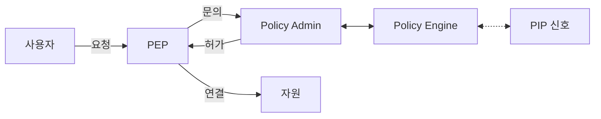
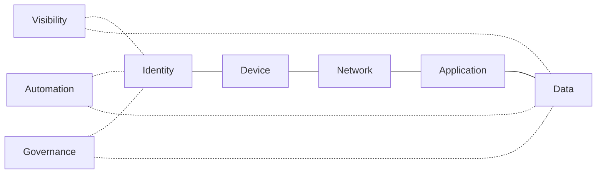
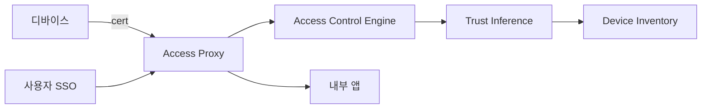
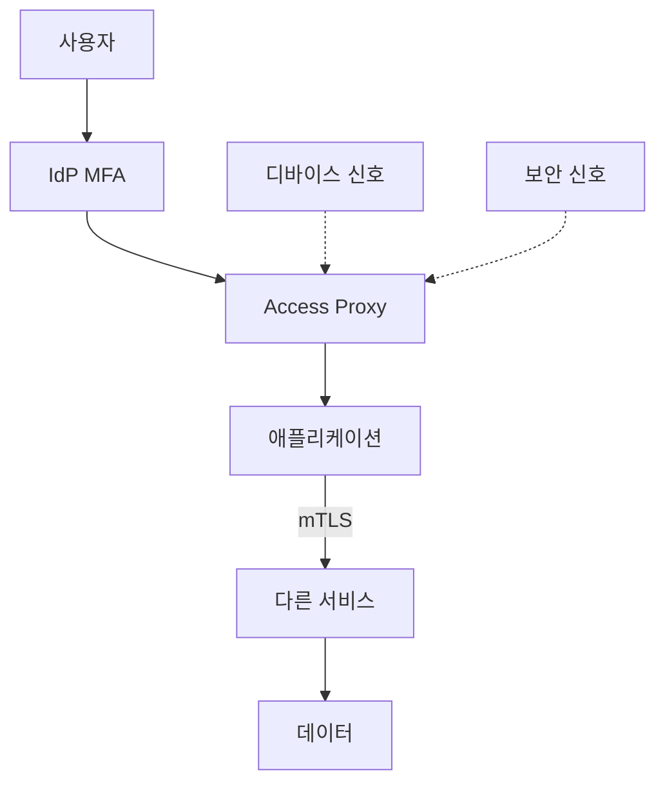

# Zero Trust

> **2026년 Zero Trust의 진실**: "Never trust, always verify"는 슬로건이고
> 실체는 **NIST 800-207의 PE/PA/PEP 분리**와 **CISA 5-pillar 성숙도**다.
> Zero Trust는 제품이 아니라 **아키텍처**이며, VPN 제거나 ZTNA 도입만으로
> 완성되지 않는다. 이 글은 원칙·컴포넌트·BeyondCorp 구현·SASE/SSE/ZTNA의
> 자리·다층 방어 적용·안티패턴까지 글로벌 스탠다드 깊이로 다룬다.

- **이 글의 자리**: 보안 카테고리의 *원칙*. 인증·인가 구체 프로토콜은
  [OIDC·SAML](../authn-authz/oidc-saml.md)·[Workload Identity](../authn-authz/workload-identity.md),
  네트워크 정책은 [Network Policy 전략](../network-security/network-policy-strategy.md),
  서비스 메시 mTLS 구현은 `network/`. 이 글은 **모델·전략**.
- **선행 지식**: TLS·mTLS, IAM, Kubernetes RBAC.

---

## 1. 한 줄 정의

> **Zero Trust**는 "위치(네트워크 경계)가 아니라 **신원·디바이스·컨텍스트**로
> 매 요청을 검증하고, 자원 가까이에서 동적 정책으로 인가한다"는 보안
> 아키텍처다.

- 출처: NIST SP 800-207 (2020-08 최종), SP 800-207A (2023-09 최종, 클라우드
  네이티브·멀티클라우드 보강)
- 핵심 가정: **네트워크는 이미 침해되었다(assumed breach)**. 내부도 외부도 신뢰 X.
- 산출물: 모든 자원 접근에 인증·인가·암호화 + 지속적 검증

### 1.1 표준 계보

| 연도 | 표준·문헌 | 핵심 기여 |
|---|---|---|
| 2010 | Forrester John Kindervag — *No More Chewy Centers* | "Zero Trust" 용어 창시, "never trust, always verify" |
| 2014~2018 | Google **BeyondCorp** 4 페이퍼 | 실증 구현 — Access Proxy·디바이스 신원 |
| 2018 | Forrester **ZTX (Zero Trust eXtended)** | 7 영역(People·Workload·Device·Network·Data·Visibility·Automation) |
| 2020 | NIST **SP 800-207** | PE/PA/PEP 컴포넌트 모델, 7 원칙 |
| 2021 | 백악관 **EO 14028** | 미 연방 사이버보안 행정명령, ZTA 명시 |
| 2022 | OMB **M-22-09** | FY2024까지 연방 ZT 마이그레이션 의무 |
| 2022 | DoD **ZT Reference Architecture v2.0** | 7 pillar 모델 (CISA 5 + Auto/Visibility 분리) |
| 2023-09 | NIST **SP 800-207A** | 클라우드 네이티브·멀티클라우드 ZTA |
| 2023-04 | CISA **ZTMM v2.0** | 5 pillar 성숙도 모델 |
| 2025-07 | CISA **Microsegmentation Part One** | 자산 분류·계획 단계 가이드 (Part Two 후속 예고) |

### 1.2 CISA 5 vs DoD 7 pillar

| CISA 5 | DoD 7 |
|---|---|
| Identity | User |
| Devices | Device |
| Networks | Network & Environment |
| Applications & Workloads | Application & Workload |
| Data | Data |
| (Visibility 교차) | Visibility & Analytics (별도 pillar) |
| (Automation 교차) | Automation & Orchestration (별도 pillar) |

> DoD는 운영 기반(가시성·자동화)을 **독립 pillar**로 격상해 7개. CISA는
> 같은 능력을 **교차 능력**으로 5개에 적용. 본질은 동일.

---

## 2. 7가지 원칙 (NIST 800-207)

| # | 원칙 | 의미 |
|:-:|---|---|
| 1 | 모든 데이터·서비스는 자원 | 사용자 단말, IoT, SaaS, 클러스터 안 Pod 모두 자원 |
| 2 | 네트워크 위치 무관, 모든 통신 보호 | 사내망도 외부망과 동일하게 인증·암호화 |
| 3 | **세션 단위** 자원 접근 | 한 세션의 인가가 다음 세션에 자동 승계 X |
| 4 | **동적 정책**으로 결정 | 신원·디바이스·환경·행동 분석 종합 |
| 5 | 자산 무결성·보안 상태 모니터링 | 디바이스 패치·구성·취약점을 정책에 반영 |
| 6 | 인증·인가는 **엄격·동적·접근 직전에** | 한 번 통과로 평생 X, 컨텍스트 변하면 재평가 |
| 7 | 자산·네트워크·통신의 가능한 한 많은 정보 수집 | 분석으로 정책 개선 (피드백 루프) |

> **요점**: VPN으로 들어오면 다 통과 = 위반. 매 요청마다 "**누가**, **어디서**,
> **어떤 디바이스로**, **어떤 자원을**" 평가해야 Zero Trust.

---

## 3. 핵심 컴포넌트 — PE·PA·PEP

| 컴포넌트 | 역할 | 구현 예 |
|---|---|---|
| **PE (Policy Engine)** | 신뢰 알고리즘으로 grant/deny/revoke 결정 | OPA, Cedar, Cloud IAM 정책 엔진 |
| **PA (Policy Administrator)** | PE 결정을 PEP에 전달, 세션 토큰 발급·취소 | Cloud IAP 컨트롤러, Auth Proxy 컨트롤러 |
| **PEP (Policy Enforcement Point)** | 데이터 플레인에서 강제, **bypass 불가** | Access Proxy, Sidecar(Envoy), API Gateway, eBPF |
| **PIP (Policy Information Point)** | PE에 시그널 공급 | SIEM, CDM, MDM, 위협 인텔, IdP, 행동 분석(UEBA) |

> **IdP의 자리**: IdP는 보통 *PIP*(인증 결과·MFA factor·디바이스 컨텍스트
> 시그널 제공) + *PA의 일부*(세션 토큰 발급) 역할을 동시에 수행한다.
> *PE*(인가 결정)는 별도 정책 엔진(OPA·Cedar·클라우드 IAM·접근 프록시
> 컨트롤러)이 담당하는 분리가 깨끗.

> **PE+PA = PDP (Policy Decision Point)**, 한 컨트롤러가 둘 다 수행해도 됨.
> 핵심은 **PEP는 결정만 강제, 정책은 PDP에서**라는 분리. 정책 변경이
> 데이터 플레인 재배포 없이 즉시 반영되어야 한다.

### 3.1 Bypass 금지 원칙

PEP가 bypass 가능하면 Zero Trust 무효. 모든 트래픽은 PEP 통과 강제:

| 위치 | 강제 방법 |
|---|---|
| **사용자→앱** | Access Proxy·IAP, 직접 IP 노출 차단 |
| **앱→앱 (East-West)** | mTLS + Service Mesh 또는 SPIFFE-based |
| **사용자→DB** | bastion·DB proxy (Teleport, BoundaryHQ, AWS RDS Proxy) |
| **관리자 SSH** | jump host·세션 녹화·just-in-time 권한 |
| **K8s API** | OIDC·webhook 인가, 직접 etcd 접근 차단 |

---

## 4. CISA Zero Trust Maturity Model 2.0

### 4.1 5 기둥 (Pillars)

| 기둥 | 핵심 |
|---|---|
| **Identity** | MFA, FIDO2·WebAuthn, IdP 통합, JIT 권한 |
| **Devices** | MDM·EDR, posture(패치·암호화·EDR 활성), compliance |
| **Networks** | macro·micro segmentation, 암호화 (TLS·mTLS) |
| **Applications & Workloads** | 인증·인가, 공급망 무결성, 런타임 정책 |
| **Data** | 분류·암호화·DLP·접근 로깅 |

### 4.2 3 교차 능력 (Cross-cutting)

| 능력 | 설명 |
|---|---|
| **Visibility & Analytics** | 모든 5 기둥의 텔레메트리 통합 분석 |
| **Automation & Orchestration** | 정책 자동 적용, 자동 응답 (SOAR) |
| **Governance** | 정책 lifecycle, 규제 준수, audit |

### 4.3 4 성숙도

| 단계 | 특징 |
|---|---|
| **Traditional** | 정적 정책, 수동 강제, 사일로 |
| **Initial** | 부분 자동화, 일부 통합 |
| **Advanced** | 동적 정책, 통합 텔레메트리, 자동 응답 |
| **Optimal** | 완전 동적, ML 기반, 자가 치유 |

> **연방 권고 근거**: EO 14028(2021), OMB M-22-09(2022 — FY2024까지 연방
> ZT 마이그레이션 의무), CISA 후속 가이드(Microsegmentation Part One/Two).
> 민간도 사실상의 baseline. 우선순위는 phishing-resistant MFA, micro-
> segmentation, continuous posture.

---

## 5. BeyondCorp — Google의 구현 (2014~)

### 5.1 핵심 컴포넌트

| 컴포넌트 | 역할 |
|---|---|
| **Device Inventory DB** | 모든 회사 디바이스의 신뢰 상태 (패치·구성·소유자) |
| **Device Identity** | 디바이스에 발급된 X.509 인증서 |
| **SSO (User Identity)** | OIDC/SAML IdP, 사용자 인증 |
| **Access Proxy** | 모든 앱 앞단의 PEP, mTLS 클라이언트 인증서 검증 |
| **Access Control Engine** | 정책 평가 (PE) |
| **Trust Inference** | 디바이스 posture로 신뢰 등급 동적 산출 |

### 5.2 핵심 아이디어

- **VPN 제거**: 사내망도 인터넷처럼 취급, 모든 앱은 Access Proxy 뒤
- **사용자 ID + 디바이스 ID 동시 검증**: SSO 토큰 + 디바이스 인증서
- **신뢰 등급(trust tier)**: 디바이스 상태에 따라 접근 가능 자원 차등

### 5.3 BeyondCorp Enterprise (GCP 상품)

| 구성 | 설명 |
|---|---|
| **IAP (Identity-Aware Proxy)** | GCP 자원·온프레미스 앱 앞 Access Proxy |
| **Endpoint Verification** | 디바이스 posture 수집 (Chrome 확장·MDM 통합) |
| **Context-Aware Access** | IP·디바이스·시간·user 속성 기반 동적 정책 |
| **Threat & Data Protection** | URL filter, DLP, malware scan |

> **참고할 점**: BeyondCorp는 "도구"가 아니라 **6년의 마이그레이션
> 프로젝트**. 포팅 가이드는 4편의 BeyondCorp 페이퍼(2014, 2016, 2017,
> 2018, 2018b)에 단계별 정리됨.

---

## 6. SASE·SSE·ZTNA — 어디까지 Zero Trust인가

| 용어 | 정체 | Zero Trust와의 관계 |
|---|---|---|
| **Zero Trust** | 보안 **아키텍처·전략** | 상위 모델 |
| **ZTNA (Zero Trust Network Access)** | 원격 접속 *도구 카테고리* | Zero Trust의 한 PEP 패턴 (사용자→앱) |
| **SSE (Security Service Edge)** | ZTNA + SWG + CASB + FWaaS 묶음 | Zero Trust 보안 함수의 클라우드 묶음 |
| **SASE (Secure Access Service Edge)** | SSE + SD-WAN | 보안+네트워크의 통합 클라우드 백본 |

### 6.1 ZTNA 두 모델 (Gartner)

| 모델 | 흐름 | 장단점 |
|---|---|---|
| **서비스 시작형(Service-initiated)** | 앱이 먼저 ZTNA 클라우드에 outbound 연결 | 인바운드 포트 무, 그러나 클라우드 의존 |
| **엔드포인트 시작형(Endpoint-initiated)** | 클라이언트→ZTNA→앱 | 표준 reverse proxy 패턴, 클라이언트 에이전트 필요 |

### 6.2 ZTNA 1.0 vs 2.0

| 1.0 | 2.0 |
|---|---|
| 한 번 인가 후 연결 유지 | 지속 검증, 컨텍스트 변화 시 재평가 |
| 앱 단위 접근만 | sub-app·API endpoint 단위 |
| 트래픽 검사 미흡 | DLP·sandbox 통합 |

> **출처 주의**: "ZTNA 2.0"은 Palo Alto Networks가 제안한 **마케팅 분류**.
> Gartner의 공식 카테고리는 ZTNA(SSE의 하위)이며 1.0/2.0 구분은 쓰지 않음.
> 본질은 *지속 검증* 능력의 차이로 받아들이고, 표준 프로토콜 차원의
> 구현은 OpenID **CAEP**(Continuous Access Evaluation Protocol) / **SSF**
> (Shared Signals Framework)이다 — Google·Okta·Microsoft가 채택.

### 6.3 Service-initiated ZTNA의 "Dark App"

서비스 시작형은 앱 호스트가 ZTNA 클라우드로 **outbound 연결만** 유지.
인터넷에 인바운드 포트가 열리지 않아 **공개 스캔에 보이지 않는다**(dark
app). DDoS·취약점 스캔 노출이 0에 가까움. Cloudflare Tunnel·Zscaler
Private Access·Tailscale Funnel 등이 이 패턴.

> **Zero Trust ≠ ZTNA**. ZTNA는 "사용자→앱" 한 PEP. East-West, 워크로드,
> 데이터 계층 PEP는 별도 — Service Mesh, Workload Identity, DLP 등.
> 도구 하나로 Zero Trust 완성은 마케팅 과장.

---

## 7. 다층 방어 — 실무 적용 매트릭스

### 7.1 계층별 PEP·시그널

| 계층 | PEP | PE 시그널 | 도구 예 |
|---|---|---|---|
| **사용자 인증** | IdP | MFA factor, 행동, 위치 | Okta, Entra ID, Auth0, Keycloak |
| **사용자→앱** | Access Proxy | 사용자, 디바이스 posture, 시간 | Cloudflare Access, IAP, Teleport |
| **앱→앱 (East-West)** | Sidecar/L7 proxy | 워크로드 신원(SPIFFE), 정책 | Istio, Linkerd, Cilium, Consul |
| **앱→DB** | DB Proxy / sidecar | 워크로드 신원, JIT credential | Vault DB, Teleport, Boundary, RDS Proxy |
| **사용자→인프라** | Bastion·SSO SSH | JIT, 세션 녹화 | Teleport, AWS SSM, OIDC SSH cert |
| **K8s API** | API Server | OIDC, RBAC, Webhook(OPA) | OIDC + Kyverno/Gatekeeper |
| **데이터 플레인** | DLP·CASB·Tokenization | 분류 라벨, 사용자, 행동 | Purview, Symantec DLP, Vault Transit, Confidential Computing(SGX·SEV·TDX), ABAC |

### 7.2 지속 검증을 위한 표준 — CAEP·SSF

| 표준 | 역할 |
|---|---|
| **CAEP** (Continuous Access Evaluation Protocol) | IdP·앱 간 세션 변경 푸시 (계정 잠금, 디바이스 비준수, 토큰 폐기) |
| **SSF** (Shared Signals Framework) | CAEP 포함 — IdP·SaaS·EDR 간 보안 이벤트 표준 메시지 |
| **RISC** (Risk Incident Sharing & Coordination) | 계정 침해 신호 공유 |

> Google Workspace·Okta·Microsoft Entra가 SSF/CAEP 발신·수신 지원.
> 도입 시 한 IdP에서 발생한 risky sign-in이 SSO 연결된 SaaS 모든 곳에서
> **수 초 내 세션 무효화**로 전파된다 — Zero Trust의 "지속 검증" 실체.

### 7.3 컨텍스트 기반 정책 — 실제 룰 예

| 상황 | 정책 |
|---|---|
| 비회사 디바이스 + 민감 앱 | 거부 |
| 회사 디바이스 + EDR 비활성 | 격리 페이지 + 재시도 가이드 |
| 사용자가 평소와 다른 국가 | step-up MFA 요구 |
| 워크로드가 새 namespace에서 호출 | 서비스 메시 정책 거부 |
| DB의 PII 컬럼 SELECT 빈도 급증 | 알림 + 세션 녹화 강화 |

### 7.4 Microsegmentation 단계

CISA 가이드(2025-07) 권고 단계:

| 단계 | 활동 |
|---|---|
| 1. **Inventory** | 자산·통신 흐름 매핑 (eBPF·flow log·CMDB) |
| 2. **Classify** | 자산을 민감도별 zone 구분 |
| 3. **Policy 설계** | zone 간 허용 흐름 화이트리스트 (default deny) |
| 4. **Enforce** | PEP 배치 — host 방화벽·NetworkPolicy·Mesh |
| 5. **Monitor & Iterate** | 차단·허용 로그로 정책 정제 |

> **Macro vs Micro**: 데이터센터·VPC 단위 = macro. 워크로드·프로세스
> 단위 = micro. Zero Trust 성숙은 micro까지.

---

## 8. 신뢰 알고리즘 — 4가지 점수 모델

PE가 결정하는 방식. NIST 800-207에서 선택지 4개:

| 알고리즘 | 작동 |
|---|---|
| **Criteria-based** | 명시 조건 모두 충족 시 grant (룰 기반) |
| **Score-based** | 신뢰 점수 계산, 임계값 통과 시 grant |
| **Singular** | 매 요청 독립 평가, 과거 무시 |
| **Contextual** | 사용자·자원의 행동 이력 반영 |

> **현실**: Criteria + Contextual 조합이 표준. 점수 모델은 IdP·SIEM이
> 내부에서 사용 (예: Risky sign-in, UEBA). 100% 점수 의존은 설명 가능성·
> false positive 문제.

---

## 9. K8s에서 Zero Trust 매핑

| Zero Trust 원칙 | K8s 구현 |
|---|---|
| 모든 통신 인증·암호화 | Service Mesh mTLS (Istio·Linkerd·Cilium) |
| 워크로드 신원 | ServiceAccount + Projected Token, IRSA(EKS), EKS Pod Identity, GKE Workload Identity, Azure Workload Identity, [SPIFFE/SPIRE](../authn-authz/workload-identity.md) |
| 사용자 인증 | API Server OIDC, [OIDC·SAML](../authn-authz/oidc-saml.md) |
| 자원 인가 | RBAC + Webhook (OPA·Kyverno) |
| 동적 정책 | NetworkPolicy + CiliumNetworkPolicy(L7) |
| 디바이스 posture | OPA 게이트(`kubectl` 클라이언트 인증서·MDM 연동) |
| 자산 무결성 | 이미지 서명 (Cosign), 정책 enforce, SBOM |
| 시그널 | audit log → SIEM, falco/tetragon 런타임 |

> **함정**: NetworkPolicy만으로 Zero Trust X. **L4 IP 기반**이라 워크로드
> ID·L7 의도를 모름. mTLS + AuthorizationPolicy 또는 CiliumNetworkPolicy(L7)
> 까지 가야 워크로드 단위 Zero Trust.

---

## 10. 안티패턴

| 안티패턴 | 결과 | 교정 |
|---|---|---|
| VPN을 ZTNA로 교체하고 끝 | 사용자→앱만 보호, East-West는 그대로 | 5 기둥 전체 단계적 적용 |
| MFA를 SMS·OTP로만 | phishing·SIM swap | FIDO2/WebAuthn (passkey) |
| 세션을 8시간 이상 유지 | 한 번 탈취 시 장기간 악용 | 짧은 세션 + 컨텍스트 변화 시 재평가 |
| 사내망 = trusted 가정 잔존 | 침투 후 측면 이동 | "assumed breach", 모든 통신 mTLS |
| Service Mesh 도입했으나 mTLS PERMISSIVE 영구 | 평문 트래픽 허용 | PERMISSIVE는 마이그 임시, 완료 후 STRICT 전환 |
| 정책을 PEP에 하드코딩 | 정책 변경 시 재배포·downtime | PE/PA 분리, 외부 정책 |
| 디바이스 posture 무시 | jailbroken·미패치 단말 통과 | MDM·EDR 신호 정책에 반영 |
| ZTNA 클라우드만 신뢰, audit 없음 | 벤더 침해 시 무방비 | 텔레메트리 자체 SIEM에도 |
| OPA 정책에 모든 로직 몰빵 | 성능·복잡도 폭발 | 도메인별 분리, 캐싱·preset |
| K8s NetworkPolicy만으로 Zero Trust 선언 | L7·ID 무시 | mTLS + L7 정책 |
| 워크로드에 long-lived static credential | 탈취 시 회복 X | Workload Identity, 단명 토큰 |
| audit 로그 보존만 하고 분석 X | 사고 인지·대응 지연 | UEBA·SIEM 룰·자동 응답 |
| "Zero Trust 완료"라는 종착점 사고 | 정체 | 성숙도 모델, 지속 개선 |
| 데이터 분류·DLP 없이 접근 통제만 | 인가된 사용자가 대량 유출 | 데이터 라벨·DLP·이상 행동 |

---

## 11. 도입 단계 — Kindervag 5 step + 실무 6 step

### 11.1 Kindervag 5단계 (전략 프레임)

| 단계 | 활동 |
|---|---|
| 1. Define **Protect Surface** | "보호할 가장 작은 표면" 식별 (Crown Jewel) |
| 2. Map **Transaction Flows** | 그 표면을 향한 통신 경로 매핑 |
| 3. **Architect** ZT | 표면 가까이에 PEP 배치 |
| 4. Create **Zero Trust Policy** | Kipling Method (who/what/when/where/why/how) |
| 5. **Monitor & Maintain** | 텔레메트리·정책 정제 |

> 공격면(attack surface) 축소가 아닌 **보호면(protect surface)** 식별이
> 출발점. 공격자는 무한히 변하지만 보호면(자원·앱·데이터·서비스)은
> 정의 가능하고 작다.

### 11.2 실무 6단계 (구현 순서)

| 단계 | 활동 | 산출물 |
|:-:|---|---|
| 1 | **자산·통신 인벤토리** | CMDB, flow map, 자원 분류 |
| 2 | **Identity 통합·MFA** | 단일 IdP, FIDO2 강제, 관리자 JIT |
| 3 | **사용자→앱 PEP** (ZTNA·IAP) | VPN 단계 폐지, Access Proxy 전환 |
| 4 | **East-West mTLS·워크로드 ID** | Service Mesh, SPIFFE/Workload Identity |
| 5 | **Microsegmentation·Data 정책** | NetworkPolicy(L7), DLP, 분류 |
| 6 | **Visibility·Automation** | SIEM·UEBA, SOAR·CAEP/SSF 연동 |

> **순서가 중요**: Identity·MFA 없이 ZTNA는 무의미. 워크로드 ID 없이
> mTLS는 "암호화된 평문 신뢰". 단계 건너뛰기 = 새는 항아리.

---

## 12. 운영 체크리스트

- [ ] 모든 사용자: phishing-resistant MFA (FIDO2/WebAuthn) 강제
- [ ] 관리자 권한: JIT, 세션 녹화, audit 분석
- [ ] 디바이스 posture: MDM·EDR 신호로 접근 정책 동적 결정
- [ ] 모든 앱은 PEP (Access Proxy·IAP) 뒤, 직접 IP 노출 X
- [ ] 사내·외부 통신 동일 정책 — 사내망 trust 잔존 X
- [ ] 워크로드 통신 mTLS STRICT, 워크로드 ID 기반 인가
- [ ] 단명 credential, static long-lived 키 제거
- [ ] NetworkPolicy default-deny, L7 정책 단계적 도입
- [ ] 모든 인증·인가 이벤트 audit log → SIEM·UEBA
- [ ] 정책은 PE/PA에 분리, PEP는 강제만 — 동적 갱신 가능
- [ ] 데이터 분류·DLP·민감 데이터 행동 모니터링
- [ ] CISA Maturity Model로 분기 자기 평가, gap 추적
- [ ] "ZTNA 도입 = Zero Trust 완료" 마케팅 거리두기
- [ ] 침해 가정 훈련 (red team, purple team) 정례화

---

## 참고 자료

- [NIST SP 800-207 Zero Trust Architecture (2020)](https://nvlpubs.nist.gov/nistpubs/specialpublications/NIST.SP.800-207.pdf) (확인 2026-04-25)
- [NIST SP 800-207A — Cloud-Native ZTA (2023-09)](https://csrc.nist.gov/pubs/sp/800/207/a/final) (확인 2026-04-25)
- [CISA Zero Trust Maturity Model v2.0 (2023-04)](https://www.cisa.gov/sites/default/files/2023-04/zero_trust_maturity_model_v2_508.pdf) (확인 2026-04-25)
- [CISA — Microsegmentation in Zero Trust, Part One (2025-07)](https://www.cisa.gov/news-events/alerts/2025/07/29/cisa-releases-part-one-zero-trust-microsegmentation-guidance) (확인 2026-04-25)
- [DoD Zero Trust Reference Architecture v2.0](https://dodcio.defense.gov/Portals/0/Documents/Library/(U)ZT_RA_v2.0(U)_Sep22.pdf) (확인 2026-04-25)
- [White House EO 14028 (2021)](https://www.whitehouse.gov/briefing-room/presidential-actions/2021/05/12/executive-order-on-improving-the-nations-cybersecurity/) (확인 2026-04-25)
- [OMB M-22-09 — Federal ZT Strategy](https://www.whitehouse.gov/wp-content/uploads/2022/01/M-22-09.pdf) (확인 2026-04-25)
- [Forrester — Zero Trust 15 Years On (2025)](https://www.forrester.com/blogs/a-look-back-at-zero-trust-never-trust-always-verify/) (확인 2026-04-25)
- [BeyondCorp — Google Research](https://research.google/pubs/beyondcorp-the-access-proxy/) (확인 2026-04-25)
- [BeyondCorp Enterprise — Google Cloud](https://cloud.google.com/beyondcorp) (확인 2026-04-25)
- [OpenID CAEP / Shared Signals Framework](https://openid.net/wg/sharedsignals/) (확인 2026-04-25)
- [Palo Alto Networks — What is ZTNA 2.0](https://www.paloaltonetworks.com/cyberpedia/what-is-zero-trust-network-access-2-0) (확인 2026-04-25)
- [Tetrate — NIST SP 800-207 Groundwork](https://tetrate.io/blog/nist-sp-207-the-groundwork-for-zero-trust) (확인 2026-04-25)
- [Cloudflare — Zero Trust Plans](https://www.cloudflare.com/plans/zero-trust-services/) (확인 2026-04-25)
