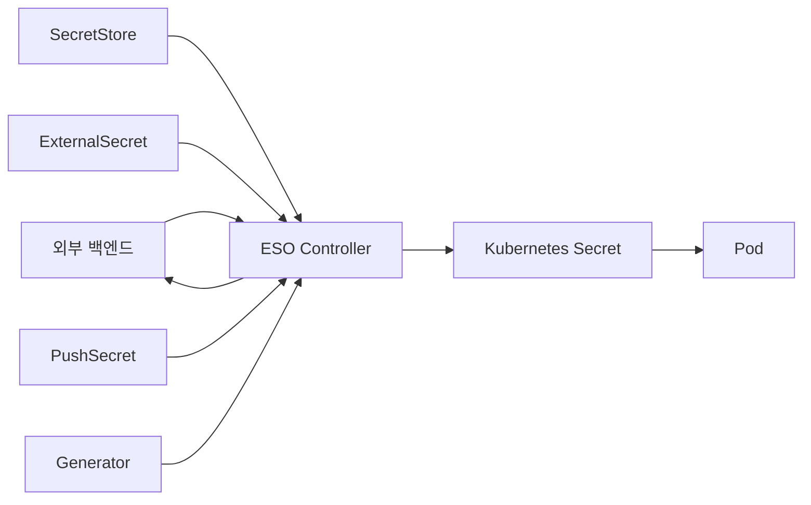
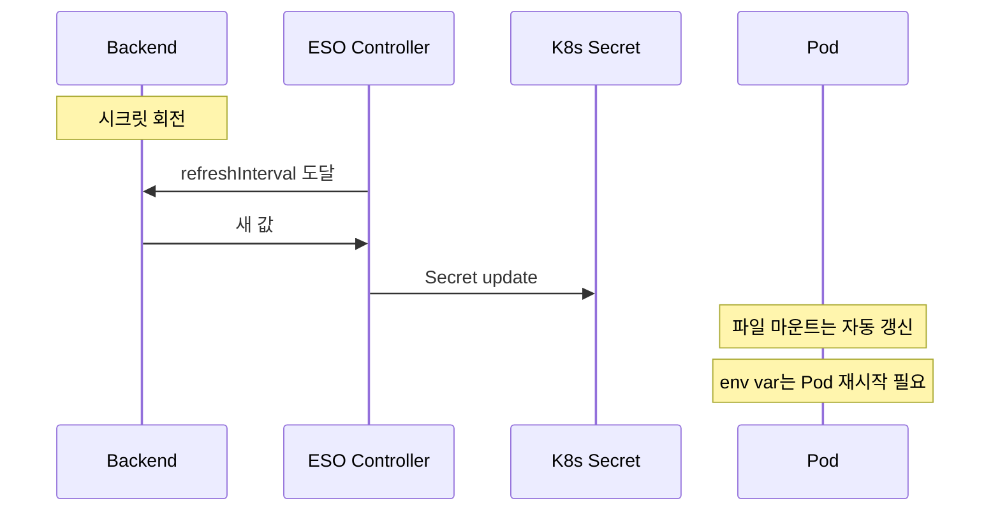

# External Secrets Operator

> **2026년 ESO의 자리**: K8s `Secret`의 *동기화 계층*. 외부 SoT(Vault·AWS
> Secrets Manager·GCP·Azure 등)와 클러스터 간 *읽기/쓰기 양방향* 게이트웨이.
> v0.x(~2025-10) → **v1.0 GA(2025-11-07)** → **v2.0(2026-02-06, 템플릿 엔진 v2)** →
> **v2.4(2026-04-24)**까지 PushSecret·Generator·ClusterExternalSecret이 안정화되어
> *시크릿 라이프사이클 전체*를 다룬다. 그러나 2025-08 CNCF TOC가 *프로젝트 헬스
> 경고*(메인테이너 번아웃·릴리즈 일시 중단)를 발령 → 거버넌스·기여 사다리 개편
> 진행 중. 채택 의사결정 시 거버넌스 변화·CVE 이력을 반드시 확인.

- **이 글의 자리**: [Vault](vault-basics.md)·클라우드 KMS의 *시크릿을
  K8s Pod이 소비*하는 표준 통로. K8s 안에서 시크릿을 만들지 않고
  *외부에서만 회전*하는 GitOps 패턴의 핵심.
- **선행 지식**: K8s `Secret`·RBAC·CRD·SA, [Workload
  Identity](../authn-authz/workload-identity.md)(IRSA·GKE WI·Azure WI),
  Vault 인증.

---

## 1. 한 줄 정의

> **External Secrets Operator(ESO)**는 "외부 시크릿 백엔드를 SoT로 두고,
> 그 값을 *Kubernetes Secret으로 sync* 하거나(`ExternalSecret`) *외부로 push*
> 하거나(`PushSecret`) *동적으로 생성*(`Generator`)해 주는 K8s 오퍼레이터."

- **단방향 sync(pull) → K8s Secret**: `ExternalSecret`
- **K8s Secret → 외부 백엔드(push)**: `PushSecret`
- **요청 시점에 새 값 발급**: `Generator` (예: ACR token, GCP access token, password, UUID)
- 라이선스 Apache-2.0, CNCF Sandbox(2022-06) → **Incubating(2024-11)**, 운영
  주체 [external-secrets.io](https://external-secrets.io)

---

## 2. 왜 ESO인가 — 대안과의 위치

| 패턴 | 장점 | 단점 |
|---|---|---|
| **K8s Secret 직접 관리** | 가장 단순 | etcd 평문(기본), GitOps 불가 |
| **Sealed Secrets** | Git에 안전 저장 | 외부 백엔드 회전과 무관 |
| **SOPS** | 파일 단위 암호화 | 사람·CI 키 관리 부담 |
| **Vault Agent / CSI** | 파일 마운트, etcd 우회 | 앱이 K8s Secret 인터페이스 못 씀 |
| **VSO (HashiCorp)** | Vault 1급 통합·dynamic secret 친화 | Vault 전용 |
| **ESO** | **멀티 백엔드 + K8s Secret 표준 인터페이스** | etcd에 Secret 저장 — 암호화 필수 |

> **선택 가이드**: Vault 단일 + dynamic secret 위주면 VSO. *멀티 백엔드*
> 또는 *클라우드 매니지드(AWS SM·GCP SM·Azure KV)*를 같이 쓰면 ESO. 파일
> 마운트만 필요하고 K8s Secret 회피가 목표면 Vault Agent / CSI.

---

## 3. 아키텍처



| 컴포넌트 | 역할 |
|---|---|
| **Controller** | CRD reconcile 루프 — 외부 백엔드 호출, K8s Secret 작성·삭제 |
| **Webhook** | CRD validating·conversion |
| **CertController** | webhook 인증서 자동 발급·회전 |
| **CRDs** | `SecretStore`/`ClusterSecretStore`, `ExternalSecret`/`ClusterExternalSecret`, `PushSecret`, `*Generator` |

### 3.1 ESO 버전 진화·지원 정책 (2026-04-25 기준)

| 버전 | 출시 | 주요 |
|---|---|---|
| **v2.4.0** | 2026-04-24 | OVHcloud provider, Vault dynamic secret GET, CVE 패치 |
| **v2.3.0** | 2026-04-10 | PushSecret `dataTo` bulk, WIF SA impersonation, GitHub org secret, **CVE-2026-34984 패치** |
| **v2.2.0** | 2026-03-20 | (Breaking) Flux+OCIRepository layer selector 변경 |
| **v2.1.0** | 2026-03-06 | Oracle Vault Stable 승격 |
| **v2.0.0** | 2026-02-06 | **템플릿 엔진 v2 도입** — Sprig 일부 기본 비활성, 명시적 opt-in |
| **v1.2.0** | 2025-12-19 | **CVE-2026-22822 패치** — `getSecretKey` 템플릿 함수 제거 |
| **v1.0.0** | 2025-11-07 | **첫 메이저 GA** — `external-secrets.io/v1` API 안정화 |
| **v0.20.x** | 2025-09~10 | v1 마이그레이션 마지막 v0 line |
| **v0.18.x** | 2025-06~07 | v1beta1 → v1 conversion webhook |

> **핵심 마이그레이션 — v1beta1 → v1**: ESO는 v0.16에서 `v1beta1`을 도입,
> v1.0(2025-11)에서 `v1`을 GA. v1.2부터 `v1beta1` storage version 제거 단계
> 시작. 기존 `v1beta1` manifest는 conversion webhook이 자동 변환하나
> *GitOps 드리프트* 발생(ArgoCD 등이 `v1beta1`로 본 매니페스트와 cluster의 `v1`이
> 다르게 보임). [v1 마이그레이션 가이드](https://external-secrets.io/latest/guides/templating-v1/)대로
> 매니페스트 일괄 변환 + ArgoCD `ignoreDifferences` 또는 `compare-options:
> IgnoreExtraneous` 설정 필수.

> **버전 지원**: ESO는 **현재 minor만** 지원(N-1 X). K8s 1.34–1.35 호환. 업그레이드는
> **minor 단계별** — 점프 금지(breaking 누락·conversion webhook 호환성 위험).
> v1.x → v2.x는 *템플릿 엔진 변경*이 핵심 — `getHostByName` 등 위험 함수 비활성.

### 3.2 Provider Stability Tier

| Tier | 의미 | 예 |
|---|---|---|
| **Stable** | 프로덕션 | AWS SM·SSM, Vault, GCP SM, Azure KV, Oracle Vault, Akeyless, CyberArk, Previder |
| **Beta** | 호환성 일반 안정, 일부 변경 가능 | Kubernetes(타 클러스터), Delinea Secret Server |
| **Alpha** | 실험·변경 가능 | 1Password, Doppler, Bitwarden SM, Infisical, GitLab Variables, Yandex 등 |

> *Alpha provider*는 PoC·내부 도구에만. SoT용 전환 전 Beta+ 승격 확인.

---

## 4. CRD 5종 — 깊이 있게

### 4.1 `SecretStore` / `ClusterSecretStore`

**역할**: "어떤 백엔드에 어떻게 인증하는가"의 설정.

```yaml
apiVersion: external-secrets.io/v1
kind: SecretStore
metadata:
  name: vault-payments
  namespace: payments
spec:
  provider:
    vault:
      server: https://vault.acme.com
      path: kv
      version: v2
      auth:
        kubernetes:
          mountPath: kubernetes
          role: payments-ro
          serviceAccountRef:
            name: payments-eso-sa
```

| 필드 | 의미 |
|---|---|
| `provider.<name>` | provider 종류 — 1개만 |
| `auth` | 백엔드별 인증 — Vault k8s/jwt, AWS IRSA, GCP WI, Azure WI 등 |
| `refreshInterval` | provider 토큰 refresh 주기(보통 자동) |
| `controller` | 멀티 controller 환경에서 라벨로 분리 |

**Cluster vs Namespace**:

| 차원 | `SecretStore` | `ClusterSecretStore` |
|---|---|---|
| 스코프 | 단일 namespace | 클러스터 전체 |
| 참조 가능 namespace | 자기 자신 | `namespaceSelector`/explicit list |
| 권한 영향 | 작음 | **큼 — 침해 시 전 클러스터 시크릿 노출** |
| 용도 | 팀별 사일로 | 공용 시크릿(공통 인증서, 전사 토큰) |

> **함정**: `ClusterSecretStore`는 침해 시 namespace 격리 무력화. RBAC으로
> 생성 권한 좁게, `namespaceSelector`로 *접근 가능 namespace*를 명시. ESO
> 0.10+ — `namespaceSelector` 없는 `ClusterSecretStore`는 *모든 namespace*
> 가 사용 가능 → 막아야 함.

### 4.2 `ExternalSecret` (`ClusterExternalSecret`)

**역할**: "어떤 외부 키를 K8s Secret 어떤 키로 가져올지" 매핑.

```yaml
apiVersion: external-secrets.io/v1
kind: ExternalSecret
metadata:
  name: payments-db
  namespace: payments
spec:
  refreshInterval: 1h
  secretStoreRef:
    name: vault-payments
    kind: SecretStore
  target:
    name: payments-db-secret
    creationPolicy: Owner       # Owner | Orphan | Merge | None
    deletionPolicy: Retain      # Retain | Delete | Merge
    template:
      type: Opaque
      data:
        DATABASE_URL: |
          postgres://{{ .username }}:{{ .password }}@db.svc:5432/payments
  data:
    - secretKey: username
      remoteRef:
        key: kv/payments/db
        property: username
    - secretKey: password
      remoteRef:
        key: kv/payments/db
        property: password
  dataFrom:
    - extract:
        key: kv/payments/extra
    - find:
        path: kv/payments/
        name:
          regexp: "^api-.*"
```

| 필드 | 의미 |
|---|---|
| `refreshInterval` | reconcile 주기 — 0이면 1회만 |
| `data[]` | 1:1 매핑 (외부 key·property → K8s Secret key) |
| `dataFrom.extract` | 한 외부 key의 모든 property를 가져옴 |
| `dataFrom.find` | path·이름 regex로 다수 키 일괄 |
| `target.template` | go-template으로 가공 — DB URL 조립 등 |
| `creationPolicy` | `Owner`(ESO 소유), `Merge`(기존 Secret에 합침), `Orphan`(소유권 X) |
| `deletionPolicy` | ES 삭제 시 Secret 처리 |

> **`dataFrom.find`**: 외부에 새 키 추가 → 자동 반영. 그러나 *예측 불가*한
> 키 동기화 위험 — regex·path 좁게.

`ClusterExternalSecret`은 같은 `ExternalSecret` 템플릿을 다수 namespace에
배포: `namespaceSelector`로 매칭, 각 namespace에 자식 ES 자동 생성.

### 4.3 `PushSecret` — 역방향(K8s → 외부)

```yaml
apiVersion: external-secrets.io/v1
kind: PushSecret
metadata:
  name: ca-bundle-push
  namespace: tls
spec:
  refreshInterval: 1h
  secretStoreRefs:
    - name: vault-shared
      kind: ClusterSecretStore
  selector:
    secret:
      name: ca-bundle
  updatePolicy: Replace          # Replace | IfNotExists
  deletionPolicy: Delete         # None | Delete
  data:
    - match:
        secretKey: ca.crt
        remoteRef:
          remoteKey: kv/shared/ca-bundle
          property: ca.crt
```

| 사용처 | 패턴 |
|---|---|
| **클러스터 발급 자격증명을 외부에 노출** | cert-manager가 발급한 인증서를 다른 시스템이 가져갈 수 있게 Vault에 push |
| **Generator 결과를 외부로** | 동적 password 생성 후 Vault에 push, 다른 환경이 read |
| **CI 토큰 회전** | GitHub PAT 회전 후 Vault·AWS SM에 push |

> **양방향이 위험할 수 있음**: 같은 키를 양방향(`ExternalSecret` +
> `PushSecret`)으로 다루면 *루프*. 한 키는 한 방향만.

### 4.4 `Generator` — 동적 시크릿 발급

```yaml
apiVersion: generators.external-secrets.io/v1alpha1
kind: Password
metadata:
  name: db-password
spec:
  length: 42
  digits: 5
  symbols: 5
  noUpper: false
  allowRepeat: true
---
apiVersion: external-secrets.io/v1
kind: ExternalSecret
metadata:
  name: bootstrap-db
spec:
  refreshInterval: 0     # 1회 발급
  target:
    name: bootstrap-db
    creationPolicy: Owner
  dataFrom:
    - sourceRef:
        generatorRef:
          apiVersion: generators.external-secrets.io/v1alpha1
          kind: Password
          name: db-password
```

| Generator | 발급 |
|---|---|
| **Password** | 길이·문자셋 지정 랜덤 |
| **UUID** | UUID v4 |
| **Webhook** | 외부 HTTP에 GET — 토큰 회전 자동화 |
| **ACR/ECR** | Azure/AWS 레지스트리 단명 토큰 (`docker-registry` Secret) |
| **GCRAccessToken / GCPSMAccessToken** | GCP IAM access token, GCP SM access token |
| **STSSessionToken** | AWS STS 단명 |
| **VaultDynamicSecret** | Vault DB·AWS·SSH 등 dynamic engine 호출 |
| **Fake** | 테스트용 |
| **Grafana / Quay** | 토큰 회전 |

> **rotation**: `refreshInterval > 0`이면 generator가 **매 주기 새 값**
> → K8s Secret 갱신. 앱은 file watcher 또는 reload signal 로직 필요.
> `updatePolicy: IfNotExists`로 "최초 발급 후 변경 X"도 가능.

---

## 5. Provider 인증 — 워크로드 ID가 표준

### 5.1 AWS — IRSA vs EKS Pod Identity (manifest 다름)

**IRSA** — `auth.jwt.serviceAccountRef`로 SA 토큰을 STS에 교환:

```yaml
apiVersion: external-secrets.io/v1
kind: ClusterSecretStore
metadata:
  name: aws-sm-irsa
spec:
  provider:
    aws:
      service: SecretsManager
      region: us-east-1
      auth:
        jwt:
          serviceAccountRef:
            name: eso-sm-sa            # SA에 eks.amazonaws.com/role-arn annotation
            namespace: external-secrets
```

**EKS Pod Identity (2023+)** — `auth` 블록 **자체를 제거** → SDK가 환경
변수로 자동 자격 획득. SecretStore에는 region·service만:

```yaml
spec:
  provider:
    aws:
      service: SecretsManager
      region: us-east-1
      # auth 블록 없음 — Pod Identity Agent가 SDK에 자격 주입
```

| 인증 | manifest | 클러스터 측 |
|---|---|---|
| **IRSA** | `auth.jwt.serviceAccountRef` 명시 | OIDC provider + SA annotation `eks.amazonaws.com/role-arn` |
| **EKS Pod Identity** | `auth` 생략 | `PodIdentityAssociation` 리소스 + Pod Identity Agent 설치 |
| **Static Access Key** (`auth.secretRef`) | secret에 키 저장 | 안티패턴 — 정적 키 0 |

> **IRSA SA 분리**: ESO controller SA가 **모든** Secret Store의 IAM 권한을
> 가지면 침해 표면 폭발. `auth.jwt.serviceAccountRef`로 *SecretStore마다*
> 별도 SA → 별도 IAM Role → 최소 권한.
>
> **Pod Identity 호환성**: ESO는 Pod Identity Agent의 `AWS_CONTAINER_*` 환경
> 변수를 자동 인식. 그러나 [issue#2951](https://github.com/external-secrets/external-secrets/issues/2951)
> 처럼 SDK 버전·controller manifest의 환경 변수 mount 누락이 사고 단골. v1.x+ 권장.

### 5.2 GCP — GKE WI vs WIF (다른 메커니즘)

| 메커니즘 | 적용 | 설정 |
|---|---|---|
| **GKE Workload Identity** | GKE 클러스터 한정 | KSA에 `iam.gke.io/gcp-service-account=<GSA>` annotation, GSA에 KSA가 `roles/iam.workloadIdentityUser` 부여, GKE 메타데이터 서버가 자동 토큰 교환 |
| **Workload Identity Federation (WIF)** | 외부 K8s·EKS·온프레미스 | GCP 측에 *Workload Identity Pool + Provider*(OIDC) 등록, KSA 토큰을 STS API로 교환, GSA impersonation chain |

```yaml
# GKE WI
spec:
  provider:
    gcpsm:
      projectID: payments-prod
      auth:
        workloadIdentity:
          clusterLocation: us-central1
          clusterName: gke-prod
          serviceAccountRef:
            name: eso-gcp-sa     # KSA, annotation 필수
```

```yaml
# WIF (외부 클러스터)
spec:
  provider:
    gcpsm:
      projectID: payments-prod
      auth:
        workloadIdentity:
          clusterLocation: global
          clusterProjectID: payments-prod
          # Pool/Provider는 GCP 콘솔에서 등록 — KSA token issuer 신뢰
          serviceAccountRef:
            name: eso-gcp-sa
```

> ESO v2.3+에서 **WIF SA impersonation chain** 지원 (KSA → external SA → GSA).
> GKE WI와 WIF는 manifest 모양이 비슷해 *섞어 쓰는 사고* 빈번. 클러스터가 GKE면
> WI, 그 외면 WIF로 명확히 분리.

### 5.3 Azure — Workload Identity (AKS) + FIC

```yaml
spec:
  provider:
    azurekv:
      vaultUrl: https://kv.vault.azure.net
      authType: WorkloadIdentity
      tenantId: 11111111-1111-1111-1111-111111111111
      serviceAccountRef:
        name: eso-azure-sa
```

**필요한 Azure 측 설정**:

1. AKS에 OIDC issuer 활성화 (`--enable-oidc-issuer --enable-workload-identity`)
2. `UserAssignedIdentity` 또는 App Registration 생성
3. **Federated Identity Credential(FIC)** 등록 — issuer = AKS OIDC, subject = `system:serviceaccount:<ns>:<ksa>`
4. KSA에 `azure.workload.identity/client-id`, `azure.workload.identity/tenant-id` annotation
5. Pod·Deployment에 `azure.workload.identity/use: "true"` label, 토큰 projection 활성화

> **FIC 누락이 가장 흔한 사고**. AKS의 OIDC issuer URL과 FIC subject 문자열
> *정확한 일치* 필수. Managed Identity / Service Principal 정적 자격은
> deprecated path — `clientSecret` 안티패턴.

### 5.4 Vault — k8s vs jwt

| Auth | 동작 | 장단 |
|---|---|---|
| **kubernetes** | Vault가 K8s `TokenReview` 호출 | SA 폐기 즉시 반영, K8s API 부하 |
| **jwt** | Vault가 OIDC discovery + JWKS 검증 | 부하 낮음, 만료까지 유효 |
| **appRole** | role_id + secret_id | 워크로드 ID 없는 경우의 fallback |
| **token** | 정적 토큰 | 안티패턴 |

> **Vault role 함정**: ESO controller SA가 *너무 넓은 Vault role*에 매핑되면
> 단일 controller 침해 = 모든 namespace 시크릿. SecretStore마다 *다른
> SA + 다른 Vault role + 다른 정책*으로 분리.
>
> **K8s 1.21+ Bound Token + audience 함정**: Vault `kubernetes` auth role의
> `bound_audiences`와 SA token의 `audience`(SecretStore에서 `auth.kubernetes.audiences`로
> 설정)가 *정확히 일치*해야 함. 1.21+ Bound ServiceAccount Tokens 도입 후
> default audience 변경으로 *대규모 회귀* 발생. role의 `disable_iss_validation`,
> `disable_local_ca_jwt`도 issuer 매칭 실패 시 점검.

---

## 6. 시크릿 회전 — 매끄러운 롤링

### 6.1 회전 흐름



| 마운트 방식 | 회전 반영 |
|---|---|
| `volumeMounts.secretRef` (file) | kubelet이 주기적 sync(기본 60s), atomic 교체 |
| `envFrom`/`env.valueFrom.secretKeyRef` | **Pod 재시작 필요** — 안티패턴 |
| Reloader / Stakater Reloader | annotation으로 변경 감지 → rolling restart |
| Mutating webhook (Reloader 등) | annotation 자동 주입 |

> **권고**: 파일 마운트 + `SIGHUP` reload 또는 *Reloader*로 명시적 rolling.
> envFrom은 *환경변수 정적*이라 회전 무력. 12-factor "config from env"의
> 한계.

### 6.2 `refreshInterval` 튜닝

| 시나리오 | 권고 |
|---|---|
| 정적 KV (변경 드묾) | 1h ~ 6h |
| dynamic secret (Vault DB 등) | TTL의 1/3 |
| AWS SM 회전 (Lambda 자동) | 5m ~ 15m |
| 단명 generator (Password) | 0 (1회) 또는 회전 정책에 맞춤 |

> **provider 비용/제한**: AWS SM·GCP SM은 **API 호출당 과금**. 큰 클러스터
> + 짧은 refresh = 청구서 폭발. *`metricsServer.cacheLevels`* 또는 `refreshInterval`
> 늘리고 외부 회전 이벤트(EventBridge)로 즉시 동기화.

---

## 7. 멀티 테넌시 — 사일로

### 7.1 두 가지 모델

| 모델 | 구성 | 격리 |
|---|---|---|
| **Per-namespace SecretStore** | 팀이 자기 ns에 SS 생성, ESO controller는 공유 | 팀이 SS 생성 권한 직접 |
| **Centralized ClusterSecretStore** | 보안팀이 CSS 관리, 팀은 ES만 작성 | RBAC으로 CSS 사용 가능 ns 제한 |

### 7.2 RBAC 패턴

```yaml
# 팀 namespace의 ES 작성자 — SS 생성 불가, 다른 ns 접근 불가
apiVersion: rbac.authorization.k8s.io/v1
kind: Role
metadata:
  name: team-eso
  namespace: payments
rules:
  - apiGroups: ["external-secrets.io"]
    resources: ["externalsecrets", "pushsecrets"]
    verbs: ["get", "list", "watch", "create", "update", "patch", "delete"]
```

> **`SecretStore` 생성 권한 = Vault role·IAM role 선택 권한**. 팀에 SS 생성을
> 허용하면 *원하는 모든 백엔드 권한*을 사용할 수 있음. 보안팀이 CSS를
> 관리하고, *팀은 사용만* 패턴이 안전.

### 7.3 `scopedRBAC` 설치

```yaml
# Helm values
scopedRBAC: true
scopedNamespace: payments
```

→ ESO controller가 `payments` namespace **만** reconcile. 멀티 테넌트
환경에서 팀별 ESO 인스턴스 가능. 클러스터 권한 폭 축소.

---

## 7.4 멀티 컨트롤러 — `controllerClass` 분리

```yaml
# Helm values — 보안팀 인스턴스
controllerClass: "secops"
scopedRBAC: false

# Helm values — 팀 인스턴스
controllerClass: "team-payments"
scopedRBAC: true
scopedNamespace: payments
```

```yaml
# SecretStore에서 명시
apiVersion: external-secrets.io/v1
kind: SecretStore
metadata:
  name: vault-payments
spec:
  controller: "team-payments"   # 매칭하는 controllerClass만 reconcile
  provider: { ... }
```

| 패턴 | 효과 |
|---|---|
| `controller` 미지정 + 단일 ESO | 표준 — 모든 SS/ES를 한 controller가 처리 |
| `controllerClass` 라벨 + 다중 ESO | 보안팀·팀 인스턴스 분리, 권한 표면 축소 |
| `--controller-class` CLI flag | controller가 자기 클래스의 리소스만 reconcile |

> **함정**: `controllerClass` 라벨 없는 SS/ES는 **모든 controller가 동시 reconcile**
> → race·이중 update. 멀티 컨트롤러 환경은 *모든* SS/ES에 라벨 의무화 + admission policy.

---

## 8. 보안 함정 — 최근 CVE와 템플릿 권한 모델

### 8.1 CVE-2026-22822 (8.8 High) — `getSecretKey` 크로스 네임스페이스

| 항목 | 내용 |
|---|---|
| 영향 | v0.20.2 ~ v1.1.x |
| 원인 | `getSecretKey` 템플릿 함수가 controller의 ClusterRole 권한으로 시크릿 fetch — namespace 격리 우회 |
| 피해 | 한 namespace의 ES 작성 권한만으로 *다른 namespace 시크릿* 추출 |
| 수정 | **v1.2.0(2025-12)에서 함수 제거** |

### 8.2 CVE-2026-34984 (High) — DNS 기반 시크릿 유출

| 항목 | 내용 |
|---|---|
| 영향 | v2.0.0 ~ v2.2.x (template engine v2) |
| 원인 | Sprig `getHostByName`이 v2 템플릿에서 활성 → 시크릿 값을 호스트명으로 DNS 쿼리 |
| 피해 | 외부 egress 차단된 namespace에서도 *DNS로 시크릿 exfiltration* |
| 수정 | **v2.3.0(2026-04-10)** — `getHostByName` 제거 |

### 8.3 ESO 템플릿 권한 모델 — 핵심 인사이트

**ESO controller가 템플릿을 평가하므로, ES 작성 권한 = controller 권한 일부 행사**.
즉 *ES 생성 권한은 그 자체로 강력한 권한*이며, 다음 보호가 필요:

- 템플릿 함수 화이트리스트 — admission policy(Kyverno/OPA)로 위험 함수 차단
  (`getHostByName`, 외부 fetch 가능 함수, deprecated `getSecretKey`)
- ESO controller egress NetworkPolicy — provider endpoint + kube-apiserver만,
  특히 *DNS는 내부 resolver로* (외부 DNS 차단)
- ES 작성 권한은 namespace owner에게만, 공용 SA 금지
- v2.3+ 의무 (CVE-2026-34984 패치)

```rego
# Kyverno/Rego 예 — getHostByName 사용 차단
package external_secrets
deny[msg] {
  input.kind == "ExternalSecret"
  contains(input.spec.target.template.data[_], "getHostByName")
  msg := "getHostByName is forbidden in ExternalSecret templates"
}
```

---

## 9. K8s Secret 보호 — etcd 평문 함정

ESO가 만든 결과물은 결국 **K8s Secret = etcd에 base64**. 평문이나 다름없다.

| 대응 | 효과 |
|---|---|
| **etcd 암호화 at-rest** (`EncryptionConfiguration` + KMS provider) | etcd 디스크 노출 시 보호 |
| **KMS provider v2** (1.27 베타·1.29 GA) | 키 회전 가능, 정확한 의미의 envelope |
| **Sealed Secrets / SOPS 병행** | etcd 우회는 아님 — 의미 없음 |
| **Vault Agent / CSI로 대체** | etcd 우회 — Pod tmpfs |
| **Falco / audit log** | Secret read API 호출 감시 |

> **현실**: etcd 암호화 + Pod Security Standard *Restricted* + `pods/exec`
> 권한 좁게가 *최소선*. 매우 민감한 데이터(루트 비밀번호, 결제 키)는
> ESO+K8s Secret 대신 **Vault Agent file sink**로 회피.

---

## 10. 관측·운영

### 10.1 메트릭

| metric | 의미 |
|---|---|
| `externalsecret_sync_calls_total` | sync 시도 수 (성공·실패 라벨) |
| `externalsecret_sync_calls_error` | 실패 누계 |
| `externalsecret_status_condition` | ES 상태 (Ready·Synced·UnSynced) |
| `clustersecretstore_status_condition` | CSS 상태 |
| `controller_runtime_reconcile_total` | reconcile 횟수 |
| `controller_runtime_reconcile_errors_total` | reconcile 오류 |
| `controller_runtime_reconcile_time_seconds` | 처리 latency |
| `external_secrets_provider_api_calls_count` | provider API 호출 |
| `webhook_request_duration_seconds` | webhook latency |

> Helm `metricsServer.enabled=true` + ServiceMonitor. Grafana dashboard
> 9148 / community.

### 10.2 알람 권고

| 조건 | 의미 |
|---|---|
| `externalsecret_status_condition{condition="Ready",status="False"} > 0` (5m) | 한 ES sync 실패 |
| `rate(externalsecret_sync_calls_error[10m]) > 0.1` | 지속 실패 |
| `rate(external_secrets_provider_api_calls_count[1h]) > N` | provider 호출 폭주(비용·throttle) |
| controller pod restart > 3/h | 패닉·OOM |

### 10.3 audit / forensics

- ESO 이벤트(`kubectl describe externalsecret …`) 보존 — 변경·실패 사유
- K8s audit log에 `ExternalSecret`/`SecretStore`/`PushSecret` 작성·수정·삭제 기록
- Vault·AWS SM 등 provider 측 audit과 ES `metadata.name`·SA를 매칭해
  *누가 어떤 시크릿을 언제* 추적

---

## 11. 안티패턴

| 안티패턴 | 결과 | 교정 |
|---|---|---|
| `ClusterSecretStore`에 `namespaceSelector` 미지정 | 모든 ns가 사용 가능 → 격리 무력 | `namespaceSelector`로 명시 또는 namespace SS로 분리 |
| ESO controller에 정적 cloud 키 | 키 유출 = 클러스터 외부까지 침해 | IRSA / GKE WI / Azure WI 의무 |
| 단일 controller SA에 모든 백엔드 권한 | 침해 시 전 클러스터 시크릿 | SecretStore마다 별도 SA + 최소 IAM/Vault role |
| `envFrom`으로 Secret 마운트 | 회전 반영 안 됨 | volumeMount(file) + Reloader |
| `refreshInterval` 매우 짧게 (예: 30s) | provider 비용·throttle | 1h+ 또는 외부 이벤트 트리거 |
| `dataFrom.find`에 path `*` | 의도치 않은 키 동기화 | 좁은 path + name regex |
| Alpha provider를 prod SoT로 | 호환성 변경, 침해 위험 | Beta+ 승격 또는 Stable로 마이그 |
| K8s Secret 의존하면서 etcd 암호화 미설정 | 디스크 유출 = 평문 | KMS provider v2 + 키 회전 |
| `ExternalSecret`+`PushSecret` 같은 키 | 무한 루프, 값 진동 | 한 키 한 방향 |
| `Owner` creationPolicy인 Secret을 사람이 직접 수정 | 다음 reconcile에 덮어씀 | `Merge` 또는 별도 ES |
| ES TTL 길고 회전 후 Pod 재시작 누락 | 옛 값으로 운영 | Reloader + audit |
| ESO 업그레이드 minor 점프 (v0.9 → v2.x) | breaking 누락 | 단계별 + CHANGELOG 검토 |
| `pods/exec` 권한이 ESO ns에 광범위 | 컨트롤러 메모리에서 토큰 추출 | RBAC 좁게 |
| Helm chart 기본값 그대로(전 cluster RBAC) | 불필요 권한 | `scopedRBAC` 검토 |
| Generator 결과를 Git에 commit | 비밀 유출 | Secret만, ES manifest는 Git |
| `creationPolicy: Merge`로 외부 Secret과 합치기 | 충돌·예측 불가 | 명확한 소유권으로 분리 |
| 멀티 controller인데 라벨 분리 안 함 | 양쪽 controller가 동시 reconcile | `controllerClass` + SS `controller` 매칭 |
| webhook cert 자동 갱신 차단 (Pod restart 없음) | 1년 후 admission 실패 | CertController 활성, alert |
| `creationPolicy: None`으로 외부 Secret 참조 | ES 삭제 시 dangling | 의도적 사용만, 문서화 |
| ES `template`에 `getHostByName` 등 위험 함수 사용 | DNS 기반 시크릿 유출 (CVE-2026-34984) | v2.3+ 업그레이드 + admission policy |
| 구버전(`v0.20.x`~`v1.1.x`) 그대로 운영 | `getSecretKey` cross-ns 우회 (CVE-2026-22822) | v1.2+ 업그레이드 |
| `v1beta1` manifest를 GitOps로 두고 v1 controller로 변환 | ArgoCD 드리프트 무한 반복 | manifest 일괄 v1 변환 + `ignoreDifferences` |
| ES 작성 권한을 공용 SA·플랫폼팀에 광범위 | 템플릿으로 controller 권한 행사 | namespace owner만, admission policy로 함수 제한 |
| ESO controller egress에 외부 DNS 허용 | 시크릿 DNS exfiltration | NetworkPolicy로 내부 resolver만 |

---

## 12. 운영 체크리스트

- [ ] `ClusterSecretStore`는 보안팀만, `namespaceSelector` 의무
- [ ] 인증은 IRSA / GKE WI / Azure WI / Vault k8s — 정적 키 0
- [ ] SecretStore마다 별도 SA + 최소 IAM/Vault role
- [ ] etcd 암호화 at-rest (KMS provider v2), 키 정기 회전
- [ ] Pod Security Standard `restricted` 적용, ESO 자체 namespace 격리
- [ ] `pods/exec` ClusterRole 좁게 — 운영자 SA에서 분리
- [ ] NetworkPolicy: ESO controller egress = kube-apiserver + provider만
- [ ] 사용 안 하는 provider Helm 옵션으로 비활성화
- [ ] `ExternalSecret`은 `volumeMount(file)` + Reloader로 회전
- [ ] `refreshInterval`은 provider TTL·비용에 맞춰 — 보통 1h+
- [ ] `dataFrom.find`는 좁은 path + name regex
- [ ] PushSecret은 *클러스터→외부* 단방향, 같은 키 양방향 금지
- [ ] Generator는 `refreshInterval` 명시 — 회전 정책 일관
- [ ] Prometheus ServiceMonitor + 메트릭 알람 (sync 실패, provider 호출 급증)
- [ ] K8s audit log + provider audit 매칭 dashboard
- [ ] webhook cert 자동 갱신 검증 (CertController)
- [ ] 업그레이드는 minor 단계별, 사전에 staging 검증
- [ ] `scopedRBAC` 또는 ns별 controller로 multi-tenant 격리
- [ ] Alpha provider는 PoC만 — Stable·Beta 승격 후 prod 채택
- [ ] 매우 민감한 시크릿(루트 비밀번호 등)은 ESO+K8s Secret 대신 Vault Agent file sink 검토
- [ ] **CVE 패치 버전 의무**: v1.2+ (CVE-2026-22822), v2.3+ (CVE-2026-34984)
- [ ] 템플릿 함수 admission policy(Kyverno/OPA) — `getHostByName`·deprecated 함수 차단
- [ ] `v1beta1` → `v1` API 일괄 마이그레이션 + ArgoCD `ignoreDifferences`
- [ ] CNCF 프로젝트 헬스(2025-08 TOC #1819) 모니터링 — 거버넌스·릴리즈 케이던스
- [ ] OpenShift 환경은 Red Hat OCP Operator(2025-11 GA) 검토 — 라이프사이클 관리

---

## 참고 자료

- [External Secrets Operator — Documentation](https://external-secrets.io/) (확인 2026-04-25)
- [ESO — Deprecation Policy](https://external-secrets.io/latest/introduction/deprecation-policy/) (확인 2026-04-25)
- [ESO — v1 Templating Guide](https://external-secrets.io/latest/guides/templating-v1/) (확인 2026-04-25)
- [CVE-2026-22822 — `getSecretKey` cross-namespace](https://nvd.nist.gov/vuln/detail/CVE-2026-22822) (확인 2026-04-25)
- [GHSA-77v3-r3jw-j2v2 — Insecure Secret Retrieval](https://github.com/external-secrets/external-secrets/security/advisories/GHSA-77v3-r3jw-j2v2) (확인 2026-04-25)
- [CVE-2026-34984 — DNS exfiltration via getHostByName](https://advisories.gitlab.com/pkg/golang/github.com/external-secrets/external-secrets/CVE-2026-34984) (확인 2026-04-25)
- [CNCF TOC #1819 — ESO Project Health](https://github.com/cncf/toc/issues/1819) (확인 2026-04-25)
- [ESO — Stability & Support](https://external-secrets.io/latest/introduction/stability-support/) (확인 2026-04-25)
- [ESO — Security Best Practices](https://external-secrets.io/latest/guides/security-best-practices/) (확인 2026-04-25)
- [ESO — API Specification (v1)](https://external-secrets.io/latest/api/spec/) (확인 2026-04-25)
- [ESO — PushSecret Guide](https://external-secrets.io/latest/guides/pushsecrets/) (확인 2026-04-25)
- [ESO — HashiCorp Vault Provider](https://external-secrets.io/latest/provider/hashicorp-vault/) (확인 2026-04-25)
- [ESO — AWS Secrets Manager Provider](https://external-secrets.io/latest/provider/aws-secrets-manager/) (확인 2026-04-25)
- [ESO — Google Cloud Secret Manager Provider](https://external-secrets.io/latest/provider/google-secrets-manager/) (확인 2026-04-25)
- [ESO — Azure Key Vault Provider](https://external-secrets.io/latest/provider/azure-key-vault/) (확인 2026-04-25)
- [ESO — Releases (GitHub)](https://github.com/external-secrets/external-secrets/releases) (확인 2026-04-25)
- [Red Hat — External Secrets Operator for OpenShift GA](https://developers.redhat.com/articles/2025/11/11/introducing-external-secrets-operator-openshift) (확인 2026-04-25)
- [Kubernetes — Encrypting Secret Data at Rest](https://kubernetes.io/docs/tasks/administer-cluster/encrypt-data/) (확인 2026-04-25)
