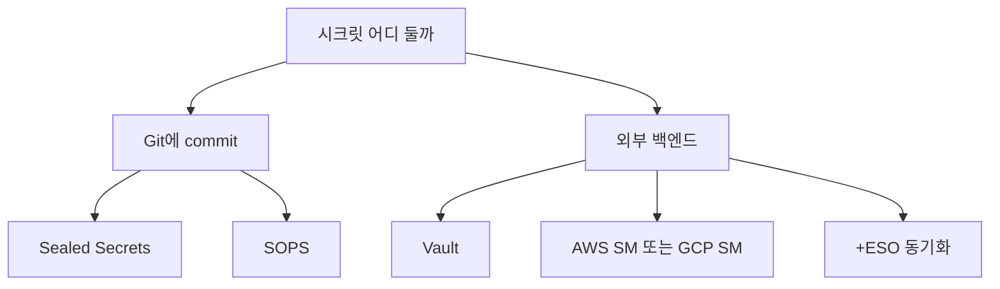
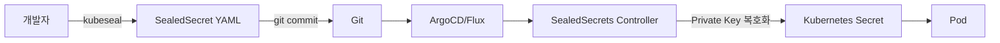
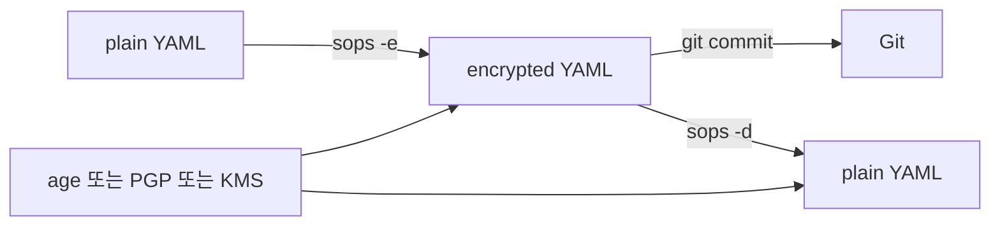

# 경량 시크릿 도구

> **2026년 자리**: Vault·ESO·클라우드 KMS가 *런타임 게이트웨이*라면,
> Sealed Secrets·SOPS는 **GitOps 자체에 시크릿을 안전히 commit하기 위한
> 인-리포 암호화 도구**. 외부 SoT 없이 *Git이 SoT*인 환경, 또는 외부
> 백엔드 도입 전 단계에서 표준. 두 도구는 **암호화 단위·키 관리·타깃**이
> 달라 동일선 비교가 아니라 *상호 보완*.

- **이 글의 자리**: [Vault](vault-basics.md)·[ESO](external-secrets-operator.md)
  *없이도* 시크릿을 Git에 안전히 둘 수 있는 경로. 또한 Vault·ESO와 *공존*하며
  부트스트랩·소규모 클러스터·프라이빗 환경을 커버.
- **선행 지식**: K8s `Secret`, GitOps 워크플로(ArgoCD/Flux), 비대칭/대칭
  암호화, age/PGP/KMS 개념.

---

## 1. 한 줄 정의

| 도구 | 정의 |
|---|---|
| **Sealed Secrets** (Bitnami) | "K8s controller가 *클러스터 안에서만 복호화 가능*한 `SealedSecret` CRD를 발급. Git에 commit해도 안전" |
| **SOPS** (CNCF, ex-Mozilla) | "YAML/JSON/ENV/INI **값만** 암호화하는 파일 편집기. 키는 평문 → diff 친화적. age·PGP·KMS 모두 지원" |
| **helm-secrets** | "SOPS 암호화 파일을 Helm 배포 시점에 on-the-fly 복호화하는 Helm 플러그인" |

> **핵심 차이**: Sealed Secrets는 *클러스터에 묶인* 비대칭 암호 — controller만 복호화.
> SOPS는 *어디서든 키 보유자가* 복호화 — 사람·CI·앱 모두 가능. 둘 다 Git에 안전.

---

## 2. 위치·선택



| 시나리오 | 권고 |
|---|---|
| 단일 클러스터, GitOps SoT, 팀 작음 | **Sealed Secrets** — 클러스터 묶임이 제약이자 안전장치 |
| 멀티 환경(dev/stg/prod), 동일 매니페스트 다른 값 | **SOPS** — 환경별 키 그룹 |
| Helm chart values 암호화 | **SOPS + helm-secrets** |
| Terraform·Ansible·앱 설정 모두 암호화 | **SOPS** — K8s 의존 X |
| 동적 시크릿(DB user 단명 등) | **Vault**(+ESO) — Sealed/SOPS는 정적만 |
| 멀티 클러스터에 같은 시크릿 sync | **ESO** + 외부 백엔드 또는 SOPS+helm |
| 매우 민감(PCI·HIPAA), audit 필수 | **Vault** — Sealed/SOPS의 audit 약함 |

> **혼용은 표준**: 부트스트랩 시크릿(Vault token, KMS 자격)은 Sealed Secrets,
> 운영 시크릿은 Vault+ESO. SOPS는 IaC/Helm chart values에. 한 도구로 다 풀려는
> 시도가 더 위험.

---

## 3. Sealed Secrets — 깊이 있게

### 3.1 동작



| 컴포넌트 | 역할 |
|---|---|
| **Controller** | 클러스터에 설치, `SealedSecret` CRD 처리. *Private key는 controller만 보유* |
| **`kubeseal` CLI** | controller의 *Public key*를 fetch해 로컬에서 암호화 |
| **`SealedSecret` CRD** | base64·암호화된 데이터 + 스코프 메타. Git에 commit 안전 |
| **Sealing key** | RSA-4096 비대칭 + AES-256 대칭 hybrid. controller가 30일마다 자동 *renew* |

### 3.2 버전·릴리즈 (2026-04 기준)

| 버전 | 출시 | 주요 |
|---|---|---|
| **v0.36.5** | 2026-04-09 | 패치 |
| **v0.36.0** | 2026-03 | **CVE-2026-22728 패치** — `rotate` API scope widening |
| **v0.30.x** | 2025 | controller HA, 메트릭 강화 |

### 3.3 Scope — 가장 중요한 개념

| Scope | 의미 | 함정 |
|---|---|---|
| **strict** (기본) | namespace + name이 *동일해야* 복호화 | 이름 변경 시 재암호화 필요 |
| **namespace-wide** | 같은 namespace 내 어떤 이름이든 가능 | namespace 내 사용자 누구나 |
| **cluster-wide** | 모든 namespace에서 가능 | **거의 위험** — namespace 격리 무력 |

```bash
# 표준 — public key를 OOB·핀닝으로 받아 암호화 (MITM 방지)
kubeseal --cert pinned-pubkey.pem -f secret.yaml -w sealed.yaml

# strict (기본) — payments/db-secret으로만 풀림
kubeseal -f secret.yaml -w sealed.yaml

# namespace-wide — payments ns의 어떤 secret 이름이든
kubeseal --scope namespace-wide ...

# cluster-wide — 모든 ns·name 가능
kubeseal --scope cluster-wide ...
```

> **kubeseal MITM 함정**: `kubeseal`이 controller에서 public key를 *온라인 fetch*
> 하면 내부 LB·HTTP 채널에서 MITM 공격자 키로 암호화될 수 있다. 표준은
> **`--cert` 핀닝** — OOB(검증된 채널)로 받은 public key 파일을 매번 명시.
>
> **v0.36+ scope annotation 통합**: 옛 `sealedsecrets.bitnami.com/cluster-wide=true`,
> `sealedsecrets.bitnami.com/namespace-wide=true` 두 개를 단일
> `sealedsecrets.bitnami.com/scope: cluster-wide|namespace-wide|strict`로
> 통합 진행 중. 두 종류 동시 지정 시 *cluster-wide 우선*. 옛 매니페스트 점진
> 마이그.

> **CVE-2026-22728 (8.x High)**: v0.36 이전 `rotate` API에서 *기존 strict/
> namespace-wide SealedSecret을 controller HTTP 엔드포인트(`/v1/rotate`)로 보내며
> 템플릿 annotation을 조작*해 cluster-wide로 격상 가능. **rotate는 K8s API 리소스가
> 아니라 controller HTTP endpoint** — admission policy로 막히지 않는다. 완화책:
>
> 1. **v0.36+ 업그레이드 의무** (근본 수정)
> 2. controller `/v1/rotate`·`/v1/cert.pem` 엔드포인트를 NetworkPolicy로
>    *kube-system 외부 차단* — 외부에서 직접 호출 불가
> 3. `kubeseal --re-encrypt`/`--rotate` 사용 통제 — 신뢰된 입력만
> 4. v0.36+에서는 `sealedsecrets.bitnami.com/scope: cluster-wide` 단일 annotation
>    부여 권한을 K8s admission policy(Kyverno/OPA)로 제한 — 다만 이는
>    *manifest 레벨* 통제이며 rotate 우회와는 별도

### 3.4 Key 관리 — renew vs rotate

> **혼동 주의**: Sealed Secrets의 "key rotation"은 *renewal* — 새 sealing key를
> 추가하지만 *기존 키 삭제 X*. 기존 SealedSecret은 계속 복호화 가능. 이는
> **PCI DSS 3.6 / 4.0 8.3.10의 crypto period 요구를 자동 충족하지 않는다** —
> 모든 옛 키가 영구 보관되므로 진짜 회전은 별도 절차 필수.

| 동작 | 기본 |
|---|---|
| **자동 renew** | 30일마다 새 sealing key 추가 (controller flag `--key-renew-period`) |
| **active key** | 가장 최신 키로 새 암호화 |
| **decrypt key set** | 모든 활성 sealing key (과거 포함) — *영구 보관* |
| **수동 rotate(진짜 회전)** | (1) 새 key로 *모든 SealedSecret* 재암호화, (2) 옛 key를 controller에서 삭제 — *직접 운영* |

```bash
# 모든 sealing key backup (재해 복구 필수)
kubectl get secrets -n kube-system \
  -l sealedsecrets.bitnami.com/sealing-key \
  -o yaml > sealing-keys-backup.yaml

# 권고: 산출물은 평문 RSA private key — 즉시 추가 암호화
gpg --symmetric --cipher-algo AES256 sealing-keys-backup.yaml
shred -u sealing-keys-backup.yaml
```

> **백업 산출물 = 평문 RSA private key**. 그대로 git/Slack/티켓에 흘러들면
> *클러스터 시크릿 전체 침해*. (1) 즉시 GPG·age로 추가 암호화, (2) HSM/오프라인
> 미디어에 보관, (3) 정기 *복구 훈련* — 아무도 안 해본 백업은 백업이 아님.
> 라벨 키 자체(`sealedsecrets.bitnami.com/sealing-key`)만으로 셀렉트 — 값은
> controller 버전마다 다름.

> **재해 시나리오**: 클러스터 재구축 = sealing key 분실 = 모든 SealedSecret
> 복호화 불가. 별도 클러스터로 복원할 때 backup의 key를 import 후
> controller 부팅. *복구 절차 문서화 + 분기 1회 훈련*.

### 3.5 멀티 클러스터·멀티 환경

| 패턴 | 동작 |
|---|---|
| **클러스터별 별도 key** | dev/stg/prod 각자 SealedSecret 따로 — 안전, 매니페스트 N개 |
| **공유 sealing key** | 클러스터 간 key 복제 — 한 매니페스트 N환경 적용. 그러나 *침해 시 모든 환경 공통 침해* |
| **SOPS로 환경별 분기** | 차라리 SOPS의 key group이 더 적합 |

### 3.6 ArgoCD·Flux 통합

| 도구 | 처리 |
|---|---|
| **ArgoCD** | `SealedSecret`은 ArgoCD가 그대로 apply, controller가 `Secret`을 생성 → ArgoCD가 OutOfSync로 인식 가능 |
| **Health check** | 커뮤니티 health.lua로 `Synced`까지 대기 |
| **Sync waves** | controller 먼저 sync, 그 후 SealedSecret |

```yaml
# ArgoCD ignoreDifferences — controller가 생성한 Secret 무시
spec:
  ignoreDifferences:
    - group: ""
      kind: Secret
      jsonPointers: [/data, /metadata/ownerReferences]
```

### 3.7 안티패턴

| 안티패턴 | 결과 | 교정 |
|---|---|---|
| sealing key backup 없음 | 클러스터 손실 = 시크릿 영구 손실 | offsite 백업, 재해 시나리오 훈련 |
| `cluster-wide` scope 광범위 | namespace 격리 무력 | strict 기본, cluster-wide는 admission policy로 제한 |
| v0.36 미만 운영 | CVE-2026-22728 | v0.36+ 업그레이드 |
| sealing key를 dev/prod 공유 | 한쪽 침해 = 양쪽 침해 | 환경별 별도 |
| controller 단일 replica | renew 중 장애 | replica ≥ 2, leader election |
| `rotate` annotation 광범위 부여 | scope 우회 | admission policy로 제한 |

---

## 4. SOPS — 깊이 있게

### 4.1 동작



- 값만 암호화, **키는 평문** → diff에서 *어떤 키가 변경됐는지 추적 가능*
- 한 파일에 *여러 recipient* — age·PGP·여러 KMS 동시. 누구나 자기 키로 복호화
- `.sops.yaml` 한 파일에 *경로별 키 매핑*

### 4.2 버전·동향 (2026-04 기준)

| 버전 | 출시 | 주요 |
|---|---|---|
| **v3.12.2** | 2026-03-18 | 메타데이터 검증, MAC-only 플래그, 임시파일 핸들링 |
| **v3.12.1** | 2025-02 | stdin/stdout, age plugin, time.Time |
| **v3.11** | 2024-09 | age passphrase·SSH key, env-based config |

> **거버넌스 변경**: 2023년 Mozilla → CNCF Sandbox 이관, 현재 `getsops/sops`
> (CNCF). 모든 릴리즈에 SLSA provenance·서명 첨부.

### 4.3 키 백엔드 비교

| 백엔드 | 장점 | 단점 |
|---|---|---|
| **age** | 단순, public key 짧음, modern crypto | 단일 키 알고리즘(X25519), HSM 미지원 |
| **PGP/GPG** | 키체인 생태계, 하드웨어 키 | 복잡, 회전 어려움 — *deprecated 권고* |
| **AWS KMS** | IAM 통합, audit, 회전 자동 | KMS 비용·throttle |
| **GCP KMS** | IAM 통합 | KMS 비용 |
| **Azure Key Vault** | EntraID 통합 | 동일 |
| **HashiCorp Vault Transit** | 키 분리, audit | Vault 운영 부담 |

> **신규 표준 = age**: GPG의 모든 함정(key TTL·trust web·subkey)을 제거. 짧은
> public key를 매니페스트에 표기 가능. *프라이빗 환경*은 age 단독, *클라우드 통합*은
> KMS 추가가 표준.

> **age 하드웨어 키 통합**: age는 plugin 아키텍처로 *HSM/하드웨어 키* 사용 가능.
> `age-plugin-yubikey`(YubiKey PIV), `age-plugin-tpm`(TPM 2.0),
> `age-plugin-se`(macOS Secure Enclave). dev workstation/오퍼레이터 키는
> 하드웨어 키로 *유출 면역*이 표준.

### 4.4 `.sops.yaml` — 경로별 키

```yaml
# .sops.yaml (repo root)
creation_rules:
  - path_regex: secrets/dev/.*\.yaml$
    age: age1abc...           # dev key
    encrypted_regex: '^(data|stringData)$'

  - path_regex: secrets/prod/.*\.yaml$
    kms: arn:aws:kms:us-east-1:111:key/prod-key
    aws_profile: prod
    encrypted_regex: '^(data|stringData)$'

  - path_regex: helm/values-prod\.yaml$
    age: age1prod1...,age1prod2...   # 여러 recipient
    encrypted_regex: '^(password|.*[Tt]oken|.*[Ss]ecret)$'
```

| 필드 | 의미 |
|---|---|
| `path_regex` | 어느 파일에 어떤 키 |
| `encrypted_regex`/`encrypted_suffix` | *값* 중 어느 키만 암호화 (regex) |
| `unencrypted_regex` | 평문 유지 (비-시크릿 메타데이터) |
| `key_groups` | Shamir 분할 — 그룹 N개, M개 만족 시 복호화 |

### 4.5 Key Groups — Shamir로 다중 신뢰

```yaml
key_groups:
  - age:
      - age1alice...
      - age1bob...
  - kms:
      - arn:aws:kms:...:111:key/prod-1
shamir_threshold: 2   # 두 그룹 모두 필요
```

→ alice/bob 한 명 + AWS KMS 둘 다 있어야 복호화. **사람 + 시스템** 이중 신뢰.

### 4.6 GitOps — Flux·ArgoCD

| 도구 | 통합 |
|---|---|
| **Flux** | 1급 SOPS 지원 — `decryption.provider: sops`로 KMS·age 자동 |
| **ArgoCD** | KSOPS plugin 또는 sidecar로 복호화 |
| **Helmfile** | SOPS 통합 native |
| **Kustomize** | `KustomizeConfig` + plugin |

```yaml
# Flux Kustomization
apiVersion: kustomize.toolkit.fluxcd.io/v1
kind: Kustomization
spec:
  decryption:
    provider: sops
    secretRef:
      name: sops-age   # age key 저장 K8s Secret
  path: ./prod
```

### 4.7 IaC·앱 설정에서

```bash
# Terraform tfvars
sops -e prod.tfvars > prod.tfvars.enc.yaml

# 사용
sops -d prod.tfvars.enc.yaml > prod.tfvars
terraform apply -var-file=prod.tfvars
```

> SOPS는 K8s 무관. Terraform·Ansible·.env·dotnet appsettings·Spring config
> 등 *어떤 평문 설정 파일*에도. 멀티-도메인 표준.

### 4.8 안티패턴

| 안티패턴 | 결과 | 교정 |
|---|---|---|
| GPG 키체인을 CI runner에 복사 | runner 침해 = 키 유출 | KMS·age + IAM/SA |
| age private key를 K8s Secret 평문 | 공격자가 추출 | 별도 namespace + 강한 RBAC, 또는 KMS |
| `encrypted_regex` 미설정 → 모든 값 암호화 | 메타데이터까지 암호화로 diff 불가 | 시크릿 키만 regex |
| 하나의 KMS key로 dev/prod | 환경 격리 X | 환경별 KMS key + IAM 분리 |
| `.sops.yaml` 누락 → 매번 키 명시 | 실수로 평문 commit | repo root `.sops.yaml` 강제 |
| pre-commit hook 없음 | 평문 시크릿 push | `pre-commit` + `gitleaks`/`detect-secrets` |
| 키 재발급 시 모든 파일 재암호화 안 함 | 옛 키 보유자 계속 복호화 | `sops updatekeys` *후* 모든 파일 `decrypt | encrypt` 재암호화 |
| `sops updatekeys`만으로 키 제거 끝 | **updatekeys는 파일에 적힌 키 목록만 갱신** — 옛 git history의 ciphertext는 옛 key로 여전히 복호화 가능 | (1) 모든 파일 `sops -d \| sops -e` 재암호화, (2) git history에서 옛 ciphertext 제거, (3) 키 자체 파기 — 3단계 |

---

## 5. helm-secrets — Helm chart 통합

### 5.1 동작

```bash
# values.yaml (평문)
db:
  password: secret123

# SOPS로 암호화
sops -e values.yaml > secrets.values.yaml

# 배포 — on-the-fly 복호화
helm secrets upgrade --install app ./chart \
  -f values.yaml \
  -f secrets.values.yaml
```

- Helm hook으로 임시 평문 파일 생성 → helm 호출 → 정리
- 평문 파일은 OS temp, helm 종료 시 삭제

### 5.2 ArgoCD·Flux 통합

| 도구 | 설정 |
|---|---|
| **ArgoCD** | `helm-secrets` 사이드카 또는 *Helm Plugin* config |
| **Flux** | `HelmRelease` + `valuesFrom: secretKeyRef` (Flux가 SOPS 처리) |

> **권고**: Flux는 native SOPS — helm-secrets 없이도 가능. ArgoCD는 plugin·
> sidecar 부담이 있어 *큰 환경*에서는 SOPS 직접 + ArgoCD가 평문 매니페스트
> 받는 패턴이 더 단순.

### 5.3 helm-secrets 누설 벡터 (실무 함정)

| 함정 | 메커니즘 |
|---|---|
| `/tmp/`에 평문 떨어짐 | `helm-secrets`이 SOPS 복호화 결과를 임시파일로 — OOM/SIGKILL 시 *cleanup hook 미동작* |
| ArgoCD repo-server 캐시 | `helm template` 결과가 repo-server에 캐싱되며 *평문 values*가 cache 디렉토리에 |
| Pod에 평문 environment 노출 | 플러그인이 환경변수로 평문 파라미터 전달 |
| Multi-tenant ArgoCD | repo-server 한 컨테이너가 *모든 팀 chart*를 처리 → 한 팀 cache가 다른 팀에 |

**완화**:
- repo-server에 *tmpfs* + 격리된 namespace, container-level isolation
- ArgoCD Plugin Sidecar 모델 권장 — 팀별 sidecar 격리
- SIGTERM 트랩으로 cleanup 강제, `HELM_SECRETS_BACKEND` 명시
- 큰 조직은 *SOPS 단독* + Argo 매니페스트 평문 패턴 또는 *ESO+외부 백엔드*로 이전

---

## 6. Sealed Secrets vs SOPS — 정면 비교

| 차원 | Sealed Secrets | SOPS |
|---|---|---|
| **암호화 단위** | 전체 Secret 객체 | 파일의 *값만* (키는 평문) |
| **복호화 가능 주체** | 클러스터 controller만 | 키 보유자 누구나 (사람·CI·앱) |
| **키 관리** | 클러스터 내부, 자동 renew | 외부(age·PGP·KMS), 수동 또는 KMS 자동 |
| **K8s 종속** | 강함 (CRD + controller) | 없음 — 어떤 텍스트 파일도 |
| **diff 친화** | 약함 — 전체 base64 | 강함 — 어떤 키 변경됐는지 보임 |
| **다중 환경** | 환경별 controller 또는 key 복제 | `.sops.yaml`로 경로별 키 |
| **복구** | sealing key backup 의무 | 키 백엔드의 backup |
| **통합** | K8s 한정 | 모든 IaC·앱·설정 |
| **GitOps 친화** | 높음 (CRD as-is) | 높음 (값만 암호화) |
| **Audit** | controller 로그·이벤트 | 키 백엔드(KMS) audit |
| **제약** | 클러스터 묶임 | 키 분배·회전 사람 책임 |

> **함께 쓰는 패턴**: K8s 매니페스트의 Secret = Sealed Secrets, Helm chart values
> = SOPS+helm-secrets, Terraform·Ansible 변수 = SOPS. 도구별 *주특기 차이*를
> 받아들이고 분담.

---

## 6.5 etcd 암호화는 별개 — 반드시 함께

Sealed Secrets·SOPS는 *Git에 안전*하게 둘 뿐, 결국 controller/플러그인이
*K8s `Secret`*을 만들면 etcd에 base64 평문 저장. **둘 다 etcd encryption-at-rest
(KMS provider v2)와 짝**. 자세한 패턴은 [Kubernetes — etcd 암호화](../../kubernetes/security/encryption-at-rest.md)
참조.

| 보호 계층 | 도구 | 위협 |
|---|---|---|
| Git 저장 시 평문 | Sealed Secrets / SOPS | git 유출 |
| etcd 디스크 평문 | KMS provider v2 + 키 회전 | etcd 백업·노드 디스크 유출 |
| Pod에서 시크릿 read | RBAC + Pod Security | 컨테이너 침해 |
| 시크릿 사용 audit | K8s audit log + 외부 KMS audit | 사후 추적 |

## 7. 컴플라이언스 매핑

| 표준 | 요구 | Sealed Secrets | SOPS |
|---|---|---|---|
| **PCI DSS 3.6** (key management lifecycle) | 키 생성·배포·저장·교체·파기 절차 | 부분 — renewal만 자동, 교체·파기 수동 | 부분 — KMS 사용 시 자동 |
| **PCI DSS 4.0 8.3.10** (crypto period) | 정의된 주기 후 키 회전 | **자동 X** — 옛 키 영구 보관 | **KMS 사용 시 충족** |
| **HIPAA §164.312(a)(2)(iv)** | encryption at rest | etcd 암호화 동시 필요 | KMS at-rest 충족 |
| **NIST 800-53 SC-12, SC-13** | 키 설립·관리·암호화 | 정책 문서화 필요 | KMS 위임 |
| **SOC 2 CC6.1** | 접근 제어 | scope·RBAC 통제 | `.sops.yaml`+IAM |

> **결론**: PCI/HIPAA 요구를 충족하려면 (a) Sealed Secrets는 **수동 rotate
> 절차+감사 증적** 의무, (b) SOPS는 KMS 백엔드 + audit log. Sealed Secrets
> 단독은 *crypto period 자동 충족 X* — 컴플라이언스 환경은 KMS-backed SOPS 또는
> Vault로.

## 8. ESO/Vault과의 위치 — 보완 관계

| 시나리오 | 권고 |
|---|---|
| 클러스터에 Vault·ESO 있음 | 운영 시크릿은 Vault, **부트스트랩**(Vault token, KMS 자격)만 Sealed Secrets/SOPS |
| 동적 시크릿 필요 (DB 단명 user) | Vault — Sealed/SOPS 불가능 |
| audit·정책 필요 (PCI/HIPAA) | Vault — Sealed/SOPS는 audit 약함 |
| 작은 클러스터, 정적 시크릿만 | Sealed Secrets 단독으로 충분 |
| 멀티-도메인 IaC·앱 통합 | SOPS — 도구 종속 X |
| chart values 암호화 | SOPS+helm-secrets |

> **부트스트랩 패턴**: Vault unseal token, KMS 키 ID 등 *Vault·ESO를 띄우기
> 위해 필요한* 시크릿은 SealedSecret 또는 SOPS로 Git에. 그 후 모든 운영
> 시크릿은 Vault. *순환 의존* 회피.

---

## 9. 사고 시나리오 (사고 = 학습)

| 사고 | 원인 | 회피 |
|---|---|---|
| 클러스터 삭제·재구축 후 SealedSecret 모두 unseal 불가 | sealing key backup 누락 | offsite backup + 복구 훈련 |
| `cluster-wide` scope로 부주의하게 만든 SealedSecret이 다른 ns에서 unseal | scope 통제 부재 | strict 기본 + admission policy |
| 개발자 노트북에서 GPG private key 유출 | GPG 키 로컬 보관 + commit history에 남은 평문 | age + KMS, history 청소(BFG) |
| ArgoCD가 `Secret`을 OutOfSync로 표시, 자동 prune | Sealed Secrets controller 생성물을 ArgoCD가 prune 시도 | `ignoreDifferences` 설정, sync wave 분리 |
| SOPS encrypted_regex 누락으로 ConfigMap key까지 암호화 | regex 미설정 | `.sops.yaml`에 `encrypted_regex` 의무 |
| KMS key 삭제로 모든 prod 시크릿 복호화 불가 | KMS 키 삭제 보호 미설정 | KMS key deletion delay + multi-region |
| ArgoCD repo-server에 KMS credential 평문 마운트 | repo-server 침해 → KMS 자격 = 모든 prod 시크릿 | IRSA/Workload Identity로 정적 키 0, repo-server tmpfs |
| 시크릿 회전했지만 Pod이 옛 값으로 도는 채로 발견 | Sealed/SOPS 모두 *Pod 자동 reload 없음* | Reloader/Stakater + ArgoCD `Sync` hook으로 rolling restart |

---

## 10. 안티패턴 — 통합

| 안티패턴 | 결과 | 교정 |
|---|---|---|
| 평문 Secret을 Git에 commit | 영구 유출(history에 남음) | pre-commit hook + secret scanner |
| 평문 commit 후 history 청소 안 함 | 옛 commit에서 추출 가능 | BFG·git-filter-repo로 history 청소, 발견 즉시 키 회전 |
| Sealed Secrets·SOPS 둘 다 안 쓰면서 K8s Secret 평문 매니페스트 | etcd 평문, GitOps 매니페스트 평문 | 둘 중 하나 + etcd 암호화 |
| sealing key/age key 단일 사본 | 손실 시 영구 | offsite + 다중 사본 + 정기 backup 검증 |
| dev/prod 동일 키 | 한쪽 침해 = 모든 환경 | 환경별 분리 |
| 키 회전 미실시 | crypto-period 위반, 침해 시 영구 | 정기 + `sops updatekeys`/SealedSecret 재암호화 |
| `kubeseal --scope cluster-wide` 무분별 | namespace 격리 무력 | strict 우선, 예외만 cluster-wide |
| `helm-secrets` 임시파일이 OS 추적 가능 위치 | 평문 leak | TMPDIR 분리, gitignore 의무, container의 tmpfs |
| SOPS GPG 사용 (deprecated) | 키 회전·trust web 부담 | age 또는 KMS |
| KMS 비용 고려 없이 호출 폭증 | 청구서 폭발, throttle | 캐시(KMS Data Key envelope), batch |
| pre-commit / CI scan 없음 | 평문 commit 위험 | gitleaks/trivy/trufflehog |
| 키 보유자 명단·교체 절차 없음 | 인적 사고 시 시크릿 손실 | 운영 문서 + 정기 훈련 |
| SealedSecret/SOPS만으로 동적 시크릿 흉내 | 회전 부담 폭발 | Vault dynamic secret으로 이전 |
| controller·CLI 바이너리 서명 검증 안 함 | 공급망 침해 시 그대로 채택 | cosign 서명 + SLSA provenance 검증 |
| Pod에 시크릿 변경 자동 반영 없음 | 회전했는데 옛 값으로 운영 | Reloader/Stakater + file watcher reload |
| `kubeseal --cert` 핀닝 없이 fetch | controller endpoint MITM | OOB로 받은 public key 핀닝 |
| dev workstation에 GPG/age private key 평문 | 노트북 분실 = 시크릿 유출 | YubiKey/TPM/Secure Enclave plugin |

---

## 11. 운영 체크리스트

**공통**
- [ ] pre-commit hook + secret scanner(gitleaks 등) 의무
- [ ] history에 평문 commit 발견 시 *즉시 회전* + 청소
- [ ] 환경별(dev/stg/prod) 키 분리
- [ ] 키 백업 — offsite, 다중 사본, 정기 복구 훈련
- [ ] 키 회전 정책 문서화 (주기·담당·검증)

**Sealed Secrets**
- [ ] v0.36+ (CVE-2026-22728 패치)
- [ ] sealing key backup → *추가 암호화 후* offsite, 분기 1회 복구 훈련
- [ ] strict scope 기본, cluster-wide는 admission policy + rotate endpoint NetworkPolicy 차단
- [ ] `kubeseal --cert` 핀닝 — public key OOB 검증
- [ ] controller HA (replica ≥ 2), `/v1/rotate` endpoint 외부 차단
- [ ] ArgoCD `ignoreDifferences`로 controller 생성 Secret 무시
- [ ] 클러스터 재구축 시 backup → import 절차 검증
- [ ] PCI/HIPAA 환경: 수동 rotate 절차 + crypto period 문서화 (renewal ≠ rotation)

**SOPS**
- [ ] age 또는 KMS — GPG 신규 사용 X
- [ ] dev workstation은 age plugin(YubiKey/TPM/SE)으로 하드웨어 키
- [ ] `.sops.yaml`에 `encrypted_regex` 명시
- [ ] KMS 키 deletion delay + multi-region
- [ ] 키 회전: `sops updatekeys` *후* `decrypt|encrypt` 재암호화 + git history 정리
- [ ] Key Groups + Shamir로 인적+시스템 이중 신뢰 검토 (prod)
- [ ] CI runner의 키 접근은 IAM/Workload Identity로 (정적 키 X)
- [ ] SOPS 바이너리 cosign 서명 + SLSA provenance 검증 (공급망)

**helm-secrets**
- [ ] Flux는 native SOPS, ArgoCD는 plugin/sidecar 신중 검토
- [ ] 임시 파일 경로 분리, container tmpfs 활용
- [ ] CI에서 평문 values 출력 금지 (secret masking)
- [ ] ArgoCD repo-server cache 누설 점검 — 멀티테넌트는 Plugin Sidecar 격리

**시크릿 회전 후 Pod 반영**
- [ ] Reloader/Stakater 또는 ArgoCD `Sync` hook으로 rolling restart
- [ ] envFrom 대신 volumeMount(file) + 앱 SIGHUP/file watcher

---

## 참고 자료

- [Sealed Secrets — GitHub](https://github.com/bitnami-labs/sealed-secrets) (확인 2026-04-25)
- [Sealed Secrets — Releases](https://github.com/bitnami-labs/sealed-secrets/releases) (확인 2026-04-25)
- [CVE-2026-22728 — rotate API scope widening](https://advisories.gitlab.com/pkg/golang/github.com/bitnami-labs/sealed-secrets/CVE-2026-22728/) (확인 2026-04-25)
- [SOPS — Documentation](https://getsops.io/docs/) (확인 2026-04-25)
- [SOPS — GitHub](https://github.com/getsops/sops) (확인 2026-04-25)
- [Flux — Mozilla SOPS Guide](https://fluxcd.io/flux/guides/mozilla-sops/) (확인 2026-04-25)
- [helm-secrets — GitHub (jkroepke fork)](https://github.com/jkroepke/helm-secrets) (확인 2026-04-25)
- [age — encryption tool](https://github.com/FiloSottile/age) (확인 2026-04-25)
- [GitGuardian — A Comprehensive Guide to SOPS](https://blog.gitguardian.com/a-comprehensive-guide-to-sops/) (확인 2026-04-25)
