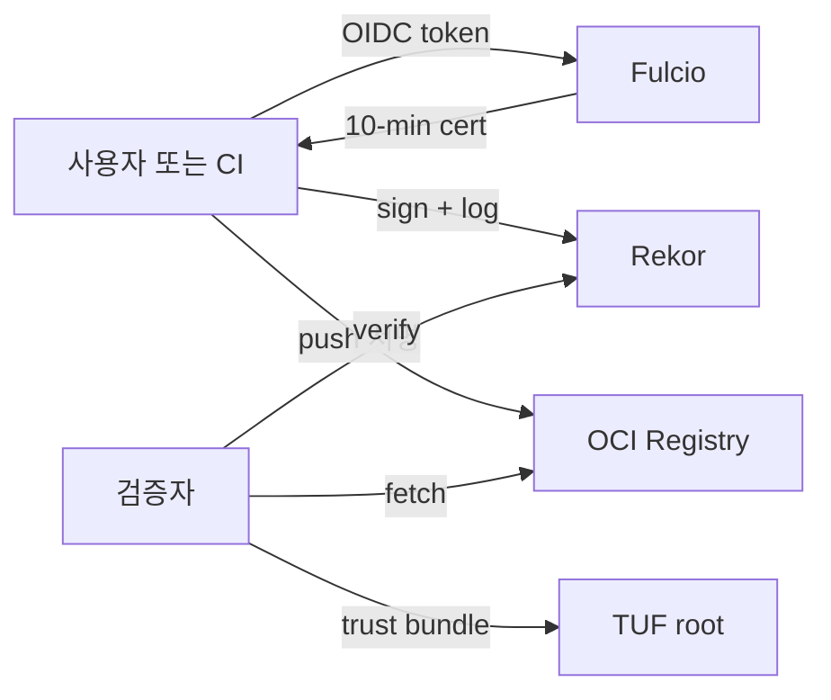
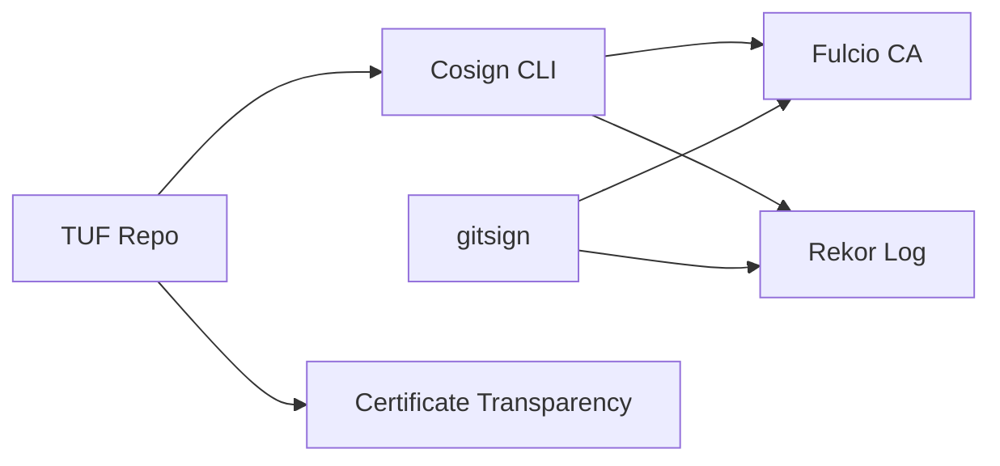
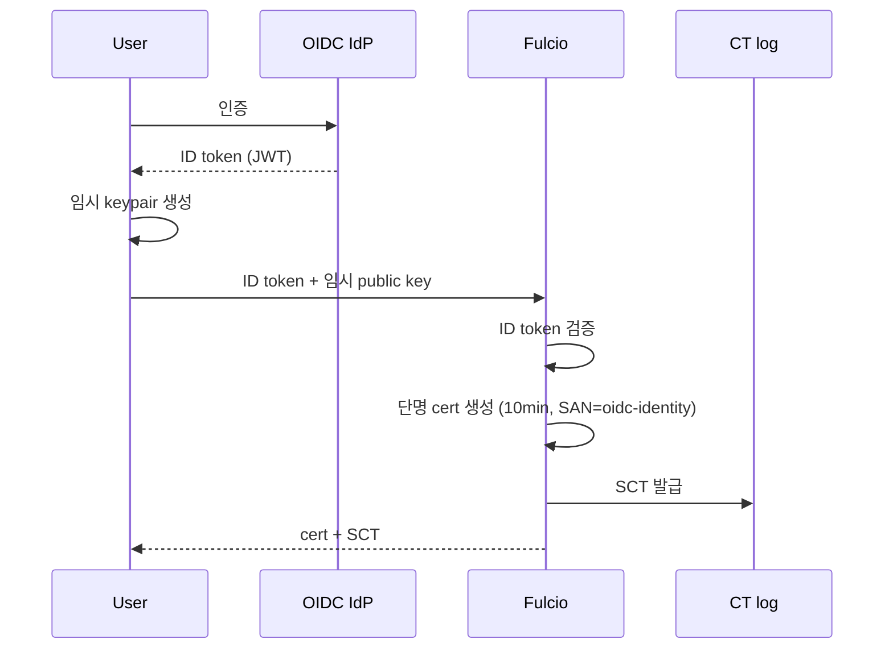
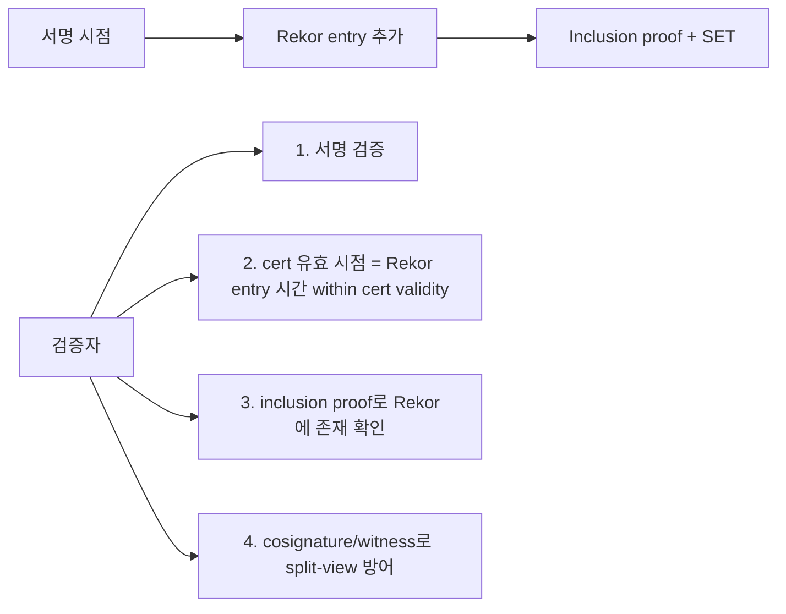

# Sigstore

> **2026년의 자리**: Sigstore는 *공급망 서명의 공용 인프라*. **OIDC + 단명
> 인증서 + 공개 투명성 로그**의 조합으로 "키 관리 없는" 서명을 표준화.
> 2024-03 **OpenSSF Graduated**, 2025-10 **Rekor v2 GA** (Trillian → Tessera 기반).
> 본 글은 [이미지 서명](../container-security/image-signing.md) 글이 *도구
> 비교·운영*이라면, 여기는 **Sigstore 내부 동작·신뢰 모델·자체 운영**.

- **이 글의 자리**: [이미지 서명](../container-security/image-signing.md)·
  [SLSA](slsa.md)·[SBOM](../container-security/sbom.md)과 함께 공급망 보안 4종.
- **선행 지식**: X.509·PKI, OIDC, Merkle tree, [TUF](#7-tuf--트러스트-루트)
  기본 개념.

---

## 1. 한 줄 정의

> **Sigstore**: "서명자가 *키를 보관할 필요 없이* OIDC 신원으로 단명 인증서를
> 받아 서명하고, 그 서명을 *공개 투명성 로그*에 기록하는 *공용 인프라*."



---

## 2. 왜 Sigstore인가 — 키 없는 서명의 패러다임 전환

| 기존 모델 | Sigstore 모델 |
|---|---|
| 서명자가 PGP/X.509 *long-lived 키* 보관 | 서명 시점에 *10분* 단명 cert 발급 |
| 키 분실·유출 시 광범위 회수 | 단명 cert 자체로 *유출 임팩트 최소* |
| 키 회전·CRL/OCSP 운영 부담 | 회전 자동, *Rekor에 기록된 시점*이 신뢰 |
| 검증자가 모든 서명자 키를 알아야 | 검증자는 OIDC 발행자·신원만 정책으로 매칭 |
| 투명성·audit 외부 도구 | *공개 투명성 로그* 내장 |

> **사후 검증 가능성**: 단명 cert가 *서명 시점에 유효했음*을 Rekor inclusion
> proof로 증명. cert 만료 후에도 **서명 자체는 영구 검증 가능**.

---

## 3. 4가지 핵심 컴포넌트



| 컴포넌트 | 역할 |
|---|---|
| **Fulcio** | OIDC 기반 단명 X.509 cert 발급 CA |
| **Rekor** | tamper-evident 공개 투명성 로그 (Merkle tree) |
| **Cosign** | 클라이언트 — 컨테이너·바이너리 서명/검증 |
| **gitsign** | Git commit 서명 — Fulcio·Rekor 사용 |
| **TUF** | trust root 분배 (Fulcio CA 인증서·Rekor 공개키) |
| **Certificate Transparency log** | Fulcio 발급 cert 공개 (RFC 6962) |

---

## 4. Fulcio — 단명 인증서 CA

### 4.1 동작



### 4.2 cert에 무엇이 들어가는가

| 필드 | 의미 |
|---|---|
| **Subject** | OIDC `sub` (예: `https://github.com/acme/app/...`) |
| **SAN (Subject Alternative Name)** | OIDC issuer + identity |
| **Validity** | 약 10분 |
| **Key** | 클라이언트가 만든 ephemeral key |
| **OIDC issuer URL** | Custom OID `1.3.6.1.4.1.57264.1.1` |
| **Issued by** | Fulcio CA (intermediate) |
| **SCT** | Certificate Transparency Signed Certificate Timestamp |

### 4.3 신뢰되는 OIDC 발행자

| 발행자 | 환경 |
|---|---|
| **GitHub Actions** (`https://token.actions.githubusercontent.com`) | GH workflow |
| **GitLab CI** | GL pipeline |
| **Google** (`https://accounts.google.com`) | 사람 |
| **Microsoft** | 사람·Azure |
| **Buildkite·CircleCI** | 다양 |
| **Custom (자체 IdP)** | 자체 Fulcio 운영 시 |

### 4.4 자체 Fulcio

```yaml
# Fulcio config (private 운영)
oidc-issuers:
  https://idp.acme.com:
    issuer-url: https://idp.acme.com
    client-id: sigstore
    type: email
```

| 운영 | 의미 |
|---|---|
| Root CA (offline·HSM) | trust root |
| Intermediate CA (online) | 단명 cert 발급 |
| OIDC IdP 통합 | Keycloak·Okta·Azure AD |
| TUF root.json 직접 관리 | 클라이언트 trust 분배 |

---

## 5. Rekor — 투명성 로그

### 5.1 핵심 개념

| 개념 | 의미 |
|---|---|
| **Merkle tree** | tamper-evident 자료구조 — 한 entry 변조 시 root hash 변경 |
| **Inclusion proof** | "이 entry가 트리에 있다"는 짧은 증명 |
| **Consistency proof** | "트리가 단조 증가했다"는 증명 (rewrite 방지) |
| **Auditor** | 외부 감사자가 트리 무결성 확인 |
| **Witness** | 분산 cosignature로 split-view 공격 방어 |

### 5.2 Rekor v2 (2025-10 GA) — 백엔드 교체

| 변경 | 내용 |
|---|---|
| 옛 (v1) | Trillian (Google) 기반 |
| 신 (v2) | **Trillian-Tessera** (tile-based 투명성 로그) — 더 가볍고 빠른 검증 |

**Tile-based log 장점**:

| 장점 | 의미 |
|---|---|
| Fixed-size tiles | offline 검증 효율 |
| 더 작은 inclusion proof | 클라이언트 부담 감소 |
| Witness cosignature | 분산 모니터링 표준 |

### 5.3 entry 구조

```json
{
  "kind": "hashedrekord",
  "apiVersion": "0.0.1",
  "spec": {
    "signature": {
      "content": "MEUCIA...",
      "publicKey": {
        "content": "LS0tLS1CRUdJTi..."   // Fulcio cert
      }
    },
    "data": {
      "hash": {
        "algorithm": "sha256",
        "value": "abc123..."
      }
    }
  }
}
```

### 5.4 검증 시 Rekor의 역할



> **핵심**: cert 만료 후에도 *Rekor entry가 cert 유효 시점에 만들어졌음*을
> 증명 → 서명 영구 검증 가능. Sigstore 모델의 핵심.

### 5.5 cosignature·witness — split-view 방어

Rekor가 *서로 다른 사용자에게 다른 트리를 보여주는* split-view 공격을 막기 위해:

- 다수 *witness* 가 트리 root 정기 cosignature
- 클라이언트는 cosignature 검증으로 *모두가 같은 트리를 보고 있음* 확인
- 2024-2025년 sigstore community가 witness 인프라 구축

---

## 6. Cosign — 클라이언트

빌드·검증 도구. 이 글에서는 *Sigstore 내부* 관점, 사용 명령은
[이미지 서명](../container-security/image-signing.md)에서.

### 6.1 Cosign 3.x (2025-10) 핵심 변화

| 변경 | 의미 |
|---|---|
| **Sigstore Bundle format 기본** | `*.sigstore.json` 한 파일에 서명·cert·inclusion proof |
| **OCI 1.1 referrers 기본** | 옛 `.sig` 태그 옵션 |
| **trusted root 모델** | `SIGSTORE_ROOT_FILE`은 deprecated, TUF mirror 우선 |
| **bundle 기반 offline 검증** | Rekor 호출 없이 bundle만으로 |

---

## 7. TUF — 트러스트 루트

### 7.1 왜 TUF인가

신뢰의 시작은 *Fulcio CA 인증서·Rekor 공개키*. 이걸 어떻게 *안전하게 분배*?

| 위협 | TUF 방어 |
|---|---|
| 키 분배 채널 침해 | multi-key 서명 (threshold) |
| 키 만료 후 회전 시 신뢰 끊김 | 계층 키 (root → targets → snapshot → timestamp) |
| 옛 메타데이터 replay | timestamp 키로 freshness |
| 한 키 침해 시 무한 영향 | 짧은 만료 + 자동 회전 |

### 7.2 Sigstore TUF Repo

```
https://tuf-repo-cdn.sigstore.dev/
├── 1.root.json    # 다중 키 서명, 1년 만료
├── targets.json   # 신뢰 키 매핑 (Fulcio CA, Rekor pub)
├── snapshot.json  # 메타 일관성, 짧은 만료
└── timestamp.json # 매 분~시간, fresh 보증
```

### 7.3 root key signing ceremony

| 특징 | 설명 |
|---|---|
| **5명 keyholder** | 다양한 회사·학계 |
| **공개 의식** | 라이브 스트리밍 |
| **HSM 보관** | 각 keyholder의 hardware token |
| **threshold M-of-N** | 다수 합의 의무 |
| **정기 회전** | 매년 |

### 7.4 자체 TUF — 사내 Sigstore

```bash
# 자체 root 생성
tuf init --root-key root-key.pem
tuf add-target fulcio-cert.pem
tuf add-target rekor-pub.pem
tuf timestamp

# 클라이언트 trust
cosign initialize --mirror https://sigstore.acme.com/tuf --root root.json
```

---

## 8. 공용 vs 자체 호스팅

| 차원 | **공용 (sigstore.dev)** | **자체 호스팅** |
|---|---|---|
| 비용 | 무료 (CNCF 운영) | infra·운영 |
| 운영 | community SRE | 자체 SRE |
| OIDC | GitHub·Google·MS·GitLab 등 공개 | Keycloak·Okta·자체 |
| audit | 공개 — 누구나 trace 가능 | 사내 |
| air-gap | 불가 | 가능 |
| compliance | "공개 OK"인 데이터만 | 민감 워크로드 |
| 가용성 | community SLA | 자체 SLA |

### 8.1 자체 호스팅 권고 환경

| 환경 | 이유 |
|---|---|
| 정부·국방 | 외부 노출 제한 |
| 금융·의료 | 데이터 주권 |
| Air-gap·온프레미스 | 외부 의존 X |
| 멀티 region 대규모 | latency·비용 |

> **하이브리드**: 외부 OSS는 공용, 사내는 private — 둘이 *trust root 분리*.

### 8.2 자체 운영 함정

| 함정 | 결과 |
|---|---|
| Root key signing ceremony 절차 부재 | trust root 침해 위험 |
| TUF metadata 만료 자동화 안 함 | 검증 실패 폭주 |
| Rekor backup 없음 | 사고 시 복구 불가 |
| Fulcio·Rekor HA 부족 | 빌드 차단 |
| OIDC IdP 단일 의존 | IdP 장애 = 빌드 차단 |
| Witness·monitor 없음 | split-view 공격 |
| 클라이언트 trust 갱신 채널 부재 | root 회전 실패 |

---

## 9. 위협 모델·보안 가정

| 위협 | Sigstore 가정 |
|---|---|
| OIDC IdP 침해 | IdP를 신뢰 — 침해 시 위조 가능 |
| Fulcio 침해 | 신뢰 — 침해 시 가짜 cert 발급 가능 |
| Rekor 침해 | tamper-evident — 변조 시 root hash 변경 → 외부 모니터가 탐지 |
| TUF root 침해 | M-of-N 합의 필요 — single key 침해는 견뎌냄 |
| Witness 모두 침해 | split-view 가능 — 다수 witness 의무 |
| 클라이언트 키 (ephemeral) 유출 | 10분 내 사용만 가능 |

> **보안 모델 한계**: Sigstore는 *"누가 서명했는가"* 의 *비-위변조성* 을
> 제공하지만, *"이 서명자가 *진짜* acme의 빌드 워크플로인가"* 는 사용자
> 정책으로 검증 (`--certificate-identity`·`--certificate-oidc-issuer`).
> 즉 OIDC issuer·subject 매칭이 *마지막 신뢰 결정*.

---

## 10. CT (Certificate Transparency)

Fulcio 발급 cert는 **Certificate Transparency log**(RFC 6962)에도 기록.
Rekor와 별개의 *cert 발급 자체*의 투명성:

| 차이 | Rekor | CT log |
|---|---|---|
| 무엇 기록 | 서명 entry | Fulcio가 발급한 cert |
| 검증 | inclusion proof | SCT (Signed Certificate Timestamp) |
| 표준 | sigstore 자체 | RFC 6962 (브라우저 PKI 표준) |

> *서명자 신원 + cert 발급 자체*가 모두 공개 → 이중 투명성.

---

## 11. 안티패턴

| 안티패턴 | 결과 | 교정 |
|---|---|---|
| 공용 Sigstore에 *사내 민감 식별자* 서명 | OIDC subject가 공개 → 정보 유출 | 자체 Sigstore 또는 generic identity |
| `--insecure-ignore-tlog` prod 사용 | 투명성 보호 손실 | 절대 금지 |
| Rekor 가용성 의존 없이 fail-closed | Rekor 다운 시 빌드 마비 | bundle format으로 offline 검증 + 멀티 region |
| TUF root 검증 안 함 | trust root 위변조 무방비 | 매 client에서 TUF 검증 |
| Witness cosignature 검증 안 함 | split-view 가능 | witness 모니터 통합 |
| 자체 Fulcio root key을 단일 사람이 보관 | 침해 시 광범위 | M-of-N HSM threshold |
| OIDC subject 매칭 광범위 (`.*`) | organization 전체 trust | 정확한 workflow path |
| Cosign 1.x·2.x 옛 버전 | 누락된 보안 패치 | 3.x 의무 |
| Cert 만료 후 서명 무효라고 가정 | 의미 오해 | Rekor entry 시점이 신뢰 |
| 자체 OIDC IdP 만 신뢰 (audience 검증 X) | 다른 audience용 토큰 재사용 | audience 강제 |
| TUF metadata 만료 자동 갱신 X | 클라이언트 검증 실패 | snapshot/timestamp 자동 회전 |
| 자체 Sigstore에 backup·DR 없음 | 사고 시 영구 손실 | snapshot + 외부 보관 |
| Rekor·Fulcio audit log 외부 송출 X | 사후 분석 어려움 | SIEM 통합 |
| 검증 webhook timeout 짧게 | Rekor 지연 시 fail-open 위험 | 충분한 timeout + 캐시 |
| keyless 사용하면서 KMS 키도 동시 관리 | 모델 혼재 | 한쪽 모델로 통일 |

---

## 12. 운영 체크리스트

**공용 Sigstore 사용**
- [ ] CI에서 OIDC keyless 서명 (slsa-github-generator 등)
- [ ] Cosign 3.x 사용
- [ ] 검증 시 정확한 OIDC issuer·subject 매칭
- [ ] TUF root 정기 갱신 (cosign initialize 자동)
- [ ] Bundle format으로 offline 검증 백업
- [ ] Rekor inclusion proof 캐시

**자체 Sigstore**
- [ ] Root key signing ceremony — 5+ keyholder, HSM, M-of-N
- [ ] OIDC IdP 통합 (Keycloak·Okta·Azure AD)
- [ ] TUF metadata 만료 자동 회전
- [ ] Rekor·Fulcio HA + multi-region
- [ ] Backup·DR 절차 + 정기 훈련
- [ ] Witness·monitor 인프라
- [ ] 클라이언트 trust 갱신 채널

**거버넌스**
- [ ] 보안팀이 Sigstore 정책 owner
- [ ] OIDC issuer·subject 정책 GitOps
- [ ] 검증 메트릭·실패 알람
- [ ] 사고 시 cert·entry 회수 절차
- [ ] EU CRA·EO 14028·SLSA 매핑

---

## 참고 자료

- [Sigstore — Overview](https://docs.sigstore.dev/) (확인 2026-04-25)
- [Sigstore — Security Model](https://docs.sigstore.dev/about/security/) (확인 2026-04-25)
- [Sigstore Graduation (2024-03)](https://openssf.org/blog/2024/03/20/sigstore-graduates-a-monumental-step-towards-secure-software-supply-chains/) (확인 2026-04-25)
- [Fulcio — GitHub](https://github.com/sigstore/fulcio) (확인 2026-04-25)
- [Rekor — Documentation](https://docs.sigstore.dev/logging/overview/) (확인 2026-04-25)
- [Rekor v2 GA Announcement (2025-10)](https://blog.sigstore.dev/) (확인 2026-04-25)
- [Trillian-Tessera — Tile-based Log](https://github.com/transparency-dev/tessera) (확인 2026-04-25)
- [TUF — The Update Framework](https://theupdateframework.io/) (확인 2026-04-25)
- [Sigstore — Bring Your Own TUF](https://blog.sigstore.dev/sigstore-bring-your-own-stuf-with-tuf-40febfd2badd/) (확인 2026-04-25)
- [Sigstore — Public Deployment](https://docs.sigstore.dev/cosign/system_config/public_deployment/) (확인 2026-04-25)
- [Sigstore — Running Locally Guide](https://blog.sigstore.dev/a-guide-to-running-sigstore-locally-f312dfac0682/) (확인 2026-04-25)
- [Cosign 3.0 GA](https://blog.sigstore.dev/cosign-3-0-available/) (확인 2026-04-25)
- [Certificate Transparency RFC 6962](https://datatracker.ietf.org/doc/html/rfc6962) (확인 2026-04-25)
