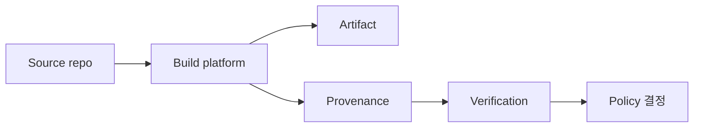
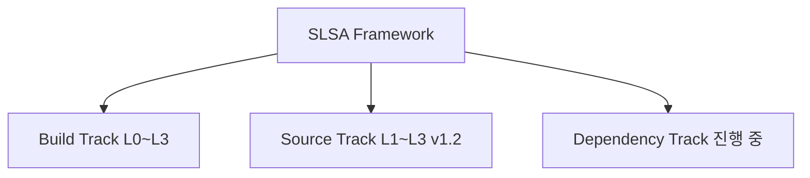
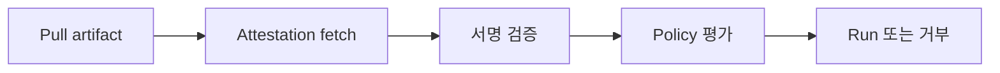
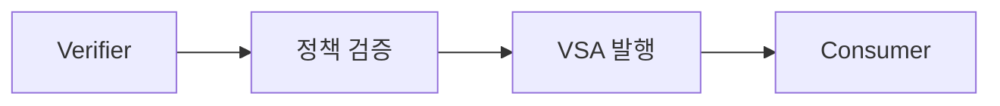

# SLSA (Supply-chain Levels for Software Artifacts)

> **2026년의 자리**: 공급망 보안의 *프레임워크*. 빌드·소스 단계에서
> 어떤 통제를 해야 하는지를 **레벨별 점진 채택 가능한 표준**으로 제시.
> 2023년 v1.0 GA 이후 v1.1(2024)·**v1.2(2025-2026)**로 진화하며 Source
> Track이 본격 추가. EU CRA·EO 14028 등 규제와 *함께 이름이 등장*하며 사실상
> 산업 표준으로.

- **이 글의 자리**: [Sigstore](sigstore.md)·[이미지 서명](../container-security/image-signing.md)·
  [SBOM](../container-security/sbom.md)과 함께 공급망 보안 4종. SLSA = *프로세스
  요건*, Sigstore = *서명 도구*, SBOM = *재료*, 이미지 서명 = *최종 산출물 보호*.
- **선행 지식**: Git·CI/CD, OCI 이미지, in-toto attestation, OIDC.

---

## 1. 한 줄 정의

> **SLSA**: "소프트웨어 공급망의 *각 단계*에 대한 **검증 가능한 통제 요건의
> 단계별 표준**. 각 단계는 점진 채택 가능, 외부 검증자가 *증거 기반*으로
> compliance 판정."



---

## 2. 왜 SLSA인가

### 2.1 해결하려는 위협

| 위협 | 해당 레벨 |
|---|---|
| **빌드 결과를 사람·도구가 변조** | Build L1+ provenance |
| **빌드 플랫폼 자체 침해** (CI server) | Build L3 isolated builder |
| **소스 변조 후 빌드** | Source L1+ |
| **maintainer 사칭 commit** | Source L2+ identity verification |
| **strong review 우회** | Source L3+ two-party review |

> **실 사고 매핑**: SolarWinds(2020) → Build L3 isolation 부재. Codecov(2021)
> → Source 통제 부재. xz-utils backdoor(2024) → Source L2 maintainer identity
> 통제 부재. SLSA는 이런 사고들의 *각 단계 대응책 공식화*.

---

## 3. v1.0 → v1.2 — 어떻게 바뀌었나

| 버전 | 특징 |
|---|---|
| **v0.1 (2022)** | 4-level 단일 track (Build·Source·Common 혼재) |
| **v1.0 (2023-04)** | **Build Track**만 정식 발표 — L0~L3. L4(hermetic build)는 **연기**, Source/Common 요건도 향후로 |
| **v1.0 이후 incremental refinement** (2024) | 명확화·draft 작업 |
| **v1.2 RC1 (2025-06)** | Source Track L1~L4 등장 |
| **v1.2 approved (2025-2026)** | **Source Track 정식 추가** — 4단계, Build L4·Dependency Track 작업 중 |

> **L4가 사라진 게 아님 — *연기***: v1.0 spec은 L4(hermetic build) 도입을
> 명시적으로 future direction에 남김. 현재 *Build Track의 정식 최고 레벨이
> L3*이며, Build L4 도입 계획은 살아있다.

### 3.1 Track 모델



| Track | 레벨 | 무엇을 |
|---|---|---|
| **Build** | L0~L3 (L4 future) | 빌드 플랫폼·프로세스의 신뢰성 |
| **Source** | L1~L4 (v1.2) | 소스 저장소·변경 통제 |
| **Dependency** | (작업 중) | 외부 의존의 신뢰성 |

> **현재(2026-04) 운영 권고**: Build L2~L3 + Source L2를 표준 목표. v1.2 spec
> approved이지만 Source Track 도구·검증 생태계는 아직 성숙 중.

---

## 4. Build Track L0~L3

### 4.1 레벨별 요건

| 레벨 | 요건 | 의미 |
|---|---|---|
| **L0** | 없음 | provenance·통제 0 |
| **L1** | provenance 존재 | "어떻게 빌드됐는가" 기록 — *변조에는 약함* |
| **L2** | hosted build platform + 서명된 provenance | provenance 변조 방어 |
| **L3** | L2 + isolated/hardened builder + provenance signing key 격리 | 빌드 자체 침해 방어 |

> **L4 (hermetic build)**는 v1.0에서 *연기*됐고 v1.2에서도 여전히 future
> direction. 현재 *Build Track 정식 최고 레벨은 L3*.

### 4.2 Build L1 — provenance만

| 요건 | 의미 |
|---|---|
| 빌드 산출물에 *어떤 빌더·어떤 source·어떤 의존*이 있었는지 기록 | 사후 추적 가능 |

**구현**: GitHub Actions·GitLab CI·Tekton Chains 등이 자동 in-toto provenance
attestation 발행. Cosign으로 첨부.

### 4.3 Build L2 — hosted + 서명

| 요건 | 의미 |
|---|---|
| **Hosted build platform** | GitHub-hosted runner·GCP Cloud Build·CircleCI Cloud — 자체 머신 X |
| **서명된 provenance** | 플랫폼이 직접 서명, 사용자가 만들 수 없음 |

> Self-hosted runner는 L2 미달 — 사용자가 빌더를 *통제*하므로 위변조 가능.
> 단, *strict하게 분리된* self-hosted (one-time runner, ephemeral)는 일부
> 인정 가능.

### 4.4 Build L3 — Hardened/Isolated

| 요건 | 의미 |
|---|---|
| **Hosted build platform** | L2의 연속, 자체 머신 X |
| **Isolated builder** | 빌드 간 격리 — 한 빌드가 다른 빌드에 영향 X |
| **Ephemeral environment** | 빌드 후 환경 폐기 |
| **Source-controlled build config** | 빌드 설정 자체가 소스에 commit |
| **Secret material 보호** | 빌드 secret이 산출물·로그에 누출 X |
| **Provenance signing key 격리** | 서명 키는 *control plane만* 보유, build steps 접근 불가 |
| **Non-falsifiable provenance** | 사용자가 위조 불가 — 빌더 자체가 발행 |

> **핵심**: L3와 L2의 차이는 *provenance signing key 격리*. self-hosted runner
> 또는 PR-triggered runner는 사용자가 build step에서 키 접근 가능 → L3 미달.
> slsa-github-generator의 *reusable workflow*가 키 격리를 구현해 L3 충족.

**구현 예**:

| 플랫폼 | L3 적합성 |
|---|---|
| GitHub Actions + slsa-github-generator | L3 reusable workflow로 |
| GCP Cloud Build + slsa-builder | L3 |
| Tekton Chains + slsa-tekton | L3 (자체 운영) |
| GitLab CI | L2~L3 (구성에 따라) |
| Jenkins shared agent | L2 미만 |

---

## 5. Source Track L1~L4 (v1.2 정식 추가)

### 5.1 레벨별

| 레벨 | 이름 | 요건 |
|---|---|---|
| **L1** | Version Controlled | source가 *식별 가능*하고 *수정 추적 가능* (Git 등 VCS) |
| **L2** | History & Provenance | branch history *연속·불변·보관*, **Source Provenance Attestation 발행** (SCS가 각 revision마다) |
| **L3** | Continuous Technical Controls | branch protection·signed commits·자동화 정책 강제 |
| **L4** | Two-Party Review | 작성자 ≠ 리뷰어 — 모든 변경 *2인 이상* 검토 |

### 5.2 핵심 개념 — Source Provenance Attestation

Build Track의 Provenance와 대칭. **SCS (Source Control System) — GitHub·GitLab·
사내 git 호스트 — 가 각 revision에 대해 attestation 발행**:

| 필드 | 의미 |
|---|---|
| revision의 SHA·트리·부모 | 정확한 commit 식별 |
| 변경 author·committer | 누가 만들었는가 |
| 검토자 (PR review) | 누가 승인했는가 |
| branch protection 정책 | 적용된 통제 |
| timestamp | 언제 |

→ Build Provenance + Source Provenance를 함께 검증해 *소스부터 산출물까지의
전체 사슬* 증명.

### 5.3 핵심 통제

| 통제 | 의미 |
|---|---|
| **commit signing** (Sigstore gitsign·GPG·SSH) | 누가 commit했는가 증명 |
| **branch protection** | force push·delete 차단 |
| **PR review 의무** | merge 전 검토 |
| **CODEOWNERS** | 코드 영역별 책임자 |
| **two-party review** (L4) | 작성자 ≠ 리뷰어 ≠ approver 분리 |
| **Continuous controls** (L3) | 자동화로 강제, 우회 차단 |

> **xz-utils 사고 (2024)**: 단일 maintainer가 1년 이상 신뢰를 쌓은 후 백도어
> commit. Source L4 (two-party review)는 *single point of trust*를 분산해야
> 함을 명시.

---

## 6. Provenance — in-toto attestation

### 6.1 SLSA Provenance 구조

```json
{
  "_type": "https://in-toto.io/Statement/v1",
  "subject": [{
    "name": "ghcr.io/acme/app",
    "digest": { "sha256": "abc123..." }
  }],
  "predicateType": "https://slsa.dev/provenance/v1",
  "predicate": {
    "buildDefinition": {
      "buildType": "https://slsa-framework.github.io/github-actions-buildtypes/workflow/v1",
      "externalParameters": {
        "workflow": {
          "ref": "refs/heads/main",
          "repository": "https://github.com/acme/app",
          "path": ".github/workflows/release.yml"
        }
      },
      "internalParameters": { ... },
      "resolvedDependencies": [{
        "uri": "git+https://github.com/acme/app",
        "digest": { "gitCommit": "deadbeef..." }
      }]
    },
    "runDetails": {
      "builder": {
        "id": "https://github.com/actions/runner/github-hosted"
      },
      "metadata": {
        "invocationId": "https://github.com/acme/app/actions/runs/123",
        "startedOn": "2026-04-25T10:00:00Z",
        "finishedOn": "2026-04-25T10:05:00Z"
      }
    }
  }
}
```

| 필드 | 의미 |
|---|---|
| `subject` | 산출물 (이미지·바이너리) — sha256 digest |
| `buildDefinition.buildType` | 빌더 종류 (GH Actions·Cloud Build 등) |
| `externalParameters` | 사용자가 제어한 입력 (workflow path, ref) |
| `resolvedDependencies` | 빌드에 들어간 source·의존 |
| `runDetails.builder.id` | 빌더 식별자 |
| `metadata.invocationId` | 빌드 실행 URL |

### 6.2 발행 도구

| 도구 | 어떤 빌더용 |
|---|---|
| **slsa-github-generator** | GitHub Actions reusable workflow — L3 자동 |
| **slsa-builder-go-poc** | Go binaries L3 |
| **Tekton Chains** | Tekton pipeline 자동 attestation |
| **Cosign attest** | 수동 또는 보조 |
| **buildkit attestation** | container build 자동 |

---

## 7. Verification — 산출물 검증

### 7.1 검증 흐름



### 7.2 정책 예 (Cosign)

```bash
cosign verify-attestation \
  --type slsaprovenance \
  --certificate-identity=https://github.com/acme/app/.github/workflows/release.yml@refs/heads/main \
  --certificate-oidc-issuer=https://token.actions.githubusercontent.com \
  --certificate-github-workflow-repository=acme/app \
  ghcr.io/acme/app:v1.0
```

### 7.3 Verification Summary Attestation (VSA)



VSA는 **검증자가 발행하는 결과 attestation** — "이 산출물은 SLSA Build L3
요건 충족" 같은 *판정 결과*. consumer가 매번 재검증할 필요 없이 신뢰된
verifier의 VSA만 확인.

---

## 8. Builder Trust — 누구를 믿는가

### 8.1 Builder의 두 종류

| 분류 | 예 |
|---|---|
| **Hosted (cloud)** | GitHub Actions runner, GCP Cloud Build, CircleCI Cloud |
| **Self-hosted** | 사내 Jenkins, K8s Tekton |

### 8.2 신뢰 결정 요소

| 요소 | 의미 |
|---|---|
| **Builder identity** | provenance의 `builder.id` — 어느 플랫폼인가 |
| **Builder 보안 평가** | platform 자체의 SLSA 보고 |
| **Runner isolation** | 빌드 간 격리 (one-time vs reused) |
| **Secret 보호** | 환경변수·token 누출 방어 |

> **함정**: GitHub-hosted runner는 *기본 L2*, slsa-github-generator를 쓸 때만
> *L3*. 단순히 "GitHub Actions 쓴다 = L3"는 부정확.

---

## 9. SLSA × 다른 표준

| 표준 | 관계 |
|---|---|
| **NIST SSDF** (SP 800-218) | SSDF의 PO·PS·PW·RV 가 SLSA의 통제와 매핑 |
| **CIS Software Supply Chain Benchmark** | 더 구체적 통제, SLSA 보완 |
| **OpenSSF Scorecard** | OSS 프로젝트 자동 평가 — SLSA 메트릭 일부 |
| **EU CRA** | 직접 SLSA를 명시하진 않으나 통제 매핑 가능 |
| **EO 14028** | SBOM·서명을 요구, SLSA가 그 *프로세스 요건* |

---

## 10. 실무 도입 — 단계별 로드맵

### 10.1 Crawl (Build L1)

| 작업 | 도구 |
|---|---|
| CI에서 build provenance 발행 | slsa-github-generator·Tekton Chains |
| Cosign attest로 OCI registry 첨부 | `cosign attest --type slsaprovenance` |
| consumer가 provenance 확인 가능 | `cosign verify-attestation` |

### 10.2 Walk (Build L2 + Source L1~L2)

| 작업 | 도구 |
|---|---|
| Hosted runner로 이전 (self-hosted 회피) | GitHub Actions·GCP Cloud Build |
| 빌더가 직접 서명 | slsa-github-generator의 OIDC 서명 |
| commit signing 의무 | gitsign·GPG, branch protection |
| CODEOWNERS·PR review | branch protection |

### 10.3 Run (Build L3 + Source L3~L4)

| 작업 | 도구 |
|---|---|
| L3 reusable workflow 의무 | slsa-github-generator v2+ |
| ephemeral runner | GitHub-hosted, no self-hosted |
| Source Provenance Attestation 발행 | SCS 자체 (GitHub·GitLab) 또는 ChainLoop 등 |
| Source L4 two-party review (CODEOWNERS + reviewer ≠ author) | branch protection |
| FIDO2·hardware key로 commit 서명 | YubiKey + gitsign |
| K8s admission policy로 verifyImages + provenance | Kyverno·policy-controller |

### 10.4 K8s Admission 통합

```yaml
# Kyverno: SLSA Build L3 요구
apiVersion: kyverno.io/v2beta1
kind: ClusterPolicy
metadata:
  name: require-slsa-l3
spec:
  validationFailureAction: Enforce
  rules:
  - name: slsa-provenance-l3
    match:
      any:
      - resources: { kinds: [Pod] }
    verifyImages:
    - imageReferences: ["ghcr.io/acme/*"]
      attestations:
      - type: https://slsa.dev/provenance/v1
        attestors:
        - entries:
          - keyless:
              issuer: https://token.actions.githubusercontent.com
              subject: "https://github.com/acme/.+/.github/workflows/release.yml@refs/heads/main"
        conditions:
        - all:
          - key: "{{ buildDefinition.buildType }}"
            operator: Equals
            value: "https://slsa-framework.github.io/github-actions-buildtypes/workflow/v1"
          - key: "{{ runDetails.builder.id }}"
            operator: Equals
            value: "https://github.com/actions/runner/github-hosted"
```

---

## 11. 안티패턴

| 안티패턴 | 결과 | 교정 |
|---|---|---|
| Provenance 발행만, 검증 안 함 | 통제 0 | admission policy로 enforce |
| Self-hosted runner를 L3로 주장 | L2 미만 (사용자 통제) | hosted 또는 strict ephemeral |
| Provenance 사용자 직접 서명 | 위조 가능 | builder OIDC 서명 |
| `builder.id` 검증 안 함 | 어느 플랫폼이 만든지 모름 | builder.id 명시 검증 |
| `buildType` 검증 안 함 | reusable workflow 우회 | buildType + workflow path 함께 |
| Source signing 미설정 | xz-utils 패턴 | gitsign·GPG |
| single-maintainer 권한 광범위 | 침투 후 무방비 | CODEOWNERS + two-party review |
| 의존(transitive) provenance 무시 | 의존 변조 무방비 | resolvedDependencies 검증 |
| `slsa-github-generator` 미사용 | provenance 품질 낮음 | reusable workflow |
| L1 manual attestation을 L3로 위장 | 거짓 |  builder ID·signing 검증 |
| VSA 없이 매번 재검증 | 비용·일관성 | trusted verifier + VSA 사용 |
| Air-gap에서 SLSA 미적용 | 사내 빌드 무방비 | 사내 builder 자체에 L3 적용 |
| audit log 보관 안 함 | 사후 추적 불가 | provenance·VSA 보관 |
| dev/staging은 SLSA 없이 | 우회 경로 | 모든 환경 동일 정책, dev는 audit |
| 빌드 시 secret 로그 노출 | 침해 시 secret 유출 | secret masking, ephemeral env |
| 의존 update를 자동 merge | xz 패턴 가능 | dependency review·delay |
| 외부 OSS 의존 검증 없음 | upstream 침해 그대로 | mirror + 자체 SLSA 적용 |

---

## 12. 운영 체크리스트

**Crawl → Walk → Run**
- [ ] Build L1: provenance 자동 발행 (CI)
- [ ] Build L2: hosted runner + 서명된 provenance
- [ ] Build L3: reusable workflow (slsa-github-generator), ephemeral
- [ ] Source L2: branch history 연속·불변, Source Provenance Attestation 발행
- [ ] Source L3: continuous technical controls (자동화 강제), commit signing
- [ ] Source L4: two-party review (author ≠ reviewer) + FIDO2 hardware key

**검증·정책**
- [ ] Cosign verify-attestation으로 SLSA provenance 검증
- [ ] Kyverno·policy-controller로 admission enforce
- [ ] builder.id·buildType·workflow path 모두 검증
- [ ] VSA 발행자·검증 절차 명문화
- [ ] dev → audit, prod → enforce 단계

**감사·보관**
- [ ] provenance + VSA + 서명 로그 SIEM 보관
- [ ] EU CRA·EO 14028 매핑 문서화
- [ ] 정기 SLSA 자가 평가
- [ ] 외부 OSS 의존도 자체 SLSA 평가 (또는 mirror)

**거버넌스**
- [ ] CODEOWNERS·branch protection
- [ ] 보안팀이 admission policy·SLSA 정책 owner
- [ ] 사고 시 provenance 기반 forensics 절차

---

## 참고 자료

- [SLSA — Specification v1.2](https://slsa.dev/spec/v1.2/) (확인 2026-04-25)
- [SLSA — Build Track Levels](https://slsa.dev/spec/v1.0/levels) (확인 2026-04-25)
- [SLSA — What's new in v1.0](https://slsa.dev/spec/v1.0/whats-new) (확인 2026-04-25)
- [SLSA — Provenance v1](https://slsa.dev/spec/v1.0/provenance) (확인 2026-04-25)
- [SLSA — Verification Summary Attestation](https://slsa.dev/spec/v1.0/verification_summary) (확인 2026-04-25)
- [in-toto Attestation Framework](https://github.com/in-toto/attestation) (확인 2026-04-25)
- [slsa-github-generator](https://github.com/slsa-framework/slsa-github-generator) (확인 2026-04-25)
- [Tekton Chains — SLSA Provenance](https://tekton.dev/docs/chains/slsa-provenance/) (확인 2026-04-25)
- [NIST SSDF (SP 800-218)](https://csrc.nist.gov/Projects/ssdf) (확인 2026-04-25)
- [OpenSSF Scorecard](https://github.com/ossf/scorecard) (확인 2026-04-25)
- [SLSA 도입 사례 — Google Cloud](https://cloud.google.com/blog/products/devops-sre/build-trust-with-slsa-and-cloud-build) (확인 2026-04-25)
