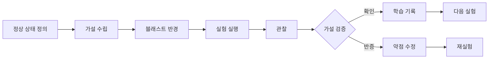
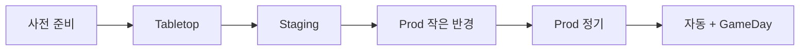

# 카오스 엔지니어링

> **2026년의 자리**: 카오스 엔지니어링은 *프로덕션 시스템에 *통제된 장애*
> 를 주입해 신뢰성을 *측정 가능하게* 검증하는 분과*. Netflix가 2011 Chaos
> Monkey로 시작, 2015 *Principles of Chaos Engineering* 정전 발표.
> 2026년 표준 도구는 **Chaos Mesh**·**LitmusChaos**(둘 다 CNCF Incubating)·
> **Gremlin**(상용). 학계는 *Chaos Engineering 2.0* — AI 기반 자동 가설
> 생성으로 진화 중.
>
> 1~5인 환경에서는 **Tabletop → Staging 실험 → 작은 블래스트 반경 프로덕션
> 실험** 순. 도구보다 *가설·관찰·학습 사이클*이 본질.

- **이 글의 자리**: [Failure Modes](../reliability-design/failure-modes.md)
  와 짝. 신뢰성 *설계*가 후자, *검증*이 이 글. [Runbook](../runbook/runbook-template.md)
  검증의 도구이기도.
- **선행 지식**: SLO, IR 라이프사이클, 분산 시스템 기본.

---

## 1. 한 줄 정의

> **카오스 엔지니어링**: "*분산 시스템에 *통제된 장애를 의도적으로* 주입해,
> 시스템이 격동 환경에서 *기대대로 동작*하는지 가설로 검증하는 분과.*"

### 카오스 엔지니어링의 본질

| 본질 | 의미 |
|---|---|
| **가설 기반** | "X 장애 시 Y 정상 동작"을 *검증* — 무작정 깨기 X |
| **통제** | 블래스트 반경 명시, 즉시 중단 가능 |
| **프로덕션 지향** | 스테이징은 시작점, *프로덕션이 진짜* |
| **학습** | 발견된 약점 → Action Item |
| **신뢰성 *측정 가능*** | "안전하다 믿음" → "안전함을 측정" |

> Gremlin 보고: 프로덕션 카오스 실험을 하는 조직은 *고위험 사고 1/3*.
> 단, *통제 없는* 카오스는 그 자체가 사고.

---

## 2. Principles of Chaos Engineering — 5가지 (2015)

[principlesofchaos.org](https://principlesofchaos.org)의 공식 5원칙.

| # | 원칙 | 의미 |
|:-:|---|---|
| 1 | **Build a Hypothesis around Steady State Behavior** | 정상 상태(SLI 기준)를 측정 가능한 가설로 |
| 2 | **Vary Real-world Events** | 실제 발생 가능한 장애 (서버 다운·네트워크 지연·디스크 풀) |
| 3 | **Run Experiments in Production** | 프로덕션이 *진짜 신뢰성* 검증 환경 |
| 4 | **Automate Experiments to Run Continuously** | 일회성 X, 자동·정기 |
| 5 | **Minimize Blast Radius** | 영향 범위 *최소화* — 즉시 중단 가능 |

### 5번이 가장 중요

| 블래스트 반경 | 의미 |
|---|---|
| **사용자 비율** | 1% → 100% 점진 |
| **지역** | 1 region → 다중 region |
| **시간** | 5분 → 1시간 |
| **자원** | 단일 Pod → 단일 노드 → 노드 그룹 |
| **시나리오** | 단일 의존성 → 다중 |

> "*제어할 수 없으면 카오스가 아니라 사고*."

---

## 3. 카오스 실험 라이프사이클



| 단계 | 산출 | 시간 |
|:-:|---|---|
| 1 | **정상 상태** SLI·메트릭 정의 | 1일 |
| 2 | **가설** "X 시 Y" 한 문장 | 0.5일 |
| 3 | **블래스트 반경** 명시 + 중단 조건 | 0.5일 |
| 4 | **실험** 실행 | 30분 |
| 5 | **관찰** 메트릭·로그·사용자 | 실시간 |
| 6 | **검증** 가설 확인·반증 | 1일 |
| 7 | **학습 또는 수정** | 분기별 |

---

## 4. 가설 작성 — 좋은 가설의 4 속성

### 형식

```
[조건] 이 [시간 동안] 발생하면, [SLI]는 [임계 이내]를 유지하고
[행동]이 자동으로 발생한다.
```

### 예시

| 좋은 가설 | 나쁜 가설 |
|---|---|
| "DB primary 1 노드 다운 5분 시, 결제 SLO 99.9% 유지하고 자동 failover 30초 내" | "DB 죽이면 어떻게 될까?" |
| "결제 게이트웨이 응답 지연 5s 발생 시, Circuit Breaker가 30초 내 작동하고 fallback 응답 반환" | "외부 API 느리면?" |

### 4 속성

| 속성 | 의미 |
|---|---|
| **Specific** | 무엇을·얼마나·어디서 |
| **Measurable** | SLI·메트릭으로 측정 가능 |
| **Predictive** | "예상되는 결과"가 명시 |
| **Falsifiable** | *반증* 가능 — Yes/No 답 가능 |

---

## 5. 실험 종류 — 무엇을 깨뜨릴 것인가

### 인프라 레이어

| 종류 | 시나리오 | 도구 |
|---|---|---|
| **Compute** | Pod·노드 강제 종료 | Chaos Mesh, LitmusChaos, Chaos Monkey |
| **Network** | 지연·패킷 손실·파티션 | Chaos Mesh `NetworkChaos`, Toxiproxy |
| **Storage** | 디스크 풀, 읽기·쓰기 실패 | Chaos Mesh `IOChaos` |
| **DNS** | DNS 응답 지연·실패 | Chaos Mesh `DNSChaos` |
| **Time** | 시간 skew·jump | Chaos Mesh `TimeChaos` |

### 애플리케이션 레이어

| 종류 | 시나리오 |
|---|---|
| **CPU spike** | 의도적 부하 |
| **Memory leak** | 메모리 점유 |
| **Goroutine·Thread leak** | 스레드 폭주 |
| **Deadlock 시뮬레이션** | 잠금 발생 |
| **HTTP 5xx 주입** | 외부 의존성 시뮬레이션 |

### 비즈니스 레이어

| 종류 | 시나리오 |
|---|---|
| **결제 게이트웨이 다운** | 외부 의존 시뮬레이션 |
| **인증 서비스 지연** | 5초·10초 응답 |
| **이벤트 큐 지연** | Kafka lag 증가 |
| **트래픽 급증** | 평소 5배 부하 |

---

## 6. Netflix Simian Army — 카오스 도구의 시조

Netflix가 2011~2014 발표한 카오스 *도구 가족*. 모든 현대 도구의 출발점.

| 멤버 | 역할 |
|---|---|
| **Chaos Monkey** | 인스턴스 무작위 종료 |
| **Latency Monkey** | 네트워크 지연 주입 |
| **Conformity Monkey** | 미준수 인스턴스 식별·종료 |
| **Doctor Monkey** | 헬스체크·자동 격리 |
| **Janitor Monkey** | 미사용 자원 정리 |
| **Security Monkey** | 보안 취약점 스캔 |
| **10-18 Monkey** | i18n 검증 |
| **Chaos Gorilla** | *AZ 전체* 종료 |
| **Chaos Kong** | *Region 전체* 종료 |

> 이후 Netflix 자체는 Simian Army → **FIT (Failure Injection Testing)** →
> **ChAP (Chaos Automation Platform)** 로 진화. 사고 시뮬레이션을
> 코드·메트릭으로 통합한 *Continuous Verification* 모델.

---

## 7. Continuous Verification — 카오스 2.0

Casey Rosenthal·Nora Jones (*Chaos Engineering*, O'Reilly)의 핵심 개념.

> **Continuous Verification**: *카오스 실험을 단발이 아닌 *관측-검증
> 폐루프*로. CI/CD 파이프라인의 *검증 단계*에 카오스 통합.*

| 측면 | 단발 카오스 | Continuous Verification |
|---|---|---|
| 빈도 | 분기 GameDay | 매 배포·매일 |
| 트리거 | 수동 | 자동 (CI·schedule) |
| 결과 | 보고서 | SLO·메트릭 자동 비교 |
| 롤백 | 수동 | 자동 |
| 도구 | Chaos Mesh·Litmus | + Verica·Harness Chaos |

> Netflix ChAP·Verica·Harness Chaos Engineering이 표방하는 카테고리.
> SRE 성숙도 5단계의 정점.

---

## 8. 도구 비교 — Chaos Mesh / LitmusChaos / Gremlin / Chaos Monkey

| 측면 | Chaos Mesh | LitmusChaos | Gremlin | Chaos Monkey |
|---|---|---|---|---|
| **제공자** | PingCAP → CNCF | ChaosNative → CNCF | Gremlin Inc. | Netflix |
| **CNCF** | Incubating | Incubating | — (상용) | — |
| **라이선스** | Apache 2.0 | Apache 2.0 | 상용 | Apache 2.0 |
| **K8s 통합** | 1급 (CRD) | 1급 (CRD) | Agent | Eureka 통합 |
| **GUI** | Dashboard | Litmus Portal | 강력 (SaaS) | — |
| **실험 종류** | 풍부 | 풍부 (ChaosHub) | 가장 풍부 | 인스턴스 종료만 |
| **워크플로** | Workflow CRD | ChaosEngine | Scenario | — |
| **GameDay 지원** | 부분 | 부분 | 강력 | — |
| **권장** | K8s 네이티브 | K8s + 워크플로 | 비-K8s, 엔터프라이즈 | 역사적 |

### Chaos Mesh — K8s 네이티브 표준

```yaml
# 단발 실험
apiVersion: chaos-mesh.org/v1alpha1
kind: PodChaos
metadata:
  name: pod-failure-payment
  namespace: payment
spec:
  action: pod-failure
  mode: one
  duration: 30s
  selector:
    labelSelectors:
      app: payment-api
---
# 정기 실행 — 2.x부터 별도 Schedule CRD 사용
apiVersion: chaos-mesh.org/v1alpha1
kind: Schedule
metadata:
  name: pod-failure-hourly
  namespace: payment
spec:
  schedule: "@every 1h"
  type: PodChaos
  podChaos:
    action: pod-failure
    mode: one
    duration: 30s
    selector:
      labelSelectors:
        app: payment-api
```

> **2.x 마이그레이션**: 1.x의 `spec.scheduler.cron` 필드는 *제거됨*.
> 정기 실행은 별도 `Schedule` CRD로 분리. 1.x 매니페스트는 동작 X.

### LitmusChaos — 워크플로 강점

```yaml
apiVersion: litmuschaos.io/v1alpha1
kind: ChaosEngine
metadata:
  name: payment-pod-delete
spec:
  appinfo:
    appns: payment
    applabel: 'app=payment-api'
  experiments:
    - name: pod-delete
      spec:
        components:
          env:
            - name: TOTAL_CHAOS_DURATION
              value: '30'
            - name: CHAOS_INTERVAL
              value: '10'
            - name: PODS_AFFECTED_PERC
              value: '50'   # 50% pod만 영향
```

### Gremlin — 엔터프라이즈

| 강점 | 약점 |
|---|---|
| GameDay·시나리오 라이브러리 | 상용 (비용) |
| 멀티 클라우드·온프레미스 | 외부 의존 |
| Status·관측성 통합 | OSS 통합 약함 |

### 기타 도구 — 다양한 환경

| 도구 | 환경·특징 |
|---|---|
| **Chaos Toolkit** | OSS, *도구 중립적* — Open Chaos Initiative, Python 기반 |
| **Pumba** | Docker 단독 환경 (K8s 외) |
| **Steadybit** | Reliability Hub 표준, 상용+OSS 혼합 |
| **KubeInvaders** | K8s 게임화 인터페이스 |
| **ChaosKube** | 노드 종료 단일 기능 (단순) |
| **Toxiproxy** | 네트워크 프록시 — 지연·실패 주입 |

### 매니지드 클라우드 카오스

| CSP | 서비스 |
|---|---|
| **AWS** | Fault Injection Service (FIS) — EC2·EKS·ECS·RDS 통합 |
| **Azure** | Azure Chaos Studio |
| **GCP** | (자체 서비스 X — Chaos Mesh·Gremlin 사용 권장) |

---

## 9. GameDay — 조직 단위 카오스 훈련

### 정의

> *분기·반기에 한 번씩, *팀 전체*가 모여 통제된 장애 주입과 IR 절차를
> *동시에* 훈련.* 사고 시뮬레이션 + 카오스 실험.

### 진행 형태

| 시간 | 활동 |
|---|---|
| **30분 전** | Brief — 시나리오 설명, 모든 팀 인지 |
| **T+0** | 실험 주입 |
| **30분~2h** | 실제 사고처럼 IR — IC 호출, 완화, 복구 |
| **30분 후** | HotWash — 즉시 회고 |
| **1주 후** | 포스트모템 + Action Items |

### GameDay vs 일반 실험

| 측면 | 일반 실험 | GameDay |
|---|---|---|
| 빈도 | 정기 자동 | 분기·반기 |
| 참가자 | SRE 일부 | 팀 전체 + IR 역할 |
| 목표 | 시스템 회복력 | + 사람·프로세스 회복력 |
| 스케일 | 작음 | 큼 (전 region 등) |

> AWS GameDay·Google DiRT (Disaster Recovery Testing)이 산업 표준.

---

## 10. 안전장치 — 통제된 카오스의 4가지 안전망

| 안전망 | 의미 |
|---|---|
| **Steady-state 모니터링** | SLI 임계 위반 시 *자동 중단* |
| **Manual Abort** | 어디서든 즉시 중단 명령 |
| **Time-bound** | 최대 N분 후 자동 종료 |
| **Blast radius 상한** | 사용자·노드·region 비율 명시 |

### Chaos Mesh 안전 설정

```yaml
spec:
  duration: 30s          # 시간 제한
  pause: false           # 즉시 중단 가능
  selector:
    labelSelectors:
      app: payment-api
    namespaces:
      - payment-staging  # staging만
```

### Litmus probe — Metrics-based Auto Abort

LitmusChaos의 *probe*는 실험 *중* 메트릭을 검증해 자동 중단.

```yaml
apiVersion: litmuschaos.io/v1alpha1
kind: ChaosEngine
metadata:
  name: payment-pod-delete
spec:
  experiments:
    - name: pod-delete
      spec:
        probe:
          - name: payment-slo-check
            type: promProbe
            mode: Continuous   # 실험 동안 지속 검증
            runProperties:
              probeTimeout: 10
              interval: 5
              stopOnFailure: true   # 실패 시 즉시 abort
            promProbe/inputs:
              endpoint: http://prometheus.monitoring:9090
              query: |
                sum(rate(http_requests_total{job="payment",status=~"5.."}[1m]))
                /
                sum(rate(http_requests_total{job="payment"}[1m]))
              comparator:
                criteria: "<"
                value: "0.01"   # 5xx > 1% 시 abort
```

> SLO 임계 위반 즉시 실험 중단. *카오스가 실제 사고가 되는 것을 방지*.

### "절대 금지" 시나리오

| 금지 | 이유 |
|---|---|
| **DB 마스터 영구 삭제** | 데이터 손실 |
| **다중 region 동시 종료** | 복구 경로 X |
| **회복 메커니즘 자체 종료** | 자가치유 못 함 |
| **금융 결제 *실제* 트래픽** | 비즈니스 실손 |
| **블래스트 반경 명시 X** | 통제 X |

---

## 11. 도입 단계 — 어디서 시작할까



| 단계 | 활동 | 시간 |
|:-:|---|---|
| **0. 사전 준비** | SLO, 모니터링, IR 절차 | 1~3개월 |
| **1. Tabletop** | 회의실 시나리오 토론 | 분기 1회 |
| **2. Staging 실험** | Chaos Mesh staging | 1개월 |
| **3. Prod 작은 반경** | 1% 사용자, 5분 | 1개월 |
| **4. Prod 정기** | 매주 자동 실험 | 분기 |
| **5. GameDay + 자동** | 분기 GameDay + 일별 자동 | 지속 |

> SLO·IR 없이 카오스부터 시작 X. *측정과 대응 능력*이 선행.

---

## 12. 측정 — 카오스 실험의 KPI

| 메트릭 | 의미 | 목표 |
|---|---|---|
| **MTTD** (탐지) | 장애 → 알람 시간 | 자동 SLO 알람 |
| **MTTR** (복구) | 장애 → 정상 시간 | < SLO 임계 |
| **Blast radius 정확도** | 예상 vs 실제 영향 | 차이 < 10% |
| **가설 검증률** | 가설대로 동작 % | 시간 지나며 ↑ |
| **자동 회복률** | 사람 개입 없이 회복 % | ↑ |
| **발견된 약점 수** | 분기 새 약점 | 점차 ↓ (성숙 증거) |
| **Action Items 완료율** | 90일 내 | > 80% |

---

## 13. 안티패턴

| 안티패턴 | 증상 | 처방 |
|---|---|---|
| **카오스부터 시작** | SLO·IR 부재 | 측정·대응 먼저 |
| **가설 없는 실험** | 학습 X | 가설 4 속성 |
| **블래스트 무한** | 사고 발생 | 명시·시간 제한 |
| **중단 불가** | 통제 상실 | Manual abort + 자동 중단 |
| **Staging만** | 진짜 신뢰성 검증 X | 점진 Prod 진출 |
| **일회성** | 성숙 없음 | 자동·정기 |
| **기술팀만** | 사람·프로세스 미검증 | GameDay |
| **DB·결제 직격** | 비즈니스 실손 | "절대 금지" 목록 |

---

## 14. AI 기반 카오스 — 2025-26 트렌드

학계 *Chaos Engineering 2.0*. 산업 도입 진행 중.

| 영역 | AI 활용 |
|---|---|
| **가설 자동 생성** | 토폴로지·과거 사고 → 후보 가설 |
| **블래스트 자동 결정** | 위험 분석 → 안전 반경 |
| **실시간 중단 결정** | 다변량 메트릭 이상 감지 |
| **결과 자동 분석** | 트레이스 비교 → 약점 제안 |
| **Runbook 자동 생성** | 발견된 약점 → 대응 제안 |

> Gremlin·Harness 등에서 알파/베타 단계. 2026 현재 *보조 도구*, 인간 감독
> 필수.

---

## 15. 1~5인 팀의 카오스 — 미니 가이드

### 첫 분기 — Tabletop만

```markdown
# Chaos Tabletop — 2026-Q2

## 시나리오
"DB 마스터가 갑자기 다운되었다."

## 가설
- 자동 failover 30초 내 작동
- 사용자 영향 < 5분
- SLO 99.9% 유지

## 토론 (1시간)
- 누가 알람을 받는가? 어떤 알람?
- 첫 5분 내 무엇을 하는가?
- failover 작동 안 하면? Plan B?
- 데이터 정합성 검증?
- 외부 통보?

## 발견된 약점
1. failover 알람이 페이저로 안 옴 (Slack만)
2. failover 작동 미확인 — 수동 검증 절차 X
3. Runbook 부재

## Action Items
1. failover 알람 페이저 라우팅 (alice, 1주)
2. failover 검증 자동화 (bob, 1개월)
3. DB Runbook 작성 (alice, 1개월)
```

### 둘째 분기 — Staging 실험

| 실험 | 도구 |
|---|---|
| Pod 30초 종료 | `kubectl delete pod` |
| 노드 cordon + drain | 수동 |
| 네트워크 지연 | `tc` 명령 |

### 셋째 분기 — Prod 작은 반경

| 시기 | 실험 |
|---|---|
| 영업시간 | Pod 1개 5분 종료 (replica 3개 중) |
| 트래픽 ↓ | 작은 노드 1개 종료 |

> 도구 도입은 4분기 이후. *수동 실험으로도 충분히 학습*.

---

## 16. 한눈에 보기

| 항목 | 한 줄 |
|---|---|
| **본질** | 가설 기반 통제된 장애 주입 |
| **5원칙** | 정상 상태·실제 이벤트·프로덕션·자동·블래스트 최소 |
| **가설 형식** | "X 시 Y가 Z 이내" — Specific·Measurable·Falsifiable |
| **도구 표준** | Chaos Mesh·LitmusChaos (K8s), Gremlin (상용) |
| **GameDay** | 분기·반기 팀 단위 훈련 |
| **안전장치** | 자동 중단·Manual abort·시간 제한·블래스트 상한 |
| **도입 순서** | SLO·IR → Tabletop → Staging → Prod 작은 반경 → 자동 |
| **금지** | DB 영구 삭제, 다중 region 동시, 가설 없음, 통제 없음 |

---

## 참고 자료

- [Principles of Chaos Engineering](https://principlesofchaos.org/) (확인 2026-04-25)
- [Chaos Mesh](https://chaos-mesh.org/) (확인 2026-04-25)
- [LitmusChaos](https://litmuschaos.io/) (확인 2026-04-25)
- [Gremlin Documentation](https://www.gremlin.com/docs/) (확인 2026-04-25)
- [Netflix — Chaos Monkey (GitHub)](https://github.com/Netflix/chaosmonkey) (확인 2026-04-25)
- [Netflix Tech Blog — Chaos Engineering Upgraded](https://netflixtechblog.com/chaos-engineering-upgraded-878d341f15fa) (확인 2026-04-25)
- [AWS — Well-Architected Reliability (GameDay)](https://docs.aws.amazon.com/wellarchitected/latest/reliability-pillar/welcome.html) (확인 2026-04-25)
- [awesome-chaos-engineering (GitHub)](https://github.com/dastergon/awesome-chaos-engineering) (확인 2026-04-25)
- [arXiv 2505.13654 — Chaos Engineering in the Wild (2025)](https://arxiv.org/abs/2505.13654) (확인 2026-04-25)
