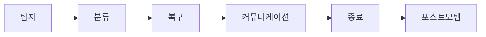
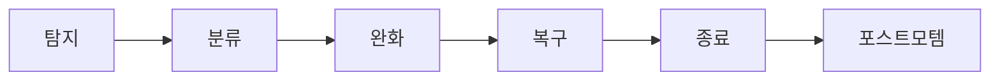
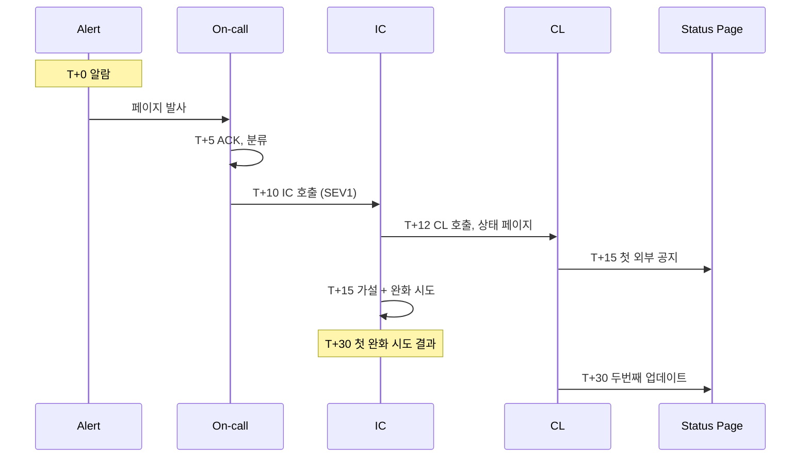

# Incident Response

> **2026년의 자리**: 사고 대응(Incident Response, IR)의 산업 표준은 **ICS**
> (Incident Command System) 기반. FEMA NIMS의 군·소방 모델을 PagerDuty가
> 소프트웨어로 적용해 정전이 됨. 핵심은 *역할 분리*(IC·OL·CL·Scribe·SME)
> 와 *권한 위임*. Google SRE Book Part III의 "Managing Incidents"가 이론
> 토대.
>
> 1~5인 환경에서도 **IC + OL 2역할**부터 시작. 사고 한가운데 *누가 결정
> 하는가*가 명확해야 한다.

- **이 글의 자리**: Dickerson 피라미드 2층. [SLO 알람](../slo/slo-burn-rate.md)이
  울린 *그 다음*. 이 글 다음은 [On-call 로테이션](on-call-rotation.md).
- **선행 지식**: SLO·Burn Rate, 알람 채널.
- **범위**: *운영 IR* (가용성·성능·데이터 정합성). **보안 사고** (침해·
  데이터 유출·랜섬웨어)는 NIST SP 800-61·법적 통보 의무가 결합된 *별도
  트랙* — `security/` 카테고리에서 다룬다.

---

## 1. 한 줄 정의

> **Incident Response**: "*탐지된 문제를 정상으로 되돌리는 협응 작업.*
> 핵심은 사람(역할 분리)과 절차(권한 위임)이지, 도구가 아님."

**원칙적으로 IR은 RCA가 아니다**: IR의 목표는 *복구*, RCA의 목표는 *원인
규명*. 같은 사고에 두 작업이 모두 필요하지만 시점·역할·문서가 분리.



---

## 2. ICS 기반 역할 — 5가지

ICS(Incident Command System)는 1970년대 미국 산불·소방·재난 대응에서
정립. PagerDuty가 SaaS 사고 대응에 적용해 *de facto* 표준.

| 역할 | 약자 | 책임 |
|---|:-:|---|
| **Incident Commander** | IC | *최종 결정권자*. 우선순위 설정, 역할 위임 |
| **Operations Lead** | OL / Deputy | 실제 복구 작업 수행 — 명령 실행 |
| **Customer Liaison** | CL | *외부* 고객 소통, 상태 페이지 갱신 |
| **Internal Liaison** | IL | *내부* 임원·CS·법무 게이트키퍼 |
| **Scribe** | — | 타임라인 기록, 결정·행동 로그 |
| **Subject Matter Expert** | SME | 도메인 전문가 — IC 요청 시 투입 |

> **CL ≠ IL**: PagerDuty 표준은 외부 고객용(CL)과 내부 임원·CS·법무용
> (IL)을 *분리*. SEV1에서 임원 보고 + CS 폭주 + 외부 트윗을 한 사람이
> 처리하면 결정이 묻힌다.

### 핵심 규칙

| 규칙 | 의미 |
|---|---|
| **IC는 직접 작업 X** | IC는 *코디네이터*, OL이 명령 실행 |
| **IC가 최고 결정권자** | 사고 중에는 일상 직급 무관 — IC 권한 최우선 |
| **역할은 *명시적 핸드오프*** | "내가 IC를 받습니다" 명문화 |
| **단일 IC** | 두 명이 동시에 IC X — 혼란 |
| **타임아웃·교대** | 대응 4시간 초과 시 IC 교대 — 피로 관리 |

### 1~5인 팀의 축소판

| 인원 | 권장 역할 분리 |
|---|---|
| 1명 (불가피) | IC + OL 겸직 — 대신 *자주 멈춰서 정리* |
| 2명 | IC + OL 분리 |
| 3명 | + Scribe |
| 4명 | + CL (외부) |
| 5명+ | + IL (내부) + SME on demand |

### Major Incident — 다중 팀·다중 리전

| 사고 규모 | 좌표 모델 |
|---|---|
| 단일 팀 | 단일 IC |
| 다중 팀 (2~3) | 상위 IC 1명 + 팀별 sub-IC, 정기 Bridge Call |
| 전사 / 다중 리전 | "Major Incident" 별도 절차 — 임원 IC, 24/7 회의실 |
| Region failover | sub-IC × 리전 + 글로벌 IC 1명 |

> PagerDuty는 "Major Incident"를 SEV1·2 + 다중 팀 영향으로 정의하며 별도
> 회의실·임원 라인을 *자동* 발동.

---

## 3. SEV (Severity) 등급 — 표준 모델

PagerDuty·GitHub·Microsoft 등이 사용하는 표준 5단계.

| SEV | 의미 | 예시 | 대응 |
|:-:|---|---|---|
| **SEV1** | 전면 중단·매출 직결 | 전체 다운, 결제 불가 | 즉시 IC 호출, 임원 알림, 24/7 |
| **SEV2** | 주요 기능 손상 | 검색 다운, 부분 5xx | IC 호출, 영업시간+ |
| **SEV3** | 부분 영향·우회 가능 | 단일 endpoint 느림 | 영업시간 대응 |
| **SEV4** | 사용자 영향 미미 | 내부 도구 일부 | 다음 영업일 |
| **SEV5** | 영향 없음·관찰만 | 백오피스 경고 | 큐에 등록 |

### SEV 결정 규칙

| 원칙 | 의미 |
|---|---|
| **사고 중에는 SEV 토론 X** | "최악으로 가정" — 사후 다운그레이드 |
| **SEV1·2는 자동 IC** | IC가 *자동* 호출 — 토론 없이 |
| **고객 영향 우선** | 내부 시스템 SEV는 고객 영향에 따라 결정 |
| **SEV별 대응 시간 SLA** | SEV1 5분, SEV2 15분, SEV3 1h |

> **함정**: 엔지니어는 *SEV 낮춰* 부르고 싶어 한다. *최악 가정* 원칙 강제.

### Severity Decision Matrix

| 영향 차원 | 가중치 |
|---|---|
| **사용자 비율** | >50% → SEV1, 10~50% → SEV2, 1~10% → SEV3 |
| **기능 임계도** | 매출·로그인·결제 = 1단계 상향 |
| **데이터 손실 가능성** | 손실 진행 = SEV1 자동 |
| **회복 시간** | >1h 예상 = 1단계 상향 |

> 결정 트리: 데이터 손실 우려 → 자동 SEV1. 50%+ 영향 + 매출 기능 →
> SEV1. 10~50% 영향 → SEV2. 회복 시간이 길수록 1단계 상향.

---

## 4. IR 라이프사이클 — 5단계



| 단계 | 목표 | KPI |
|:-:|---|---|
| **1. 탐지** | 알람·고객 신고로 인지 | MTTD (Mean Time To Detect) |
| **2. 분류** | SEV 결정, IC 호출 | TTA (Time To Acknowledge) |
| **3. 완화** | *원인 X, 영향 차단 우선* (롤백·트래픽 차단) | TTM (Time To Mitigate) |
| **4. 복구** | 정상 복원 | TTR / MTTR |
| **5. 종료·포스트모템** | 학습·재발 방지 | 포스트모템 발행 시간 |

### 완화 vs 복구 — 가장 중요한 구분

| 완화 (Mitigate) | 복구 (Recover) |
|---|---|
| 영향을 *멈춤* | 시스템을 *고침* |
| 빠르게 — 5~15분 | 시간 걸려도 OK |
| 예: 롤백, 트래픽 차단, feature flag off | 예: 코드 수정, 데이터 복구 |
| MTTM의 대상 | MTTR의 대상 |

> **원칙**: *완화 먼저, 복구는 나중*. 사용자에게 "다시 동작"이 *원인 분석*
> 보다 우선. 디버깅에 시간 쓰지 말고 *되돌릴 수 있는 모든 것을 되돌려라*.

### "Just Roll Back" 룰

배포 직후 알람 → *원인 분석 X, 즉시 롤백*. Google 내부 룰이며 산업 표준.

### IC Check-in Cadence

PagerDuty IC Training의 핵심 규칙: IC는 **15~30분마다 정기 체크인**으로
사고 진행을 정리.

| 시점 | 확인 사항 |
|---|---|
| **15분 단위** (SEV1) / **30분 단위** (SEV2) | 현재 가설, 시도 결과, 다음 액션 |
| 체크인 형식 | "지금까지 무엇을 알고/시도했고, 다음 무엇을 할 것인가" |
| 진행 없을 때 | SEV 재평가, 추가 SME 호출, 백업 가설 |
| **4시간 한계** | IC 교대 — 피로 관리 |

### Paging Escalation Policy

On-call이 ACK 안 할 때 자동 escalation.

| 시간 | 행동 |
|---|---|
| **T+0** | Primary on-call 페이지 |
| **T+5분 미응답** | Secondary on-call |
| **T+10분 미응답** | 매니저 |
| **T+15분 미응답** | SRE Lead + 부서장 |
| **모두 미응답** | 사전 지정 emergency contact (외부 위탁 등) |

> 미응답 자체가 *이중 사고*. 페이저 정책 점검 트리거.

---

## 5. War Room (사고 채널) 운영

### 채널 구성

| 채널 | 목적 | 누가 |
|---|---|---|
| **#incident-NNNN** (전용) | 작업 채널 — 짧은 메시지 | IC·OL·SME |
| **#incident-status-NNNN** | 외부 통보 — 상태만 | CL·관계자 |
| **#general / #engineering** | 일반 — *사고 토론 금지* | — |

### War Room 행동 규칙

| 규칙 | 의미 |
|---|---|
| **모든 결정은 채널에** | 구두 X — 기록되어야 함 |
| **타임스탬프 명시** | 모든 행동에 시간 |
| **Yes/No 명시** | "곧" 같은 모호 X |
| **외부 잡담 금지** | 작업 채널은 작업만 |
| **Status 채널 분리** | 상태 보고는 별도 채널 |
| **IC가 먼저 발화** | "지금 무엇을 알고 있는가" |
| **Two-pizza rule** | War Room 활성 인원 8명 이내 |
| **Quiet rule** | 발언 권한은 IC가 부여 — *발언권 통제* |
| **사고 중 RCA·5 Whys 금지** | 원인은 포스트모템에서, 지금은 *완화* |

### Tools

| 도구 | 용도 |
|---|---|
| **PagerDuty / OpsGenie** | 알람·On-call 로테이션·페이저 |
| **Slack / Teams** | War Room 채널 |
| **incident.io / FireHydrant** | 사고 자동화 (채널 생성·역할 할당·타임라인) |
| **Statuspage / Atlassian Statuspage** | 외부 상태 페이지 |
| **Zoom·Meet** | 음성 — *동기 의사결정 시* |

> **음성 vs 채팅**: SEV1·2는 음성 + 채팅 병행. 음성에서 결정 → 채팅에
> 즉시 기록.

---

## 6. 외부 커뮤니케이션 — Communications Lead

### 누구에게 무엇을

| 청중 | 채널 | 빈도 (SEV1) | 빈도 (SEV2) |
|---|---|---|---|
| **외부 고객** | Status Page, Twitter, 이메일 | 15분 | 30분 |
| **내부 임원** | 별도 Slack 채널, 이메일 | 15분 | 30분 |
| **내부 전사** | 회사 Slack #announcements | 30분 | 1시간 |
| **법무·CS** | 즉시 — 법적·고객 대응 준비 | 사고 발생 즉시 | 영업시간 시작 |

### 외부 메시지 5요소

```
1. 무슨 일이 일어났나 (영향만, 원인 X)
2. 영향 범위 (어떤 사용자·기능)
3. 우리가 무엇을 하고 있나
4. 다음 업데이트 시각
5. 사용자가 할 수 있는 것 (있다면)
```

### 함정 — 하지 말 것

| 금지 | 이유 |
|---|---|
| **원인 추측 발표** | 사후 정정이면 신뢰 추락 |
| **"곧 복구"** | 시각 미명시 — 약속 위반 시 큰 타격 |
| **개인 SNS 발표** | 통제 불가 |
| **"우리 잘못 X"** | 사용자 입장에서 의미 없음 |

---

## 7. 표준 IR 플레이북 — SEV1 30분



| 시각 | 행동 | 책임 |
|---|---|---|
| T+0 | 알람 | 시스템 |
| T+5 | ACK + 분류 | On-call |
| T+10 | IC 호출 (SEV1·2) | On-call → IC |
| T+12 | CL 호출, War Room 생성 | IC |
| T+15 | 첫 상태 페이지 공지, 완화 시도 시작 | CL, OL |
| T+30 | 두 번째 공지, 완화 결과 검증 | IC, CL |
| T+60 | 복구 또는 SEV 재평가 | IC |
| T+24h | 사후 검토 회의 | IC |
| T+72h | 포스트모템 초안 | IC |

---

## 8. 사고 학습 — 재발 방지

| 산출물 | 시점 | 책임 |
|---|---|---|
| **타임라인** (사고 중 작성) | 실시간 | Scribe |
| **HotWash** (사고 직후 30분 회의) | T+1h | IC |
| **포스트모템 초안** | T+72h | IC + Scribe |
| **Action Items 추적** | T+1주 ~ | 팀 리드 |
| **재발 방지 검증** | T+30일 | SRE Lead |

> 자세한 내용: [포스트모템](../postmortem/postmortem.md), [RCA 방법론](../postmortem/rca-methods.md).

---

## 9. 안티패턴 — 사고 대응 실패

| 안티패턴 | 증상 | 처방 |
|---|---|---|
| **IC 부재** | 결정 없음, 다중 명령 충돌 | IC 호출 자동화 (SEV1·2) |
| **IC가 직접 작업** | 코디네이션 손실 | IC는 *지휘만*, OL이 작업 |
| **원인 분석부터** | 영향 지속 | *완화 우선* (Just Roll Back) |
| **SEV 다운그레이드 토론** | 시간 낭비 | 사후 결정 |
| **상태 페이지 미갱신** | 고객 신뢰 손상 | CL 분리, 30분 주기 |
| **War Room 잡담** | 결정 묻힘 | 작업 채널·상태 채널 분리 |
| **사고 후 침묵** | 학습 없음 | 포스트모템 강제 |
| **같은 사고 재발** | Action Item 미실행 | 추적·검증 |

---

## 10. 1~5인 팀의 IR — 미니 플레이북

### 단일 페이지 IR Runbook

```markdown
# Incident Response Runbook v1

## 1. 페이지 받았을 때 (5분 이내)
- [ ] ACK
- [ ] #incidents 채널에 한 줄 공지
- [ ] SEV 가정 (의심 시 SEV2 이상)
- [ ] 5분 내 완화 가능? Y → 시도, N → IC 호출

## 2. SEV1·2 (10분 이내)
- [ ] IC 호출 — Slack `/page IC`
- [ ] War Room 채널 생성: `#incident-YYYYMMDD-NNN`
- [ ] CL 지명 (또는 IC 겸직)
- [ ] Status page 첫 공지

## 3. 완화 우선 (15~30분)
- [ ] 최근 배포? → 즉시 롤백
- [ ] feature flag 끄기
- [ ] 트래픽 차단 (LB·CDN 룰)
- [ ] 의존성 차단 (circuit breaker)

## 4. 복구 시도
- [ ] 가설 1개씩 — 동시 변경 X
- [ ] 모든 시도 채널에 기록

## 5. 종료
- [ ] Status page 클리어
- [ ] HotWash 30분
- [ ] 포스트모템 작성 (T+72h)
```

---

## 11. 사고 시뮬레이션 (DiRT / GameDay)

> Google **Disaster Recovery Testing (DiRT)**, AWS **GameDay**, Netflix
> **Chaos Engineering**의 IR 측면. 정기 시뮬레이션이 *진짜 사고*에서
> 차이를 만든다.

| 종류 | 빈도 | 형태 |
|---|---|---|
| **Tabletop** (탁상) | 분기 1회 | 시나리오 토론 — 30분 |
| **Tabletop+** (시뮬레이션) | 분기 1회 | 가짜 알람 → 모의 대응 |
| **Live Drill** | 반기 1회 | *진짜* 시스템에 작은 장애 주입 |
| **Full Chaos** | 연 1회 | DR(재해 복구) 전체 시나리오 |

> 자세한 내용: [카오스 엔지니어링](../chaos/chaos-engineering.md).

---

## 12. IR 메트릭 — 무엇을 측정할까

| 메트릭 | 의미 | 목표 |
|---|---|---|
| **MTTD** | 사고 발생 → 탐지 | < 5분 (SLO 알람) |
| **TTA** | 탐지 → ACK | < 5분 |
| **MTTM** | 탐지 → 완화 | SEV1 < 30분 |
| **MTTR** | 사고 발생 → 복구 | SEV1 < 60분 |
| **MTBF** | 평균 사고 간 간격 | 우상향 |
| **포스트모템 발행률** | 사고 중 PM 작성 % | 100% (SEV1·2) |
| **Action Item 완료율** | PM 액션 90일 내 완료 | > 80% |

> DORA의 *Failed Deployment Recovery Time*과 직결. 운영 성숙도 평가.

---

## 13. 한눈에 보기

| 항목 | 한 줄 |
|---|---|
| **표준 모델** | ICS 기반 — IC·OL·CL·Scribe·SME |
| **IC의 본질** | 결정·위임. 직접 작업 X |
| **SEV** | 1·2 = 즉시 IC, 사고 중 다운그레이드 X |
| **완화 vs 복구** | 완화 먼저 (롤백·차단), 복구는 나중 |
| **War Room** | 작업 채널 + 상태 채널 분리 |
| **상태 페이지** | 30분 주기, 원인 추측 X |
| **시작 키트** | 단일 페이지 Runbook + IC 호출 자동화 |
| **시뮬레이션** | 분기 Tabletop, 반기 Live Drill |

---

## 참고 자료

- [PagerDuty Incident Response Documentation](https://response.pagerduty.com/) (확인 2026-04-25)
- [PagerDuty — Incident Commander Training](https://response.pagerduty.com/training/incident_commander/) (확인 2026-04-25)
- [PagerDuty — Severity Levels](https://response.pagerduty.com/before/severity_levels/) (확인 2026-04-25)
- [Google SRE Book — Managing Incidents](https://sre.google/sre-book/managing-incidents/) (확인 2026-04-25)
- [Google SRE Book — Effective Troubleshooting](https://sre.google/sre-book/effective-troubleshooting/) (확인 2026-04-25)
- [FEMA NIMS — Incident Command System](https://www.fema.gov/emergency-managers/nims/components) (확인 2026-04-25)
- [SEV1 — The Art of Incident Command](https://sev1.org/) (확인 2026-04-25)
