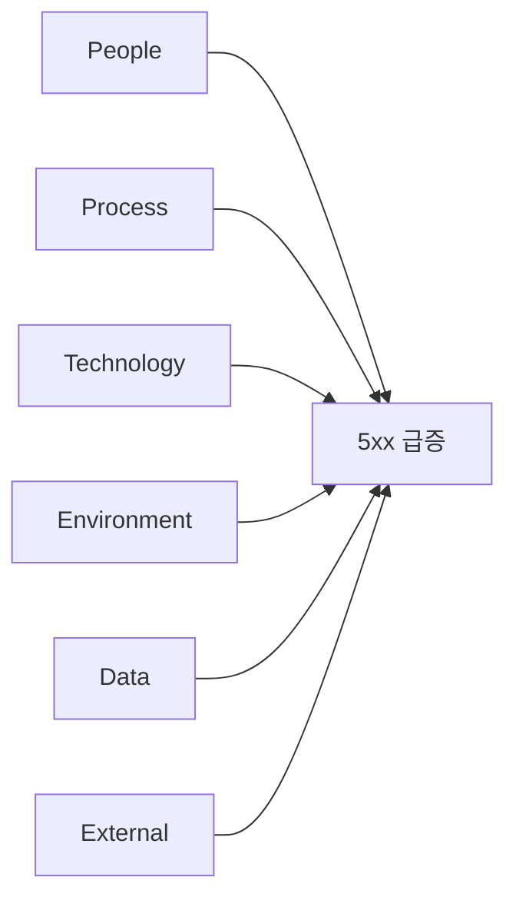
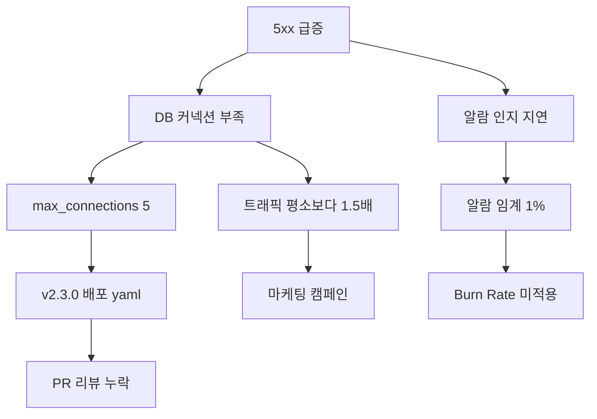

# RCA 방법론

> **2026년의 자리**: RCA(Root Cause Analysis)는 사고에서 *근본 원인*을
> 찾는 방법론. 산업 표준은 **5 Whys**, **Fishbone**(Ishikawa), **Causal
> Graph (Causal Tree)**, **FMEA**, **8D**의 5가지. 단일 *Root Cause*는
> 신화 — 분산 시스템에는 *Contributing Factors*가 다수. Allspaw·Dekker의
> *Second Stories*가 SRE RCA의 이론적 출발점.
>
> 1~5인 환경에서는 5 Whys + Timeline + Fishbone 3가지면 충분. 그러나
> *방법론보다 Blameless 자세*가 본질.

- **이 글의 자리**: [포스트모템](postmortem.md)이 *학습 문서*라면, 이 글은
  그 문서의 Root Cause·Trigger 섹션을 *어떻게 분석할 것인가*.
- **선행 지식**: 포스트모템 9섹션 구조, Just Culture.

---

## 1. 한 줄 정의

> **RCA**: "사고의 *근본 원인을 체계적으로 찾는 방법론*. 표면 증상에
> 머물지 않고 *시스템·프로세스 약점*에 도달."

### "근본 원인"의 함정

| 함정 | 의미 |
|---|---|
| **단일 Root Cause 신화** | 분산 시스템에는 *원인 하나*가 없음 |
| **사람을 Root Cause로** | "Bob이 잘못함" — Blameless 위반, 학습 X |
| **5 Whys로 멈춤** | 표면 분석 — 깊이가 5보다 얕거나 한 방향만 |
| **분석 자체가 목적** | RCA는 *Action* 도출 도구 — 보고서 작성이 끝 X |

> *"근본 원인은 발견되는 것이 아니라 구성되는 것."* — John Allspaw
> *Each necessary, but only jointly sufficient* (2015), Erik Hollnagel·
> Sidney Dekker의 시스템 안전공학 사상에서 유래. 분석자가 *어디서 멈출지*
> 가 결정한다.

---

## 2. RCA 방법론 — 비교

### 실무 표준 (5종) + 보조 (Timeline)

| 방법 | 형태 | 적합 상황 | 한계 |
|---|---|---|---|
| **5 Whys** | 선형 질문 | 단순·명확 인과 | 단일 라인, 분석자 편향 |
| **Fishbone** | 카테고리별 분기 | 복잡·다요인 | 카테고리 임의성 |
| **Causal Graph / Apollo RCA** | 인과 그래프 | 분산 시스템 | 시간·전문성 |
| **FMEA** | 사전 위험 분석 | *예방* 단계 | 사후엔 부적합 |
| **Pre-mortem** | 역방향 가정 | *예방* 단계 | 추측 의존 |
| **8D** | 8단계 프로세스 | 제조·반복 사고 | SRE에는 무거움 |
| **Timeline 분석** | 시간 축 | 모든 사고에 보조 | 단독으론 부족 |

### 시스템 안전공학 계열 (학술 정전)

| 방법 | 출처 | 의미 |
|---|---|---|
| **STAMP / STPA** | Nancy Leveson (MIT) | 시스템 이론 기반 *통제 구조* 분석 |
| **AcciMap** | Jens Rasmussen | 사회·조직·운영 다층 인과도 |
| **CAST** | Leveson | STAMP 사후 적용 — 사고 분석용 |

> 분산 시스템 SRE에서 *Allspaw·Dekker 진영*이 권장. 학술적 깊이가 필요한
> 대형 사고·아키텍처 검토 시 도입.

---

## 3. 5 Whys — 선형 심층 질문

### 형태

```
문제: payment-api 5xx 35%
Why 1: 왜? → DB 커넥션이 부족했다
Why 2: 왜? → max_connections 설정이 50 → 5로 변경됨
Why 3: 왜? → v2.3.0 배포 시 yaml 오타
Why 4: 왜? → PR 리뷰가 인프라 설정 변경을 놓침
Why 5: 왜? → 인프라 설정 PR과 기능 PR이 합쳐져 검토 영역 분산
→ Root: 인프라 설정 변경에 별도 검토 게이트 부재
```

### 강점·약점

| 강점 | 약점 |
|---|---|
| 단순, 누구나 진행 | 단일 라인 — 다른 원인 누락 |
| 빠름 (15~30분) | 분석자 편향에 의존 |
| 토론·합의 도구 | "왜"가 명확하지 않으면 막힘 |
| 1~5인 팀 시작에 적합 | 깊이 5에 도달 못 하고 사람 비난으로 흐름 |

### 5 Whys 함정

| 함정 | 처방 |
|---|---|
| **사람을 Root로** | "왜"를 *시스템*으로 — "왜 그런 검토가 가능했나" |
| **단일 라인 고집** | 동시 다른 Why 라인 병행 (분기) |
| **5보다 얕게 멈춤** | "*왜 그것이 가능했나*"를 한 번 더 |
| **답이 *부재*로 끝** | "X가 없었다" → "왜 X가 없는가"로 |

### 변형: 3 Whys / 7 Whys

| 변형 | 의미 |
|---|---|
| **3 Whys** | 가벼운 사고 (SEV3+) |
| **5 Whys** | 표준 (SEV1·2) |
| **7+ Whys** | 복잡 사고 — 보통 다른 방법론 병행 |

---

## 4. Fishbone (Ishikawa) — 카테고리별 분기

### 형태



### SRE 표준 6 카테고리 (M의 변형)

| 카테고리 | 의미 | 예시 |
|---|---|---|
| **People** | 인적 요인 | 온보딩 부족, 지식 단일점 |
| **Process** | 프로세스·정책 | PR 리뷰 게이트 부재 |
| **Technology** | 코드·도구 | 설정 검증 자동화 X |
| **Environment** | 인프라·런타임 | DB 커넥션 풀 한계 |
| **Data** | 데이터 품질 | 트래픽 패턴 변화 |
| **External** | 외부 의존성 | 외부 API 응답 변화 |

> 제조업 표준 6M (Man·Machine·Material·Method·Measurement·Mother
> nature)을 SRE 맥락에 적용.

### 강점·약점

| 강점 | 약점 |
|---|---|
| 다요인 동시 시각화 | 카테고리 임의성 |
| 큰 그림 파악 | 깊이가 얕음 (5 Whys 병행 필요) |
| 회의 토론 도구 | 만들기에 시간 |

### 5 Whys + Fishbone 결합

> Fishbone으로 카테고리별 *분기 식별* → 각 분기에 5 Whys로 *심층*. 산업
> 표준 조합. *깊이 + 너비* 동시 확보.

---

## 5. Causal Graph (Causal Tree) — 분산 시스템에 적합

### 형태



각 노드는 *원인*, 화살표는 *인과 관계*. 한 사고는 *여러 원인의 교차*임을
시각화.

### 강점·약점

| 강점 | 약점 |
|---|---|
| 분산 시스템 *진실* 반영 | 작성 시간 (1~3시간) |
| 다중 Root 명확 | 시각화 도구 필요 |
| Action Item 우선순위 명확 | 전문가 진행 필요 |

> Allspaw·Dekker가 *권장*. 단일 Root Cause 신화에서 벗어나는 가장 정확한
> 도구.

### 작성 절차

| 단계 | 내용 |
|:-:|---|
| 1 | 사고 현상을 *루트 노드*로 |
| 2 | 직접 원인을 *자식 노드*로 (1단계) |
| 3 | 각 자식에 더 깊이 — Why 반복 |
| 4 | *분기*가 만나는 지점 = 시스템 약점 |
| 5 | 각 노드에 Action Item 가능한지 표시 |

---

## 6. Timeline 분석 — 모든 RCA의 보조

### 사고 타임라인 6요소

| 요소 | 의미 |
|---|---|
| **시각** | 절대 시간 (UTC + 로컬) |
| **이벤트** | 무엇이 일어났는가 |
| **소스** | 알람·로그·사람 |
| **상태 변화** | 시스템·서비스 상태 |
| **사람 행동** | 누가 무엇을 했는가 (Blameless 표현) |
| **결정** | IC 결정·역할 변경 |

### 표준 형식

```markdown
| 시각 (KST) | 이벤트 | 소스 | 영향 |
|---|---|---|---|
| 14:21:03 | v2.3.0 카나리 5% 시작 | ArgoCD | — |
| 14:23:11 | 5xx 35% 도달 | Prometheus alert | 사용자 영향 시작 |
| 14:23:12 | Burn Rate 14.4× 알람 | Alertmanager | — |
| 14:25:01 | On-call ACK | PagerDuty | — |
| 14:30:22 | IC 호출, 카나리 자동 롤백 시작 | IC | — |
| 14:33:08 | 롤백 완료 | ArgoCD | 사용자 영향 종료 |
```

### Timeline에서 도출하는 메트릭

| 메트릭 | 계산 |
|---|---|
| **MTTD** | 시스템 영향 시작 → 알람 발사 |
| **TTA** | 알람 → ACK |
| **MTTM** | 영향 시작 → 완화 |
| **MTTR** | 영향 시작 → 완전 복구 |
| **TTI** | IC 호출 → 첫 완화 시도 |

> Timeline은 *모든* RCA에 첨부. Causal Graph·5 Whys·Fishbone와 *병행*.

---

## 7. FMEA — 사후가 아닌 *예방* RCA

**Failure Mode and Effects Analysis** — 사고 *전*에 미리 위험을 분석.

### 형식

| 컴포넌트 | 실패 모드 | 영향 (S) | 발생 (O) | 탐지 (D) | RPN | Action |
|---|---|:-:|:-:|:-:|---:|---|
| DB 커넥션 풀 | 풀 고갈 | 9 | 5 | 7 | 315 | 자동 alert + autoscaling |
| 캐시 | 노드 다운 | 7 | 3 | 4 | 84 | redundant 노드 |
| 외부 API | 응답 지연 | 6 | 6 | 5 | 180 | circuit breaker + fallback |

### 점수

| 축 | 1 | 10 |
|---|---|---|
| **Severity (S)** | 영향 미미 | 전면 다운 |
| **Occurrence (O)** | 거의 없음 | 자주 |
| **Detectability (D)** | 즉시 인지 | 인지 못함 |

**RPN (Risk Priority Number) = S × O × D**. 높은 RPN부터 Action.

### SRE 적용

| 시점 | 활용 |
|---|---|
| **신규 서비스 설계** | 의존성·실패 모드 분석 |
| **분기 카오스 계획** | 어디를 *주입*할지 우선순위 |
| **사고 후 RCA** | "*같은 시스템에 또 다른 실패 모드 있나*" |

> **AIAG-VDA 2019 표준 변화**: 자동차 산업 표준은 RPN을 폐기하고 **Action
> Priority (AP) 매트릭스** (S·O·D 조합 → High/Medium/Low) 로 전환. SRE
> 적용 시 RPN 계산은 *간편 시작용*, 성숙한 팀은 AP 매트릭스 권장.

> FMEA는 *Reliability Design*과 직결 → [Failure Modes](../reliability-design/failure-modes.md).

---

## 8. Pre-mortem — 역방향 RCA

Daniel Kahneman·Gary Klein이 정립한 *예방 RCA*. **사고가 *이미 났다*고
가정하고 원인을 브레인스토밍.**

### 절차

| 단계 | 활동 |
|:-:|---|
| 1 | 시나리오 설정: *"6개월 후 우리 서비스가 SEV1 사고."* |
| 2 | 5분 개인 작성: *"왜 그렇게 됐을까?"* — 자유 작성 |
| 3 | 라운드로빈 공유 — 한 사람 한 가지씩 |
| 4 | 빈도·영향으로 우선순위 |
| 5 | 상위 3~5개를 사전 대응 Action |

### FMEA·Pre-mortem 비교

| 측면 | FMEA | Pre-mortem |
|---|---|---|
| 형태 | 정량적 (S·O·D 점수) | 정성적 (브레인스토밍) |
| 시간 | 1~3시간 | 30~60분 |
| 도구 | 표 | 화이트보드·Slack |
| 강점 | 체계적 우선순위 | *상상하지 못한* 시나리오 발굴 |
| 약점 | 알려진 위험에 한정 | 추측 의존 |
| 1~5인 팀 | 분기 1회 무겁다 | **월 1회 가벼움** |

> Pre-mortem은 1~5인 팀에 *가장 빠르게 도입* 가능한 예방 RCA.

---

## 9. 8D Method — 8단계 (참조)

자동차 산업(Ford 표준). SRE에는 무거우나 *반복 사고*에 적용 가능.

| 단계 | 내용 |
|:-:|---|
| D1 | 팀 구성 |
| D2 | 문제 기술 |
| D3 | 임시 봉쇄 (Containment) |
| D4 | Root Cause 분석 (5 Whys·Fishbone) |
| D5 | 영구 시정 (Permanent Corrective Action) |
| D6 | 시정 시행·검증 |
| D7 | 재발 방지 (Preventive) |
| D8 | 팀 인정·종료 |

> Containment(D3)와 Permanent(D5)의 분리가 강점. SRE의 *완화 vs 복구*와
> 정합.

---

## 10. RCA 도구·프레임워크

| 도구 | 형태 |
|---|---|
| **종이·화이트보드** | 가장 빠름 — 작은 사고 |
| **Miro / FigJam** | Fishbone·Causal Graph 협업 |
| **graphviz / Mermaid** | Causal Graph 코드로 |
| **Notion / Confluence** | 5 Whys 표 |
| **incident.io / FireHydrant** | 자동 타임라인 + RCA 템플릿 |
| **EasyRCA / ThinkReliability** | 전문 도구 |

---

## 11. RCA 진행 가이드 — 60분 워크숍

### 어젠다

| 시간 | 활동 |
|---|---|
| 5분 | 사고 요약 (포스트모템 1~7섹션) |
| 10분 | Timeline 검증·보완 |
| 15분 | Fishbone — 6 카테고리 브레인스토밍 |
| 15분 | 5 Whys — 주요 분기별 |
| 10분 | Causal Graph 또는 우선순위 |
| 5분 | Action Items 합의 |

### 진행자 (Facilitator) 역할

| 역할 | 행동 |
|---|---|
| **Blameless 강제** | 사람 지목 발언 즉시 *시스템*으로 전환 |
| **시간 관리** | 각 단계 시간 엄수 |
| **다양한 발언 유도** | 침묵하는 사람에게 질문 |
| **정리·합의** | 매 단계 끝에 *합의된 것*을 명시 |

> *외부* facilitator가 효과적. 같은 팀 내 정치 회피.

---

## 12. RCA 안티패턴

| 안티패턴 | 증상 | 처방 |
|---|---|---|
| **단일 Root Cause** | "Root Cause는 X" — 다요인 누락 | Causal Graph로 다중 노드 |
| **사람을 Root로** | Bob 잘못 — 학습 X | "*시스템이 어떻게 그것을 가능케 했나*" |
| **5 Whys로 그침** | 표면 분석 | Fishbone + 5 Whys 결합 |
| **분석만, Action X** | 보고서 작성으로 끝 | Action Item 4속성, 90일 추적 |
| **외부 탓** | "AWS 장애" — 자기 시스템 약점 누락 | "왜 우리는 *대비* 못 했나" |
| **첫 번째 해결책** | 가장 쉬운 Action | Risk × Impact 우선순위 |
| **지나친 깊이** | "왜"를 무한 — 의미 상실 | "*행동 가능한 수준*"에서 멈춤 |
| **재발 후 발견** | 같은 RCA 결과 반복 | Action Item 완료 검증 |

---

## 13. 1~5인 팀의 RCA — 미니 가이드

### 30분 RCA (SEV3·SEV4)

| 시간 | 활동 |
|---|---|
| 5분 | Timeline |
| 15분 | 5 Whys (단일 라인) |
| 5분 | Action Items |
| 5분 | 정리 |

### 60분 RCA (SEV1·SEV2)

| 시간 | 활동 |
|---|---|
| 5분 | Timeline 보완 |
| 15분 | Fishbone (4 카테고리: People·Process·Tech·External) |
| 20분 | 각 카테고리에 5 Whys |
| 10분 | Action Items 우선순위 |
| 10분 | "Where We Got Lucky" |

> SEV3·4는 5 Whys만, SEV1·2는 Fishbone + 5 Whys. Causal Graph는 분기
> 회고에서.

---

## 14. RCA 결과의 품질 평가 — 5가지 질문

| # | 질문 |
|:-:|---|
| 1 | Action Items가 *재발 방지* 가능한가? |
| 2 | *시스템·프로세스* 변경인가? (사람 변경 X) |
| 3 | 90일 내 완료 가능한가? |
| 4 | 작성자 외 *제3자*가 봐도 이해되는가? |
| 5 | 다른 *유사* 사고에 적용 가능한가? |

5개 모두 Yes면 *좋은 RCA*. 하나라도 No면 *재작업*.

---

## 15. 한눈에 보기

| 항목 | 한 줄 |
|---|---|
| **RCA의 본질** | 시스템·프로세스 약점 도달 — 사람 X |
| **단일 Root 신화** | 분산 시스템엔 다중 Contributing Factor |
| **표준 조합** | Timeline + Fishbone + 5 Whys |
| **분산 시스템 특화** | Causal Graph (Allspaw 권장) |
| **예방 RCA** | FMEA — 카오스 계획·신규 서비스 설계 |
| **SEV1·2** | 60분 워크숍, 외부 facilitator |
| **품질 5질문** | 재발 방지·시스템 변경·90일·이해·일반화 |
| **금지** | 사람 비난, Action 없는 분석, 첫 해결책 |

---

## 참고 자료

- [Google SRE Book — Postmortem Culture](https://sre.google/sre-book/postmortem-culture/) (확인 2026-04-25)
- [Google SRE Workbook — Postmortem Analysis](https://sre.google/workbook/postmortem-analysis/) (확인 2026-04-25)
- [Allspaw — Blameless PostMortems and a Just Culture (Etsy Code as Craft)](https://www.etsy.com/codeascraft/blameless-postmortems) (확인 2026-04-25)
- [Sidney Dekker — Field Guide to Understanding Human Error](https://sidneydekker.com/) (확인 2026-04-25)
- [PRIZ Guru — RCA Guide (5 Whys, Fishbone, 8D, FMEA)](https://www.priz.guru/root-cause-analysis-guide/) (확인 2026-04-25)
- [CMS — Fishbone Tool for RCA (Healthcare 표준)](https://www.cms.gov/medicare/provider-enrollment-and-certification/qapi/downloads/fishbonerevised.pdf) (확인 2026-04-25)
- [Ford 8D Methodology Reference](https://www.iqasystem.com/news/8d-report/) (확인 2026-04-25)
- [Allspaw — Each Necessary, But Only Jointly Sufficient (2015)](http://www.kitchensoap.com/2012/02/10/each-necessary-but-only-jointly-sufficient/) (확인 2026-04-25)
- [Nancy Leveson — STAMP/STPA (MIT)](http://psas.scripts.mit.edu/home/) (확인 2026-04-25)
- [Klein·Kahneman — Pre-mortem (HBR)](https://hbr.org/2007/09/performing-a-project-premortem) (확인 2026-04-25)
- [AIAG-VDA FMEA Handbook](https://www.aiag.org/quality/automotive-core-tools/fmea) (확인 2026-04-25)
