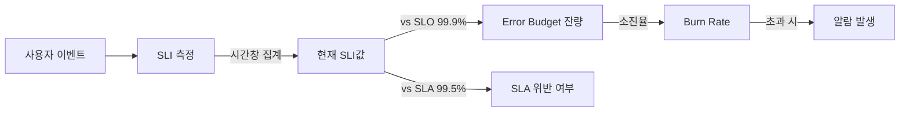

# SLI·SLO·SLA

> **2026년의 자리**: SLI·SLO·SLA는 SRE의 *공통 어휘*. Google이 정립하고
> CNCF·DORA가 표준화. 셋은 **측정 → 목표 → 계약**의 위계로 묶임. 한국
> 실무에서 가장 많이 혼동되는 개념이며, *알람·롤백·계약·인센티브*의
> 출발점.
>
> 1~5인 환경에서는 **SLI 1~2개 + 내부 SLO 1개**로 시작. SLA는 외부 계약
> 필요 시점까지 미뤄도 좋다.

- **이 글의 자리**: [SRE 원칙](sre-principles.md) 다음. 이후 [SLI 선정](../slo/sli-selection.md)·
  [Burn Rate](../slo/slo-burn-rate.md)·[Error Budget 정책](../slo/error-budget-policy.md)의 토대.
- **선행 지식**: SRE 원칙, *Reliability vs Availability* 구분.

---

## 1. 한 줄 정의

| 용어 | 한 줄 정의 |
|---|---|
| **SLI** (Service Level Indicator) | "신뢰성을 *측정한 숫자*" — 좋은 이벤트 ÷ 전체 이벤트 |
| **SLO** (Service Level Objective) | "*목표 SLI*" — 우리가 약속하는 신뢰성 수준 |
| **SLA** (Service Level Agreement) | "*외부 계약*" — SLO 위반 시 *벌칙* (환불·크레딧)을 명시 |


---

## 2. 위계 — 안에서 밖으로

| 층 | 누가 본다 | 위반 시 |
|---|---|---|
| **SLI** | SRE·개발팀 (대시보드) | — (단순 측정값) |
| **SLO** | 내부 (팀·경영진) | 에러 버짓 소진 → 배포 동결 등 *내부 정책* 발동 |
| **SLA** | 외부 (고객·법무) | *돈*이 나간다 — 환불·크레딧·계약 위반 |

> **핵심 비대칭**: SLA는 SLO보다 **느슨**해야 한다. 내부적으로 99.9%를
> 목표(SLO)로 하면, 외부 계약(SLA)은 99.5%로. 안에서 일찍 알람, 밖으로는
> 여유 — 이것이 *에러 버짓*의 진짜 역할.

| 층 | 수치 예시 | 역할 |
|---|---|---|
| SLA (외부 약속) | 99.5% | 위반 시 환불 |
| SLO (내부 목표) | 99.9% | 위반 시 정책 발동 — 안전 마진 |
| SLI (실측) | 99.95% | SLO와 비교 대상 |

> **CUJ (Critical User Journey)**: SLI를 정의할 *대상*이 되는 핵심 사용자
> 흐름. 예: "사용자가 결제 버튼을 누르면 5초 안에 영수증을 받는다." 자세히는
> [SLI 선정](../slo/sli-selection.md).
>
> **Reliability vs Availability**: Availability는 *응답 가능성*(시간 비율),
> Reliability는 *올바른 동작*(정확성 포함). SLI는 두 차원 모두 다룰 수
> 있다 — Availability SLI·Latency SLI·Quality SLI 모두 1급 시민.

---

## 3. SLI — 측정의 기본 단위

### SLI 분류 — 4가지 축

Google SRE Workbook은 SLI를 두 직교 축으로 분류한다.

| 축 | A | B |
|---|---|---|
| **이벤트 단위** | **Request-based** (이벤트별 좋음/나쁨) | **Window-based** (5분 창의 좋음/나쁨) |
| **표현 형식** | **Ratio** (비율 — 좋은/전체) | **Threshold** (임계 통과 비율) |

| 조합 | 예시 |
|---|---|
| Request × Ratio | "5xx 아닌 응답률 99.9%" |
| Request × Threshold | "**p99 ≤ 300ms 인 요청의 비율** 95%" |
| Window × Ratio | "분당 에러율 < 1% 인 창의 비율" |
| Window × Threshold | "5분 창에서 평균 지연 < 200ms 인 창의 비율" |

> **핵심**: Latency SLI는 그냥 `p99 < 300ms`가 아니다. 정확한 표현은
> *"p99가 300ms 이내인 요청의 비율"* — Threshold-ratio 형태여야 SLO·
> 에러 버짓과 호환된다.

### "이벤트 기반 SLI"의 표준 형식

> **SLI = (좋은 이벤트 수) / (전체 유효 이벤트 수) × 100**

| 종류 | 좋은 이벤트 정의 | 예시 |
|---|---|---|
| **Availability** | 5xx 아닌 응답 | 200·201·3xx·4xx (4xx는 클라이언트 책임 — 분모 제외 가능) |
| **Latency** | 임계치 이내 응답 | "응답이 300ms 이내인 요청 비율" |
| **Quality** | 의미상 정상 응답 | 검색 결과가 빈 배열 아님 |
| **Freshness** | 데이터 최신성 | 마지막 업데이트가 5분 이내 |
| **Correctness** | 결과 정확성 | 결제 합산 일치 |
| **Coverage** | 처리 비율 | 배치 작업 99.9% 완료 |
| **Throughput** | 처리량 | 분당 1000건 이상 |
| **Durability** | 영속성 | 데이터 손실률 0% |

> **권장**: Availability + Latency 2개부터. Quality·Freshness는 도메인이
> 명확할 때 추가.

### Request-based vs Window-based — 어떻게 고르나

| 상황 | 권장 |
|---|---|
| 일정한 트래픽, 모든 요청 동등 가치 | **Request-based** (Prometheus 카운터) |
| 트래픽 0인 기간이 자주 있음 | **Window-based** (분모 0 회피) |
| 비즈니스 영향이 *시간*에 비례 | **Window-based** (예: 결제 다운 5분) |
| 비즈니스 영향이 *요청 수*에 비례 | **Request-based** (예: 검색 실패 N건) |

### 4 Golden Signals (Google)

| 시그널 | 의미 | SLI 매핑 |
|---|---|---|
| **Latency** | 응답 시간 | Latency SLI 직결 |
| **Traffic** | 부하·트래픽 | 컨텍스트 (분모) |
| **Errors** | 실패 비율 | Availability SLI 직결 |
| **Saturation** | 자원 포화도 | 선행 지표 (Capacity 영역) |

상세는 [SLI 선정](../slo/sli-selection.md) 참고.

---

## 4. SLO — 목표의 정량화

### 기본 형태

```
"X% of A를 시간 T 동안 만족한다"

예시:
- 가용성 SLO: 99.9% of HTTP 요청이 30일 동안 5xx 아닌 응답
- 지연 SLO:   95% of 요청이 30일 동안 p99 < 300ms 응답
```

### SLO 시간 창 — 어떻게 고를까

| 창 (Window) | 용도 | 함정 |
|---|---|---|
| **30일 rolling** | 가장 표준 — 분기·연간 보고와 호환 | 짧은 사고도 30일 후 잊힘 |
| **7일 rolling** | 빠른 피드백 | 작은 노이즈에 민감 |
| **분기 calendar** | 비즈니스 사이클 정합 | 분기 말 가까울수록 마진 적어짐 |
| **다중 창** | rolling + calendar 병행 | 운영 복잡도 증가 |

### "9의 개수" 빠른 환산표

기준: 30일 = 43,200분, 90일 = 129,600분, 1년 = 525,600분.

| SLO | 월간(30일) 허용 다운 | 분기(90일) 허용 다운 | 연간(365일) 허용 다운 |
|---|---|---|---|
| 99% | 7시간 12분 | 21시간 36분 | 3일 15시간 |
| 99.5% | 3시간 36분 | 10시간 48분 | 1일 19시간 |
| **99.9%** | **43분 12초** | **2시간 9분 36초** | **8시간 45분** |
| 99.95% | 21분 36초 | 1시간 4분 48초 | 4시간 22분 |
| 99.99% | 4분 19초 | 12분 58초 | 52분 33초 |
| 99.999% | 26초 | 1분 18초 | 5분 15초 |

> 99.999% 가용성은 *재시작도 못 한다*. 인프라·배포 전 영역 자동화 필요.
> 1~5인 환경의 일반적 권장: **99.5~99.9%**.

### Calendar vs Rolling — "버짓 절벽" 함정

| 모델 | 동작 | 함정 |
|---|---|---|
| **Calendar** (분기·월별) | 분기 시작 시 버짓 리셋 | 분기 말 버짓 소진 후 *다음 분기 시작과 함께 무료 면제* — "절벽" |
| **Rolling** (직전 30일) | 매일 30일 창 갱신 | 사고가 30일 후 자동 망각 — 학습 약함 |
| **다중 창** | 둘 다 운영 | 표준 — 운영 복잡도 ↑ |

---

## 5. SLA — 외부 계약의 영역

### SLA의 본질은 *돈*

| 구성 요소 | 의미 |
|---|---|
| **목표 수치** | "99.5% 월간 가용성" — SLO보다 느슨 |
| **측정 방법** | 어떤 SLI로? 누가 측정? |
| **제외 사유** | 사전 공지 유지보수, 천재지변 (Force Majeure) |
| **벌칙** | 위반 시 환불·크레딧·해지권 |
| **신청 절차** | 고객이 청구하는 방법 (자동 vs 수동) |

### SLO ≠ SLA — 5가지 차이

| 측면 | SLO | SLA |
|---|---|---|
| **수치 강도** | 빡빡 | 느슨 |
| **위반 결과** | 내부 정책 발동 | 금전적 보상 |
| **누가 정의** | SRE·개발팀 | 법무·세일즈·SRE |
| **변경 빈도** | 분기·연간 검토 | 계약 갱신 시 |
| **공개 범위** | 내부 (또는 약식 공개) | 고객과 합의된 문서 |

### SLA가 *없어도* 되는 경우

- 무료·내부 서비스
- B2C 일반 서비스 (이용약관에 *Best Effort* 기재)
- MVP·실험 단계

> SLA 없이도 SLO·에러 버짓은 의미 있다. SLA를 도입할 시점은 *고객이
> 환불을 요구할 만큼 비즈니스 의존이 커졌을 때*.

---

## 6. 셋의 관계 — 계산식으로



| 메트릭 | 정의 | 예시 |
|---|---|---|
| **Error Budget** | (1 - SLO) × 시간 창 | 99.9%·30일 → 43.2분 |
| **Budget 소진율** | 사용한 Bad 이벤트 / Budget | 30분 사용 → 69% 소진 |
| **Burn Rate** | 현재 소진 속도 ÷ "1× 평균" | 1× = 30일 정확히 소진, 14.4× = 1시간 소진 |

상세 계산: [SLO Burn Rate](../slo/slo-burn-rate.md), [Error Budget 정책](../slo/error-budget-policy.md).

---

## 7. 현실 함정 10선

| # | 함정 | 증상 | 처방 |
|:-:|---|---|---|
| 1 | **SLA를 SLO처럼 운영** | 내부 알람도 SLA 임계로 → 이미 위반 후 인지 | SLA보다 빡빡한 SLO 설정 |
| 2 | **SLI 정의 모호** | "응답 성공" 정의 부재 → 팀마다 해석 다름 | 좋은/나쁜 이벤트 명문화 |
| 3 | **모든 메트릭 SLO화** | 운영 부담, 의미 없는 알람 | CUJ 기준 2~5개로 압축 |
| 4 | **사용자 미체감 SLO** | DB 가용성만 추적 → 사용자 경험과 무관 | CUJ → 사용자 경험 출발 |
| 5 | **SLO 99.99% 환상** | 비용 폭증, 변경 정체 | 99.5~99.9% 단계적 상향 |
| 6 | **SLO 위반 시 침묵** | 에러 버짓 정책 없음 → SLO가 장식 | 정책 명문화 (배포 동결 등) |
| 7 | **분모에 4xx 포함** | 클라이언트 오타도 카운트 | 4xx는 분모 제외 (정책별) |
| 8 | **합성 모니터링만** | 진짜 사용자 안 봄 | RUM(실측) + 합성 병행 |
| 9 | **시간 창 너무 짧음** | 노이즈에 알람 폭주 | 30일 rolling 권장 |
| 10 | **SLO 협상 부재** | 개발팀이 모름 → 갈등 | 분기 1회 검토 미팅 |

---

## 8. SLI·SLO·SLA 작성 템플릿

```yaml
# CUJ: 결제 API
# Critical User Journey 한 문장: "사용자가 결제 버튼을 누르면 5초 안에 영수증을 받는다"

slis:
  - name: payment-availability
    description: "결제 API 응답 성공률"
    good_event: "HTTP status != 5xx AND status != 0(timeout)"
    valid_event: "HTTP method == POST AND path == /api/v1/payments"
    formula: "good / valid"

  - name: payment-latency
    description: "결제 API p95 지연"
    good_event: "elapsed_ms < 1000"
    valid_event: "HTTP method == POST AND path == /api/v1/payments AND status == 200"
    formula: "good / valid"

slos:
  - sli: payment-availability
    target: 0.999          # 99.9%
    window: 30d
    error_budget: 0.001    # 30일 43.2분

  - sli: payment-latency
    target: 0.95           # 95%가 1초 이내
    window: 30d

sla:
  target_availability: 0.995   # 99.5% — SLO보다 느슨
  measurement_window: monthly
  exclusions:
    - "사전 공지된 유지보수 (24시간 전 공지, 월 4시간 이내)"
    - "Force Majeure"
  penalty:
    - threshold: 0.995
      credit: "월 사용료 10%"
    - threshold: 0.99
      credit: "월 사용료 25%"
    - threshold: 0.95
      credit: "월 사용료 50%"
```

---

## 9. 주요 클라우드 SLA 비교 (참조용)

| 서비스 | 단일 인스턴스 | 다중 AZ/Region | 위반 시 |
|---|---|---|---|
| **AWS EC2** | 99.5% (Single Instance) | 99.99% (Region — 2+ AZ 사용 시) | 10~30% 크레딧 |
| **GCP Compute Engine** | SKU별 상이 | 99.99% (Multi-zone) | 10~50% 크레딧 |
| **Azure VM** | 99.9% (Premium SSD + Single Instance) | 99.99% (AZ 분산) | 10~25% 크레딧 |
| **AWS S3 Standard** | — | 99.9% | 10~25% 크레딧 |
| **Cloudflare Network** | — | 100% (Enterprise — 네트워크 단위) | 비즈니스 합의 |

> **주의**: 위 표는 *간략 참조*. 정확한 정의·제외 사유·SKU별 차이는 각 CSP의
> 공식 SLA 문서를 직접 확인. CSP SLA는 본인 서비스 SLO와 동일하지 않으며,
> 의존성 SLO는 *멀티-9 구간에서 곱셈*으로 빠르게 깨진다.

### 의존성 합성 — 직렬과 병렬

| 구조 | 합성 가용성 공식 | 예시 (각 99.9%) |
|---|---|---|
| **직렬** (모두 정상이어야 함) | `p1 × p2 × ... × pn` | 3개 직렬 → 99.7% |
| **병렬·중복** (하나라도 정상이면 됨) | `1 - (1-p1)(1-p2)...(1-pn)` | 2개 redundant → 99.9999% |
| **혼합** (직렬 안에 병렬) | 위 둘을 단계별 적용 | Cell-based 기반 |

**핵심**: 하부 의존성 SLO보다 상부 SLO가 빡빡할 수 없다(직렬). 그래서
Cell-based·Bulkhead·Circuit Breaker로 *병렬·격리* 구조를 만든다 →
[Failure Modes](../reliability-design/failure-modes.md).

---

## 10. 1~5인 팀의 SLI·SLO·SLA 시작 가이드

| 단계 | 액션 | 시간 |
|:-:|---|---|
| 1 | **CUJ 1개** 식별 — 가장 핵심 사용자 흐름 | 1일 |
| 2 | **SLI 2개** 정의 — Availability + Latency | 2일 |
| 3 | **SLO 임계치** 합의 — 99.5%·p95 1s | 0.5일 |
| 4 | **대시보드** — Grafana / Cloud Monitoring | 1일 |
| 5 | **Burn Rate 알람** — 1h, 6h 다중 창 | 1일 |
| 6 | **에러 버짓 정책** — 소진 시 행동 | 0.5일 |
| 7 | (필요 시) SLA 작성 | 별도 — 법무 협업 |

총 1주일이면 SLI·SLO·정책까지 완성 가능. SLA는 외부 계약 필요해질
때까지 미뤄도 OK.

---

## 11. 도구 지형 (참조)

| 영역 | 도구 |
|---|---|
| **SLO 정의 (코드화)** | [Sloth](https://sloth.dev), [Pyrra](https://github.com/pyrra-dev/pyrra), [OpenSLO](https://openslo.com) |
| **메트릭 백엔드** | Prometheus, VictoriaMetrics, Cloud Monitoring |
| **시각화** | Grafana, Datadog, New Relic |
| **알람** | Alertmanager, PagerDuty, OpsGenie |
| **상용 SLO 플랫폼** | Nobl9, Cortex |

> SLO as Code 도구는 [observability/](../../observability/) 카테고리에서
> 깊이 다룬다. 여기서는 *개념*에 집중.

---

## 12. 한눈에 보기

| 항목 | 한 줄 |
|---|---|
| **SLI** | 측정값 — 좋은 이벤트 ÷ 전체 |
| **SLO** | 내부 목표 — SLI에 대한 약속 |
| **SLA** | 외부 계약 — 위반 시 *돈*이 나감 |
| **순서** | SLA ≪ SLO < SLI 실측 (안전 마진) |
| **시작 SLI** | Availability + Latency 2개 |
| **권장 SLO** | 99.5~99.9% (1~5인 환경) |
| **시간 창** | 30일 rolling 표준 |
| **SLA 시점** | 외부 계약 필요 시 — 그 전까진 SLO만으로 충분 |

---

## 참고 자료

- [Google Cloud Blog — SRE Fundamentals: SLI vs SLO vs SLA](https://cloud.google.com/blog/products/devops-sre/sre-fundamentals-sli-vs-slo-vs-sla) (확인 2026-04-25)
- [Google Cloud Blog — SLAs vs SLOs vs SLIs](https://cloud.google.com/blog/products/devops-sre/sre-fundamentals-slis-slas-and-slos) (확인 2026-04-25)
- [Google SRE Book — Service Level Objectives](https://sre.google/sre-book/service-level-objectives/) (확인 2026-04-25)
- [Google SRE Workbook — Implementing SLOs](https://sre.google/workbook/implementing-slos/) (확인 2026-04-25)
- [Atlassian — SLA vs SLO vs SLI](https://www.atlassian.com/incident-management/kpis/sla-vs-slo-vs-sli) (확인 2026-04-25)
- [PagerDuty — SLA vs SLO vs SLI](https://www.pagerduty.com/resources/digital-operations/learn/what-is-slo-sla-sli/) (확인 2026-04-25)
- [OpenSLO Specification](https://openslo.com) (확인 2026-04-25)
