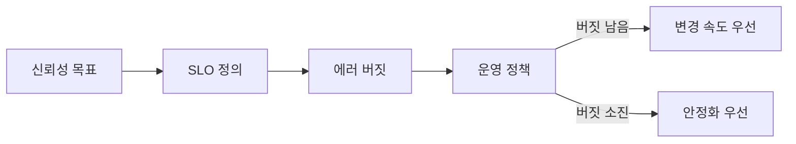
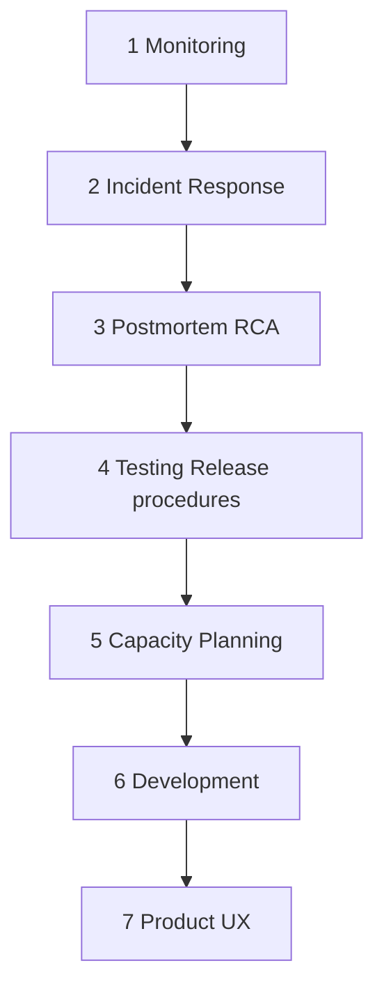
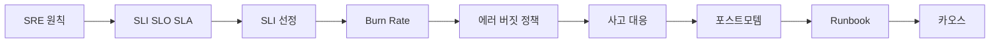

# SRE 원칙

> **2026년의 자리**: SRE는 *"소프트웨어 엔지니어가 운영 문제를 풀면 어떻게
> 될까?"* 의 답으로 Google이 정립. 2003년 시작, 2016년 SRE Book 공개로
> 산업 표준이 되었고 *DevOps의 한 구체적 구현(class SRE implements DevOps)*
> 으로 자리잡음. 도구가 아닌 **판단·원칙**의 모음.
>
> 1~5인 DevOps 겸임 환경에서는 **Dickerson 피라미드 하단 3층**(모니터링·
> 사고 대응·포스트모템)과 **에러 버짓**만이라도 손에 쥐고 시작.

- **이 글의 자리**: SRE 카테고리의 첫 글. 이후 모든 글의 기반 어휘를 정리.
- **선행 지식**: 운영 경험, "장애 났을 때 무엇이 힘들었는가"에 대한 자기 답.

---

## 1. 한 줄 정의

> **SRE**: "신뢰성을 *제품 기능*으로 다루는 엔지니어링 분과. 신뢰성을
> 측정 가능한 목표(SLO)로 정의하고, 그 목표 안에서 변경 속도를 최대화한다."

핵심은 "100% 신뢰성은 잘못된 목표"라는 단호한 선언. 사용자가 인지 못 하는
0.01%를 위해 변경 속도를 희생하지 않는다.

---

## 2. SRE vs DevOps

| 축 | DevOps | SRE |
|---|---|---|
| **무엇인가** | 문화·철학 (개발-운영 협업) | DevOps의 한 구현 |
| **누가 시작** | 2009 Patrick Debois | 2003 Google Ben Treynor |
| **핵심 도구** | 추상적 (Three Ways) | 구체적 (SLO·에러 버짓·Toil) |
| **조직 형태** | 다양 | 별도 SRE 팀 또는 임베디드 |
| **시그니처 메트릭** | DORA 4 keys (Deployment Frequency·Lead Time for Changes·Change Failure Rate·Failed Deployment Recovery Time) | SLO·에러 버짓·Toil 비율 |

> **DORA MTTR → FDRT**: 2023 State of DevOps Report부터 4번째 메트릭이
> "MTTR"에서 **Failed Deployment Recovery Time** (또는 *Time to Restore
> Service*)으로 명칭 변경. 의미는 "배포 실패 복구 시간"으로 더 좁혀짐.

> "*class SRE implements interface DevOps*" — Seth Vargo (Google).
> DevOps는 인터페이스, SRE는 그 구현체 중 하나.

---

## 3. Reliability vs Availability — 첫 어휘 정리

한국 실무 현장에서 자주 혼동되는 두 용어. 이후 모든 SRE 글의 기반.

| 용어 | 의미 | 측정 예시 |
|---|---|---|
| **Availability** | "응답 가능한가" — 요청에 응답하는 비율 | 5xx 제외 응답률 99.9% |
| **Reliability** | "올바르게 동작하는가" — 정확성·시간 조건 포함 | 200 OK이면서 p99 < 300ms 비율 |

SLO는 양쪽 모두에 걸친다. *Availability SLO* 뿐 아니라 *Latency SLO·
Quality SLO*도 동등한 1급 시민. "가용성 99.9% 했으니 SLO 끝"은 함정.

---

## 4. 핵심 원칙 8가지

Google SRE Book Part II "Principles"에 정리된 원칙들. **본 표는 SRE Book
Part II의 목차 순서**(우선순위 ranking은 책이 직접 명시하지 않음).

| # | 원칙 | 의미 | 위반 시 |
|:-:|---|---|---|
| 1 | **Embrace Risk** | 100% 신뢰성은 잘못된 목표 | 변경 속도 정체, 과잉 비용 |
| 2 | **SLO 기반 운영** | 신뢰성을 숫자로 정의 | 운영 vs 개발 끝없는 갈등 |
| 3 | **Error Budget** | SLO를 정책으로 — 소진 시 동결 | 데이터 없는 정치적 의사결정 |
| 4 | **Eliminate Toil** | 반복·수동·자동화 가능 작업 제거 | SRE가 운영 인력으로 전락 |
| 5 | **Monitoring & Observability** | 시스템이 *말하게* 함 | 사고 인지 지연·MTTR 폭증 |
| 6 | **Release Engineering** | 배포는 1급 엔지니어링 | 배포가 사고 원인 1위 유지 |
| 7 | **Simplicity** | 복잡도는 신뢰성의 적 | 조용한 부채 누적 |
| 8 | **On-call Sustainability** | 사람이 지치면 시스템도 무너짐 | 번아웃·이직·지식 유실 |

각 원칙은 별도 글로 깊이 다룬다. 여기서는 *왜 그 순서인가*만 짚는다.

### 왜 Embrace Risk가 첫 장인가

다른 모든 원칙이 이 전제 위에 선다. "100%를 추구하지 않는다"를 받아들여야
SLO·에러 버짓이 의미를 갖고, "신뢰성과 변경 속도의 트레이드오프"라는
진짜 대화가 시작된다. SRE Book이 Part II 첫 장으로 배치한 이유.



---

## 5. Dickerson 신뢰성 피라미드

Mikey Dickerson(전 Google SRE Manager)이 2014 SREcon에서 정리. SRE Book
Chapter 1 Figure 1-1에도 동일 구조로 등재. **Maslow 욕구 단계처럼, 하층
없이 상층 없다.**



| 층 | 정전(Canon) 명 | 의미 | 없으면 |
|:-:|---|---|---|
| 1 | **Monitoring** | 시스템이 *말하게* — 메트릭·로그·트레이스·알람 | 사고 인지 자체 불가 |
| 2 | **Incident Response** | 알람 → 사람 → 복구. IRT·Commander·러너북 | MTTR 폭증, 정치만 남음 |
| 3 | **Postmortem & RCA** | 비난 없는 학습 — 같은 사고 재발 X | 같은 장애 무한 반복 |
| 4 | **Testing + Release procedures** | 사전 검증·점진 배포·카나리 | 배포가 사고 원인 1위 |
| 5 | **Capacity Planning** | 수요 예측·헤드룸 | 트래픽 급증에 무방비 |
| 6 | **Development** | 신뢰성을 *기능*으로 — 기능 개발에 SRE 임베드 | 개발과 운영의 단절 |
| 7 | **Product (UX)** | 모든 것의 끝 — 사용자가 만족하는가 | 모든 하위 노력이 무의미 |

**1~5인 팀의 현실론**: 하단 3층(Monitoring·IR·Postmortem)이라도 완성하라.
4~7층은 그 위에서 점진적으로.

> **현실 트레이드오프**: 정의상 4층(Testing+Release)이 3층 다음이지만,
> 실제로는 *배포가 사고 1위*인 환경이 많아 3층과 4층을 거의 동시에
> 손대는 경우가 흔하다. 책의 순서는 의존성, 현실은 동시 작업.

---

## 6. Error Budget — SRE의 시그니처 도구

### 정의

```
Error Budget = 1 - SLO
SLO 99.9% → 월간 43.2분 다운 허용
```

이 시간은 **버려지는 시간이 아니라, 변경에 쓸 수 있는 자산**.

### 정책 (Error Budget Policy)

| 버짓 상태 | 행동 |
|---|---|
| **남음** | 새 기능·실험·카나리·파괴적 변경 OK |
| **소진** | 배포 동결, 안정화 작업만, 개발팀이 SRE에 합류 |
| **연속 소진** | SLO 재조정 또는 아키텍처 재검토 |

이 정책이 **SLO를 진짜로 만든다**. 정책 없는 SLO는 장식이다.

> 자세한 내용: [Error Budget 정책](../slo/error-budget-policy.md)

---

## 7. Toil — 측정·제거의 대상

### Toil의 정의 (Google 기준 6가지)

| 속성 | 의미 |
|---|---|
| **Manual** | 사람 손 필요 |
| **Repetitive** | 반복적 |
| **Automatable** | 기계가 할 수 있음 |
| **Tactical** | 즉시 대응성 (사전 계획 X) |
| **No enduring value** | 끝나면 시스템 상태가 안 변함 |
| **O(n) with service** | 서비스 성장에 비례해 증가 |

### Toil vs Overhead — 50% 룰의 분기점

| 구분 | 예시 | 50% 룰 분류 |
|---|---|---|
| **Toil** | 알람 수동 대응, 매뉴얼 배포, 인증서 갱신 | "운영" 시간에 포함 |
| **Overhead** | 회의·교육·관리 보고·휴가 | "운영"·"엔지니어링" 어느 쪽도 아님 |
| **Engineering** | 자동화 도구 작성, 신뢰성 설계 | 50% 이상 확보 대상 |

Overhead는 Toil이 아니므로 자동화 대상이 아니다. "회의가 너무 많아서
Toil"은 잘못된 분류.

### 50% 엔지니어링 룰

> SRE 시간의 **50% 이상**은 엔지니어링(자동화·신뢰성 개선)에. 운영 작업이
> 50%를 넘으면 → SRE를 추가 채용하거나, 운영 일부를 개발팀으로 환원.

Google SRE Workbook 기록에 따르면 Google 내부 평균은 약 33%. 50%는
*상한선*이지 목표가 아니다.

> 자세한 내용: [Toil 감축](../toil/toil-reduction.md)

---

## 8. On-call 지속 가능성 — 작은 팀의 첫 번째 실패 지점

작은 팀에서 SRE 원칙 중 가장 먼저 무너지는 축. 사람이 지치면 시스템도
무너진다는 점에서 별도 강조.

| 항목 | 권장 기준 (Google SRE Book 기준) |
|---|---|
| **On-call 시간 비중** | 근무 시간의 25% 이하 |
| **페이저 호출 빈도** | 시프트당 평균 2건 이하 (수면 시간 제외) |
| **로테이션 인원** | 최소 6명 — 1차 + 2차 백업 페어 + 충분한 휴식 |
| **시프트 후 휴식** | 야간 호출 후 회복 시간 보장 |
| **공동 On-call** | 개발팀과 함께 — *개발자가 본인 코드 사고를 받음* |

1~5인 환경에서 6명 로테이션은 비현실적. 그렇다면:

- 페이저 폴리시: *야간 페이지는 SLO 위반·고객 영향 한정*
- 비-페이지 알람은 다음 영업일 처리 큐로
- 공동 On-call로 부하 분산 (개발팀 1명 + 운영팀 1명 페어)

> 자세한 내용: [On-call 로테이션](../incident/on-call-rotation.md)

---

## 9. 1~5인 DevOps 겸임 환경 — 현실 적용

전담 SRE 팀이 없는 작은 조직에서 SRE 원칙을 어떻게 적용하는가.

| 우선순위 | 도입 항목 | 시간 투자 |
|:-:|---|---|
| 1 | **모니터링·알람** (Dickerson 1층) | 2주 — 4 Golden Signals |
| 2 | **간이 SLO** (가용성·지연 2개부터) | 1주 — 측정 → 합의 → 문서화 |
| 3 | **포스트모템 템플릿** (Blameless) | 1주 — 첫 사고에 적용 |
| 4 | **Runbook 1개** (가장 자주 호출되는 알람) | 1주 |
| 5 | **에러 버짓 정책** (간단판) | 1주 — 팀 합의 |
| 6 | **공동 On-call 로테이션** | 1주 — 개발-운영 페어 |
| 7 | Toil 측정 | 1개월 — 일주일 단위 기록 |

**금지사항**:

- 도구부터 도입 (Sloth·Argo Rollouts 등) — *원칙이 먼저, 도구는 나중*
- SLO 99.99% 같은 환상 — 작은 팀은 99.5~99.9%로 시작
- 외주 운영을 SRE라 부르기 — 엔지니어링 50%가 핵심
- *전담 1인 On-call* — 번아웃·지식 단일점, 최소 페어로

---

## 10. 안티패턴

| 안티패턴 | 증상 | 처방 |
|---|---|---|
| **Ops 팀 이름만 SRE로** | 자동화·엔지니어링 시간 0 | Toil 측정 → 50% 룰 |
| **SLO 없는 알람 폭주** | 알람 피로, 진짜 사고 묻힘 | SLI 재정의 → 알람 SLO 연동 |
| **포스트모템 = 책임자 색출** | 솔직한 보고 사라짐 | Blameless 명문화 |
| **에러 버짓 = 슬라이드 장식** | 소진해도 배포 계속 | 정책 명문화·자동 동결 |
| **100% 가용성 추구** | 변경 속도 정체, 비용 폭증 | 사용자 인지 임계 측정 |
| **SRE = On-call 전담** | 번아웃, 채용 어려움 | 개발팀 공동 On-call |

---

## 11. SRE 도입 성숙도 모델

| 단계 | 신호 | 다음 액션 |
|:-:|---|---|
| **0. 부재** | 알람만 있고 SLO 없음 | 4 Golden Signals 측정 시작 |
| **1. 측정** | SLO 1~2개 운영 | Burn Rate 알람 도입 |
| **2. 정책** | 에러 버짓 정책 시행 | 포스트모템 정착 |
| **3. 자동화** | Toil 측정·감축 진행 | 카오스 실험 검토 |
| **4. 임베디드** | SRE가 개발 단계부터 참여 | 신뢰성을 기능으로 출시 |
| **5. 문화** | 전사 SLO·DevEx 측정 | 전 부서 적용 |

대부분의 한국 SaaS·플랫폼팀은 1~2단계. 3단계로 가는 것이 1~5년 목표.

---

## 12. 의사결정 가이드

| 상황 | 판단 |
|---|---|
| "다음 분기 SLO 99.99%로 올리자" | **거절** — 비용·이익 분석 후 99.95 단계 검증 |
| "장애 났으니 책임자 찾자" | **거절** — Blameless 포스트모템으로 시스템 약점 도출 |
| "Toil 너무 많아 채용 필요" | **분석** — 자동화 가능분 우선, 그 후 채용 |
| "SLO 없이 그냥 알람 추가" | **거절** — 알람은 SLO 위반 시그널이어야 함 |
| "에러 버짓 남았는데 배포 막자" | **거절** — 버짓이 있다면 변경 속도 우선 |

---

## 13. SRE의 한계 — 모든 곳에 맞지는 않는다

| 부적합한 환경 | 이유 | 대안 |
|---|---|---|
| **하드웨어·임베디드** | 소프트웨어 빈번 변경 모델 부적합 | 안전공학·FMEA |
| **규제 산업의 정적 시스템** | 변경 자체가 위험 | ITIL·Change Management 강화 |
| **팀 1~2명, 트래픽 미미** | SRE 오버헤드 > 이익 | 모니터링·알람만 |
| **사용자가 신뢰성 인지 못 함** | SLO 의미 없음 | 사용 분석 우선 |

SRE는 **사용자가 신뢰성에 민감한 서비스**에서 진가를 발휘. 미민감 서비스는
DORA 메트릭만 추적해도 충분.

---

## 14. 학습 경로



이 글 → SLI·SLO·SLA → SLI 선정 → Burn Rate → 에러 버짓 정책 →
사고 대응 → 포스트모템 → Runbook → 카오스 순.

---

## 15. 한눈에 보기

| 항목 | 한 줄 |
|---|---|
| **SRE의 본질** | 신뢰성을 측정 가능한 목표(SLO)로 다루는 분과 |
| **DevOps와 관계** | DevOps의 한 구체적 구현 (class SRE implements DevOps) |
| **시그니처 도구** | SLO·Error Budget·Toil 50% 룰 |
| **기반 모델** | Dickerson 7층 피라미드 |
| **출발점** | 모니터링 → 사고 대응 → 포스트모템 (하단 3층) |
| **금기** | 100% 가용성, Blame 문화, 도구 우선, Ops 이름만 변경 |
| **성숙도 0→3** | 측정 → 정책 → 자동화 |

---

## 참고 자료

- [Google SRE Book — Part II: Principles](https://sre.google/sre-book/part-II-principles/) (확인 2026-04-25)
- [Google SRE Book — Embracing Risk](https://sre.google/sre-book/embracing-risk/) (확인 2026-04-25)
- [Google SRE Book — Eliminating Toil](https://sre.google/sre-book/eliminating-toil/) (확인 2026-04-25)
- [Google SRE Workbook — Eliminating Toil](https://sre.google/workbook/eliminating-toil/) (확인 2026-04-25)
- [Dickerson's Hierarchy of Service Reliability — Reliably](https://reliably.com/blog/sre-pyramid-dickersons-hierarchy-of-service-reliability/) (확인 2026-04-25)
- [What Is SRE? — O'Reilly (Implementing SRE)](https://www.oreilly.com/library/view/what-is-sre/9781492054429/ch03.html) (확인 2026-04-25)
- [Site Reliability Engineering — Wikipedia](https://en.wikipedia.org/wiki/Site_reliability_engineering) (확인 2026-04-25)
