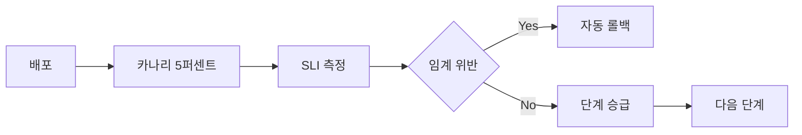
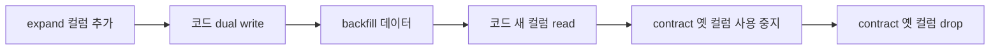
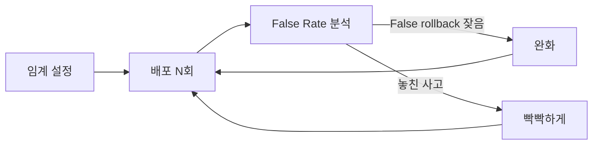
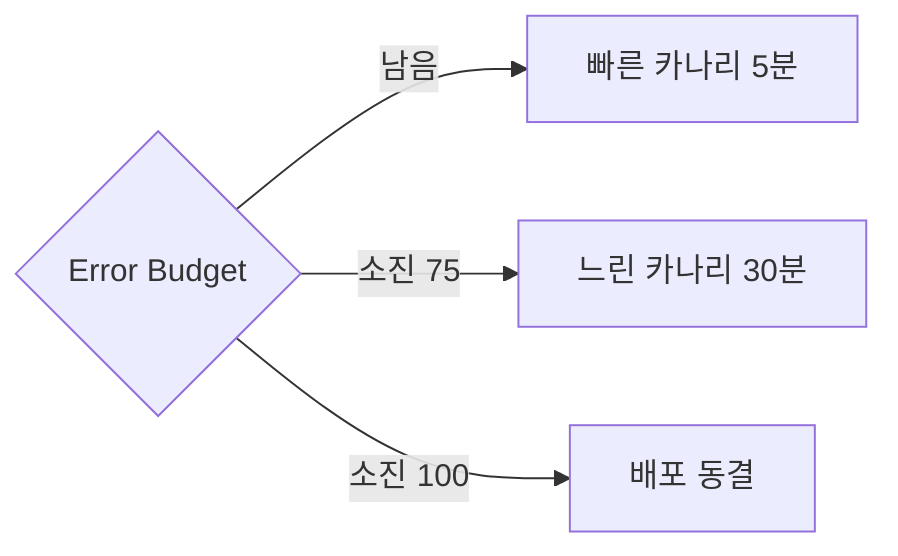

# SLO 기반 롤백

> **2026년의 자리**: SLO 기반 롤백은 *카나리·점진 배포 단계에서 SLO·에러
> 버짓을 실시간 측정해 자동 롤백*. **사람이 결정하는 사고**를 *코드가
> 결정하는 사고*로 전환. 도구 표준은 **Argo Rollouts**·**Flagger**(둘 다
> CNCF). SRE 관점에서 핵심은 *어떤 SLI를 어떻게 임계로 설정하는가*.
>
> 1~5인 환경에서도 카나리 자동 롤백은 *MTTR 단축의 핵심 레버*. 첫 도입 시
> Availability + Latency 2개 SLI로 시작.

- **이 글의 자리**: SLO·에러 버짓의 *결과*를 자동 행동으로 전환. [Error
  Budget 정책](../slo/error-budget-policy.md)의 *집행 도구*.
  [SRE]가 본 *도구의 SRE 측면* — 도구 자체는 [cicd/](../../cicd/) 카테고리.
- **선행 지식**: Burn Rate, 카나리 배포, Argo Rollouts/Flagger 기본.

---

## 1. 한 줄 정의

> **SLO 기반 롤백**: "*카나리·점진 배포 단계에서 SLO·에러 버짓을 실시간
> 측정해, 임계 위반 시 자동으로 새 버전 트래픽을 차단·이전 버전으로
> 복귀.*" 사람의 판단을 *코드*에 위임.

### 왜 *자동* 롤백인가

| 수동 | 자동 |
|---|---|
| MTTR 분~시간 | MTTR 초~분 |
| On-call 수면 호출 | 잠 자는 동안 처리 |
| 사람의 판단 편향 | 일관된 임계 적용 |
| 사고 후 후회 | 롤백 *시도* 자체가 안전 |

> Google 내부 룰: *"배포 직후 알람 → 즉시 롤백."* 자동 롤백은 이 룰의
> 코드화.

---

## 2. SLO 기반 롤백의 6단계 흐름



| 단계 | 의미 |
|:-:|---|
| 1 | **카나리 시작** — 새 버전에 5~10% 트래픽 |
| 2 | **SLI 측정** — Availability·Latency·Error Rate |
| 3 | **분석 (Analysis)** — 임계와 비교 |
| 4 | **결정** — 통과 → 단계 승급 / 실패 → 롤백 |
| 5 | **승급 또는 롤백** | 자동 |
| 6 | **마지막 100% 또는 abort** | 통과 시 완전 배포 |

---

## 3. 어떤 SLI를 측정할 것인가

### 표준 4가지

| SLI | 의미 | 임계 예시 |
|---|---|---|
| **Success Rate** | 5xx 아닌 비율 | > 99% |
| **Latency** (p95·p99) | threshold-ratio 형태 | "p99 ≤ 300ms 비율" > 95% |
| **Custom Business Metric** | 결제 완료율, 등록률 등 | 이전 버전 대비 > 95% |
| **Error Budget Burn** | 카나리 배포 *동안* 소진 속도 | < 6× (Page Slow 임계) |

### Success Rate만으로는 부족

Success Rate 99% 통과해도 latency 5배 증가하면 사용자 경험 *최악*.
**Success + Latency 둘 다** 필수. Buoyant·Argo 권장.

### Comparison: Baseline vs Canary

| 모델 | 의미 | 강점 |
|---|---|---|
| **절대 임계** | "Success Rate > 99%" | 단순 |
| **상대 비교 (vs Baseline)** | "Canary가 Baseline보다 X% 이내" | 트래픽 패턴 변화에 견고 |
| **혼합** | 절대 + 상대 둘 다 만족 | 가장 안전 |

> 저녁 시간 트래픽 급증 시 절대 임계는 *false rollback*. 베이스라인 대비
> *상대 비교*가 견고.

---

## 4. 배포 전략 비교 — Canary·Blue/Green·Shadow

| 전략 | 동작 | 롤백 | 사용자 영향 |
|---|---|---|---|
| **Canary** | 점진적 트래픽 전환 | 트래픽 즉시 차단 | 단계별 영향 |
| **Blue/Green** | Active-Standby 교체 — 즉시 100% | DNS·LB로 즉시 원복 | 0 또는 100% (전부) |
| **Shadow / Mirror** | 트래픽 *복제* — 응답은 사용자에 X | 응답 무시·종료 | 0 (사용자 무영향) |
| **Rolling** | Pod 차례로 교체 (K8s 기본) | 새 Pod 종료 | 점진 영향 |
| **A/B Testing** | 헤더·사용자 기반 라우팅 | 라우팅 룰 변경 | 특정 그룹만 |

### 언제 무엇을

| 상황 | 권장 |
|---|---|
| 일반 코드 변경 | Canary |
| DB 스키마·인프라 큰 변경 | Blue/Green (즉시 원복) |
| 새 알고리즘·성능 검증 | Shadow (사용자 무영향) |
| 단순 버그픽스 | Rolling |
| 기능 실험 | A/B + Feature Flag |

> Shadow는 *카나리 분석*의 보완 — 새 버전을 실제 트래픽으로 *측정*만,
> 응답은 무시. 위험 0으로 검증.

---

## 5. 카나리 단계 설계

### 표준 단계 (Argo Rollouts 권장)

| Step | 트래픽 | 분석 시간 | 비고 |
|:-:|---:|---|---|
| 1 | **5%** | 5분 | 빠른 실패 인지 |
| 2 | **10%** | 10분 | |
| 3 | **25%** | 15분 | |
| 4 | **50%** | 15분 | |
| 5 | **75%** | 15분 | |
| 6 | **100%** | — | 완료 |

### 변형

| 패턴 | 의미 |
|---|---|
| **Quick canary** (1·5·100%) | 단순 변경 |
| **Slow canary** (1·5·10·25·50·75·100%) | 중요 서비스 |
| **Time-based** (각 단계 1h) | 다양한 사용자 패턴 검증 |
| **Manual gate** | 단계 사이 사람 승인 |
| **Auto-promote** | 모든 분석 통과 시 자동 |

> 단계 *총 시간*이 *최대 사용자 영향 시간*. 1% × 5분 → 최악의 경우 1%
> 사용자가 5분 영향. 첫 단계는 작게.

---

## 6. Argo Rollouts — Analysis Template

CNCF **Graduated** (2022-12-06 Argo 프로젝트 전체 졸업). K8s CRD로 정의.

```yaml
apiVersion: argoproj.io/v1alpha1
kind: AnalysisTemplate
metadata:
  name: success-rate-and-latency
spec:
  args:
    - name: service-name
  metrics:
    - name: success-rate
      interval: 1m
      successCondition: result[0] >= 0.99
      failureLimit: 3
      provider:
        prometheus:
          address: http://prometheus.monitoring:9090
          query: |
            sum(rate(istio_requests_total{
              destination_service="{{args.service-name}}",
              response_code!~"5.."
            }[1m]))
            /
            sum(rate(istio_requests_total{
              destination_service="{{args.service-name}}"
            }[1m]))

    - name: latency-p99
      interval: 1m
      successCondition: result[0] < 0.3
      failureLimit: 3
      provider:
        prometheus:
          address: http://prometheus.monitoring:9090
          query: |
            histogram_quantile(0.99,
              sum(rate(istio_request_duration_milliseconds_bucket{
                destination_service="{{args.service-name}}"
              }[1m])) by (le)
            ) / 1000
```

```yaml
apiVersion: argoproj.io/v1alpha1
kind: Rollout
metadata:
  name: payment-api
spec:
  strategy:
    canary:
      analysis:
        templates:
          - templateName: success-rate-and-latency
        args:
          - name: service-name
            value: payment-api
        startingStep: 1   # 5% 단계부터 분석
      steps:
        - setWeight: 5
        - pause: {duration: 5m}
        - setWeight: 10
        - pause: {duration: 10m}
        - setWeight: 25
        - pause: {duration: 15m}
        - setWeight: 50
        - pause: {duration: 15m}
        - setWeight: 100
```

> `failureLimit: 3` — 1분 간격 분석에서 3번 연속 실패 시 abort. 단발성
> 노이즈 보호.

---

## 7. Flagger — 자동 분석 + Service Mesh 통합

CNCF Graduated. Istio·Linkerd·App Mesh·NGINX 통합.

```yaml
apiVersion: flagger.app/v1beta1
kind: Canary
metadata:
  name: payment-api
spec:
  targetRef:
    apiVersion: apps/v1
    kind: Deployment
    name: payment-api
  service:
    port: 80
  analysis:
    interval: 1m
    threshold: 5            # 누적 분석 실패 5회 시 rollback
    maxWeight: 50
    stepWeight: 5           # 5%씩 증가
    metrics:
      - name: request-success-rate
        thresholdRange:
          min: 99
        interval: 1m
      - name: request-duration
        thresholdRange:
          max: 300          # ms
        interval: 1m
      - name: payment-success-rate
        templateRef:
          name: payment-success
        thresholdRange:
          min: 95
```

### Argo Rollouts vs Flagger

| 측면 | Argo Rollouts | Flagger |
|---|---|---|
| **CNCF** | Graduated (Argo 졸업 2022-12) | Graduated (Flux 가족 졸업 2022-11) |
| **Service Mesh** | 선택적 | 1급 통합 |
| **메트릭 백엔드** | Prometheus·Datadog·CloudWatch·Wavefront 등 | Prometheus·Datadog 등 |
| **단계 제어** | 명시적 step | 자동 weight 증가 |
| **Manual Gate** | 강력 — pause 단계마다 | 약함 — 외부 webhook |
| **Web UI** | 강력 (Argo CD 통합) | 약함 |
| **언제** | step 기반 명시적 제어 필요 | 메트릭 기반 자동 promotion |

> 두 도구 모두 CNCF Graduated. 성숙도 차이 X — *제어 모델*과 *생태계
> 통합* 차이로 선택.

> Buoyant 권장: 명시적 단계가 필요하면 Argo Rollouts, 메트릭 자동
> promotion이면 Flagger.

---

## 8. 자동 롤백의 *전제 조건* — Backward Compatibility

자동 롤백이 *안전*하려면 새 버전(N)과 이전 버전(N-1)이 *동시에 떠 있을
수 있어야* 한다. 카나리 정의상 N과 N-1이 트래픽을 나눠 받는다.

### Backward Compatibility 체크리스트

| 영역 | 호환성 | 처방 |
|---|---|---|
| **API 컨트랙트** | N-1 클라이언트가 N 응답 처리 가능 | OpenAPI diff 검증, 새 필드는 optional |
| **Message Queue** | N-1·N이 같은 메시지 처리 | Avro·Protobuf schema evolution |
| **DB 스키마** | N-1·N 동시 사용 | expand-contract 패턴 (아래) |
| **공유 캐시** | 키 형식 호환 | 버전 prefix 또는 TTL 단축 |
| **Feature Flag** | 코드 = 플래그 OFF, 기능 = 플래그 ON | 코드 배포와 기능 출시 분리 |

### Feature Flag로 배포·릴리즈 분리

> 코드 배포 ≠ 기능 출시. Feature Flag로 두 사이클을 분리하면 *자동 롤백
> 자체가 불필요*해진다 — 플래그 OFF가 즉시 롤백.

자세히는 [cicd/feature-flags](../../cicd/) 참조.

---

## 9. expand-contract DB 마이그레이션

자동 롤백이 가능한 DB 변경의 표준 패턴. **배포 사이클을 6단계로 분리.**



| 단계 | 의미 | 자동 롤백 |
|:-:|---|---|
| **1. Expand** | 새 컬럼 추가 (NULL 허용) | OK — 옛 코드 무관 |
| **2. Dual write** | 코드가 옛+새 둘 다 write | OK |
| **3. Backfill** | 기존 row에 새 값 채움 | OK |
| **4. Read 전환** | 코드가 새 컬럼만 read | OK — write는 둘 다 |
| **5. Contract write** | 코드가 옛 컬럼 write 중지 | *제한적 OK* — 데이터 점검 |
| **6. Contract drop** | 옛 컬럼 drop | **롤백 불가** |

> **6단계 사이 시간 간격**이 핵심. 각 단계 사이 *최소 1회 배포 + soak
> time*. 한 PR로 묶으면 자동 롤백 의미 X.

---

## 10. Holdback Group — Netflix·Spotify 패턴

100% 도달 후에도 *일부* 사용자·region을 *영구히 이전 버전*에 두고 비교.

| 그룹 | 트래픽 | 의미 |
|---|---|---|
| **Active (N)** | 95% | 새 버전 |
| **Holdback (N-1)** | 5% | 영구 이전 버전 |

### 효과

| 가치 | 의미 |
|---|---|
| **장기 회귀 탐지** | 단기 카나리에선 못 본 누적 효과 |
| **메트릭 비교 기준** | "정말 새 버전이 더 나은가" 통계 검증 |
| **즉시 롤백 가능** | Holdback이 살아 있어 100% 즉시 복귀 |

### Soak Time

100% 도달 후 *다음 배포까지의 대기 시간*. 표준 24~72h.

| 변경 종류 | Soak time |
|---|---|
| 코드 단순 변경 | 4~24h |
| 인프라 변경 | 24~72h |
| 새 기능 출시 | 1주 |

---

## 11. Automated Canary Analysis (ACA) — Kayenta

Netflix·Google이 만든 *통계 기반* 카나리 분석. Spinnaker Kayenta 구현.

### 단순 임계 vs ACA

| 측면 | 단순 임계 | ACA (Kayenta) |
|---|---|---|
| 모델 | 절대값 vs 임계 | Mann-Whitney U test (분포 비교) |
| 비교 | Canary vs Threshold | Canary vs Baseline (통계) |
| False rollback | 자연 변동에 흔들림 | 통계적 견고 |
| 설정 | 단순 | 메트릭별 weight·자동 점수 |
| 도구 | Argo Rollouts·Flagger | Spinnaker Kayenta |

> 임계 튜닝이 어렵다면 ACA 도입 검토. 다만 Spinnaker 운영 비용이 큼.
> Argo Rollouts에도 Kayenta 통합 플러그인 존재.

---

## 12. 임계 설정 — 어떻게 정할까

### 시작 전 데이터 수집 (Baseline)

| 항목 | 측정 |
|---|---|
| **현재 운영 Success Rate** | 30일 평균 + p1·p99 |
| **현재 운영 Latency** | p50·p95·p99 |
| **자연 변동 (낮·밤·주말)** | 시간대별 분포 |
| **트래픽 패턴** | RPS 분포 |

### 임계 설정 원칙

| 원칙 | 의미 |
|---|---|
| **Baseline + 안전 마진** | 현재 SLI - 0.5% |
| **SLO보다 빡빡** | SLO 99.9% → 카나리 임계 99.5% (안전 마진) |
| **Latency: 절대 + 상대** | "300ms 절대" + "Baseline 1.2배 이내" |
| **failureLimit 최소 2~3** | 단발성 노이즈 보호 |
| **너무 빡빡 금지** | False rollback → 배포 지연 |

### 임계 튜닝 사이클



> 첫 배포는 *느슨하게* — 익숙해지면 *빡빡하게*. False rollback이 계속되면
> 임계 완화.

---

## 13. 트래픽 라우팅 모델

| 모델 | 동작 | 도구 |
|---|---|---|
| **Pod 비율** | Replica 수로 트래픽 분배 | K8s Service (단순) |
| **Service Mesh** | 정교한 weight·헤더 라우팅 | Istio·Linkerd·Cilium |
| **Ingress weight** | NGINX·Traefik weight | NGINX Ingress Annotation |
| **Header-based** | 특정 사용자만 카나리 | A/B 테스트 결합 |
| **Region-based** | 한 region만 카나리 | DNS·CDN |

> Service Mesh 통합이 가장 정교. 운영 복잡도와 trade-off.

---

## 14. SRE 관점의 추가 고려

### Error Budget 연계



| 버짓 | 카나리 정책 |
|---|---|
| **0~50% 소진** | 표준 단계 (5·10·25·50·75·100%) |
| **50~75%** | 단계 시간 2배, 분석 임계 빡빡 |
| **75~100%** | 보안·버그픽스만, 추가 단계 1·2·5% |
| **100% 초과** | 전 배포 동결 — Argo Rollouts pause |

### 관측성 통합

| 통합 | 의미 |
|---|---|
| **Prometheus + Grafana** | 카나리 단계별 SLI 시각화 |
| **OpenTelemetry** | Trace 비교 — 새 버전 latency 분포 |
| **Slack 알림** | 단계 진입·rollback 자동 통보 |
| **Status page 자동** | rollback 시 자동 공지 |

### Manual Gate

자동만이 아니라 *사람 승인*도 가능.

```yaml
- pause: {}            # 무기한 pause — 사람이 promote
- pause: {duration: 1h}  # 1h 자동 promote
```

| 시점 | 권장 |
|---|---|
| **첫 카나리 (5%)** | Auto |
| **50% 단계** | Manual (대규모 영향) |
| **100%** | 자동 (분석 통과 시) |
| **DB 마이그 동반** | Manual + 사전 백업 검증 |

---

## 15. 함정·실패 사례

### Case 1: 임계 너무 빡빡

```
Success rate 99.95% (정상 운영)
카나리 임계 99.95% — Baseline과 동일
저녁 트래픽 급증 → 자연 변동으로 99.93%
→ False rollback. 8회 연속 후 임계 완화.
```

**처방**: Baseline + 0.5% 안전 마진, 상대 비교 도입.

### Case 2: Latency 누락

```
Success rate 99.5% 통과
하지만 p99가 200ms → 1.5s (7배)
사용자 경험 최악, 결제 timeout
→ 카나리 통과, 100% 배포 후 사고
```

**처방**: Latency SLI를 *반드시* 분석에 포함.

### Case 3: 트래픽 미달

```
새벽 트래픽 5 RPS, 카나리 5% = 0.25 RPS
1분 측정 시 통계적 의미 X
1번 실패 = false rollback
```

**처방**: 트래픽 임계 (`floor: 100 RPS`) — 미만이면 분석 skip 또는 단계
연장.

### Case 4: 의존성 영향

```
새 버전이 DB 새 column 사용
DB 마이그가 미완료
카나리 5% = 100% 5xx
→ 자동 롤백 OK, but 마이그 상태 비정상
```

**처방**: 사전 검증 (preStop·preSync hook) — 의존성 ready 확인.

---

## 16. 자동 롤백 vs 수동 — 결정 매트릭스

| 시나리오 | 자동 권장 | 수동 권장 |
|---|---|---|
| **단순 코드 변경** | ✓ |  |
| **인프라 설정 변경** | ✓ |  |
| **DB 스키마 변경** |  | ✓ (사전 백업) |
| **데이터 마이그레이션** |  | ✓ |
| **새 외부 의존성** | ✓ |  |
| **결제·중요 비즈니스 로직** | ✓ + 추가 검증 |  |
| **트래픽 미미** |  | ✓ |

> 데이터 변경은 *자동 롤백 위험*. 롤백 자체가 데이터 손상 가능. 사전
> 백업·이중 쓰기·feature flag 우선.

---

## 17. 배포 후 검증 — Auto-Verify

카나리 100% 후에도 추가 모니터링.

| 시간 | 활동 |
|---|---|
| **T+0** | 100% 도달 |
| **T+15분** | SLI 안정성 확인 |
| **T+1h** | Burn Rate 정상 |
| **T+24h** | 주간 SLI 비교 |
| **T+7일** | 스테이블 마킹 |

> 100%가 *끝*이 아니다. 24시간 모니터링 + 1주일 후에 *완료*.

---

## 18. 1~5인 팀의 SLO 롤백 — 단계적 도입

| 단계 | 도구 | 산출 | 시간 |
|:-:|---|---|---|
| 0 | **Feature Flag** | 코드 = 플래그 OFF, 즉시 토글 | 1주 |
| 1 | **수동 카나리** | k8s Service + 수동 weight | 1주 |
| 2 | **Argo Rollouts (basic)** | step 기반, 분석 X | 1주 |
| 3 | **+ Analysis** | Prometheus 메트릭 분석 | 1주 |
| 4 | **+ Service Mesh** | 정교한 트래픽 제어 | 1개월 |
| 5 | **+ Error Budget 연계** | EBP 통합 | 1개월 |

> **Step 0이 가장 중요**: Feature Flag는 카나리 인프라 없이도 즉시 롤백.
> 카나리는 *플래그를 못 쓰는 변경*에 적용.

---

## 19. 안티패턴

| 안티패턴 | 증상 | 처방 |
|---|---|---|
| **Success rate만 분석** | latency 회귀 누락 | Latency SLI 추가 |
| **임계 너무 빡빡** | False rollback 폭주 | Baseline + 안전 마진 |
| **failureLimit 1** | 단발성 노이즈에 rollback | 2~3 |
| **첫 단계 50%** | 사고 영향 큼 | 1~5% 시작 |
| **분석 시간 30초** | 통계적 의미 X | 5분+ |
| **트래픽 임계 무시** | 새벽 false rollback | floor RPS 설정 |
| **DB 변경에 자동 롤백** | 데이터 손상 위험 | 수동 + 사전 검증 |
| **롤백 후 동일 배포** | 같은 사고 반복 | 원인 해결 후 재시도 |

---

## 20. 한눈에 보기

| 항목 | 한 줄 |
|---|---|
| **본질** | 사람의 판단을 코드에 위임한 카나리 |
| **표준 도구** | Argo Rollouts (step 제어), Flagger (자동 promotion) |
| **필수 SLI** | Success Rate + Latency (둘 다) |
| **임계 모델** | 절대 + Baseline 상대 비교 혼합 |
| **단계** | 1·5·10·25·50·75·100% (분석 5~15분) |
| **failureLimit** | 2~3 (단발성 보호) |
| **Error Budget 연계** | 75% 소진 시 단계 길이 2배·임계 빡빡 |
| **데이터 변경** | 자동 롤백 X — 수동 + 사전 백업 |
| **시작** | Argo Rollouts basic → Analysis → Service Mesh |

---

## 참고 자료

- [Argo Rollouts — Analysis & Progressive Delivery](https://argo-rollouts.readthedocs.io/en/stable/features/analysis/) (확인 2026-04-25)
- [Flagger Documentation](https://docs.flagger.app/) (확인 2026-04-25)
- [Argo Rollouts CNCF](https://argoproj.github.io/rollouts/) (확인 2026-04-25)
- [Buoyant — Flagger vs Argo Rollouts](https://www.buoyant.io/blog/flagger-vs-argo-rollouts-for-progressive-delivery-on-linkerd) (확인 2026-04-25)
- [Google SRE Workbook — Canarying Releases](https://sre.google/workbook/canarying-releases/) (확인 2026-04-25)
- [Pyrra + Argo Rollouts SLO 통합](https://github.com/pyrra-dev/pyrra) (확인 2026-04-25)
