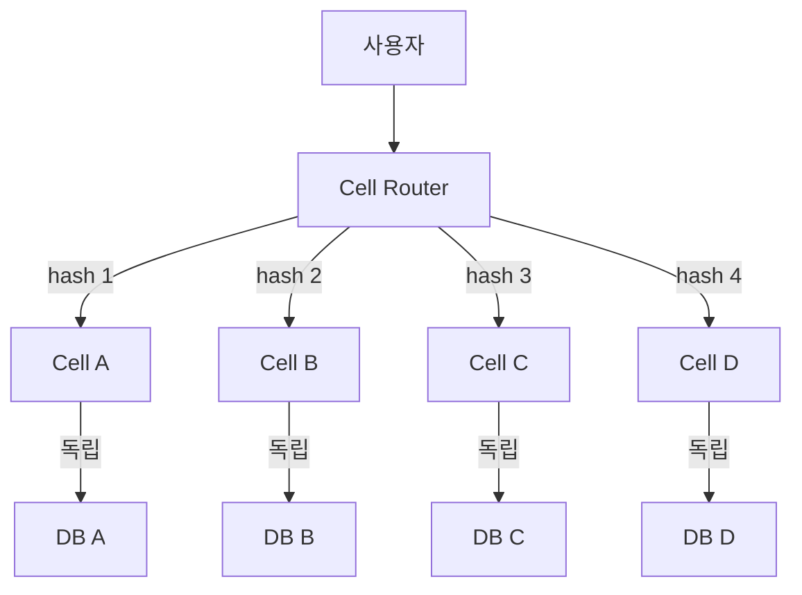
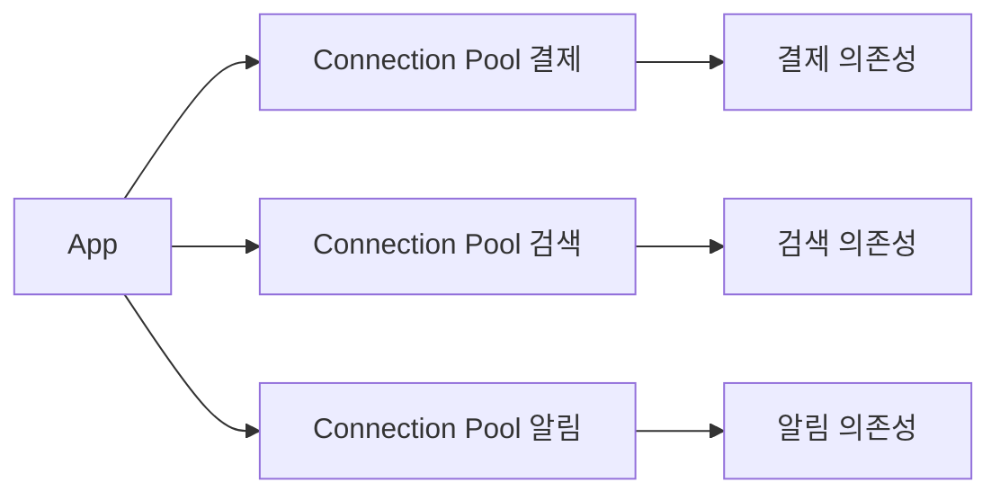
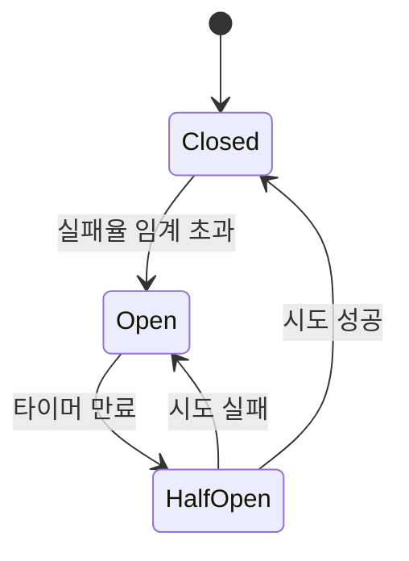

# Failure Modes

> **2026년의 자리**: 신뢰성 *설계*의 출발점은 *실패 모드를 식별·분류·격리*
> 하는 것. 핵심 도구는 **FMEA** (사전 분석), **블래스트 반경 분석**,
> **Cell-based 아키텍처** (격리), **Circuit Breaker / Bulkhead / Retry**
> (회복 패턴). AWS·Google·Cloudflare가 정전화. 2025년 학계는 *Microservices
> Recovery Patterns* 체계적 리뷰로 정리.
>
> 1~5인 환경에서는 *Top 3 SPoF 식별 + Circuit Breaker 1개 + 정기 의존성
> 검토*만으로도 큰 차이.

- **이 글의 자리**: [카오스](../chaos/chaos-engineering.md)가 *검증*이라면,
  이 글은 *설계*. 짝을 이룬다.
- **선행 지식**: SLO 합성(직렬·병렬), 분산 시스템 기본.

---

## 1. 한 줄 정의

> **Failure Mode**: "*시스템이 *어떻게 실패할 수 있는가*에 대한 식별된
> 시나리오.* 각 모드는 *원인·영향·완화*를 가진다."
>
> **Blast Radius**: "*하나의 실패가 영향을 미치는 *범위*.* 작을수록
> 신뢰성 ↑."

### 핵심 통찰

| 통찰 | 의미 |
|---|---|
| **단일 Root Cause는 신화** | 분산 시스템엔 다수 모드가 *동시*에 발현 |
| **격리가 최선의 방어** | 회복보다 *영향 차단* |
| **모든 의존성은 잠재 SPoF** | 외부 API·DB·DNS 등 모두 |
| **블래스트 반경은 *설계 결정*** | 우연이 아니라 의도적 |

---

## 2. Failure Mode 분류

### 7가지 표준 모드

| # | 모드 | 의미 | 예시 |
|:-:|---|---|---|
| 1 | **Crash Failure** | 컴포넌트 정지 | Pod OOM kill |
| 2 | **Omission Failure** | 응답 누락 | Network drop |
| 3 | **Timing Failure** | 응답 지연 | DB 잠금 |
| 4 | **Response Failure** | 잘못된 응답 | 데이터 오염 |
| 5 | **Byzantine Failure** | 임의·악의적 응답 | 보안 침해 |
| 6 | **Cascading Failure** | 연쇄 전파 | 의존 서비스 다운 |
| 7 | **Gray Failure** | *부분 실패* — 일부만 영향 | 특정 region 느림 |

> 출처: Crash/Omission/Timing/Response는 Cristian (1991), Hadzilacos·
> Toueg (1993) 계보. Byzantine은 Lamport·Shostak·Pease (1982) *Byzantine
> Generals Problem*. Cascading은 운영 용어. **Gray Failure**는 Microsoft
> Research (MSR) 2017 *"Gray Failure: The Achilles' Heel of Cloud-Scale
> Systems"* 정전.
>
> *Gray failure*가 현대 SaaS의 가장 어려운 모드 — 알람도 안 울리고
> 사용자 일부만 영향.

### 결정론적 실패 vs 확률적 실패

| 축 | 의미 | Retry 적용성 |
|---|---|---|
| **결정론적** | 같은 입력에 항상 같은 실패 | retry 무의미 — Circuit Breaker로 |
| **확률적** | 일시적 — 다음 시도엔 성공 가능 | retry 가치 있음 (Idempotent + backoff) |

> Retry 적용 전 *어느 축인지* 판단. 결정론적 실패에 retry는 부하만 가중.

---

## 3. SPoF (Single Point of Failure) 식별

### SPoF 7가지 카테고리

| 카테고리 | 예시 |
|---|---|
| **컴포넌트** | DB primary, 단일 LB, 단일 Region |
| **사람** | "그 사람만 아는" 시스템·권한 |
| **외부 의존** | 단일 결제 게이트웨이, DNS |
| **데이터** | 백업 없는 데이터, 단일 DB |
| **네트워크** | 단일 회선, 단일 BGP |
| **시간** | 인증서 만료, license 만료 |
| **프로세스** | 수동 배포, 단일 승인자 |

### SPoF 식별 워크숍 (2시간)

| 단계 | 활동 |
|---|---|
| 30분 | 시스템 토폴로지 다이어그램 |
| 30분 | 각 컴포넌트에 *"이게 죽으면?"* 질문 |
| 30분 | 외부 의존성 매핑 |
| 30분 | 우선순위 (영향 × 발생 가능성) |

---

## 4. 블래스트 반경 — 영향 범위 측정

### 블래스트 반경 차원

| 차원 | 의미 |
|---|---|
| **사용자 비율** | 1% / 10% / 100% |
| **지역** | 1 AZ / 1 Region / 글로벌 |
| **시간** | 5분 / 1h / 영구 |
| **데이터** | 단일 row / 테이블 / DB |
| **기능** | 결제 / 검색·결제 / 전체 |
| **하위 시스템** | 의존 서비스 N개 |

### 블래스트 반경 등급

| 등급 | 정의 | 예시 |
|---|---|---|
| **L0 (Zero)** | 사용자 영향 0 | Shadow 트래픽 |
| **L1 (Local)** | 단일 사용자·요청 | 일시적 retry |
| **L2 (Cell)** | 단일 cell·1% 사용자 | Cell-based 격리 효과 |
| **L3 (Region)** | 1 region 전체 | Region failover |
| **L4 (Global)** | 전 세계 | 인증 시스템 등 SPoF |

> 설계 목표: **모든 변경의 *실패 모드*가 L2 이하**. L3·L4는 *설계 검토
> 트리거*.

---

## 5. Cell-based 아키텍처 — 격리의 끝판왕

### 정의

> **Cell-based**: *시스템을 독립된 *cell*들로 나누고, 각 cell이 *자기
> 완결적으로* 동작. cell router가 요청을 특정 cell에 라우팅.* AWS·Slack·
> DoorDash가 표준화.

### 구조



| 속성 | 의미 |
|---|---|
| **독립적** | Cell 간 의존성 0 |
| **자기 완결** | DB·캐시·서비스 모두 cell 내 |
| **블래스트 반경 = 1 cell** | 4 cell이면 1개 죽어도 25%만 영향 |
| **결정적 라우팅** | user_id hash·tenant_id 등 |

### Cell-based의 도입 비용

| 비용 | 의미 |
|---|---|
| **운영 복잡도** | cell 수 × 인프라 |
| **데이터 분산** | 사용자별 다른 cell — 통합 분석 어려움 |
| **마이그레이션** | 기존 모놀리식 변환 어려움 |
| **Cross-cell 트랜잭션** | 거의 불가능 |

> *적합한 곳*: 멀티 테넌트 SaaS, 사용자 별로 자연 분할 가능한 워크로드.
> *부적합*: 글로벌 일관성 필요, 사용자 간 강한 상호작용.

### Cell 크기 결정

| 모델 | 의미 |
|---|---|
| **Fixed cell count** | 정수 cell, hash 분산 |
| **Sharded by tenant** | 테넌트당 cell |
| **Geo cell** | 지역별 cell |
| **Hybrid** | 큰 테넌트는 dedicated cell |

---

## 6. Bulkhead — 자원 격리

선박의 격벽에서 차용. *한 자원의 고갈이 다른 자원에 전파되지 않게.*

### 자원 풀 분리



### Bulkhead의 형태

| 형태 | 의미 |
|---|---|
| **Connection Pool 분리** | 의존성별 별도 풀 |
| **Thread Pool 분리** | CPU·blocking 작업 분리 |
| **Process 분리** | 독립 프로세스 |
| **Container 분리** | K8s Pod 분리 |
| **Rate Limit 분리** | endpoint별 quota |

### 적용 사례

| 시나리오 | Bulkhead 없을 때 | Bulkhead 있을 때 |
|---|---|---|
| 의존성 A 느려짐 | 공유 풀 고갈 → B도 응답 못 함 | A 풀만 고갈, B 정상 |
| 의존성 A 다운 | A 호출 timeout 누적 → cascading | A는 빠른 실패, B 영향 0 |
| 부하 급증 | 모든 풀 경쟁 | 풀별 격리, 영향 한정 |

> 의존성마다 독립 풀. 모든 풀에 *명시적 timeout*.

---

## 7. Circuit Breaker — 빠른 실패

의존성이 죽었는데 계속 호출 → 더 많은 자원 소모. **빠르게 포기.**

### 3 상태



| 상태 | 동작 |
|---|---|
| **Closed** | 정상 — 모든 요청 통과 |
| **Open** | 차단 — fallback 즉시 반환, 의존성 호출 X |
| **Half-Open** | 시험 — 일부 요청만 통과해 의존성 회복 검증 |

### 임계 설정

```yaml
# Resilience4j 예시 (공식 키 이름)
resilience4j:
  circuitbreaker:
    instances:
      payment-gateway:
        failure-rate-threshold: 50                    # 50% 실패 시 open
        sliding-window-size: 10                       # 직전 10개 요청
        wait-duration-in-open-state: 30s              # open 30초 유지
        permitted-number-of-calls-in-half-open-state: 3  # half-open 3건 시도
        minimum-number-of-calls: 5                    # 최소 5건 후 평가
```

### Circuit Breaker 안티패턴

| 안티패턴 | 처방 |
|---|---|
| **모든 호출에 적용** | 외부 의존성·flaky만 |
| **fallback 없음** | fallback 응답 또는 cached 값 |
| **timeout 없음** | 반드시 timeout 설정 |
| **임계 너무 빡빡** (10% 실패) | 50%~70% 권장 |
| **자동 회복 X** | half-open 단계 활용 |

---

## 8. Retry — 재시도의 함정

### 재시도가 *문제를 키우는* 경우

```
의존성이 느림 → 클라이언트 timeout → retry
→ 의존성에 더 많은 요청 → 더 느려짐 → 더 많은 retry
→ Cascading Failure
```

> Retry는 *의존성을 죽이는* 가장 흔한 원인. 신중한 설계 필요.

### 안전한 Retry 5가지 룰

| 룰 | 의미 |
|---|---|
| **Idempotent만** | 같은 요청 N번 = 1번과 동일 결과 |
| **Exponential Backoff** | 1s → 2s → 4s ... |
| **Jitter** | randomize — 동시 retry 회피 |
| **Retry budget / 상한** | 최대 N회·M초 |
| **Circuit Breaker 결합** | open 상태에서 retry X |

### 재시도 패턴

```python
# 좋은 retry
for attempt in range(3):
    try:
        return call()
    except RetryableError:
        time.sleep((2 ** attempt) + random.uniform(0, 1))  # backoff + jitter
raise CircuitOpenException
```

### Hedged Request — Tail Latency 대응

Dean·Barroso *"The Tail at Scale"* (CACM 2013) 정전 패턴.

| 측면 | Retry | Hedged Request |
|---|---|---|
| 시점 | 실패 *후* 재시도 | p95 시간 *경과 시* 추가 요청 |
| 자원 | 직렬 — 시간 누적 | 병렬 — 시간 단축 |
| 부하 | 의존성에 부하 가중 | 1.05~1.1배 (5~10% 추가) |
| 효과 | 단일 실패 회복 | tail latency 단축 |
| 적합 | Idempotent + 일시 실패 | 읽기 + p95 빠름 vs p99 느림 |

```
요청 발사 → p95 시간 경과 → 두 번째 요청 발사 (병렬)
→ 먼저 응답 도착하는 것 사용, 다른 것 cancel
```

> 검색·읽기·캐시 조회에 효과. 쓰기엔 부적합. Envoy·gRPC 기본 지원.

### Retry Budget — 누적 보호

| 도구 | 설정 |
|---|---|
| **Envoy** | `retry_budget: { budget_percent: 20% }` |
| **Linkerd** | `RetryBudget: 0.2` |
| **Istio** | VirtualService `retries.attempts` + 별도 budget |

> 직전 N초 정상 요청의 20%만 retry로 — 폭주 차단. *budget 없는 retry =
> cascading 가속기*.

---

## 9. Timeout — 모든 호출의 의무

### Timeout이 없으면

| 결과 | 의미 |
|---|---|
| **자원 고갈** | thread·connection 무한 대기 |
| **Cascading Failure** | 한 의존성이 모든 호출 막음 |
| **사용자 경험 최악** | 사용자도 무한 대기 |
| **메트릭 왜곡** | latency 통계 의미 X |

### Timeout 계층

```
사용자 요청 30s
  └ 서비스 A 25s
      └ 서비스 B 10s
          └ DB 5s
```

| 원칙 | 의미 |
|---|---|
| **상위 > 하위** | 사용자 timeout > 서비스 > DB |
| **재시도 시간 포함** | 25s = 단일 호출 timeout × retry 수 |
| **최악의 경우 보호** | 99.9% 사례 통과하는 시간 |

> *모든 외부 호출에 명시적 timeout*. 라이브러리 기본값 신뢰 X.

---

## 10. Backpressure — 부하 제어

### 정의

> *서비스가 처리할 수 있는 양을 *명시적으로 알리고*, 초과 요청은 *거절·
> 지연*.* 사용자에 *명시적 실패*가 *내부 cascading*보다 안전.

### 구현 방식

| 방식 | 의미 |
|---|---|
| **Rate Limiting** | 초당 N요청 상한 |
| **Concurrency Limit** | 동시 처리 N건 상한 |
| **Queue 길이 제한** | 대기열 N건 초과 시 거절 |
| **Adaptive Concurrency** | 실시간 자원 상태로 동적 조정 |
| **Load Shedding** | 우선순위 낮은 요청 거절 |

### 대표 도구

| 도구 | 용도 |
|---|---|
| **Envoy / Istio** | Mesh 레이어 rate limit |
| **API Gateway** (Kong·NGINX) | edge에서 보호 |
| **K8s HPA + KEDA** | 부하 기반 스케일 |
| **Resilience4j** | 코드 레벨 |
| **Adaptive Concurrency** | Netflix Concurrency Limits |

---

## 11. Failover & Redundancy

### 다중 인스턴스 패턴

| 패턴 | 의미 | 가용성 |
|---|---|---|
| **Active-Active** | 모두 활성, LB 분산 | 최고 |
| **Active-Standby** | 하나 활성, 다른 대기 | 중간 |
| **Active-Passive Cold** | 대기 인스턴스 stopped | 낮음 |
| **N+1·N+2** | 정상 N개 + 여분 1·2개 | N에 따라 |

### Multi-AZ vs Multi-Region

| 측면 | Multi-AZ | Multi-Region |
|---|---|---|
| **블래스트 반경 보호** | 1 AZ 다운 | 1 Region 다운 |
| **레이턴시** | 낮음 (10ms) | 높음 (50~200ms) |
| **데이터 일관성** | 강 일관성 가능 | 결과적 일관성 |
| **비용** | 1.5~2배 | 2~5배 |
| **권장** | 모든 프로덕션 | 비즈니스 critical |

### Failover 검증

> *작동하지 않는 failover는 없는 것과 같다.* 분기 1회 *실제 시도* 필수.

### Static Stability — AWS 권장 원칙

> *"Control plane 의존 없이 data plane이 동작 유지."*

| 시나리오 | Dynamic Stability | Static Stability |
|---|---|---|
| **AZ 장애 시** | 잔여 AZ로 자동 재배치 (control plane 의존) | 미리 N+1 재배치, AZ 손실해도 즉시 흡수 |
| **Failover 시** | DNS·LB control plane 즉시 응답 필요 | DNS·LB 정상 가정 X — 사전 routing |
| **자원 사용** | 효율적 | 1.5~2배 |
| **장애 견고성** | control plane이 SPoF | data plane 단독 동작 |

> 핵심 서비스(인증·결제)는 *Static Stability*. 효율 vs 신뢰성 trade-off.

### Load Balancing 알고리즘

| 알고리즘 | 의미 | 강점 |
|---|---|---|
| **Round Robin** | 순차 분배 | 단순 |
| **Least Connections** | 최소 활성 연결 | 부하 분산 양호 |
| **Power of Two Choices (P2C)** | 무작위 2개 중 적은 부하 | 확장성·tail latency ↓ |
| **EWMA** | 지수 가중 응답시간 평균 | 느린 backend 회피 |
| **Least Request** | 최소 요청 수 | gRPC·HTTP/2 |

> Envoy 기본은 Round Robin이지만, 마이크로서비스에서 *P2C·EWMA·Least
> Request*가 권장. 느린 backend (Limp mode)에 트래픽 쏟아지지 않도록.

### Limp Mode — Gray Failure 처방

| 상태 | 의미 | 처방 |
|---|---|---|
| **Healthy** | 정상 | 트래픽 비례 |
| **Limp** | 살아 있지만 느림 (Gray) | LB가 weight 감소 (P2C·EWMA로 자동) |
| **Dead** | 응답 X | LB가 격리 (health check) |

> Gray failure가 어려운 이유: Health check는 통과 (살아 있음), 하지만 *느림*.
> Active health check만으로 부족 → P2C·EWMA로 *부하 기반 weighting*.

### Shuffle Sharding — Cell-based의 진화

AWS Route 53 Infima 라이브러리. *각 사용자/테넌트가 *고유한 cell 부분
집합*을 받음.*

```
8 cell 시스템에서 각 사용자가 임의 2개 cell만 사용
→ 1 cell 다운 시 모든 사용자 영향 25%
→ 2 cell 동시 다운 시 영향 비율 = (2/8 × 1/7) = 3.6%만 둘 다 영향받음
```

| 효과 | 의미 |
|---|---|
| 다중 cell 장애 격리 | "운 나쁜" 사용자 비율 극소화 |
| Cell 수 증가 효과 | n 사용자 → n cell 추가 시 영향 비율 ↓↓ |
| Cell Router 부담 | hash 알고리즘 정밀화 필요 |

> 멀티테넌트 SaaS 표준. AWS·Cloudflare가 운영 중.

---

## 12. Cascading Failure — 연쇄 장애

### 발생 매커니즘


### 방지 수단

| 수단 | 의미 |
|---|---|
| **Circuit Breaker** | 빠른 실패 |
| **Bulkhead** | 자원 격리 |
| **Retry budget** | 무한 retry 차단 |
| **Backpressure** | 자기 보호 |
| **Timeout 계층** | 최악 시간 상한 |
| **Graceful degradation** | 일부 기능 끄고 핵심 유지 |

### Graceful Degradation 예시

| 정상 | Degradation |
|---|---|
| 추천 + 검색 + 결제 | 검색 + 결제 (추천 끔) |
| 실시간 재고 | 5분 캐시 재고 |
| 풀 통계 | 핵심 메트릭만 |
| 개인화 | 일반 콘텐츠 |

> 서비스 *전부 다운*보다 *기능 일부 축소*가 사용자에게 친화적.

---

## 13. SRE 관점의 의존성 분석

### Dependency Map

```markdown
# Service: payment-api

## Hard dependencies (필수)
- payment-db (PostgreSQL)
- auth-service
- payment-gateway (외부 PG사)

## Soft dependencies (없어도 일부 동작)
- recommendation-service (실패 시 빈 추천)
- analytics-service (비동기, 손실 허용)

## SLO 합성
- payment-db SLO: 99.95%
- auth-service SLO: 99.9%
- payment-gateway SLA: 99.95%
- Hard 직렬 합성: 99.95% × 99.9% × 99.95% = 99.80% (모두 정상이어야 함)
- 결제 SLO 99.9% 달성 *불가능* — Circuit Breaker로 게이트웨이 fallback 필요
- 단, fallback이 있는 soft path는 OR 조합 (병렬) 적용 — 의존성을 *논리적으로* 약화

## 재시도·circuit breaker
- payment-db: retry 3 × backoff, no CB (지속 호출 필요)
- auth-service: retry 2, CB (50% / 30s open)
- payment-gateway: retry 1, CB (30% / 60s open), fallback queue
```

> *의존성 SLO 곱셈*이 본인 SLO보다 빡빡하면 *Circuit Breaker + fallback*
> 으로 의존성을 *논리적으로 약화*.

---

## 14. 안티패턴

| 안티패턴 | 증상 | 처방 |
|---|---|---|
| **SPoF 식별 안 함** | 사고 후에야 발견 | 분기 워크숍 |
| **Timeout 부재** | Cascading | 모든 호출에 명시 |
| **Retry 무한** | 의존성 죽임 | budget + backoff + jitter |
| **Circuit Breaker 부재** | 빠른 실패 X | 외부 의존성에 의무 |
| **Bulkhead 부재** | 자원 cascading | 풀 분리 |
| **Multi-AZ 미사용** | 단일 AZ 다운으로 전체 영향 | 표준 운영 |
| **Failover 미검증** | 진짜 사고 시 작동 X | 분기 검증 |
| **Graceful Degradation 부재** | All-or-nothing | 핵심 vs 부수 분리 |

---

## 15. 1~5인 팀의 신뢰성 설계 — 우선순위

### 첫 분기 — 식별

| 우선 | 활동 |
|---|---|
| 1 | Top 5 SPoF 식별 (워크숍) |
| 2 | 모든 외부 호출 Timeout 점검 |
| 3 | DB·외부 API에 Circuit Breaker 1개 |

### 둘째 분기 — 격리

| 우선 | 활동 |
|---|---|
| 4 | 의존성별 connection pool 분리 (Bulkhead) |
| 5 | Multi-AZ 검증 (없으면 도입) |
| 6 | Graceful Degradation 1개 기능 |

### 셋째 분기 — 검증

| 우선 | 활동 |
|---|---|
| 7 | Failover 분기 검증 |
| 8 | Backpressure 도입 (rate limit) |
| 9 | 의존성 SLO 합성 분석 |

> Cell-based는 보통 *후순위*. 작은 팀에는 무거움. 위 9개부터.

---

## 16. 한눈에 보기

| 항목 | 한 줄 |
|---|---|
| **Failure Mode** | 시스템이 *어떻게* 실패하는가 — Crash·Omission·Timing·Response·Byzantine·Cascading·Gray |
| **Blast Radius** | 영향 범위 — L0~L4, L2 이하 목표 |
| **Cell-based** | cell 4개 → 1 cell 다운 시 25% 영향 |
| **Bulkhead** | 의존성별 풀 분리 |
| **Circuit Breaker** | 빠른 실패 — 50% 실패 → open |
| **Retry** | Idempotent + backoff + jitter + budget |
| **Timeout** | 모든 호출에 명시, 계층 구조 |
| **Backpressure** | rate limit + concurrency + queue 한계 |
| **Cascading 방지** | CB + Bulkhead + Retry budget + Graceful |
| **시작** | Top 5 SPoF + Timeout + CB 1개 |

---

## 참고 자료

- [Google SRE Book — Addressing Cascading Failures](https://sre.google/sre-book/addressing-cascading-failures/) (확인 2026-04-25)
- [Google SRE Book — Handling Overload](https://sre.google/sre-book/handling-overload/) (확인 2026-04-25)
- [AWS — Cell-based Architecture (Reducing Blast Radius)](https://docs.aws.amazon.com/wellarchitected/latest/reducing-scope-of-impact-with-cell-based-architecture/reducing-scope-of-impact-with-cell-based-architecture.html) (확인 2026-04-25)
- [Resilience4j Documentation](https://resilience4j.readme.io/) (확인 2026-04-25)
- [Microsoft — Circuit Breaker Pattern](https://learn.microsoft.com/en-us/azure/architecture/patterns/circuit-breaker) (확인 2026-04-25)
- [Microsoft — Bulkhead Pattern](https://learn.microsoft.com/en-us/azure/architecture/patterns/bulkhead) (확인 2026-04-25)
- [Netflix — Adaptive Concurrency Limits](https://github.com/Netflix/concurrency-limits) (확인 2026-04-25)
- [arXiv 2512.16959 — Resilient Microservices Recovery Patterns (2025)](https://arxiv.org/abs/2512.16959) (확인 2026-04-25)
