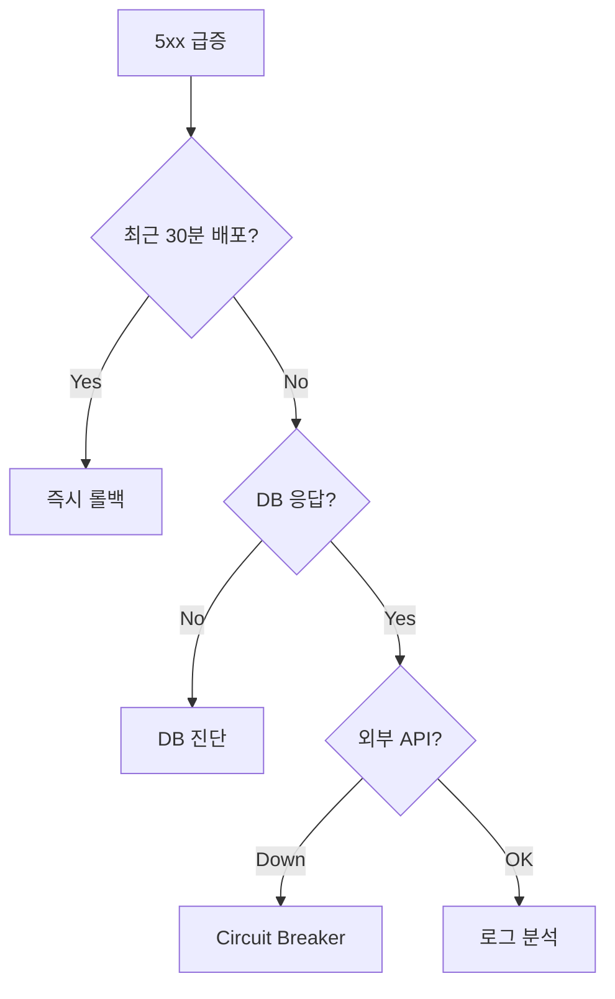

# Runbook 템플릿

> **2026년의 자리**: Runbook은 *알람·사고에 대응하는 단계별 체크리스트*.
> Playbook(전략 가이드)과 구분된다. **모든 Page 알람에 Runbook 링크 필수**
> 가 산업 표준 — 그렇지 않으면 On-call이 매번 처음부터 디버깅. 2024-25년
> 트렌드는 *자동 실행* — 진단·롤백·격리를 사람 대신 코드가.
>
> 1~5인 환경에서는 한 페이지 Runbook + 자주 쓰는 명령어 모음으로 시작.
> *Top 10 알람*에 Runbook 100% 커버리지가 첫 목표.

- **이 글의 자리**: [On-call 로테이션](../incident/on-call-rotation.md)에서
  강조한 *알람:Runbook 매핑*의 실체. [IR](../incident/incident-response.md)
  완화 단계의 도구.
- **선행 지식**: 알람·페이저, 사고 라이프사이클.

---

## 1. 한 줄 정의

> **Runbook**: "*특정 알람·증상에 대해 *어떻게 진단하고 복구할지*를 단계별
> 명령어·결정 트리로 적은 문서.* 즉시 실행 가능해야 한다."

### Runbook ≠ Playbook

| 측면 | Runbook | Playbook |
|---|---|---|
| **수준** | 전술 (tactical) | 전략 (strategic) |
| **대상** | 특정 알람·증상 | 사고 *전반* 대응 |
| **내용** | 명령어·진단·복구 단계 | 역할·소통·에스컬레이션 |
| **시점** | 사고 *중* 즉시 참조 | 사고 *전* 합의 |
| **예시** | "5xx 급증 진단" | "SEV1 대응 절차" |
| **소유** | 서비스 팀 | SRE Lead |

> 둘 다 필요. Playbook 위에 Runbook들이 매달림.

---

## 2. Runbook의 4가지 가치

| # | 가치 | 의미 |
|:-:|---|---|
| 1 | **MTTR 단축** | 매번 디버깅 X — 검증된 경로 |
| 2 | **지식 단일점 제거** | 한 사람만 아는 시스템 → 누구나 |
| 3 | **신규 입사자 온보딩** | 첫 페이지부터 작업 가능 |
| 4 | **자동화 출발점** | 수동 Runbook → 자동 실행 |

> Runbook 없는 알람 = *On-call에 책임 떠넘기기*. 알람 만든 사람의 의무.

---

## 3. 표준 Runbook 템플릿 — 9 섹션

````markdown
# Runbook: [Alert Name 또는 증상]

## Status
- 작성: 2026-04-25
- 최근 검증: 2026-04-15
- 소유자: payment-team
- 자동화 수준: Manual / Semi-auto / Auto

---

## 1. Overview
- 알람: PaymentSLOFastBurn
- 증상: payment-api 5xx 급증 (Burn Rate 14.4×)
- 영향: 결제 사용자 — SEV2~1 가능
- 선행 지식: payment-api 아키텍처, Argo Rollouts

## 2. Severity Hint
- 5xx > 10% : SEV2
- 5xx > 50% : SEV1
- 데이터 정합성 의심 : SEV1 자동

## 3. 1분 진단 (Quick Triage)
실행 후 결과로 분기.

```bash
# 1. 최근 배포 여부
kubectl -n payment rollout history deployment/payment-api | tail -5

# 2. 5xx 분포
curl -s "http://prometheus/api/v1/query?query=..." | jq

# 3. DB 상태
kubectl -n payment exec deploy/payment-api -- pg_isready
```

## 4. 결정 트리



## 5. 복구 절차

### Path 1 롤백
```bash
kubectl -n payment argo rollouts abort payment-api
kubectl -n payment argo rollouts undo payment-api
```

### Path 2 DB 격리
...

### Path 3 Circuit Breaker
...

## 6. 검증
- [ ] 5xx < 1% 회복 확인
- [ ] Burn Rate < 1× 회복
- [ ] 카나리 단계 정상화

## 7. 에스컬레이션
- 5분 내 미복구 → IC 호출
- DB 데이터 손상 의심 → DBA 호출
- 외부 결제 게이트웨이 → 벤더 사전 합의 라인

## 8. 사후 작업
- [ ] 포스트모템 작성 (SEV1·2)
- [ ] Runbook 업데이트 (새 케이스 발견 시)
- [ ] 자동화 가능 여부 검토

## 9. 관련 자료
- 아키텍처 다이어그램
- 최근 포스트모템
- 관련 알람
````

---

## 4. 좋은 Runbook의 7가지 속성

| # | 속성 | 의미 |
|:-:|---|---|
| 1 | **Actionable** | "확인하라" X, "이 명령어를 실행" |
| 2 | **Copy-pastable** | 명령어 그대로 복사 가능 — 변수는 ENV로 |
| 3 | **결정 트리** | "이러면 A, 저러면 B" 명확 분기 |
| 4 | **검증 단계** | "정말 회복됐는지" 확인 |
| 5 | **재시작 안전** | 중간 멈춰도 처음부터 재실행 안전 |
| 6 | **버전 관리** | Git에 — 변경 이력 추적 |
| 7 | **테스트됨** | 분기 1회 시뮬레이션 |

### Runbook 작성 안티패턴

| 안티패턴 | 처방 |
|---|---|
| **"문서 참조"로 끝** | 명령어를 *Runbook 안에* |
| **변수 하드코딩** | `${SERVICE}`, `${NAMESPACE}` |
| **유효성 검증 없음** | 각 단계 후 확인 명령 |
| **분기 없음** | "이러면 X" 결정 트리 |
| **오래된 정보** | 분기 1회 검증 — last_verified |
| **너무 김** | 한 알람 = 한 페이지 |

---

## 5. Runbook 자동화 단계


| 단계 | 의미 | 예시 |
|:-:|---|---|
| **0. Manual** | 사람이 명령어 실행 | bash 스크립트 모음 |
| **1. Semi-auto** | 도구가 진단, 사람이 결정 | "이 알람에 [Rollback] 버튼" |
| **2. Auto** | 사람이 트리거, 자동 실행 | Slack `/runbook payment-rollback` |
| **3. Self-healing** | 알람 자체가 자동 트리거 | Argo Rollouts 자동 롤백 |

### 자동화 우선순위

| 기준 | 점수 |
|---|---|
| **빈도** | 자주 발생할수록 ↑ |
| **단순성** | 분기 적을수록 ↑ |
| **위험성** | 잘못 실행해도 회복 가능 |
| **반복 가능성** | 매번 같은 절차 |

> 위 4개 모두 ↑ → 자동화. 빈도 낮거나 위험 크면 *수동 유지*.

---

## 6. 자가치유 (Self-healing) 패턴

| 패턴 | 의미 | 도구 |
|---|---|---|
| **자동 재시작** | OOM·crash → Pod 재시작 | K8s liveness probe |
| **자동 스케일** | CPU·QPS 임계 → 추가 인스턴스 | HPA·KEDA |
| **자동 롤백** | SLO 위반 → 카나리 abort | Argo Rollouts·Flagger |
| **Circuit Breaker** | 의존성 다운 → 트래픽 차단 | Istio·Resilience4j |
| **DB Failover** | Primary 다운 → Replica 승격 | Patroni·CloudSQL |
| **Disk 자동 정리** | 70% 임계 → 로그 회전 | systemd-tmpfiles·logrotate |

> 자가치유는 *Runbook의 자동 실행*. 같은 결정 트리지만 사람 X.

---

## 7. Observability 통합 — 알람과 코드로 연결

Prometheus 커뮤니티 컨벤션: **`runbook_url` 라벨**.

```yaml
# Alertmanager rule
- alert: PaymentSLOFastBurn
  expr: |
    slo:sli_error:ratio_rate5m > (14.4 * 0.001)
    and slo:sli_error:ratio_rate1h > (14.4 * 0.001)
  for: 2m
  labels:
    severity: page
  annotations:
    summary: "Payment SLO fast burn"
    runbook_url: "https://wiki.example.com/runbooks/payment-slo-burn"
    dashboard_url: "https://grafana.example.com/d/payment-slo"
```

| 통합 | 효과 |
|---|---|
| **Alertmanager → Slack** | 알람 메시지에 Runbook 링크 자동 첨부 |
| **PagerDuty annotation** | 페이지 화면에 Runbook 버튼 |
| **Grafana panel link** | 패널 클릭 → Runbook |
| **Backstage TechDocs** | 서비스 카탈로그에 Runbook 인덱스 |
| **incident.io / FireHydrant** | 알람 자동 트리거 + Runbook 시작 |

> *알람과 Runbook은 같은 PR에서* — 관리 분리는 Drift 원인. SLO 정의 시
> Runbook도 동시 작성.

---

## 8. 변수·환경 관리

| 패턴 | 도구 | 용도 |
|---|---|---|
| **ConfigMap** | K8s | 환경별 설정 (URL·임계) |
| **External Secret** | ESO + Vault | 민감 자격증명 |
| **ENV file** | dotenv | 로컬·dev 빠른 시작 |
| **Backstage scaffolder** | Backstage | 다중 서비스 Runbook 생성 |
| **Helm values** | Helm | 환경별 (dev/stg/prod) override |

### Runbook 변수 표준

```bash
# Runbook 안에서
SERVICE="${SERVICE:-payment-api}"
NAMESPACE="${NAMESPACE:-payment}"
ENV="${ENV:-prod}"

kubectl -n "$NAMESPACE" rollout history deployment/"$SERVICE"
```

> 환경별 분리: dev/stg/prod 각각의 Runbook을 *복제*하지 말고 *변수로
> 일원화*. Backstage scaffolder로 새 서비스 추가 시 자동 생성.

---

## 9. Disaster Recovery (DR) Runbook — 별도 트랙

대규모 사고는 *일반 Runbook과 다른 절차*.

| DR 시나리오 | 일반 Runbook과 차이 |
|---|---|
| **Region failover** | RTO·RPO 검증, 데이터 정합성, BCP 발동 |
| **Multi-AZ 손실** | 자동 failover 작동·수동 fallback |
| **백업 복원** | 데이터 시점·선택적 복원 |
| **랜섬웨어** | 보안 IR 트랙 결합, 격리·복원 |
| **DB 전체 손상** | PITR (Point-In-Time Recovery), 정합성 검증 |

### DR Runbook 추가 섹션

```markdown
# DR Runbook: payment-api Region Failover

## RPO·RTO 합의
- RPO: < 5분 (데이터 손실 허용)
- RTO: < 30분 (복구 시간)

## 사전 조건 검증
- [ ] Standby region 헬스 OK
- [ ] DNS TTL 60s 이하
- [ ] 데이터 동기화 lag < RPO

## Failover 절차
1. CSO·임원 승인 (필수)
2. DNS 전환 (Route53·Cloudflare)
3. Active region 트래픽 차단
4. Standby region promote (DB)
5. 검증 (CUJ E2E 5분)

## 외부 통보 의무
- 고객: Status page (15분 내)
- 규제: 금융감독원 등 (24h 내)
- 법무: 즉시
- 보험사: 24h 내

## Rollback (실패 시)
- DNS 원복
- 원래 region 복구
- 데이터 정합성 비교
```

> DR Runbook은 *연 1회 실제 훈련*. 실행 안 한 DR 절차는 *없는 것*.

---

## 10. AI/LLM 보조 — 2025-26년 트렌드

| 도구 | 활용 |
|---|---|
| **incident.io AI** | 사고 자동 요약 + Runbook 추천 |
| **PagerDuty AIOps** | 알람 노이즈 감축 + Runbook 자동 트리거 |
| **Rootly AI** | 로그 RCA + 액션 제안 |
| **GitHub Copilot** | Runbook 작성 보조 |
| **사내 LLM RAG** | 포스트모템 검색 + Runbook 자동 생성 |

> **주의**: AI 제안은 *검증된 Runbook을 대체하지 않음*. *발견 보조*로 활용.

---

## 11. Runbook 자동화 도구

| 도구 | 형태 | 강점 |
|---|---|---|
| **incident.io / FireHydrant** | 사고 통합 | 알람 → Runbook 자동 트리거 |
| **Rundeck** | 작업 자동화 | 권한·승인 워크플로 |
| **AWS Systems Manager** | AWS 통합 | 멀티 인스턴스 동시 실행 |
| **Ansible Automation** | IaC 자동화 | 멱등성·재실행 안전 |
| **StackStorm** | 이벤트 자동화 | 알람·트리거 통합 |
| **K8s Operators** | K8s 네이티브 | 자가치유 패턴 |
| **GitHub Actions** | CI/CD 통합 | 작업 추적 |
| **ChatOps (Slack 봇)** | 채팅 인터페이스 | War Room 통합 |

### ChatOps 예시

```
@bot runbook payment-rollback
> 실행하시겠습니까? [Approve / Reject]
> Approver: @oncall

@oncall: Approve

> Running: kubectl argo rollouts abort payment-api
> Running: kubectl argo rollouts undo payment-api
> Result: rolled back to v2.2.5
> Verification: 5xx dropped 35% → 0.4%
```

---

## 12. Runbook 라이프사이클


| 단계 | 트리거 | 산출 |
|---|---|---|
| **작성** | 새 알람 / 사고 후 | Runbook 초안 |
| **검증** | 분기 1회 / 신규 작성 직후 | 실제 실행 + 시간 측정 |
| **운영 사용** | 알람 발사 시 | 사용 빈도 추적 |
| **업데이트** | 새 케이스 발견 / 시스템 변경 | 변경 로그 |
| **자동화** | 빈도·단순성 충족 | 자동 트리거 |
| **은퇴** | 시스템 철거 시 | 아카이브 |

### last_verified 정책

| 신선도 | 행동 |
|---|---|
| **< 30일** | 정상 |
| **30~90일** | 경고 — 다음 분기 검증 |
| **> 90일** | 위험 — 즉시 재검증 |
| **> 180일** | 사용 금지 — 새로 작성 |

---

## 13. Top 10 알람 — Runbook 우선순위

작성 우선순위는 *호출 빈도 × 영향*.

```sql
-- PagerDuty 데이터
SELECT alert_name, COUNT(*) as count, AVG(severity) as avg_sev
FROM incidents
WHERE created_at > NOW() - INTERVAL 90 DAY
GROUP BY alert_name
ORDER BY count * avg_sev DESC
LIMIT 10;
```

> 분기 끝에 위 쿼리 → Top 10 알람 Runbook 커버리지 100% 목표.

---

## 14. Runbook 검증 — 시뮬레이션

### Wheel of Misfortune (회의실)

| 단계 | 활동 |
|---|---|
| 1 | 진행자가 알람 시나리오 제시 |
| 2 | 한 명이 IC 역할, *Runbook만 보고* 진행 |
| 3 | 다른 사람들이 결정 검증 |
| 4 | Runbook 갭 발견 → 즉시 보완 |

### Live Drill (실제 시스템)

| 단계 | 활동 |
|---|---|
| 1 | 사전 공지된 시간에 가짜 장애 주입 |
| 2 | On-call이 Runbook으로 대응 |
| 3 | 실행 시간·결정 측정 |
| 4 | 실패한 단계는 다음 분기 개선 |

> 자세한 내용: [카오스 엔지니어링](../chaos/chaos-engineering.md).

---

## 15. 미니 Runbook — 한 페이지

1~5인 팀이 *오늘* 시작할 수 있는 형식.

````markdown
# Runbook: payment-api 5xx 급증

## 빠른 진단 (1분)
```bash
# 최근 배포 확인
kubectl -n payment rollout history deployment/payment-api | tail -3

# 5xx 분포
kubectl -n payment logs -l app=payment-api --since=5m | grep -c "status=5"

# DB 응답
kubectl -n payment exec deploy/payment-api -- pg_isready -t 3
```

## 분기별 행동
- 30분 내 배포? → `kubectl argo rollouts undo payment-api`
- DB 응답 없음? → @dba-oncall 호출
- 외부 API 다운? → CircuitBreaker on (Slack `/cb pg-on`)
- 위 모두 아님? → IC 호출, 로그 분석

## 검증
- 5xx < 1% 1분 유지 확인
- Burn Rate < 1×

## 에스컬레이션
- 5분 미복구 → IC
- DB 데이터 의심 → DBA + 임원

## 관련
- 아키텍처 wiki/payment
- 최근 포스트모템 wiki/pm/2026-04-15

소유자: alice (월요일 검증)
last_verified: 2026-04-22
````

---

## 16. Runbook 메트릭

| 메트릭 | 목표 |
|---|---|
| **Top 10 알람 Runbook 커버리지** | 100% |
| **모든 Page 알람 Runbook 커버리지** | 100% |
| **Runbook 평균 신선도** | < 60일 |
| **Runbook 사용률** (실행 / 알람) | > 80% |
| **Runbook 실행 시간** (Quick Triage 평균) | < 2분 |
| **자동화 비율** | > 30% (성숙한 팀) |

---

## 17. 안티패턴 — Runbook 실패

| 안티패턴 | 증상 | 처방 |
|---|---|---|
| **Runbook 없는 알람** | On-call이 매번 처음부터 | 알람 == Runbook 강제 |
| **너무 길어 못 읽음** | 사고 중 무시 | 1페이지·결정 트리 |
| **검증 안 됨** | 실행 시 작동 X | 분기 시뮬레이션 |
| **변수 하드코딩** | 다른 환경에 안 됨 | ENV·파라미터 |
| **결정 트리 없음** | 어디로 갈지 모름 | mermaid·flowchart |
| **검증 단계 없음** | "복구된 줄 알았는데..." | 매 단계 verify |
| **분기 1회 검증 안 함** | 시스템 변경 반영 X | last_verified 자동화 |
| **자동화 우선순위 없음** | 같은 작업 100번 | Top 10에서 시작 |

---

## 18. 한눈에 보기

| 항목 | 한 줄 |
|---|---|
| **Runbook의 본질** | 즉시 실행 가능한 단계별 체크리스트 |
| **Playbook과 차이** | Runbook = 전술, Playbook = 전략 |
| **표준 9 섹션** | Overview·Severity·Triage·결정 트리·복구·검증·에스컬레이션·사후·관련 |
| **속성 7가지** | Actionable·Copy-pastable·결정 트리·검증·재시작 안전·버전·테스트 |
| **자동화 단계** | Manual → Semi → Auto → Self-healing |
| **신선도** | 90일 이내 검증, 180일 이상 = 사용 금지 |
| **우선순위** | Top 10 알람 100% 커버리지 |
| **시뮬레이션** | 분기 Wheel of Misfortune + 반기 Live Drill |
| **시작 키트** | 한 페이지 미니 Runbook + Top 10 식별 |

---

## 참고 자료

- [Google SRE Workbook — On-Call (Runbook 강조)](https://sre.google/workbook/on-call/) (확인 2026-04-25)
- [SolarWinds — SRE Runbook Template](https://www.solarwinds.com/sre-best-practices/runbook-template) (확인 2026-04-25)
- [Nobl9 — Runbook Example Best Practices](https://www.nobl9.com/it-incident-management/runbook-example) (확인 2026-04-25)
- [Rootly — Incident Response Runbooks Guide](https://rootly.com/incident-response/runbooks) (확인 2026-04-25)
- [incident.io — Automated Runbooks Guide](https://incident.io/blog/automated-runbook-guide) (확인 2026-04-25)
- [Squadcast — Effective Runbook Templates](https://www.squadcast.com/sre-best-practices/runbook-template) (확인 2026-04-25)
- [Argo Rollouts — Automated Rollback](https://argoproj.github.io/rollouts/) (확인 2026-04-25)
