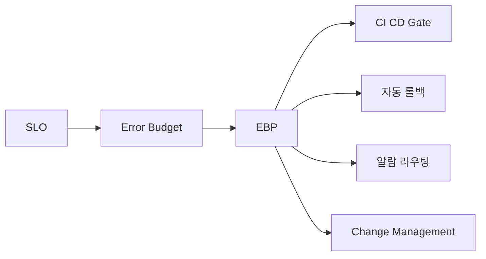

# Error Budget 정책

> **2026년의 자리**: Error Budget Policy(EBP)는 *SLO를 진짜로 만드는*
> 문서. SLO만 있고 정책이 없으면 *장식*. Google SRE Workbook이 산업
> 표준으로 정립한 형태는 **사전 협의된 stakeholder 간 계약** —
> SRE·개발·제품·경영진의 이름이 들어간다.
>
> 1~5인 환경에서도 *반드시 작성*. 한 페이지짜리 EBP가 100명 조직의
> 정치적 갈등을 막는다.

- **이 글의 자리**: [SLI·SLO·SLA](../principles/sli-slo-sla.md) → [SLI 선정](sli-selection.md)
  → [Burn Rate](slo-burn-rate.md) → 이 글. SLO 시리즈의 마무리.
- **선행 지식**: SLI·SLO 정의, Burn Rate 모델.

---

## 1. 한 줄 정의

> **Error Budget Policy**: "**SLO 위반 또는 임박 시 *누가·무엇을·어떻게*
> 한다**의 사전 합의 문서. 정책은 *질문이 아니라 답*이다 — 사고 한가운데
> 토론하지 않는다."

### 왜 정책이 필요한가

| 정책 없음 | 정책 있음 |
|---|---|
| SLO 위반 시 매번 토론 | 합의된 행동 자동 발동 |
| 개발 vs SRE 갈등 정치화 | 사전 합의로 충돌 회피 |
| 위반 후 *책임자 색출* | *시스템 약점 도출* |
| 같은 사고 반복 | 정책이 학습을 강제 |
| SLO가 *권고사항* | SLO가 *제어 신호* |

---

## 2. EBP 구성 — 6가지 필수 요소

| # | 요소 | 의미 |
|:-:|---|---|
| 1 | **목적·범위** | 어느 서비스에 적용? |
| 2 | **SLO 명세 참조** | 어떤 SLO를 보호하는가 |
| 3 | **소진 단계별 행동** | 25%·50%·75%·100% 임계마다 무엇을 |
| 4 | **의사결정 권한** | 누가 결정·승인·예외 허용 |
| 5 | **예외·면제 절차** | 비즈니스 긴급 시 우회 경로 |
| 6 | **검토·갱신 주기** | 분기·연간 검토 |

---

## 3. 사상적 뿌리 — Toyota Andon Cord

EBP의 발상은 도요타 생산 시스템의 **Andon Cord** — *누구든 안전을 이유로
라인을 멈출 수 있는 권한*. SRE는 이를 소프트웨어로 가져왔다.

| Toyota | SRE/EBP |
|---|---|
| Andon Cord — 누구든 줄을 당김 | 누구든 *Stop the line* 발동 |
| 결함 라인 즉시 정지 | SLO 위반 시 배포 즉시 동결 |
| 정지 후 근본 원인 해결 | 동결 후 안정화·포스트모템 |
| 라인 정지가 *지표 자체* | EBP 발동이 *프로세스 건강 지표* |

> EBP는 *벌칙*이 아니라 *권한*. "*안전을 이유로 라인을 멈출 수 있는*
> 명문화된 권한"을 SRE·개발팀 모두에게 부여한다.

---

## 4. 소진 단계별 표준 행동


| 단계 | 임계 (소진율) |
|---|---|
| 정상 | 0~25% |
| 주의 | 25~50% |
| 경고 | 50~75% |
| 위험 | 75~100% |
| 소진 | 100% 초과 |

| 소진율 | 단계 | 표준 행동 |
|---:|---|---|
| **0~25%** | 정상 | 변경·배포·실험 자유 |
| **25~50%** | 주의 | 배포 전 추가 리뷰, 위험 변경 검토 |
| **50~75%** | 경고 | 비필수 변경 연기, 카오스 실험 일시 중지 |
| **75~100%** | 위험 | 새 기능 배포 동결, 안정화·버그 수정만 |
| **100% 초과** | 소진 | 전 배포 동결, SRE+개발 합동 안정화, 사후 검토 |

> 단계는 *예시*. 조직 컨텍스트에 맞춰 조정. 핵심은 *임계마다 사전 합의된
> 행동*이 있다는 것.

### 회복(Reset) 시점

소진 후 *언제 회복으로 인정*하는가? — 시간 창 모델에 따라 다름.

| SLO 시간 창 | 회복 시점 | 안전장치 |
|---|---|---|
| **30일 Rolling** | 30일 창에서 소진율 < 75% 재진입 시 | 회복 후 1주 배포 빈도 50% 제한 |
| **분기 Calendar** | 새 분기 시작 시 자동 리셋 | "버짓 절벽" 방지 — 소진 후 재진입 시 1주 안정화 강제 |
| **다중 창 운영** | 모든 창이 위험 단계 이하로 회복 | 각 창별 회복 기준 문서화 |

> **버짓 절벽 함정**: Calendar 모델에서 분기 말 100% 소진 후 새 분기와
> 함께 자동 리셋되는 패턴. 정책에 *"분기 말 소진 시 다음 분기 첫 주는
> 자동 안정화"* 명문화로 방지.

### 단계별 책임자 매트릭스

| 단계 | 결정 | 보고 | 의무 |
|---|---|---|---|
| 정상 | — | — | 일반 운영 |
| 주의 | 팀 리드 | SRE 매니저 | 위험 점검 |
| 경고 | SRE 매니저 | 팀 + 개발 매니저 | 비필수 연기 |
| 위험 | SRE 매니저 + 개발 매니저 | 부서장 | 배포 동결 |
| 소진 | 부서장 + SRE/개발 매니저 | 임원 | 전사 소통 |

---

## 4. 표준 EBP 템플릿

```yaml
# error-budget-policy.yaml
service: payment-api
slo_reference: payment-api/slos/availability-99.9
window: 30d-rolling

stakeholders:
  product_owner: jane@example.com
  engineering_lead: bob@example.com
  sre_lead: alice@example.com
  approver_for_exceptions: vp-eng@example.com

stages:
  - name: "정상"
    range: "0-25%"
    actions:
      - "표준 변경 관리"

  - name: "주의"
    range: "25-50%"
    actions:
      - "배포 전 SRE 동시 PR 리뷰"
      - "위험 변경 (DB 마이그·인프라)는 변경창 주간 운영"

  - name: "경고"
    range: "50-75%"
    actions:
      - "비필수 변경 다음 주로 연기"
      - "카오스 실험·load test 중지"
      - "주간 안정화 회의 시작"

  - name: "위험"
    range: "75-100%"
    actions:
      - "feature flag로 신규 기능 끔"
      - "보안·버그 수정 외 배포 동결"
      - "에러 버짓 회복까지 배포 자동 차단"

  - name: "소진"
    range: ">100%"
    actions:
      - "전 배포 동결 (보안 패치 제외)"
      - "개발팀 50% 이상이 안정화 작업"
      - "긴급 임원 보고"
      - "버짓 회복 후 1주는 배포 빈도 50% 감축"

exceptions:
  description: "긴급 비즈니스 변경에 한해 면제 가능"
  process:
    - "Engineering Lead·SRE Lead 공동 승인"
    - "VP-Eng 사후 보고 24시간 내"
    - "변경 후 추가 모니터링 1주"
  log: "https://wiki.example.com/error-budget-exceptions"

review:
  schedule: "분기 1회"
  participants: ["product_owner", "engineering_lead", "sre_lead"]
  outcomes:
    - "SLO 임계 재조정"
    - "정책 단계 임계 재조정"
    - "예외 사용 패턴 검토"
```

---

## 5. 자동화 — 정책을 코드로

정책을 문서로만 두면 잊힌다. 자동화 가능한 부분.

| 행동 | 자동화 방법 |
|---|---|
| **배포 동결** | CI/CD 파이프라인이 SLO API 조회 → 75%+ 시 차단 |
| **알람 단계 변경** | 소진율에 따라 페이저 vs 티켓 라우팅 |
| **PR 자동 차단** | GitHub Action — Pyrra·Sloth API로 임계 확인 |
| **Slack 채널 통보** | 25%·50%·75%·100% 진입 시 자동 |
| **대시보드 게이지** | Grafana 단일 패널 — 단계별 색상 |

### GitHub Action 예시

```yaml
# .github/workflows/check-error-budget.yml
name: Error Budget Gate
on:
  pull_request:
    paths: ["services/payment/**"]

jobs:
  check-budget:
    runs-on: ubuntu-latest
    steps:
      - name: Query SLO API
        id: slo
        env:
          SLO_API_TOKEN: ${{ secrets.SLO_API_TOKEN }}
        run: |
          BUDGET=$(curl -sf -H "Authorization: Bearer $SLO_API_TOKEN" \
            https://slo.example.com/api/budget/payment-api | jq .remaining_pct)
          echo "budget=$BUDGET" >> $GITHUB_OUTPUT

      - name: Block if budget < 25%
        if: ${{ fromJSON(steps.slo.outputs.budget) < 25 }}
        run: |
          echo "Error budget critical: ${BUDGET}% remaining"
          echo "Deployments require Engineering Lead + SRE Lead approval."
          exit 1
```

---

## 6. EBP의 정치학 — Stakeholder 관리

### 누가 합의해야 하나

| 역할 | 관점 | 우려 |
|---|---|---|
| **제품 매니저** | 기능 출시 속도 | "정책이 출시 속도 막을 것" |
| **개발 리드** | 개발 자율성 | "SRE가 게이트키퍼 될 것" |
| **SRE 리드** | 신뢰성 | "정책 없으면 운영 불가" |
| **부서장/임원** | 비즈니스 균형 | "양쪽 모두 만족해야" |
| **고객 지원** | 고객 영향 | "위반 알리는 절차 필요" |

### 합의를 이끄는 4가지 원칙

| 원칙 | 의미 |
|---|---|
| **데이터로 말하기** | 과거 위반 빈도·영향 데이터 제시 |
| **단계 점진** | 처음엔 *알람만* → 다음 분기 동결 도입 |
| **예외 절차 명시** | "비즈니스 긴급 시 우회 가능" 보장 |
| **검토 약속** | 분기 1회 갱신 — *영구 동결*이 아님 |

> Google SRE Workbook의 핵심 메시지: *EBP는 사전 협상된 계약*. 사고
> 한가운데 협상하면 늘 진다.

---

## 7. 예외·면제 — 어떻게 다룰 것인가

### 정당한 예외

| 시나리오 | 처리 |
|---|---|
| **보안 패치** | 항상 허용 |
| **고객 데이터 손상 수정** | 항상 허용 (속도 우선) |
| **법적·규제 마감** | 임원 승인 후 허용 |
| **비즈니스 매출 마감** (블랙프라이데이) | 사전 계획된 변경창에 |

### 부적절한 예외 (거절)

| 시나리오 | 거절 이유 |
|---|---|
| **"중요한 마케팅 캠페인"** | 신뢰성 비용 정량화 안 됨 |
| **"이미 약속된 출시"** | 약속이 신뢰성 우선이 아님 |
| **"개발자 페이지 인지가 너무 잦음"** | 정책 외 우회는 정책 무력화 |

### 규제·계약 SLA와의 충돌

| 충돌 시나리오 | 우선순위 |
|---|---|
| **PCI-DSS 보안 패치 마감** | 규제 우선 — 동결 면제 |
| **계약 SLA 위약 임박** | 계약 우선 — 단, *최소 변경*만 |
| **GDPR/HIPAA 데이터 정정** | 규제 우선 — 즉시 |
| **금융감독원 보고 마감** | 규제 우선 — 변경창 제한 적용 |

> **EBP 명문화 필수**: "regulatory/contractual obligations override EBP
> freeze." 이 조항이 없으면 *법적 문제*. 정책 작성 시 법무 검토 권장.

### 승인자 부재 시 Escalation

| 상황 | Fallback |
|---|---|
| 승인자 24시간 미응답 | 차상위 (예: SRE Lead → Engineering Manager) |
| 승인자 휴가 | 사전 지정된 *deputy* (페어링 승인) |
| 페어 모두 부재 | 부서장이 임시 권한 행사 + 사후 보고 |
| Off-hours 긴급 | On-call IC가 임시 승인, 다음 영업일 검증 |

> SOC2·ISO27001 변경 관리 통제 요건 — 모든 *예외*에 *승인자 ID·시각·
> 사유·검증*이 기록되어야 감사 통과.

### 예외 로그

```
| 일자       | 변경         | 승인자          | 사유                    | 사후 영향 |
|-----------|-------------|----------------|------------------------|----------|
| 2026-04-15 | 결제 v2 출시 | VP-Eng + SRE M | 분기 매출 마감          | 위반 0   |
| 2026-04-22 | 환불 핫픽스  | Eng L + SRE L  | 고객 데이터 정정         | 위반 0   |
```

> 예외 로그는 정책 검토 시 *얼마나 자주, 누가, 왜*를 검증하는 데이터.

---

## 8. EBP와 다른 메커니즘의 관계



| 메커니즘 | EBP와 관계 |
|---|---|
| **CI/CD Gate** | 75%+ 시 PR 자동 차단 — EBP의 자동화 |
| **자동 롤백** | 카나리 분석이 EBP 임계 사용 → [SLO 기반 롤백](../progressive-delivery/slo-based-rollback.md) |
| **알람 라우팅** | 단계별 페이저 vs 티켓 분기 |
| **변경 관리** | EBP가 *어떤 변경을 막을지* 규정 → [Change Management](../change-management/change-management.md) |
| **카오스 실험** | 50% 시 중단 — 카오스로 더 태우지 않기 |

---

## 9. EBP가 작동하지 않는 조건 — Silver Bullet 함정

EBP는 만능이 아니다. *적용 자체가 부적절*한 상황 구분.

| 조건 | 증상 | 처방 |
|---|---|---|
| **SLI 신뢰도 부족** | SLI가 사용자 경험과 괴리 | EBP 도입 전 SLI 재정의 |
| **SLO와 사용자 만족 괴리** | SLO 만족 중인데 NPS·이탈률 악화 | SLO 자체 재검토 |
| **시간 창 너무 짧음** | 노이즈에 자주 발동 | 30일 Rolling 권장 |
| **소수의 고객 영향이 큼** | Top 1% 고객 영향이 평균에 묻힘 | 고가치 고객 별도 SLO |
| **정책 합의 부재** | 발동해도 무시됨 | EBP 우선 — 정책 합의가 없으면 SLO도 의미 X |
| **신뢰성 우선순위 부재** | 임원이 *"속도가 먼저"* | EBP 도입 시기 부적합 |

> Google SRE Workbook 메시지: *EBP는 모든 신뢰성 문제를 풀지 않는다.*
> SLI·SLO·정책 합의가 선행돼야 EBP가 작동.

### 다중 SLO 조합 시 우선순위

| 시나리오 | 우선 |
|---|---|
| 가용성 SLO 위반 + 지연 SLO 정상 | 가용성 EBP 우선 |
| 가용성·지연·정확성 모두 동시 위반 | *가장 빠른 단계* 정책 발동 |
| 가용성 정상·정확성 위반 | 정확성 EBP 발동 — 데이터 정확성 우선 |
| Composite SLI(E2E) 위반 | Composite EBP — 개별 SLO보다 우선 |

> 다중 SLO마다 EBP를 따로 두면 *최강 단계*가 발동. 동시 충돌 시 우선
> 표를 정책에 명문화.

---

## 10. EBP와 DORA 4 Keys

EBP는 DORA 메트릭의 *Change Failure Rate*·*Failed Deployment Recovery
Time*과 직결.

| DORA Key | EBP 영향 |
|---|---|
| **Deployment Frequency** | 75%+ 시 자동 감속 — *지속 가능 속도* |
| **Lead Time for Changes** | 정책 외 우회 X → Lead time 안정화 |
| **Change Failure Rate** | EBP 발동이 *실패 시그널* — 정량 추적 |
| **FDRT** | 100% 초과 후 회복 시간 — DORA Elite < 1h |

EBP가 잘 작동하면 DORA 4 keys 모두 개선. 신뢰성과 속도가 *대립이 아닌
상보*임을 보여주는 메트릭.

---

## 11. 안티패턴 — 흔한 실패

| 안티패턴 | 증상 | 처방 |
|---|---|---|
| **EBP가 슬라이드 한 장** | 100% 소진해도 무시 | 자동화로 *강제* — CI 차단 |
| **단계 너무 많음** (10단계) | 운영 불가 | 4~5단계로 압축 |
| **단계 임계 변경 잦음** | 정책 신뢰 상실 | 분기 1회만 변경 |
| **예외만 있고 룰 없음** | 정책 무력화 | 예외 로그 필수, 사용률 모니터 |
| **승인자 부재** | 결정 정체 | 24시간 내 응답 가능한 승인자 |
| **검토 안 함** | 시간 지나며 무관계화 | 분기 검토 캘린더 등록 |
| **SLO 위반 후 침묵** | 학습 X | 포스트모템 + 다음 분기 검토 반영 |

---

## 12. 1~5인 팀의 미니 EBP — 한 페이지

```markdown
# Error Budget Policy — payment-api

## SLO
- 가용성 99.9% (30일 rolling)
- p95 < 1s (30일 rolling)

## 단계별 행동
| 소진율 | 행동 |
|---|---|
| 0-50% | 자유 배포 |
| 50-75% | 카나리 의무 + 1시간 관찰 |
| 75-100% | 보안·버그픽스 외 배포 동결 |
| 100% 초과 | 전 배포 동결, 1주 안정화 |

## 의사결정
- 단계 진입 시 #ops Slack 자동 알림
- 75% 진입 시 Engineering Lead가 Stop the line
- 예외 승인: Engineering Lead + 사후 보고

## 검토
- 분기 1회 — 분기 첫째주 화요일

서명: Engineering Lead, SRE Lead, Product Owner (2026-Q2)
```

> 한 페이지로 시작 → 6개월 후 자동화 도입.

---

## 13. EBP 성숙도 모델

| 단계 | 신호 | 다음 액션 |
|:-:|---|---|
| **0. 부재** | SLO만 있고 정책 X | 한 페이지 EBP 작성 |
| **1. 문서** | EBP 문서, 수동 발동 | Slack 자동 알림 |
| **2. 알림** | 단계 진입 자동 알림 | CI/CD 게이트 |
| **3. 게이트** | 75%+ 시 PR 자동 차단 | 자동 롤백 연계 |
| **4. 통합** | EBP가 카오스·롤백·변경 관리에 통합 | DORA 메트릭과 연계 |
| **5. 자율** | EBP가 자동 배포 빈도 조절 | 신뢰성 자율 운영 |

대부분 한국 팀은 0~1단계. 2~3단계가 1년 목표.

---

## 14. 한눈에 보기

| 항목 | 한 줄 |
|---|---|
| **EBP의 본질** | 사전 협의된 stakeholder 계약 |
| **필수 요소** | 단계·행동·승인자·예외·검토 |
| **표준 단계** | 25·50·75·100% (4~5단계) |
| **자동화** | CI/CD 게이트, 알람 라우팅, Slack 알림 |
| **stakeholder** | PM·개발·SRE·임원·CS |
| **예외 정책** | 보안·고객 데이터·규제만 자동 허용 |
| **검토 주기** | 분기 1회 |
| **시작** | 한 페이지 EBP, 분기 검토 캘린더 |

---

## 참고 자료

- [Google SRE Workbook — Error Budget Policy (예시 템플릿)](https://sre.google/workbook/error-budget-policy/) (확인 2026-04-25)
- [Google SRE Workbook — Implementing SLOs](https://sre.google/workbook/implementing-slos/) (확인 2026-04-25)
- [Google SRE Book — Embracing Risk](https://sre.google/sre-book/embracing-risk/) (확인 2026-04-25)
- [Netdata — Designing Error Budget Policies](https://www.netdata.cloud/academy/designing-error-budget-policies/) (확인 2026-04-25)
- [Sedai — Error Budgets in SRE](https://sedai.io/blog/sre-error-budgets) (확인 2026-04-25)
- [FireHydrant — Error Budgets Defined](https://firehydrant.com/blog/error-budget/) (확인 2026-04-25)
