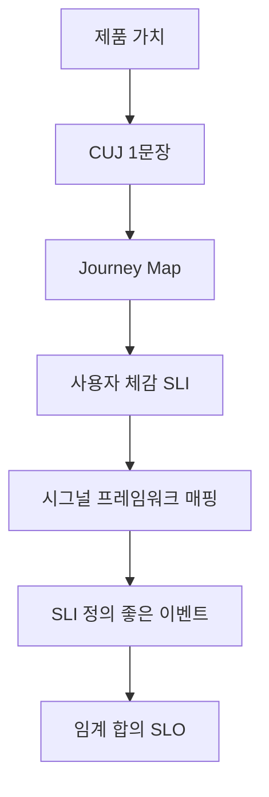

# SLI 선정

> **2026년의 자리**: SLI는 *위에서 아래로* 정한다 — 사용자 경험(CUJ)에서
> 출발해 시그널 프레임워크(4 Golden Signals·RED·USE)로 시스템 메트릭에
> 매핑. **모든 메트릭을 SLI화하지 않는다** — CUJ당 2~3개로 압축.
>
> 1~5인 환경에서는 **CUJ 1~2개 × SLI 2개**(Availability + Latency)로 시작.
> 시간이 지나며 Quality·Freshness 추가.

- **이 글의 자리**: [SLI·SLO·SLA](../principles/sli-slo-sla.md)에서 정의를
  배웠다면, 이 글은 *어떤 SLI를 고를 것인가*. 이후 [Burn Rate](slo-burn-rate.md)·
  [Error Budget 정책](error-budget-policy.md)으로 이어짐.
- **선행 지식**: SLI·SLO·SLA 개념, 4 Golden Signals 명칭.

---

## 1. 한 줄 정의

> **CUJ (Critical User Journey)**: 사용자가 *제품의 핵심 가치를 얻기 위해
> 거치는 흐름 한 줄*. SLI 선정의 출발점.
>
> **SLI 선정의 핵심**: CUJ → 사용자 경험 정의 → 시스템 메트릭 매핑.
> 시스템 메트릭에서 거꾸로 SLI를 만들면 "기술적으로 정확하지만 사용자
> 무관한" SLI가 나온다.

---

## 2. SLI 선정 프로세스 — 6단계



| 단계 | 산출물 | 시간 |
|:-:|---|---|
| 1 | **제품 가치 식별** | 0.5일 — "사용자는 왜 우리 서비스를 쓰는가" |
| 2 | **CUJ 한 문장** | 0.5일 — "사용자가 X 누르면 Y 안에 Z를 받는다" |
| 3 | **Journey Map** | 1일 — 단계별 시스템 호출 매핑 |
| 4 | **사용자 체감 SLI** | 1일 — 사용자 입장의 *좋음* 정의 |
| 5 | **시그널 프레임워크 매핑** | 0.5일 — 4 Golden / RED / USE |
| 6 | **임계 합의·문서화** | 0.5일 — 팀·경영진 합의 |

총 4~5일이면 잘 정의된 SLI 1세트 가능.

---

## 3. CUJ — 사용자 여정 매핑

### CUJ 작성 템플릿

```
[누가] [어떤 입력으로] [어떤 행동을 하면]
[어떤 시간 안에] [어떤 결과를] 받는다.
```

### CUJ 예시 (e-커머스)

| # | CUJ |
|:-:|---|
| 1 | 고객이 검색어를 입력하면 1초 안에 상품 목록을 받는다 |
| 2 | 고객이 결제 버튼을 누르면 5초 안에 영수증을 받는다 |
| 3 | 판매자가 상품을 등록하면 30초 안에 검색 결과에 노출된다 |
| 4 | 관리자가 환불 처리하면 즉시 고객에게 알림이 간다 |

### 좋은 CUJ의 특징

| 특징 | 의미 |
|---|---|
| **사용자 시점** | "API 5xx" X, "주문 완료" O |
| **측정 가능** | 시간·결과가 명확 |
| **비즈니스 영향** | 위반 시 누가 화나는지 명확 |
| **단일 책임** | 한 CUJ = 한 사용자 가치 |
| **간결성** | 한 문장 — 길어지면 분해 |

### 우선순위 — 모든 CUJ가 SLI로 가는 건 아니다

| 우선 | 기준 | 예시 |
|---|---|---|
| **P0** (필수 SLO) | 매출·핵심 가치 직결 | 결제, 검색, 로그인 |
| **P1** (선택 SLO) | 자주 쓰지만 핵심은 아님 | 추천, 리뷰 |
| **P2** (모니터링만) | 보조 기능 | 통계, 보고서 |
| **제외** | 트래픽 미미·관리자 전용 | 백오피스 일부 |

P0 → 5개 이내. SLO 너무 많으면 운영 불가능.

---

## 4. 4 Golden Signals — Google 표준

Google SRE Book *"Monitoring Distributed Systems"* 장의 4가지.

| 시그널 | 정의 | SLI 매핑 | 측정 예시 |
|---|---|---|---|
| **Latency** | 요청 응답 시간 | Latency SLI 직결 | p50·p95·p99 응답 시간 |
| **Traffic** | 시스템 부하·요구량 | 컨텍스트 (분모) | RPS, QPS, 동시 세션 수 |
| **Errors** | 실패 요청 비율 | Availability SLI 직결 | 5xx 비율, 비즈니스 실패 |
| **Saturation** | 리소스 포화도 | 선행 지표 (Capacity) | CPU·메모리 사용률, 큐 깊이 |

### 적용 대상

| 적용 | 무엇 |
|---|---|
| **사용자 대면 시스템** | 4가지 모두 |
| **내부 백엔드** | Latency·Errors 우선, Traffic·Saturation 보조 |
| **배치 작업** | Errors·Saturation·*시간 정합성* |

> Latency를 SLI로 만들 때는 **threshold-ratio** 형태 — *"p99가 300ms
> 이내인 요청의 비율"*. 직접 p99 자체를 SLI로 쓰면 SLO·에러 버짓 호환 X.

---

## 5. RED Method — Tom Wilkie의 마이크로서비스 모델

| 지표 | 정의 | 마이크로서비스에서 |
|---|---|---|
| **Rate** | 초당 요청 수 | 트래픽 (Golden Signals의 Traffic) |
| **Errors** | 초당 실패 수 | Availability SLI |
| **Duration** | 요청 지속 시간 분포 | Latency SLI |

### 4 Golden Signals와의 차이

| 측면 | 4 Golden | RED |
|---|---|---|
| **출처** | Google SRE Book | Tom Wilkie (Weaveworks) |
| **대상** | 모든 시스템 | 마이크로서비스·request-driven |
| **Saturation** | 포함 | 제외 (USE에 위임) |
| **간결성** | 4개 | 3개 |

### 언제 RED를 쓰나

- 마이크로서비스 아키텍처
- HTTP·gRPC 기반 request-response 모델
- Saturation은 USE로 별도 관리

---

## 6. USE Method — Brendan Gregg의 리소스 모델

| 지표 | 정의 | 측정 예시 |
|---|---|---|
| **Utilization** | 자원 사용률 (시간 대비) | CPU 사용률 80% |
| **Saturation** | 자원 포화 (대기 큐 깊이) | runqueue length, swap 사용 |
| **Errors** | 자원 에러 카운트 | Disk I/O 에러, NIC drop |

### 적용 대상

| 자원 | U | S | E |
|---|---|---|---|
| CPU | %busy | runqueue 길이 | 정정 가능 에러 |
| 메모리 | %used | swap 사용률, OOM 횟수 | OOM kill 카운트 |
| 디스크 | %busy (iostat) | I/O 큐 깊이 | I/O 에러 |
| 네트워크 | %대역폭 | 송수신 큐 backlog | 패킷 drop |

### USE는 SLI로 직접 쓰지 말 것

USE는 *진단 도구*이지 사용자 경험이 아니다. CPU 99% 인데 사용자가 만족하면
문제 없다. SLI로는 4 Golden·RED를 쓰고, USE는 *원인 분석*에 활용.

---

## 7. 시그널 프레임워크 비교

| 프레임워크 | 출처 | 대상 | 갯수 | SLI 적합도 |
|---|---|---|:-:|---|
| **4 Golden Signals** | Google SRE | 사용자 대면 시스템 | 4 | ★★★ 표준 |
| **RED** | Tom Wilkie | 마이크로서비스 | 3 | ★★★ 마이크로서비스 |
| **USE** | Brendan Gregg | 리소스·인프라 | 3 | ★ 진단 도구 |
| **Core Web Vitals** | Google | 프런트엔드 UX | 3 | ★★ 웹 UX |
| **L+E+T+S** | 4 Golden 별칭 | 동일 | 4 | ★★★ |

### Core Web Vitals — 웹 UX의 SLI

프런트엔드 SLO를 정의할 때.

| 지표 | 의미 | 임계 |
|---|---|---|
| **LCP** (Largest Contentful Paint) | 주 콘텐츠 렌더 시간 | 2.5초 이내 |
| **INP** (Interaction to Next Paint) | 입력 반응성 | 200ms 이내 |
| **CLS** (Cumulative Layout Shift) | 시각적 안정성 | 0.1 이하 |

> 2024년 3월 Google이 FID를 INP로 교체. 2026년 현재 Core Web Vitals 3종은
> LCP·INP·CLS.

---

## 8. SLI Specification vs Implementation

Google SRE Workbook이 강조하는 분리.

| 층 | 의미 | 예시 |
|---|---|---|
| **Specification** | *사용자 약속* — 자연어로 무엇이 좋은가 | "결제 요청이 5초 안에 200으로 응답한 비율" |
| **Implementation** | *메트릭 쿼리* — 실제 측정 방법 | `sum(rate(http_requests_total{job="pay",status="200",le="5"}[5m]))` |

같은 Spec에 Impl이 여러 개 가능 (RUM·LB·서비스 백엔드 각각). Spec이
바뀌면 *사용자 약속*이 바뀐 것이고, Impl만 바뀌면 *측정 정확도* 개선.

> **분리하는 이유**: 메트릭 백엔드 교체(Prometheus → Datadog)는 Impl
> 변경. SLO 약속이 바뀌지 않았는데 PromQL 변경을 *SLO 변경*으로 다루면
> 회의 비용 폭증.

---

## 9. Bonus — 비-요청 시스템의 SLI

배치·데이터 파이프라인·이벤트 시스템은 request-response 모델이 없다.
이때 SLI는 *시간 윈도 기반*으로 재정의.

| 시스템 종류 | 권장 SLI | 측정 |
|---|---|---|
| **배치 작업** (cron) | Coverage, Freshness | "지난 24h 작업 중 정시 완료 비율" |
| **스트리밍 파이프라인** | End-to-end Latency, Freshness | 이벤트 시간 - 처리 시간 (lag) |
| **데이터 웨어하우스** | Freshness, Correctness | "테이블이 X시간 이내 갱신된 비율" |
| **메시지 큐** | Backlog, Throughput | 큐 깊이, 처리 지연 |
| **Cron·스케줄러** | On-time success rate | "예정 시각 ±N분 내 시작 비율" |

### 비-요청 SLI의 특수 함정

| 함정 | 처방 |
|---|---|
| **분모 0** (트래픽 없음) | Window-based SLI — "정상 창의 비율" |
| **이벤트 도달 지연** | 처리 시간이 아닌 *이벤트 시간* 기준 |
| **데이터 정확성 vs 적시성 충돌** | 둘 다 SLI로 — Freshness + Correctness |
| **재처리 시 중복 카운트** | Idempotency key로 분모 보정 |

---

## 10. CUJ → SLI 매핑 — 결제 예시

### 단계별 매핑


| 단계 | 시스템 | SLI 후보 |
|---|---|---|
| 버튼 클릭 → 인증 | API Gateway | Availability·Latency |
| 인증 → 결제 게이트웨이 | Auth + PG | Availability·Latency |
| 결제 → 주문 생성 | Order Service | Availability·Quality (정확 합산) |
| 주문 생성 → 알림 | Notification | Freshness (5초 이내) |
| **전체 CUJ** | E2E | "5초 안에 영수증" — Composite SLI |

### Composite SLI — End-to-End 측정

전체 흐름을 한 SLI로 묶는 형태. 각 단계 SLI를 곱하지 않고, *진짜 E2E 측정*.

```promql
# 결제 CUJ 가용성 SLI
sum(rate(cuj_payment_total{status="success"}[5m]))
/
sum(rate(cuj_payment_total[5m]))
```

### Composite SLI의 함정

| 함정 | 의미 | 처방 |
|---|---|---|
| **원인 분석 어려움** | E2E만 보면 어느 단계 문제인지 안 보임 | 단계별 SLI 병행 유지 |
| **단일 단계 장애 묻힘** | 다른 단계 정상이면 평균에 묻혀 보임 | 단계별 SLO 별도 운영 |
| **비동기 흐름 부적합** | 응답 후 후속 처리 시 측정 시점 모호 | Freshness SLI로 분리 |
| **단계별 SLO 다를 때** | 가중 평균 의미 모호 | Composite 대신 단계별 |
| **측정 비용** | E2E correlation ID·tracing 필요 | OpenTelemetry 인프라 선행 |

> **권장**: 단계별 SLI(원인 분석) + CUJ 단위 Composite SLI(사용자 경험).
> 둘 중 하나만 쓰면 사각지대 발생. **단, 비동기·복잡한 흐름은 Composite
> 강행 금지** — 단계별로 운영.

---

## 11. SLI 측정 위치 — 어디서 측정할 것인가

| 위치 | 장점 | 단점 |
|---|---|---|
| **클라이언트 (RUM)** | 실제 사용자 경험 | 데이터 정합성·구현 비용 |
| **CDN·LB** | 안정적, 인프라 가까움 | 클라이언트 네트워크 못 봄 |
| **API Gateway** | 단일 측정 지점 | 게이트웨이 우회 트래픽 누락 |
| **Service Mesh / eBPF** | 사이드카리스, 코드 수정 X | 인프라 의존성 |
| **백엔드 서비스** | 서비스 단위 측정 | 사용자 경험과 거리 |
| **합성 모니터링** | 트래픽 0일 때도 OK | 진짜 사용자 안 봄 |

> **권장 조합**: RUM(실측) + 합성(기본선). API Gateway·Service Mesh는
> 단순 시작 시 충분. Cilium·Istio 운영 환경이면 mesh 메트릭 적극 활용.

---

## 12. SLO 임계 vs 알람 임계 — 분리해야 한다

| 구분 | 의미 | 임계 |
|---|---|---|
| **SLO 임계** | 사용자 약속 | 99.9% (월간 30일) |
| **알람 임계** | 페이저 발동 기준 | Burn Rate 기반 — 1h·6h 다중 창 |

> **잘못된 패턴**: "현재 가용성이 99.9% 미만이면 페이지" — 이미 SLO 위반
> 후 알람. 사고 인지가 *늦음*.
>
> **올바른 패턴**: Burn Rate 14.4× 상태가 1시간 지속되면 페이지 — SLO
> 위반 *전*에 인지.
>
> 자세한 내용: [SLO Burn Rate](slo-burn-rate.md).

---

## 13. 안티패턴 — 흔한 잘못된 SLI

| 안티패턴 | 증상 | 처방 |
|---|---|---|
| **CPU 99%를 SLI로** | 사용자 무관 — USE 진단 지표 | 사용자 SLI(Latency·Error) 사용 |
| **모든 엔드포인트 SLI화** | 운영 부담 폭증 | CUJ → P0 5개 이내 |
| **`p99 < 300ms` 자체 SLI** | SLO와 호환 X | "p99 ≤ 300ms 인 요청 비율" |
| **DB 응답 시간 SLI** | 사용자 경험 무관 | 서비스 응답 시간 SLI |
| **5xx만 Errors** | 비즈니스 실패 누락 | 5xx + 비즈니스 실패 코드 |
| **트래픽 0 시 100%** | 분모 0 함정 | Window-based SLI 또는 합성 보강 |
| **합성 모니터링만** | 진짜 사용자 못 봄 | RUM 추가 |

---

## 14. SLI 정의 작성 체크리스트

| 체크 | 질문 |
|---|---|
| [ ] **CUJ 출발** | 어떤 사용자 여정인가? |
| [ ] **좋은 이벤트 명문화** | 무엇이 *good*인가? (코드·시간·결과) |
| [ ] **유효 이벤트 명문화** | 무엇이 *valid*인가? (분모) |
| [ ] **측정 위치** | 어디서 측정? RUM·LB·서비스? |
| [ ] **시간 창** | 30일 rolling? Calendar? |
| [ ] **SLO 임계** | 99.5%? 99.9%? 합의된 근거? |
| [ ] **Error Budget** | 잔량 시각화? 알람 정책? |
| [ ] **소유자** | 누가 책임지는가? |
| [ ] **변경 절차** | 임계 변경 시 누가 승인? |
| [ ] **검토 주기** | 분기 1회 검토? |

---

## 15. 1~5인 팀의 SLI 시작 — 1주차 플랜

| 일 | 산출물 |
|:-:|---|
| **1일** | CUJ 1개 한 문장 + 단계별 시스템 매핑 |
| **2일** | 4 Golden Signals 매핑 — Latency·Errors 위주 |
| **3일** | SLI 정의 (good_event·valid_event YAML) |
| **4일** | Prometheus·Grafana 대시보드 |
| **5일** | 팀 합의 — SLO 임계, 정책 |

> 첫 주 산출물: CUJ 1개 + Availability SLI + Latency SLI + 대시보드.
> 다음 주: Burn Rate 알람.

---

## 16. SLI 카탈로그 — 도메인별 출발점

| 도메인 | 권장 SLI 2~3개 |
|---|---|
| **REST API** | Availability(5xx 제외 비율) + Latency(p95 임계 ratio) |
| **GraphQL** | Availability + Latency + 부분 응답 Quality |
| **검색** | Availability + Latency + Quality (빈 배열 아님 비율) |
| **결제** | Availability + Latency + Correctness (합산 정확) |
| **메시징** | Availability + Freshness (지연 수신율) |
| **배치** | Coverage(완료율) + Freshness (최신성) + Errors |
| **데이터 파이프라인** | Freshness + Coverage + Quality |
| **CDN·정적 자원** | Availability + Latency (TTFB) |
| **DB** | Availability + Latency + Throughput |
| **CI/CD** | Build success rate + Build time + Failed Deployment Recovery Time |
| **프런트엔드** | LCP + INP + CLS (Core Web Vitals) |

---

## 17. 한눈에 보기

| 항목 | 한 줄 |
|---|---|
| **SLI 출발** | CUJ — 사용자 경험에서 시작 |
| **시그널 프레임워크** | 4 Golden(표준) / RED(마이크로서비스) / USE(진단) |
| **개수 압축** | CUJ당 2~3개, P0 SLO 5개 이내 |
| **Latency SLI** | "p99 ≤ Xms 인 요청의 비율" — threshold-ratio |
| **측정 위치** | RUM + LB·Gateway 조합 |
| **함정 1** | 모든 메트릭 SLI화 → CUJ 압축 |
| **함정 2** | 시스템 시점 SLI → 사용자 시점으로 |
| **시작 키트** | CUJ 1개 + Availability + Latency + 대시보드 (1주) |

---

## 참고 자료

- [Google SRE Book — Monitoring Distributed Systems (4 Golden Signals)](https://sre.google/sre-book/monitoring-distributed-systems/) (확인 2026-04-25)
- [Google SRE Workbook — Implementing SLOs](https://sre.google/workbook/implementing-slos/) (확인 2026-04-25)
- [Tom Wilkie — RED Method](https://thenewstack.io/monitoring-microservices-red-method/) (확인 2026-04-25)
- [Brendan Gregg — USE Method](https://www.brendangregg.com/usemethod.html) (확인 2026-04-25)
- [Google — Core Web Vitals](https://web.dev/vitals/) (확인 2026-04-25)
- [Mercari Engineering — User Journey SLOs E2E Testing](https://engineering.mercari.com/en/blog/entry/20241204-keeping-user-journey-slos-up-to-date-with-e2e-testing-in-a-microservices-architecture/) (확인 2026-04-25)
- [Splunk — Monitoring Critical User Journeys](https://www.splunk.com/en_us/blog/observability/monitoring-critical-user-journeys.html) (확인 2026-04-25)
