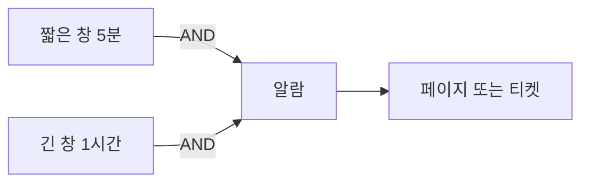
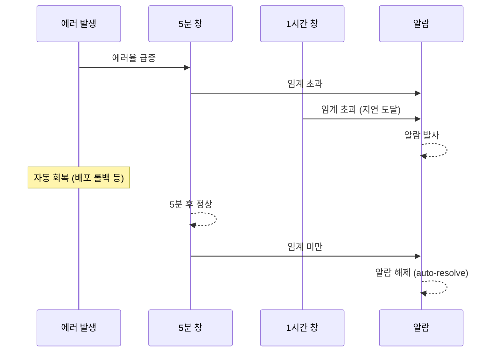

# SLO Burn Rate

> **2026년의 자리**: Burn Rate는 *"에러 버짓을 얼마나 빠르게 태우고
> 있는가"*. Google SRE Workbook의 **Multi-Window, Multi-Burn-Rate (MWMBR)**
> 알람이 산업 표준. Sloth·Pyrra·OpenSLO·GCP·Datadog·Grafana 모두 이 모델을
> 채택. *임계 위반 알람*이 아니라 *소진 속도 알람*으로 패러다임 전환.
>
> 1~5인 환경에서도 MWMBR이 **다른 알람 모델보다 단순하고 효과적**. 처음
> 도입 시 4~6개 알람으로 충분.

- **이 글의 자리**: [SLI 선정](sli-selection.md)으로 SLI를 정의했다면, 이 글은
  *어떻게 알람을 걸 것인가*. 다음 글 [Error Budget 정책](error-budget-policy.md)으로 이어짐.
- **선행 지식**: SLI·SLO·SLA, Error Budget 개념.

---

## 1. 한 줄 정의

> **Burn Rate**: "현재 소진 속도를 *1× = SLO 시간 창 정확히 다 쓰는 속도*
> 로 정규화한 배수." 1× = 정상, 14.4× = 1시간에 *월 에러 버짓 2%* 소진.

```
Burn Rate = (현재 에러율) / (1 - SLO)

예시: SLO 99.9% (에러 허용 0.1%), 현재 에러율 1.44%
→ Burn Rate = 1.44% / 0.1% = 14.4×
```

---

## 2. 왜 Burn Rate인가

### 임계 알람의 문제

전통적 알람: "에러율 1% 초과 시 알람".

| 문제 | 증상 |
|---|---|
| **Slow burn 못 잡음** | 1% 직전(0.99%) 1주일 → 알람 X, 버짓 70% 소진 |
| **Spike에 흔들림** | 1분 1% 초과로 알람 → 자동 회복인데 페이지 |
| **SLO 무관** | SLO 99.9%여도 99% 던 99.99%던 임계 동일 |

### Burn Rate 알람의 핵심

| 가치 | 의미 |
|---|---|
| **SLO 정렬** | SLO 99.9%·99.99% 차등 자동 반영 |
| **속도 기반** | 빠른 소진 = 큰 사고, 느린 소진 = 작은 누수 |
| **다중 창** | 짧은 창(빠른 인지) + 긴 창(노이즈 필터) |
| **버짓 보호** | "X% 소진 전에 인지" — 정량적 약속 |

---

## 3. 핵심 공식

### Burn Rate 정의

```
Burn Rate = (실제 에러율) / (허용 에러율)

허용 에러율 = 1 - SLO
ex) SLO 99.9% → 허용 0.1%
```

### Burn Rate ↔ "버짓 X% 소진까지 남은 시간"

```
시간 = (소진 비율) × (전체 SLO 창) / Burn Rate

예: SLO 30일, 2% 소진 임계, Burn Rate 14.4×
→ 시간 = 0.02 × 30일 / 14.4 = 1시간
```

### 표준 환산표 (SLO 30일 창 기준)

| Burn Rate | 1시간 동안 소진 | 6시간 | 3일 |
|---:|---:|---:|---:|
| 1× | 0.14% | 0.83% | 10% |
| **2×** | 0.28% | 1.67% | **20%** |
| **6×** | 0.83% | **5%** | 60% |
| **14.4×** | **2%** | 12% | 144% |
| 36× | 5% | 30% | — |
| 144× | 20% | — | — |

> 14.4× = 1시간에 2% 소진. 36× = 1시간에 5% 소진. 144× = 1시간에 20%
> 소진 — 거의 *지금 다운*. SLO 99%든 99.99%든 동일하게 적용.

---

## 4. Multi-Window, Multi-Burn-Rate (MWMBR) — Google 표준

### 단일 창의 함정

| 창 | 함정 |
|---|---|
| **짧은 창만** (5m·1h) | 노이즈에 흔들림, 자동 회복도 페이지 |
| **긴 창만** (1d·3d) | 사고 인지 너무 늦음 |

### MWMBR의 해법

**짧은 창 + 긴 창 둘 다 임계 초과** 시에만 알람. 짧은 창이 회복하면
자동 해제 (auto-resolve). 노이즈 필터 + 빠른 인지 동시 달성.



---

## 5. SRE Workbook 3단계 (Algorithm 6) — 표준

Google SRE Workbook *"Alerting on SLOs"* §6 (Alternative 6)이 제시하는
**"Multi-window, Multi-burn-rate alerts"**의 권장 임계.

| 등급 | 짧은 창 | 긴 창 | Burn Rate | 조치 | 의미 |
|:-:|---|---|---:|---|---|
| **Page (Fast)** | 5분 | 1시간 | **14.4×** | 페이저 | 1h에 월 버짓 2% 소진 |
| **Page (Slow)** | 30분 | 6시간 | **6×** | 페이저 | 6h에 월 버짓 5% 소진 |
| **Ticket** | 2시간 | 3일 | **1×** | 티켓 | 3일에 10% 소진 — 누수 점검 |

### 왜 14.4·6·1인가 (수학적 유도)

```
Burn Rate = 소진_비율 × (전체_SLO창 / 알람창)
```

| 값 | 유도 | 의미 |
|---:|---|---|
| **14.4×** | 0.02 × (30d / 1h) = 14.4 | 1h에 월 버짓 2% 소진 |
| **6×** | 0.05 × (30d / 6h) = 6 | 6h에 월 버짓 5% 소진 |
| **1×** | 0.1 × (30d / 72h) ≈ 1 | 3d에 10% 소진 |

### Sloth/Pyrra의 4단계 확장 (실무 표준)

오픈소스 도구는 위 3단계에 *24h 창 ticket 알람*을 추가해 4단계로 운영하는
경우가 많다.

| 등급 | 창 | Burn Rate | 출처 |
|:-:|---|---:|---|
| Page Fast | 5m·1h | 14.4× | SRE Workbook |
| Page Slow | 30m·6h | 6× | SRE Workbook |
| **Ticket Fast** (확장) | 2h·1d | **3×** | Sloth·Pyrra 기본값 |
| Ticket Slow | 6h·3d | 1× | SRE Workbook |

> 본 글의 PromQL 예시는 Sloth/Pyrra 호환의 4단계로 작성. Workbook 정전
> 따르려면 3×는 생략.

---

## 6. Detection Time vs Reset Time — 정량

| 단계 | 짧은 창 | 긴 창 | Burn Rate | Detection time¹ | Reset time² |
|:-:|---|---|---:|---|---|
| Page Fast | 5m | 1h | 14.4× | ~2.4분 | ~5분 |
| Page Slow | 30m | 6h | 6× | ~30분 | ~30분 |
| Ticket Slow | 6h | 3d | 1× | ~6h | ~6h |

¹ Detection time = 사고가 *지속*된 후 알람 발사까지의 시간. 짧은 창의
약 (1 / Burn Rate × 짧은 창) 어림.
² Reset time = 회복 후 알람 해제까지의 시간. **짧은 창 길이로 상한이
정해짐** — 짧은 창의 본질적 역할.

> 짧은 창은 detection time 단축뿐 아니라 *reset time을 짧은 창 길이로
> bound*하는 게 핵심. 단일 창(긴 창만)이면 회복 후에도 긴 창이 클리어될
> 때까지 알람이 남아 있다.

---

## 7. Precision vs Recall — 알람 트레이드오프

SRE Workbook은 알람 알고리즘을 두 축으로 평가.

| 축 | 의미 | 길수록 |
|---|---|---|
| **Precision** | 알람 중 *진짜 문제* 비율 | 알람 창 길수록 ↑ (false positive ↓) |
| **Recall** | *진짜 문제* 중 알람 발사 비율 | 알람 창 길수록 ↑ (false negative ↓) |
| **Detection time** | 사고 → 알람 시간 | 알람 창 길수록 ↑ (느려짐) |
| **Reset time** | 회복 → 알람 해제 시간 | 짧은 창 길수록 ↑ (느려짐) |

| 알고리즘 | Precision | Recall | Detection | Reset |
|---|---|---|---|---|
| Target error rate (단순 임계) | 낮음 | 낮음 | 빠름 | 빠름 |
| Increased Window | 낮음 | 높음 | 느림 | 느림 |
| Multi-window | 높음 | 높음 | 빠름 | 빠름 |
| **MWMBR (§6)** | **높음** | **높음** | **빠름** | **빠름** |

> SRE Workbook이 6번째를 "**The recommended option**"이라 부르는 이유.
> 4축 모두 우수.

---

## 8. PromQL 예시 — MWMBR 알람 (4단계)

### SLI 정의 (Recording Rule)

```yaml
# slo-rules.yml
groups:
  - name: slo:payment-availability
    interval: 30s
    rules:
      # 5분 창 에러율
      - record: slo:sli_error:ratio_rate5m
        expr: |
          sum(rate(http_requests_total{job="payment",code=~"5.."}[5m]))
          /
          sum(rate(http_requests_total{job="payment"}[5m]))

      # 1시간·6시간·1일·3일 창 동일하게 정의
      - record: slo:sli_error:ratio_rate1h
        expr: |
          sum(rate(http_requests_total{job="payment",code=~"5.."}[1h]))
          /
          sum(rate(http_requests_total{job="payment"}[1h]))
      # ... 6h, 1d, 3d
```

### 알람 정의 (4단계)

```yaml
# slo-alerts.yml
groups:
  - name: slo-alerts:payment
    rules:
      # Tier 1 Page: 14.4× burn rate, 5m AND 1h
      - alert: PaymentSLOFastBurn
        expr: |
          (
            slo:sli_error:ratio_rate5m > (14.4 * 0.001)  # 0.001 = 1 - 0.999 SLO
            and
            slo:sli_error:ratio_rate1h > (14.4 * 0.001)
          )
        for: 2m
        labels:
          severity: page
          slo: payment-availability
        annotations:
          summary: "Payment SLO fast burn — 1h에 2% 소진"
          runbook: "https://wiki.example.com/runbooks/payment-slo"

      # Tier 2 Page: 6× burn rate, 30m AND 6h
      - alert: PaymentSLOMediumBurn
        expr: |
          (
            slo:sli_error:ratio_rate30m > (6 * 0.001)
            and
            slo:sli_error:ratio_rate6h > (6 * 0.001)
          )
        for: 15m
        labels:
          severity: page

      # Tier 3 Ticket: 3× burn rate, 2h AND 1d
      - alert: PaymentSLOSlowBurn
        expr: |
          (
            slo:sli_error:ratio_rate2h > (3 * 0.001)
            and
            slo:sli_error:ratio_rate1d > (3 * 0.001)
          )
        for: 1h
        labels:
          severity: ticket

      # Tier 4 Ticket: 1× burn rate, 6h AND 3d
      - alert: PaymentSLOSteadyBurn
        expr: |
          (
            slo:sli_error:ratio_rate6h > (1 * 0.001)
            and
            slo:sli_error:ratio_rate3d > (1 * 0.001)
          )
        for: 3h
        labels:
          severity: ticket
```

> Sloth·Pyrra가 위 boilerplate를 자동 생성. 직접 작성보다 도구 사용 권장.

---

## 9. Latency SLI의 Burn Rate

Threshold-ratio 형식 SLI는 동일 공식 적용.

```promql
# "p95 ≤ 300ms 인 요청 비율" SLI
- record: slo:sli_bad:latency_rate5m
  expr: |
    sum(rate(http_request_duration_seconds_bucket{job="payment",le="0.3"}[5m]))
    /
    sum(rate(http_request_duration_seconds_count{job="payment"}[5m]))
    < bool 0.95   # 95% 이하면 bad
```

또는 Latency SLI를 *직접 에러로 카운트*:

```promql
# "300ms 초과 요청 = bad event"
sum(rate(http_request_duration_seconds_count[5m]))
-
sum(rate(http_request_duration_seconds_bucket{le="0.3"}[5m]))
```

> **Long-tail 함정**: latency 분포가 long-tail로 변하는 사고에선 5m 창이
> 너무 좁아 *튀는 P99* 한두 번에 false positive. Page Fast 알람은
> latency보다 availability에 우선 적용하고, latency는 6h 창부터 운영하는
> 팀이 많다.

---

## 10. 알람 대시보드 — 시각적으로

| 패널 | 표시 |
|---|---|
| **현재 Burn Rate** | 4단계 (1×·3×·6×·14.4×) 임계선 표시 |
| **에러 버짓 잔량** | 시간 창별 — % 막대 |
| **Burn Rate 시계열** | 5m·1h·6h·1d 4선 |
| **소진 트렌드** | 현 추세 유지 시 며칠 후 100% 소진 |

> Grafana SLO 대시보드 템플릿: Sloth·Pyrra·OpenSLO 모두 제공.

---

## 11. Auto-Resolve 동작

MWMBR의 또 다른 강점.



> 짧은 창이 *회복 신호* 역할. 단일 창 알람보다 *훨씬 자연스러운 알람
> 라이프사이클*.

---

## 12. 안티패턴 — 흔한 실수

| 안티패턴 | 증상 | 처방 |
|---|---|---|
| **임계 알람 (`error_rate > 1%`)** | Slow burn 누락, Spike 흔들림 | MWMBR로 전환 |
| **Burn Rate 단일 창** | 노이즈 / 인지 지연 둘 중 하나 | 다중 창 (짧+긴) |
| **모든 알람 페이지** | 알람 피로, 진짜 사고 묻힘 | 4단계 — Page·Ticket 분리 |
| **`for: 0`** | Spike 흔들림 | `for: 2m` 정도 |
| **`for: 1h` 너무 김** | 인지 늦음 — 짧은 창 5m + `for: 1h` = 실효 detection 1h 5m | 짧은 창 자체가 필터, `for`는 짧게 (1~3분) |
| **Burn Rate 임계 너무 낮음** | False positive 폭주 | 14.4·6·3·1 권장값 |
| **소진율 100% 가까이 임계** | 이미 SLO 위반 | 2~10% 소진 시점 알람 |

---

## 13. Sloth·Pyrra·OpenSLO — 도구

| 도구 | 입력 | 출력 |
|---|---|---|
| **[Sloth](https://sloth.dev)** | YAML 정의 | Prometheus rules + Grafana 대시보드 |
| **[Pyrra](https://github.com/pyrra-dev/pyrra)** | K8s CRD (`PrometheusRule`) | 자동 알람 + UI |
| **[OpenSLO](https://openslo.com)** | OpenSLO YAML | 멀티 백엔드 (Sloth·Datadog·Cloud Monitoring) |
| **[slo-generator (Google)](https://github.com/google/slo-generator)** | YAML | 멀티 백엔드 |

### Sloth 예시

```yaml
version: "prometheus/v1"
service: "payment"
slos:
  - name: "availability"
    objective: 99.9
    description: "결제 API 가용성"
    sli:
      events:
        error_query: 'sum(rate(http_requests_total{job="payment",code=~"5.."}[{{.window}}]))'
        total_query: 'sum(rate(http_requests_total{job="payment"}[{{.window}}]))'
    alerting:
      page_alert:
        labels:
          severity: page
      ticket_alert:
        labels:
          severity: ticket
```

→ `sloth generate` 실행하면 4단계 MWMBR 알람 + Recording rules 자동 생성.

---

## 14. 1~5인 팀의 Burn Rate 도입 — 1주차 플랜

| 일 | 산출물 |
|:-:|---|
| **1일** | Sloth 또는 Pyrra 설치, 첫 SLO 정의 |
| **2일** | Recording rules 검증 (PromQL 결과값) |
| **3일** | 4단계 알람 적용 — 처음엔 Slack 채널만, 페이저 X |
| **4일** | 1~2일 관찰 — false positive·negative 점검 |
| **5일** | 임계 미세 조정 — 14.4·6·3·1 시작값에서 큰 변경 X |

> **첫 주는 페이저 OFF**. Slack·Teams 알람만 받아 분석. 안정화 후 페이저
> 연결.

---

## 15. 한눈에 보기

| 항목 | 한 줄 |
|---|---|
| **Burn Rate** | 현재 소진 속도 / 1× (SLO 창 정상 소진 속도) |
| **표준 모델** | MWMBR — 짧은 창 AND 긴 창 |
| **SRE Workbook 3단계** | 14.4×(5m·1h) / 6×(30m·6h) / 1×(2h·3d) |
| **Sloth·Pyrra 4단계** | 위 3단계 + 3×(2h·1d) — 실무 표준 |
| **Page vs Ticket** | 14.4×·6× = 페이저, 3×·1× = 티켓 |
| **Detection·Reset** | 짧은 창이 reset time 상한 — 핵심 |
| **임계 알람 금지** | `error_rate > 1%` 식 알람 → MWMBR로 |
| **Auto-resolve** | 짧은 창 회복 시 자동 해제 |
| **도구** | Sloth·Pyrra·OpenSLO·slo-generator |
| **시작** | Sloth 1주 도입, 페이저 OFF로 1주 관찰 후 ON |

---

## 참고 자료

- [Google SRE Workbook — Alerting on SLOs](https://sre.google/workbook/alerting-on-slos/) (확인 2026-04-25)
- [Google Cloud — Alerting on Burn Rate](https://docs.cloud.google.com/stackdriver/docs/solutions/slo-monitoring/alerting-on-budget-burn-rate) (확인 2026-04-25)
- [Grafana Labs — Multi-Window Multi-Burn-Rate Alerts](https://grafana.com/blog/how-to-implement-multi-window-multi-burn-rate-alerts-with-grafana-cloud/) (확인 2026-04-25)
- [Datadog — Burn Rate Alerts](https://docs.datadoghq.com/service_management/service_level_objectives/burn_rate/) (확인 2026-04-25)
- [Sloth Documentation](https://sloth.dev) (확인 2026-04-25)
- [Pyrra GitHub](https://github.com/pyrra-dev/pyrra) (확인 2026-04-25)
- [OpenSLO Specification](https://openslo.com) (확인 2026-04-25)
